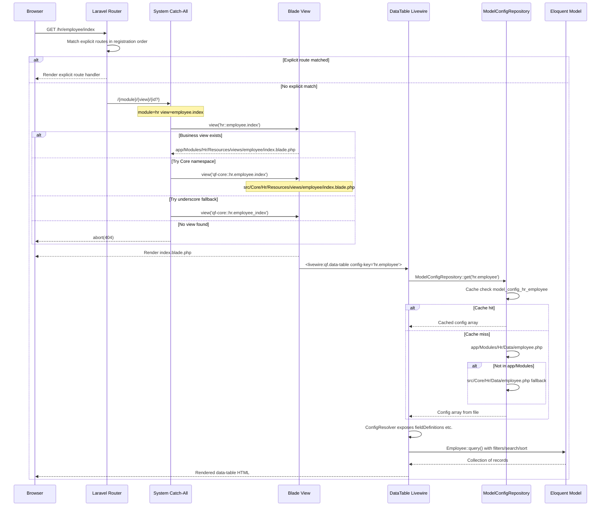

# QuickerFaster UI Library — View / Config / Routing Interplay

> **Package**: `quicker-faster/ui-library`
> **Namespace**: `QuickerFaster\UILibrary\`
> **Last Updated**: 2026-08-14

**Related files**: [`00-index.md`](./00-index.md) · [`04-routing-and-views.md`](./04-routing-and-views.md) · [`05-data-configs.md`](./05-data-configs.md) · [`03-module-pattern.md`](./03-module-pattern.md) · [`13-adr.md`](./13-adr.md) · [`../architecture-discrepancy-analysis.md`](../architecture-discrepancy-analysis.md)

---

## Overview — The "Rosetta Stone"

This file is **the most important cross-cutting documentation** in the library. It traces the complete flow from a URL request through route resolution, view rendering, and data-config consumption. Read it **before modifying routes, views, or data configs** — these three systems are tightly coupled by two architecture decisions:

- **ADR-001** ([`13-adr.md`](./13-adr.md)) — Catch-all routing instead of explicit route definitions
- **ADR-002** ([`13-adr.md`](./13-adr.md)) — Config-driven DataTables/Forms/Details share a single config source

The interplay is captured in the [`00-index.md` Relationship Map`](./00-index.md) and synthesized here from the live source files.

---

## 1. Complete Request Lifecycle

The full journey of a request like `GET /hr/employee/index`:

```
1. URL REQUEST
   Browser → GET /hr/employee/index
        │
2. ROUTE MATCH
   Laravel iterates registered routes in registration order:
   a. Library routes (src/Routes/web.php)         — no match
   b. Core module routes (src/Core/*/Routes)      — no match
   c. Business module routes (app/Modules/*)      — no match
   d. System catch-all (loaded LAST)              — MATCHES
      /{module}/{view}/{id?} → module=hr, view=employee.index
        │
3. VIEW RESOLUTION
   Catch-all closure tries, in order:
   a. view('hr::employee.index')                  → app/Modules/Hr/Resources/views/employee/index.blade.php
   b. view('qf-core::hr.employee.index')          → src/Core/Hr/Resources/views/employee/index.blade.php
   c. view('qf-core::hr.employee_index')          → underscore fallback
   d. abort(404)
        │
4. VIEW CONTENT
   index.blade.php typically contains:
   <x-layout configKey="hr_employee" moduleName="hr">
       <livewire:qf.data-table config-key="hr.employee" />
   </x-layout>
        │
5. DATATABLE MOUNT
   DataTable::mount('hr.employee')
        │
6. CONFIG LOAD
   ModelConfigRepository::get('hr.employee')
   → app/Modules/Hr/Data/employee.php (or src/Core fallback)
   → ConfigResolver exposes typed accessors
        │
7. MODEL QUERY
   ConfigResolver::getModel() → App\Modules\Hr\Models\Employee
   Eloquent query builder applies filters, search, sort
        │
8. RENDER
   DataTable renders columns from fieldDefinitions
```

Each step is expanded in the sections below.

---

## 2. View Namespace Resolution

Three namespace families coexist:

| Source | Namespace | Example | Registered by |
|--------|-----------|---------|---------------|
| Library views (`src/Resources/views/`) | `qf` | `view('qf::layouts.app')` | [`UILibraryServiceProvider::registerViews()`](../../src/Providers/UILibraryServiceProvider.php:194) |
| Core module views (`src/Core/*/Resources/views/`) | `qf-core` | `view('qf-core::system.dashboard')` | [`UILibraryServiceProvider::bootCoreModules()`](../../src/Providers/UILibraryServiceProvider.php:153) |
| Business module views (`app/Modules/*/Resources/views/`) | lowercase module name | `view('hr::dashboard')` | [`ModuleServiceProvider::discoverBusinessModules()`](../../src/Providers/ModuleServiceProvider.php:28) |

### 2.1 The catch-all resolution chain

From [`src/Core/System/Routes/web.php`](../../src/Core/System/Routes/web.php:16):

```php
Route::get('/{module}/{view}/{id?}', function ($module, $view, $id = null) {
    $viewName = "{$module}::{$view}";                 // 1. business namespace
    if (view()->exists($viewName)) {
        return view($viewName, ['id' => $id]);
    }

    $coreViewName = "qf-core::{$module}.{$view}";     // 2. core namespace
    if (view()->exists($coreViewName)) {
        return view($coreViewName, ['id' => $id]);
    }

    $underscoreView = str_replace('-', '_', $view);   // 3. underscore fallback
    $coreViewNameUnderscore = "qf-core::{$module}.{$underscoreView}";
    if (view()->exists($coreViewNameUnderscore)) {
        return view($coreViewNameUnderscore, ['id' => $id]);
    }

    abort(404, "View [{$viewName}] not found.");
})->where('module', '[a-z-]+')->where('view', '[a-z-]+')->where('id', '[0-9]+');
```

**Key mechanics**:
- The `{module}::{view}` path resolves **business module views first**.
- The `qf-core::{module}.{view}` path is the **Core module fallback** — Core views share one namespace, with the module name as the first path segment (e.g., `qf-core::admin.dashboard` → `src/Core/Admin/Resources/views/admin/dashboard.blade.php`).
- The underscore fallback handles view names like `business-units` → `business_units` when the filename uses underscores.
- Parameters are constrained (`[a-z-]+` / `[0-9]+`) to prevent traversal, but there is **no module allow-list** — see [`15-gaps-and-recommendations.md`](./15-gaps-and-recommendations.md) §10.7.

---

## 3. Data Config Resolution

### 3.1 Dot-notation key → file path

[`ModelConfigRepository`](../../src/Services/Config/ModelConfigRepository.php) translates a config key into a file path. From the live source, the resolution now uses **dual-location search with progressive path fallback**:

```
ModelConfigRepository::get('hr.employee')
    │
    ├─ Cache check: Cache::rememberForever('model_config_hr_employee')
    │   └─ Cache hit → return cached array
    │
    └─ Cache miss → loadFromFile('hr.employee')
            │
            ├─ Split key: ['hr', 'employee']
            ├─ Module: ucfirst('hr') → 'Hr'
            ├─ Base paths (in priority order):
            │    1. app_path('Modules')                      // business (wins)
            │    2. vendor/.../src/Core                       // core (fallback)
            │
            ├─ Exact path search:
            │    app/Modules/Hr/Data/employee.php             (try first)
            │    src/Core/Hr/Data/employee.php                (try second)
            │
            ├─ Progressive fallback (strip intermediate segments):
            │    For 'admin.dashboards.dashboard':
            │       app/Modules/Admin/Data/dashboards/dashboard.php
            │       src/Core/Admin/Data/dashboards/dashboard.php
            │       app/Modules/Admin/Data/dashboard.php       (stripped)
            │       src/Core/Admin/Data/dashboard.php          (stripped ✓)
            │
            ├─ Found → require $filePath → cache → return
            └─ Not found → throw InvalidArgumentException (with searched paths)
```

### 3.2 The historical limitation (now resolved)

The original blueprint documented `ModelConfigRepository` as **"only scans `app/Modules/`"**. The [`architecture-discrepancy-analysis.md`](../architecture-discrepancy-analysis.md) identified this as the **single most critical architectural gap**:

- The repository hardcoded `app/Modules/` as the sole base path, so Core modules (in `src/Core/`) had no way to resolve Data configs.
- `ModuleServiceProvider::registerModuleConfigs()` scanned **both** `src/Core` and `app/Modules` for *dashboard* and *report* configs, but the repository itself did not.

This was **resolved on 2026-08-12** ([`implementation-plan.md`](../implementation-plan.md) §0.10): `ModelConfigRepository` now maintains `$basePaths` as a priority-ordered array `[app/Modules, src/Core]`, plus progressive path fallback. The behavior is transparent — config keys like `admin.user` now resolve to `src/Core/Admin/Data/user.php` with no consumer change.

### 3.3 ConfigResolver typed accessors

[`ConfigResolver`](../../src/Services/Config/ConfigResolver.php) wraps the raw config array with typed accessors consumed by DataTable, DataTableForm, and DataTableDetail. The complete schema is documented in [`05-data-configs.md`](./05-data-configs.md).

---

## 4. The Core-Module Gap

The gap surfaced by the discrepancy analysis was:

> Core modules (Admin, System, Organization) live in `src/Core/`, not `app/Modules/`. If `ModelConfigRepository` only scans `app/Modules/`, then `<livewire:qf.data-table config-key="admin.user" />` would fail because `app/Modules/Admin/Data/user.php` does not exist.

**Status as of 2026-08-12 — RESOLVED**, via two complementary fixes:

| Fix | Detail |
|-----|--------|
| **Dual-location resolution** | [`ModelConfigRepository`](../../src/Services/Config/ModelConfigRepository.php:16) `$basePaths` now includes `src/Core` as a fallback |
| **Core Data configs created** | Context-group overview Data configs created for Admin, System, Organization (see [`implementation-plan.md`](../implementation-plan.md) §0.11) |

The resolution is documented in [`architecture-discrepancy-analysis.md`](../architecture-discrepancy-analysis.md) Appendix B. The remaining Core-module incompleteness (missing Livewire components, controllers, models) is tracked there under §3 and in [`../phase-4.1-organization-extraction-spec.md`](../phase-4.1-organization-extraction-spec.md).

---

## 5. Catch-All vs Explicit-Route Precedence

Precedence is determined purely by **route registration order**, not by pattern specificity or priority attributes.

### 5.1 Registration order

From [`ModuleServiceProvider::discoverBusinessModules()`](../../src/Providers/ModuleServiceProvider.php:28) and [`UILibraryServiceProvider::boot()`](../../src/Providers/UILibraryServiceProvider.php:100):

1. **Library routes** — [`src/Routes/web.php`](../../src/Routes/web.php), loaded by `UILibraryServiceProvider::boot()`
2. **Core module routes** — `src/Core/{Admin,System,Organization}/Routes/web.php`, loaded by `UILibraryServiceProvider::bootCoreModules()`
3. **Business module web routes** — `app/Modules/*/Routes/web.php`, loaded per-module in `discoverBusinessModules()`
4. **Business module API routes** — `app/Modules/*/Routes/api.php` (with `api` prefix + middleware)
5. **System catch-all** — loaded **LAST**, explicitly at the end of `discoverBusinessModules()`:
   ```php
   // Load System catch-all route LAST (from Core, not app/Modules)
   $systemCatchAll = base_path('vendor/quicker-faster/ui-library/src/Core/System/Routes/web.php');
   if (file_exists($systemCatchAll)) {
       \Route::middleware('web')->group($systemCatchAll);
   }
   ```

### 5.2 Why it matters

Laravel matches routes in the order they were registered. Because the catch-all `/{module}/{view}/{id?}` is registered **last**, any explicit route defined earlier (e.g., `Route::get('/hr/employee/special')`) wins. If the catch-all were registered first, it would swallow explicit module routes.

The catch-all therefore only fires when **no explicit route matched**. It is the safety net for convention-based view rendering, eliminating repetitive route boilerplate (ADR-001).

### 5.3 Precedence table

| Scenario | Winning route |
|----------|---------------|
| Explicit library route (`/company/switch`) | Library route |
| Explicit Core route (`/system/dashboard`) | Core route |
| Explicit business route (`/hr/employee/special`) | Business route |
| No explicit match (`/hr/employee/index`) | System catch-all |
| `{module}` or `{view}` contains disallowed chars | No match (404) |

---

## 6. Full-Flow Sequence Diagram



---

**Related files**: [`00-index.md`](./00-index.md) · [`03-module-pattern.md`](./03-module-pattern.md) · [`04-routing-and-views.md`](./04-routing-and-views.md) · [`05-data-configs.md`](./05-data-configs.md) · [`13-adr.md`](./13-adr.md) · [`15-gaps-and-recommendations.md`](./15-gaps-and-recommendations.md) · [`../architecture-discrepancy-analysis.md`](../architecture-discrepancy-analysis.md) · [`../implementation-plan.md`](../implementation-plan.md)
