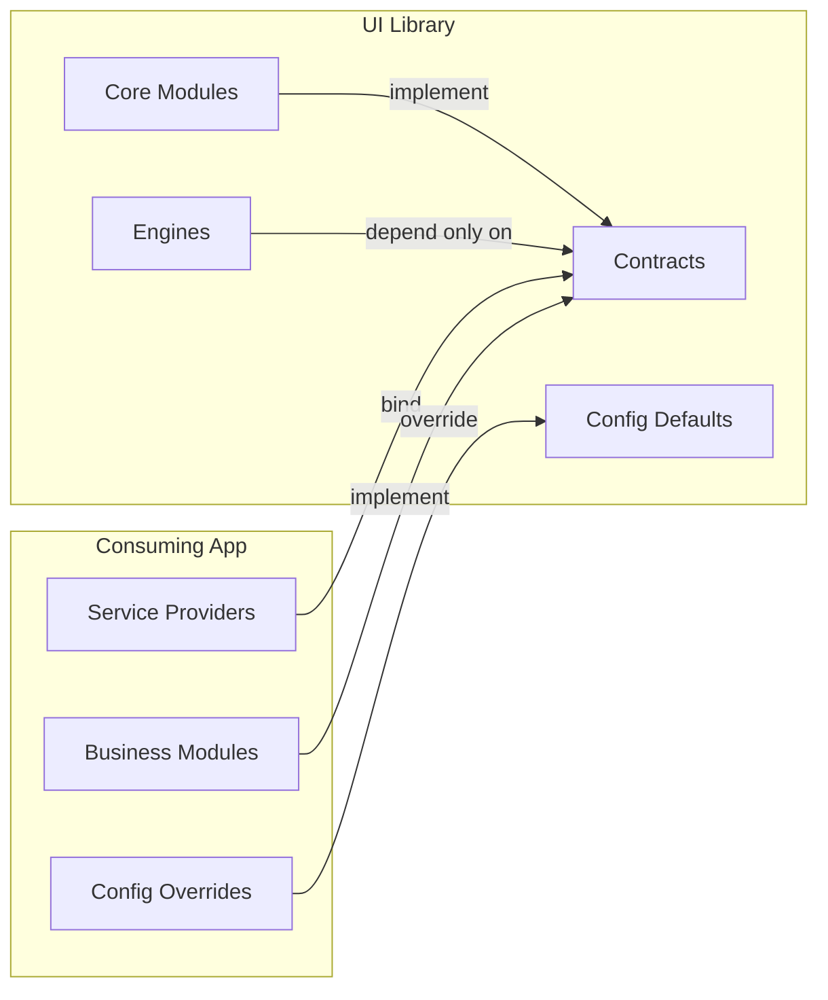

# QuickerFaster UI Library — Library Independence Safeguards

> **Package**: `quicker-faster/ui-library`
> **Namespace**: `QuickerFaster\UILibrary\`
> **Last Updated**: 2026-08-16
> **Status**: Living document — enforce, do not archive

**Related files**: [`00-index.md`](./00-index.md) · [`08-contracts-and-interfaces.md`](./08-contracts-and-interfaces.md) · [`10-settings-and-config.md`](./10-settings-and-config.md) · [`11-extension-guide.md`](./11-extension-guide.md) · [`14-integration-map.md`](./14-integration-map.md) · [`15-gaps-and-recommendations.md`](./15-gaps-and-recommendations.md)

---

## 1. Purpose & Non-Negotiable Principle

The library was decoupled from the HR module and is now a **domain-agnostic foundation** for any business application (inventory, accounting, CRM, HR, logistics, etc.). The HR module will be re-integrated as a *consuming-app* business module at `app/Modules/Hr` inside a fresh Laravel project.

The single non-negotiable principle this document enforces:

> **The library MUST NOT contain any reference to a specific business domain, module, model, or namespace that belongs to a consuming application.**

This is a **dependency-direction** rule. Dependencies point in exactly one direction:



- The **consuming app** references the library (implements contracts, configures engines, overrides defaults).
- The **library** references *only itself* (contracts, engines, core modules, config defaults).
- Any edge pointing from `Lib` to `App` is a **domain leak** and must fail CI.

---

## 2. Part 1 — Current-State Audit

An audit was run against `src/` (all `*.php` files, including Blade `.blade.php`) to confirm the library is currently HR-free and business-domain-free.

### 2.1 Domain-term scan (HR and adjacent business nouns)

```bash
grep -rn "employee\|payroll\|leave\|attendance\|timesheet\|payslip\|hr\|quick.hr\|QuickHR" src/ --include="*.php" \
  | grep -iv "html\|x-transition\|xhr\|through\|three\|throw\|thread\|chrono\|phpdoc\|@author\|@param\|@return\|@throws\|@see\|@var\|@method\|@property"
```

**Result: 0 real matches.** Every residual hit is a false positive:

| Term | Finding | Classification |
|------|---------|----------------|
| `employee`, `payroll`, `payslip`, `timesheet`, `attendance`, `holiday`, `clock_event`, `job_title` | **0 matches** | ✅ Clean |
| `leave` | Appears only as the English verb ("leave the placeholder", "leave the step pending", "Leave empty") and Alpine.js `x-transition:leave` attributes | ✅ False positive |
| `department` | Appears only in the **generic Organization core module** (`src/Core/Organization/`) — a domain-agnostic organizational-hierarchy concept valid for inventory, CRM, and accounting apps alike | ✅ Legitimate core concept |

### 2.2 Consuming-app namespace scan

```bash
grep -rn "App\\Modules" src/ --include="*.php"
```

**Result: no executable references to any specific business module.** All matches fall into two legitimate buckets:

1. **Config defaults** (intentional, the discovery seam):
   - [`src/Config/ui-library.php`](../../src/Config/ui-library.php:65) — `'business' => base_path('app/Modules')`
   - [`src/Config/ui-library.php`](../../src/Config/ui-library.php:66) — `'business_namespace' => 'App\\Modules'`
2. **Generic discovery code** that reads those config keys (never a hardcoded business module name): [`ModuleServiceProvider`](../../src/Providers/ModuleServiceProvider.php:30), [`NavigationManager`](../../src/Services/Navigation/NavigationManager.php:572), [`ModelDiscovery`](../../src/Services/AccessControl/ModelDiscovery.php:36), [`ApplicationInfo`](../../src/Services/System/ApplicationInfo.php:56), [`ModelConfigRepository`](../../src/Services/Config/ModelConfigRepository.php:104), [`SettingsPanel`](../../src/Http/Livewire/Settings/SettingsPanel.php:59), [`ModuleSelector`](../../src/Http/Livewire/AccessControls/ModuleSelector.php:34).
3. **Docblock comments** (6 occurrences) that *document* the decoupling, e.g. [`src/Models/Role.php`](../../src/Models/Role.php:14) ("This replaces the `App\Modules\Admin\Models\Role` reference"), [`src/Events/ToggleButtonEvent.php`](../../src/Events/ToggleButtonEvent.php:10), [`src/Services/ActivityLogger.php`](../../src/Services/ActivityLogger.php:10). These are non-executable and acceptable, but see §4.1 for the rule that keeps them under review.

> **Note on core modules**: the library legitimately references its *own* core modules (`Admin`, `System`, `Organization`, `Common`) because they are **shipped inside the library** at [`src/Core/`](../../src/Core/). Referencing a library-owned core module is not a leak; referencing a consuming-app business module (`Hr`, `Inventory`, `Accounting`, `Crm`) is.

### 2.3 Branding scan

```bash
grep -rn "quick_hr\|quick-hr\|QuickHR\|Quick HR" src/ --include="*.php"
```

**Result: 0 matches.** ✅ No legacy HR branding remains in source.

### 2.4 Composer autoload isolation

[`composer.json`](../../composer.json:7) autoloads only the library's own namespaces:

| Section | Namespace → Path | Consuming-app namespaces? |
|---------|------------------|---------------------------|
| `autoload.psr-4` | `QuickerFaster\UILibrary\` → `src/` | ❌ None |
| `autoload.psr-4` | `QuickerFaster\UILibrary\Core\` → `src/Core/` | ❌ None |
| `autoload-dev.psr-4` | `QuickerFaster\UILibrary\Tests\` → `tests/` | ❌ None |

**Result: ✅ fully isolated.** No `App\` or `App\Modules\` namespace is autoloaded or required.

---

## 3. Part 2 — Architectural Safeguards

These are the design invariants that keep the library domain-agnostic. Each is a **hard rule**; violations are rejected in review and (where automatable) in CI.

### 3.1 The Contract Boundary (Hard Rule)

- The library **provides** contracts (interfaces) in [`src/Contracts/`](../../src/Contracts/). Consuming apps **implement** them.
- The library **MUST NOT reference any consuming-app class by its fully-qualified class name (FQCN)**. This includes type hints, `new`, `class-string`, string literals in `config()`, and `use` statements.
- Contracts are named by **capability**, never by domain: `Workflowable`, `Documentable`, `Reportable`, `Notifiable`, `ApproverResolver`, `WorkspaceResolver`, `CompanyProvider`, `ModuleContract`, `FieldType`, `Widget`.
- Contract methods use **generic nouns** (`getWorkflowDefinitionKey()`, `getDocumentableId()`, `resolveSubjectId()`) — never `getEmployeeId()`, `getInvoiceNumber()`.
- Docblock examples on contracts must cite **at least two unrelated domains** (see §6.4).

**Violation pattern (reject):**
```php
use App\Modules\Hr\Models\Employee;          // ❌ FQCN of a business model
public function resolve(Employee $employee);  // ❌ domain type hint
```

**Compliant pattern (accept):**
```php
public function resolve(Workflowable $subject): array; // ✅ library contract only
```

### 3.2 Config-Driven, Not Domain-Driven

- All behavior is driven by [`src/Config/ui-library.php`](../../src/Config/ui-library.php) (library defaults) and per-module `Data/*.php` configs (consuming-app specifics).
- The library **must never branch on a domain name** — no `if ($module === 'hr')`, no switch on business module names.
- Extension points are config keys the consuming app overrides, e.g.:
  - `ui-library.approvals.approver_resolver`
  - `ui-library.approvals.approver_label_resolver`
  - `ui-library.navigation.company_provider`
  - `ui-library.datatables.authorization_provider`
  - `ui-library.notifications.channels`
  - `ui-library.notifications.template_variables`
  - `ui-library.settings.resolvers`
  - `ui-library.module_paths.business` / `ui-library.module_paths.business_namespace`

**Config-key naming convention:**

| Rule | Example (✅) | Anti-example (❌) |
|------|-------------|------------------|
| `snake_case` dot notation, grouped by capability | `approvals.approver_resolver` | `hr_payroll_resolver` |
| Generic role/structural nouns | `subject`, `record`, `entity`, `actor`, `requester`, `approver`, `owner`, `workspace` | `employee`, `invoice`, `product`, `customer`, `supplier` |
| Defaults and comments use cross-domain examples | `'expense_claim'`, `'purchase_order'` | `'leave_request'` as the *only* example |
| Every example passes the two-domain test | works for HR *and* inventory | works only for HR |

**Forbidden key segments** (a non-exhaustive denylist for the grep gate): `employee`, `payroll`, `payslip`, `timesheet`, `attendance`, `leave`, `holiday`, `invoice`, `inventory`, `product`, `customer`, `supplier`, `order`, `shipment`, `ledger`, `account`.

### 3.3 The Module Discovery Contract

The library discovers business modules **generically** via [`ModuleServiceProvider::discoverBusinessModules()`](../../src/Providers/ModuleServiceProvider.php:28), which scans the configurable path [`app/Modules`](../../src/Config/ui-library.php:65). The library:

- **MUST NOT hardcode a module name, path, or namespace.** All discovery flows through `ui-library.module_paths.business` and `ui-library.module_paths.business_namespace`.
- **MUST NOT** contain a registry entry for any business module. The core `modules` array in [`ui-library.php`](../../src/Config/ui-library.php:11) may list only library-owned core modules (`admin`, `system`, `organization`, `common`).
- Must treat every discovered directory as an opaque module: it reads `Config/navigation.php`, `Data/*.php`, `Routes/web.php`, `Resources/views/`, `Database/Migrations/`, `Listeners/` **by convention**, never by hardcoded filename that implies a domain.

**Allowed:** the *shape* of the discovery contract (`{$directory}/Routes/web.php`, `{$directory}/Resources/views`).
**Forbidden:** a specific module's concrete path or class (`app/Modules/Hr/Services/PayrollGenerator.php`).

### 3.4 The Catch-All Route Boundary

- The catch-all route resolves `/{module}/{view}` dynamically from `app/Modules/{Module}/Resources/views/`.
- The library **MUST NEVER reference a specific module's views, Livewire components, or routes** by name.
- It maintains only a config-driven allow-list of *module keys* (`ui-library.catch_all.allowed_modules`), which business modules append to themselves at discovery time — the library never pre-populates it with a business module name.
- The library's own catch-all registrations are limited to its core System route (loaded from [`src/Core/System/Routes/web.php`](../../src/Core/System/Routes/web.php)).

### 3.5 The Service Provider Boundary

[`UILibraryServiceProvider`](../../src/Providers/UILibraryServiceProvider.php:20) binds **only library contracts → library default implementations**, and only from config keys (so the consuming app can swap them):

```php
$this->app->bind(
    Contracts\Approvals\ApproverResolver::class,
    config('ui-library.approvals.approver_resolver', Services\Approvals\DefaultApproverResolver::class)
);
```

Hard rules:

- It **MUST NOT** `bind`, `singleton`, `instance`, or `use` a consuming-app class, a business model, a business service, or a business config.
- All business-module bindings (e.g., `App\Modules\Hr\Services\PayrollGenerator`) belong **exclusively** in the consuming app's own service providers.
- All core-module bootstrapping is restricted to the library's own `src/Core` namespaces.

### 3.6 The Test Boundary

- Library tests **must run with zero consuming-app code** present.
- Test fixtures must be library-owned only — **no HR models, no HR migrations, no HR configs, no `app/Modules`** fixtures.
- Tests exercise contracts through **anonymous/in-memory fixtures** or library core models, never through a business module's classes.
- The PHPUnit suite (Orchestra Testbench) must pass with only the library's `autoload` + `autoload-dev` loaded.

---

## 4. Part 3 — Verification Mechanisms

### 4.1 Pre-commit / CI grep gate

Add a gate script (e.g., `scripts/check-domain-independence.sh`) and wire it into pre-commit and CI. The three canonical checks:

```bash
#!/usr/bin/env bash
# scripts/check-domain-independence.sh — fails on any domain leakage in src/
set -euo pipefail

SRC="src"
FAIL=0

# (1) HR / business-domain terms
if grep -rniE "employee|payroll|leave|attendance|timesheet|payslip|invoice|inventory|product|customer|supplier|holiday|payslip" \
    "$SRC" --include="*.php" \
    | grep -ivE "html|x-transition|xhr|through|three|throw|thread|chrono|phpdoc|@author|@param|@return|@throws|@see|@var|@method|@property"; then
  echo "❌ Domain-specific term found in src/ (see above)."
  FAIL=1
fi

# (2) Executable consuming-app namespace references (comments excluded)
if grep -rn "App\\\\Modules" "$SRC" --include="*.php" \
    | grep -vE "^\s*//|^\s*\*|^\s*/\*|\* This replaces|Assumes models are"; then
  echo "❌ Executable App\\Modules reference found in src/ (see above)."
  FAIL=1
fi

# (3) Legacy branding
if grep -rniE "quick_hr|quick-hr|quickhr|quick hr" "$SRC" --include="*.php"; then
  echo "❌ Legacy HR branding found in src/ (see above)."
  FAIL=1
fi

exit $FAIL
```

- **Rule:** any new match in (1) or (3) is a hard failure. For (2), a *comment-only* match requires a maintainer justification; an *executable* match is a hard failure.
- Run in CI as a dedicated job (e.g., GitHub Actions step) that runs *before* tests, so the suite never builds against a leaked domain.

### 4.2 Composer autoload isolation (verification)

Confirm the library never autoloads or requires a consuming-app namespace:

```bash
# Must output ONLY QuickerFaster\UILibrary namespaces; any App\ or App\Modules\ = FAIL
php -r '$j=json_decode(file_get_contents("composer.json"),true);
        foreach(["autoload","autoload-dev"] as $k){
          foreach(array_keys($j[$k]["psr-4"] ?? []) as $ns){
            if(str_starts_with($ns,"App\\")){ echo "LEAK: $ns\n"; exit(1); }
          }
        }
        echo "OK: no consuming-app namespace in autoload\n";'
```

- Add an assertion to the gate script that `composer.json` maps only `QuickerFaster\UILibrary\*` namespaces.
- **CI check:** the above one-liner is embedded in the gate script so it cannot drift.

### 4.3 Test isolation (verification)

Prove the suite passes with only the library's own autoload:

1. Run from a **clean checkout** of the library with no `app/` directory and no consuming-app packages installed:
   ```bash
   composer install            # library + require-dev only
   ./vendor/bin/phpunit
   ```
2. Confirm `app/` does not exist or is empty. If any test touches `base_path('app/Modules')`, the discovery path simply yields no modules and the test still passes.
3. **Negative control:** temporarily add a `src` file that references `App\Modules\Hr\...` and confirm the grep gate (not just PHPUnit) fails — validating that the gate catches what tests cannot.

### 4.4 Config audit checklist

For **every** new key, example, default value, or comment added to [`ui-library.php`](../../src/Config/ui-library.php) (or any core-module config), confirm:

- [ ] Key name uses generic/structural nouns — no domain noun in the segment.
- [ ] Default value is domain-neutral (a library class, `null`, `true/false`, or a generic string).
- [ ] Every example/comment passes the two-domain test (valid for at least two unrelated domains).
- [ ] No hardcoded business module name appears as a config value or comment.
- [ ] The key is consumed via `config(...)` with a library-side default fallback.
- [ ] The consuming app can override it by merging into `ui-library` without editing the library.

### 4.5 Contract audit (two-domain rule)

- **Rule:** every new contract added to [`src/Contracts/`](../../src/Contracts/) must be demonstrably valid for **at least two unrelated business domains** (e.g., "would this work for both HR and inventory?").
- Add this as a PR checklist item: the PR description must name the two domains and show how a hypothetical model from each would satisfy the contract.
- A contract that only makes sense for one domain (e.g., an interface exposing `getPayPeriod()`) is a **rejected** abstraction — it belongs in the consuming app, not the library.

---

## 5. Part 4 — Integration Boundary

### 5.1 Concern ownership

| Concern | Library `src/` | Consuming App `app/` |
|---------|:--------------:|:--------------------:|
| Contracts / interfaces | ✅ Provides | Implements |
| Config-driven engines | ✅ Ships | Configures |
| Generic models (Workflow, Notification, Document, Export, ReportSchedule) | ✅ Owns | Extends / uses |
| Business models (Employee, Invoice, Product) | ❌ | ✅ |
| Business Livewire components | ❌ | ✅ |
| Business `Data/*.php` configs | ❌ | ✅ |
| Business migrations / seeders | ❌ | ✅ |
| Navigation configs | Core modules only | Business modules |
| Dashboard configs | Core modules only | Business modules |
| Workflow definitions | Generic engine | Business-specific definitions |
| Notification templates | Generic engine + domain-neutral defaults | Business-specific templates |
| `ApproverResolver` | Contract + default implementation | Business-specific binding |
| Service bindings | Contract → library default | Business class → contract |
| Routes | Shared + core catch-all | Business module `Routes/web.php` |

### 5.2 Where each seam lives

| Extension seam | Library side | Consuming-app side |
|----------------|--------------|--------------------|
| Business module discovery | `ui-library.module_paths.business` + `discoverBusinessModules()` | Creates `app/Modules/{Module}/` |
| Business namespace | `ui-library.module_paths.business_namespace` (default `App\\Modules`) | Overrides if needed |
| View resolution | Catch-all `/{module}/{view}` | Provides `Resources/views/` |
| Data config resolution | `ModelConfigRepository` resolution order | Provides `Data/*.php` |
| Navigation | `NavigationManager` + core nav configs | Provides `Config/navigation.php` |
| Approval resolution | `ApproverResolver` contract + default | Binds business resolver |
| Workspace context | `WorkspaceResolver` contract + null default | Binds multi-tenant resolver |
| Company resolution | `CompanyProvider` contract + null default | Binds tenant provider |
| Notification variables | `TemplateVariableRegistry` contract + default | Binds business registry |
| Auth | Fortify scaffold (users) | Provides User model |

---

## 6. Part 5 — Ongoing Maintainer Practices

### 6.1 Reviewing PRs for domain leakage

Scan every PR for these red flags, in priority order:

1. **New `use App\...` / `use App\Modules\...`** in `src/` → reject (only `QuickerFaster\UILibrary\*` and framework imports allowed).
2. **New domain noun** (`employee`, `payroll`, `invoice`, `inventory`, `product`, `leave`, `attendance`, `customer`, `supplier`, etc.) anywhere in `src/` → reject unless it is a proven generic false positive.
3. **Hardcoded module name** in a path or class (`app/Modules/Hr`, `Module\Hr`) → reject; must use `config('ui-library.module_paths...')`.
4. **New contract or service that only makes sense for one domain** → reject; return to the consuming app.
5. **A config default or comment whose only example is a single business domain** → request a second, unrelated example.

### 6.2 Adding features without domain coupling

The "extension-point first" recipe for new features:

1. **Define the capability** in a domain-neutral sentence ("resolve who must approve a request", "render a record for export").
2. **Add a contract** in [`src/Contracts/`](../../src/Contracts/) named by capability.
3. **Ship a default implementation** in [`src/Services/`](../../src/Services/) that is domain-neutral (often a null/no-op or config-driven default).
4. **Bind contract → default** in [`UILibraryServiceProvider`](../../src/Providers/UILibraryServiceProvider.php) using a `config()` key so the consuming app can swap it.
5. **Document the seam** in the integration boundary table (§5) and add the new contract to the two-domain audit (§4.5).
6. **Never** create a `use` or type hint that points into the consuming app.

### 6.3 Testing in isolation

- Develop and test in the library repository alone (no `app/`, no HR module checked out).
- Use Orchestra Testbench fixtures that implement contracts with plain in-memory classes.
- Keep `autoload-dev` limited to `QuickerFaster\UILibrary\Tests\`.
- Before release, run §4.1 gate + §4.2 autoload check + §4.3 clean-checkout PHPUnit as a single CI workflow.

### 6.4 The two-domain test

For **every** new contract, config key, default value, example, or docblock comment, ask:

> **"Would this work identically for both an HR app and an inventory app?"**

- If **yes** — it belongs in the library.
- If it only makes sense for HR — move it to `app/Modules/Hr`.
- If it only makes sense for inventory — move it to `app/Modules/Inventory`.
- If it is "HR-ish but could generalize" — generalize first (rename to the structural noun), then keep the generalized version and let the consuming app supply domain specifics.

### 6.5 Escape hatches that remain safe

The following **intentional** seams are the only places consuming-app awareness is permitted, and each is config-driven:

- `ui-library.module_paths.business` (filesystem path, not a domain).
- `ui-library.module_paths.business_namespace` (namespace *root*, not a specific class).
- `ui-library.catch_all.allowed_modules` (module *keys*, populated by the modules themselves at discovery).
- Config-driven contract bindings listed in §3.2.

Anything outside these seams that references the consuming app is a regression.

---

## 7. Summary Checklist

- [ ] No HR/business domain terms in `src/` (grep gate 1).
- [ ] No executable `App\Modules\*` references in `src/` (grep gate 2).
- [ ] No legacy `QuickHR` branding in `src/` (grep gate 3).
- [ ] `composer.json` autoloads only `QuickerFaster\UILibrary\*`.
- [ ] Test suite passes with no consuming-app code present.
- [ ] New contracts pass the two-domain test.
- [ ] New config keys are domain-neutral and listed in §3.2.
- [ ] Business modules live entirely under `app/Modules/*` in the consuming app.

---

**Related files**: [`00-index.md`](./00-index.md) · [`08-contracts-and-interfaces.md`](./08-contracts-and-interfaces.md) · [`10-settings-and-config.md`](./10-settings-and-config.md) · [`11-extension-guide.md`](./11-extension-guide.md) · [`14-integration-map.md`](./14-integration-map.md) · [`15-gaps-and-recommendations.md`](./15-gaps-and-recommendations.md)
