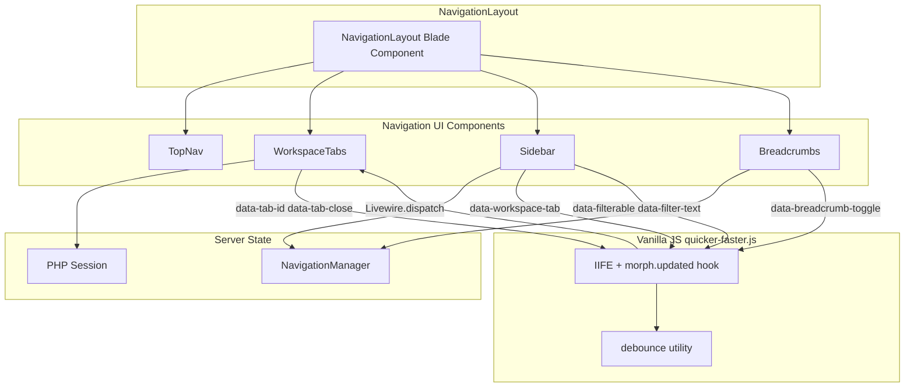

# Phase 5 — Navigation & UX Polish: Architecture

> **Package**: `quicker-faster/ui-library`
> **Namespace**: `QuickerFaster\UILibrary\`
> **Last Updated**: 2026-08-14
> **Status**: ✅ Complete

---

## Overview

Phase 5 delivered four navigation & UX features. All client-side interactivity is
implemented with **vanilla JavaScript** — an IIFE in [`public/assets/js/quicker-faster.js`](../../public/assets/js/quicker-faster.js) — using `data-*` attributes and `Livewire.dispatch()`. No Alpine.js `x-data` directives were introduced.

| Feature | Type | Primary Files |
|---------|------|---------------|
| **WorkspaceTabs** | Livewire component + vanilla JS | [`src/Http/Livewire/Layouts/Navs/WorkspaceTabs.php`](../../src/Http/Livewire/Layouts/Navs/WorkspaceTabs.php), [`src/Resources/views/livewire/navs/workspace-tabs.blade.php`](../../src/Resources/views/livewire/navs/workspace-tabs.blade.php) |
| **Breadcrumbs** | Blade component | [`src/Components/Breadcrumbs.php`](../../src/Components/Breadcrumbs.php), [`src/Resources/views/components/breadcrumbs.blade.php`](../../src/Resources/views/components/breadcrumbs.blade.php) |
| **Sidebar Filter** | vanilla JS (no server round-trip) | [`src/Resources/views/livewire/navs/sidebar.blade.php`](../../src/Resources/views/livewire/navs/sidebar.blade.php), [`src/Resources/views/livewire/navs/partials/sidebar-item.blade.php`](../../src/Resources/views/livewire/navs/partials/sidebar-item.blade.php), [`src/Resources/views/livewire/navs/partials/sidebar-section.blade.php`](../../src/Resources/views/livewire/navs/partials/sidebar-section.blade.php) |
| **Sidebar → Tabs Integration** | config + vanilla JS | [`src/Config/ui-library.php`](../../src/Config/ui-library.php), [`src/Resources/views/livewire/navs/partials/sidebar-item.blade.php`](../../src/Resources/views/livewire/navs/partials/sidebar-item.blade.php) |

---

## Vanilla JS Architecture

All Phase 5 client-side interactivity lives in a single file: [`public/assets/js/quicker-faster.js`](../../public/assets/js/quicker-faster.js). The script is a single IIFE with no ES modules, no npm, and no build toolchain.

### IIFE pattern

The entire script is wrapped in an immediately-invoked function expression, keeping all helpers (`debounce`, `dispatchLivewire`, initializers) out of the global scope:

```javascript
(function () {
    'use strict';
    // ...
})();
```

### `data-*` attributes

DOM state is stored on elements and read via `element.dataset` / `getAttribute()`. This replaces Alpine's `x-data`. The conventions are:

| Attribute | Purpose |
|-----------|---------|
| `data-tab-container`, `data-tab-strip`, `data-tab-item`, `data-tab-id`, `data-tab-url`, `data-tab-label`, `data-tab-close`, `data-tab-overflow`, `data-tab-overflow-menu`, `data-tab-context-menu`, `data-tab-action` | Workspace tab strip, close buttons, overflow, and context menu |
| `data-sidebar-filter-wrap`, `data-sidebar-filter`, `data-sidebar-filter-icon`, `data-sidebar-filter-clear`, `data-sidebar-filter-no-results` | Sidebar fuzzy filter input and feedback elements |
| `data-filterable`, `data-filter-text` | Mark filterable sidebar items/sections and their searchable text |
| `data-workspace-tab`, `data-tab-label`, `data-tab-url`, `data-tab-icon`, `data-tab-context` | Sidebar items that open a workspace tab |
| `data-breadcrumb-toggle`, `data-breadcrumb-menu` | Breadcrumb "..." collapse dropdown |

### `Livewire.dispatch()`

JavaScript communicates with Livewire PHP components by dispatching browser events. A small helper wraps the call and guards against Livewire not yet being initialised:

```javascript
function dispatchLivewire(eventName, params) {
    if (window.Livewire) {
        Livewire.dispatch(eventName, params);
    }
}
```

This replaces Alpine's `$wire.method()` / `$dispatch()`. Event names map to `#[On('event-name')]` handlers on the Livewire component (see the WorkspaceTabs README).

### `Livewire.hook('morph.updated')`

Because Livewire 3 morphs the DOM on every update, directly-attached listeners can be lost. The script re-runs its initialisers after every morph:

```javascript
document.addEventListener('livewire:initialized', function () {
    Livewire.hook('morph.updated', function (payload) {
        var el = payload && payload.el;
        // refresh tab overflow, re-init breadcrumb dropdowns, sidebar filter, tab integration
    });
    // ... initial run
});
```

This replaces Alpine's `x-init` / `$watch`. Initialisers use an idempotency guard (`element.dataset.xInitialized === 'true'`) so they don't double-bind across morphs. The WorkspaceTabs container and the sidebar filter use event **delegation** so a single listener survives morphs without re-attaching per element.

### debounce utility

A minimal `debounce(fn, delay)` helper is used for the sidebar filter input (150ms) and the workspace-tab overflow measurement (100ms):

```javascript
function debounce(fn, delay) {
    var timeout;
    return function () {
        var args = arguments;
        var context = this;
        clearTimeout(timeout);
        timeout = setTimeout(function () {
            fn.apply(context, args);
        }, delay);
    };
}
```

---

## Component Architecture Diagram



---

## Config Keys

| Config Key | Default | Description |
|-----------|---------|-------------|
| `ui-library.navigation.open_in_tabs` | `false` | When `true`, sidebar clicks open/switch a workspace tab via the `openWorkspaceTab` event instead of performing a full page navigation. |
| `ui-library.layout.workspace_tabs.enabled` | `true` | Whether the workspace tab strip is enabled. |
| `ui-library.breadcrumb.show_home` | `true` | Whether breadcrumbs prepend a "Home" segment. |
| `ui-library.breadcrumb.max_visible` | `4` | Maximum number of breadcrumb segments before the middle collapses into a "..." dropdown. |

---

## Session Keys

WorkspaceTabs persists its state in the PHP session (per-user), so tabs survive page refreshes and Livewire re-mounts.

| Session Key | Type | Content |
|-------------|------|---------|
| `workspace_tabs` | array | Ordered list of open tab objects: `{ id, label, url, icon, context }` |
| `workspace_active_tab` | string\|null | ID of the currently active tab. |
| `workspace_recently_closed` | array | Last 10 closed tabs (FIFO), for "Reopen closed tab". |

---

## Keyboard Shortcuts

| Shortcut | Action | Dispatched Event |
|----------|--------|------------------|
| Ctrl+W / Cmd+W | Close the active workspace tab | `close-active-tab` |
| Ctrl+Shift+T / Cmd+Shift+T | Reopen the last closed tab | `reopen-last-closed-tab` |
| Ctrl+K / Cmd+K | Focus the sidebar filter input | (client-side focus only) |

The tab context menu and breadcrumb "..." dropdown also respond to `Escape` and click-outside via delegated `document` listeners.

---

## Vanilla JS Policy

All client-side interactivity uses vanilla JS via `data-*` attributes and `Livewire.dispatch()`. Alpine.js is used only internally by Livewire 3 for DOM diffing. No custom `x-data` directives are written.

The pre-existing Alpine.js usage in older views (sidebar section toggle, application switcher) is explicitly **out of scope** for Phase 5 and remains a separate migration concern. Phase 5 features introduce zero new Alpine.js.

---

## Related Documents

- [`00-index.md`](00-index.md) — architecture documentation index
- [`../components/workspace-tabs.md`](../components/workspace-tabs.md) — WorkspaceTabs component README
- [`../components/breadcrumbs.md`](../components/breadcrumbs.md) — Breadcrumbs component README
- [`../components/sidebar-filter.md`](../components/sidebar-filter.md) — Sidebar Filter component README
- [`../implementation-plan.md`](../implementation-plan.md) — Phase 5 implementation plan (§6)
