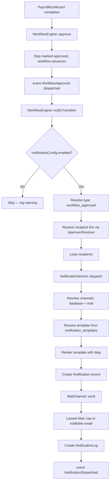

# Workflow Approval Email Notification — Verification Guide

> **Package**: `quicker-faster/ui-library`
> **Consuming App**: `hr-consuming-app` (`/Users/mac/Projects/LaravelProjects/hr-consuming-app`)
> **Scope**: How to verify that an email notification is sent when a payroll run wizard completes and the workflow transitions to `approved`.
> **Date**: 2026-09-01

---

## 1. The Notification Pipeline (End-to-End)

When a payroll run wizard completes and triggers workflow approval, the following chain executes:



---

## 2. Prerequisites Checklist

Before testing, confirm these are in place. Each is a potential failure point.

### 2.1 Notification Template Seeded

The engine resolves templates from the [`notification_templates`](src/Models/NotificationTemplate.php:7) table by `type` + `channel`.

**Verify:**

```sql
SELECT * FROM notification_templates
WHERE type = 'workflow_approved' AND channel = 'mail';
```

**If missing**, insert one:

```sql
INSERT INTO notification_templates (type, channel, subject, body_template, locale, created_at, updated_at)
VALUES (
    'workflow_approved',
    'mail',
    'Workflow Approved: {workflow_key}',
    'The workflow {workflow_key} (ID: {workflow_id}) has been approved. Status: {workflow_status}.',
    'en',
    NOW(),
    NOW()
);
```

> **Note**: The [`NotificationTemplateSeeder`](src/Core/Common/Database/Seeders/NotificationTemplateSeeder.php) currently seeds `document_generated`, `report_ready`, and `workflow_stage_changed` — but **not** `workflow_approved`. The consuming app must seed it or extend the seeder. See [§2.2 of the testing checklist](docs/consuming-app/18-workflow-approval-testing-checklist.md:52).

### 2.2 Workflow Definition Has Notifications Enabled

[`WorkflowEngine::notifyTransition()`](src/Services/Workflow/WorkflowEngine.php:575) reads the `notifications` JSON from the workflow definition (DB-first, config fallback). If the config is empty or `enabled` is `false`, the notification is **silently skipped** with a log warning.

**Verify the DB definition:**

```sql
SELECT `key`, `notifications`
FROM workflow_definitions
WHERE `key` = 'payroll_run_approval' AND is_active = 1;
```

The `notifications` JSON should look like:

```json
{
    "enabled": true,
    "types": {
        "submitted": "workflow_submitted",
        "approved": "workflow_approved",
        "rejected": "workflow_rejected",
        "recalled": "workflow_recalled"
    }
}
```

If `types.approved` is `null` or missing, the engine falls back to `"workflow_{$event}"` → `"workflow_approved"` (line 601–603). If it's explicitly `null` or `""`, the notification is **skipped** (line 606–608).

### 2.3 User Model Implements `Notifiable`

[`WorkflowEngine::resolveNotifiable()`](src/Services/Workflow/WorkflowEngine.php:689) resolves the user via `config('ui-library.user.model')` and checks `$user instanceof Notifiable`.

[`MailChannel::send()`](src/Services/Notifications/Channels/MailChannel.php:12) calls `$notifiable->getNotificationEmail()`.

**Verify the User model:**

```php
// The User model must implement:
use QuickerFaster\UILibrary\Contracts\Notifications\Notifiable;

class User extends Authenticatable implements Notifiable
{
    public function getNotifiableType(): string { return self::class; }
    public function getNotifiableId(): int|string { return $this->id; }
    public function getNotificationEmail(): ?string { return $this->email; }
}
```

### 2.4 Mail Channel Is in Default Channels

[`NotificationService::resolveChannels()`](src/Services/Notifications/NotificationService.php:102) reads `config('ui-library.notifications.default_channels')`.

**Verify:**

```php
// In config/ui-library.php or via env:
'notifications' => [
    'default_channels' => ['database', 'mail'],
],
```

Or check at runtime:

```bash
php artisan tinker --execute="echo json_encode(config('ui-library.notifications.default_channels'));"
```

Expected: `["database","mail"]`

### 2.5 Laravel Mail Configuration Is Valid

[`MailChannel`](src/Services/Notifications/Channels/MailChannel.php:18) uses `Mail::raw()`, which relies on Laravel's standard mail config.

**Verify:**

```bash
php artisan tinker --execute="echo config('mail.default');"
```

Check `.env`:

```
MAIL_MAILER=smtp
MAIL_HOST=smtp.example.com
MAIL_PORT=587
MAIL_USERNAME=...
MAIL_PASSWORD=...
MAIL_FROM_ADDRESS=noreply@example.com
```

### 2.6 ApproverResolver Returns Recipients

[`WorkflowEngine::resolveStepRecipientIds()`](src/Services/Workflow/WorkflowEngine.php:542) calls `$this->approvers->resolve($roles, $workspaceId)`. If this returns an empty array, [`notifyTransition()`](src/Services/Workflow/WorkflowEngine.php:577) logs a warning and returns early.

**Verify the resolver is bound and functional:**

```bash
php artisan tinker --execute="print_r(app(\QuickerFaster\UILibrary\Contracts\Approvals\ApproverResolver::class)->resolve(['payroll_admin'], null));"
```

Should return a non-empty array of user IDs.

---

## 3. Verification Methods

### 3.1 Quick Smoke Test: Check `notification_logs` Table

After completing a payroll run wizard that triggers workflow approval, query the logs:

```sql
SELECT * FROM notification_logs
WHERE type = 'workflow_approved'
ORDER BY created_at DESC
LIMIT 5;
```

| Column | What to check |
|--------|---------------|
| `status` | Should be `sent` (not `failed`) |
| `channel` | Should be `mail` |
| `error_message` | Should be `NULL` |

If `status = 'failed'`, check `error_message` for the exception message.

### 3.2 Check the `notifications` Table

```sql
SELECT id, type, channel, subject, status, read_at, created_at
FROM notifications
WHERE type = 'workflow_approved'
ORDER BY created_at DESC
LIMIT 5;
```

| Column | What to check |
|--------|---------------|
| `channel` | Should be `mail` |
| `status` | Should be `sent` |
| `subject` | Should match the template subject with placeholders resolved |

### 3.3 Use Laravel's Mail Fake (Automated Test)

```php
use Illuminate\Support\Facades\Mail;
use Illuminate\Support\Facades\Event;
use QuickerFaster\UILibrary\Events\Workflows\WorkflowApproved;
use QuickerFaster\UILibrary\Services\Workflow\WorkflowEngine;

public function test_workflow_approval_sends_email_notification(): void
{
    Mail::fake();
    Event::fake([WorkflowApproved::class]);

    // Arrange: create a payroll run entity implementing Workflowable
    $payrollRun = PayrollRun::factory()->create();
    $user = User::factory()->create(['email' => 'approver@example.com']);
    $this->actingAs($user);

    // Ensure the workflow definition has notifications enabled
    // (either via DB seed or config)

    $engine = app(WorkflowEngine::class);
    $workflow = $engine->start($payrollRun);

    // Act: approve the workflow
    $engine->approve($workflow, 'Looks good');

    // Assert: WorkflowApproved event was dispatched
    Event::assertDispatched(WorkflowApproved::class, function ($event) use ($workflow) {
        return $event->workflow->id === $workflow->id && $event->completed === true;
    });

    // Assert: email was queued/sent
    Mail::assertSent(\Illuminate\Mail\Events\MessageSent::class);
}
```

### 3.4 Use a Mail Trap (Manual End-to-End)

For manual testing without a real SMTP server:

1. Set `MAIL_MAILER=log` in `.env` — emails are written to `storage/logs/laravel.log`.
2. Complete the payroll run wizard.
3. Check the log:

```bash
tail -f storage/logs/laravel.log | grep -i "workflow_approved"
```

Or use [Mailpit](https://github.com/axllent/mailpit) / [MailHog](https://github.com/mailhog/MailHog):

```
MAIL_MAILER=smtp
MAIL_HOST=localhost
MAIL_PORT=1025
```

Then visit `http://localhost:8025` to see captured emails.

### 3.5 Check Laravel Logs for Warning Signals

[`WorkflowEngine::notifyTransition()`](src/Services/Workflow/WorkflowEngine.php:577) logs warnings when:

- `recipientIds` is empty (line 578)
- Notification config is disabled/empty (line 590)

Search the log:

```bash
grep "notifyTransition" storage/logs/laravel.log
```

If you see `"notification config is disabled or empty"`, the workflow definition's `notifications` JSON is missing or `enabled` is `false`.

If you see `"called with empty recipientIds"`, the `ApproverResolver` returned no users for the step's roles.

---

## 4. Common Failure Points (Troubleshooting)

| Symptom | Likely Cause | Check |
|---------|-------------|-------|
| No `notification_logs` row at all | `notifications` config disabled or empty | §2.2 |
| No `notification_logs` row at all | `recipientIds` empty (no approvers resolved) | §2.6 |
| `notification_logs` exists but `channel = 'database'` only | `mail` not in `default_channels` | §2.4 |
| `notification_logs.status = 'failed'` | Mail config invalid or SMTP unreachable | §2.5 |
| `notification_logs.status = 'failed'` | User has no email (`getNotificationEmail()` returns null) | §2.3 |
| Template placeholders not replaced | `notification_templates` row missing for `type + channel` | §2.1 |
| Wrong notification type sent | `types.approved` mapped to different value in `notifications` JSON | §2.2 |

---

## 5. Quick Diagnostic Script

Run this Tinker script after completing a payroll run to diagnose the pipeline:

```bash
php artisan tinker
```

```php
// 1. Check the latest workflow
$wf = \QuickerFaster\UILibrary\Models\Workflow::latest()->first();
echo "Workflow ID: {$wf->id}, Status: {$wf->status}, Key: {$wf->definition_key}\n";

// 2. Check notification config
$def = \QuickerFaster\UILibrary\Models\WorkflowDefinition::where('key', $wf->definition_key)->first();
echo "Notifications config: " . json_encode($def?->notifications) . "\n";

// 3. Check notification logs
$logs = \QuickerFaster\UILibrary\Models\NotificationLog::where('type', 'workflow_approved')
    ->where('created_at', '>=', $wf->created_at)
    ->get();
echo "Notification logs: " . $logs->count() . "\n";
foreach ($logs as $log) {
    echo "  - Channel: {$log->channel}, Status: {$log->status}, Error: {$log->error_message}\n";
}

// 4. Check notifications
$notifs = \QuickerFaster\UILibrary\Models\Notification::where('type', 'workflow_approved')
    ->where('created_at', '>=', $wf->created_at)
    ->get();
echo "Notifications: " . $notifs->count() . "\n";
foreach ($notifs as $notif) {
    echo "  - Channel: {$notif->channel}, Status: {$notif->status}, Subject: {$notif->subject}\n";
}

// 5. Check template exists
$template = \QuickerFaster\UILibrary\Models\NotificationTemplate::where('type', 'workflow_approved')
    ->where('channel', 'mail')
    ->first();
echo "Mail template: " . ($template ? "EXISTS" : "MISSING") . "\n";

// 6. Check default channels
echo "Default channels: " . json_encode(config('ui-library.notifications.default_channels')) . "\n";

// 7. Verify consuming-app workflow configs are loaded
// hr-consuming-app defines workflows in module-level config files:
//   - app/Modules/Payroll/Config/workflows.php
//   - app/Modules/Leave/Config/workflows.php
echo "Payroll workflow config: " . (config('workflows.payroll_run_approval') ? "LOADED" : "MISSING") . "\n";
echo "Leave workflow config: " . (config('workflows.leave_request_approval') ? "LOADED" : "MISSING") . "\n";
```

---

## 6. Related Documentation

- [`18-workflow-approval-testing-checklist.md`](docs/consuming-app/18-workflow-approval-testing-checklist.md) — Full workflow/approval integration checklist
- [`19-notification-consuming-app-guide.md`](docs/consuming-app/19-notification-consuming-app-guide.md) — Notification system consuming-app guide (throttling, audience, actions, templates)
- [`21-approval-infrastructure-analysis.md`](docs/library/21-approval-infrastructure-analysis.md) — Approval infrastructure analysis
- [`WorkflowEngine`](src/Services/Workflow/WorkflowEngine.php) — Engine source (notification dispatch at line 575)
- [`NotificationService`](src/Services/Notifications/NotificationService.php) — Service source (dispatch at line 32)
- [`MailChannel`](src/Services/Notifications/Channels/MailChannel.php) — Mail channel source
- [`SendNotification`](src/Jobs/SendNotification.php) — Async job