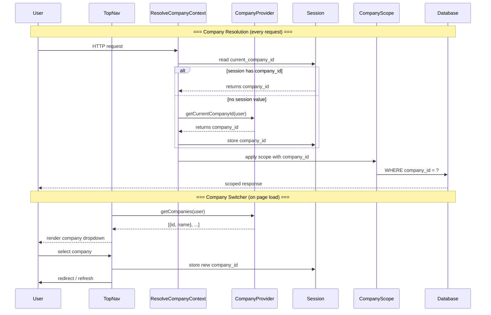

# Company Scoping & Multi-Company

> **Package**: `quicker-faster/ui-library`
> **Last Updated**: 2026-08-30

This document covers the library's domain-agnostic company scoping mechanism. For the library's internal tenancy configuration schema, see [../library/10-settings-and-config.md](../library/10-settings-and-config.md).

---

## 1. Overview

The library uses a **domain-agnostic** company scoping model built around the generic concept of a "company" as the data-isolation unit. The library provides the infrastructure — global scopes, middleware, contracts — and the consuming application provides the domain-specific implementation.

### 1.1 Multi-Tenancy vs Multi-Company

> **Important distinction**: These two terms refer to different layers of isolation. They are often conflated; they should not be.

| Term | Scope | Mechanism | Owner |
|---|---|---|
| **Multi-Tenancy** | Separate databases per SaaS client | Database provisioning, connection management | **Deployment / Ops** — NOT the library |
| **Multi-Company** | Multiple companies within one database | `company_id` column + `CompanyScope` global scope | **Library** — scoping mechanism |

This document covers **multi-company** — the library's column-level scoping mechanism. For the full three-layer model (SaaS client → company → org hierarchy), see [../library/27-architecture-boundary.md](../library/27-architecture-boundary.md) §3.

For a concise side-by-side comparison, see [multi-tenancy-vs-multi-company.md](multi-tenancy-vs-multi-company.md).

### 1.2 Key Tenets

- **"company" is the scoping term** — already used by `CompanyProvider`, the company switcher, and the `company_id` convention
- **Library provides infrastructure** — `CompanyScope`, `HasCompanyScope`, `ResolveCompanyContext`
- **Consuming app provides data** — `CompanyProvider` contract, company resolution logic, switcher UI binding
- **Zero domain assumptions** — the library never hardcodes a business model or module
- **`users` table does NOT need `company_id`** — the `CompanyProvider` contract resolves the current company however each app wants (e.g., `User → Employee → Company` chain)

### 1.3 Current State

The `CompanyProvider` contract is **implemented and working** in consuming applications (e.g., `App\YourModule\Providers\YourModelCompanyProvider`), which binds in the module's own service provider. The library itself ships with `NullCompanyProvider` as the default no-op. See [contracts.md](contracts.md) §6 for implementation guidance.

---

## 2. CompanyScope — Global Query Scope

### 2.1 How CompanyScope Works

`CompanyScope` is a Laravel global query scope that automatically filters queries by `company_id`. When applied to a model, every query automatically includes a `WHERE company_id = {current_company_id}` clause.

### 2.2 Applying CompanyScope to Models

Use the `HasCompanyScope` trait on any model:

```php
use QuickerFaster\UILibrary\Traits\HasCompanyScope;

class Invoice extends Model
{
    use HasCompanyScope;
}
```

The trait registers the scope at boot time via the `bootHasCompanyScope()` method.

### 2.3 Bypassing the Scope

When you need to query across all companies:

```php
// Bypass the scope for a single query
$allInvoices = Invoice::withoutCompanyScope()->get();

// Bypass within a callback
Invoice::withoutCompanyScope(function () {
    // All queries here bypass the scope
});
```

---

## 3. HasCompanyScope Trait

### 3.1 Trait Methods

The `HasCompanyScope` trait provides:

| Method | Purpose |
|--------|---------|
| `bootHasCompanyScope()` | Registers the global scope on model boot |
| `scopeWithoutCompanyScope()` | Query scope to bypass the filter |

### 3.2 Boot-Time Scope Registration

The trait hooks into the model's `boot` event:

```php
protected static function bootHasCompanyScope(): void
{
    static::addGlobalScope(new CompanyScope);
}
```

---

## 4. ResolveCompanyContext Middleware

### 4.1 Middleware Registration

The middleware is registered with the alias `qf.resolve-company-context`. Apply it to routes that need company context:

```php
// In a route group or controller
Route::middleware(['auth', 'qf.resolve-company-context'])->group(function () {
    Route::get('/invoices', [InvoiceController::class, 'index']);
});
```

### 4.2 Session-Based Company Resolution

The middleware reads the current company ID from the session:

- **Session key**: `current_company_id` (configurable via `ui-library.tenancy.session_key`)
- **Fallback**: If no session value exists, the middleware attempts to resolve via `CompanyProvider::getCurrentCompanyId()`
- **Persistence**: The company switcher writes the selected company ID to the session

### 4.3 Company Switching Flow

1. User selects a company from the company switcher dropdown
2. The switcher dispatches to `OrganizationSwitchController`
3. The controller validates the user has access to the selected company via `CompanyProvider`
4. On success, the company ID is stored in the session
5. `ResolveCompanyContext` reads it on subsequent requests and applies `CompanyScope`

### 4.4 End-to-End Flow Diagram



---

## 5. Tenancy Configuration

### 5.1 ui-library.tenancy Config Keys

```php
// config/ui-library.php
'tenancy' => [
    'column'      => 'company_id',           // Eloquent column the scope filters on
    'session_key' => 'current_company_id',   // Session key for current company
],
```

### 5.2 Environment Overrides

The tenancy config keys are not currently environment-configurable (they are structural, not environmental). To customize them, publish the config:

```bash
php artisan vendor:publish --tag=ui-library-config
```

Then edit `config/ui-library.php` directly.

---

## 6. CompanyProvider Contract

### 6.1 Implementing for Your Application

The `CompanyProvider` contract is the bridge between the library's tenancy infrastructure and your application's company model:

```php
use QuickerFaster\UILibrary\Contracts\Navigation\CompanyProvider;

class AppCompanyProvider implements CompanyProvider
{
    public function getCompanies(): array
    {
        // Return all companies the current user can access
        return auth()->user()
            ->companies()
            ->get()
            ->map(fn($c) => [
                'id'   => $c->id,
                'name' => $c->name,
                'logo' => $c->logo_url,
            ])
            ->toArray();
    }

    public function getCurrentCompanyId(): ?int
    {
        return session('current_company_id')
            ?? auth()->user()?->default_company_id;
    }
}
```

### 6.2 Implementation Pattern

A `CompanyProvider` implementation resolves the user's company chain through domain model relationships. The chain varies per application — for example, if your `User` model relates to an intermediary model which belongs to a `Company`:

```
User → YourModel (by user_id) → Company (by company_id)
```

No `company_id` column exists on the `users` table — the `CompanyProvider` contract lets each app resolve the company however it needs.

The implementation is bound in the module's own service provider, following the modular binding pattern where each module owns its contract bindings. See [contracts.md](contracts.md) §6 for the full modular binding example.

### 6.3 Company Switcher Integration

The company switcher in the top navigation bar reads from `CompanyProvider::getCompanies()` to populate the dropdown. It is enabled by setting `ui-library.navigation.show_company_switcher` to `true` and binding a `CompanyProvider` implementation.

---

## 7. Navigation & Tenancy

### 7.1 Workspace-Scoped Navigation Filtering

The `WorkspaceFilter` service uses the `WorkspaceResolver` contract to filter navigation items by company context. See [contracts.md](contracts.md) §"WorkspaceResolver" for implementation details.

### 7.2 Company-Specific Sidebar Sections

Navigation items can be scoped to specific companies or company features via the `workspace` constraint on nav items:

```php
// app/Modules/Billing/Config/navigation.php
'items' => [
    [
        'key'       => 'invoices',
        'label'     => 'Invoices',
        'route'     => 'billing.invoices',
        'workspace' => [
            'features' => ['billing'],
        ],
    ],
],
```

Items with a `workspace` constraint are shown only when **all** key/value pairs match the current workspace context.

---

## 8. Testing with Tenancy

### 8.1 Setting Company Context in Tests

```php
public function test_invoices_are_scoped_to_company(): void
{
    // Set the current company in the session
    session(['current_company_id' => $companyA->id]);

    // Create invoices for two companies
    $invoiceA = Invoice::factory()->create(['company_id' => $companyA->id]);
    $invoiceB = Invoice::factory()->create(['company_id' => $companyB->id]);

    // Query should only return company A's invoices
    $invoices = Invoice::all();
    $this->assertCount(1, $invoices);
    $this->assertEquals($invoiceA->id, $invoices->first()->id);
}
```

### 8.2 Asserting Scope Behavior

```php
// Verify the scope is applied
$query = Invoice::query();
$this->assertStringContainsString(
    'company_id',
    $query->toSql()
);

// Verify the scope can be bypassed
$allInvoices = Invoice::withoutCompanyScope()->get();
$this->assertCount(2, $allInvoices);
```

---

## Cross-References

- [../library/27-architecture-boundary.md](../library/27-architecture-boundary.md) — Three-layer tenancy model: SaaS client → company scoping → org hierarchy
- [../library/10-settings-and-config.md](../library/10-settings-and-config.md) — Full tenancy config schema
- [contracts.md](contracts.md) — CompanyProvider & WorkspaceResolver implementation
- [multi-tenancy-vs-multi-company.md](multi-tenancy-vs-multi-company.md) — Side-by-side distinction: database-level vs column-level
- [module-structure.md](module-structure.md) — Navigation config with workspace constraints
- [getting-started.md](getting-started.md) — Installation & config publishing