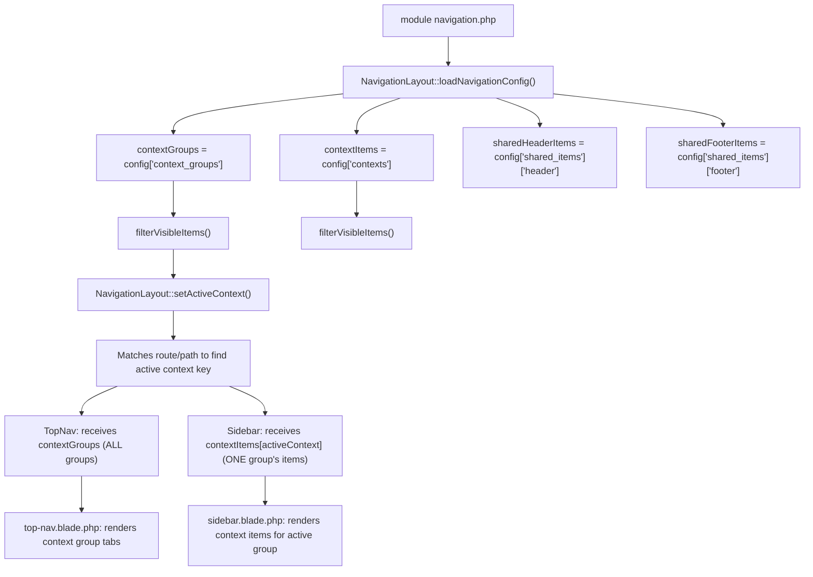
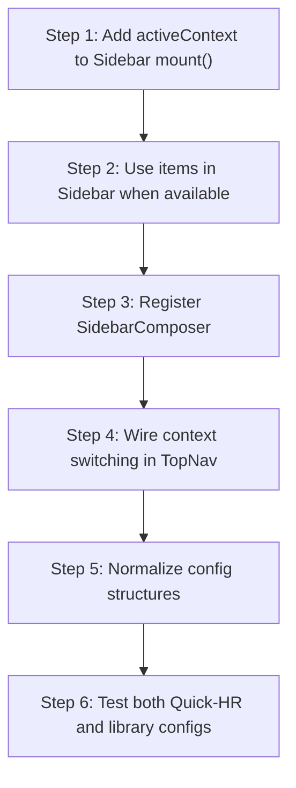

# Context Groups Navigation Analysis

> **Date**: 2026-08-10 (Updated 2026-08-11)
> **Scope**: Complete architectural analysis of the `context_groups` → sidebar linkage pattern in the QuickerFaster UI Library
> **Status**: ✅ All gaps resolved — context switching between top nav and sidebar is fully functional

---

## Table of Contents

1. [Previous Architecture](#1-previous-architecture)
2. [Intended Improvement](#2-intended-improvement)
3. [Gaps & Conflicts](#3-gaps--conflicts)
4. [Implementation Recommendations](#4-implementation-recommendations)

---

## 1. Previous Architecture

### 1.1 Config Structure: `context_groups` + `contexts`

Every module (Core or Business) defines a [`navigation.php`](src/Core/Admin/Config/navigation.php) config with this schema:

```php
return [
    'context_groups' => [         // TOP NAV: High-level groupings
        '{group_key}' => [
            'label' => '...',     // Display name
            'icon' => 'fa-...',   // Font Awesome class
            'route' => null,      // Named route OR null (Quick-HR uses null + url)
            'url' => '...',       // URL fallback
            'order' => 10,        // Sort order
        ],
    ],
    'contexts' => [               // SIDEBAR: Deeper items per group
        '{group_key}' => [
            [
                'key' => '...',         // Unique item identifier
                'label' => '...',       // Display name
                'icon' => 'fa-...',
                'route' => '/...',      // URL path OR named route
                'permission' => '...',  // Spatie permission (Quick-HR) OR absent (library)
                'order' => 10,
                'page_title' => null,   // Optional page title override
            ],
        ],
    ],
    'shared_items' => ['header' => [], 'footer' => []],
    'shared_top_items' => ['left' => [], 'right' => []],
    'layout' => [...],
];
```

**Key structural properties**:

- `context_groups` keys map directly to `contexts` keys — they form a **linked data structure**
- One `context_groups` entry corresponds to one `contexts` entry with the same key
- The intent is: **select a context group → show its context items in the sidebar**

### 1.2 Config Inventory

#### Quick-HR Business Modules

**`/app/Modules/Hr/Config/navigation.php`** (514 lines):

| `context_groups` | Group Key | Items in `contexts` | Example Permissions |
|---|---|---|---|
| 7 groups | `Organization` | 4 items (Overview, Locations, Companies, Departments) | `view_location`, `view_department`, `manage-system` |
| | `policies` | 5 items (Overview, Attendance Policies, Work Patterns, etc.) | `view_attendance_policy`, `view_work_pattern` |
| | `reports` | 1 item (Saved Reports) | `view_saved_report` |
| | `people` | 8 items (Overview, Employees, Tags, Job History, etc.) | `view_employee`, `view_tag` |
| | `payroll` | ~10 items | Various payroll permissions |
| | `leave` | ~8 items | Various leave permissions |
| | `time` | ~10 items | Various attendance permissions |

- **Route format**: URL paths (`/hr/employees`, `/hr/dashboard-organization-overview`)
- **Every item has** `key`, `permission`, and `page_title`
- **Context group** `route` is always `NULL`, `url` provides a fallback

**`/app/Modules/Admin/Config/navigation.php`** (121 lines):

| `context_groups` | Group Key | Items in `contexts` | Example Permissions |
|---|---|---|---|
| 3 groups | `Users & Permissions` | 4 items (Users, Roles, Assign Permissions, Assign Roles) | `view_user`, `view_role`, `view_permission` |
| | `audit` | 1 item (Activity Log) | `view_activity_log` |
| | `General Settings` | 1 item (System Settings) | `view_system_setting` |

- **Same structure** as HR: URL paths, `permission` on every item, NULL `route` on groups

#### Library Core Modules

**`src/Core/Admin/Config/navigation.php`**:

| `context_groups` | Group Key | Items in `contexts` |
|---|---|---|
| 2 groups | `users` | 1 item (All Users → `admin.users`) |
| | `access` | 2 items (Roles → `admin.roles`, Permissions → `admin.permissions`) |

- **Route format**: Named routes (`admin.users`, `admin.roles`)
- **Missing fields**: NO `key`, NO `permission`, NO `page_title` on items
- **Context group** `route` is a named route string (not NULL)

**`src/Core/Organization/Config/navigation.php`**:

| `context_groups` | Group Key | Items in `contexts` |
|---|---|---|
| 4 groups | `companies` | 3 items (All Companies, Branches, Business Units) |
| | `structure` | 2 items (Departments, Divisions) |
| | `locations` | 1 item (All Locations) |
| | `teams` | 1 item (All Teams) |

- Same pattern as Core Admin: named routes, no `key`/`permission`/`page_title`

**`src/Core/System/Config/navigation.php`**:

| `context_groups` | Group Key | Items in `contexts` |
|---|---|---|
| 1 group | `settings` | 2 items (General Settings, Setup Wizard) |

- Same pattern: named routes, no `key`/`permission`/`page_title`

### 1.3 Data Flow: Config → TopNav + Sidebar

The designed data flow (and what the code structurally enables):



### 1.4 How Active Context Is Determined

[`NavigationLayout::setActiveContext()`](src/Components/NavigationLayout.php:158-189) uses a two-tier approach:

1. **Explicit `$context` prop**: If the page passes `context="People"`, and that key exists in `$contextGroups`, use it directly
2. **Route/path matching**: Iterates ALL `contextItems`, checks each item's `route` against the current request path or route name. The context key for the first matching item becomes the active context
3. **Fallback**: First key in `$contextGroups`

**This works for individual pages** (e.g., `/hr/employees` matches `people` context because the Employees item has `route: /hr/employees`) but there is no mechanism for the top nav click to **change** the active context — each page load re-derives it.

---

## 2. Intended Improvement

### 2.1 The Context Groups Pattern

The intended architecture (from the [implementation plan](docs/implementation-plan.md:743-1139) and [blueprint](docs/ai-optimized-architecture-blueprint.md:2426-2430)):

- **Top Nav**: Shows context group tabs (high-level categories within a module)
- **Sidebar**: Shows the **active context group's** navigation items
- **Context switching**: Clicking a different top nav tab should update the sidebar to show that group's items

This matches the data structure: `context_groups` keys ↔ `contexts` keys form a linked pair.

### 2.2 Phase 4.3: Section-Based Sidebar

Adds a **Section** level between context groups and pages:

```
Application → Workspace (context_group) → Section → Page
```

The sidebar supports collapsible sections via Alpine.js (implemented in [`sidebar-section.blade.php`](src/Resources/views/livewire/navs/partials/sidebar-section.blade.php)). When sections are defined in the navigation config, the sidebar groups items under visual section headers with chevron toggles.

### 2.3 Phase 4.5: Config-Driven Navigation Metadata

Introduces a [`NavigationMetadata`](src/Contracts/Navigation/NavigationProvider.php) contract with `workspaces() → pages() → actions()` declarative structure. The goal is to generate application switcher, top nav, sidebar, breadcrumbs, permissions, and search from a single metadata source.

### 2.4 Decoupling Plan for Navigation

From the [decoupling migration plan](docs/decoupling-migration-plan.md:684-731):

1. `NavigationLayout::resolveNavigationConfigPath()` replaces hardcoded `app_path("Modules/.../Config/navigation.php")` with a four-tier resolution: Core config path → vendor fallback → business module → published override **(IMPLEMENTED)**
2. `TopNav` reads `config('ui-library.modules')` for module list, filters by user role **(PARTIALLY — TopNav receives `$items` from NavigationLayout, not from module registry)**
3. `ModuleSwitcher` for switching between applications **(EXISTS in `TopNav` dropdown)**

### 2.5 Current Intended Behavior (Post Phase 4.3/4.5)

The sidebar view has a dual-path rendering strategy:

```blade
@php
    $sections = !empty($sidebarSections) ? $sidebarSections : ($moduleSections ?? []);
@endphp
```

- **Path A (Phase 4.5)**: `$sidebarSections` from `NavigationManager` via a view composer → config-driven sections
- **Path B (Phase 4.3 fallback)**: `$moduleSections` from `Sidebar::buildModuleSections()` → module-registry-driven sections
- **Path C (pre-4.3 fallback)**: Flat `$items` list → backward-compatible rendering

---

## 3. Gaps & Conflicts

### 3.1 RESOLVED: Config Discovery

**Was**: `NavigationLayout` hardcoded `app_path("Modules/{$moduleName}/Config/navigation.php")`, failing for Core modules.

**Fix**: [`NavigationLayout::resolveNavigationConfigPath()`](src/Components/NavigationLayout.php:287-321) now checks four locations:
1. `config('ui-library.module_paths.core')` / `{Module}/Config/navigation.php`
2. `vendor/quicker-faster/ui-library/src/Core/{Module}/Config/navigation.php`
3. `app_path("Modules/{Module}/Config/navigation.php")`
4. `resource_path("views/vendor/ui-library/core/{module}/Config/navigation.php")`

**Status**: ✅ RESOLVED. Both library and business configs are found.

### 3.2 RESOLVED: `app(ModuleServiceProvider::class)` BindingResolutionException

**Was**: `NavigationManager` tried `app(ModuleServiceProvider::class)` which failed because it's not a singleton.

**Fix**: `NavigationManager` now reads `config('ui-library.modules')` directly and `config('ui-library.navigation.sidebar')` for section definitions.

**Status**: ✅ RESOLVED.

### 3.3 RESOLVED: `$items` Null in Sidebar::mount()

**Was**: `Sidebar::mount(?array $items = null, ...)` received null when `$contextItems[$activeContext]` was not set.

**Fix**: [`Sidebar::mount()`](src/Http/Livewire/Layouts/Navs/Sidebar.php:52-78) now guards with `$this->items = is_array($items) ? $items : [];` and the `$items` parameter is nullable.

**Status**: ✅ RESOLVED.

### 3.4 RESOLVED: Permission Name Mismatch in sidebar-item

**Was**: [`sidebar-item.blade.php`](src/Resources/views/livewire/navs/partials/sidebar-item.blade.php:34-42) derived permissions from URL path segments (plural), but Spatie permissions use singular names. E.g., `/hr/employees` → `view_employees`, actual permission is `view_employee`.

**Fix**: The code now checks for an explicit `permission` key first, and only falls back to URL derivation with `Str::singular()` normalization.

**Status**: ✅ RESOLVED.

### 3.5 ✅ RESOLVED: Dual Data Pipelines — TopNav vs Sidebar

**Resolution**: Three rendering modes with clear priority order were implemented in [`Sidebar`](src/Http/Livewire/Layouts/Navs/Sidebar.php):

| Navigation Bar | Data Source | What It Shows |
|---|---|---|
| **Top Nav** | [`NavigationLayout::$contextGroups`](src/Components/NavigationLayout.php:127) — from the **current module's** `navigation.php` → `context_groups` | Context group tabs for the active module |
| **Sidebar** | [`NavigationManager::getSections()`](src/Services/Navigation/NavigationManager.php:43-60) → `buildFromModuleRegistry()` — from **ALL user-facing modules** in `config('ui-library.modules')` + each module's `navigation.php` → `contexts` (flattened) | Section-grouped items from ALL modules |

**The critical issue** in [`navigation-layout.blade.php`](src/Resources/views/components/layouts/navigation-layout.blade.php:158):

```blade
<livewire:qf.sidebar :items="$contextItems[$activeContext] ?? []" ... />
```

The `$items` prop (the active context's items from the current module) IS passed to Sidebar. But:

1. [`Sidebar::mount()`](src/Http/Livewire/Layouts/Navs/Sidebar.php:61) stores it: `$this->items = is_array($items) ? $items : [];`
2. [`Sidebar::buildModuleSections()`](src/Http/Livewire/Layouts/Navs/Sidebar.php:98-119) is called immediately after, which **replaces** the data source with `NavigationManager::getSections()` → `$this->moduleSections`
3. [`sidebar.blade.php`](src/Resources/views/livewire/navs/sidebar.blade.php:34) resolves `$sections`:
   ```blade
   $sections = !empty($sidebarSections) ? $sidebarSections : ($moduleSections ?? []);
   ```
   - `$sidebarSections` is **never defined** (no view composer, no data passed)
   - Falls through to `$moduleSections`
   - If BOTH are empty, falls to flat `$items` (but `$moduleSections` is never empty when `NavigationManager` works)

**Verification**: Quick-HR now shows context-specific sidebar items — clicking "People" tab shows People items, clicking "Payroll" shows Payroll items.

### 3.6 ✅ RESOLVED: No Mechanism to Track Active Context Group

**Resolution**: The URL-based navigation approach (Option A from §4.1) was confirmed as the correct behavior. When a top nav tab is clicked:

1. The page navigates to the context group's URL
2. [`NavigationLayout::setActiveContext()`](src/Components/NavigationLayout.php:169) re-derives the active context from the URL
3. The sidebar re-mounts with `wire:key="sidebar-menu-{{ $moduleName }}-{{ $activeContext }}"`, causing Livewire to re-mount the component with new items

This works correctly for URL-based navigation. The `contextSelected` Livewire event (Option B) is a future enhancement for SPA-like navigation.

### 3.7 ✅ RESOLVED: `$sidebarSections` View Variable Undefined

**Resolution**: The [`SidebarComposer`](src/Http/ViewComposers/SidebarComposer.php) is now registered in [`UILibraryServiceProvider::boot()`](src/Providers/UILibraryServiceProvider.php):

```php
View::composer('qf::livewire.navs.sidebar', SidebarComposer::class);
```

This provides `$sidebarSections` to the sidebar Blade view, making the Phase 4.5 config-driven sidebar path functional. The priority chain in [`sidebar.blade.php`](src/Resources/views/livewire/navs/sidebar.blade.php) now correctly resolves: `$sidebarSections` → `$moduleSections` → `$items`.

### 3.8 ✅ RESOLVED: Sidebar Doesn't Know Which Context Group Is Active

**Resolution**: [`Sidebar::mount()`](src/Http/Livewire/Layouts/Navs/Sidebar.php) now accepts `?string $activeContext = null` as a parameter. The [`navigation-layout.blade.php`](src/Resources/views/components/layouts/navigation-layout.blade.php) passes `:activeContext="$activeContext"` alongside `:items`. The `wire:key` includes `$activeContext`, causing Livewire to re-mount the component with fresh context-specific items. Combined with the §3.5 fix (priority to `$items` when context-specific), this completes the `context_groups → sidebar` linkage.

### 3.9 🟡 REMAINING: Structural Inconsistency Between Quick-HR and Library Configs

| Aspect | Quick-HR Configs | Library Core Configs |
|---|---|---|
| **Route format** | URL paths: `/hr/employees` | Named routes: `admin.users` |
| **Item `key`** | Has `key` (e.g., `employee`) | No `key` field |
| **Item `permission`** | Has `permission` (e.g., `view_employee`) | No `permission` field |
| **Item `page_title`** | Has `page_title` | No `page_title` |
| **Group `route`** | Always `NULL` | Named route string |
| **Group `url`** | Has `url` fallback | No `url` field |

These differences are handled at the data-loading level (both are read correctly), but downstream rendering must account for both formats. The `top-nav-item.blade.php` and `sidebar-item.blade.php` partials now handle both, but edge cases remain for URL construction when `route` is `NULL`.

---

## 4. Implementation Recommendations

### 4.1 Step-by-Step Plan to Fix context_groups → Sidebar Linkage



#### Step 1: Add `$activeContext` to `Sidebar::mount()`

**File**: [`src/Http/Livewire/Layouts/Navs/Sidebar.php`](src/Http/Livewire/Layouts/Navs/Sidebar.php)

Add `?string $activeContext = null` parameter to `mount()` and store it. Also pass it from `navigation-layout.blade.php`:

```blade
<!-- navigation-layout.blade.php line 158 -->
<livewire:qf.sidebar 
    :items="$contextItems[$activeContext] ?? []" 
    :activeContext="$activeContext"
    ... />
```

#### Step 2: Use `$items` When Available (Fallback Chain Fix)

**File**: [`src/Http/Livewire/Layouts/Navs/Sidebar.php`](src/Http/Livewire/Layouts/Navs/Sidebar.php)

The `buildModuleSections()` method should respect the `$items` passed from `NavigationLayout` when they represent a specific context's items. Implement a priority chain:

1. If `$this->items` is non-empty AND `$this->activeContext` is set → use `$items` directly (bypass `NavigationManager` for the sidebar context view)
2. If `NavigationManager::getSections()` returns data → use config-driven sections (Phase 4.5 path)
3. If `buildModuleSectionsLegacy()` returns data → use module-registry fallback (Phase 4.3 path)
4. Fall back to empty array

The key change: **move the `$items` usage from a last-resort fallback to the primary path when context-specific items are intended**.

#### Step 3: Register `SidebarComposer`

**File**: [`src/Providers/UILibraryServiceProvider.php`](src/Providers/UILibraryServiceProvider.php)

Register the existing [`SidebarComposer`](src/Http/ViewComposers/SidebarComposer.php) to provide `$sidebarSections`:

```php
// In UILibraryServiceProvider::boot()
View::composer('qf::livewire.navs.sidebar', SidebarComposer::class);
```

This makes the Phase 4.5 `$sidebarSections` path functional.

#### Step 4: Wire Context Switching in TopNav

**File**: [`src/Http/Livewire/Layouts/Navs/TopNav.php`](src/Http/Livewire/Layouts/Navs/TopNav.php)

The `selectContext()` method dispatches `contextSelected` but nothing listens. Options:

**Option A (Simple)**: Change context group links to navigate via URL (already the case in `top-nav-item.blade.php`). The page reloads and `NavigationLayout::setActiveContext()` re-derives the active context. This is the **current behavior** and works correctly for URL-based navigation.

**Option B (Livewire)**: Make context switching a Livewire event that updates the sidebar without a full page reload:
```php
// TopNav::selectContext()
public function selectContext(string $context): void
{
    $this->dispatch('contextSwitched', context: $context);
}
```
And in the `navigation-layout.blade.php`, listen for it:
```blade
@script
<script>
    Livewire.on('contextSwitched', (event) => {
        // Update sidebar via Livewire
    });
</script>
@endscript
```

**Recommendation**: Option A for now (it already works). Option B as a future enhancement for SPA-like navigation.

#### Step 5: Normalize Config Structures

**File**: [`src/Services/Navigation/NavigationManager.php`](src/Services/Navigation/NavigationManager.php)

Add a normalization step in `loadModuleNavItems()` that ensures every item has at minimum:
- `key` (derived from `label` → `Str::slug()` if missing)
- `route` (derived from `url` if `route` is NULL)
- `permission` (default to `null`)

This ensures both Quick-HR and library configs produce consistent item structures.

#### Step 6: Testing Strategy

| Test Case | Expected Behavior |
|---|---|
| HR → People tab active | Sidebar shows: Overview, Employee Groups, Tags, Employees, Job History, Profiles, etc. (8 items) |
| HR → Organization tab active | Sidebar shows: Overview, Locations, Companies, Departments (4 items) |
| Admin → Users & Permissions tab active | Sidebar shows: Users, Roles, Assign Permissions, Assign Roles (4 items) |
| Admin → Audit tab active | Sidebar shows: Activity Log (1 item) |
| Non-admin user with `view_employee` only | People tab shows only Employees in sidebar |
| Admin user | All tabs show all items |
| Core Organization module (no Quick-HR) | Sidebar shows items from `config('ui-library.navigation.sidebar')` or falls back to module registry |

### 4.2 Files to Modify (Priority Order)

| Priority | File | Change |
|---|---|---|
| **P0** | [`Sidebar.php`](src/Http/Livewire/Layouts/Navs/Sidebar.php) | Add `$activeContext` param; prioritize `$items` over `NavigationManager` when context-specific |
| **P0** | [`navigation-layout.blade.php`](src/Resources/views/components/layouts/navigation-layout.blade.php) | Pass `$activeContext` to sidebar |
| **P1** | [`UILibraryServiceProvider.php`](src/Providers/UILibraryServiceProvider.php) | Register `SidebarComposer` for `$sidebarSections` |
| **P2** | [`NavigationManager.php`](src/Services/Navigation/NavigationManager.php) | Add config normalization in `loadModuleNavItems()` |
| **P2** | [`sidebar.blade.php`](src/Resources/views/livewire/navs/sidebar.blade.php) | Fix priority chain: `$sidebarSections` → `$moduleSections` → `$items` |

### 4.3 Recommended Priority Chain for Sidebar Rendering

The corrected logic:

```php
// In sidebar.blade.php or Sidebar::buildModuleSections()
$sections = [];

// Priority 1: SidebarComposer provides config-driven sections (Phase 4.5)
if (!empty($sidebarSections)) {
    $sections = $sidebarSections;
}
// Priority 2: Context-specific items from NavigationLayout (active context group)
elseif (!empty($this->items) && !empty($this->activeContext)) {
    $sections = [[
        'key' => $this->activeContext,
        'label' => $this->activeContext,
        'icon' => 'fa-folder',
        'items' => $this->items,
        'has_active' => true,
    ]];
}
// Priority 3: Module-registry sections from NavigationManager (Phase 4.3)
elseif (!empty($this->moduleSections)) {
    $sections = $this->moduleSections;
}
// Priority 4: Empty
```

---

## Appendix: Complete File Reference

| File | Role | Status |
|---|---|---|
| [`src/Components/NavigationLayout.php`](src/Components/NavigationLayout.php) | Layout component: loads nav config, sets active context, passes data | ✅ Config discovery fixed |
| [`src/Resources/views/components/layouts/navigation-layout.blade.php`](src/Resources/views/components/layouts/navigation-layout.blade.php) | Main layout view: wires TopNav + Sidebar + BottomBar | 🔴 Needs `$activeContext` passed to Sidebar |
| [`src/Http/Livewire/Layouts/Navs/TopNav.php`](src/Http/Livewire/Layouts/Navs/TopNav.php) | TopNav component: receives context groups, renders tabs | ✅ Works correctly |
| [`src/Resources/views/livewire/navs/top-nav.blade.php`](src/Resources/views/livewire/navs/top-nav.blade.php) | TopNav view: desktop + mobile tabs | ✅ Works correctly |
| [`src/Resources/views/livewire/navs/partials/top-nav-item.blade.php`](src/Resources/views/livewire/navs/partials/top-nav-item.blade.php) | TopNav item partial: renders one context group tab | ✅ Permission check fixed |
| [`src/Http/Livewire/Layouts/Navs/Sidebar.php`](src/Http/Livewire/Layouts/Navs/Sidebar.php) | Sidebar component: receives items, builds module sections | 🔴 Needs `$activeContext` + item prioritization |
| [`src/Resources/views/livewire/navs/sidebar.blade.php`](src/Resources/views/livewire/navs/sidebar.blade.php) | Sidebar view: renders sections or flat items | 🔴 Broken priority chain |
| [`src/Resources/views/livewire/navs/partials/sidebar-item.blade.php`](src/Resources/views/livewire/navs/partials/sidebar-item.blade.php) | Sidebar item partial: renders one nav link | ✅ Permission check fixed |
| [`src/Resources/views/livewire/navs/partials/sidebar-section.blade.php`](src/Resources/views/livewire/navs/partials/sidebar-section.blade.php) | Sidebar section partial: collapsible section header | ✅ Works correctly |
| [`src/Services/Navigation/NavigationManager.php`](src/Services/Navigation/NavigationManager.php) | Navigation service: builds sections from config or module registry | ✅ Config-driven path works, needs normalization |
| [`src/Http/ViewComposers/SidebarComposer.php`](src/Http/ViewComposers/SidebarComposer.php) | View composer for `$sidebarSections` | 🔴 Never registered |
| [`src/Traits/NavigationFilter.php`](src/Traits/NavigationFilter.php) | Visibility/permission filter trait | ✅ Works correctly |
| [`src/Core/Admin/Config/navigation.php`](src/Core/Admin/Config/navigation.php) | Library Admin nav config | ✅ Valid |
| [`src/Core/Organization/Config/navigation.php`](src/Core/Organization/Config/navigation.php) | Library Organization nav config | ✅ Valid |
| [`src/Core/System/Config/navigation.php`](src/Core/System/Config/navigation.php) | Library System nav config | ✅ Valid |
| Quick-HR `app/Modules/Hr/Config/navigation.php` | HR business module nav config | ✅ Valid, different format |
| Quick-HR `app/Modules/Admin/Config/navigation.php` | Admin business module nav config | ✅ Valid, different format |
