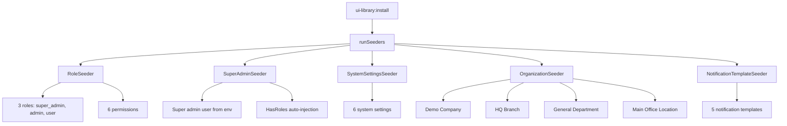

# Factories & Seeders Analysis Report

**Date:** 2026-08-10  
**Source:** `/Users/mac/Projects/LaravelProjects/quick-hr/app/Modules`  
**Target:** `/Users/mac/Projects/Libraries/ui-library`  
**Context:** Determining which Quick-HR factories and seeders should be included in the QuickerFaster UI Library for autonomous installation.

---

## Section 1: Complete Inventory

### Quick-HR Factories (13 files)

| # | File Path | Type | Model Created | Dependencies |
|---|-----------|------|---------------|--------------|
| 1 | `Admin/Database/Factories/RoleFactory.php` | Factory | `App\Modules\Admin\Models\Role` (extends Spatie\Role) | `App\Modules\Admin\Models\Role` |
| 2 | `Hr/Database/Factories/WorkPatternFactory.php` | Factory | `App\Modules\Hr\Models\WorkPattern` | `App\Modules\Hr\Models\WorkPattern`, `App\Modules\Hr\Models\Company` |
| 3 | `Hr/Database/Factories/AttendanceFactory.php` | Factory | `App\Modules\Hr\Models\Attendance` | `App\Modules\Hr\Models\Attendance`, `Employee`, `Company`, `Department` |
| 4 | `Hr/Database/Factories/JobTitleFactory.php` | Factory | `App\Modules\Hr\Models\JobTitle` | `App\Modules\Hr\Models\JobTitle`, `Company` |
| 5 | `Hr/Database/Factories/ShiftFactory.php` | Factory | `App\Modules\Hr\Models\Shift` | `App\Modules\Hr\Models\Shift`, `Company` |
| 6 | `Hr/Database/Factories/ShiftScheduleFactory.php` | Factory | `App\Modules\Hr\Models\ShiftSchedule` | `App\Modules\Hr\Models\ShiftSchedule`, `Company` |
| 7 | `Hr/Database/Factories/EmployeeFactory.php` | Factory | `App\Modules\Hr\Models\Employee` | `App\Modules\Hr\Models\Employee`, `Department`, `Company` |
| 8 | `Hr/Database/Factories/LocationFactory.php` | Factory | `App\Modules\Hr\Models\Location` | `App\Modules\Hr\Models\Location`, `Company` |
| 9 | `Hr/Database/Factories/CompanyFactory.php` | Factory | `App\Modules\Hr\Models\Company` | `App\Modules\Hr\Models\Company` |
| 10 | `Hr/Database/Factories/AttendancePolicyFactory.php` | Factory | `App\Modules\Hr\Models\AttendancePolicy` | `App\Modules\Hr\Models\AttendancePolicy`, `Company` |
| 11 | `Hr/Database/Factories/ClockEventFactory.php` | Factory | `App\Modules\Hr\Models\ClockEvent` | `App\Modules\Hr\Models\ClockEvent`, `Company`, `Employee` |
| 12 | `Hr/Database/Factories/EmployeePositionFactory.php` | Factory | `App\Modules\Hr\Models\EmployeePosition` | `App\Modules\Hr\Models\Employee`, `EmployeePosition`, `Shift`, `Department`, `JobTitle`, `Company` |
| 13 | `Hr/Database/Factories/DepartmentFactory.php` | Factory | `App\Modules\Hr\Models\Department` | `App\Modules\Hr\Models\Department`, `Company` |

### Quick-HR Seeders (10 files)

| # | File Path | Type | What It Seeds | Dependencies |
|---|-----------|------|---------------|--------------|
| 1 | `Admin/Database/Seeders/QFDatabaseSeeder.php` | Seeder | Auto-discovers and runs all module seeders | `App\Modules\*` (dynamic discovery) |
| 2 | `Admin/Database/Seeders/RoleSeeder.php` | Seeder | 13 roles (super_admin, company_admin, hr_manager, hr_officer, hr_admin, payroll_officer, accountant, payroll_manager, manager, supervisor, recruiter, employee) | `App\Modules\Admin\Models\Role` |
| 3 | `System/Database/Seeders/DefaultDataSeeder.php` | Seeder | Placeholder Company, default Shift, WorkPattern, AttendancePolicy, Location, Department | `App\Modules\Hr\Models\Company`, `Shift`, `WorkPattern`, `AttendancePolicy`, `Location`, `Department` |
| 4 | `Hr/Database/Seeders/MultiCompanyPayrollTestDataSeeder.php` | Seeder | 4 companies, pay schedules, 100 employees, positions, payroll profiles, payroll runs, adjustments (734 lines) | `App\Modules\Hr\Models\*` (15+ models) |
| 5 | `Hr/Database/Seeders/JobTitleSeeder.php` | Seeder | 4 job titles (HR Manager, HR Assistant, Recruiter, Training Officer) | `App\Modules\Hr\Models\JobTitle` |
| 6 | `Hr/Database/Seeders/EmployeeWithDependenciesSeeder.php` | Seeder | 5,000 employees with positions, payroll profiles, dependencies (374 lines) | `App\Modules\Hr\Models\*` (10+ models) |
| 7 | `Hr/Database/Seeders/WorkShiftSeeder.php` | Seeder | **EMPTY** — all code commented out | `App\Models\WorkDay` (commented) |
| 8 | `Hr/Database/Seeders/BonusAndDeductionTypeSeeders.php` | Seeder | **EMPTY** — all code commented out | `Illuminate\Support\Facades\DB` (commented) |
| 9 | `Hr/Database/Seeders/OnboardingTaskSeeder.php` | Seeder | **EMPTY** — all code commented out | `App\Models\OnboardingTask` (commented) |
| 10 | `Hr/Database/Seeders/WorkDaySeeder.php` | Seeder | **EMPTY** — all code commented out | `App\Models\WorkDay` (commented) |

### Library Existing Seeders (5 files)

| # | File Path | What It Seeds |
|---|-----------|---------------|
| 1 | [`src/Core/Admin/Database/Seeders/RoleSeeder.php`](src/Core/Admin/Database/Seeders/RoleSeeder.php:1) | 3 roles (super_admin, admin, user) + 6 permissions |
| 2 | [`src/Core/Admin/Database/Seeders/SuperAdminSeeder.php`](src/Core/Admin/Database/Seeders/SuperAdminSeeder.php:1) | Super admin user via `env()` credentials |
| 3 | [`src/Core/System/Database/Seeders/SystemSettingsSeeder.php`](src/Core/System/Database/Seeders/SystemSettingsSeeder.php:1) | 6 default system settings (app_name, date_format, time_format, timezone, language, pagination) |
| 4 | [`src/Core/Organization/Database/Seeders/OrganizationSeeder.php`](src/Core/Organization/Database/Seeders/OrganizationSeeder.php:1) | Demo Company, Branch (HQ), Department (General), Location (Main Office) |
| 5 | [`src/Core/Common/Database/Seeders/NotificationTemplateSeeder.php`](src/Core/Common/Database/Seeders/NotificationTemplateSeeder.php:1) | 5 notification templates (document_generated, report_ready, workflow_stage_changed) |

---

## Section 2: Verdicts

### Factories

#### 1. RoleFactory — `Admin/Database/Factories/RoleFactory.php`
**Verdict: Stale – Remove**

**Justification:**
- References `App\Modules\Admin\Models\Role` — a Quick-HR-specific model that extends Spatie's `Role`. The library uses Spatie's `Role` directly via [`RoleSeeder`](src/Core/Admin/Database/Seeders/RoleSeeder.php:6).
- The library does not have its own `Role` model class; it relies on `Spatie\Permission\Models\Role`.
- A factory for Spatie's `Role` could be useful for testing, but the library currently has no test suite and no `Role` model to attach a factory to.
- The library's [`RoleSeeder`](src/Core/Admin/Database/Seeders/RoleSeeder.php:1) creates roles directly via `firstOrCreate`, making a factory unnecessary for seeding.

---

#### 2–13. All HR Module Factories
**Verdict: Stale – Remove (all 12)**

**Justification (applies uniformly):**
- Every HR factory references `App\Modules\Hr\Models\*` — models that do not and should not exist in the UI library.
- These models represent HR-specific domain concepts: `Employee`, `Attendance`, `PayrollRun`, `ClockEvent`, `WorkPattern`, `Shift`, `ShiftSchedule`, `EmployeePosition`, `AttendancePolicy`, `JobTitle`, `Location`, `Department`, `Company`.
- The library's [`OrganizationSeeder`](src/Core/Organization/Database/Seeders/OrganizationSeeder.php:1) already handles `Company`, `Branch`, `Department`, and `Location` seeding using the library's own models (`QuickerFaster\UILibrary\Core\Organization\Models\*`), which are structurally different from Quick-HR's `App\Modules\Hr\Models\*`.
- Including HR factories would pull in an entire HR domain model that is out of scope for a generic UI library.

---

### Seeders

#### 1. QFDatabaseSeeder — `Admin/Database/Seeders/QFDatabaseSeeder.php`
**Verdict: Stale – Remove**

**Justification:**
- This is a meta-seeder that auto-discovers all seeders across `App\Modules/*/Database/Seeders/`. It depends on Quick-HR's modular directory structure.
- The library already has its own seeding orchestration via [`InstallCommand::runSeeders()`](src/Console/Commands/InstallCommand.php:318), which explicitly calls each seeder class by its FQCN.
- The auto-discovery pattern is clever but unnecessary — the library has a fixed, known set of 5 seeders.

---

#### 2. RoleSeeder — `Admin/Database/Seeders/RoleSeeder.php`
**Verdict: Stale – Remove (already covered)**

**Justification:**
- The library already has [`RoleSeeder`](src/Core/Admin/Database/Seeders/RoleSeeder.php:1) which creates 3 roles (`super_admin`, `admin`, `user`) with 6 permissions.
- The Quick-HR version creates 13 HR-specific roles (`hr_manager`, `payroll_officer`, `recruiter`, etc.) that are irrelevant to a generic UI library.
- The Quick-HR version references `App\Modules\Admin\Models\Role` instead of `Spatie\Permission\Models\Role`.
- **Recommendation:** The library's existing RoleSeeder is sufficient. However, the Quick-HR version's `description` and `editable` fields on roles are a pattern worth noting for future enhancement of the library's RoleSeeder.

---

#### 3. DefaultDataSeeder — `System/Database/Seeders/DefaultDataSeeder.php`
**Verdict: Stale – Remove (already covered)**

**Justification:**
- Creates a placeholder `Company`, default `Shift`, `WorkPattern`, `AttendancePolicy`, `Location`, and `Department` — all using `App\Modules\Hr\Models\*`.
- The library's [`OrganizationSeeder`](src/Core/Organization/Database/Seeders/OrganizationSeeder.php:1) already creates a demo `Company`, `Branch`, `Department`, and `Location` using the library's own models.
- The library's [`SystemSettingsSeeder`](src/Core/System/Database/Seeders/SystemSettingsSeeder.php:1) handles system-level defaults.
- `Shift`, `WorkPattern`, and `AttendancePolicy` are HR-specific concepts not needed in the library.

---

#### 4. MultiCompanyPayrollTestDataSeeder — `Hr/Database/Seeders/MultiCompanyPayrollTestDataSeeder.php`
**Verdict: Stale – Remove**

**Justification:**
- 734-line seeder that creates comprehensive payroll test data across 4 companies with 100 employees.
- References 15+ `App\Modules\Hr\Models\*` classes.
- Guard clause restricts to `local`/`staging`/`development` environments — clearly test-only.
- Entirely HR/payroll domain-specific. Zero relevance to a generic UI library.

---

#### 5. JobTitleSeeder — `Hr/Database/Seeders/JobTitleSeeder.php`
**Verdict: Stale – Remove**

**Justification:**
- Seeds 4 HR-specific job titles into `App\Modules\Hr\Models\JobTitle`.
- The library has no `JobTitle` model and no use case for job titles.

---

#### 6. EmployeeWithDependenciesSeeder — `Hr/Database/Seeders/EmployeeWithDependenciesSeeder.php`
**Verdict: Stale – Remove**

**Justification:**
- 374-line seeder creating 5,000 employees with positions, payroll profiles, and all dependencies.
- References 10+ `App\Modules\Hr\Models\*` classes.
- Guard clause restricts to `local`/`staging`/`development`.
- Mass data generation for HR stress-testing — not relevant to the library.

---

#### 7–10. WorkShiftSeeder, BonusAndDeductionTypeSeeders, OnboardingTaskSeeder, WorkDaySeeder
**Verdict: Stale – Remove (all 4 are empty shells)**

**Justification:**
- All four files have their `run()` method bodies entirely commented out.
- They are dead code that was never cleaned up.
- Even if uncommented, they reference HR-specific models (`App\Models\WorkDay`, `App\Models\OnboardingTask`) or raw `DB` tables.

---

## Section 3: Recommended Next Steps

### 3.1 Files to Copy: NONE

After thorough analysis, **zero** Quick-HR factories or seeders should be copied into the UI library. Every file is either:

| Category | Count | Files |
|----------|-------|-------|
| HR-specific (references `App\Modules\Hr\Models\*`) | 16 | All HR factories + DefaultDataSeeder, MultiCompanyPayrollTestDataSeeder, JobTitleSeeder, EmployeeWithDependenciesSeeder |
| Already covered by library | 2 | RoleSeeder (Admin), QFDatabaseSeeder |
| Empty/dead code | 4 | WorkShiftSeeder, BonusAndDeductionTypeSeeders, OnboardingTaskSeeder, WorkDaySeeder |
| References Quick-HR-specific model | 1 | RoleFactory |

### 3.2 What the Library Already Has (and Should Keep)

The library's 5 existing seeders provide complete coverage for autonomous installation:

### 3.3 Integration with `ui-library:install`

The [`InstallCommand::runSeeders()`](src/Console/Commands/InstallCommand.php:318) method already calls all 5 library seeders in the correct dependency order:

1. **RoleSeeder** — must run first (permissions and roles)
2. **SuperAdminSeeder** — depends on roles existing
3. **SystemSettingsSeeder** — independent
4. **OrganizationSeeder** — independent (creates demo org structure)
5. **NotificationTemplateSeeder** — independent

No changes are needed to the InstallCommand. The existing set is complete and self-contained.

### 3.4 Potential Future Enhancements (NOT from Quick-HR)

While no Quick-HR files should be copied, the analysis revealed patterns that could inspire future library enhancements:

1. **Enhanced RoleSeeder with descriptions:** The Quick-HR RoleSeeder includes `description` and `editable` fields on roles. The library's RoleSeeder could be enhanced to include role descriptions without adding HR-specific roles.

2. **UserFactory:** The library currently has no `UserFactory`. A generic `UserFactory` (using `App\Models\User`) could be created for testing purposes. This would be a new file, not copied from Quick-HR.

3. **DemoDataSeeder:** A new optional seeder that creates sample dashboard data (e.g., a few demo users with different roles, sample activity logs) could enhance the "first boot" experience. This would be a new creation, not adapted from Quick-HR's HR-specific seeders.

### 3.5 Summary Table

| Quick-HR File | Verdict | Action |
|---------------|---------|--------|
| `Admin/Database/Factories/RoleFactory.php` | Stale | Ignore |
| `Hr/Database/Factories/WorkPatternFactory.php` | Stale | Ignore |
| `Hr/Database/Factories/AttendanceFactory.php` | Stale | Ignore |
| `Hr/Database/Factories/JobTitleFactory.php` | Stale | Ignore |
| `Hr/Database/Factories/ShiftFactory.php` | Stale | Ignore |
| `Hr/Database/Factories/ShiftScheduleFactory.php` | Stale | Ignore |
| `Hr/Database/Factories/EmployeeFactory.php` | Stale | Ignore |
| `Hr/Database/Factories/LocationFactory.php` | Stale | Ignore |
| `Hr/Database/Factories/CompanyFactory.php` | Stale | Ignore |
| `Hr/Database/Factories/AttendancePolicyFactory.php` | Stale | Ignore |
| `Hr/Database/Factories/ClockEventFactory.php` | Stale | Ignore |
| `Hr/Database/Factories/EmployeePositionFactory.php` | Stale | Ignore |
| `Hr/Database/Factories/DepartmentFactory.php` | Stale | Ignore |
| `Admin/Database/Seeders/QFDatabaseSeeder.php` | Stale | Ignore |
| `Admin/Database/Seeders/RoleSeeder.php` | Stale (covered) | Ignore |
| `System/Database/Seeders/DefaultDataSeeder.php` | Stale (covered) | Ignore |
| `Hr/Database/Seeders/MultiCompanyPayrollTestDataSeeder.php` | Stale | Ignore |
| `Hr/Database/Seeders/JobTitleSeeder.php` | Stale | Ignore |
| `Hr/Database/Seeders/EmployeeWithDependenciesSeeder.php` | Stale | Ignore |
| `Hr/Database/Seeders/WorkShiftSeeder.php` | Stale (empty) | Ignore |
| `Hr/Database/Seeders/BonusAndDeductionTypeSeeders.php` | Stale (empty) | Ignore |
| `Hr/Database/Seeders/OnboardingTaskSeeder.php` | Stale (empty) | Ignore |
| `Hr/Database/Seeders/WorkDaySeeder.php` | Stale (empty) | Ignore |

**Final count: 0 files to include, 23 files to ignore.**

---

## Conclusion

The Quick-HR application's factories and seeders are overwhelmingly HR-domain-specific. They reference models (`App\Modules\Hr\Models\*`) that represent payroll, attendance, employee management, and workforce scheduling — none of which belong in a generic UI library.

The QuickerFaster UI Library's existing 5 seeders ([`RoleSeeder`](src/Core/Admin/Database/Seeders/RoleSeeder.php:1), [`SuperAdminSeeder`](src/Core/Admin/Database/Seeders/SuperAdminSeeder.php:1), [`SystemSettingsSeeder`](src/Core/System/Database/Seeders/SystemSettingsSeeder.php:1), [`OrganizationSeeder`](src/Core/Organization/Database/Seeders/OrganizationSeeder.php:1), [`NotificationTemplateSeeder`](src/Core/Common/Database/Seeders/NotificationTemplateSeeder.php:1)) already provide complete coverage for autonomous installation: roles, permissions, admin user, system settings, demo organization structure, and notification templates. No additions are needed.