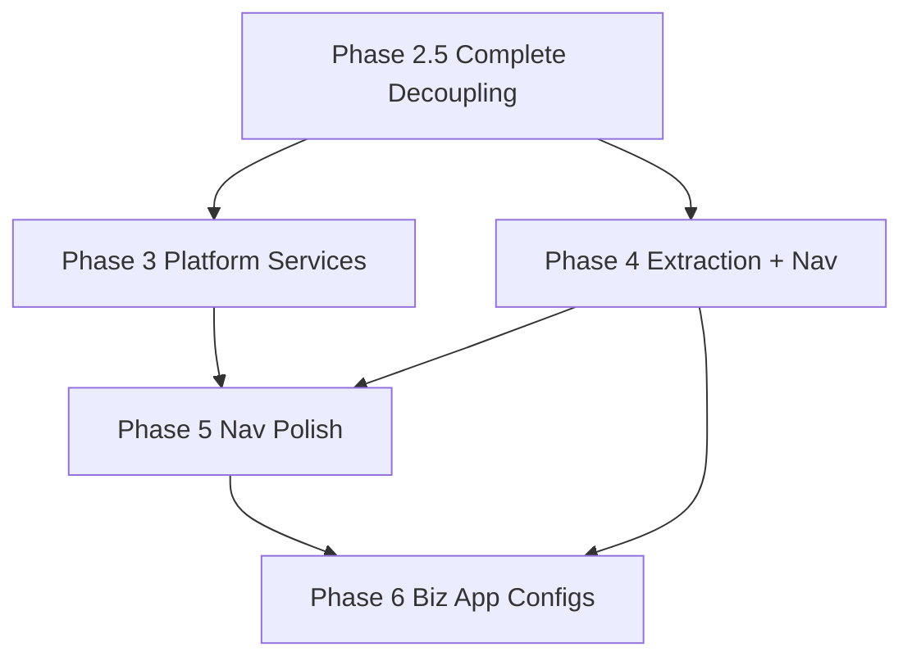
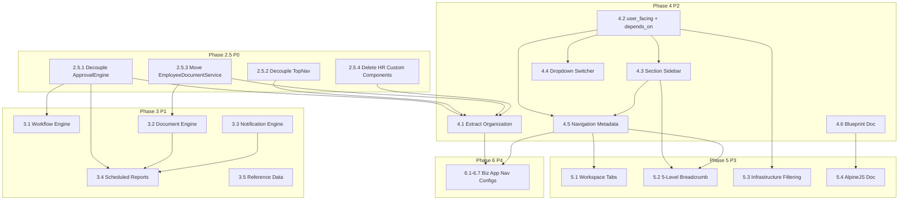

# QuickerFaster Application Platform — Implementation Plan

> **Status**: Planning Complete  
> **Date**: 2026-08-07  
> **Source Documents**: [`gap-analysis.md`](docs/gap-analysis.md), [`input3-gap-supplement.md`](docs/input3-gap-supplement.md), [`input3.txt`](src/input3.txt)

---

## 1. Executive Summary

### 1.1 What We've Built

**Phase 1** (Complete) established the package skeleton:
- Three Core module directories under [`src/Core/`](src/Core/) — `Admin`, `System`, `Common`
- Three new contracts: [`ModuleContract`](src/Contracts/Modules/ModuleContract.php), [`NavigationProvider`](src/Contracts/Navigation/NavigationProvider.php), [`SettingsProvider`](src/Contracts/Settings/SettingsProvider.php)
- Three new events for module lifecycle
- [`ModuleSwitcher`](src/Http/Livewire/Layouts/Navs/ModuleSwitcher.php) component
- Updated `composer.json` and decoupled [`SettingsManager::getContextHash()`](src/Services/Settings/SettingsManager.php)

**Phase 2** (Complete) decoupled service providers:
- [`UILibraryServiceProvider`](src/Providers/UILibraryServiceProvider.php) and [`ModuleServiceProvider`](src/Providers/ModuleServiceProvider.php) rewritten to remove HR coupling
- [`NavigationLayout`](src/Components/NavigationLayout.php) decoupled via `resolveNavigationConfigPath()`
- Library routes cleaned — Core module seeders, views, navigation configs, and routes created
- Core modules: [`Admin`](src/Core/Admin/) (routes, views, nav, seeders), [`System`](src/Core/System/) (routes, views, nav, seeders), [`Common`](src/Core/Common/) (app settings, onboarding, tour configs)

**Current Capabilities**: Configuration-driven CRUD (14 field types via [`FieldFactory`](src/Factories/FieldTypes/FieldFactory.php)), 19 widget processors, report builder/viewer, import/export with chunked processing, approval engine (basic), settings management, search infrastructure, onboarding/tour wizards, Bootstrap 5 (Soft UI Dashboard), Laravel + Livewire 3, Spatie Permission + Fortify.

### 1.2 What's Missing — All Gaps Consolidated

| Gap ID | Source | Description | Category |
|---|---|---|---|
| G11 | gap §2.4.1 | [`ApprovalEngine`](src/Services/Approvals/ApprovalEngine.php) references `App\Modules\System\Models\*` | HR Coupling (P0) |
| G12 | gap §2.4.2 | [`TopNav`](src/Http/Livewire/Layouts/Navs/TopNav.php) hard-codes `\App\Modules\Hr\Models\Company` (lines 70, 76) | HR Coupling (P0) |
| G13 | gap §2.4.3 | [`EmployeeDocumentService`](src/Services/Documents/EmployeeDocumentService.php) references `App\Modules\Hr\Models\Employee`, `Document` | HR Coupling (P0) |
| G14 | gap §2.4.4 | [`EmployeeDetail`](src/Http/Livewire/Custom/EmployeeDetail.php), [`SearchableEmployeeDropdown`](src/Http/Livewire/Custom/SearchableEmployeeDropdown.php), [`TaxBandsRepeater`](src/Http/Livewire/Custom/TaxBandsRepeater.php) + views still in library | HR Coupling (P0) |
| G1 | gap §2.1.1 | No Generic Workflow Engine — only tier-based [`ApprovalEngine`](src/Services/Approvals/ApprovalEngine.php) | Missing Service (P1) |
| G2 | gap §2.1.2 | No Generic Document Engine — only HR-specific [`EmployeeDocumentService`](src/Services/Documents/EmployeeDocumentService.php) | Missing Service (P1) |
| G3 | gap §2.1.3 | No Generic Notification Engine — zero notification infrastructure | Missing Service (P1) |
| G4 | gap §2.1.4 | No Scheduled Reports — [`ReportBuilder`](src/Http/Livewire/Reports/ReportBuilder.php) and [`ReportViewer`](src/Http/Livewire/Reports/ReportViewer.php) exist but no scheduling | Missing Feature (P2) |
| G5 | gap §2.1.5 | No Reference Data module — Countries, Currencies, Languages, etc. | Missing Module (P2) |
| G6 | gap §2.2.1 | Organization module lives in HR app, should be extracted to [`src/Core/Organization/`](src/Core/) | Missing Extraction (P2) |
| G7 | gap §2.3.1 | `Application → Workspace → Section → Sidebar` hierarchy not implemented (current: `Module → ContextGroup → ContextItem`) | Architecture (P3) |
| G8 | gap §2.3.2 | Still named "UI Library" — should be "Application Platform" | Naming (P5) |
| G9 | gap §2.3.3 / C1 | No AlpineJS constraint — Livewire 3 requires AlpineJS, not documented | Documentation (P3) |
| G10 | gap §2.3.4 | [`docs/architecture/application-platform-blueprint.md`](docs/architecture/) does not exist | Documentation (P3) |
| C4 | gap §3 | Application Switcher vs Module Switcher UX mismatch — icon bar vs dropdown | UX (P2) |
| N1 | supp §3.2 | Section-based sidebar rendering (section headers grouping pages) | UI Library (P2) |
| N2 | supp §3.2 | Config-driven navigation metadata structure (`Module → workspaces() → pages() → actions()`) | UI Library (P1) |
| N3 | supp §3.2 | Application switcher dropdown UX (Google Workspace style) | UI Library (P2) |
| N4 | supp §3.2 | Infrastructure module filtering — `user_facing` flag | Config (P2) |
| N5 | supp §3.2 | Workspace tabs in TopNav | UI Library (P3) |
| N6 | supp §3.2 | 5-level breadcrumb support (`Application → Workspace → Section → Page → Record`) | UI Library (P3) |

### 1.3 Overall Strategy

The plan follows five phases ordered by dependency:

1. **Phase 2.5**: Remove last 4 HR couplings — makes the library truly standalone 
2. **Phase 3**: Build the 5 missing platform services — makes it an Application Platform
3. **Phase 4**: Extract Organization + enhance navigation — foundational business module + config-driven nav
4. **Phase 5**: Navigation polish + documentation — complete input3.txt vision
5. **Phase 6**: Business application navigation configs — scaffold the 7 applications from input3.txt



---

## 2. Phase 2.5: Complete Decoupling (P0 — Immediate)

> **Goal**: Remove the last 4 HR couplings. Make the library truly standalone with zero `App\Modules\*` references.

### 2.5.1 Decouple ApprovalEngine

**Problem**: [`ApprovalEngine`](src/Services/Approvals/ApprovalEngine.php:5-8) imports and directly instantiates:
```php
use App\Modules\System\Models\ApprovalRequest;
use App\Modules\System\Models\ApprovalTier;
use App\Modules\System\Models\ApprovalLog;
use App\Modules\System\Models\ApprovalTierApproval;
```

These models live in the HR app's `System` module, not in the library. The engine creates them directly (e.g., `ApprovalRequest::create([...])` at [line 44](src/Services/Approvals/ApprovalEngine.php:44), `ApprovalTier::create([...])` at [line 58](src/Services/Approvals/ApprovalEngine.php:58)).

**Solution**: Replace hard-coded Eloquent model references with a `HasApproval` trait + `ApprovalModelResolver` contract.

**New Files**:

| File | Purpose |
|---|---|
| [`src/Contracts/Approvals/ApprovalModelResolver.php`](src/Contracts/Approvals/) | Contract: `resolveRequestModel()`, `resolveTierModel()`, `resolveLogModel()`, `resolveTierApprovalModel()` |
| [`src/Services/Approvals/ApprovalModelResolver.php`](src/Services/Approvals/) | Default implementation using config-driven model bindings |
| [`src/Traits/Approvals/HasApproval.php`](src/Traits/Approvals/HasApproval.php) | (Update existing) Add `getApprovalModelClass()` method |

**Modified Files**:

| File | Changes |
|---|---|
| [`src/Services/Approvals/ApprovalEngine.php`](src/Services/Approvals/ApprovalEngine.php) | Replace `use App\Modules\System\Models\*` with constructor-injected `ApprovalModelResolver`. Replace `ApprovalRequest::create()` with `$this->resolver->resolveRequestModel()::create()` |
| [`src/Config/ui-library.php`](src/Config/ui-library.php) | Add `approvals.models` key: `{request, tier, log, tier_approval}` mapping to FQCNs |
| [`src/Providers/UILibraryServiceProvider.php`](src/Providers/UILibraryServiceProvider.php) | Bind default `ApprovalModelResolver` in `register()` |

**Config Schema** (`ui-library.php` addition):

```php
'approvals' => [
    'models' => [
        'request' => \App\Modules\System\Models\ApprovalRequest::class,
        'tier' => \App\Modules\System\Models\ApprovalTier::class,
        'log' => \App\Modules\System\Models\ApprovalLog::class,
        'tier_approval' => \App\Modules\System\Models\ApprovalTierApproval::class,
    ],
],
```

**Contract**:

```php
namespace QuickerFaster\UILibrary\Contracts\Approvals;

interface ApprovalModelResolver
{
    public function resolveRequestModel(): string;
    public function resolveTierModel(): string;
    public function resolveLogModel(): string;
    public function resolveTierApprovalModel(): string;
}
```

**Verification**:
- `grep -r "App\\Modules" src/Services/Approvals/` returns zero results
- `ApprovalEngine` uses only `$this->resolver->resolve*()` and config
- Existing HR app continues to work by configuring `approvals.models` to point at its own models

**Dependencies**: None
**Estimated Effort**: Medium

---

### 2.5.2 Decouple TopNav

**Problem**: [`TopNav`](src/Http/Livewire/Layouts/Navs/TopNav.php:70,76) hard-codes `\App\Modules\Hr\Models\Company::orderBy('name')->get()` and `\App\Modules\Hr\Models\Company::where('id', $companyId)->get()`. The `loadCompanies()` method also relies on `$user->employee->company_id` (line 74), which is an HR-specific relationship.

**Solution**: Introduce a `CompanyProvider` contract with a configurable implementation. The library provides a default no-op provider; consuming apps register their own.

**New Files**:

| File | Purpose |
|---|---|
| [`src/Contracts/Navigation/CompanyProvider.php`](src/Contracts/Navigation/) | Contract: `getCompanies(?User $user): Collection`, `getCurrentCompanyId(?User $user): ?int` |

**Modified Files**:

| File | Changes |
|---|---|
| [`src/Http/Livewire/Layouts/Navs/TopNav.php`](src/Http/Livewire/Layouts/Navs/TopNav.php) | Replace `\App\Modules\Hr\Models\Company` usage with injected `CompanyProvider`. `loadCompanies()` calls `$this->companyProvider->getCompanies($user)`. |
| [`src/Config/ui-library.php`](src/Config/ui-library.php) | Add `navigation.company_provider` key pointing to FQCN |
| [`src/Providers/UILibraryServiceProvider.php`](src/Providers/UILibraryServiceProvider.php) | Bind `CompanyProvider` from config in `register()` |

**Config Schema** (`ui-library.php` addition):

```php
'navigation' => [
    // ... existing ...
    'company_provider' => env('UI_LIBRARY_COMPANY_PROVIDER', \QuickerFaster\UILibrary\Services\Navigation\NullCompanyProvider::class),
],
```

**Contract**:

```php
namespace QuickerFaster\UILibrary\Contracts\Navigation;

use Illuminate\Support\Collection;
use Illuminate\Foundation\Auth\User;

interface CompanyProvider
{
    /** @return Collection of company objects with at least id and name */
    public function getCompanies(?User $user): Collection;
    public function getCurrentCompanyId(?User $user): ?int;
}
```

**Default Implementation** (`NullCompanyProvider`): Returns empty collection, null company ID — company switcher is hidden.

**Verification**:
- `grep -r "App\\Modules\\Hr" src/Http/Livewire/Layouts/Navs/TopNav.php` returns zero
- `grep -r "App\\Modules\\Hr\\Models\\Company" src/` returns zero
- HR app registers its own `CompanyProvider` in its service provider

**Dependencies**: None
**Estimated Effort**: Small

---

### 2.5.3 Move EmployeeDocumentService to HR App

**Problem**: [`EmployeeDocumentService`](src/Services/Documents/EmployeeDocumentService.php:5-6) imports `App\Modules\Hr\Models\Employee` and `App\Modules\Hr\Models\Document`. This service is entirely HR-specific — it manages employee document upload quotas by employee number.

**Solution**: Move the entire file to the HR app and delete from the library.

**New Files** (in HR app):

| File | Purpose |
|---|---|
| `app/Services/Documents/EmployeeDocumentService.php` | Same file, namespace `App\Services\Documents` |

**Deleted Files** (from library):

| File | Reason |
|---|---|
| [`src/Services/Documents/EmployeeDocumentService.php`](src/Services/Documents/EmployeeDocumentService.php) | HR-specific, references HR models |

**Verification**:
- `grep -r "EmployeeDocumentService" src/` returns zero
- HR app has the file and registers its own binding
- Phase 3.2 Generic Document Engine is not blocked by this removal

**Dependencies**: None
**Estimated Effort**: Small

---

### 2.5.4 Delete HR Custom Livewire Components

**Problem**: Three HR-specific Livewire components still live in [`src/Http/Livewire/Custom/`](src/Http/Livewire/Custom/):
- [`EmployeeDetail.php`](src/Http/Livewire/Custom/EmployeeDetail.php)
- [`SearchableEmployeeDropdown.php`](src/Http/Livewire/Custom/SearchableEmployeeDropdown.php)
- [`TaxBandsRepeater.php`](src/Http/Livewire/Custom/TaxBandsRepeater.php)

These reference HR models (`Employee`, `TaxBand`, etc.) and are business-specific. They should have been deleted in Phase 2.

**Solution**: Delete from library. If the HR app needs them, they should be re-created under `app/Http/Livewire/` in the HR app namespace.

**Deleted Files**:

| File | Reason |
|---|---|
| [`src/Http/Livewire/Custom/EmployeeDetail.php`](src/Http/Livewire/Custom/EmployeeDetail.php) | HR-specific |
| [`src/Http/Livewire/Custom/SearchableEmployeeDropdown.php`](src/Http/Livewire/Custom/SearchableEmployeeDropdown.php) | HR-specific |
| [`src/Http/Livewire/Custom/TaxBandsRepeater.php`](src/Http/Livewire/Custom/TaxBandsRepeater.php) | HR-specific |

Also check and delete associated Blade views in [`src/Resources/views/livewire/custom/`](src/Resources/views/) if any.

**Verification**:
- `ls src/Http/Livewire/Custom/` returns empty (or only library-generic components)
- `grep -r "QuickFaster\\UILibrary\\Http\\Livewire\\Custom" app/` returns zero (HR app uses its own namespace)

**Dependencies**: None
**Estimated Effort**: Small

---

### Phase 2.5 Summary

| Task | Files Changed | Files Created | Files Deleted | Effort | Depends On |
|---|---|---|---|---|---|
| 2.5.1 | 3 | 2 | 0 | Medium | — |
| 2.5.2 | 3 | 1 | 0 | Small | — |
| 2.5.3 | 0 | 1 (in HR app) | 1 | Small | — |
| 2.5.4 | 0 | 0 | 3+ | Small | — |
| **Total** | **6** | **4** | **4+** | **~3 days** | — |

**Post-Phase 2.5 State**: Zero `App\Modules\*` references in the library. Library is a true standalone Composer package.

---

## 3. Phase 3: Core Platform Services (P1 — High Priority)

> **Goal**: Build the 5 missing platform services. Transform the library from a UI toolkit into an Application Platform.

### 3.1 Generic Workflow Engine

**Why**: The current [`ApprovalEngine`](src/Services/Approvals/ApprovalEngine.php) is tier-based approval only. input3.txt explicitly requests a workflow engine that powers Leave, Payroll, Purchase Requests, Expense Claims, Travel Requests, Recruitment, Invoices, Asset Disposal, and Disciplinary Actions. Leave approvals (U25) must use the Workflow Engine, not leave-specific tables.

**Directory Structure**:

```
src/Services/Workflow/
├── WorkflowEngine.php              # Core engine: start, transition, complete
├── WorkflowDefinition.php          # Model: config-driven workflow definition
├── WorkflowInstance.php            # Model: running instance of a workflow
├── WorkflowStep.php                # Model: individual step with status
├── WorkflowStepAction.php          # Model: action taken at a step
├── Contracts/
│   ├── Workflowable.php            # Contract for models that can enter workflows
│   ├── WorkflowResolver.php        # Contract: resolve definition from config
│   └── WorkflowStepResolver.php    # Contract: resolve approvers for a step
├── Engines/
│   ├── SequentialEngine.php        # Steps execute in order
│   ├── ParallelEngine.php          # Steps can execute concurrently
│   └── ConditionalEngine.php       # Branching based on conditions
├── Actions/
│   ├── ApproveAction.php           # Standard approval
│   ├── RejectAction.php            # Rejection with comments
│   ├── DelegateAction.php          # Delegation to another approver
│   └── EscalateAction.php          # Escalation after timeout
└── Config/
    └── workflow_definitions.php    # Example config shipped with library
```

**Models** (Eloquent, in `src/Models/`):

| Model | Key Columns | Purpose |
|---|---|---|
| `WorkflowDefinition` | `name, type, steps_config, applies_to [morph], is_active` | Config-driven workflow template |
| `WorkflowInstance` | `definition_id, workflowable_type, workflowable_id, current_step_id, status, started_at, completed_at` | Running workflow tracking |
| `WorkflowStep` | `instance_id, sequence, type, config, status, assigned_to, due_at` | Individual step state |
| `WorkflowStepAction` | `step_id, user_id, action, comments, metadata, performed_at` | Immutable action log |

**Contract** (`src/Contracts/Workflow/Workflowable.php`):

```php
namespace QuickerFaster\UILibrary\Contracts\Workflow;

interface Workflowable
{
    public function getWorkflowType(): string;
    public function getWorkflowData(): array;
    public function onWorkflowCompleted(WorkflowInstance $instance): void;
    public function onWorkflowRejected(WorkflowInstance $instance): void;
}
```

**Engine API**:

```php
class WorkflowEngine
{
    // Start a workflow for a model
    public function start(Workflowable $model, ?User $initiator = null): WorkflowInstance;
    
    // Transition to next step(s) based on engine type
    public function transition(WorkflowInstance $instance, string $action, ?User $actor = null): WorkflowInstance;
    
    // Get available actions for current step
    public function getAvailableActions(WorkflowInstance $instance, User $user): array;
    
    // Check if user can act on this instance
    public function canAct(WorkflowInstance $instance, User $user): bool;
    
    // Get pending instances for a user
    public function getPendingFor(User $user): Collection;
}
```

**Config Schema** (new file [`src/Config/workflow.php`](src/Config/)):

```php
return [
    'definitions' => [
        'leave_request' => [
            'engine' => 'sequential',
            'steps' => [
                ['name' => 'Manager Approval', 'type' => 'approval', 'resolver' => 'manager', 'timeout_hours' => 48],
                ['name' => 'HR Review', 'type' => 'approval', 'resolver' => 'role:hr_officer', 'timeout_hours' => 72],
            ],
        ],
        'expense_claim' => [
            'engine' => 'conditional',
            'steps' => [
                ['name' => 'Manager Approval', 'type' => 'approval', 'resolver' => 'manager'],
                ['name' => 'Finance Review', 'type' => 'approval', 'resolver' => 'role:finance', 'condition' => 'amount > 5000'],
            ],
        ],
    ],
    'models' => [
        'definition' => \QuickerFaster\UILibrary\Models\WorkflowDefinition::class,
        'instance' => \QuickerFaster\UILibrary\Models\WorkflowInstance::class,
        'step' => \QuickerFaster\UILibrary\Models\WorkflowStep::class,
        'step_action' => \QuickerFaster\UILibrary\Models\WorkflowStepAction::class,
    ],
    'escalation' => [
        'enabled' => true,
        'default_timeout_hours' => 72,
        'escalation_resolver' => 'direct_manager',
    ],
];
```

**Integration with Phase 2.5**: The existing `HasApproval` trait should be updated to use the new `WorkflowEngine` internally, maintaining backward compatibility. Old `ApprovalEngine` is deprecated but kept functional for migration.

**Verification**:
- A `LeaveRequest` model implements `Workflowable`, a workflow definition exists, `WorkflowEngine::start()` creates instance with steps
- `getAvailableActions()` returns correct actions per user role
- `transition()` advances through sequential steps correctly
- Escalation triggers after configured timeout

**Dependencies**: Phase 2.5 (ApprovalEngine decoupled)
**Estimated Effort**: Large

---

### 3.2 Generic Document Engine

**Why**: Only HR-specific [`EmployeeDocumentService`](src/Services/Documents/EmployeeDocumentService.php) exists. input2.txt calls for a reusable document engine handling Employee Documents, Contracts, Invoices, Purchase Orders, Receipts, Certificates, Photos, Attachments.

**Directory Structure**:

```
src/Services/Documents/
├── DocumentEngine.php              # Core engine: store, retrieve, version, expire
├── DocumentRepository.php          # Abstract storage operations
├── Contracts/
│   ├── Documentable.php            # Contract for models with documents
│   └── DocumentStorageDriver.php   # Contract: local, S3, etc.
├── Drivers/
│   ├── LocalDriver.php             # Local filesystem
│   └── S3Driver.php                # AWS S3
├── Models/
│   ├── Document.php                # Core document model
│   ├── DocumentType.php            # Configurable document types
│   └── DocumentVersion.php         # Version tracking
└── Config/
    └── document_types.php          # Default document type definitions
```

**Model** (`src/Models/Document.php`):

| Column | Type | Purpose |
|---|---|---|
| `id` | bigint | Primary key |
| `documentable_type` | string | Polymorphic owner |
| `documentable_id` | bigint | Polymorphic owner ID |
| `document_type_id` | bigint | FK to DocumentType |
| `filename` | string | Original filename |
| `path` | string | Storage path |
| `mime_type` | string | File MIME type |
| `size` | bigint | File size in bytes |
| `disk` | string | Storage disk name |
| `version` | int | Version number |
| `expires_at` | timestamp | Optional expiry |
| `metadata` | json | Arbitrary metadata |
| `uploaded_by` | bigint | FK to users |

**Contract** (`src/Contracts/Documents/Documentable.php`):

```php
namespace QuickerFaster\UILibrary\Contracts\Documents;

interface Documentable
{
    public function getDocumentFolder(): string;
    public function getDocumentDisk(): string;
    public function getMaxDocuments(): ?int; // null = unlimited
    public function getAllowedMimeTypes(): ?array; // null = all
    public function getMaxFileSize(): ?int; // null = unlimited, bytes
}
```

**Config Schema** (addition to `ui-library.php`):

```php
'documents' => [
    'disk' => env('UI_LIBRARY_DOCUMENT_DISK', 'local'),
    'max_file_size' => env('UI_LIBRARY_DOCUMENT_MAX_SIZE', 10485760), // 10MB
    'allowed_mimes' => ['application/pdf', 'image/jpeg', 'image/png', 'application/msword', 'application/vnd.openxmlformats-officedocument.wordprocessingml.document'],
    'types' => [
        'contract' => ['label' => 'Contract', 'icon' => 'fa-file-contract'],
        'certificate' => ['label' => 'Certificate', 'icon' => 'fa-certificate'],
        'identification' => ['label' => 'Identification', 'icon' => 'fa-id-card'],
        'photo' => ['label' => 'Photo', 'icon' => 'fa-image'],
        'attachment' => ['label' => 'Attachment', 'icon' => 'fa-paperclip'],
    ],
],
```

**Verification**:
- Any model implementing `Documentable` can attach documents via `DocumentEngine::store()`
- File type validation occurs via config
- Moved EmployeeDocumentService to HR app (Phase 2.5.3) — HR app uses this engine

**Dependencies**: Phase 2.5 (EmployeeDocumentService removed)
**Estimated Effort**: Medium

---

### 3.3 Generic Notification Engine

**Why**: Zero notification infrastructure exists. input2.txt calls for Email, SMS, WhatsApp, In-App, Push, Slack channels via one unified engine. This is a cross-cutting service used by Workflow, Documents, Scheduled Reports, and all business modules.

**Directory Structure**:

```
src/Services/Notifications/
├── NotificationEngine.php          # Core engine: send, queue, batch
├── NotificationTemplate.php        # Model: reusable templates
├── Notification.php                # Model: individual notification record
├── NotificationPreference.php      # Model: user channel preferences
├── Contracts/
│   ├── NotificationChannel.php     # Contract: send() method
│   └── Notifiable.php              # Contract for models receiving notifications
├── Channels/
│   ├── EmailChannel.php            # Laravel Mail integration
│   ├── SmsChannel.php              # Twilio/Vonage integration
│   ├── InAppChannel.php            # Database notifications
│   ├── PushChannel.php             # Firebase/APNs
│   └── SlackChannel.php            # Slack webhook
├── Events/
│   ├── NotificationSent.php        # Fired after successful send
│   ├── NotificationFailed.php      # Fired after failed send
│   └── NotificationQueued.php      # Fired when queued
└── Config/
    └── notification_channels.php   # Channel configuration
```

**Model** (`src/Models/Notification.php`):

| Column | Type | Purpose |
|---|---|---|
| `id` | bigint | Primary key |
| `notifiable_type` | string | Polymorphic recipient |
| `notifiable_id` | bigint | Polymorphic recipient ID |
| `template_id` | bigint | FK to template (nullable) |
| `channel` | string | email, sms, in_app, push, slack |
| `subject` | string | Notification subject |
| `body` | text | Notification body (rendered) |
| `data` | json | Raw data for template rendering |
| `status` | string | queued, sent, failed, read |
| `sent_at` | timestamp | When sent |
| `read_at` | timestamp | When read (in-app) |
| `error` | text | Error message if failed |

**Contract** (`src/Contracts/Notifications/NotificationChannel.php`):

```php
namespace QuickerFaster\UILibrary\Contracts\Notifications;

interface NotificationChannel
{
    public function send(Notification $notification): bool;
    public function isAvailable(): bool;
    public function getName(): string;
}
```

**Config Schema** (new file [`src/Config/notifications.php`](src/Config/)):

```php
return [
    'channels' => [
        'email' => [
            'enabled' => env('NOTIFICATION_EMAIL_ENABLED', true),
            'channel_class' => \QuickerFaster\UILibrary\Services\Notifications\Channels\EmailChannel::class,
            'from_address' => env('MAIL_FROM_ADDRESS'),
            'from_name' => env('MAIL_FROM_NAME'),
        ],
        'sms' => [
            'enabled' => env('NOTIFICATION_SMS_ENABLED', false),
            'channel_class' => \QuickerFaster\UILibrary\Services\Notifications\Channels\SmsChannel::class,
            'provider' => env('SMS_PROVIDER', 'twilio'),
        ],
        'in_app' => [
            'enabled' => true,
            'channel_class' => \QuickerFaster\UILibrary\Services\Notifications\Channels\InAppChannel::class,
        ],
    ],
    'queue' => [
        'connection' => env('NOTIFICATION_QUEUE_CONNECTION', 'database'),
        'queue' => 'notifications',
    ],
    'templates' => [
        'workflow.approval_requested' => [
            'subject' => 'Approval Requested: {workflowable_name}',
            'body' => 'A new approval has been requested for {workflowable_name} by {submitter_name}.',
            'channels' => ['email', 'in_app'],
        ],
        'workflow.approved' => [
            'subject' => 'Approved: {workflowable_name}',
            'body' => 'Your request for {workflowable_name} has been approved.',
            'channels' => ['email', 'in_app'],
        ],
        'document.expiring' => [
            'subject' => 'Document Expiring: {document_name}',
            'body' => 'The document {document_name} expires on {expiry_date}.',
            'channels' => ['email'],
        ],
        'report.ready' => [
            'subject' => 'Report Ready: {report_name}',
            'body' => 'Your scheduled report {report_name} is ready for viewing.',
            'channels' => ['email', 'in_app'],
        ],
    ],
];
```

**Integration Points**:
- Workflow Engine calls `NotificationEngine::send()` on step transitions
- Document Engine sends expiry notices
- Scheduled Reports sends "report ready" notifications

**Verification**:
- Send via Email channel delivers to Mailtrap/real SMTP
- Send via In-App channel creates database notification visible in UI
- Template rendering substitutes `{workflowable_name}`, `{submitter_name}` etc.
- Queue dispatches notification jobs

**Dependencies**: None (Phase 3.1 and 3.2 will integrate with it)
**Estimated Effort**: Large

---

### 3.4 Scheduled Reports

**Why**: [`ReportBuilder`](src/Http/Livewire/Reports/ReportBuilder.php) and [`ReportViewer`](src/Http/Livewire/Reports/ReportViewer.php) exist but have no scheduling mechanism.

**Directory Structure**:

```
src/Models/
└── ReportSchedule.php              # New model linking SavedReport to a schedule

src/Services/Reports/
└── ReportScheduler.php             # Manages schedule CRUD + cron execution

src/Console/Commands/
└── RunScheduledReports.php         # Artisan command called by cron
```

**Model** (`src/Models/ReportSchedule.php`):

| Column | Type | Purpose |
|---|---|---|
| `id` | bigint | Primary key |
| `saved_report_id` | bigint | FK to `saved_reports` |
| `frequency` | string | daily, weekly, monthly, quarterly |
| `time` | time | When to run (HH:MM) |
| `day_of_week` | int | For weekly (1-7) |
| `day_of_month` | int | For monthly (1-31) |
| `recipients` | json | `[{type: "user", id: 1}, {type: "email", address: "x@y.com"}]` |
| `is_active` | boolean | Toggle |
| `last_run_at` | timestamp | Last execution |
| `next_run_at` | timestamp | Next scheduled execution |

**Config addition** (`ui-library.php` features section — already has `'reports' => true`):

```php
'features' => [
    // ... existing ...
    'scheduled_reports' => true,
    'scheduled_report_cron' => '* * * * *',
    'scheduled_report_cache_ttl' => 60, // minutes
],
```

**Verification**:
- `php artisan reports:run-scheduled` executes due reports
- Generated report lands in recipients' email
- `last_run_at` and `next_run_at` update correctly
- Schedule CRUD works in ReportBuilder UI

**Dependencies**: Phase 3.2 (Document Engine for export), Phase 3.3 (Notification Engine for delivery)
**Estimated Effort**: Small

---

### 3.5 Reference Data Module

**Why**: No shared lookup data exists. input2.txt (lines 307-345) describes Countries, Currencies, Languages, Units, Categories, Tags, Tax Codes, Payment Methods, Banks, Holiday Types, Document Types, Statuses.

**Directory Structure**:

```
src/Core/ReferenceData/
├── Config/
│   └── navigation.php              # Navigation config for Reference Data in app
├── Database/
│   ├── Migrations/
│   │   ├── create_countries_table.php
│   │   ├── create_currencies_table.php
│   │   ├── create_languages_table.php
│   │   └── create_measurement_units_table.php
│   └── Seeders/
│       ├── CountrySeeder.php       # All ISO countries
│       ├── CurrencySeeder.php      # All ISO currencies
│       └── LanguageSeeder.php      # Common languages
├── Models/
│   ├── Country.php
│   ├── Currency.php
│   ├── Language.php
│   └── MeasurementUnit.php
└── Routes/
    └── web.php                     # API routes for reference data lookups
```

**Models** — Simple lookup tables, all configurable via CRUD:

| Model | Key Columns |
|---|---|
| `Country` | `id, name, iso2, iso3, phone_code, currency_code, is_active` |
| `Currency` | `id, name, code, symbol, decimal_places, is_active` |
| `Language` | `id, name, code, locale, is_active` |
| `MeasurementUnit` | `id, name, abbreviation, type [length, weight, volume, etc.], is_active` |

**Note**: Tags, Categories, Statuses — these are better handled as polymorphic taggable/categorizable traits within their respective modules, not as a centralized Reference Data service. The Reference Data module focuses on **globally shared, slowly-changing reference data** (ISO standards, measurement systems).

**Config Schema** (`ui-library.php` modules array addition):

```php
'reference_data' => [
    'enabled' => true,
    'label' => 'Reference Data',
    'icon' => 'fa-database',
    'route' => 'reference-data.countries.index',
    'order' => 910,
    'roles' => ['super_admin', 'admin'],
    'core' => true,
    'user_facing' => false, // infrastructure module
],
```

**Verification**:
- Seeded countries, currencies match ISO standards
- CRUD pages work via standard DataTable/Form config
- Navigation entry appears when module is enabled

**Dependencies**: None
**Estimated Effort**: Medium

---

### Phase 3 Summary

| Task | Description | Effort | Depends On |
|---|---|---|---|
| 3.1 | Generic Workflow Engine | Large | Phase 2.5 |
| 3.2 | Generic Document Engine | Medium | Phase 2.5 |
| 3.3 | Generic Notification Engine | Large | None |
| 3.4 | Scheduled Reports | Small | 3.2, 3.3 |
| 3.5 | Reference Data module | Medium | None |
| **Total** | | **~19 days** | |

---

## 4. Phase 4: Module Extraction & Navigation Enhancement (P2 — Medium Priority)

> **Goal**: Extract Organization into Core as the shared foundation. Enhance navigation to match the input3.txt vision of config-driven, section-based sidebar with application switcher dropdown.

### 4.1 Extract Organization into Core

**Why**: Organization (Company, Branch, Department, Division, Business Unit, Location, Cost Center, Team) is the single most shared dependency across all business applications. input3.txt confirms: "Everything depends on Organization. Nothing depends on HR except HR." Currently it lives in the HR app as `app/Modules/Organization/`.

**Solution**: Move `app/Modules/Organization/` → [`src/Core/Organization/`](src/Core/) with full namespace refactoring.

**Directory Structure**:

```
src/Core/Organization/
├── Config/
│   └── navigation.php              # Navigation: Application → Workspace → Section → Page
├── Database/
│   ├── Migrations/
│   │   ├── create_companies_table.php
│   │   ├── create_branches_table.php
│   │   ├── create_departments_table.php
│   │   ├── create_divisions_table.php
│   │   ├── create_business_units_table.php
│   │   ├── create_locations_table.php
│   │   ├── create_cost_centers_table.php
│   │   └── create_teams_table.php
│   └── Seeders/
│       └── OrganizationDemoSeeder.php
├── Models/
│   ├── Company.php                 # namespace: QuickerFaster\UILibrary\Core\Organization\Models
│   ├── Branch.php
│   ├── Department.php
│   ├── Division.php
│   ├── BusinessUnit.php
│   ├── Location.php
│   ├── CostCenter.php
│   └── Team.php
├── Data/
│   ├── Company.php                 # DataTable/Form config (metadata-driven CRUD)
│   ├── Department.php
│   └── ...
├── Resources/
│   └── views/                      # Blade views (if any)
└── Routes/
    └── web.php                     # Standard CRUD routes
```

**Namespace Change**: `App\Modules\Organization\Models\Company` → `QuickerFaster\UILibrary\Core\Organization\Models\Company`

**Key Model Relationships** (designed per input3.txt):

```php
// Company.php
class Company extends Model
{
    public function branches(): HasMany { ... }
    public function departments(): HasMany { ... }
    public function businessUnits(): HasMany { ... }
    public function locations(): HasMany { ... }
}

// Department.php
class Department extends Model
{
    public function company(): BelongsTo { ... }
    public function parent(): BelongsTo { ... }  // self-referential hierarchy
    public function teams(): HasMany { ... }
    // NOT: employees() — HR owns that relationship
}
```

**Config Addition** (`ui-library.php` modules array):

```php
'organization' => [
    'enabled' => true,
    'label' => 'Organization',
    'icon' => 'fa-building',
    'route' => 'organization.dashboard',
    'order' => 100,
    'roles' => ['super_admin', 'admin'],
    'core' => true,
    'user_facing' => true,
    'depends_on' => ['admin'],
],
```

**Navigation** — matches input3.txt Organization design with 6 workspaces:

```php
// src/Core/Organization/Config/navigation.php
return [
    'workspaces' => [
        'dashboard' => [
            'label' => 'Dashboard',
            'icon' => 'fa-tachometer-alt',
            'pages' => ['overview', 'organization-summary', 'growth', 'recent-changes'],
        ],
        'companies' => [
            'label' => 'Companies',
            'icon' => 'fa-building',
            'pages' => ['overview', 'companies', 'branches', 'business-units', 'legal-entities'],
        ],
        'structure' => [
            'label' => 'Structure',
            'icon' => 'fa-sitemap',
            'sections' => [
                'hierarchy' => [
                    'label' => 'Hierarchy',
                    'pages' => ['overview', 'departments', 'divisions', 'teams'],
                ],
                'visualization' => [
                    'label' => 'Visualization',
                    'pages' => ['organization-chart'],
                ],
            ],
        ],
        'locations' => [
            'label' => 'Locations',
            'icon' => 'fa-map-marker-alt',
            'pages' => ['overview', 'locations', 'regions', 'countries', 'addresses'],
        ],
        'classification' => [
            'label' => 'Classification',
            'icon' => 'fa-tags',
            'pages' => ['overview', 'tags', 'categories', 'labels', 'custom-fields'],
        ],
        'reports' => [
            'label' => 'Reports',
            'icon' => 'fa-chart-bar',
            'pages' => ['overview', 'company-reports', 'department-reports', 'location-reports', 'growth-reports'],
        ],
    ],
];
```

**Cascade Impact**: HR, Payroll, Time, Leave models that reference `App\Modules\Organization\Models\*` must be updated. This is the highest-risk task in Phase 4. See Risk Assessment §8.

**Verification**:
- `grep -r "App\\Modules\\Organization" app/` returns zero
- Organization module appears in ModuleSwitcher
- Navigation shows 6 workspace tabs, contextual sidebar
- Company model accessible via library namespace from HR app

**Dependencies**: Phase 2.5 (Organization module may currently depend on HR for user/employee relationships — verify and sever)
**Estimated Effort**: Medium

---

### 4.2 Add `user_facing` and `depends_on` to Module Registry

**Why**: input3.txt requires infrastructure modules (Workflow, Notifications, Audit, Files) to be hidden from the ModuleSwitcher. Users should only see user-facing applications. `depends_on` enables module loading order validation.

**Files Modified**:

| File | Changes |
|---|---|
| [`src/Config/ui-library.php`](src/Config/ui-library.php) | Add `user_facing` and `depends_on` keys to each module entry |
| [`src/Http/Livewire/Layouts/Navs/ModuleSwitcher.php`](src/Http/Livewire/Layouts/Navs/ModuleSwitcher.php) | Filter modules by `user_facing === true` |
| [`src/Providers/ModuleServiceProvider.php`](src/Providers/ModuleServiceProvider.php) | Validate `depends_on` modules are enabled before loading |

**Config Schema** (updated module entries):

```php
'modules' => [
    'admin' => [
        'enabled' => true,
        'label' => 'Administration',
        'icon' => 'fa-shield-haltered',
        'route' => 'admin.dashboard',
        'order' => 900,
        'roles' => ['super_admin'],
        'core' => true,
        'user_facing' => true,
        'depends_on' => [],
    ],
    'system' => [
        'enabled' => true,
        'label' => 'System',
        'icon' => 'fa-cog',
        'route' => 'system.dashboard',
        'order' => 999,
        'roles' => ['super_admin'],
        'core' => true,
        'user_facing' => true,
        'depends_on' => [],
    ],
    'organization' => [
        // ... see 4.1 ...
        'user_facing' => true,
        'depends_on' => ['admin'],
    ],
    'reference_data' => [
        // ... see 3.5 ...
        'user_facing' => false,     // Infrastructure — hidden from switcher
        'depends_on' => [],
    ],
],
```

**Verification**:
- `ModuleSwitcher` does not render modules where `user_facing === false`
- `ModuleServiceProvider` throws clear exception if `depends_on` module is disabled
- All 7 user-facing applications appear in switcher, infrastructure modules don't

**Dependencies**: None
**Estimated Effort**: Tiny

---

### 4.3 Section-Based Sidebar Rendering

**Why**: input3.txt's navigation hierarchy adds a Section level: `Application → Workspace → Section → Page`. When a workspace has 8-10+ pages, they should be visually grouped under section headers.

**Current State**: Sidebar items are flat. Navigation config has `context_groups` and `contexts`.

**Target State**: [`Sidebar`](src/Http/Livewire/Layouts/Navs/Sidebar.php) renders section headers when navigation config includes `sections`.

**Files Modified**:

| File | Changes |
|---|---|
| [`src/Http/Livewire/Layouts/Navs/Sidebar.php`](src/Http/Livewire/Layouts/Navs/Sidebar.php) | Add section rendering with visual headers |
| [`src/Components/NavigationLayout.php`](src/Components/NavigationLayout.php) | Pass section data from navigation config to Sidebar |
| [`src/Resources/views/livewire/layouts/navs/sidebar.blade.php`](src/Resources/views/livewire/layouts/navs/) | Add section header template |
| [`src/Core/Organization/Config/navigation.php`](src/Core/Organization/Config/) | Example usage with sections (see 4.1) |

**Navigation Config Schema** (adds `sections` key):

```php
// Current (flat):
'workspace_slug' => [
    'label' => 'Structure',
    'icon' => 'fa-sitemap',
    'pages' => ['departments', 'divisions', 'teams', 'organization-chart'],
]

// New (sectioned):
'workspace_slug' => [
    'label' => 'Structure',
    'icon' => 'fa-sitemap',
    'sections' => [
        'hierarchy' => [
            'label' => 'Hierarchy',
            'icon' => 'fa-layer-group',
            'pages' => ['departments', 'divisions', 'teams'],
        ],
        'visualization' => [
            'label' => 'Visualization',
            'icon' => 'fa-project-diagram',
            'pages' => ['organization-chart'],
        ],
    ],
]
```

**Verification**:
- Organization → Structure workspace shows "Hierarchy" and "Visualization" section headers in sidebar
- Flat workspaces (no sections key) render exactly as before (backward compatible)
- Section headers are visually distinct (muted text, possibly collapsible)

**Dependencies**: Phase 4.2 (`user_facing` flag)
**Estimated Effort**: Medium

---

### 4.4 Dropdown Application Switcher

**Why**: C4 contradiction — current [`ModuleSwitcher`](src/Http/Livewire/Layouts/Navs/ModuleSwitcher.php) shows icon buttons with tooltips, but input3.txt specifies a dropdown labeled with the current application name (like Google Workspace app launcher).

**Current Behavior**: Icon buttons in top-left, no labels visible.

**Target Behavior**: `[ HR ▼ ]` dropdown showing current app name, clicking opens list of user-facing applications with checkmark on active one.

**Files Modified**:

| File | Changes |
|---|---|
| [`src/Http/Livewire/Layouts/Navs/ModuleSwitcher.php`](src/Http/Livewire/Layouts/Navs/ModuleSwitcher.php) | Redesign render: dropdown trigger with current app label, dropdown menu with app names |
| [`src/Resources/views/livewire/layouts/navs/module-switcher.blade.php`](src/Resources/views/livewire/layouts/navs/) | New Blade template: dropdown with `[ Current App ▼ ]` |
| [`src/Resources/views/layouts/app.blade.php`](src/Resources/views/) | Adjust top-bar layout to accommodate wider dropdown trigger |

**UX Specification**:

```
┌──────────────────────────────────────────────────────────────┐
│ [ HR ▼ ]     Dashboard  People  Time  Leave  Reports         │
│                                              Company  User   │
├───────────────┬──────────────────────────────────────────────┤
│               │                                              │
```

Clicking `[ HR ▼ ]` opens:

```
┌─────────────────────┐
│ Applications        │
├─────────────────────┤
│ ✓ HR                │
│   Payroll           │
│   Time              │
│   Leave             │
│   Organization      │
│   Administration    │
│   System            │
└─────────────────────┘
```

**Key**: Only `user_facing: true` modules appear. Infrastructure modules (Reference Data, Workflow config, etc.) are hidden.

**Verification**:
- Dropdown shows current application name
- All `user_facing: true` modules listed
- Clicking switches application and updates sidebar
- Mobile responsive — dropdown adapts to narrow screens

**Dependencies**: Phase 4.2 (`user_facing` flag)
**Estimated Effort**: Small

---

### 4.5 Config-Driven Navigation Metadata

**Why**: N2 — input3.txt proposes `Module → workspaces() → pages() → actions()` declarative metadata model. This is the foundation for generating application switcher, top nav, sidebar, breadcrumbs, permissions, and search all from one config.

**New File**: [`src/Contracts/Navigation/NavigationMetadata.php`](src/Contracts/Navigation/)

```php
namespace QuickerFaster\UILibrary\Contracts\Navigation;

interface NavigationMetadata
{
    /** Get the application/module display name */
    public function getApplicationName(): string;
    
    /** Get the application icon (Font Awesome class) */
    public function getApplicationIcon(): string;
    
    /** Get all workspace definitions */
    public function getWorkspaces(): array;
    
    /** Get pages for a workspace */
    public function getWorkspacePages(string $workspaceSlug): array;
    
    /** Get section groupings for a workspace (optional, returns empty if flat) */
    public function getWorkspaceSections(string $workspaceSlug): array;
    
    /** Get page metadata (type, actions, permissions, data_source) */
    public function getPageMetadata(string $workspaceSlug, string $pageSlug): array;
    
    /** Get breadcrumb trail for a page */
    public function getBreadcrumbs(string $workspaceSlug, string $pageSlug): array;
}
```

**Navigation Metadata Structure** (returned by `getWorkspaces()`):

```php
[
    'dashboard' => [
        'label' => 'Dashboard',
        'icon' => 'fa-tachometer-alt',
        'order' => 1,
        'pages' => [
            'overview' => [
                'label' => 'Overview',
                'route' => 'admin.dashboard',
                'icon' => 'fa-home',
                'type' => 'dashboard',           // CRUD, dashboard, bulk, approval, report
                'permissions' => ['view_dashboard'],
                'actions' => [],                 // create, export, import, etc.
            ],
            // ...
        ],
        // OR with sections:
        'sections' => [
            'hierarchy' => [
                'label' => 'Hierarchy',
                'pages' => [ /* ... */ ],
            ],
        ],
    ],
    // ...
]
```

**Integration**:

Each Core module provides its navigation via a `NavigationMetadata` implementation:

```php
class OrganizationNavigationMetadata implements NavigationMetadata
{
    public function getWorkspaces(): array
    {
        return require __DIR__ . '/../../Core/Organization/Config/navigation.php';
    }
    // ...
}
```

[`NavigationLayout`](src/Components/NavigationLayout.php) resolves the current module's `NavigationMetadata` implementation from the service container and renders accordingly.

**Files**:

| File | Purpose |
|---|---|
| [`src/Contracts/Navigation/NavigationMetadata.php`](src/Contracts/Navigation/) | Contract |
| [`src/Services/Navigation/NavigationMetadataResolver.php`](src/Services/Navigation/) | Resolves metadata implementation per module |
| [`src/Components/NavigationLayout.php`](src/Components/NavigationLayout.php) | Updated to consume `NavigationMetadata` |
| [`src/Core/Admin/Config/navigation.php`](src/Core/Admin/Config/) | Updated to new metadata format |
| [`src/Core/System/Config/navigation.php`](src/Core/System/Config/) | Updated to new metadata format |
| [`src/Core/Organization/Config/navigation.php`](src/Core/Organization/Config/) | New metadata format |

**Verification**:
- `NavigationLayout` renders top-nav workspace tabs from metadata
- Sidebar renders section headers from metadata when sections defined
- Breadcrumbs render correct 4-level or 5-level trail from metadata
- Adding a new Core module requires only implementing `NavigationMetadata` — no wiring changes

**Dependencies**: Phase 4.2 (`user_facing` flag), Phase 4.3 (Section-based sidebar)
**Estimated Effort**: Large

---

### 4.6 Create Architecture Blueprint Document

**Why**: G10 — [`docs/architecture/application-platform-blueprint.md`](docs/architecture/) is the single source of truth for platform architecture recommended in `input.txt` lines 758-768.

**File**: [`docs/architecture/application-platform-blueprint.md`](docs/architecture/application-platform-blueprint.md)

**Content Outline**:

1. **Platform Philosophy**: Capability-based module organization, layered dependency model, business-oriented UX
2. **Architecture Layers**: Foundation → Security → Organization → Business Modules → Cross-Cutting Services
3. **Dependency Graph**: Visual diagram showing `System → Security → Organization → Business → Workflow → Notifications → Reporting`
4. **Navigation Model**: `Application → Workspace → Section → Page → Record` hierarchy
5. **Module Structure Standard**: Directory layout, required files (config, routes, models, migrations, seeders, navigation)
6. **Contracts Catalog**: All contracts in the library with descriptions
7. **Configuration Reference**: All config keys in `ui-library.php`, `workflow.php`, `notifications.php`, `documents.php`
8. **Event Map**: All events fired by the platform
9. **Development Conventions**: Namespace rules, naming conventions, Livewire component patterns
10. **AlpineJS Policy**: Livewire 3 ships AlpineJS — it is available but custom Alpine code should be avoided; interactivity via Livewire events

**Verification**: Document exists, is comprehensive, and serves as onboarding for new developers.

**Dependencies**: None
**Estimated Effort**: Small

---

### Phase 4 Summary

| Task | Description | Effort | Depends On |
|---|---|---|---|
| 4.1 | Extract Organization into Core | Medium | Phase 2.5 |
| 4.2 | Add `user_facing` + `depends_on` to module registry | Tiny | None |
| 4.3 | Section-based sidebar rendering | Medium | 4.2 |
| 4.4 | Dropdown application switcher | Small | 4.2 |
| 4.5 | Config-driven navigation metadata | Large | 4.2, 4.3 |
| 4.6 | Architecture blueprint document | Small | None |
| **Total** | | **~15 days** | |

---

## 5. Phase 5: Navigation & UX Polish (P3 — Lower Priority)

> **Goal**: Complete the navigation vision from input3.txt — workspace tabs, 5-level breadcrumbs, infrastructure filtering, AlpineJS documentation.

### 5.1 Workspace Tabs in TopNav

**Current State**: [`TopNav`](src/Http/Livewire/Layouts/Navs/TopNav.php) renders items from its `$items` array (passed from `NavigationLayout`). These are currently context groups.

**Target State**: TopNav shows workspace names from the active application's `NavigationMetadata` as top-center tabs. The active workspace is highlighted. Switching tabs changes the sidebar.

**Files Modified**:

| File | Changes |
|---|---|
| [`src/Http/Livewire/Layouts/Navs/TopNav.php`](src/Http/Livewire/Layouts/Navs/TopNav.php) | Accept workspace data from metadata. Render as tabs. |
| [`src/Components/NavigationLayout.php`](src/Components/NavigationLayout.php) | Resolve workspace tabs from `NavigationMetadata` and pass to TopNav |
| [`src/Resources/views/livewire/layouts/navs/top-nav.blade.php`](src/Resources/views/livewire/layouts/navs/) | Tab-style rendering |

**UX Specification**:

```
┌──────────────────────────────────────────────────────────────┐
│ [ HR ▼ ]   [Dashboard] [People] [Time] [Leave] [Reports]    │
│                                              Company  User   │
├───────────────┬──────────────────────────────────────────────┤
```

- Selected tab has accent underline/background
- Clicking a tab updates sidebar via Livewire event
- Overflow tabs collapse into "More ▼" dropdown
- Mobile: tabs collapse into hamburger or scroll horizontally

**Verification**:
- Switching applications changes tab set
- Clicking "People" tab shows People sidebar
- Active tab persists across page navigations (Livewire state)

**Dependencies**: Phase 4.5 (NavigationMetadata)
**Estimated Effort**: Medium

---

### 5.2 5-Level Breadcrumb Support

**Current State**: Breadcrumbs in [`NavigationLayout`](src/Components/NavigationLayout.php) support: Application → Page.

**Target State**: `Application → Workspace → Section → Page → Record` per N6.

**Files Modified**:

| File | Changes |
|---|---|
| [`src/Components/NavigationLayout.php`](src/Components/NavigationLayout.php) | Accept Section level from `NavigationMetadata`. Build 5-segment breadcrumbs. |
| [`src/Resources/views/components/navigation-layout.blade.php`](src/Resources/views/) | Render 5-segment breadcrumb trail |

**Breadcrumb Example**:

```text
HR > People > Employment > Employees > John Doe
```

**Verification**:
- Record-level breadcrumbs show when viewing a specific record
- Section-level breadcrumbs show when Section is defined in metadata
- Backward compatible: workspaces without sections still show 3-level breadcrumbs

**Dependencies**: Phase 4.3 (Section sidebar), Phase 4.5 (NavigationMetadata)
**Estimated Effort**: Small

---

### 5.3 Infrastructure Module Filtering in ModuleSwitcher

**Already handled by Phase 4.2** — the `user_facing` flag on modules, combined with the Phase 4.4 dropdown switcher, hides non-user-facing modules.

**Additional**: Ensure the "Applications" management page in the System module (U10 workspace 5) distinguishes between user-facing and infrastructure modules.

**Files Modified**:

| File | Changes |
|---|---|
| [`src/Core/System/Resources/views/dashboard.blade.php`](src/Core/System/Resources/views/) | If an "Installed Applications" view exists, show `user_facing` status |

**Verification**:
- Infrastructure modules not visible in ModuleSwitcher
- Infrastructure modules visible in System → Applications management page

**Dependencies**: Phase 4.2
**Estimated Effort**: Tiny

---

### 5.4 Document AlpineJS/Livewire 3 Constraint

**Why**: G9/C1 — input.txt says "No AlpineJS" but Livewire 3 ships it. Per gap-analysis, the resolution is: document that AlpineJS is a Livewire 3 dependency, the constraint refers to not writing custom AlpineJS code, and all interactivity should go through Livewire events.

**Files**:

| File | Purpose |
|---|---|
| [`docs/architecture/application-platform-blueprint.md`](docs/architecture/) (§10) | AlpineJS Policy section |
| [`CONTRIBUTING.md`](CONTRIBUTING.md) | (if exists) Add AlpineJS guidance |
| [`README.md`](README.md) | (if exists) Mention Livewire 3 + AlpineJS in tech stack |

**Policy Text**:

> **AlpineJS Policy**: Livewire 3 ships AlpineJS as a runtime dependency used internally for DOM diffing and reactivity. AlpineJS is available in the global scope and can be used, but the project convention is:
> - **All component interactivity should use Livewire events and properties**, not custom AlpineJS `x-data` directives.
> - AlpineJS may be used sparingly for trivial UI concerns (dropdown toggles, transition effects) where a full Livewire roundtrip is unnecessary.
> - Custom AlpineJS components that manage business state are prohibited.
> - This policy ensures consistency with the platform's event-driven architecture.

**Verification**: Document section exists and is clear.

**Dependencies**: Phase 4.6 (Blueprint document)
**Estimated Effort**: Tiny

---

### Phase 5 Summary

| Task | Description | Effort |
|---|---|---|
| 5.1 | Workspace tabs in TopNav | Medium |
| 5.2 | 5-level breadcrumb support | Small |
| 5.3 | Infrastructure module filtering | Tiny |
| 5.4 | AlpineJS/Livewire 3 documentation | Tiny |
| **Total** | | **~5 days** |

---

## 6. Phase 6: Business Application Navigation Configs (P4 — Future)

> **Goal**: Create navigation configs for all 7 applications designed in input3.txt, following the standardized `Application → Workspace → Section → Page` hierarchy defined in Phase 4.5.

This phase is **scaffolding only** — creating the navigation skeletons and module registrations. Actual business logic (models, migrations, controllers, data configs) is out of scope for the library. These configs define what the UI library renders; the HR app provides the implementations.

### 6.1 System Application

**Source**: input3.txt lines 1659-2071  
**6 workspaces**: Dashboard, Accounts, Subscriptions, Plans, Applications, Settings  
**~30 sidebar items**

**File**: [`src/Core/System/Config/navigation.php`](src/Core/System/Config/navigation.php) — already exists, update to full metadata format.

**Navigation Skeleton**:

```
SYSTEM
├── Dashboard          [overview, platform-health, recent-activity, usage-statistics, notifications]
├── Accounts           [overview, accounts, account-groups, account-statuses, invitations, account-activity]
├── Subscriptions      [overview, subscriptions, trials, renewals, invoices, payments, subscription-history]
├── Plans              [overview, plans, features, limits, pricing, promotions]
├── Applications       [overview, installed-applications, marketplace, dependencies, versions, updates]
└── Settings           [overview, general, branding, localization, email, notifications, storage, security, backups, system-logs]
```

### 6.2 Administration Application

**Source**: input3.txt lines 2083-2545  
**5 workspaces**: Dashboard, Users, Access Control, Security, Audit  
**~25 sidebar items**

**File**: [`src/Core/Admin/Config/navigation.php`](src/Core/Admin/Config/navigation.php) — already exists, update to full metadata format.

**Navigation Skeleton**:

```
ADMINISTRATION
├── Dashboard          [overview, user-statistics, role-summary, recent-activity, security-alerts]
├── Users              [overview, users, invitations, user-groups, user-preferences, sessions]
├── Access Control     [overview, roles, permissions, permission-groups, role-assignments, policies]
├── Security           [overview, authentication, password-policies, multi-factor-authentication, api-tokens, login-restrictions]
└── Audit              [overview, activity-logs, login-history, system-events, exports]
```

### 6.3 Organization Application

**Source**: input3.txt lines 2552-3216  
**6 workspaces**: Dashboard, Companies, Structure, Locations, Classification, Reports  
**~30 sidebar items**

**File**: [`src/Core/Organization/Config/navigation.php`](src/Core/Organization/Config/) — created in Phase 4.1

**Navigation Skeleton**:

```
ORGANIZATION
├── Dashboard          [overview, organization-summary, growth, recent-changes]
├── Companies          [overview, companies, branches, business-units, legal-entities]
├── Structure          [Sections: Hierarchy → departments, divisions, teams | Visualization → organization-chart]
├── Locations          [overview, locations, regions, countries, addresses]
├── Classification     [overview, tags, categories, labels, custom-fields]
└── Reports            [overview, company-reports, department-reports, location-reports, growth-reports]
```

### 6.4 HR Application

**Source**: input3.txt lines 3220-3862  
**6 workspaces**: Dashboard, People, Employment, Development, Documents, Reports  
**~35 sidebar items**

**File**: Creates reference config — lives in HR app, not library. The library provides the metadata contract; the HR app implements it.

**Navigation Skeleton**:

```
HR
├── Dashboard          [overview, workforce-summary, new-hires, upcoming-events]
├── People             [overview, employees, profiles, contacts, dependents, emergency-contacts]
├── Employment         [overview, current-jobs, job-history, job-titles, employment-types, skills, qualifications, certifications]
├── Development        [overview, training, performance, career-plans, succession]
├── Documents          [overview, employee-documents, templates, document-types, expiring-documents]
└── Reports            [overview, employee-reports, employment-reports, skills-reports, compliance-reports]
```

### 6.5 Time Application

**Source**: input3.txt lines 3880-4462  
**6 workspaces**: Dashboard, Scheduling, Attendance, Time Tracking, Adjustments, Reports  
**~30 sidebar items**

**Navigation Skeleton**:

```
TIME
├── Dashboard          [overview, todays-workforce, attendance-summary, exceptions]
├── Scheduling         [overview, shifts, shift-patterns, work-schedules, holiday-calendars]
├── Attendance         [overview, attendance, daily-attendance, attendance-sessions, attendance-exceptions]
├── Time Tracking      [overview, clock-events, timesheets, overtime, approvals]
├── Adjustments        [overview, attendance-adjustments, manual-entries, correction-requests, approval-history]
└── Reports            [overview, attendance-reports, overtime-reports, scheduling-reports, exception-reports]
```

### 6.6 Leave Application

**Source**: input3.txt lines 4466-5026  
**6 workspaces**: Dashboard, Requests, Policies, Balances, Calendar, Reports  
**~30 sidebar items**

**Navigation Skeleton**:

```
LEAVE
├── Dashboard          [overview, leave-summary, pending-approvals, upcoming-leave]
├── Requests           [overview, leave-requests, my-requests, approvals, history]
├── Policies           [overview, leave-types, leave-policies, eligibility-rules, approval-rules]
├── Balances           [overview, leave-balances, accruals, adjustments, carry-forward]
├── Calendar           [overview, leave-calendar, team-calendar, public-holidays]
└── Reports            [overview, leave-reports, balance-reports, utilization-reports, approval-reports]
```

### 6.7 Payroll Application

**Source**: input3.txt lines 5044-5746  
**7 workspaces**: Dashboard, Employees, Compensation, Processing, Compliance, Payments, Reports  
**~35 sidebar items**

**Navigation Skeleton**:

```
PAYROLL
├── Dashboard          [overview, payroll-summary, upcoming-payroll, exceptions]
├── Employees          [overview, payroll-profiles, salary-structures, bank-accounts, tax-profiles, benefit-profiles]
├── Compensation       [overview, earnings, deductions, benefits, loans, recurring-items, one-time-adjustments]
├── Processing         [overview, pay-schedules, payroll-runs, previews, approvals, payslips]
├── Compliance         [overview, payroll-policies, statutory-rules, tax-rules, pension-rules, policy-assignments]
├── Payments           [overview, payment-batches, bank-files, payment-history, reconciliation]
└── Reports            [overview, payroll-register, department-cost, bank-schedule, tax-reports, pension-reports, variance-reports]
```

### Phase 6 Summary

| Task | Description | Effort |
|---|---|---|
| 6.1 | System navigation config update | Small |
| 6.2 | Administration navigation config update | Small |
| 6.3 | Organization navigation config (Phase 4.1) | Included in 4.1 |
| 6.4 | HR navigation reference config | Small |
| 6.5 | Time navigation reference config | Small |
| 6.6 | Leave navigation reference config | Small |
| 6.7 | Payroll navigation reference config | Small |
| **Total** | | **~5 days** |

**Note**: Tasks 6.4-6.7 create reference configs only. They do not build the business modules themselves — those live in the HR app or future client projects.

---

## 7. Dependency Graph & Critical Path

### 7.1 Full Dependency Graph



### 7.2 Critical Path

The critical path is the longest chain of dependencies:

```
Phase 2.5 (complete decoupling, ~3 days)
    → Phase 4.2 (user_facing flag, tiny)
        → Phase 4.3 (section sidebar, medium)
            → Phase 4.5 (navigation metadata, large)
                → Phase 5.1 (workspace tabs, medium)
                → Phase 5.2 (5-level breadcrumbs, small)
                → Phase 6 (biz app nav configs, small)
```

**Total Critical Path**: ~17 days sequential work

### 7.3 Parallelizable Work

Several tasks can run in parallel:

| Group | Tasks | Why Parallel |
|---|---|---|
| Phase 2.5 | All 4 decoupling tasks | Independent — different files |
| Phase 3 | 3.3 (Notifications) + 3.5 (Reference Data) | Neither depends on Phase 2.5 |
| Phase 4 | 4.2 + 4.6 | Neither depends on other Phase 4 tasks |
| Phase 3-4 overlap | 3.1 (after 2.5) + 4.1 (after 2.5) + 4.2 (independent) | Different areas of codebase |

---

## 8. Risk Assessment

| Risk | Phase | Likelihood | Impact | Mitigation |
|---|---|---|---|---|
| **Organization extraction breaks HR/Payroll app** | 4.1 | High | High | Namespace migration is surgical but cascade of `use` statements is large. Run comprehensive search before starting. Create a migration script. Test HR app thoroughly after extraction. |
| **NavigationMetadata contract is over-engineered** | 4.5 | Medium | Medium | Start with the simplest contract (just `getWorkspaces()` and `getWorkspacePages()`). Add sections, actions, metadata iteratively. Don't build the full vision in one pass. |
| **Workflow Engine scope creep** | 3.1 | Medium | High | "Generic workflow engine" can become a project of its own. Define clear MVP: sequential engine only, approval actions only, no conditional branching in v1. Conditional and parallel engines are Phase 3.1+. |
| **Notification Engine channel complexity** | 3.3 | Medium | Medium | Start with Email + In-App only. SMS, Push, Slack are future channels. Each channel is an independent implementation of `NotificationChannel`. |
| **ModuleSwitcher → Dropdown UX breaks existing installs** | 4.4 | Low | Medium | Keep the icon-based mode as a configurable option (`navigation.switcher_style: 'dropdown' | 'icons'`). Default to dropdown for new installs. |
| **Backward compatibility with existing HR app routes** | 2.5 | Low | High | All Phase 2.5 changes use contracts and config — existing HR app configures bindings to point at its own models. No breaking changes. |
| **Navigation config format migration** | 4.5 | Medium | Medium | Old flat `context_groups`/`contexts` format should still be parseable. The metadata resolver checks for both formats and normalizes. Deprecation notice for old format. |

---

## 9. Effort Estimates

### 9.1 By Phase

| Phase | Tasks | Total Effort (person-days) |
|---|---|---|
| Phase 2.5 | 4 decoupling tasks | ~3 |
| Phase 3 | 5 platform services | ~19 |
| Phase 4 | 6 extraction + navigation tasks | ~15 |
| Phase 5 | 4 polish tasks | ~5 |
| Phase 6 | 7 navigation config tasks | ~5 |
| **Grand Total** | **26 tasks** | **~47 days** |

### 9.2 By Priority

| Priority | Tasks Count | Effort | Phase |
|---|---|---|---|
| P0 | 4 | ~3 days | 2.5 |
| P1 | 5 | ~19 days | 3 |
| P2 | 6 | ~15 days | 4 |
| P3 | 4 | ~5 days | 5 |
| P4 | 7 | ~5 days | 6 |

### 9.3 Effort Key

| Label | Range | Example |
|---|---|---|
| Tiny | 0.5 day | Config change, single file deletion, documentation |
| Small | 1-2 days | Single class with contract, template change |
| Medium | 3-5 days | Multiple files, new models + migrations + config + contract |
| Large | 6-10 days | Multi-directory new service with engine, models, contracts, config, events |

---

## 10. Summary Table — All Tasks

| # | Task | Priority | Phase | Effort | Depends On | Status |
|---|---|---|---|---|---|---|
| 2.5.1 | Decouple ApprovalEngine | P0 | 2.5 | Medium | — | ⬜ Not Started |
| 2.5.2 | Decouple TopNav (CompanyProvider) | P0 | 2.5 | Small | — | ⬜ Not Started |
| 2.5.3 | Move EmployeeDocumentService to HR app | P0 | 2.5 | Small | — | ⬜ Not Started |
| 2.5.4 | Delete HR Custom Livewire components | P0 | 2.5 | Small | — | ⬜ Not Started |
| 3.1 | Generic Workflow Engine | P1 | 3 | Large | 2.5.1 | ⬜ Not Started |
| 3.2 | Generic Document Engine | P1 | 3 | Medium | 2.5.3 | ⬜ Not Started |
| 3.3 | Generic Notification Engine | P1 | 3 | Large | — | ⬜ Not Started |
| 3.4 | Scheduled Reports | P1 | 3 | Small | 3.2, 3.3 | ⬜ Not Started |
| 3.5 | Reference Data module | P1 | 3 | Medium | — | ⬜ Not Started |
| 4.1 | Extract Organization into Core | P2 | 4 | Medium | 2.5 | ⬜ Not Started |
| 4.2 | Add `user_facing` + `depends_on` to module registry | P2 | 4 | Tiny | — | ⬜ Not Started |
| 4.3 | Section-based sidebar rendering | P2 | 4 | Medium | 4.2 | ⬜ Not Started |
| 4.4 | Dropdown application switcher | P2 | 4 | Small | 4.2 | ⬜ Not Started |
| 4.5 | Config-driven navigation metadata | P2 | 4 | Large | 4.2, 4.3 | ⬜ Not Started |
| 4.6 | Architecture blueprint document | P2 | 4 | Small | — | ⬜ Not Started |
| 5.1 | Workspace tabs in TopNav | P3 | 5 | Medium | 4.5 | ⬜ Not Started |
| 5.2 | 5-level breadcrumb support | P3 | 5 | Small | 4.3, 4.5 | ⬜ Not Started |
| 5.3 | Infrastructure module filtering | P3 | 5 | Tiny | 4.2 | ⬜ Not Started |
| 5.4 | Document AlpineJS/Livewire 3 constraint | P3 | 5 | Tiny | 4.6 | ⬜ Not Started |
| 6.1 | System navigation config (update) | P4 | 6 | Small | 4.1, 4.5 | ⬜ Not Started |
| 6.2 | Administration navigation config (update) | P4 | 6 | Small | 4.1, 4.5 | ⬜ Not Started |
| 6.3 | Organization navigation config | P4 | 6 | (in 4.1) | 4.1, 4.5 | ⬜ Not Started |
| 6.4 | HR navigation reference config | P4 | 6 | Small | 4.1, 4.5 | ⬜ Not Started |
| 6.5 | Time navigation reference config | P4 | 6 | Small | 4.1, 4.5 | ⬜ Not Started |
| 6.6 | Leave navigation reference config | P4 | 6 | Small | 4.1, 4.5 | ⬜ Not Started |
| 6.7 | Payroll navigation reference config | P4 | 6 | Small | 4.1, 4.5 | ⬜ Not Started |

---

> **Document Version**: 1.0  
> **Next Step**: Review and approval → switch to Code mode for Phase 2.5 implementation