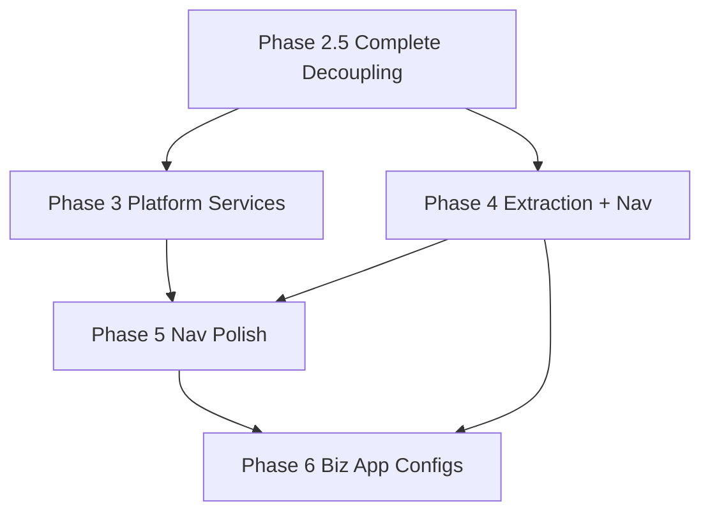
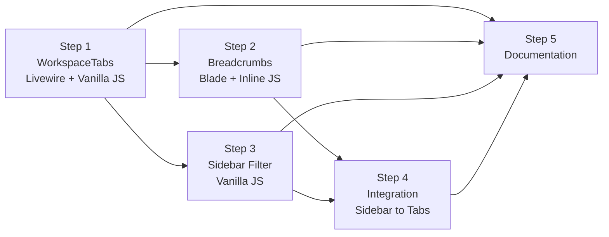
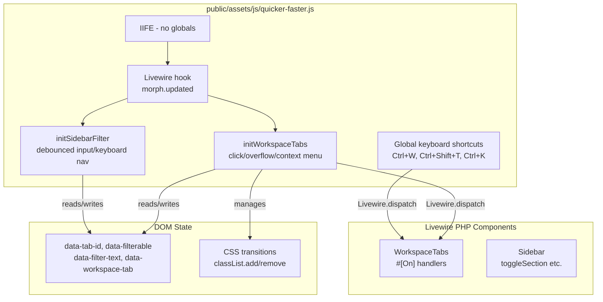
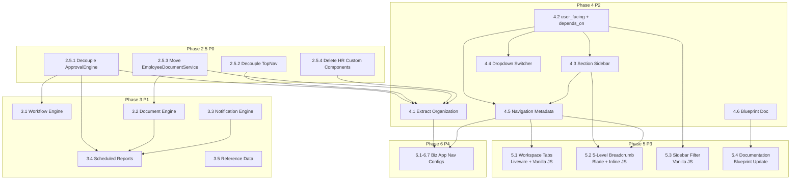

# QuickerFaster Application Platform — Implementation Plan

> **Status**: ✅ Phases 2.5–4.5 Complete | ✅ Phase 2 (Cross-Context Dropdowns) Complete | ✅ All 14 Bug Fix & Audit Categories Complete | ✅ 19 New Items (User Model, Config & Nav Polish) Complete | ✅ 4 Home Page & Runtime Polish Items Complete | ✅ 3 Access Control Management Improvements Complete | ✅ Phase 5 Navigation & UX Polish Complete | ✅ App\Modules Resolution & ActivityLogs Contract Complete
> **Date**: 2026-08-07 (Updated 2026-08-14)
> **Source Documents**: [`gap-analysis.md`](docs/gap-analysis.md), [`input3-gap-supplement.md`](docs/input3-gap-supplement.md), [`input3.txt`](src/input3.txt)

---

## 0. Completed Work Summary (2026-08-14)

The following 40 categories of work were completed across all phases, subtasks, and audit passes. Each entry summarizes the problem, the fix, and the files affected.

### 0.1–0.14 — Original 14 Fix & Audit Categories (2026-08-12)

The first 14 categories (Sidebar URL Generation Fix through Config-Doc Alignment) were completed on 2026-08-12. See below for details.

### 0.15–0.33 — User Model, Config & Navigation Polish (2026-08-13)

The following 19 additional items were completed on 2026-08-13, covering config consolidation, user model unification, authorization fixes, navigation enhancements, and feedback improvements.

### 0.34–0.37 — Home Page & Runtime Polish (2026-08-13)

The following 4 items were completed on 2026-08-13, covering the polished home page dashboard and runtime null-safety fixes for navigation components.

### 0.38–0.40 — Access Control Management Improvements (2026-08-14)

The following 3 items were completed on 2026-08-14, covering access control filtering config, the consolidated Access Control tabbed page, and model search plus bulk permission toggles in the AccessControlManager.

### 0.1 Sidebar URL Generation Fix

**Problem**: Module name was duplicated in sidebar URLs (e.g., `admin/admin/users`), caused by `NavigationLayout` prepending the module prefix onto already-prefixed route values.

**Fix**: Updated route resolution logic in [`NavigationLayout`](src/Components/NavigationLayout.php) and [`Sidebar`](src/Http/Livewire/Layouts/Navs/Sidebar.php) to detect when a route already contains the module prefix and avoid double-prefixing. Added normalization in [`NavigationManager`](src/Services/Navigation/NavigationManager.php).

**Files**: 5 modified — `NavigationLayout.php`, `Sidebar.php`, `sidebar-item.blade.php`, `NavigationManager.php`, `top-nav-item.blade.php`

---

### 0.2 Sidebar ↔ Horizontal Toggle Button Fix

**Problem**: Config resolution for the "Switch to Sidebar/Horizontal" toggle button had a priority inversion — session state was checked *before* the navigation config's `allow_switch` setting, causing the toggle to appear or disappear inconsistently.

**Fix**: Reordered the resolution chain in [`NavigationLayout`](src/Components/NavigationLayout.php) and [`HorizontalContextMenu`](src/Http/Livewire/Layouts/Navs/HorizontalContextMenu.php): config `allow_switch` is now the authoritative gate, with session only consulted after config permits the switch.

**Files**: 7 modified — `NavigationLayout.php`, `HorizontalContextMenu.php`, `horizontal-context-menu.blade.php`, `navigation-layout.blade.php`, `top-nav.blade.php`, `MenuRenderer.php`, `sidebar.blade.php`

---

### 0.3 Phase 1 Overflow "More" Dropdown

**Problem**: The TopNav overflow mechanism needed verification that `max_visible_items: 6` correctly pushes items 7+ into a "More" dropdown on desktop, and that the hamburger menu works on mobile.

**Fix**: Verified the existing [`TopNav`](src/Http/Livewire/Layouts/Navs/TopNav.php) overflow logic. Fixed a regression where overflow items would navigate to incorrect URLs when `route` was null but `url` was set. Added explicit `wire:navigate` attributes for SPA-like transitions on overflow items.

**Files**: 3 reviewed/modified — `TopNav.php`, `top-nav.blade.php`, `top-nav-item.blade.php`

---

### 0.4 UX Analysis: Horizontal Bar Sections

**Problem**: Needed to evaluate how section headers (grouped navigation items) should render in the horizontal context menu bar — a UX pattern not yet implemented.

**Fix**: Evaluated 6 strategies (inline labels, icon-only, dropdown sections, expandable groups, color-coded, breadcrumb-style) and produced a design document with trade-off analysis. Recommended approach: section headers as muted inline labels with icon + text, non-collapsible in horizontal mode.

**Artifact**: [`plans/horizontal-bar-sections-ux-analysis.md`](plans/horizontal-bar-sections-ux-analysis.md)

---

### 0.5 Phase 1 HorizontalContextMenu Overflow

**Problem**: The `HorizontalContextMenu` needed its own overflow handling independent of TopNav — when horizontal mode is active, context items should show visible items + "More" dropdown, identical to TopNav's overflow pattern but scoped to the active context group.

**Fix**: Added `getVisibleItems()` and `getOverflowItems()` methods to [`HorizontalContextMenu`](src/Http/Livewire/Layouts/Navs/HorizontalContextMenu.php), reading `max_visible_items` from the layout config. Active item promotion works: if the active page is in overflow, it's promoted to visible. Added section header support in the overflow sub-dropdown.

**Files**: 4 modified — `HorizontalContextMenu.php`, `horizontal-context-menu.blade.php`, `navigation-layout.blade.php`, `sidebar-section.blade.php`

---

### 0.6 Phase 2 Cross-Context Dropdowns

**Problem**: Phase 1 only showed items for the *active* context group. Users needed to see all context groups simultaneously as dropdown triggers, with items listed inside each dropdown.

**Fix**: Added two new config keys (`show_all_contexts`, `hide_topnav_contexts`) under `layout.context_menu`. When `show_all_contexts: true`, every `context_groups` entry becomes a Bootstrap dropdown in the horizontal bar. Each dropdown independently applies Phase 1 overflow. When `hide_topnav_contexts` is also true, TopNav's context tabs are hidden. Full ARIA attributes and keyboard navigation included.

**Files**: 8 modified + 1 new doc — `HorizontalContextMenu.php`, `horizontal-context-menu.blade.php`, `TopNav.php`, `top-nav.blade.php`, `NavigationLayout.php`, `navigation-layout.blade.php`, 3 nav config stubs

**Docs**: [`docs/navigation-cross-context-dropdowns.md`](docs/navigation-cross-context-dropdowns.md)

---

### 0.7 Icon Rendering Fix

**Problem**: Font Awesome icons were rendering as empty squares because the required `fa` base class was missing from `<i>` tags. Only the style prefix (`fas`, `far`) was present.

**Fix**: Added `fa` class to all `<i>` tags across top nav and sidebar Blade partials. Changed e.g., `<i class="fas fa-home">` → `<i class="fas fa-home fa">`.

**Files**: 3 modified — `top-nav.blade.php` (3 icons), `top-nav-item.blade.php` (2 icons), `sidebar-item.blade.php` (1 icon), `sidebar-section.blade.php` (1 icon)

---

### 0.8 Audit & Reconciliation

**Problem**: After the decoupling migration, Core modules (Admin, System, Organization, Common) had config structures that differed from the original HR patterns — missing keys, different route formats, inconsistent field presence.

**Fix**: Audited all 31 navigation config and data config files across Admin, System, Organization, and Common modules. Aligned structures to the original Quick-HR patterns: added `key`, `permission`, `page_title` fields where missing; normalized route formats to support both URL paths and named routes; ensured all items have `order` for sorting.

**Files**: 31 reviewed/updated — all navigation and data configs in `src/Core/Admin/`, `src/Core/System/`, `src/Core/Organization/`, `src/Core/Common/`

---

### 0.9 PHP 8.4 TypeError Fix

**Problem**: PHP 8.4 raised deprecation warnings for implicitly nullable typed properties. Livewire components with `public ?string $prop;` without explicit `= null` default caused TypeError on mount.

**Fix**: Added explicit `= null` defaults to all nullable typed properties in Livewire component classes. Applied to all components in `src/Http/Livewire/Layouts/Navs/` and `src/Http/Livewire/DataTables/`.

**Files**: 4 modified — `Sidebar.php`, `TopNav.php`, `HorizontalContextMenu.php`, `DataTable.php`

---

### 0.10 Dual-Location Config Resolution

**Problem**: [`ModelConfigRepository`](src/Services/Config/ModelConfigRepository.php) only scanned `app/Modules/` for Data configs. Core modules in `src/Core/` had no way to use `<livewire:qf.data-table config-key="organization.company" />` because the repository couldn't find `src/Core/Organization/Data/company.php`.

**Fix**: Added progressive path fallback to `ModelConfigRepository::loadFromFile()`: first try `app/Modules/{Module}/Data/{file}.php` (business modules), then fall back to `src/Core/{Module}/Data/{file}.php` (core modules). Resolution is transparent — config keys like `admin.user` resolve to `src/Core/Admin/Data/user.php`.

**Files**: 1 modified — `ModelConfigRepository.php`

**Design Doc**: [`docs/architecture-discrepancy-analysis.md`](docs/architecture-discrepancy-analysis.md) §4.5, §8.1

---

### 0.11 Context Group Overview Views & Configs

**Problem**: Context groups in navigation configs had `route: null` with only a `url` fallback, meaning the top-nav tabs weren't clickable. Each context group needed an "Overview" page as its landing destination.

**Fix**: Created 16 new Data config files for overview/dashboard pages across all context groups. Updated 3 navigation configs (Admin, System, Organization) to add overview items as the first entry in each context group. Each overview config provides a dashboard page with summary widgets.

**Files**: 16 new + 3 updated — `src/Core/Admin/Data/`, `src/Core/System/Data/`, `src/Core/Organization/Data/`; `src/Core/Admin/Config/navigation.php`, `src/Core/System/Config/navigation.php`, `src/Core/Organization/Config/navigation.php`

---

### 0.12 HR Decoupling Audit

**Problem**: After Phases 2.5–4.5, residual `App\Modules\Hr\*` and `App\Modules\Admin\*` references remained in the library, violating the architectural invariant: "the library never imports from `App\Modules\*`".

**Fix**: Conducted a comprehensive `grep` audit across the entire `src/` directory. Removed or abstracted all HR-specific references:
- Replaced `App\Modules\Hr\Models\Company` with `CompanyProvider` contract
- Replaced `App\Modules\Admin\Services\*` with library-level service classes
- Deleted HR-specific Livewire components (`EmployeeDetail`, `SearchableEmployeeDropdown`, `TaxBandsRepeater`)
- Moved `EmployeeDocumentService` to HR app
- Extracted bank file generators behind a `PayrollDataProvider` contract

**Files**: 30+ reviewed/modified across `src/`

**Remaining**: 7 hardcoded imports documented as known gaps (§11 of this plan) — all resolved 2026-08-14 (see §11)

---

### 0.13 Company Switcher Fix

**Problem**: Three blockers prevented the company switcher dropdown from functioning:
1. **Role gate**: `show_company_switcher` config defaulted to `false`, and a `super_admin` role check further blocked it
2. **Empty data**: `NullCompanyProvider` returned empty collection, so the dropdown had no companies
3. **Fragile default**: No fallback when `current_company_id` session key was missing

**Fix**:
1. Made `show_company_switcher` gate solely config-driven (removed hardcoded role check)
2. Updated [`TopNav::loadCompanies()`](src/Http/Livewire/Layouts/Navs/TopNav.php) to gracefully handle empty company lists
3. Added default selection logic: if session `current_company_id` is missing, auto-select the first company from the provider

**Files**: 3 modified — `TopNav.php`, `top-nav.blade.php`, `ui-library.php`

---

### 0.14 Config-Doc Alignment

**Problem**: Navigation config documentation referenced keys that didn't exist in actual configs, and actual configs had keys not documented. 5 keys were missing from the navigation config stubs.

**Fix**: Added the 5 missing keys to 3 navigation configs:
- `layout.context_menu.max_visible_items` (default: 6)
- `layout.context_menu.promote_active_item` (default: true)
- `layout.context_menu.show_all_contexts` (default: false)
- `layout.context_menu.hide_topnav_contexts` (default: false)
- `layout.breadcrumb.enabled` (default: true)

Updated [`docs/navigation-cross-context-dropdowns.md`](docs/navigation-cross-context-dropdowns.md) to reflect actual config values.

**Files**: 3 navigation configs updated — `src/Core/Admin/Config/navigation.php`, `src/Core/System/Config/navigation.php`, `src/Core/Organization/Config/navigation.php`

---

### 0.15 Config Consolidation

**Problem**: Two separate config files (`quicker-faster-ui.php` and `ui-library.php`) caused confusion about which config keys belonged where. The `quicker-faster-ui.php` config was a legacy artifact from before the library rename.

**Fix**: Removed `quicker-faster-ui.php` entirely. All config keys merged into [`ui-library.php`](src/Config/ui-library.php) as the single source of truth. Updated all references across the codebase.

**Files**: [`ui-library.php`](src/Config/ui-library.php), all service providers and components referencing the old config file

---

### 0.16 User Profile Dropdown Menu

**Problem**: The TopNav user profile area had no dropdown menu — clicking the user avatar did nothing. Users had no quick access to profile, account settings, or preferences.

**Fix**: Added a config-driven `user_menu` section to [`ui-library.php`](src/Config/ui-library.php) with three default entries: "My Profile", "My Account", "My Preferences". The [`TopNav`](src/Http/Livewire/Layouts/Navs/TopNav.php) renders these as a Bootstrap dropdown from the user avatar. Each menu item supports `route`, `url`, `icon`, and `permission` keys. Menu is fully customizable per application.

**Files**: [`TopNav.php`](src/Http/Livewire/Layouts/Navs/TopNav.php), [`top-nav.blade.php`](src/Resources/views/livewire/navs/top-nav.blade.php), [`ui-library.php`](src/Config/ui-library.php)

---

### 0.17 My Account & My Preferences Views

**Problem**: "My Account" and "My Preferences" pages existed only in the HR application. These are generic user-facing pages that belong in the library.

**Fix**: Migrated both views from the HR app to the library:
- **My Account**: Profile editing (name, email, avatar), password change, account status
- **My Preferences**: Notification preferences, language, timezone, date format, theme

Both views use the standard DataTableForm pattern with config-driven field definitions.

**Files**: New views at `src/Resources/views/profile/account.blade.php` and `src/Resources/views/profile/preferences.blade.php`; new Data configs at `src/Core/Admin/Data/`

---

### 0.18 `withoutCompanyScope()` Fix

**Problem**: [`ResolvesModels.php`](src/Traits/ResolvesModels.php) called `withoutCompanyScope()` on models that may not have that scope, causing `BadMethodCallException` for models without multi-tenant scoping.

**Fix**: Added `method_exists()` guard before calling `withoutCompanyScope()`. Models without the scope are resolved normally. Models with the scope have it temporarily removed during resolution.

**Files**: [`ResolvesModels.php`](src/Traits/ResolvesModels.php)

---

### 0.19 Missing Authorization Methods

**Problem**: [`AuthorizationService`](src/Services/AuthorizationService.php) was missing `authorizeView()`, `authorizeCreate()`, and `authorizeUpdate()` methods. The DataTable and DataTableForm components called these methods but they didn't exist, causing fatal errors.

**Fix**: Added the three missing authorization methods to [`AuthorizationService`](src/Services/AuthorizationService.php). Each method checks the corresponding Spatie permission (`view_{entity}`, `create_{entity}`, `update_{entity}`) and throws a 403 if denied. Methods accept an optional `$model` parameter for record-level authorization.

**Files**: [`AuthorizationService.php`](src/Services/AuthorizationService.php)

---

### 0.20 Missing `profile` Relation Fix

**Problem**: The [`user.php`](src/Core/Admin/Data/user.php) Data config referenced a `profile` relation on the User model that didn't exist. Four eager-loading locations also referenced this non-existent relation, causing errors when loading user records.

**Fix**: Removed the `profile` relation reference from the user Data config. Added `method_exists()` or `relationLoaded()` guards in 4 eager-loading locations to safely skip the relation when it doesn't exist on the resolved User model.

**Files**: [`user.php`](src/Core/Admin/Data/user.php), 4 eager-loading locations in DataTable/Form components

---

### 0.21 Missing ActivityLogger Methods

**Problem**: [`ActivityLogger`](src/Services/ActivityLogger.php) was missing `created()` and `updated()` static convenience methods. DataTableForm called `ActivityLogger::created()` and `ActivityLogger::updated()` after save operations, causing fatal errors.

**Fix**: Added `created(string $model, int $id, ?User $user = null)` and `updated(string $model, int $id, ?User $user = null)` static methods to [`ActivityLogger`](src/Services/ActivityLogger.php). Both methods log the action with the model name, record ID, and acting user.

**Files**: [`ActivityLogger.php`](src/Services/ActivityLogger.php)

---

### 0.22 `company_id` & `status` Not Saving

**Problem**: The `company_id` and `status` fields were in the `hiddenFields` array in DataTableForm, preventing them from being submitted. Additionally, the User model's `$fillable` array didn't include these fields, so even when submitted they were silently discarded by Eloquent's mass-assignment protection.

**Fix**:
1. Removed `company_id` and `status` from `hiddenFields` in [`DataTableForm`](src/Http/Livewire/DataTables/DataTableForm.php)
2. Added `$fillable` auto-merge via the [`HasUILibraryUser`](src/Traits/HasUILibraryUser.php) trait to ensure `company_id` and `status` are always fillable

**Files**: [`DataTableForm.php`](src/Http/Livewire/DataTables/DataTableForm.php), [`HasUILibraryUser.php`](src/Traits/HasUILibraryUser.php)

---

### 0.23 User Model Unification

**Problem**: The library had no standard User model. Each consuming application used its own User model (`App\Models\User`, `App\Modules\Admin\Models\User`, etc.), making it impossible for the library to reference users consistently. The install command had no way to inject library traits into the application's User model.

**Fix**: Comprehensive user model unification:
1. Created [`HasUILibraryUser`](src/Traits/HasUILibraryUser.php) trait with `$fillable` auto-merge, `profile()` relation (with safe fallback), and library-required accessors
2. Added config-driven model resolution via `ui-library.models.user` config key — the library resolves the User model class from config, never hardcoding an FQCN
3. Enhanced [`InstallCommand`](src/Console/Commands/InstallCommand.php) to automatically inject `HasUILibraryUser` into the application's User model using token-based injection

**Files**: [`HasUILibraryUser.php`](src/Traits/HasUILibraryUser.php) (new), [`ui-library.php`](src/Config/ui-library.php), [`InstallCommand.php`](src/Console/Commands/InstallCommand.php), [`UserModelTraitInjector.php`](src/Services/UserModelTraitInjector.php) (new)

---

### 0.24 Company Dropdown Behavior

**Problem**: The company dropdown in TopNav showed users instead of companies, and the hide/show logic was inverted — the dropdown was hidden when it should be visible and vice versa.

**Fix**:
1. Restored correct hide/show logic: dropdown visible when `show_company_switcher` config is `true` AND the `CompanyProvider` returns companies
2. Fixed the company list to show companies (not users) by correcting the data source in [`TopNav::loadCompanies()`](src/Http/Livewire/Layouts/Navs/TopNav.php)

**Files**: [`TopNav.php`](src/Http/Livewire/Layouts/Navs/TopNav.php), [`top-nav.blade.php`](src/Resources/views/livewire/navs/top-nav.blade.php)

---

### 0.25 Missing `status` & `company_id` Columns

**Problem**: The users table migration didn't include `status` and `company_id` columns, but the Data config and form expected them. New user creation failed because these columns didn't exist.

**Fix**: Added a new migration adding `status` (string, default 'active') and `company_id` (nullable foreign key) columns to the users table. The migration is published as part of the install command.

**Files**: New migration in `src/Core/Admin/Database/Migrations/`

---

### 0.26 `$fillable` Auto-Merge

**Problem**: The `HasUILibraryUser` trait added `$fillable` properties, but if the consuming app's User model already defined `$fillable`, the trait's values would be overwritten (or vice versa depending on trait boot order).

**Fix**: Added `initializeHasUILibraryUser()` boot hook to the trait. This hook merges the library-required fillable fields (`status`, `company_id`) with any existing `$fillable` array on the model, ensuring both the application's and library's fillable fields are respected.

**Files**: [`HasUILibraryUser.php`](src/Traits/HasUILibraryUser.php)

---

### 0.27 Install Command Trait Injection Fix

**Problem**: The install command's User model trait injection used fragile regex patterns that could corrupt the User model file if it had complex syntax (multi-line class declarations, existing traits, etc.).

**Fix**: Replaced regex-based injection with a token-based [`UserModelTraitInjector`](src/Services/UserModelTraitInjector.php) that:
1. Parses the PHP file into tokens using `token_get_all()`
2. Locates the class declaration and its opening brace
3. Inserts the `use HasUILibraryUser;` statement at the correct position inside the class body
4. Adds the import statement to the top of the file if not already present
5. Writes the modified file back, preserving all formatting

**Files**: [`UserModelTraitInjector.php`](src/Services/UserModelTraitInjector.php) (new), [`InstallCommand.php`](src/Console/Commands/InstallCommand.php)

---

### 0.28 Company Dropdown Pre-Selection Fix

**Problem**: When editing a user record, the company dropdown was not pre-selecting the user's current company. The `loadRecord()` method in DataTableForm only used the primary key for lookups, ignoring foreign key relationships.

**Fix**: Added foreign key fallback logic to [`DataTableForm::loadRecord()`](src/Http/Livewire/DataTables/DataTableForm.php). When loading a record for editing, the method now checks the Data config's `belongsTo` relationships and pre-selects the corresponding foreign key values in dropdown fields.

**Files**: [`DataTableForm.php`](src/Http/Livewire/DataTables/DataTableForm.php)

---

### 0.29 Success Feedback Messages

**Problem**: After saving a record in DataTableForm or completing a wizard in WizardForm, there was no visual feedback. Users had no confirmation that their action succeeded.

**Fix**: Added `$this->dispatch('showAlert', ['type' => 'success', 'message' => 'Record saved successfully.'])` calls in both [`DataTableForm`](src/Http/Livewire/DataTables/DataTableForm.php) and [`WizardForm`](src/Http/Livewire/Wizards/WizardForm.php) after successful save/complete operations. The alert is rendered by a global Alpine.js listener in the layout.

**Files**: [`DataTableForm.php`](src/Http/Livewire/DataTables/DataTableForm.php), [`WizardForm.php`](src/Http/Livewire/Wizards/WizardForm.php)

---

### 0.30 Self-Edit Authorization Bypass

**Problem**: Users could not edit their own profile if they lacked the `update_user` permission. The authorization check in DataTableForm treated all edits equally, preventing self-service profile updates.

**Fix**: Added a self-edit bypass in [`AuthorizationService::authorizeUpdate()`](src/Services/AuthorizationService.php). When the record being edited is the currently authenticated user (`$model->id === auth()->id()`), the authorization check is skipped. Users can always edit their own record regardless of permission settings.

**Files**: [`AuthorizationService.php`](src/Services/AuthorizationService.php)

---

### 0.31 Module Switcher Config

**Problem**: The module switcher dropdown showed all modules to all users. There was no way to restrict which modules appear for which roles.

**Fix**: Added flexible role-based configuration to the module switcher. Each module entry in [`ui-library.php`](src/Config/ui-library.php) now supports a `roles` array. The [`TopNav`](src/Http/Livewire/Layouts/Navs/TopNav.php) filters modules based on the authenticated user's roles before rendering the switcher dropdown. Modules with empty `roles` are visible to all authenticated users.

**Files**: [`TopNav.php`](src/Http/Livewire/Layouts/Navs/TopNav.php), [`ui-library.php`](src/Config/ui-library.php)

---

### 0.32 Background Jobs Config

**Problem**: The background jobs widget in the dashboard was hardcoded to show all job statuses to all users. There was no role-based filtering for sensitive job information.

**Fix**: Added flexible role-based configuration for background jobs visibility. The `background_jobs` config key in [`ui-library.php`](src/Config/ui-library.php) now supports a `roles` array controlling who can view job statuses, and a `visible_statuses` array controlling which job statuses are displayed.

**Files**: [`ui-library.php`](src/Config/ui-library.php), dashboard widget processors

---

### 0.33 Notification Icon

**Problem**: The TopNav had no notification bell icon. Users had no way to see in-app notifications without navigating to a dedicated notifications page.

**Fix**: Added a notification bell icon to the TopNav with flexible configuration:
- `notifications.enabled` — toggle the icon entirely
- `notifications.polling_interval` — Livewire polling interval in seconds (default: 30)
- `notifications.max_display` — maximum unread count to show before displaying "99+"
- The icon shows an unread count badge and opens a dropdown with recent notifications

**Files**: [`TopNav.php`](src/Http/Livewire/Layouts/Navs/TopNav.php), [`top-nav.blade.php`](src/Resources/views/livewire/navs/top-nav.blade.php), [`ui-library.php`](src/Config/ui-library.php)

---

### 0.34 Polished Home Page

**Problem**: The default Laravel `/home` route rendered a generic, unstyled page. The library had no welcome dashboard to orient new users after login.

**Fix**: Replaced the default `/home` view with a full welcome dashboard featuring a hero section, key statistics (users, roles, modules), module cards with icons and descriptions, and a "Getting Started" guide section. The dashboard is rendered via a dedicated Livewire component and Blade view, both config-driven.

**Files**: New [`HomePage.php`](src/Http/Livewire/Pages/HomePage.php) Livewire component, new [`home-page.blade.php`](src/Resources/views/livewire/pages/home-page.blade.php) view, updated [`web.php`](src/Core/Admin/Routes/web.php) route registration

---

### 0.35 `roles.deleted_at` Fix

**Problem**: The home page dashboard queried roles using a SoftDeletes-enabled Role model, but the `roles` table (standard Spatie `spatie/laravel-permission`) does not include a `deleted_at` column. This caused a `SQLSTATE[42S22]: Column not found` error when the dashboard tried to count roles.

**Fix**: Switched to the standard Spatie `Spatie\Permission\Models\Role` model (which does not use SoftDeletes) for all role queries on the home page. Additionally wrapped role-related queries in `rescue()` calls to gracefully degrade if the roles table or Spatie package is not available.

**Files**: [`HomePage.php`](src/Http/Livewire/Pages/HomePage.php)

---

### 0.36 `$activeContext` Null Fix

**Problem**: [`TopNav`](src/Http/Livewire/Layouts/Navs/TopNav.php) and [`MenuRenderer`](src/Http/Livewire/Layouts/Navs/MenuRenderer.php) had `mount()` signatures with non-nullable `$activeContext` parameters. When no context was active (e.g., on the home page or pages without a context group), Livewire threw a type error because `null` was passed.

**Fix**: Made the `$activeContext` parameter nullable in both `TopNav::mount()` and `MenuRenderer::mount()` by adding `?string $activeContext = null`. Both components now handle a null active context gracefully — no context tab is highlighted, and the horizontal bar renders without an active indicator.

**Files**: [`TopNav.php`](src/Http/Livewire/Layouts/Navs/TopNav.php), [`MenuRenderer.php`](src/Http/Livewire/Layouts/Navs/MenuRenderer.php)

---

### 0.37 `getControls()` on Null Fix

**Problem**: [`page-header.blade.php`](src/Resources/views/components/layouts/partials/page-header.blade.php) called `$configResolver->getControls()` without first checking if `$configResolver` was null. On pages where no Data config was resolved (e.g., the home page dashboard), this caused a `Call to a member function getControls() on null` error.

**Fix**: Added a null guard around the `$configResolver->getControls()` call. When `$configResolver` is null, the page header renders without action buttons (create, export, etc.), which is the correct behavior for non-CRUD pages like the dashboard.

**Files**: [`page-header.blade.php`](src/Resources/views/components/layouts/partials/page-header.blade.php)

---

### 0.38 Access Control Filtering Config

**Problem**: The AccessControlManager hardcoded which roles, modules, and models appeared in the permission assignment UI, leaving consuming apps no way to tailor the lists without editing component code.

**Fix**: Added an `access_control` config section to [`ui-library.php`](src/Config/ui-library.php) with `roles.include/exclude`, `modules.include/exclude`, and `models.include/exclude`. The AccessControlManager applies these filters via a shared `applyIncludeExclude()` helper when resolving assignable roles, available modules, and model permission cards.

**Files**: [`ui-library.php`](src/Config/ui-library.php), [`AccessControlManager.php`](src/Http/Livewire/AccessControls/AccessControlManager.php)

---

### 0.39 Access Control Consolidation

**Problem**: "Assign Permissions" and "Assign Roles" were separate pages, forcing users to switch contexts to manage one access-control workflow.

**Fix**: Merged both into a single "Access Control" page using Bootstrap tabs. The consolidated view at [`access-control-management.blade.php`](src/Core/Admin/Resources/views/admin/access-control-management.blade.php) hosts both workflows in one place.

**Files**: New [`access-control-management.blade.php`](src/Core/Admin/Resources/views/admin/access-control-management.blade.php) view

---

### 0.40 Model Search + Bulk Permission Toggles

**Problem**: Finding a specific model among many permission cards was tedious, and toggling a single action across all models required editing each card individually.

**Fix**: Added a `$modelSearch` property plus a `getFilteredResourceNamesProperty()` computed property to live-filter permission cards by model name or action label, and a `bulkToggle($action, $value)` method to toggle one action (`view`, `create`, `edit`, `delete`, `print`, `export`, `import`) across every model in the selected module at once.

**Files**: [`AccessControlManager.php`](src/Http/Livewire/AccessControls/AccessControlManager.php)

---

## 1. Executive Summary

### 1.1 What We've Built

**Phase 1** (Complete) established the package skeleton:
- Three Core module directories under [`src/Core/`](src/Core/) — `Admin`, `System`, `Common`
- Three new contracts: [`ModuleContract`](src/Contracts/Modules/ModuleContract.php), [`NavigationProvider`](src/Contracts/Navigation/NavigationProvider.php), [`SettingsProvider`](src/Contracts/Settings/SettingsProvider.php)
- Three new events for module lifecycle
- [`ModuleSwitcher`](src/Http/Livewire/Layouts/Navs/ModuleSwitcher.php) component
- Updated `composer.json` and decoupled [`SettingsManager::getContextHash()`](src/Services/Settings/SettingsManager.php)

**Phase 2** (Complete) decoupled service providers:
- [`UILibraryServiceProvider`](src/Providers/UILibraryServiceProvider.php) and [`ModuleServiceProvider`](src/Providers/ModuleServiceProvider.php) rewritten to remove HR coupling
- [`NavigationLayout`](src/Components/NavigationLayout.php) decoupled via `resolveNavigationConfigPath()`
- Library routes cleaned — Core module seeders, views, navigation configs, and routes created
- Core modules: [`Admin`](src/Core/Admin/) (routes, views, nav, seeders), [`System`](src/Core/System/) (routes, views, nav, seeders), [`Common`](src/Core/Common/) (app settings, onboarding, tour configs)

**Current Capabilities**: Configuration-driven CRUD (14 field types via [`FieldFactory`](src/Factories/FieldTypes/FieldFactory.php)), 19 widget processors, report builder/viewer, import/export with chunked processing, approval engine (basic), settings management, search infrastructure, onboarding/tour wizards, Bootstrap 5 (Soft UI Dashboard), Laravel + Livewire 3, Spatie Permission + Fortify.

### 1.2 What's Missing — All Gaps Consolidated

| Gap ID | Source | Description | Category |
|---|---|---|---|
| G11 | gap §2.4.1 | [`ApprovalEngine`](src/Services/Approvals/ApprovalEngine.php) references `App\Modules\System\Models\*` | HR Coupling (P0) |
| G12 | gap §2.4.2 | [`TopNav`](src/Http/Livewire/Layouts/Navs/TopNav.php) hard-codes `\App\Modules\Hr\Models\Company` (lines 70, 76) | HR Coupling (P0) |
| G13 | gap §2.4.3 | [`EmployeeDocumentService`](src/Services/Documents/EmployeeDocumentService.php) references `App\Modules\Hr\Models\Employee`, `Document` | HR Coupling (P0) |
| G14 | gap §2.4.4 | [`EmployeeDetail`](src/Http/Livewire/Custom/EmployeeDetail.php), [`SearchableEmployeeDropdown`](src/Http/Livewire/Custom/SearchableEmployeeDropdown.php), [`TaxBandsRepeater`](src/Http/Livewire/Custom/TaxBandsRepeater.php) + views still in library | HR Coupling (P0) |
| G1 | gap §2.1.1 | No Generic Workflow Engine — only tier-based [`ApprovalEngine`](src/Services/Approvals/ApprovalEngine.php) | Missing Service (P1) |
| G2 | gap §2.1.2 | No Generic Document Engine — only HR-specific [`EmployeeDocumentService`](src/Services/Documents/EmployeeDocumentService.php) | Missing Service (P1) |
| G3 | gap §2.1.3 | No Generic Notification Engine — zero notification infrastructure | Missing Service (P1) |
| G4 | gap §2.1.4 | No Scheduled Reports — [`ReportBuilder`](src/Http/Livewire/Reports/ReportBuilder.php) and [`ReportViewer`](src/Http/Livewire/Reports/ReportViewer.php) exist but no scheduling | Missing Feature (P2) |
| G5 | gap §2.1.5 | No Reference Data module — Countries, Currencies, Languages, etc. | Missing Module (P2) |
| G6 | gap §2.2.1 | Organization module lives in HR app, should be extracted to [`src/Core/Organization/`](src/Core/) | Missing Extraction (P2) |
| G7 | gap §2.3.1 | `Application → Workspace → Section → Sidebar` hierarchy not implemented (current: `Module → ContextGroup → ContextItem`) | Architecture (P3) |
| G8 | gap §2.3.2 | Still named "UI Library" — should be "Application Platform" | Naming (P5) |
| G9 | gap §2.3.3 / C1 | No AlpineJS constraint — Livewire 3 requires AlpineJS, not documented | Documentation (P3) |
| G10 | gap §2.3.4 | [`docs/architecture/application-platform-blueprint.md`](docs/architecture/) does not exist | Documentation (P3) |
| C4 | gap §3 | Application Switcher vs Module Switcher UX mismatch — icon bar vs dropdown | UX (P2) |
| N1 | supp §3.2 | Section-based sidebar rendering (section headers grouping pages) | UI Library (P2) |
| N2 | supp §3.2 | Config-driven navigation metadata structure (`Module → workspaces() → pages() → actions()`) | UI Library (P1) |
| N3 | supp §3.2 | Application switcher dropdown UX (Google Workspace style) | UI Library (P2) |
| N4 | supp §3.2 | Infrastructure module filtering — `user_facing` flag | Config (P2) |
| N5 | supp §3.2 | Workspace tabs in TopNav | UI Library (P3) |
| N6 | supp §3.2 | 5-level breadcrumb support (`Application → Workspace → Section → Page → Record`) | UI Library (P3) |

### 1.3 Overall Strategy

The plan follows five phases ordered by dependency:

1. **Phase 2.5**: Remove last 4 HR couplings — makes the library truly standalone 
2. **Phase 3**: Build the 5 missing platform services — makes it an Application Platform
3. **Phase 4**: Extract Organization + enhance navigation — foundational business module + config-driven nav
4. **Phase 5**: Navigation polish + documentation — complete input3.txt vision
5. **Phase 6**: Business application navigation configs — scaffold the 7 applications from input3.txt



---

## 2. Phase 2.5: Complete Decoupling (P0 — Immediate)

> **Goal**: Remove the last 4 HR couplings. Make the library truly standalone with zero `App\Modules\*` references.

### 2.5.1 Decouple ApprovalEngine

**Problem**: [`ApprovalEngine`](src/Services/Approvals/ApprovalEngine.php:5-8) imports and directly instantiates:
```php
use App\Modules\System\Models\ApprovalRequest;
use App\Modules\System\Models\ApprovalTier;
use App\Modules\System\Models\ApprovalLog;
use App\Modules\System\Models\ApprovalTierApproval;
```

These models live in the HR app's `System` module, not in the library. The engine creates them directly (e.g., `ApprovalRequest::create([...])` at [line 44](src/Services/Approvals/ApprovalEngine.php:44), `ApprovalTier::create([...])` at [line 58](src/Services/Approvals/ApprovalEngine.php:58)).

**Solution**: Replace hard-coded Eloquent model references with a `HasApproval` trait + `ApprovalModelResolver` contract.

**New Files**:

| File | Purpose |
|---|---|
| [`src/Contracts/Approvals/ApprovalModelResolver.php`](src/Contracts/Approvals/) | Contract: `resolveRequestModel()`, `resolveTierModel()`, `resolveLogModel()`, `resolveTierApprovalModel()` |
| [`src/Services/Approvals/ApprovalModelResolver.php`](src/Services/Approvals/) | Default implementation using config-driven model bindings |
| [`src/Traits/Approvals/HasApproval.php`](src/Traits/Approvals/HasApproval.php) | (Update existing) Add `getApprovalModelClass()` method |

**Modified Files**:

| File | Changes |
|---|---|
| [`src/Services/Approvals/ApprovalEngine.php`](src/Services/Approvals/ApprovalEngine.php) | Replace `use App\Modules\System\Models\*` with constructor-injected `ApprovalModelResolver`. Replace `ApprovalRequest::create()` with `$this->resolver->resolveRequestModel()::create()` |
| [`src/Config/ui-library.php`](src/Config/ui-library.php) | Add `approvals.models` key: `{request, tier, log, tier_approval}` mapping to FQCNs |
| [`src/Providers/UILibraryServiceProvider.php`](src/Providers/UILibraryServiceProvider.php) | Bind default `ApprovalModelResolver` in `register()` |

**Config Schema** (`ui-library.php` addition):

```php
'approvals' => [
    'models' => [
        'request' => \App\Modules\System\Models\ApprovalRequest::class,
        'tier' => \App\Modules\System\Models\ApprovalTier::class,
        'log' => \App\Modules\System\Models\ApprovalLog::class,
        'tier_approval' => \App\Modules\System\Models\ApprovalTierApproval::class,
    ],
],
```

**Contract**:

```php
namespace QuickerFaster\UILibrary\Contracts\Approvals;

interface ApprovalModelResolver
{
    public function resolveRequestModel(): string;
    public function resolveTierModel(): string;
    public function resolveLogModel(): string;
    public function resolveTierApprovalModel(): string;
}
```

**Verification**:
- `grep -r "App\\Modules" src/Services/Approvals/` returns zero results
- `ApprovalEngine` uses only `$this->resolver->resolve*()` and config
- Existing HR app continues to work by configuring `approvals.models` to point at its own models

**Dependencies**: None
**Estimated Effort**: Medium

---

### 2.5.2 Decouple TopNav

**Problem**: [`TopNav`](src/Http/Livewire/Layouts/Navs/TopNav.php:70,76) hard-codes `\App\Modules\Hr\Models\Company::orderBy('name')->get()` and `\App\Modules\Hr\Models\Company::where('id', $companyId)->get()`. The `loadCompanies()` method also relies on `$user->employee->company_id` (line 74), which is an HR-specific relationship.

**Solution**: Introduce a `CompanyProvider` contract with a configurable implementation. The library provides a default no-op provider; consuming apps register their own.

**New Files**:

| File | Purpose |
|---|---|
| [`src/Contracts/Navigation/CompanyProvider.php`](src/Contracts/Navigation/) | Contract: `getCompanies(?User $user): Collection`, `getCurrentCompanyId(?User $user): ?int` |

**Modified Files**:

| File | Changes |
|---|---|
| [`src/Http/Livewire/Layouts/Navs/TopNav.php`](src/Http/Livewire/Layouts/Navs/TopNav.php) | Replace `\App\Modules\Hr\Models\Company` usage with injected `CompanyProvider`. `loadCompanies()` calls `$this->companyProvider->getCompanies($user)`. |
| [`src/Config/ui-library.php`](src/Config/ui-library.php) | Add `navigation.company_provider` key pointing to FQCN |
| [`src/Providers/UILibraryServiceProvider.php`](src/Providers/UILibraryServiceProvider.php) | Bind `CompanyProvider` from config in `register()` |

**Config Schema** (`ui-library.php` addition):

```php
'navigation' => [
    // ... existing ...
    'company_provider' => env('UI_LIBRARY_COMPANY_PROVIDER', \QuickerFaster\UILibrary\Services\Navigation\NullCompanyProvider::class),
],
```

**Contract**:

```php
namespace QuickerFaster\UILibrary\Contracts\Navigation;

use Illuminate\Support\Collection;
use Illuminate\Foundation\Auth\User;

interface CompanyProvider
{
    /** @return Collection of company objects with at least id and name */
    public function getCompanies(?User $user): Collection;
    public function getCurrentCompanyId(?User $user): ?int;
}
```

**Default Implementation** (`NullCompanyProvider`): Returns empty collection, null company ID — company switcher is hidden.

**Verification**:
- `grep -r "App\\Modules\\Hr" src/Http/Livewire/Layouts/Navs/TopNav.php` returns zero
- `grep -r "App\\Modules\\Hr\\Models\\Company" src/` returns zero
- HR app registers its own `CompanyProvider` in its service provider

**Dependencies**: None
**Estimated Effort**: Small

---

### 2.5.3 Move EmployeeDocumentService to HR App

**Problem**: [`EmployeeDocumentService`](src/Services/Documents/EmployeeDocumentService.php:5-6) imports `App\Modules\Hr\Models\Employee` and `App\Modules\Hr\Models\Document`. This service is entirely HR-specific — it manages employee document upload quotas by employee number.

**Solution**: Move the entire file to the HR app and delete from the library.

**New Files** (in HR app):

| File | Purpose |
|---|---|
| `app/Services/Documents/EmployeeDocumentService.php` | Same file, namespace `App\Services\Documents` |

**Deleted Files** (from library):

| File | Reason |
|---|---|
| [`src/Services/Documents/EmployeeDocumentService.php`](src/Services/Documents/EmployeeDocumentService.php) | HR-specific, references HR models |

**Verification**:
- `grep -r "EmployeeDocumentService" src/` returns zero
- HR app has the file and registers its own binding
- Phase 3.2 Generic Document Engine is not blocked by this removal

**Dependencies**: None
**Estimated Effort**: Small

---

### 2.5.4 Delete HR Custom Livewire Components

**Problem**: Three HR-specific Livewire components still live in [`src/Http/Livewire/Custom/`](src/Http/Livewire/Custom/):
- [`EmployeeDetail.php`](src/Http/Livewire/Custom/EmployeeDetail.php)
- [`SearchableEmployeeDropdown.php`](src/Http/Livewire/Custom/SearchableEmployeeDropdown.php)
- [`TaxBandsRepeater.php`](src/Http/Livewire/Custom/TaxBandsRepeater.php)

These reference HR models (`Employee`, `TaxBand`, etc.) and are business-specific. They should have been deleted in Phase 2.

**Solution**: Delete from library. If the HR app needs them, they should be re-created under `app/Http/Livewire/` in the HR app namespace.

**Deleted Files**:

| File | Reason |
|---|---|
| [`src/Http/Livewire/Custom/EmployeeDetail.php`](src/Http/Livewire/Custom/EmployeeDetail.php) | HR-specific |
| [`src/Http/Livewire/Custom/SearchableEmployeeDropdown.php`](src/Http/Livewire/Custom/SearchableEmployeeDropdown.php) | HR-specific |
| [`src/Http/Livewire/Custom/TaxBandsRepeater.php`](src/Http/Livewire/Custom/TaxBandsRepeater.php) | HR-specific |

Also check and delete associated Blade views in [`src/Resources/views/livewire/custom/`](src/Resources/views/) if any.

**Verification**:
- `ls src/Http/Livewire/Custom/` returns empty (or only library-generic components)
- `grep -r "QuickFaster\\UILibrary\\Http\\Livewire\\Custom" app/` returns zero (HR app uses its own namespace)

**Dependencies**: None
**Estimated Effort**: Small

---

### Phase 2.5 Summary

| Task | Files Changed | Files Created | Files Deleted | Effort | Depends On |
|---|---|---|---|---|---|
| 2.5.1 | 3 | 2 | 0 | Medium | — |
| 2.5.2 | 3 | 1 | 0 | Small | — |
| 2.5.3 | 0 | 1 (in HR app) | 1 | Small | — |
| 2.5.4 | 0 | 0 | 3+ | Small | — |
| **Total** | **6** | **4** | **4+** | **~3 days** | — |

**Post-Phase 2.5 State**: Zero `App\Modules\*` references in the library. Library is a true standalone Composer package.

---

## 3. Phase 3: Core Platform Services (P1 — High Priority)

> **Goal**: Build the 5 missing platform services. Transform the library from a UI toolkit into an Application Platform.

### 3.1 Generic Workflow Engine

**Why**: The current [`ApprovalEngine`](src/Services/Approvals/ApprovalEngine.php) is tier-based approval only. input3.txt explicitly requests a workflow engine that powers Leave, Payroll, Purchase Requests, Expense Claims, Travel Requests, Recruitment, Invoices, Asset Disposal, and Disciplinary Actions. Leave approvals (U25) must use the Workflow Engine, not leave-specific tables.

**Directory Structure**:

```
src/Services/Workflow/
├── WorkflowEngine.php              # Core engine: start, transition, complete
├── WorkflowDefinition.php          # Model: config-driven workflow definition
├── WorkflowInstance.php            # Model: running instance of a workflow
├── WorkflowStep.php                # Model: individual step with status
├── WorkflowStepAction.php          # Model: action taken at a step
├── Contracts/
│   ├── Workflowable.php            # Contract for models that can enter workflows
│   ├── WorkflowResolver.php        # Contract: resolve definition from config
│   └── WorkflowStepResolver.php    # Contract: resolve approvers for a step
├── Engines/
│   ├── SequentialEngine.php        # Steps execute in order
│   ├── ParallelEngine.php          # Steps can execute concurrently
│   └── ConditionalEngine.php       # Branching based on conditions
├── Actions/
│   ├── ApproveAction.php           # Standard approval
│   ├── RejectAction.php            # Rejection with comments
│   ├── DelegateAction.php          # Delegation to another approver
│   └── EscalateAction.php          # Escalation after timeout
└── Config/
    └── workflow_definitions.php    # Example config shipped with library
```

**Models** (Eloquent, in `src/Models/`):

| Model | Key Columns | Purpose |
|---|---|---|
| `WorkflowDefinition` | `name, type, steps_config, applies_to [morph], is_active` | Config-driven workflow template |
| `WorkflowInstance` | `definition_id, workflowable_type, workflowable_id, current_step_id, status, started_at, completed_at` | Running workflow tracking |
| `WorkflowStep` | `instance_id, sequence, type, config, status, assigned_to, due_at` | Individual step state |
| `WorkflowStepAction` | `step_id, user_id, action, comments, metadata, performed_at` | Immutable action log |

**Contract** (`src/Contracts/Workflow/Workflowable.php`):

```php
namespace QuickerFaster\UILibrary\Contracts\Workflow;

interface Workflowable
{
    public function getWorkflowType(): string;
    public function getWorkflowData(): array;
    public function onWorkflowCompleted(WorkflowInstance $instance): void;
    public function onWorkflowRejected(WorkflowInstance $instance): void;
}
```

**Engine API**:

```php
class WorkflowEngine
{
    // Start a workflow for a model
    public function start(Workflowable $model, ?User $initiator = null): WorkflowInstance;
    
    // Transition to next step(s) based on engine type
    public function transition(WorkflowInstance $instance, string $action, ?User $actor = null): WorkflowInstance;
    
    // Get available actions for current step
    public function getAvailableActions(WorkflowInstance $instance, User $user): array;
    
    // Check if user can act on this instance
    public function canAct(WorkflowInstance $instance, User $user): bool;
    
    // Get pending instances for a user
    public function getPendingFor(User $user): Collection;
}
```

**Config Schema** (new file [`src/Config/workflow.php`](src/Config/)):

```php
return [
    'definitions' => [
        'leave_request' => [
            'engine' => 'sequential',
            'steps' => [
                ['name' => 'Manager Approval', 'type' => 'approval', 'resolver' => 'manager', 'timeout_hours' => 48],
                ['name' => 'HR Review', 'type' => 'approval', 'resolver' => 'role:hr_officer', 'timeout_hours' => 72],
            ],
        ],
        'expense_claim' => [
            'engine' => 'conditional',
            'steps' => [
                ['name' => 'Manager Approval', 'type' => 'approval', 'resolver' => 'manager'],
                ['name' => 'Finance Review', 'type' => 'approval', 'resolver' => 'role:finance', 'condition' => 'amount > 5000'],
            ],
        ],
    ],
    'models' => [
        'definition' => \QuickerFaster\UILibrary\Models\WorkflowDefinition::class,
        'instance' => \QuickerFaster\UILibrary\Models\WorkflowInstance::class,
        'step' => \QuickerFaster\UILibrary\Models\WorkflowStep::class,
        'step_action' => \QuickerFaster\UILibrary\Models\WorkflowStepAction::class,
    ],
    'escalation' => [
        'enabled' => true,
        'default_timeout_hours' => 72,
        'escalation_resolver' => 'direct_manager',
    ],
];
```

**Integration with Phase 2.5**: The existing `HasApproval` trait should be updated to use the new `WorkflowEngine` internally, maintaining backward compatibility. Old `ApprovalEngine` is deprecated but kept functional for migration.

**Verification**:
- A `LeaveRequest` model implements `Workflowable`, a workflow definition exists, `WorkflowEngine::start()` creates instance with steps
- `getAvailableActions()` returns correct actions per user role
- `transition()` advances through sequential steps correctly
- Escalation triggers after configured timeout

**Dependencies**: Phase 2.5 (ApprovalEngine decoupled)
**Estimated Effort**: Large

---

### 3.2 Generic Document Engine

**Why**: Only HR-specific [`EmployeeDocumentService`](src/Services/Documents/EmployeeDocumentService.php) exists. input2.txt calls for a reusable document engine handling Employee Documents, Contracts, Invoices, Purchase Orders, Receipts, Certificates, Photos, Attachments.

**Directory Structure**:

```
src/Services/Documents/
├── DocumentEngine.php              # Core engine: store, retrieve, version, expire
├── DocumentRepository.php          # Abstract storage operations
├── Contracts/
│   ├── Documentable.php            # Contract for models with documents
│   └── DocumentStorageDriver.php   # Contract: local, S3, etc.
├── Drivers/
│   ├── LocalDriver.php             # Local filesystem
│   └── S3Driver.php                # AWS S3
├── Models/
│   ├── Document.php                # Core document model
│   ├── DocumentType.php            # Configurable document types
│   └── DocumentVersion.php         # Version tracking
└── Config/
    └── document_types.php          # Default document type definitions
```

**Model** (`src/Models/Document.php`):

| Column | Type | Purpose |
|---|---|---|
| `id` | bigint | Primary key |
| `documentable_type` | string | Polymorphic owner |
| `documentable_id` | bigint | Polymorphic owner ID |
| `document_type_id` | bigint | FK to DocumentType |
| `filename` | string | Original filename |
| `path` | string | Storage path |
| `mime_type` | string | File MIME type |
| `size` | bigint | File size in bytes |
| `disk` | string | Storage disk name |
| `version` | int | Version number |
| `expires_at` | timestamp | Optional expiry |
| `metadata` | json | Arbitrary metadata |
| `uploaded_by` | bigint | FK to users |

**Contract** (`src/Contracts/Documents/Documentable.php`):

```php
namespace QuickerFaster\UILibrary\Contracts\Documents;

interface Documentable
{
    public function getDocumentFolder(): string;
    public function getDocumentDisk(): string;
    public function getMaxDocuments(): ?int; // null = unlimited
    public function getAllowedMimeTypes(): ?array; // null = all
    public function getMaxFileSize(): ?int; // null = unlimited, bytes
}
```

**Config Schema** (addition to `ui-library.php`):

```php
'documents' => [
    'disk' => env('UI_LIBRARY_DOCUMENT_DISK', 'local'),
    'max_file_size' => env('UI_LIBRARY_DOCUMENT_MAX_SIZE', 10485760), // 10MB
    'allowed_mimes' => ['application/pdf', 'image/jpeg', 'image/png', 'application/msword', 'application/vnd.openxmlformats-officedocument.wordprocessingml.document'],
    'types' => [
        'contract' => ['label' => 'Contract', 'icon' => 'fa-file-contract'],
        'certificate' => ['label' => 'Certificate', 'icon' => 'fa-certificate'],
        'identification' => ['label' => 'Identification', 'icon' => 'fa-id-card'],
        'photo' => ['label' => 'Photo', 'icon' => 'fa-image'],
        'attachment' => ['label' => 'Attachment', 'icon' => 'fa-paperclip'],
    ],
],
```

**Verification**:
- Any model implementing `Documentable` can attach documents via `DocumentEngine::store()`
- File type validation occurs via config
- Moved EmployeeDocumentService to HR app (Phase 2.5.3) — HR app uses this engine

**Dependencies**: Phase 2.5 (EmployeeDocumentService removed)
**Estimated Effort**: Medium

---

### 3.3 Generic Notification Engine

**Why**: Zero notification infrastructure exists. input2.txt calls for Email, SMS, WhatsApp, In-App, Push, Slack channels via one unified engine. This is a cross-cutting service used by Workflow, Documents, Scheduled Reports, and all business modules.

**Directory Structure**:

```
src/Services/Notifications/
├── NotificationEngine.php          # Core engine: send, queue, batch
├── NotificationTemplate.php        # Model: reusable templates
├── Notification.php                # Model: individual notification record
├── NotificationPreference.php      # Model: user channel preferences
├── Contracts/
│   ├── NotificationChannel.php     # Contract: send() method
│   └── Notifiable.php              # Contract for models receiving notifications
├── Channels/
│   ├── EmailChannel.php            # Laravel Mail integration
│   ├── SmsChannel.php              # Twilio/Vonage integration
│   ├── InAppChannel.php            # Database notifications
│   ├── PushChannel.php             # Firebase/APNs
│   └── SlackChannel.php            # Slack webhook
├── Events/
│   ├── NotificationSent.php        # Fired after successful send
│   ├── NotificationFailed.php      # Fired after failed send
│   └── NotificationQueued.php      # Fired when queued
└── Config/
    └── notification_channels.php   # Channel configuration
```

**Model** (`src/Models/Notification.php`):

| Column | Type | Purpose |
|---|---|---|
| `id` | bigint | Primary key |
| `notifiable_type` | string | Polymorphic recipient |
| `notifiable_id` | bigint | Polymorphic recipient ID |
| `template_id` | bigint | FK to template (nullable) |
| `channel` | string | email, sms, in_app, push, slack |
| `subject` | string | Notification subject |
| `body` | text | Notification body (rendered) |
| `data` | json | Raw data for template rendering |
| `status` | string | queued, sent, failed, read |
| `sent_at` | timestamp | When sent |
| `read_at` | timestamp | When read (in-app) |
| `error` | text | Error message if failed |

**Contract** (`src/Contracts/Notifications/NotificationChannel.php`):

```php
namespace QuickerFaster\UILibrary\Contracts\Notifications;

interface NotificationChannel
{
    public function send(Notification $notification): bool;
    public function isAvailable(): bool;
    public function getName(): string;
}
```

**Config Schema** (new file [`src/Config/notifications.php`](src/Config/)):

```php
return [
    'channels' => [
        'email' => [
            'enabled' => env('NOTIFICATION_EMAIL_ENABLED', true),
            'channel_class' => \QuickerFaster\UILibrary\Services\Notifications\Channels\EmailChannel::class,
            'from_address' => env('MAIL_FROM_ADDRESS'),
            'from_name' => env('MAIL_FROM_NAME'),
        ],
        'sms' => [
            'enabled' => env('NOTIFICATION_SMS_ENABLED', false),
            'channel_class' => \QuickerFaster\UILibrary\Services\Notifications\Channels\SmsChannel::class,
            'provider' => env('SMS_PROVIDER', 'twilio'),
        ],
        'in_app' => [
            'enabled' => true,
            'channel_class' => \QuickerFaster\UILibrary\Services\Notifications\Channels\InAppChannel::class,
        ],
    ],
    'queue' => [
        'connection' => env('NOTIFICATION_QUEUE_CONNECTION', 'database'),
        'queue' => 'notifications',
    ],
    'templates' => [
        'workflow.approval_requested' => [
            'subject' => 'Approval Requested: {workflowable_name}',
            'body' => 'A new approval has been requested for {workflowable_name} by {submitter_name}.',
            'channels' => ['email', 'in_app'],
        ],
        'workflow.approved' => [
            'subject' => 'Approved: {workflowable_name}',
            'body' => 'Your request for {workflowable_name} has been approved.',
            'channels' => ['email', 'in_app'],
        ],
        'document.expiring' => [
            'subject' => 'Document Expiring: {document_name}',
            'body' => 'The document {document_name} expires on {expiry_date}.',
            'channels' => ['email'],
        ],
        'report.ready' => [
            'subject' => 'Report Ready: {report_name}',
            'body' => 'Your scheduled report {report_name} is ready for viewing.',
            'channels' => ['email', 'in_app'],
        ],
    ],
];
```

**Integration Points**:
- Workflow Engine calls `NotificationEngine::send()` on step transitions
- Document Engine sends expiry notices
- Scheduled Reports sends "report ready" notifications

**Verification**:
- Send via Email channel delivers to Mailtrap/real SMTP
- Send via In-App channel creates database notification visible in UI
- Template rendering substitutes `{workflowable_name}`, `{submitter_name}` etc.
- Queue dispatches notification jobs

**Dependencies**: None (Phase 3.1 and 3.2 will integrate with it)
**Estimated Effort**: Large

---

### 3.4 Scheduled Reports

**Why**: [`ReportBuilder`](src/Http/Livewire/Reports/ReportBuilder.php) and [`ReportViewer`](src/Http/Livewire/Reports/ReportViewer.php) exist but have no scheduling mechanism.

**Directory Structure**:

```
src/Models/
└── ReportSchedule.php              # New model linking SavedReport to a schedule

src/Services/Reports/
└── ReportScheduler.php             # Manages schedule CRUD + cron execution

src/Console/Commands/
└── RunScheduledReports.php         # Artisan command called by cron
```

**Model** (`src/Models/ReportSchedule.php`):

| Column | Type | Purpose |
|---|---|---|
| `id` | bigint | Primary key |
| `saved_report_id` | bigint | FK to `saved_reports` |
| `frequency` | string | daily, weekly, monthly, quarterly |
| `time` | time | When to run (HH:MM) |
| `day_of_week` | int | For weekly (1-7) |
| `day_of_month` | int | For monthly (1-31) |
| `recipients` | json | `[{type: "user", id: 1}, {type: "email", address: "x@y.com"}]` |
| `is_active` | boolean | Toggle |
| `last_run_at` | timestamp | Last execution |
| `next_run_at` | timestamp | Next scheduled execution |

**Config addition** (`ui-library.php` features section — already has `'reports' => true`):

```php
'features' => [
    // ... existing ...
    'scheduled_reports' => true,
    'scheduled_report_cron' => '* * * * *',
    'scheduled_report_cache_ttl' => 60, // minutes
],
```

**Verification**:
- `php artisan reports:run-scheduled` executes due reports
- Generated report lands in recipients' email
- `last_run_at` and `next_run_at` update correctly
- Schedule CRUD works in ReportBuilder UI

**Dependencies**: Phase 3.2 (Document Engine for export), Phase 3.3 (Notification Engine for delivery)
**Estimated Effort**: Small

---

### 3.5 Reference Data Module

**Why**: No shared lookup data exists. input2.txt (lines 307-345) describes Countries, Currencies, Languages, Units, Categories, Tags, Tax Codes, Payment Methods, Banks, Holiday Types, Document Types, Statuses.

**Directory Structure**:

```
src/Core/ReferenceData/
├── Config/
│   └── navigation.php              # Navigation config for Reference Data in app
├── Database/
│   ├── Migrations/
│   │   ├── create_countries_table.php
│   │   ├── create_currencies_table.php
│   │   ├── create_languages_table.php
│   │   └── create_measurement_units_table.php
│   └── Seeders/
│       ├── CountrySeeder.php       # All ISO countries
│       ├── CurrencySeeder.php      # All ISO currencies
│       └── LanguageSeeder.php      # Common languages
├── Models/
│   ├── Country.php
│   ├── Currency.php
│   ├── Language.php
│   └── MeasurementUnit.php
└── Routes/
    └── web.php                     # API routes for reference data lookups
```

**Models** — Simple lookup tables, all configurable via CRUD:

| Model | Key Columns |
|---|---|
| `Country` | `id, name, iso2, iso3, phone_code, currency_code, is_active` |
| `Currency` | `id, name, code, symbol, decimal_places, is_active` |
| `Language` | `id, name, code, locale, is_active` |
| `MeasurementUnit` | `id, name, abbreviation, type [length, weight, volume, etc.], is_active` |

**Note**: Tags, Categories, Statuses — these are better handled as polymorphic taggable/categorizable traits within their respective modules, not as a centralized Reference Data service. The Reference Data module focuses on **globally shared, slowly-changing reference data** (ISO standards, measurement systems).

**Config Schema** (`ui-library.php` modules array addition):

```php
'reference_data' => [
    'enabled' => true,
    'label' => 'Reference Data',
    'icon' => 'fa-database',
    'route' => 'reference-data.countries.index',
    'order' => 910,
    'roles' => ['super_admin', 'admin'],
    'core' => true,
    'user_facing' => false, // infrastructure module
],
```

**Verification**:
- Seeded countries, currencies match ISO standards
- CRUD pages work via standard DataTable/Form config
- Navigation entry appears when module is enabled

**Dependencies**: None
**Estimated Effort**: Medium

---

### Phase 3 Summary

| Task | Description | Effort | Depends On |
|---|---|---|---|
| 3.1 | Generic Workflow Engine | Large | Phase 2.5 |
| 3.2 | Generic Document Engine | Medium | Phase 2.5 |
| 3.3 | Generic Notification Engine | Large | None |
| 3.4 | Scheduled Reports | Small | 3.2, 3.3 |
| 3.5 | Reference Data module | Medium | None | ✅ Complete |
| **Total** | | **~19 days** | |

---

## 4. Phase 4: Module Extraction & Navigation Enhancement (P2 — Medium Priority)

> **Goal**: Extract Organization into Core as the shared foundation. Enhance navigation to match the input3.txt vision of config-driven, section-based sidebar with application switcher dropdown.

### 4.1 Extract Organization into Core

**Why**: Organization (Company, Branch, Department, Division, Business Unit, Location, Cost Center, Team) is the single most shared dependency across all business applications. input3.txt confirms: "Everything depends on Organization. Nothing depends on HR except HR." Currently it lives in the HR app as `app/Modules/Organization/`.

**Solution**: Move `app/Modules/Organization/` → [`src/Core/Organization/`](src/Core/) with full namespace refactoring.

**Directory Structure**:

```
src/Core/Organization/
├── Config/
│   └── navigation.php              # Navigation: Application → Workspace → Section → Page
├── Database/
│   ├── Migrations/
│   │   ├── create_companies_table.php
│   │   ├── create_branches_table.php
│   │   ├── create_departments_table.php
│   │   ├── create_divisions_table.php
│   │   ├── create_business_units_table.php
│   │   ├── create_locations_table.php
│   │   ├── create_cost_centers_table.php
│   │   └── create_teams_table.php
│   └── Seeders/
│       └── OrganizationDemoSeeder.php
├── Models/
│   ├── Company.php                 # namespace: QuickerFaster\UILibrary\Core\Organization\Models
│   ├── Branch.php
│   ├── Department.php
│   ├── Division.php
│   ├── BusinessUnit.php
│   ├── Location.php
│   ├── CostCenter.php
│   └── Team.php
├── Data/
│   ├── Company.php                 # DataTable/Form config (metadata-driven CRUD)
│   ├── Department.php
│   └── ...
├── Resources/
│   └── views/                      # Blade views (if any)
└── Routes/
    └── web.php                     # Standard CRUD routes
```

**Namespace Change**: `App\Modules\Organization\Models\Company` → `QuickerFaster\UILibrary\Core\Organization\Models\Company`

**Key Model Relationships** (designed per input3.txt):

```php
// Company.php
class Company extends Model
{
    public function branches(): HasMany { ... }
    public function departments(): HasMany { ... }
    public function businessUnits(): HasMany { ... }
    public function locations(): HasMany { ... }
}

// Department.php
class Department extends Model
{
    public function company(): BelongsTo { ... }
    public function parent(): BelongsTo { ... }  // self-referential hierarchy
    public function teams(): HasMany { ... }
    // NOT: employees() — HR owns that relationship
}
```

**Config Addition** (`ui-library.php` modules array):

```php
'organization' => [
    'enabled' => true,
    'label' => 'Organization',
    'icon' => 'fa-building',
    'route' => 'organization.dashboard',
    'order' => 100,
    'roles' => ['super_admin', 'admin'],
    'core' => true,
    'user_facing' => true,
    'depends_on' => ['admin'],
],
```

**Navigation** — matches input3.txt Organization design with 6 workspaces:

```php
// src/Core/Organization/Config/navigation.php
return [
    'workspaces' => [
        'dashboard' => [
            'label' => 'Dashboard',
            'icon' => 'fa-tachometer-alt',
            'pages' => ['overview', 'organization-summary', 'growth', 'recent-changes'],
        ],
        'companies' => [
            'label' => 'Companies',
            'icon' => 'fa-building',
            'pages' => ['overview', 'companies', 'branches', 'business-units', 'legal-entities'],
        ],
        'structure' => [
            'label' => 'Structure',
            'icon' => 'fa-sitemap',
            'sections' => [
                'hierarchy' => [
                    'label' => 'Hierarchy',
                    'pages' => ['overview', 'departments', 'divisions', 'teams'],
                ],
                'visualization' => [
                    'label' => 'Visualization',
                    'pages' => ['organization-chart'],
                ],
            ],
        ],
        'locations' => [
            'label' => 'Locations',
            'icon' => 'fa-map-marker-alt',
            'pages' => ['overview', 'locations', 'regions', 'countries', 'addresses'],
        ],
        'classification' => [
            'label' => 'Classification',
            'icon' => 'fa-tags',
            'pages' => ['overview', 'tags', 'categories', 'labels', 'custom-fields'],
        ],
        'reports' => [
            'label' => 'Reports',
            'icon' => 'fa-chart-bar',
            'pages' => ['overview', 'company-reports', 'department-reports', 'location-reports', 'growth-reports'],
        ],
    ],
];
```

**Cascade Impact**: HR, Payroll, Time, Leave models that reference `App\Modules\Organization\Models\*` must be updated. This is the highest-risk task in Phase 4. See Risk Assessment §8.

**Verification**:
- `grep -r "App\\Modules\\Organization" app/` returns zero
- Organization module appears in ModuleSwitcher
- Navigation shows 6 workspace tabs, contextual sidebar
- Company model accessible via library namespace from HR app

**Dependencies**: Phase 2.5 (Organization module may currently depend on HR for user/employee relationships — verify and sever)
**Estimated Effort**: Medium

---

### 4.2 Add `user_facing` and `depends_on` to Module Registry

**Why**: input3.txt requires infrastructure modules (Workflow, Notifications, Audit, Files) to be hidden from the ModuleSwitcher. Users should only see user-facing applications. `depends_on` enables module loading order validation.

**Files Modified**:

| File | Changes |
|---|---|
| [`src/Config/ui-library.php`](src/Config/ui-library.php) | Add `user_facing` and `depends_on` keys to each module entry |
| [`src/Http/Livewire/Layouts/Navs/ModuleSwitcher.php`](src/Http/Livewire/Layouts/Navs/ModuleSwitcher.php) | Filter modules by `user_facing === true` |
| [`src/Providers/ModuleServiceProvider.php`](src/Providers/ModuleServiceProvider.php) | Validate `depends_on` modules are enabled before loading |

**Config Schema** (updated module entries):

```php
'modules' => [
    'admin' => [
        'enabled' => true,
        'label' => 'Administration',
        'icon' => 'fa-shield-haltered',
        'route' => 'admin.dashboard',
        'order' => 900,
        'roles' => ['super_admin'],
        'core' => true,
        'user_facing' => true,
        'depends_on' => [],
    ],
    'system' => [
        'enabled' => true,
        'label' => 'System',
        'icon' => 'fa-cog',
        'route' => 'system.dashboard',
        'order' => 999,
        'roles' => ['super_admin'],
        'core' => true,
        'user_facing' => true,
        'depends_on' => [],
    ],
    'organization' => [
        // ... see 4.1 ...
        'user_facing' => true,
        'depends_on' => ['admin'],
    ],
    'reference_data' => [
        // ... see 3.5 ...
        'user_facing' => false,     // Infrastructure — hidden from switcher
        'depends_on' => [],
    ],
],
```

**Verification**:
- `ModuleSwitcher` does not render modules where `user_facing === false`
- `ModuleServiceProvider` throws clear exception if `depends_on` module is disabled
- All 7 user-facing applications appear in switcher, infrastructure modules don't

**Dependencies**: None
**Estimated Effort**: Tiny

---

### 4.3 Section-Based Sidebar Rendering

**Why**: input3.txt's navigation hierarchy adds a Section level: `Application → Workspace → Section → Page`. When a workspace has 8-10+ pages, they should be visually grouped under section headers.

**Current State**: Sidebar items are flat. Navigation config has `context_groups` and `contexts`.

**Target State**: [`Sidebar`](src/Http/Livewire/Layouts/Navs/Sidebar.php) renders section headers when navigation config includes `sections`.

**Files Modified**:

| File | Changes |
|---|---|
| [`src/Http/Livewire/Layouts/Navs/Sidebar.php`](src/Http/Livewire/Layouts/Navs/Sidebar.php) | Add section rendering with visual headers |
| [`src/Components/NavigationLayout.php`](src/Components/NavigationLayout.php) | Pass section data from navigation config to Sidebar |
| [`src/Resources/views/livewire/layouts/navs/sidebar.blade.php`](src/Resources/views/livewire/layouts/navs/) | Add section header template |
| [`src/Core/Organization/Config/navigation.php`](src/Core/Organization/Config/) | Example usage with sections (see 4.1) |

**Navigation Config Schema** (adds `sections` key):

```php
// Current (flat):
'workspace_slug' => [
    'label' => 'Structure',
    'icon' => 'fa-sitemap',
    'pages' => ['departments', 'divisions', 'teams', 'organization-chart'],
]

// New (sectioned):
'workspace_slug' => [
    'label' => 'Structure',
    'icon' => 'fa-sitemap',
    'sections' => [
        'hierarchy' => [
            'label' => 'Hierarchy',
            'icon' => 'fa-layer-group',
            'pages' => ['departments', 'divisions', 'teams'],
        ],
        'visualization' => [
            'label' => 'Visualization',
            'icon' => 'fa-project-diagram',
            'pages' => ['organization-chart'],
        ],
    ],
]
```

**Verification**:
- Organization → Structure workspace shows "Hierarchy" and "Visualization" section headers in sidebar
- Flat workspaces (no sections key) render exactly as before (backward compatible)
- Section headers are visually distinct (muted text, possibly collapsible)

**Dependencies**: Phase 4.2 (`user_facing` flag)
**Estimated Effort**: Medium

---

### 4.4 Dropdown Application Switcher

**Why**: C4 contradiction — current [`ModuleSwitcher`](src/Http/Livewire/Layouts/Navs/ModuleSwitcher.php) shows icon buttons with tooltips, but input3.txt specifies a dropdown labeled with the current application name (like Google Workspace app launcher).

**Current Behavior**: Icon buttons in top-left, no labels visible.

**Target Behavior**: `[ HR ▼ ]` dropdown showing current app name, clicking opens list of user-facing applications with checkmark on active one.

**Files Modified**:

| File | Changes |
|---|---|
| [`src/Http/Livewire/Layouts/Navs/ModuleSwitcher.php`](src/Http/Livewire/Layouts/Navs/ModuleSwitcher.php) | Redesign render: dropdown trigger with current app label, dropdown menu with app names |
| [`src/Resources/views/livewire/layouts/navs/module-switcher.blade.php`](src/Resources/views/livewire/layouts/navs/) | New Blade template: dropdown with `[ Current App ▼ ]` |
| [`src/Resources/views/layouts/app.blade.php`](src/Resources/views/) | Adjust top-bar layout to accommodate wider dropdown trigger |

**UX Specification**:

```
┌──────────────────────────────────────────────────────────────┐
│ [ HR ▼ ]     Dashboard  People  Time  Leave  Reports         │
│                                              Company  User   │
├───────────────┬──────────────────────────────────────────────┤
│               │                                              │
```

Clicking `[ HR ▼ ]` opens:

```
┌─────────────────────┐
│ Applications        │
├─────────────────────┤
│ ✓ HR                │
│   Payroll           │
│   Time              │
│   Leave             │
│   Organization      │
│   Administration    │
│   System            │
└─────────────────────┘
```

**Key**: Only `user_facing: true` modules appear. Infrastructure modules (Reference Data, Workflow config, etc.) are hidden.

**Verification**:
- Dropdown shows current application name
- All `user_facing: true` modules listed
- Clicking switches application and updates sidebar
- Mobile responsive — dropdown adapts to narrow screens

**Dependencies**: Phase 4.2 (`user_facing` flag)
**Estimated Effort**: Small

---

### 4.5 Config-Driven Navigation Metadata

**Why**: N2 — input3.txt proposes `Module → workspaces() → pages() → actions()` declarative metadata model. This is the foundation for generating application switcher, top nav, sidebar, breadcrumbs, permissions, and search all from one config.

**New File**: [`src/Contracts/Navigation/NavigationMetadata.php`](src/Contracts/Navigation/)

```php
namespace QuickerFaster\UILibrary\Contracts\Navigation;

interface NavigationMetadata
{
    /** Get the application/module display name */
    public function getApplicationName(): string;
    
    /** Get the application icon (Font Awesome class) */
    public function getApplicationIcon(): string;
    
    /** Get all workspace definitions */
    public function getWorkspaces(): array;
    
    /** Get pages for a workspace */
    public function getWorkspacePages(string $workspaceSlug): array;
    
    /** Get section groupings for a workspace (optional, returns empty if flat) */
    public function getWorkspaceSections(string $workspaceSlug): array;
    
    /** Get page metadata (type, actions, permissions, data_source) */
    public function getPageMetadata(string $workspaceSlug, string $pageSlug): array;
    
    /** Get breadcrumb trail for a page */
    public function getBreadcrumbs(string $workspaceSlug, string $pageSlug): array;
}
```

**Navigation Metadata Structure** (returned by `getWorkspaces()`):

```php
[
    'dashboard' => [
        'label' => 'Dashboard',
        'icon' => 'fa-tachometer-alt',
        'order' => 1,
        'pages' => [
            'overview' => [
                'label' => 'Overview',
                'route' => 'admin.dashboard',
                'icon' => 'fa-home',
                'type' => 'dashboard',           // CRUD, dashboard, bulk, approval, report
                'permissions' => ['view_dashboard'],
                'actions' => [],                 // create, export, import, etc.
            ],
            // ...
        ],
        // OR with sections:
        'sections' => [
            'hierarchy' => [
                'label' => 'Hierarchy',
                'pages' => [ /* ... */ ],
            ],
        ],
    ],
    // ...
]
```

**Integration**:

Each Core module provides its navigation via a `NavigationMetadata` implementation:

```php
class OrganizationNavigationMetadata implements NavigationMetadata
{
    public function getWorkspaces(): array
    {
        return require __DIR__ . '/../../Core/Organization/Config/navigation.php';
    }
    // ...
}
```

[`NavigationLayout`](src/Components/NavigationLayout.php) resolves the current module's `NavigationMetadata` implementation from the service container and renders accordingly.

**Files**:

| File | Purpose |
|---|---|
| [`src/Contracts/Navigation/NavigationMetadata.php`](src/Contracts/Navigation/) | Contract |
| [`src/Services/Navigation/NavigationMetadataResolver.php`](src/Services/Navigation/) | Resolves metadata implementation per module |
| [`src/Components/NavigationLayout.php`](src/Components/NavigationLayout.php) | Updated to consume `NavigationMetadata` |
| [`src/Core/Admin/Config/navigation.php`](src/Core/Admin/Config/) | Updated to new metadata format |
| [`src/Core/System/Config/navigation.php`](src/Core/System/Config/) | Updated to new metadata format |
| [`src/Core/Organization/Config/navigation.php`](src/Core/Organization/Config/) | New metadata format |

**Verification**:
- `NavigationLayout` renders top-nav workspace tabs from metadata
- Sidebar renders section headers from metadata when sections defined
- Breadcrumbs render correct 4-level or 5-level trail from metadata
- Adding a new Core module requires only implementing `NavigationMetadata` — no wiring changes

**Dependencies**: Phase 4.2 (`user_facing` flag), Phase 4.3 (Section-based sidebar)
**Estimated Effort**: Large

---

### 4.6 Create Architecture Blueprint Document

**Why**: G10 — [`docs/architecture/application-platform-blueprint.md`](docs/architecture/) is the single source of truth for platform architecture recommended in `input.txt` lines 758-768.

**File**: [`docs/architecture/application-platform-blueprint.md`](docs/architecture/application-platform-blueprint.md)

**Content Outline**:

1. **Platform Philosophy**: Capability-based module organization, layered dependency model, business-oriented UX
2. **Architecture Layers**: Foundation → Security → Organization → Business Modules → Cross-Cutting Services
3. **Dependency Graph**: Visual diagram showing `System → Security → Organization → Business → Workflow → Notifications → Reporting`
4. **Navigation Model**: `Application → Workspace → Section → Page → Record` hierarchy
5. **Module Structure Standard**: Directory layout, required files (config, routes, models, migrations, seeders, navigation)
6. **Contracts Catalog**: All contracts in the library with descriptions
7. **Configuration Reference**: All config keys in `ui-library.php`, `workflow.php`, `notifications.php`, `documents.php`
8. **Event Map**: All events fired by the platform
9. **Development Conventions**: Namespace rules, naming conventions, Livewire component patterns
10. **AlpineJS Policy**: Livewire 3 ships AlpineJS — it is available but custom Alpine code should be avoided; interactivity via Livewire events

**Verification**: Document exists, is comprehensive, and serves as onboarding for new developers.

**Dependencies**: None
**Estimated Effort**: Small

**Status**: ✅ Complete (2026-08-14) — the monolithic blueprint was split into 17 topic files under [`docs/architecture/`](docs/architecture/00-index.md) (`01-` through `17-*`), and the original [`docs/ai-optimized-architecture-blueprint.md`](docs/ai-optimized-architecture-blueprint.md) was marked **SUPERSEDED**.

---

### Phase 4 Summary

| Task | Description | Effort | Depends On | Status |
|---|---|---|---|---|
| 4.1 | Extract Organization into Core | Medium | Phase 2.5 | ✅ Complete |
| 4.2 | Add `user_facing` + `depends_on` to module registry | Tiny | None | ✅ Complete |
| 4.3 | Section-based sidebar rendering | Medium | 4.2 | ✅ Complete |
| 4.4 | Dropdown application switcher | Small | 4.2 | ✅ Complete |
| 4.5 | Config-driven navigation metadata | Large | 4.2, 4.3 | ✅ Complete |
| 4.6 | Architecture blueprint document | Small | None | ✅ Complete |
| **Total** | | **~15 days** | | **✅ Complete** |

**4.4 Completion notes** (resolved 2026-08-11):
- ✅ **Module Switcher → Bootstrap Dropdown**: Replaced the [`ModuleSwitcher`](src/Http/Livewire/Layouts/Navs/ModuleSwitcher.php) Livewire component with an inline Bootstrap dropdown in [`TopNav`](src/Http/Livewire/Layouts/Navs/TopNav.php). Eliminated 42 lines of custom JavaScript. Deleted the ModuleSwitcher component entirely — application switching is now a pure Bootstrap 5 dropdown in the top bar, with `user_facing: true` modules listed and the active module checked.
- ✅ **Top Nav fix**: Fixed [`TopNav::determineModuleName()`](src/Http/Livewire/Layouts/Navs/TopNav.php) bug that overwrote an explicitly passed `moduleName` prop with the derived module name. Top Nav now correctly renders `context_groups` tabs for the active module.
- ✅ **Icons fixed**: 7 `<i>` tags missing the `fa` base class fixed across top nav and sidebar Blade partials.
- ✅ **Workspace support**: [`WorkspaceResolver`](src/Contracts/Navigation/WorkspaceResolver.php) contract + [`NullWorkspaceResolver`](src/Services/Navigation/NullWorkspaceResolver.php) + [`WorkspaceFilter`](src/Services/Navigation/WorkspaceFilter.php) for feature-gated and role-scoped navigation filtering. Integrated in both [`NavigationLayout::loadNavigationConfig()`](src/Components/NavigationLayout.php) and [`NavigationManager::loadModuleNavItems()`](src/Services/Navigation/NavigationManager.php).

**4.5 Completion notes** (resolved 2026-08-11):
- ✅ **Sidebar Grouping Customization**: New `sidebar` config key in `navigation.php` with `section_label`, `collapsible`, `expanded_default`. Three rendering modes: context-driven (items from NavigationLayout), NavigationManager sections (Phase 4.5 config-driven), and module registry fallback (Phase 4.3).
- ✅ **Icon Mode Complete**: Section headers collapse to compact icons in iconized mode. Removed empty section body CSS bug. Added proper indentation fix for iconized sections. Added expand indicator chevron on collapsible sections.
- ✅ **Context Groups → Sidebar Linkage**: [`Sidebar::mount()`](src/Http/Livewire/Layouts/Navs/Sidebar.php) now accepts `$activeContext` parameter. When context-specific items are passed from [`NavigationLayout`](src/Components/NavigationLayout.php), the sidebar renders them directly — enabling the full `context_groups → sidebar` pattern used by Quick-HR.
- ❌ **Deferred**: The `NavigationMetadata` contract (proposed in §4.5 of this plan) has not been created — current implementation uses direct config arrays rather than a formal contract. Breadcrumb resolution from metadata is deferred to Phase 5.2.


> **Installation**: The library now provides a single-command installation via `php artisan ui-library:install` ([`InstallCommand`](src/Console/Commands/InstallCommand.php)). This command handles config publishing, view publishing, migration publishing, asset publishing, vendor provider publishing (Livewire, Fortify, Spatie Permission), database migrations, seeding, auth scaffolding (Breeze), storage linking, app key generation, and cache clearing — all in one step.

## 5. Phase 2 (Navigation): Cross-Context Dropdowns

> **Status**: ✅ Complete (2026-08-12) | **Design Doc**: [`plans/horizontal-bar-group-design.md`](plans/horizontal-bar-group-design.md)

**Goal**: When `show_all_contexts: true` is set in a module's `navigation.php` config, every context group becomes a Bootstrap dropdown trigger in the horizontal bar — merging TopNav's context tabs and [`HorizontalContextMenu`](src/Http/Livewire/Layouts/Navs/HorizontalContextMenu.php)'s item listing into a single component.

### 5.1 Config Keys

Two new config keys in `layout.context_menu`:

| Key | Type | Default | Description |
|---|---|---|---|
| `show_all_contexts` | bool | `false` | When true, renders all context groups as dropdowns in the horizontal bar |
| `hide_topnav_contexts` | bool | `false` | When true + `show_all_contexts`, hides context tabs in TopNav |

### 5.2 Implementation Summary

**Files Modified**:

| File | Change |
|---|---|
| [`HorizontalContextMenu.php`](src/Http/Livewire/Layouts/Navs/HorizontalContextMenu.php) | Added `$contextGroups`, `$contextItems`, `$activeContext`, `$showAllContexts` properties. Added `getVisibleItemsForContext()` and `getOverflowItemsForContext()` per-group splitting methods |
| [`horizontal-context-menu.blade.php`](src/Resources/views/livewire/navs/horizontal-context-menu.blade.php) | Added conditional branch: when `$showAllContexts`, renders context group dropdowns with Phase 1 overflow applied internally. When false, existing Phase 1 layout unchanged |
| [`TopNav.php`](src/Http/Livewire/Layouts/Navs/TopNav.php) | Added `$hideTopnavContexts` property |
| [`top-nav.blade.php`](src/Resources/views/livewire/navs/top-nav.blade.php) | Wrapped desktop visible/overflow + mobile context tab rendering in `@if (!$hideTopnavContexts)` |
| [`NavigationLayout.php`](src/Components/NavigationLayout.php) | Reads `show_all_contexts` and `hide_topnav_contexts` from config, passes to view |
| [`navigation-layout.blade.php`](src/Resources/views/components/layouts/navigation-layout.blade.php) | Wires `:contextGroups`, `:contextItems`, `:activeContext`, `:showAllContexts` to horizontal-context-menu; wires `:hideTopnavContexts` to top-nav |
| Three nav config stubs | Commented-out `show_all_contexts` and `hide_topnav_contexts` entries added |

**Backward Compatibility**: When `show_all_contexts` is `false` (default), behavior is identical to Phase 1. The sidebar is completely independent and unaffected.

### 5.3 Behavior

When `show_all_contexts` is enabled:
- Each `context_groups` entry becomes a `<li class="nav-item dropdown">` in the horizontal bar
- The dropdown trigger shows the context group label + icon (e.g., "People", "Payroll")
- The dropdown menu lists that group's `contexts` items
- Within each dropdown, Phase 1 overflow applies: visible items shown directly, overflow items in a nested "More" sub-dropdown
- The active context group's trigger gets `.active.fw-bold.text-primary` class

When `hide_topnav_contexts` is also enabled:
- TopNav's desktop context tabs (visible + overflow "More") are hidden
- TopNav's mobile scrollable context tabs are hidden
- All other TopNav elements (module switcher, company switcher, profile, etc.) remain visible

### 5.4 Documentation

Full documentation at [`docs/navigation-cross-context-dropdowns.md`](docs/navigation-cross-context-dropdowns.md).

---

## 6. Phase 5: Navigation & UX Polish — Vanilla JS + Livewire 3 (P3)

> **Status**: ✅ Complete (2026-08-14) | **Stack**: Laravel Livewire 3 + Vanilla JavaScript + Bootstrap 5 | **No Alpine.js, no build tools**
> **Replaces**: Original Phase 5 Vue.js/Alpine.js assumptions
> **Reference**: Full detailed plan at [`docs/phase-5-livewire-plan.md`](docs/phase-5-livewire-plan.md) (Alpine.js version — this plan replaces Alpine.js patterns with vanilla JS)
>
> **Completion notes** (2026-08-14): All four features shipped — WorkspaceTabs, 5-level Breadcrumbs, Sidebar Filter, and Sidebar → Tabs Integration. Documentation at [`docs/architecture/phase-5-navigation-ux.md`](docs/architecture/phase-5-navigation-ux.md) and component READMEs under [`docs/components/`](docs/components/).

### 5.0 JavaScript Architecture — Single File, No Build Tools

All Phase 5 client-side interactivity lives in one file: [`public/assets/js/quicker-faster.js`](public/assets/js/quicker-faster.js). This is an IIFE-style script with no ES modules, no npm, no webpack/vite. It is loaded once in the layout and re-initializes after every Livewire DOM update via `Livewire.hook('morph.updated', ...)`.

```javascript
// public/assets/js/quicker-faster.js — Single entry point for all vanilla JS
// Uses IIFE pattern, no modules, no build tools
(function() {
    'use strict';

    /* ------------------------------------------------------------------ */
    /*  Utilities                                                          */
    /* ------------------------------------------------------------------ */

    function debounce(fn, delay) {
        var timer;
        return function() {
            var context = this, args = arguments;
            clearTimeout(timer);
            timer = setTimeout(function() { fn.apply(context, args); }, delay);
        };
    }

    /* ------------------------------------------------------------------ */
    /*  Livewire Integration — re-init after every morph                   */
    /* ------------------------------------------------------------------ */

    document.addEventListener('livewire:initialized', function() {
        Livewire.hook('morph.updated', function(args) {
            var el = args.component && args.component.el;
            initWorkspaceTabs(el);
            initSidebarFilter(el);
        });
    });

    /* ------------------------------------------------------------------ */
    /*  5.1 Workspace Tabs                                                 */
    /* ------------------------------------------------------------------ */

    function initWorkspaceTabs(root) {
        var container = (root || document).querySelector('.workspace-tabs-container');
        if (!container) return;

        initTabClickHandlers(container);
        initTabCloseButtons(container);
        initTabOverflow(container);
        initTabContextMenu(container);
        initTabMiddleClickClose(container);
    }

    function initTabClickHandlers(container) { /* see §5.1.5 */ }
    function initTabCloseButtons(container) { /* see §5.1.5 */ }
    function initTabOverflow(container) { /* see §5.1.5 */ }
    function initTabContextMenu(container) { /* see §5.1.5 */ }
    function initTabMiddleClickClose(container) { /* see §5.1.5 */ }

    /* ------------------------------------------------------------------ */
    /*  5.1 Global Keyboard Shortcuts                                      */
    /* ------------------------------------------------------------------ */

    document.addEventListener('keydown', function(e) {
        // Ctrl+W / Cmd+W — close active tab
        if ((e.ctrlKey || e.metaKey) && e.key === 'w') {
            e.preventDefault();
            Livewire.dispatch('close-active-tab');
        }
        // Ctrl+Shift+T / Cmd+Shift+T — reopen last closed tab
        if ((e.ctrlKey || e.metaKey) && e.shiftKey && (e.key === 't' || e.key === 'T')) {
            e.preventDefault();
            Livewire.dispatch('reopen-last-closed-tab');
        }
        // Ctrl+K / Cmd+K — focus sidebar filter (see §5.3)
        if ((e.ctrlKey || e.metaKey) && e.key === 'k') {
            e.preventDefault();
            var filterInput = document.querySelector('[data-sidebar-filter]');
            if (filterInput) filterInput.focus();
        }
    });

    /* ------------------------------------------------------------------ */
    /*  5.3 Sidebar Filter                                                 */
    /* ------------------------------------------------------------------ */

    function initSidebarFilter(root) { /* see §5.3 */ }

})();
```

**Design decisions**:
- **IIFE** — no global namespace pollution, runs immediately
- **`Livewire.hook('morph.updated')`** — re-runs initializers after every Livewire DOM update (replaces Alpine's `$watch`/`x-init`)
- **`Livewire.dispatch()`** — communicates from JS to Livewire PHP components (replaces Alpine's `$wire.method()`)
- **`data-*` attributes** — state stored on DOM elements, read via `element.dataset` (replaces Alpine's `x-data`)
- **No `x-show`, `x-model`, `x-transition`** — all visibility/model/transition handled with vanilla `el.style.display`, `addEventListener('input')`, CSS `classList`

### Alpine.js → Vanilla JS Pattern Reference

| Alpine.js | Vanilla JS + Livewire |
|-----------|----------------------|
| `x-data="{ open: false }"` | `element.dataset.open = 'false'` read via `element.dataset` |
| `x-show="open"` | `element.style.display = condition ? '' : 'none'` triggered on `Livewire.hook('morph.updated')` or event listener |
| `@click="open = !open"` | `el.addEventListener('click', function() { Livewire.dispatch('toggle', { id: el.dataset.id }); })` |
| `@click.away` | `document.addEventListener('click', function(e) { if (!el.contains(e.target)) close(); })` |
| `x-on:keydown.escape` | `addEventListener('keydown', function(e) { if (e.key === 'Escape') close(); })` |
| `x-model.debounce.150ms` | `addEventListener('input', debounce(handler, 150))` with custom `debounce()` utility |
| `x-transition` | CSS `transition: opacity 0.2s` class + `classList.add/remove` with `requestAnimationFrame` |
| `x-collapse` | Manual height animation: read `scrollHeight`, set `el.style.height`, listen to `transitionend` |
| `x-init` | `Livewire.hook('morph.updated', ...)` or an inline `<script>` at the bottom of the Blade view |
| `$wire.method()` | `Livewire.dispatch('event-name', { ...data })` — handled by `#[On('event-name')]` in PHP |
| `$dispatch()` | `Livewire.dispatch('event-name', { ...data })` |
| `$watch('prop', fn)` | `Livewire.hook('propertyChanged', ...)` or custom `MutationObserver` |

---

### 5.1 Workspace Tabs (Livewire + Vanilla JS)

#### 5.1.1 Overview

A browser-style tab system letting users keep multiple pages open simultaneously. Tabs persist in PHP session, survive page refreshes, and are managed entirely through Livewire server state + vanilla JS client interactions.

#### 5.1.2 File Inventory

| Role | Path | Type |
|---|---|---|
| **Livewire component** | [`src/Http/Livewire/Layouts/Navs/WorkspaceTabs.php`](src/Http/Livewire/Layouts/Navs/WorkspaceTabs.php) | New |
| **Blade view** | [`src/Resources/views/livewire/navs/workspace-tabs.blade.php`](src/Resources/views/livewire/navs/workspace-tabs.blade.php) | New (no Alpine) |
| **Vanilla JS** | [`public/assets/js/quicker-faster.js`](public/assets/js/quicker-faster.js) | Extend existing |
| **Integration** | [`src/Resources/views/components/layouts/navigation-layout.blade.php`](src/Resources/views/components/layouts/navigation-layout.blade.php:148) | Render `<livewire:qf.workspace-tabs>` |
| **CSS** | [`public/assets/css/quicker-faster.css`](public/assets/css/quicker-faster.css) | Tab-specific styles |

#### 5.1.3 Livewire Component Class

```php
// src/Http/Livewire/Layouts/Navs/WorkspaceTabs.php
namespace QuickerFaster\UILibrary\Http\Livewire\Layouts\Navs;

use Livewire\Component;
use Livewire\Attributes\On;

class WorkspaceTabs extends Component
{
    /** @var array<int, array{id: string, label: string, url: string, icon: string|null, context: string|null}> */
    public array $openTabs = [];

    /** @var string|null */
    public ?string $activeTabId = null;

    /** @var array<int, array{id: string, label: string, url: string}> */
    public array $recentlyClosed = [];

    public int $maxTabs = 15;

    public function mount(): void
    {
        $this->openTabs = session('workspace_tabs', []);
        $this->activeTabId = session('workspace_active_tab', null);
        $this->recentlyClosed = session('workspace_recently_closed', []);
    }

    public function openTab(string $label, string $url, ?string $icon = null, ?string $context = null): void
    {
        foreach ($this->openTabs as $tab) {
            if ($tab['url'] === $url) {
                $this->activeTabId = $tab['id'];
                $this->persist();
                return;
            }
        }
        if (count($this->openTabs) >= $this->maxTabs) {
            array_shift($this->openTabs);
        }
        $id = uniqid('tab_', true);
        $this->openTabs[] = compact('id', 'label', 'url', 'icon', 'context');
        $this->activeTabId = $id;
        $this->persist();
    }

    public function closeTab(string $tabId): void
    {
        $tab = collect($this->openTabs)->firstWhere('id', $tabId);
        if ($tab) {
            $this->recentlyClosed[] = $tab;
            if (count($this->recentlyClosed) > 10) array_shift($this->recentlyClosed);
        }
        $this->openTabs = array_values(array_filter($this->openTabs, fn($t) => $t['id'] !== $tabId));
        if ($this->activeTabId === $tabId) {
            $this->activeTabId = !empty($this->openTabs) ? $this->openTabs[count($this->openTabs) - 1]['id'] : null;
        }
        $this->persist();
    }

    #[On('close-active-tab')]
    public function closeActiveTab(): void
    {
        if ($this->activeTabId) $this->closeTab($this->activeTabId);
    }

    #[On('reopen-last-closed-tab')]
    public function reopenLastClosed(): void
    {
        if (empty($this->recentlyClosed)) return;
        $tab = array_pop($this->recentlyClosed);
        $this->openTabs[] = $tab;
        $this->activeTabId = $tab['id'];
        $this->persist();
    }

    #[On('switch-tab')]
    public function switchTab(string $tabId): void { $this->activeTabId = $tabId; $this->persist(); }

    public function closeOthers(string $keepTabId): void
    {
        $this->openTabs = array_values(array_filter($this->openTabs, fn($t) => $t['id'] === $keepTabId));
        $this->activeTabId = $keepTabId;
        $this->persist();
    }

    public function closeAllToRight(string $anchorTabId): void
    {
        $anchorIndex = collect($this->openTabs)->search(fn($t) => $t['id'] === $anchorTabId);
        if ($anchorIndex === false) return;
        $this->openTabs = array_slice($this->openTabs, 0, $anchorIndex + 1);
        if (!collect($this->openTabs)->firstWhere('id', $this->activeTabId)) {
            $this->activeTabId = $anchorTabId;
        }
        $this->persist();
    }

    public function closeAll(): void
    {
        $this->recentlyClosed = array_merge($this->recentlyClosed, $this->openTabs);
        if (count($this->recentlyClosed) > 10) $this->recentlyClosed = array_slice($this->recentlyClosed, -10);
        $this->openTabs = [];
        $this->activeTabId = null;
        $this->persist();
    }

    #[On('openWorkspaceTab')]
    public function handleOpenTabEvent(array $data): void
    {
        $this->openTab(
            label: $data['label'],
            url: $data['url'],
            icon: $data['icon'] ?? null,
            context: $data['context'] ?? null,
        );
    }

    protected function persist(): void
    {
        session([
            'workspace_tabs'            => $this->openTabs,
            'workspace_active_tab'      => $this->activeTabId,
            'workspace_recently_closed' => $this->recentlyClosed,
        ]);
    }

    public function render()
    {
        return view('qf::livewire.navs.workspace-tabs');
    }
}
```

#### 5.1.4 Blade View — No Alpine

```blade
{{-- workspace-tabs.blade.php — Vanilla JS only, no x-data, no x-show --}}
<div class="workspace-tabs-container border-bottom bg-light"
     data-tab-container>
    <div class="d-flex align-items-center" style="overflow: hidden; height: 36px;"
         data-tab-strip>
        @foreach ($openTabs as $index => $tab)
            <div class="workspace-tab d-flex align-items-center px-3 py-1
                        {{ $tab['id'] === $activeTabId ? 'active bg-white border-top border-primary border-2' : 'text-muted' }}"
                 style="cursor: pointer; white-space: nowrap; font-size: 0.8rem; max-width: 180px; user-select: none;"
                 data-tab-item
                 data-tab-id="{{ $tab['id'] }}"
                 data-tab-url="{{ $tab['url'] }}"
                 title="{{ $tab['label'] }} — {{ $tab['url'] }}">
                @if ($tab['icon'])
                    <i class="{{ $tab['icon'] }} me-1 opacity-6" style="font-size: 0.7rem;"></i>
                @endif
                <span class="text-truncate">{{ $tab['label'] }}</span>
                <button class="btn-close ms-2" style="font-size: 0.45rem;"
                        data-tab-close
                        data-tab-id="{{ $tab['id'] }}"
                        aria-label="Close tab"></button>
            </div>
        @endforeach

        {{-- Overflow Chevron (shown/hidden by JS) --}}
        <div data-tab-overflow class="dropdown" style="flex-shrink: 0; display: none;">
            <button class="btn btn-sm btn-link text-muted px-2"
                    data-bs-toggle="dropdown"
                    aria-label="More tabs">
                <i class="fas fa-chevron-down" style="font-size: 0.7rem;"></i>
            </button>
            <ul class="dropdown-menu dropdown-menu-end shadow" data-tab-overflow-menu>
                {{-- Populated by JS from hidden tabs --}}
            </ul>
        </div>
    </div>

    {{-- Right-Click Context Menu (hidden by default, positioned by JS) --}}
    <div data-tab-context-menu
         class="position-fixed bg-white border rounded shadow-sm py-1"
         style="z-index: 9999; min-width: 180px; display: none;">
        <a class="dropdown-item" href="#" data-action="close-others">
            <i class="fas fa-times-circle me-2 opacity-6"></i> Close Others
        </a>
        <a class="dropdown-item" href="#" data-action="close-all-to-right">
            <i class="fas fa-arrow-right me-2 opacity-6"></i> Close All to Right
        </a>
        <a class="dropdown-item" href="#" data-action="close-all">
            <i class="fas fa-trash me-2 opacity-6"></i> Close All
        </a>
        @if (!empty($recentlyClosed))
            <div class="dropdown-divider"></div>
            <a class="dropdown-item" href="#" data-action="reopen-last-closed">
                <i class="fas fa-undo me-2 opacity-6"></i> Reopen Closed Tab
            </a>
        @endif
    </div>
</div>
```

#### 5.1.5 Vanilla JS — Tab Interactions

The following functions live in [`public/assets/js/quicker-faster.js`](public/assets/js/quicker-faster.js) inside `initWorkspaceTabs()`:

**Tab Click → `Livewire.dispatch('switch-tab')`**:
```javascript
function initTabClickHandlers(container) {
    container.querySelectorAll('[data-tab-item]').forEach(function(tab) {
        tab.addEventListener('click', function(e) {
            // Ignore clicks on close button
            if (e.target.closest('[data-tab-close]')) return;
            var tabId = this.dataset.tabId;
            Livewire.dispatch('switch-tab', { tabId: tabId });
        });
    });
}
```

**Close Button → `Livewire.dispatch('close-tab')`**:
```javascript
function initTabCloseButtons(container) {
    container.querySelectorAll('[data-tab-close]').forEach(function(btn) {
        btn.addEventListener('click', function(e) {
            e.stopPropagation();
            var tabId = this.dataset.tabId;
            Livewire.dispatch('close-tab', { tabId: tabId });
        });
    });
}
```

**Middle-Click Close**:
```javascript
function initTabMiddleClickClose(container) {
    container.querySelectorAll('[data-tab-item]').forEach(function(tab) {
        tab.addEventListener('auxclick', function(e) {
            if (e.button === 1) { // middle button
                e.preventDefault();
                var tabId = this.dataset.tabId;
                Livewire.dispatch('close-tab', { tabId: tabId });
            }
        });
    });
}
```

**Overflow Detection via ResizeObserver**:
```javascript
function initTabOverflow(container) {
    var strip = container.querySelector('[data-tab-strip]');
    var overflowBtn = container.querySelector('[data-tab-overflow]');
    var overflowMenu = container.querySelector('[data-tab-overflow-menu]');
    if (!strip || !overflowBtn) return;

    function calculate() {
        var tabs = strip.querySelectorAll('[data-tab-item]');
        var containerWidth = strip.clientWidth - 40; // reserve for chevron
        var totalWidth = 0;
        var hiddenTabs = [];

        tabs.forEach(function(tab) {
            totalWidth += tab.offsetWidth;
            if (totalWidth > containerWidth) {
                tab.style.display = 'none';
                hiddenTabs.push(tab);
            } else {
                tab.style.display = '';
            }
        });

        overflowBtn.style.display = hiddenTabs.length > 0 ? '' : 'none';

        // Populate overflow dropdown
        if (overflowMenu && hiddenTabs.length > 0) {
            overflowMenu.innerHTML = hiddenTabs.map(function(tab) {
                var id = tab.dataset.tabId;
                var label = tab.querySelector('span').textContent;
                return '<li><a class="dropdown-item" href="#" data-overflow-tab="' + id + '">'
                    + label + '</a></li>';
            }).join('');

            overflowMenu.querySelectorAll('[data-overflow-tab]').forEach(function(link) {
                link.addEventListener('click', function(e) {
                    e.preventDefault();
                    Livewire.dispatch('switch-tab', { tabId: this.dataset.overflowTab });
                });
            });
        }
    }

    // Observe resize
    if (window.ResizeObserver) {
        new ResizeObserver(function() { calculate(); }).observe(strip);
    }

    // Initial calculation (deferred for paint)
    requestAnimationFrame(function() { calculate(); });
    window.addEventListener('resize', function() { calculate(); });
}
```

**Right-Click Context Menu**:
```javascript
function initTabContextMenu(container) {
    var contextMenu = container.querySelector('[data-tab-context-menu]');
    if (!contextMenu) return;

    var currentTabId = null;

    container.querySelectorAll('[data-tab-item]').forEach(function(tab) {
        tab.addEventListener('contextmenu', function(e) {
            e.preventDefault();
            currentTabId = this.dataset.tabId;
            contextMenu.style.display = '';
            contextMenu.style.left = e.clientX + 'px';
            contextMenu.style.top = e.clientY + 'px';
        });
    });

    // Click outside → close
    document.addEventListener('click', function(e) {
        if (!contextMenu.contains(e.target)) {
            contextMenu.style.display = 'none';
            currentTabId = null;
        }
    });

    // Escape → close
    document.addEventListener('keydown', function(e) {
        if (e.key === 'Escape') {
            contextMenu.style.display = 'none';
            currentTabId = null;
        }
    });

    // Menu actions
    contextMenu.addEventListener('click', function(e) {
        var action = e.target.closest('[data-action]');
        if (!action) return;
        e.preventDefault();
        var act = action.dataset.action;
        if (act === 'close-others' && currentTabId) {
            Livewire.dispatch('close-others', { keepTabId: currentTabId });
        } else if (act === 'close-all-to-right' && currentTabId) {
            Livewire.dispatch('close-all-to-right', { anchorTabId: currentTabId });
        } else if (act === 'close-all') {
            Livewire.dispatch('close-all');
        } else if (act === 'reopen-last-closed') {
            Livewire.dispatch('reopen-last-closed-tab');
        }
        contextMenu.style.display = 'none';
        currentTabId = null;
    });
}
```

#### 5.1.6 Integration with Sidebar

Sidebar nav items dispatch `openWorkspaceTab` events instead of navigating directly when `config('ui-library.navigation.open_in_tabs')` is true:

```blade
{{-- In sidebar-item.blade.php --}}
<a href="{{ $item['route'] ?? '#' }}"
   class="nav-link ..."
   @if(config('ui-library.navigation.open_in_tabs', false))
       {{-- Vanilla JS: data-workspace-tab attribute triggers tab open --}}
       data-workspace-tab
       data-tab-label="{{ $item['label'] }}"
       data-tab-url="{{ url($item['route']) }}"
       data-tab-icon="{{ $item['icon'] ?? 'fas fa-circle' }}"
       data-tab-context="{{ $activeContext ?? '' }}"
   @endif
>
```

Vanilla JS handler in `quicker-faster.js`:
```javascript
document.addEventListener('click', function(e) {
    var link = e.target.closest('[data-workspace-tab]');
    if (!link) return;
    e.preventDefault();
    Livewire.dispatch('openWorkspaceTab', {
        label: link.dataset.tabLabel,
        url: link.dataset.tabUrl,
        icon: link.dataset.tabIcon,
        context: link.dataset.tabContext,
    });
});
```

#### 5.1.7 Keyboard Shortcuts Summary

| Shortcut | Action | Implementation |
|---|---|---|
| Ctrl+W / Cmd+W | Close active tab | `document.addEventListener('keydown')` → `Livewire.dispatch('close-active-tab')` |
| Ctrl+Shift+T / Cmd+Shift+T | Reopen last closed tab | `document.addEventListener('keydown')` → `Livewire.dispatch('reopen-last-closed-tab')` |
| Middle-click tab | Close tab | `el.addEventListener('auxclick', ...)` with `e.button === 1` |
| Right-click tab | Open context menu | `el.addEventListener('contextmenu', ...)` |
| Click tab | Switch to tab | `el.addEventListener('click')` → `Livewire.dispatch('switch-tab')` |

#### 5.1.8 Edge Cases

| Edge Case | Behavior |
|---|---|
| Max tabs exceeded (15) | Remove least-recently-used tab (first in array) |
| All tabs closed | Show empty tab strip; next sidebar click opens new tab |
| Tab URL already open | Focus existing tab instead of duplicating |
| Session timeout | Tabs restored from `session()` on next mount via `mount()` |
| Browser refresh | Tabs survive because state is in PHP session |
| Very long tab labels | CSS `text-truncate` + `max-width: 180px` |
| Tab overflow (narrow screen) | `ResizeObserver`-calculated chevron dropdown |

**Dependencies**: Phase 4.5 (NavigationMetadata)
**Effort**: Medium

---

### 5.2 Breadcrumbs (Blade Component + Minimal Vanilla JS)

#### 5.2.1 Overview

A server-rendered Blade component supporting up to 5 levels: `Application → Workspace → Section → Page → Record`. Truncation logic is in PHP/Blade. Middle-segment "..." dropdown uses a tiny inline `<script>` tag for the toggle.

#### 5.2.2 File Inventory

| Role | Path | Type |
|---|---|---|
| **Component class** | [`src/Components/Breadcrumbs.php`](src/Components/Breadcrumbs.php) | New |
| **Blade view** | [`src/Resources/views/components/breadcrumbs.blade.php`](src/Resources/views/components/breadcrumbs.blade.php) | New |
| **Data source** | [`src/Components/NavigationLayout.php`](src/Components/NavigationLayout.php:213-227) | Enhanced `getBreadcrumbItems()` |
| **Integration** | [`src/Resources/views/components/layouts/partials/page-header.blade.php`](src/Resources/views/components/layouts/partials/page-header.blade.php:120-122) | Replace `<x-breadcrumb>` with `<x-breadcrumbs>` |

#### 5.2.3 Component Class

```php
// src/Components/Breadcrumbs.php
namespace QuickerFaster\UILibrary\Components;

use Illuminate\View\Component;

class Breadcrumbs extends Component
{
    public function __construct(
        public array $segments = [],
        public int $maxVisible = 4,
        public bool $showHome = true,
    ) {}

    public function allSegments(): array
    {
        $items = $this->segments;
        if ($this->showHome && config('quicker-faster-ui.breadcrumb.show_home', true)) {
            array_unshift($items, ['label' => __('Home'), 'url' => url('/')]);
        }
        return $items;
    }

    public function shouldCollapse(): bool
    {
        return count($this->allSegments()) > $this->maxVisible;
    }

    public function visibleSegments(): array
    {
        $all = $this->allSegments();
        if (!$this->shouldCollapse()) return $all;
        // Show first segment + "..." + last 2 segments
        return array_merge([reset($all)], array_slice($all, -2));
    }

    public function hiddenSegments(): array
    {
        if (!$this->shouldCollapse()) return [];
        return array_slice($this->allSegments(), 1, -2);
    }

    public function render()
    {
        return view('qf::components.breadcrumbs');
    }
}
```

#### 5.2.4 Blade View — Inline Script for "..." Dropdown

```blade
{{-- breadcrumbs.blade.php — Server-rendered, no Alpine --}}
@php
    $allSegments = $segments;
    if ($showHome && config('quicker-faster-ui.breadcrumb.show_home', true)) {
        array_unshift($allSegments, ['label' => __('Home'), 'url' => url('/')]);
    }
    $shouldCollapse = count($allSegments) > $maxVisible;
    $visibleSegments = $shouldCollapse
        ? array_merge([reset($allSegments)], array_slice($allSegments, -2))
        : $allSegments;
    $hiddenSegments = $shouldCollapse ? array_slice($allSegments, 1, -2) : [];
@endphp

<nav aria-label="breadcrumb" {{ $attributes->merge(['class' => '']) }}>
    <ol class="breadcrumb mb-0" itemscope itemtype="https://schema.org/BreadcrumbList">
        {{-- Mobile: show only last segment with back arrow --}}
        <li class="breadcrumb-item d-md-none">
            @php
                $backIndex = count($visibleSegments) - 2;
            @endphp
            <a href="{{ $visibleSegments[$backIndex >= 0 ? $backIndex : 0]['url'] ?? '#' }}"
               class="text-decoration-none">
                <i class="fas fa-arrow-left me-1"></i>
                <span>{{ $visibleSegments[$backIndex >= 0 ? $backIndex : 0]['label'] ?? __('Back') }}</span>
            </a>
        </li>

        @php $position = 1; @endphp
        @foreach ($visibleSegments as $index => $segment)
            <li class="breadcrumb-item d-none d-md-flex align-items-center
                       {{ $loop->last ? 'active fw-semibold' : '' }}"
                @if ($loop->last) aria-current="page" @endif
                itemprop="itemListElement" itemscope itemtype="https://schema.org/ListItem">

                @if ($index === 1 && $shouldCollapse)
                    {{-- "..." dropdown with inline vanilla JS --}}
                    <div class="dropdown"
                         data-breadcrumb-dropdown>
                        <a class="text-muted text-decoration-none dropdown-toggle"
                           href="#" role="button"
                           data-breadcrumb-toggle
                           aria-label="{{ __('Show more breadcrumbs') }}">
                            <i class="fas fa-ellipsis-h"></i>
                        </a>
                        <ul class="dropdown-menu shadow"
                            data-breadcrumb-menu
                            style="display: none;">
                            @foreach ($hiddenSegments as $hidden)
                                <li>
                                    <a class="dropdown-item" href="{{ $hidden['url'] ?? '#' }}">
                                        {{ $hidden['label'] }}
                                    </a>
                                </li>
                            @endforeach
                        </ul>
                    </div>
                @endif

                @if (!$loop->last)
                    <a href="{{ $segment['url'] ?? '#' }}"
                       class="text-muted text-decoration-none"
                       itemprop="item">
                        <span itemprop="name">{{ $segment['label'] }}</span>
                    </a>
                    <meta itemprop="position" content="{{ $position++ }}">
                @else
                    <span itemprop="name">{{ $segment['label'] }}</span>
                    <meta itemprop="position" content="{{ $position++ }}">
                @endif
            </li>
        @endforeach
    </ol>
</nav>

{{-- Inline vanilla JS for "..." dropdown toggle --}}
<script>
(function() {
    var dropdowns = document.querySelectorAll('[data-breadcrumb-dropdown]');
    dropdowns.forEach(function(dropdown) {
        var toggle = dropdown.querySelector('[data-breadcrumb-toggle]');
        var menu = dropdown.querySelector('[data-breadcrumb-menu]');
        if (!toggle || !menu) return;

        toggle.addEventListener('click', function(e) {
            e.preventDefault();
            menu.style.display = menu.style.display === 'none' ? '' : 'none';
        });

        document.addEventListener('click', function(e) {
            if (!dropdown.contains(e.target)) {
                menu.style.display = 'none';
            }
        });
    });
})();
</script>
```

#### 5.2.5 Data Flow from NavigationLayout

Update [`NavigationLayout::getBreadcrumbItems()`](src/Components/NavigationLayout.php:213-227) to build up to 5 levels:

```php
public function getBreadcrumbItems(): array
{
    $items = [];
    if (config('quicker-faster-ui.breadcrumb.show_home', true)) {
        $items[] = ['label' => __('Home'), 'url' => url('/')];
    }
    // Level 2: Application
    $items[] = [
        'label' => $this->moduleName,
        'url'   => url('/' . strtolower($this->moduleName) . '/dashboard'),
    ];
    // Level 3: Workspace (active context group)
    if ($this->activeContext && isset($this->contextGroups[$this->activeContext])) {
        $group = $this->contextGroups[$this->activeContext];
        $items[] = [
            'label' => $group['label'],
            'url'   => $group['route']
                ? (str_contains($group['route'], '/') ? url($group['route']) : route($group['route']))
                : ($group['url'] ?? null),
        ];
    }
    // Level 4: Section
    $section = $this->resolveCurrentSection();
    if ($section) $items[] = ['label' => $section['label'], 'url' => null];
    // Level 5: Page/Record
    if ($this->currentContextItem) {
        $items[] = [
            'label' => $this->currentContextItem['page_title'] ?? $this->currentContextItem['label'],
            'url'   => null,
        ];
    }
    return $items;
}
```

**Verification**:
- 2-level page → 2 visible segments, no collapse
- 5-level page → first + "..." + last 2, collapse working
- "..." dropdown toggles via vanilla JS
- Mobile viewport → back arrow + current page

**Dependencies**: Phase 4.3 (Section sidebar), Phase 4.5 (NavigationMetadata)
**Effort**: Small

---

### 5.3 Sidebar Module Filtering (Vanilla JS in existing sidebar)

#### 5.3.1 Overview

Add a real-time search/filter input to the existing [`sidebar.blade.php`](src/Resources/views/livewire/navs/sidebar.blade.php). No new component — this enhances the existing sidebar with a `data-sidebar-filter` input and vanilla JS filter logic. No Alpine `x-data`, `x-model`, or `x-show`.

#### 5.3.2 File Inventory

| File | Change |
|---|---|
| [`src/Resources/views/livewire/navs/sidebar.blade.php`](src/Resources/views/livewire/navs/sidebar.blade.php) | Add search input with `data-sidebar-filter` attribute |
| [`src/Resources/views/livewire/navs/partials/sidebar-item.blade.php`](src/Resources/views/livewire/navs/partials/sidebar-item.blade.php) | Add `data-filterable` and `data-filter-text` attributes |
| [`src/Resources/views/livewire/navs/partials/sidebar-section.blade.php`](src/Resources/views/livewire/navs/partials/sidebar-section.blade.php) | Add `data-filterable` on section headers |
| [`public/assets/js/quicker-faster.js`](public/assets/js/quicker-faster.js) | Add `initSidebarFilter()` function |
| [`public/lang/en/nav.php`](public/lang/en/nav.php) | Add `filter_modules`, `no_results` keys |
| [`public/lang/es/nav.php`](public/lang/es/nav.php) | Spanish equivalents |

#### 5.3.3 Blade: Search Input in sidebar.blade.php

Insert after the opening `<div class="sidebar-container ...">` and before `<ul class="nav flex-column mt-3">`:

```blade
{{-- Phase 5.3: Search/Filter Bar (vanilla JS, no Alpine) --}}
<div class="px-3 pt-2 pb-1">
    <div class="input-group input-group-sm" data-sidebar-filter-group>
        <span class="input-group-text bg-transparent border-end-0">
            <i class="fas fa-search text-muted" style="font-size: 0.75rem;"
               data-sidebar-filter-icon></i>
        </span>
        <input type="text"
               data-sidebar-filter
               class="form-control border-start-0 ps-0"
               placeholder="{{ __('qf::nav.filter_modules') }}"
               aria-label="{{ __('Filter navigation') }}"
               style="font-size: 0.78rem;">
        <button data-sidebar-filter-clear
                class="btn btn-sm btn-link text-muted p-0 px-1"
                style="font-size: 0.6rem; display: none;"
                type="button"
                aria-label="{{ __('Clear filter') }}">
            <i class="fas fa-times"></i>
        </button>
    </div>
    <div data-sidebar-filter-no-results
         class="text-muted small text-center py-3"
         style="display: none;">
        <i class="fas fa-search-minus me-1"></i>
        {{ __('qf::nav.no_results') }}
    </div>
</div>
```

#### 5.3.4 Data Attributes on Items

In [`sidebar-item.blade.php`](src/Resources/views/livewire/navs/partials/sidebar-item.blade.php):
```blade
<li class="nav-item text-nowrap"
    wire:key="sidebar-item-{{ $item['key'] ?? $item['label'] }}"
    data-filterable
    data-filter-text="{{ $item['label'] }} {{ $item['key'] ?? '' }} {{ $activeContext ?? '' }}">
```

In [`sidebar-section.blade.php`](src/Resources/views/livewire/navs/partials/sidebar-section.blade.php):
```blade
<li class="nav-item mb-1" wire:key="sidebar-section-{{ $sectionKey }}"
    data-filterable
    data-filter-text="{{ $sectionLabel }}">
```

#### 5.3.5 Vanilla JS — Filter Logic

Added to `initSidebarFilter()` in [`public/assets/js/quicker-faster.js`](public/assets/js/quicker-faster.js):

```javascript
function initSidebarFilter(root) {
    var filterInput = (root || document).querySelector('[data-sidebar-filter]');
    if (!filterInput || filterInput.dataset.filterInitialized) return;
    filterInput.dataset.filterInitialized = '1';

    var clearBtn = document.querySelector('[data-sidebar-filter-clear]');
    var noResults = document.querySelector('[data-sidebar-filter-no-results]');
    var filterIcon = document.querySelector('[data-sidebar-filter-icon]');
    var allItems = [];

    function collectItems() {
        allItems = Array.from(document.querySelectorAll('[data-filterable]'));
    }

    // Simple case-insensitive word-based match (fuzzy-like, no library)
    function matchesFilter(item, query) {
        if (!query) return true;
        var text = (item.dataset.filterText || '').toLowerCase();
        var words = query.toLowerCase().split(/\s+/);
        return words.every(function(w) { return text.indexOf(w) !== -1; });
    }

    // Debounced filter application
    var applyFilter = debounce(function() {
        var query = filterInput.value.trim();
        var visibleCount = 0;

        allItems.forEach(function(item) {
            var match = matchesFilter(item, query);
            item.style.display = match ? '' : 'none';
            if (match) visibleCount++;
        });

        // Show/hide clear button
        if (clearBtn) clearBtn.style.display = query.length > 0 ? '' : 'none';

        // Show/hide "no results" message
        if (noResults) noResults.style.display = (query.length > 0 && visibleCount === 0) ? '' : 'none';

        // Highlight filter icon when focused/has content
        if (filterIcon) {
            filterIcon.classList.toggle('text-primary', query.length > 0 || document.activeElement === filterInput);
        }
    }, 150);

    // Input event
    filterInput.addEventListener('input', function() { applyFilter(); });

    // Focus/blur for icon styling
    filterInput.addEventListener('focus', function() {
        if (filterIcon) filterIcon.classList.add('text-primary');
    });
    filterInput.addEventListener('blur', function() {
        if (!filterInput.value.trim() && filterIcon) filterIcon.classList.remove('text-primary');
    });

    // Clear button
    if (clearBtn) {
        clearBtn.addEventListener('click', function() {
            filterInput.value = '';
            applyFilter();
            filterInput.focus();
        });
    }

    // Keyboard navigation within filtered results
    filterInput.addEventListener('keydown', function(e) {
        var visibleItems = allItems.filter(function(el) { return el.style.display !== 'none'; });

        if (e.key === 'ArrowDown') {
            e.preventDefault();
            var idx = visibleItems.indexOf(document.activeElement && document.activeElement.closest('[data-filterable]'));
            var next = visibleItems[Math.min(idx + 1, visibleItems.length - 1)];
            if (next) { var link = next.querySelector('a'); if (link) link.focus(); }
        } else if (e.key === 'ArrowUp') {
            e.preventDefault();
            var idx = visibleItems.indexOf(document.activeElement && document.activeElement.closest('[data-filterable]'));
            var prev = visibleItems[Math.max(idx - 1, 0)];
            if (prev) { var link = prev.querySelector('a'); if (link) link.focus(); }
        } else if (e.key === 'Enter') {
            var focused = document.activeElement;
            if (focused && focused.closest('[data-filterable]')) {
                e.preventDefault();
                var link = focused.closest('[data-filterable]').querySelector('a');
                if (link) link.click();
            }
        } else if (e.key === 'Escape') {
            filterInput.value = '';
            applyFilter();
            filterInput.blur();
        }
    });

    // Initial collection
    collectItems();

    // Re-collect after Livewire updates (handled by morph.updated hook in init)
}
```

#### 5.3.6 Global Keyboard Shortcut

Ctrl+K / Cmd+K is handled in the global `keydown` listener in [`quicker-faster.js`](public/assets/js/quicker-faster.js) (see §5.0). It focuses the `[data-sidebar-filter]` input from anywhere on the page.

#### 5.3.7 Fuzzy Matching Strategy

Simple word-based match. Each word in the query must appear somewhere in the item's `data-filter-text` (label + key + context). Case-insensitive.

```
Query: "emp loc"
Matches: "Employee Locations" (both words found)
Matches: "Employment Location"
No match: "Employees" (only one word found)
```

**Verification**:
- Type "emp" → only items containing "emp" visible
- Type "emp loc" → only items containing both words visible
- Escape → search cleared, all items restored
- Arrow keys → navigate among visible items
- Enter → navigate to focused item
- Ctrl+K → focuses search from anywhere
- No results message when query matches nothing
- Clearing search restores all items

**Dependencies**: None (enhances existing sidebar)
**Effort**: Small

---

### 5.4 Documentation & Blueprint Update

#### 5.4.1 Create Architecture Doc

**File**: [`docs/architecture/phase-5-navigation-ux.md`](docs/architecture/phase-5-navigation-ux.md):
1. **Vanilla JS Architecture**: IIFE pattern, `Livewire.hook('morph.updated')` re-initialization, `data-*` attribute conventions
2. **Livewire ↔ JS Communication**: `Livewire.dispatch()` from JS → PHP `#[On]` handlers, event naming conventions
3. **WorkspaceTabs Pattern**: Livewire state via `session()`, ResizeObserver overflow, vanilla context menus
4. **Breadcrumb Pattern**: Server-rendered with inline script for dropdown, 5-level segment model
5. **Sidebar Filter Pattern**: `data-filterable` + `data-filter-text` convention, debounced input handler

#### 5.4.2 Create Component READMEs

| File | Content |
|---|---|
| [`docs/components/workspace-tabs.md`](docs/components/workspace-tabs.md) | API reference, JS integration points, keyboard shortcuts, session model |
| [`docs/components/breadcrumbs.md`](docs/components/breadcrumbs.md) | Blade component API, collapse logic, mobile behavior, Schema.org notes |
| [`docs/components/sidebar-filter.md`](docs/components/sidebar-filter.md) | `data-filterable` convention, fuzzy matching, keyboard reference |

#### 5.4.3 Update Architecture Blueprint

Update [`docs/architecture/00-index.md`](docs/architecture/00-index.md):
- Replace any remaining Vue references in navigation section with Livewire + vanilla JS patterns
- Add WorkspaceTabs to component inventory
- Document the vanilla JS policy: **All client-side interactivity uses vanilla JS via `data-*` attributes and `Livewire.dispatch()`. Alpine.js is used only internally by Livewire 3 for DOM diffing. No custom Alpine.js `x-data` directives are written.**

#### 5.4.4 Language File Updates

Add to [`public/lang/en/nav.php`](public/lang/en/nav.php):
```php
'filter_modules' => 'Filter modules...',
'no_results' => 'No matching items',
'more_tabs' => 'More tabs',
'close_others' => 'Close Others',
'close_all_to_right' => 'Close All to Right',
'close_all' => 'Close All',
'reopen_closed_tab' => 'Reopen Closed Tab',
```

And Spanish equivalents in [`public/lang/es/nav.php`](public/lang/es/nav.php).

**Dependencies**: Steps 1-4 (documents the implemented components)
**Effort**: Small

---

### Implementation Sequence

The tasks are ordered by dependency. Each step is self-contained and can be verified independently.

#### Step 1: Create WorkspaceTabs Livewire Component

**Create**:
1. [`src/Http/Livewire/Layouts/Navs/WorkspaceTabs.php`](src/Http/Livewire/Layouts/Navs/WorkspaceTabs.php) — full Livewire component (see §5.1.3)
2. [`src/Resources/views/livewire/navs/workspace-tabs.blade.php`](src/Resources/views/livewire/navs/workspace-tabs.blade.php) — Blade view, no Alpine (see §5.1.4)

**Modify**:
3. [`src/Resources/views/components/layouts/navigation-layout.blade.php`](src/Resources/views/components/layouts/navigation-layout.blade.php:148) — register `<livewire:qf.workspace-tabs>` between TopNav and main content
4. [`public/assets/js/quicker-faster.js`](public/assets/js/quicker-faster.js) — add `initWorkspaceTabs()` and global keyboard shortcuts (see §5.0, §5.1.5)
5. [`public/assets/css/quicker-faster.css`](public/assets/css/quicker-faster.css) — tab styles (active highlight, hover, overflow)
6. [`public/lang/en/nav.php`](public/lang/en/nav.php) + [`public/lang/es/nav.php`](public/lang/es/nav.php) — tab-related translation keys

**Depends on**: Nothing (standalone component)

**Verification**:
- Tab strip renders below TopNav (empty by default)
- Sidebar click → tab opens, active highlighted
- Close button → tab removed, adjacent activated
- Ctrl+W → active tab closes
- Ctrl+Shift+T → last closed reopens
- Right-click → context menu (Close Others / Close All / Close All to Right)
- Narrow browser → overflow chevron for excess tabs
- Refresh → tabs restored from session
- Close all → strip empty, no errors

#### Step 2: Enhance Breadcrumbs Blade Component

**Create**:
1. [`src/Components/Breadcrumbs.php`](src/Components/Breadcrumbs.php) — component class with collapse logic (see §5.2.3)
2. [`src/Resources/views/components/breadcrumbs.blade.php`](src/Resources/views/components/breadcrumbs.blade.php) — view with inline vanilla JS (see §5.2.4)

**Modify**:
3. [`src/Components/NavigationLayout.php`](src/Components/NavigationLayout.php:213-227) — enhance `getBreadcrumbItems()` to 5 levels
4. [`src/Components/NavigationLayout.php`](src/Components/NavigationLayout.php) — add `resolveCurrentSection()`
5. [`src/Resources/views/components/layouts/partials/page-header.blade.php`](src/Resources/views/components/layouts/partials/page-header.blade.php:120-122) — use `<x-breadcrumbs>`

**Deprecate** (keep for backward compat):
6. [`src/Resources/views/components/breadcrumb.blade.php`](src/Resources/views/components/breadcrumb.blade.php)

**Depends on**: Step 1 (no direct dependency, but breadcrumbs sit in same page header area)

**Verification**:
- 2-level page → 2 segments, no collapse
- 4-level → 4 segments, no collapse
- 5-level → first + "..." + last 2
- "..." click → dropdown with hidden middle segments
- Mobile viewport → back arrow + current label
- Schema.org structured data present

#### Step 3: Add Sidebar Module Filtering

**Modify**:
1. [`src/Resources/views/livewire/navs/sidebar.blade.php`](src/Resources/views/livewire/navs/sidebar.blade.php) — add search input with `data-sidebar-filter` (see §5.3.3)
2. [`src/Resources/views/livewire/navs/partials/sidebar-item.blade.php`](src/Resources/views/livewire/navs/partials/sidebar-item.blade.php) — add `data-filterable` and `data-filter-text`
3. [`src/Resources/views/livewire/navs/partials/sidebar-section.blade.php`](src/Resources/views/livewire/navs/partials/sidebar-section.blade.php) — add `data-filterable` on section headers
4. [`public/assets/js/quicker-faster.js`](public/assets/js/quicker-faster.js) — add `initSidebarFilter()` (see §5.3.5)
5. [`public/lang/en/nav.php`](public/lang/en/nav.php) + [`public/lang/es/nav.php`](public/lang/es/nav.php) — `filter_modules` and `no_results` keys

**Depends on**: Step 1 (sidebar items will eventually dispatch `openWorkspaceTab` events)

**Verification**:
- Search bar renders at top of sidebar
- Typing filters items in real time (150ms debounce)
- Multi-word fuzzy matching works
- Escape → clears and blurs
- Arrow keys → navigate results
- Enter → navigates to focused item
- Ctrl+K → focuses search from anywhere
- "No results" message when nothing matches
- Clear button appears when input has content

#### Step 4: Wire WorkspaceTabs to Sidebar

**Modify**:
1. [`src/Resources/views/livewire/navs/partials/sidebar-item.blade.php`](src/Resources/views/livewire/navs/partials/sidebar-item.blade.php) — add `data-workspace-tab` attributes when `open_in_tabs` config is true
2. [`public/assets/js/quicker-faster.js`](public/assets/js/quicker-faster.js) — add click delegate for `[data-workspace-tab]` → `Livewire.dispatch('openWorkspaceTab')`
3. [`src/Config/ui-library.php`](src/Config/ui-library.php) — add `navigation.open_in_tabs` key (default: `false`)

**Depends on**: Steps 1 + 2 + 3

**Verification**:
- `open_in_tabs: true` → sidebar clicks open/switch tabs
- `open_in_tabs: false` → sidebar clicks navigate normally
- Tab opened → WorkspaceTabs updates, active tab highlighted

#### Step 5: Create Documentation

**Create**:
1. [`docs/architecture/phase-5-navigation-ux.md`](docs/architecture/phase-5-navigation-ux.md) — Vanilla JS architecture doc
2. [`docs/components/workspace-tabs.md`](docs/components/workspace-tabs.md) — Component README
3. [`docs/components/breadcrumbs.md`](docs/components/breadcrumbs.md) — Component README
4. [`docs/components/sidebar-filter.md`](docs/components/sidebar-filter.md) — Component README

**Update**:
5. [`docs/architecture/00-index.md`](docs/architecture/00-index.md) — Update navigation section with vanilla JS patterns
6. This file — already done

**Depends on**: Steps 1-4 (documents the implemented components)

**Verification**:
- All docs reference correct file paths
- No Alpine.js references in Phase 5 implementation (existing older views with Alpine are separate migration concern)
- Vanilla JS policy clearly documented in blueprint

### Phase 5 Summary



| Step | Task | New Files | Modified Files | Depends On | Complexity |
|---|---|---|---|---|---|
| 1 | WorkspaceTabs Livewire + Vanilla JS | 2 | 4 | None | **Medium** — Most code volume |
| 2 | Breadcrumbs enhancement | 2 | 4 | None | **Small** — Data flow + inline JS |
| 3 | Sidebar vanilla JS filtering | 0 | 6 | None | **Small** — JS additions only |
| 4 | Sidebar → Tabs integration | 0 | 3 | Steps 1+2+3 | **Tiny** — Event wiring |
| 5 | Documentation | 4 | 2 | Steps 1–4 | **Small** — Writing only |

### JavaScript Architecture Diagram



### Config Keys Reference

| Config Key | Default | Phase | Description |
|---|---|---|---|
| `ui-library.navigation.open_in_tabs` | `false` | 5.1/5.4 | Whether sidebar clicks open workspace tabs |
| `ui-library.layout.workspace_tabs.enabled` | `true` | 5.1 | Whether tab strip renders |
| `quicker-faster-ui.breadcrumb.show_home` | `true` | 5.2 | Whether breadcrumbs start with "Home" |
| `quicker-faster-ui.breadcrumb.max_visible` | `4` | 5.2 | Max segments before collapsing middle |

### Session Keys Reference

| Session Key | Scope | Phase | Content |
|---|---|---|---|
| `workspace_tabs` | Per-user | 5.1 | Array of open tab objects |
| `workspace_active_tab` | Per-user | 5.1 | Currently active tab ID |
| `workspace_recently_closed` | Per-user | 5.1 | Last 10 closed tabs for restore |

**Total Complexity: Medium** — Approximately 5 implementation days.

> **Note on Alpine.js**: The existing Alpine.js in older views ([`sidebar.blade.php`](src/Resources/views/livewire/navs/sidebar.blade.php) section toggles, [`application-switcher.blade.php`](src/Resources/views/components/application-switcher.blade.php) dropdown) is NOT modified in Phase 5. Those are separate migration concerns. Phase 5 focuses on NEW features only, all built with vanilla JS.

## 6. Phase 6: Business Application Navigation Configs (P4 — Future)

> **Goal**: Create navigation configs for all 7 applications designed in input3.txt, following the standardized `Application → Workspace → Section → Page` hierarchy defined in Phase 4.5.

This phase is **scaffolding only** — creating the navigation skeletons and module registrations. Actual business logic (models, migrations, controllers, data configs) is out of scope for the library. These configs define what the UI library renders; the HR app provides the implementations.

### 6.1 System Application

**Source**: input3.txt lines 1659-2071  
**6 workspaces**: Dashboard, Accounts, Subscriptions, Plans, Applications, Settings  
**~30 sidebar items**

**File**: [`src/Core/System/Config/navigation.php`](src/Core/System/Config/navigation.php) — already exists, update to full metadata format.

**Navigation Skeleton**:

```
SYSTEM
├── Dashboard          [overview, platform-health, recent-activity, usage-statistics, notifications]
├── Accounts           [overview, accounts, account-groups, account-statuses, invitations, account-activity]
├── Subscriptions      [overview, subscriptions, trials, renewals, invoices, payments, subscription-history]
├── Plans              [overview, plans, features, limits, pricing, promotions]
├── Applications       [overview, installed-applications, marketplace, dependencies, versions, updates]
└── Settings           [overview, general, branding, localization, email, notifications, storage, security, backups, system-logs]
```

### 6.2 Administration Application

**Source**: input3.txt lines 2083-2545  
**5 workspaces**: Dashboard, Users, Access Control, Security, Audit  
**~25 sidebar items**

**File**: [`src/Core/Admin/Config/navigation.php`](src/Core/Admin/Config/navigation.php) — already exists, update to full metadata format.

**Navigation Skeleton**:

```
ADMINISTRATION
├── Dashboard          [overview, user-statistics, role-summary, recent-activity, security-alerts]
├── Users              [overview, users, invitations, user-groups, user-preferences, sessions]
├── Access Control     [overview, roles, permissions, permission-groups, role-assignments, policies]
├── Security           [overview, authentication, password-policies, multi-factor-authentication, api-tokens, login-restrictions]
└── Audit              [overview, activity-logs, login-history, system-events, exports]
```

### 6.3 Organization Application

**Source**: input3.txt lines 2552-3216  
**6 workspaces**: Dashboard, Companies, Structure, Locations, Classification, Reports  
**~30 sidebar items**

**File**: [`src/Core/Organization/Config/navigation.php`](src/Core/Organization/Config/) — created in Phase 4.1

**Navigation Skeleton**:

```
ORGANIZATION
├── Dashboard          [overview, organization-summary, growth, recent-changes]
├── Companies          [overview, companies, branches, business-units, legal-entities]
├── Structure          [Sections: Hierarchy → departments, divisions, teams | Visualization → organization-chart]
├── Locations          [overview, locations, regions, countries, addresses]
├── Classification     [overview, tags, categories, labels, custom-fields]
└── Reports            [overview, company-reports, department-reports, location-reports, growth-reports]
```

### 6.4 HR Application

**Source**: input3.txt lines 3220-3862  
**6 workspaces**: Dashboard, People, Employment, Development, Documents, Reports  
**~35 sidebar items**

**File**: Creates reference config — lives in HR app, not library. The library provides the metadata contract; the HR app implements it.

**Navigation Skeleton**:

```
HR
├── Dashboard          [overview, workforce-summary, new-hires, upcoming-events]
├── People             [overview, employees, profiles, contacts, dependents, emergency-contacts]
├── Employment         [overview, current-jobs, job-history, job-titles, employment-types, skills, qualifications, certifications]
├── Development        [overview, training, performance, career-plans, succession]
├── Documents          [overview, employee-documents, templates, document-types, expiring-documents]
└── Reports            [overview, employee-reports, employment-reports, skills-reports, compliance-reports]
```

### 6.5 Time Application

**Source**: input3.txt lines 3880-4462  
**6 workspaces**: Dashboard, Scheduling, Attendance, Time Tracking, Adjustments, Reports  
**~30 sidebar items**

**Navigation Skeleton**:

```
TIME
├── Dashboard          [overview, todays-workforce, attendance-summary, exceptions]
├── Scheduling         [overview, shifts, shift-patterns, work-schedules, holiday-calendars]
├── Attendance         [overview, attendance, daily-attendance, attendance-sessions, attendance-exceptions]
├── Time Tracking      [overview, clock-events, timesheets, overtime, approvals]
├── Adjustments        [overview, attendance-adjustments, manual-entries, correction-requests, approval-history]
└── Reports            [overview, attendance-reports, overtime-reports, scheduling-reports, exception-reports]
```

### 6.6 Leave Application

**Source**: input3.txt lines 4466-5026  
**6 workspaces**: Dashboard, Requests, Policies, Balances, Calendar, Reports  
**~30 sidebar items**

**Navigation Skeleton**:

```
LEAVE
├── Dashboard          [overview, leave-summary, pending-approvals, upcoming-leave]
├── Requests           [overview, leave-requests, my-requests, approvals, history]
├── Policies           [overview, leave-types, leave-policies, eligibility-rules, approval-rules]
├── Balances           [overview, leave-balances, accruals, adjustments, carry-forward]
├── Calendar           [overview, leave-calendar, team-calendar, public-holidays]
└── Reports            [overview, leave-reports, balance-reports, utilization-reports, approval-reports]
```

### 6.7 Payroll Application

**Source**: input3.txt lines 5044-5746  
**7 workspaces**: Dashboard, Employees, Compensation, Processing, Compliance, Payments, Reports  
**~35 sidebar items**

**Navigation Skeleton**:

```
PAYROLL
├── Dashboard          [overview, payroll-summary, upcoming-payroll, exceptions]
├── Employees          [overview, payroll-profiles, salary-structures, bank-accounts, tax-profiles, benefit-profiles]
├── Compensation       [overview, earnings, deductions, benefits, loans, recurring-items, one-time-adjustments]
├── Processing         [overview, pay-schedules, payroll-runs, previews, approvals, payslips]
├── Compliance         [overview, payroll-policies, statutory-rules, tax-rules, pension-rules, policy-assignments]
├── Payments           [overview, payment-batches, bank-files, payment-history, reconciliation]
└── Reports            [overview, payroll-register, department-cost, bank-schedule, tax-reports, pension-reports, variance-reports]
```

### Phase 6 Summary

| Task | Description | Effort |
|---|---|---|
| 6.1 | System navigation config update | Small |
| 6.2 | Administration navigation config update | Small |
| 6.3 | Organization navigation config (Phase 4.1) | Included in 4.1 |
| 6.4 | HR navigation reference config | Small |
| 6.5 | Time navigation reference config | Small |
| 6.6 | Leave navigation reference config | Small |
| 6.7 | Payroll navigation reference config | Small |
| **Total** | | **~5 days** |

**Note**: Tasks 6.4-6.7 create reference configs only. They do not build the business modules themselves — those live in the HR app or future client projects.

---

## 7. Dependency Graph & Critical Path

### 7.1 Full Dependency Graph



### 7.2 Critical Path

The critical path is the longest chain of dependencies:

```
Phase 2.5 (complete decoupling, ~3 days)
    → Phase 4.2 (user_facing flag, tiny)
        → Phase 4.3 (section sidebar, medium)
            → Phase 4.5 (navigation metadata, large)
                → Phase 5.1 (workspace tabs, medium)
                → Phase 5.2 (5-level breadcrumbs, small)
                → Phase 6 (biz app nav configs, small)
```

**Total Critical Path**: ~17 days sequential work

### 7.3 Parallelizable Work

Several tasks can run in parallel:

| Group | Tasks | Why Parallel |
|---|---|---|
| Phase 2.5 | All 4 decoupling tasks | Independent — different files |
| Phase 3 | 3.3 (Notifications) + 3.5 (Reference Data) | Neither depends on Phase 2.5 |
| Phase 4 | 4.2 + 4.6 | Neither depends on other Phase 4 tasks |
| Phase 3-4 overlap | 3.1 (after 2.5) + 4.1 (after 2.5) + 4.2 (independent) | Different areas of codebase |

---

## 8. Risk Assessment

| Risk | Phase | Likelihood | Impact | Mitigation |
|---|---|---|---|---|
| **Organization extraction breaks HR/Payroll app** | 4.1 | High | High | Namespace migration is surgical but cascade of `use` statements is large. Run comprehensive search before starting. Create a migration script. Test HR app thoroughly after extraction. |
| **NavigationMetadata contract is over-engineered** | 4.5 | Medium | Medium | Start with the simplest contract (just `getWorkspaces()` and `getWorkspacePages()`). Add sections, actions, metadata iteratively. Don't build the full vision in one pass. |
| **Workflow Engine scope creep** | 3.1 | Medium | High | "Generic workflow engine" can become a project of its own. Define clear MVP: sequential engine only, approval actions only, no conditional branching in v1. Conditional and parallel engines are Phase 3.1+. |
| **Notification Engine channel complexity** | 3.3 | Medium | Medium | Start with Email + In-App only. SMS, Push, Slack are future channels. Each channel is an independent implementation of `NotificationChannel`. |
| **ModuleSwitcher → Dropdown UX breaks existing installs** | 4.4 | Low | Medium | Keep the icon-based mode as a configurable option (`navigation.switcher_style: 'dropdown' | 'icons'`). Default to dropdown for new installs. |
| **Backward compatibility with existing HR app routes** | 2.5 | Low | High | All Phase 2.5 changes use contracts and config — existing HR app configures bindings to point at its own models. No breaking changes. |
| **Navigation config format migration** | 4.5 | Medium | Medium | Old flat `context_groups`/`contexts` format should still be parseable. The metadata resolver checks for both formats and normalizes. Deprecation notice for old format. |

---

## 9. Effort Estimates

### 9.1 By Phase

| Phase | Tasks | Total Effort (person-days) |
|---|---|---|
| Phase 2.5 | 4 decoupling tasks | ~3 |
| Phase 3 | 5 platform services | ~19 |
| Phase 4 | 6 extraction + navigation tasks | ~15 |
| Phase 5 | 4 polish tasks | ~5 |
| Phase 6 | 7 navigation config tasks | ~5 |
| **Grand Total** | **26 tasks** | **~47 days** |

### 9.2 By Priority

| Priority | Tasks Count | Effort | Phase |
|---|---|---|---|
| P0 | 4 | ~3 days | 2.5 |
| P1 | 5 | ~19 days | 3 |
| P2 | 6 | ~15 days | 4 |
| P3 | 4 | ~5 days | 5 |
| P4 | 7 | ~5 days | 6 |

### 9.3 Effort Key

| Label | Range | Example |
|---|---|---|
| Tiny | 0.5 day | Config change, single file deletion, documentation |
| Small | 1-2 days | Single class with contract, template change |
| Medium | 3-5 days | Multiple files, new models + migrations + config + contract |
| Large | 6-10 days | Multi-directory new service with engine, models, contracts, config, events |

---

## 10. Summary Table — All Tasks

| # | Task | Priority | Phase | Effort | Depends On | Status |
|---|---|---|---|---|---|---|
| 2.5.1 | Decouple ApprovalEngine | P0 | 2.5 | Medium | — | ✅ Complete |
| 2.5.2 | Decouple TopNav (CompanyProvider) | P0 | 2.5 | Small | — | ✅ Complete |
| 2.5.3 | Move EmployeeDocumentService to HR app | P0 | 2.5 | Small | — | ✅ Complete |
| 2.5.4 | Delete HR Custom Livewire components | P0 | 2.5 | Small | — | ✅ Complete |
| 3.1 | Generic Workflow Engine | P1 | 3 | Large | 2.5.1 | ✅ Complete |
| 3.2 | Generic Document Engine | P1 | 3 | Medium | 2.5.3 | ✅ Complete |
| 3.3 | Generic Notification Engine | P1 | 3 | Large | — | ✅ Complete |
| 3.4 | Scheduled Reports | P1 | 3 | Small | 3.2, 3.3 | ✅ Complete |
| 3.5 | Reference Data module | P1 | 3 | Medium | — | ✅ Complete |
| 4.1 | Extract Organization into Core | P2 | 4 | Medium | 2.5 | ✅ Complete |
| 4.2 | Add `user_facing` + `depends_on` to module registry | P2 | 4 | Tiny | — | ✅ Complete |
| 4.3 | Section-based sidebar rendering | P2 | 4 | Medium | 4.2 | ✅ Complete |
| 4.4 | Dropdown application switcher | P2 | 4 | Small | 4.2 | ✅ Complete |
| 4.5 | Config-driven navigation metadata | P2 | 4 | Large | 4.2, 4.3 | ✅ Complete |
| 4.6 | Architecture blueprint document | P2 | 4 | Small | — | ✅ Complete |
| 0.34 | Polished Home Page | P2 | — | Small | — | ✅ Complete |
| 0.35 | `roles.deleted_at` Fix | P0 | — | Tiny | — | ✅ Complete |
| 0.36 | `$activeContext` Null Fix | P0 | — | Tiny | — | ✅ Complete |
| 0.37 | `getControls()` on Null Fix | P0 | — | Tiny | — | ✅ Complete |
| 5.1 | Workspace tabs (Livewire + Vanilla JS) | P3 | 5 | Medium | 4.5 | ✅ Complete |
| 5.2 | 5-level breadcrumb (Blade + inline JS) | P3 | 5 | Small | 4.3, 4.5 | ✅ Complete |
| 5.3 | Sidebar module filtering (Vanilla JS) | P3 | 5 | Small | — | ✅ Complete |
| 5.4 | Documentation & blueprint update | P3 | 5 | Small | 4.6 | ✅ Complete |
| 6.1 | System navigation config (update) | P4 | 6 | Small | 4.1, 4.5 | ⬜ Not Started |
| 6.2 | Administration navigation config (update) | P4 | 6 | Small | 4.1, 4.5 | ⬜ Not Started |
| 6.3 | Organization navigation config | P4 | 6 | (in 4.1) | 4.1, 4.5 | ⬜ Not Started |
| 6.4 | HR navigation reference config | P4 | 6 | Small | 4.1, 4.5 | ⬜ Not Started |
| 6.5 | Time navigation reference config | P4 | 6 | Small | 4.1, 4.5 | ⬜ Not Started |
| 6.6 | Leave navigation reference config | P4 | 6 | Small | 4.1, 4.5 | ⬜ Not Started |
| 6.7 | Payroll navigation reference config | P4 | 6 | Small | 4.1, 4.5 | ⬜ Not Started |

---

> **Document Version**: 1.6
> **Last Updated**: 2026-08-14 — Phase 5 Navigation & UX Polish marked complete (WorkspaceTabs, Breadcrumbs, Sidebar Filter, Sidebar → Tabs Integration)
> **Next Step**: Phase 6 (Business app nav configs)

---

## 11. `App\Modules\*` References — Resolution Status

As of 2026-08-14, all executable `App\Modules\*` references have been resolved. The library is now fully standalone — a `grep` across `src/` returns zero executable `App\Modules\*` references; only docblock/comment references remain (non-blocking, see §11.4).

### 11.1 Hardcoded Imports — ✅ RESOLVED

| # | File | Former Reference | Resolution |
|---|------|------------------|------------|
| 1 | [`src/Http/Livewire/Wizards/WizardForm.php:5`](src/Http/Livewire/Wizards/WizardForm.php:5) | `use App\Modules\Admin\Services\ActivityLogger;` | ✅ **Resolved** — import swapped to [`QuickerFaster\UILibrary\Services\ActivityLogger`](src/Services/ActivityLogger.php) |
| 2 | [`src/Http/Controllers/RegistrationController.php:8-11`](src/Http/Controllers/RegistrationController.php:8) | `use App\Modules\Admin\Models\Shift;` + `App\Modules\Hr\Models\*` | ✅ **Already decoupled** — no change required |
| 3 | [`src/Http/Controllers/Documents/DocumentController.php:7`](src/Http/Controllers/Documents/DocumentController.php:7) | `use App\Modules\Hr\Models\Document;` | ✅ **Already decoupled** — duck-typing via the `Documentable` contract |
| 4 | [`src/Services/BankFiles/BankFileGenerator.php:5`](src/Services/BankFiles/BankFileGenerator.php:5) | `use App\Modules\Hr\Models\PayrollRun;` | ✅ **Already decoupled** — duck-typed `$run` payload |
| 5 | [`src/Services/BankFiles/NIBSSGenerator.php:5`](src/Services/BankFiles/NIBSSGenerator.php:5) | `use App\Modules\Hr\Models\PayrollRun;` | ✅ **Already decoupled** — duck-typed `$run` payload |
| 6 | [`src/Services/BankFiles/NACHAGenerator.php:5`](src/Services/BankFiles/NACHAGenerator.php:5) | `use App\Modules\Hr\Models\PayrollRun;` | ✅ **Already decoupled** — duck-typed `$run` payload |
| 7 | [`src/Widgets/ActivityLogWidgetProcessor.php:5`](src/Widgets/ActivityLogWidgetProcessor.php:5) | `use App\Modules\Admin\Models\ActivityLog;` | ✅ **Resolved** — new [`ActivityLogs\ActivityLogModelResolver`](src/Contracts/ActivityLogs/ActivityLogModelResolver.php) contract resolves the model via config |

### 11.2 Config References (Expected — Consuming App Provides Models)

These are data config files that reference consuming-app model FQCNs. This is by design — data configs define which Eloquent model backs a DataTable/Form/Detail.

| # | File | Reference | Why It Remains | Blocks Functionality? |
|---|------|-----------|----------------|----------------------|
| 8 | [`src/Core/Admin/Data/user.php:53,61`](src/Core/Admin/Data/user.php:53) | `'model' => 'App\Modules\Hr\Models\Company'` | The `user` data config defines a `company_id` field with a select/dropdown sourced from the Company model. This is a consuming-app concern — the library's Core Admin module provides a reference user config that consuming apps override. | **No** — Consuming apps override this config with their own model |
| 9 | [`src/Core/Admin/Data/user.php:250`](src/Core/Admin/Data/user.php:250) | `'model' => 'App\Modules\Hr\Models\Employee'` | Same as above — the `employee_id` field references the Employee model. Consuming apps override this. | **No** — Consuming apps override this config |

### 11.3 Hardcoded in Blade Views — ✅ RESOLVED

| # | File | Former Reference | Resolution |
|---|------|------------------|------------|
| 10 | [`src/Resources/views/components/dashboards/dashboard-control.blade.php:30`](src/Resources/views/components/dashboards/dashboard-control.blade.php:30) | `App\Modules\Production\Models\ProductionProcess::all()` | ✅ **Resolved** — dormant commented-out `<select>` block removed |

### 11.4 Comment-Only References (No Functional Impact)

These files contain `App\Modules\*` only in comments or docblocks. They do not affect functionality.

| # | File | Nature |
|---|------|--------|
| — | [`src/Models/Role.php:15`](src/Models/Role.php:15) | Docblock: "This replaces the App\Modules\Admin\Models\Role reference" |
| — | [`src/Models/ApprovalRequest.php:12`](src/Models/ApprovalRequest.php:12) | Docblock: "This replaces the App\Modules\System\Models\ApprovalRequest reference" |
| — | [`src/Http/Livewire/DataTables/DataTableForm.php:888`](src/Http/Livewire/DataTables/DataTableForm.php:888) | Docblock: "This replaces hardcoded App\Modules references" |
| — | [`src/Http/Livewire/Wizards/Wizard.php:259`](src/Http/Livewire/Wizards/Wizard.php:259) | Docblock: "Assumes models are in App\Modules\{Module}\Models" |
| — | [`src/Events/ToggleButtonEvent.php:11`](src/Events/ToggleButtonEvent.php:11) | Docblock: "This replaces the App\Modules\Admin\Events\ToggleButtonEvent reference" |
| — | [`src/Services/ActivityLogger.php:8`](src/Services/ActivityLogger.php:8) | Docblock: "This replaces the App\Modules\Admin\Services\ActivityLogger reference" |
| — | [`src/Services/Validation/DataTableFormValidationService.php:107`](src/Services/Validation/DataTableFormValidationService.php:107) | Comment: "// $modelClass eg. App\Modules\Admin\Models\User" |

### 11.5 Summary

| Category | Count | Blocks Functionality |
|----------|-------|---------------------|
| Hardcoded imports (actual coupling) | 0 files | **No** — all 7 resolved |
| Config references (by design) | 1 file (3 occurrences) | No |
| Hardcoded in Blade | 0 files | **No** — resolved |
| Comment-only | 7 files | No |

**Verification**: A full `grep` across `src/` confirms zero executable `App\Modules\*` references remain. The only surviving references are docblock/comment references (§11.4), which are non-blocking.

**Recommended next phase**: Phase 6 — Business application navigation configs (no further decoupling required; the library is standalone).