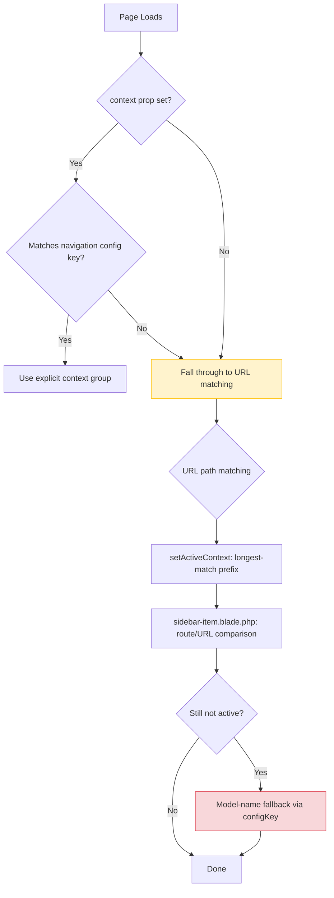

# Sidebar Active State, Context Switching & Navigation Pitfalls

A concise reference for future developers troubleshooting sidebar highlighting, context switching, and navigation issues. These bugs are interconnected and share common patterns—understanding one helps diagnose the others.

> **Last Updated**: 2026-09-25

---

## Quick Diagnostic Checklist

When sidebar highlighting or context switching is wrong, check these in order:

- [ ] **Are route definitions using query strings?** → Apply [`parse_url($route, PHP_URL_PATH)`](src/Resources/views/livewire/navs/partials/sidebar-item.blade.php:26) before any URL comparison
- [ ] **Is `context="value"` matching a navigation config key?** → Verify the value exists as a key in [`Config/navigation.php`](src/Components/NavigationLayout.php:208) context groups
- [ ] **Are there published views overriding library templates?** → Check `resources/views/vendor/` for stale copies
- [ ] **Is `configKey` shared across unrelated pages?** → Remove or change it on pages that don't need a data table config
- [ ] **Is prefix matching first-match-wins instead of longest-match?** → Check [`str_starts_with`](src/Components/NavigationLayout.php:238) ordering

---

## Bug Reference Table

| # | Bug | Symptom | Root Cause | Fix | Affected Files |
|---|-----|---------|------------|-----|----------------|
| 1 | Query Strings in Route Definitions | Sidebar items with query strings (e.g., `/leave/leave-hub?tab=all-requests`) never highlight; prefix matching produces false positives | [`request()->url()`](src/Resources/views/livewire/navs/partials/sidebar-item.blade.php:27) and [`request()->path()`](src/Components/NavigationLayout.php:213) strip query strings, but [`url($route)`](src/Resources/views/livewire/navs/partials/sidebar-item.blade.php:12) preserves them. `===` comparison fails. | Strip query strings with [`parse_url($route, PHP_URL_PATH) ?? $route`](src/Resources/views/livewire/navs/partials/sidebar-item.blade.php:26) before any URL comparison | [`sidebar-item.blade.php`](src/Resources/views/livewire/navs/partials/sidebar-item.blade.php), [`NavigationManager.php`](src/Services/Navigation/NavigationManager.php), [`Sidebar.php`](src/Http/Livewire/Layouts/Navs/Sidebar.php), [`NavigationLayout.php`](src/Components/NavigationLayout.php) |
| 2 | Greedy First-Match-Wins Prefix Matching | Broad routes (e.g., `/leave`) match before specific routes (e.g., `/leave/dashboard-requests-overview`) | [`setActiveContext()`](src/Components/NavigationLayout.php:206) used first-match-wins [`str_starts_with()`](src/Components/NavigationLayout.php:238) instead of longest-match | Collect all matches, pick the one with the longest [`strlen($pathToMatch)`](src/Components/NavigationLayout.php:239) | [`NavigationLayout.php`](src/Components/NavigationLayout.php) |
| 3 | Stale Published Views Override Library Fixes | Changes to library blade files have no effect in the consuming app | Laravel prioritizes published views in `resources/views/vendor/` over the vendor package's own views | Delete stale published copies or re-publish with `--force`, then `php artisan view:clear` | Any blade template under `src/Resources/views/` |
| 4 | `configKey` Causes model-name Fallback Dual-Highlight | Clicking one sidebar item highlights both it and another item | [`configKey`](src/Components/NavigationLayout.php:62) sets [`$currentModelName`](src/Components/NavigationLayout.php:75), which triggers the model-name fallback in [`sidebar-item.blade.php`](src/Resources/views/livewire/navs/partials/sidebar-item.blade.php:34). Two pages sharing the same `configKey` both match. | Remove [`configKey`](src/Components/NavigationLayout.php:57) from pages that don't need a data table config, or ensure each standalone page uses its own unique config key | [`NavigationLayout.php`](src/Components/NavigationLayout.php), [`sidebar-item.blade.php`](src/Resources/views/livewire/navs/partials/sidebar-item.blade.php) |
| 5 | Context Value Must Match navigation.php Group Key | Passing `context="leave"` when navigation config defines `requests` and `configuration` groups causes fallback to buggy URL-based resolution | The [`context`](src/Components/NavigationLayout.php:208) prop is checked against [`$this->contextGroups`](src/Components/NavigationLayout.php:208) keys via `isset()`. A mismatch skips the explicit context and falls through to URL-based matching. | The `context` prop in the blade view MUST match a context group key defined in `Config/navigation.php` | [`NavigationLayout.php`](src/Components/NavigationLayout.php), consuming app blade views |
| 6 | ContextSheet Not Opening on Mobile | Tapping the BottomBar handle bar dispatches `openContextSheet` but the slide-up panel never appears | The [`context-sheet.blade.php`](src/Resources/views/livewire/navs/context-sheet.blade.php) had two root-level elements (`<style>` + `<div>`), violating Livewire's single-root-element requirement. When `$isOpen` changed from `false` to `true`, DOM morphing failed to inject the overlay. | Move `<style>` inside the root `<div>` to ensure a single root element. Add `wire:key` on the overlay for stable morphing identity. | [`context-sheet.blade.php`](src/Resources/views/livewire/navs/context-sheet.blade.php) |
| 7 | `wire:navigate` Breaks Bootstrap 5 Dropdowns (Alternating Freeze/Unfreeze) | TopNav dropdowns (module switcher, company switcher, language, profile) alternately work and stop working after clicking BottomBar tabs | `wire:navigate` destroys and recreates the TopNav component on every SPA navigation (new `component_id` each `mount()`). Bootstrap 5 stores dropdown instances in an internal `Map` keyed by element reference — all state is lost. Five re-init strategies failed. | **Remove `wire:navigate` from BottomBar links.** Use standard `<a href>` with full page loads. The SPA trade-off is acceptable for mobile navigation; dropdown reliability is the priority. | [`bottom-bar.blade.php`](src/Resources/views/livewire/navs/bottom-bar.blade.php), [`06-navigation-system.md`](./06-navigation-system.md) |
| 8 | Detail Page Loses Sidebar Highlight | Sidebar item (e.g., "Payroll Runs") highlights on list page but loses highlight on detail page (e.g., `/payroll-runs/25`) | Exact URL comparison (`===`) fails because detail page URL differs from list page URL. `modelName` fallback only works when `configKey` is set on the detail page. | Use `str_starts_with()` prefix matching: `$isActive = request()->url() === $routeUrl \|\| str_starts_with(request()->url(), $routeUrl . '/')`. Also ensure navigation route matches actual route prefix. | [`sidebar-item.blade.php`](src/Resources/views/livewire/navs/partials/sidebar-item.blade.php), [`ContextSheet.php`](src/Http/Livewire/Layouts/Navs/ContextSheet.php) |

---

## Fix Patterns

### 1. Strip Query Strings Before URL Comparison

**Problem:** [`url($route)`](src/Resources/views/livewire/navs/partials/sidebar-item.blade.php:12) preserves query strings (e.g., `https://app.test/leave/leave-hub?tab=all-requests`), but [`request()->url()`](src/Resources/views/livewire/navs/partials/sidebar-item.blade.php:27) and [`request()->path()`](src/Components/NavigationLayout.php:213) strip them. The `===` comparison always fails.

**Before (broken):**
```php
// sidebar-item.blade.php
$isActive = request()->url() === url($item['route']);
// url('/leave/leave-hub?tab=all-requests') !== request()->url() → false
```

**After (fixed):**
```php
// sidebar-item.blade.php
$routePath = parse_url($item['route'], PHP_URL_PATH) ?? $item['route'];
$isActive = request()->url() === url($routePath);
// url('/leave/leave-hub') === request()->url() → true
```

**Same pattern applies in:**
- [`NavigationManager.php`](src/Services/Navigation/NavigationManager.php:550): `sectionHasActiveItem()`
- [`NavigationLayout.php`](src/Components/NavigationLayout.php:233): `setActiveContext()`

**Rule:** Any time you compare a route definition against a request URL/path, strip query strings from the route definition first.

---

### 2. Longest-Match Wins for Prefix Matching

**Problem:** [`str_starts_with`](src/Components/NavigationLayout.php:238) returns on the first match. If `/leave` appears before `/leave/dashboard-requests-overview` in the items array, `/leave` wins even when the user is on the more specific page.

**Before (broken):**
```php
// NavigationLayout.php - setActiveContext()
foreach ($this->contextItems as $ctx => $items) {
    foreach ($items as $item) {
        // ...
        if ($pathToMatch === $currentPath || str_starts_with($currentPath, $pathToMatch)) {
            $this->activeContext = $ctx;
            return;  // ← BUG: returns on first match, even if it's too broad
        }
    }
}
```

**After (fixed):**
```php
// NavigationLayout.php - setActiveContext()
$bestMatch = null;
$bestMatchLength = 0;

foreach ($this->contextItems as $ctx => $items) {
    foreach ($items as $item) {
        // ...
        if ($pathToMatch === $currentPath || str_starts_with($currentPath, $pathToMatch)) {
            $matchLength = strlen($pathToMatch);
            if ($matchLength > $bestMatchLength) {
                $bestMatch = $ctx;
                $bestMatchLength = $matchLength;
            }
        }
    }
}

if ($bestMatch !== null) {
    $this->activeContext = $bestMatch;
}
```

**Rule:** When using prefix matching for route resolution, always collect all candidates and pick the longest (most specific) match.

---

### 3. Clear Stale Published Views

**Problem:** Laravel's view publishing system copies blade templates from the vendor package to the consuming app's `resources/views/vendor/` directory. Once published, Laravel **always** loads the published copy, ignoring any changes to the original in the vendor package.

**Diagnosis:**
```bash
# Check if any qf (QuickerFaster) views are published
ls resources/views/vendor/qf/
```

**Fix:**
```bash
# Option A: Delete stale copies (preferred if you want library defaults)
rm -rf resources/views/vendor/qf/

# Option B: Re-publish with force to get latest library versions
php artisan vendor:publish --tag=qf-views --force

# Always clear the view cache after
php artisan view:clear
```

**Rule:** After modifying any library blade template, verify no stale published copy exists in the consuming app. This is the #1 cause of "I fixed it but nothing changed."

---

### 4. Avoid Shared `configKey` Across Unrelated Pages

**Problem:** [`configKey`](src/Components/NavigationLayout.php:57) on [`NavigationLayout`](src/Components/NavigationLayout.php) does two things:
1. Loads a data table config via [`ConfigResolver`](src/Components/NavigationLayout.php:65)
2. Sets [`$currentModelName`](src/Components/NavigationLayout.php:75) from that config

[`$currentModelName`](src/Components/NavigationLayout.php:32) is passed to [`sidebar-item.blade.php`](src/Resources/views/livewire/navs/partials/sidebar-item.blade.php:34) where it triggers a model-name fallback match (lines 34-43). If two pages share the same `configKey`, both sidebar items match the same model name.

**Before (broken):**
```blade
{{-- Approvals page --}}
<x-qf::navigation-layout configKey="leave.leave_request" context="requests">
    {{-- ... --}}
</x-qf::navigation-layout>
```

**After (fixed):**
```blade
{{-- Approvals page — remove configKey if no data table config is needed --}}
<x-qf::navigation-layout context="requests">
    {{-- ... --}}
</x-qf::navigation-layout>
```

**Rule:** Only set [`configKey`](src/Components/NavigationLayout.php:57) on pages that actually render a data table and need a config. For standalone pages (approvals, dashboards, reports), omit it or use a unique key.

---

### 5. Match `context` Prop to navigation.php Group Key

**Problem:** The [`context`](src/Components/NavigationLayout.php:20) prop is checked with a direct [`isset($this->contextGroups[$this->context])`](src/Components/NavigationLayout.php:208). If the value doesn't match a key in the navigation config's context groups, it silently falls through to URL-based resolution—which may have its own bugs (see #1 and #2).

**Before (broken):**
```blade
{{-- Blade view --}}
<x-qf::navigation-layout context="leave" ...>
```
```php
// Config/navigation.php
'context_groups' => [
    'requests' => [...],       // ← "leave" doesn't match any key
    'configuration' => [...],
]
```

**After (fixed):**
```blade
{{-- Blade view — context must match a navigation config key --}}
<x-qf::navigation-layout context="requests" ...>
```

**Rule:** The [`context`](src/Components/NavigationLayout.php:20) value must exactly match a top-level key in the `context_groups` array of `Config/navigation.php`. When in doubt, grep the navigation config for available keys.

---

## Prevention Checklist

When adding new navigation items or pages, verify:

- [ ] **No query strings in route definitions.** If a route needs query parameters, handle them in the controller/view, not in the navigation config.
- [ ] **Routes ordered from most specific to least specific** in navigation configs, or longest-match logic is in place.
- [ ] **`context` prop matches a navigation config key.** Copy-paste the key name to avoid typos.
- [ ] **`configKey` is only set when needed.** Ask: "Does this page render a data table that needs a config?" If not, omit it.
- [ ] **No stale published views.** After any blade template change, run `php artisan view:clear` and verify no published copies exist.
- [ ] **Test with both named routes and URL paths.** The code paths differ (see [`sidebar-item.blade.php`](src/Resources/views/livewire/navs/partials/sidebar-item.blade.php:8-17)).

---

---

### 6. ContextSheet Not Opening + Active Items Not Highlighting

**Problem A — Multi-Root Element:** The [`context-sheet.blade.php`](src/Resources/views/livewire/navs/context-sheet.blade.php) had two root-level elements (`<style>` + `<div>`). DOM morphing failed to inject the overlay when `$isOpen` changed.

**Problem B — `request()->url()` Returns `/livewire/update`:** During Livewire component re-renders (when the user opens the ContextSheet or BottomBar overflow), `request()->url()` returns `https://app.test/livewire/update` — the Livewire AJAX endpoint. This will **never** match any page URL, so `isItemActive()` always returns `false`.

**Symptom:** Active items in the ContextSheet and BottomBar "More..." overflow never show the blue left border, tinted background, or checkmark. The server confirms `render()` with correct data, but `isItemActive()` compares against the wrong URL.

**Fix A — Single root element:**
```blade
{{-- Before (broken) --}}
<style>...</style>
<div>...</div>

{{-- After (fixed) --}}
<div>
    @if ($isOpen) ... @endif
</div>
```

**Fix B — Use `url()->previous()`:**
```php
// Before (broken — returns /livewire/update during re-renders)
$currentUrl = request()->url();

// After (fixed — returns the actual page URL)
$currentUrl = url()->previous();
```

**Also required:** Bump `$renderVersion` after structural Blade changes to force Livewire snapshot regeneration. Move `<style>` tags to [`quicker-faster.css`](public/assets/css/quicker-faster.css) — they are lost during DOM morphing.

**Rule:** Never use `request()->url()` in Livewire component methods that are called during re-renders. Always use `url()->previous()`. See [Debug Checklist §10](../debug-checklist.md).

---

### 7. `wire:navigate` + Bootstrap 5 Dropdown Incompatibility

**Problem:** `wire:navigate` on BottomBar tabs destroys and recreates the TopNav Livewire component on every SPA navigation. Bootstrap 5 stores dropdown instances in an internal `Map` keyed by element reference — when the TopNav is recreated, all dropdown state is lost.

**Symptom:** TopNav dropdowns (module switcher, company switcher, language switcher, profile menu) exhibit a deterministic alternating pattern: work → broken → work → broken after each BottomBar tab click.

**Diagnostic confirmation:**
1. Add `\Log::info('[TopNav] mount()', ['component_id' => $this->getId()])` to [`TopNav::mount()`](src/Http/Livewire/Layouts/Navs/TopNav.php:135)
2. Click a BottomBar tab → check `storage/logs/laravel.log`
3. A new `component_id` on every click confirms the TopNav is being destroyed and recreated

**Failed approaches (all tested, none worked):**
| Approach | Why It Failed |
|----------|---------------|
| `dispose()` + `new bootstrap.Dropdown(el)` | `getInstance()` returns `null` after morphing, so `dispose()` is never called; stale listeners remain |
| `cloneNode(true)` + `replaceChild` + `new Dropdown(clone)` | Clone strips listeners but the new TopNav component re-renders after the handler runs, replacing clones |
| `setTimeout(fn, 50)` | Insufficient delay; TopNav re-render completes asynchronously |
| Double `requestAnimationFrame` | Still races with Livewire component lifecycle |
| Livewire `@script` directive in TopNav blade | `@script` runs during component render, but Bootstrap's document-level delegation conflicts with the fresh instances |

**Fix:** Remove `wire:navigate` from BottomBar links. Use standard `<a href>` with full page loads.

**Before (broken):**
```blade
{{-- bottom-bar.blade.php --}}
<a href="{{ $url }}" wire:navigate class="btn btn-sm ...">
```

**After (fixed):**
```blade
{{-- bottom-bar.blade.php --}}
<a href="{{ $url }}" class="btn btn-sm ...">
```

**Rule:** Do NOT use `wire:navigate` on navigation links that coexist on the same page with Bootstrap 5 dropdowns. The SPA navigation destroys and recreates Livewire components, and Bootstrap 5's internal state cannot be reliably restored. Full page loads are the only reliable option when Bootstrap dropdowns and Livewire navigation share the same page.

**Prevention:**
- [ ] **Any link with `wire:navigate` must be audited** for coexistence with Bootstrap dropdowns on the same page
- [ ] **Prefer full page loads for primary navigation** (BottomBar tabs, sidebar links that change context)
- [ ] **Reserve `wire:navigate` for in-page navigation** where no Bootstrap dropdowns exist in the preserved shell
- [ ] **If SPA navigation is essential**, consider replacing Bootstrap dropdowns with a pure-CSS or Alpine-based alternative that doesn't maintain internal JavaScript state

---

## Architecture Notes

These bugs share a common thread: the sidebar active state is resolved through **three independent mechanisms** that can conflict:



The two fallback paths (URL matching and model-name fallback) are where most bugs occur. The explicit `context` prop is the most reliable mechanism—use it whenever possible.

---

## 6. Notification Type Mapping Not in Config

**Bug Pattern:** Workflow notification events fire but produce garbled template type names like `workflow_workflow_submitted` (double-prefix) or fail silently because the event name isn't mapped in the workflow definition's `notifications.types` config.

### Root Cause

[`WorkflowEngine::notifyTransition()`](src/Services/Workflow/WorkflowEngine.php:651) resolves the notification template type name from `$config['types'][$event]`. When an event key is missing from the `types` map, the fallback is:

```php
$typeName = $types[$event] ?? "workflow_{$event}";
```

This produces `workflow_submitted`, `workflow_approved`, etc. — which works for the four basic events but **fails silently** for newer event types like `stage_advanced`, `submitted_initiator`, and `workflow_completed`. The fallback `workflow_stage_advanced` won't match any seeded template, and the notification is dispatched to a non-existent template type.

### The Full Event Surface

The `WorkflowEngine` now dispatches **seven** distinct notification events:

| Event | When | Recipient |
|-------|------|-----------|
| `submitted` | Workflow submitted | Current step approvers |
| `submitted_initiator` | Workflow submitted | Submitter (confirmation) |
| `approved` | Step approved | Next step approvers |
| `stage_advanced` | Step approved | Submitter (progress update) |
| `workflow_completed` | Final step approved | Submitter (completion) |
| `rejected` | Workflow rejected | Submitter |
| `recalled` | Workflow recalled | All pending approvers |

**Every one of these must have a corresponding entry in `notifications.types`** in the workflow definition config.

### Before (broken — missing mappings):

```php
// Config/workflows.php or DB workflow definition
'notifications' => [
    'enabled' => true,
    'types' => [
        'submitted' => 'workflow_submitted',
        'approved'  => 'workflow_approved',
        'rejected'  => 'workflow_rejected',
        'recalled'  => 'workflow_recalled',
        // ❌ stage_advanced, submitted_initiator, workflow_completed MISSING
    ],
],
```

**Symptoms:**
- Log warning: `"Workflow notification type not mapped. Add 'stage_advanced' to notifications.types config."`
- Initiator never receives "your request advanced to next stage" notifications
- Initiator never receives "workflow completed" notification
- Initiator never receives submission confirmation

### After (fixed — all seven events mapped):

```php
'notifications' => [
    'enabled' => true,
    'types' => [
        'submitted'           => 'workflow_submitted',
        'submitted_initiator' => 'workflow_submitted_initiator',
        'approved'            => 'workflow_approved',
        'stage_advanced'      => 'workflow_stage_advanced',
        'workflow_completed'  => 'workflow_completed',
        'rejected'            => 'workflow_rejected',
        'recalled'            => 'workflow_recalled',
    ],
],
```

### Template Naming Convention

All workflow notification template types use the `workflow_` prefix:

- `workflow_submitted` — approver notification
- `workflow_submitted_initiator` — initiator confirmation
- `workflow_approved` — next approver notification
- `workflow_stage_advanced` — initiator progress update
- `workflow_completed` — initiator final approval
- `workflow_rejected` — initiator rejection notice
- `workflow_recalled` — approver recall notice

Each template type must have a corresponding row in the `notification_templates` table (seeded or manually created).

### Prevention

- [ ] **Every workflow notification event must have a `types` mapping.** When adding a new event to `WorkflowEngine`, add it to all workflow definition configs.
- [ ] **Run `NotificationTemplateIntegrityTest`** — this test verifies that every event in `notifications.types` has a corresponding template in the database.
- [ ] **Template types use `workflow_` prefix.** Never use bare event names as template types.
- [ ] **Check the laravel.log** after workflow operations for `"Workflow notification type not mapped"` warnings.

### Related Bug: Double-Prefix Fallback

When an event like `stage_advanced` is missing from `types`, the fallback produces `workflow_stage_advanced`. If someone later adds `'stage_advanced' => 'workflow_stage_advanced'` to the types map, it works. But if they mistakenly add `'stage_advanced' => 'stage_advanced'` (without the `workflow_` prefix), the template won't match the convention and the notification will silently fail.

**Rule:** Template type values in `notifications.types` must always use the `workflow_` prefix convention, matching what's in the `notification_templates` table.