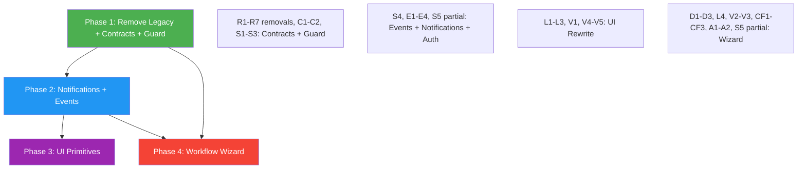

# QuickerFaster UI Library — Workflow & Approval Implementation Plan

> **Package**: `quicker-faster/ui-library`
> **Namespace**: `QuickerFaster\UILibrary\`
> **Status**: Implementation Plan (Revised — Domain-Agnostic Foundation)
> **Scope**: Legacy approval stack removal, single-path `WorkflowEngine` hardening, reusable approval UI, and workflow definition wizard

**Related files**: [`21-approval-infrastructure-analysis.md`](./21-approval-infrastructure-analysis.md) · [`22-workflow-definition-wizard-ux.md`](./22-workflow-definition-wizard-ux.md) · [`00-index.md`](../README.md)

> ⚠️ **Testing status (2026-08-16)**: The workflow/approval foundation has been implemented and unit-verified (`php -l`, config validation), but has **NOT** yet been tested end-to-end in a consuming app. Further adjustments may be needed once integrated into a real consuming app (e.g., Spatie role/permission seeding, notification template registration, workspace-scoped approver resolution, and runtime workflow execution against real entities).

---

## Bug-Fix Pass — 2026-08-15

Eight bugs were discovered during a code-grounded walkthrough of the Workflow Definition Wizard's "Add Initiators" step and fixed:

| # | Severity | Bug | Fix |
|---|----------|-----|-----|
| 1 | Critical | No initiator enforcement at runtime — `start()` never checked the submitter against initiators | `start()` now resolves initiator assignees and calls `ApprovalGuard::canSubmit()` before creating the workflow; throws `AuthorizationException` on failure |
| 2 | Critical | `hydrateFromModel()` ignored `tier_type`, treating all steps as `step_type = 'approval'` | `hydrateFromModel()` now separates initiator steps into an `initiators` key; only review/authorizer steps populate the `steps` array |
| 3 | Yellow | Role IDs stored as integers in the initiator/authorizer picker (inconsistent with `ReviewerChainBuilder`) | `updatedSearches()` now keys role results by `name` string instead of `getKey()` integer |
| 4 | Yellow | `DefaultApproverResolver` treated all numerics as role PKs, misinterpreting user IDs | `resolve()` now implements int = user ID (pass-through), string = role name (query by name) convention |
| 5 | Yellow | `normalizeAssignees()` misclassified on reload — role labels became numeric strings | Now classifies by id type (int = user, string = role) independent of the stored `mode` field |
| 6 | Yellow | Initiator picker vs `ReviewerChainBuilder` inconsistency (same root cause as Bug 3) | Fixed by Bugs 3–5; both now store roles as string names |
| 7 | Green | `hasActiveWorkflow()` existed but was never called | `start()` now calls `hasActiveWorkflow()` and throws `RuntimeException` if an active workflow already exists |
| 8 | Green | `$initiatorMode`/`$authorizerMode` toggle was cosmetic — persisted `mode` derived from items | `loadDefinition()` now syncs the toggle from `detectMode()`; documented that `mode` is derived |

**Files changed**: [`WorkflowEngine.php`](../../src/Services/Workflow/WorkflowEngine.php), [`WorkflowDefinitionWizard.php`](../../src/Http/Livewire/Workflows/WorkflowDefinitionWizard.php), [`DefaultApproverResolver.php`](../../src/Services/Approvals/DefaultApproverResolver.php), [`ApproverResolver.php`](../../src/Contracts/Approvals/ApproverResolver.php)

## Step-3 Fix Pass — 2026-08-15

Eight discrepancies found during the Step 3 (Add Reviewers) walkthrough were fixed. This pass builds on the prior Bug-Fix Pass above.

| # | Severity | Discrepancy | Fix |
|---|----------|-------------|-----|
| 1 | Yellow | `validateCurrentStep()` had no `case 2`; empty/half-filled review steps passed silently | Added `case 2` → `validateReviewSteps()`: named steps require at least one assignee; empty named/no-assignee blanks are skipped; review tier remains optional |
| 2 | Critical | `approve()` ignored `approval_mode`, so `all` behaved like `any` | Added `approveAllMode()`: per-user approvals are tracked as [`WorkflowAction`](../../src/Models/WorkflowAction.php) rows; the step only advances once every resolved assignee has approved; duplicate approval throws `RuntimeException` |
| 3 | Yellow | `reject()` never called `ApprovalGuard`, so anyone could reject | Added `ApprovalGuard::canApprove()` at the start of `reject()`, throwing `AuthorizationException` for unauthorized users |
| 4 | Green | Named review steps with no assignees were silently dropped on save | `saveDefinition()` now dispatches a `showAlert` warning before skipping such steps |
| 5 | Green | Two distinct "mode" concepts (`assignees.mode` vs `resolution_mode`) had confusing names | Added docblocks to [`WorkflowDefinitionStep`](../../src/Models/WorkflowDefinitionStep.php) and [`ReviewerChainBuilder`](../../src/Http/Livewire/Workflows/ReviewerChainBuilder.php) documenting the distinction |
| 6 | Yellow | No-review/no-authorizer definitions left workflows stuck `pending` forever | `start()` now auto-approves workflows whose definition yields zero runtime steps (auto-approve when no approval gates exist) |
| 7 | Yellow | DB-driven definitions never triggered notifications (`notificationConfig()` only read config) | New migration adds `workflow_definitions.notifications`; [`WorkflowDefinition`](../../src/Models/WorkflowDefinition.php) gained fillable + array cast; `notificationConfig()` reads DB-first with config fallback; wizard gained an optional notifications toggle + type fields *(superseded 2026-08-16 — replaced by four per-event notification toggles)* |
| 8 | Green | Two wizard blade files were confusing to discover | Added a docblock to the admin page wrapper clarifying it is a thin catch-all wrapper and the real UI lives in the Livewire component view |

### `all`-mode approval flow (Fix 2)

```
approve(workflow, comments)
  → guard: workflow must be pending
  → guard: current step must be pending
  → guard: ApprovalGuard::canApprove(user, step.roles, workspace)
  → if step.approval_mode === 'all':
       1. query WorkflowAction (step_id = current.id, action = 'approved',
          user_id = current user). If exists → throw RuntimeException
       2. logAction(workflow, current, 'approved', comments)   // step NOT yet approved
       3. requiredIds = ApproverResolver::resolve(current.roles, workspace)
       4. distinctApproverCount = WorkflowAction where step_id = current.id
          and action = 'approved' distinct user_id count
       5. if distinctApproverCount < count(requiredIds):
             event(WorkflowApproved(..., completed = false))
             notifyTransition(..., partial = true, remaining = N)
             return   // step stays pending
       6. mark current step approved (approved_by, approved_at, comments)
       7. advanceToNextStep(workflow)
  → else (any mode): original behavior
```

### Auto-approve edge case (Fix 6)

When `start()` creates zero runtime `WorkflowStep` rows (a definition with only initiators and no review/authorizer tiers), the workflow is marked `approved` with `completed_at` inside the same transaction, a `completed` action is logged, and `WorkflowApproved` is dispatched with `completed = true`. No `WorkflowSubmitted` notification is dispatched because there are no approvers to notify.

**Files changed**: [`WorkflowEngine.php`](../../src/Services/Workflow/WorkflowEngine.php), [`WorkflowDefinitionWizard.php`](../../src/Http/Livewire/Workflows/WorkflowDefinitionWizard.php), [`WorkflowDefinition.php`](../../src/Models/WorkflowDefinition.php), [`WorkflowDefinitionStep.php`](../../src/Models/WorkflowDefinitionStep.php), [`ReviewerChainBuilder.php`](../../src/Http/Livewire/Workflows/ReviewerChainBuilder.php), [`WorkflowApproved.php`](../../src/Events/Workflows/WorkflowApproved.php), [`2026_08_15_000004_add_notifications_to_workflow_definitions.php`](../../Database/Migrations/2026_08_15_000004_add_notifications_to_workflow_definitions.php), and two Blade views.

## Step-4 Fix Pass — 2026-08-15

Seven discrepancies found during the Step 4 (Add Authorizers) walkthrough were fixed. This pass builds on the Step-3 Fix Pass above.

| # | Severity | Discrepancy | Fix |
|---|----------|-------------|-----|
| A | Yellow | [`hydrateFromModel()`](../../src/Services/Workflow/WorkflowEngine.php) copied `resolution_mode` → `approval_mode` verbatim for ALL review+authorizer steps, so a DB-edited authorizer row with `resolution_mode = 'all'` would make every authorizer approve | Authorizer steps are now forced to `approval_mode = 'any'` during hydration, regardless of the stored `resolution_mode`. Review steps keep their stored `any`/`all` mode. |
| B | Green | [`updatedInitiatorMode()`/`updatedAuthorizerMode()`](../../src/Http/Livewire/Workflows/WorkflowDefinitionWizard.php) called `resetPicker()`, which cleared the entire `$initiators`/`$authorizers` selection when the mode toggle changed | `resetPicker()` is now non-destructive: it preserves the selection arrays, clears only the transient search state, and rebuilds `$fields`/`$selectedLabels` from the preserved selection so badges keep rendering. |
| C | Green | `resolution_mode` vs `approval_mode` naming ambiguity | Docblocks added/updated: [`WorkflowDefinitionStep::resolution_mode`](../../src/Models/WorkflowDefinitionStep.php) is the definition column mapping to the runtime [`WorkflowStep::approval_mode`](../../src/Models/WorkflowStep.php); `WorkflowStep` documents `approval_mode` as the runtime equivalent. |
| D | Green | No documentation of 0-based `$currentStep` vs 1-based UI steps | Added a docblock note in [`WorkflowDefinitionWizard`](../../src/Http/Livewire/Workflows/WorkflowDefinitionWizard.php) mapping Step 1–5 (UI) to `$currentStep` 0–4 (internal). |
| E | Green | Wizard requires ≥1 authorizer, but the engine auto-approves zero-step definitions | Documented the intentional split: wizard-created definitions always include an authorizer (enforced by `validateAssignees()`); only manually-authored config definitions can hit the auto-approve path. |

**Files changed**: [`WorkflowEngine.php`](../../src/Services/Workflow/WorkflowEngine.php), [`WorkflowDefinitionWizard.php`](../../src/Http/Livewire/Workflows/WorkflowDefinitionWizard.php), [`WorkflowDefinitionStep.php`](../../src/Models/WorkflowDefinitionStep.php), [`WorkflowStep.php`](../../src/Models/WorkflowStep.php)

## Step-5 Fix Pass — 2026-08-15

Nine discrepancies found during the Step 5 (Summary + Plug-In Usage) walkthrough were resolved — three genuine fixes and six documentation updates. This pass builds on the Step-4 Fix Pass above.

| # | Severity | Discrepancy | Fix |
|---|----------|-------------|-----|
| 1 | Yellow | `finish()` saved without re-validating, so jumping directly to the Summary (`goToStep(4)`) could persist an empty/invalid definition | `finish()` now runs `validateFinalStep()` (checks `workflowName`, `workflowKey`, and `authorizers`) and redirects back to the relevant step with an error on failure |
| 2 | Yellow | No index of existing definitions; nav pointed only at the create path, and "Back to Workflows" returned to the empty wizard URL | Added [`WorkflowDefinitionList`](../../src/Http/Livewire/Workflows/WorkflowDefinitionList.php) + list view + [`admin/workflow-definitions.blade.php`](../../src/Core/Admin/Resources/views/admin/workflow-definitions.blade.php) served at `/admin/workflow-definitions`; navigation now points at the list with a separate "New Workflow" item; wizard completion/cancel return to the list *(superseded 2026-08-16 — list refactored to `qf.data-table`)* |
| 3 | Green | `dispatch('showAlert')` fired from inside the `DB::transaction` closure | `saveDefinition()` now accumulates skipped-review-step warnings in a local array and dispatches them after the transaction commits |
| 4 | Green | "Step 6 Notifications" docblock mislabeled (only 5 steps; notification UI lives in Step 5) | Docblock updated to "Notifications configuration (within Step 5 — Summary)" |
| 5 | Green | [`Workflowable::getWorkflowDefinitionKey()`](../../src/Contracts/Workflow/Workflowable.php) docstring described config-only resolution | Updated to "resolved DB-first from `workflow_definitions`, falling back to `config('ui-library.workflows.definitions')`" |
| 6 | Green | `entity_type` was not documented as descriptive-only | Documented in [`WorkflowDefinition`](../../src/Models/WorkflowDefinition.php) that `entity_type` is a label and `key` is the sole lookup key |
| 7 | Green | Summary pipeline "Initiator" node ≠ runtime `WorkflowStep` rows | Documented in the wizard class docblock that initiators are presentation-only and excluded from runtime steps by `hydrateFromModel()` |
| 8 | Green | "Inactive" semantics unclear | Documented in [`WorkflowDefinition`](../../src/Models/WorkflowDefinition.php) and [`WorkflowEngine::getDefinition()`](../../src/Services/Workflow/WorkflowEngine.php) that `is_active = false` = un-startable (skipped in DB-first lookup) |
| 9 | Green | Notification section wording | Clarified the Blade comment that the notifications section is a Livewire toggle, not a Bootstrap collapse |

**Files changed**: [`WorkflowDefinitionWizard.php`](../../src/Http/Livewire/Workflows/WorkflowDefinitionWizard.php), [`Workflowable.php`](../../src/Contracts/Workflow/Workflowable.php), [`WorkflowDefinition.php`](../../src/Models/WorkflowDefinition.php), [`WorkflowEngine.php`](../../src/Services/Workflow/WorkflowEngine.php), [`WorkflowDefinitionList.php`](../../src/Http/Livewire/Workflows/WorkflowDefinitionList.php), [`UILibraryServiceProvider.php`](../../src/Providers/UILibraryServiceProvider.php), [`navigation.php`](../../src/Core/Admin/Config/navigation.php), and three Blade views.

## 2026-08-16 — Wizard & List Fix Pass

Six follow-up issues in the Workflow Definition Wizard and its list page were fixed:

| # | Area | Fix |
|---|------|-----|
| 1 | Validation error persistence | [`validateCurrentStep()`](../../src/Http/Livewire/Workflows/WorkflowDefinitionWizard.php) now calls `resetErrorBag()` before validating, so errors from a previously-failed step no longer persist across navigation. |
| 2 | Tag retention | [`repopulateCurrentPicker()`](../../src/Http/Livewire/Workflows/WorkflowDefinitionWizard.php) / [`repopulatePicker()`](../../src/Http/Livewire/Workflows/WorkflowDefinitionWizard.php) rebuild the transient `$fields`/`$selectedLabels` picker state on navigation, so initiator/authorizer tags no longer disappear on Back/Continue/jump. |
| 3 | `canPerformAction()` TypeError | [`row-actions.blade.php`](../../src/Resources/views/livewire/data-tables/partials/row-actions.blade.php) and [`DataTable::handleRowAction()`](../../src/Http/Livewire/DataTables/DataTable.php) were passing the whole `moreActions` entry (an array) to `canPerformAction()`. They now extract the string permission (`$action['action'] ?? $action['permission'] ?? ''`); the list config supplies `'action' => 'edit'`. |
| 4 | Edit pre-load | [`WorkflowDefinitionWizard::mount()`](../../src/Http/Livewire/Workflows/WorkflowDefinitionWizard.php) now reads `definitionId` from the request query string (the admin wrapper passes no mount params); `loadDefinition()` pre-populates all fields including the four notification toggles. |
| 5 | Notification toggles | The four free-text notification "type name" inputs were replaced with four toggle switches (`$notifyOnSubmitted`, `$notifyOnApproved`, `$notifyOnRejected`, `$notifyOnRecalled`). The master "Enable workflow notifications" toggle was removed; `enabled` is derived (`enabled = any toggle on`) and each `types.*` value is a fixed template name or `null`. |
| 6 | DataTable refactor | [`WorkflowDefinitionList`](../../src/Http/Livewire/Workflows/WorkflowDefinitionList.php) is deprecated; the list page now uses `qf.data-table` with config [`admin.workflow_definition`](../../src/Core/Admin/Data/workflow_definition.php). |

**Files changed**: [`WorkflowDefinitionWizard.php`](../../src/Http/Livewire/Workflows/WorkflowDefinitionWizard.php), [`WorkflowDefinitionList.php`](../../src/Http/Livewire/Workflows/WorkflowDefinitionList.php), [`workflow-definition-list.blade.php`](../../src/Resources/views/livewire/workflows/workflow-definition-list.blade.php), [`workflow-definitions.blade.php`](../../src/Core/Admin/Resources/views/admin/workflow-definitions.blade.php), [`row-actions.blade.php`](../../src/Resources/views/livewire/data-tables/partials/row-actions.blade.php), [`DataTable.php`](../../src/Http/Livewire/DataTables/DataTable.php), [`UILibraryServiceProvider.php`](../../src/Providers/UILibraryServiceProvider.php), and new [`workflow_definition.php`](../../src/Core/Admin/Data/workflow_definition.php).

---

## 1. Executive Summary

This plan delivers a **single, coherent, domain-agnostic workflow/approval engine** for the QuickerFaster UI Library. The library is now a **pure generic foundation** for any future project — accounting, inventory, CRM, project management, etc. There is no HR module, no Quick-HR consumer, and no legacy compatibility to preserve.

### Key Strategic Decision: Remove the Legacy Approval Stack

The legacy `ApprovalEngine` / `ApprovalRequest` / `ApprovalTier` / `HasApproval` / `ApprovalConfigResolver` stack is **non-functional out of the box** (missing models, missing migration, fillable mismatches). It only ever "worked" because the now-defunct Quick-HR app supplied its own models and migration. A generic foundation library must not ship broken code. The `WorkflowEngine` is already complete, migrated, contract-driven, and functional — it becomes the **single approval/workflow path**.

### Strategy: Incremental (4 Phases)

The work is delivered in **4 independently-shippable phases**. Phase 1 removes the dead legacy stack and introduces authorization contracts. Phase 2 wires notifications and events. Phase 3 builds reusable approval UI primitives on the `Workflow` models. Phase 4 ships the workflow definition wizard. Each phase is self-contained and independently verifiable.

---

## 2. Deprecation / Repair / Removal Decision Table

Every legacy approval artifact is evaluated under the "no HR consumer" assumption:

| Artifact | Path | Decision | Rationale |
|----------|------|----------|-----------|
| `ApprovalEngine` | [`src/Services/Approvals/ApprovalEngine.php`](../../src/Services/Approvals/ApprovalEngine.php) | **REMOVE** | Non-functional standalone (missing models, missing migration). `WorkflowEngine` is the complete, migrated successor. No consumer to preserve. |
| `ApprovalRequest` | [`src/Models/ApprovalRequest.php`](../../src/Models/ApprovalRequest.php) | **REMOVE** | Incomplete fillable/relations. Only existed for legacy engine. `Workflow` model replaces it. |
| `ApprovalTier` | [`src/Models/ApprovalTier.php`](../../src/Models/ApprovalTier.php) | **REMOVE** | Fillable mismatch with engine writes. Only existed for legacy engine. `WorkflowStep` replaces it. |
| `ApprovalLog` | (never existed — config reference only) | **REMOVE CONFIG ENTRY** | Never created. Referenced by `ApprovalModelResolver` → fatal at runtime. `WorkflowAction` is the equivalent. |
| `ApprovalTierApproval` | (never existed — config reference only) | **REMOVE CONFIG ENTRY** | Never created. Referenced by `ApprovalModelResolver` → fatal at runtime. No equivalent needed (step-level approval is tracked on `WorkflowStep`). |
| `HasApproval` trait | [`src/Traits/Approvals/HasApproval.php`](../../src/Traits/Approvals/HasApproval.php) | **REMOVE** | Provides `approvalRequest()` morphOne to `ApprovalRequest`. Entities should implement `Workflowable` contract instead. |
| `ApprovalConfigResolver` | [`src/Services/Config/Approvals/ApprovalConfigResolver.php`](../../src/Services/Config/Approvals/ApprovalConfigResolver.php) | **REMOVE** | Reads module config for legacy tier definitions. Replaced by `WorkflowEngine::getDefinition()` (DB-first + config fallback). |
| `ApprovalModelResolver` (contract) | [`src/Contracts/Approvals/ApprovalModelResolver.php`](../../src/Contracts/Approvals/ApprovalModelResolver.php) | **REMOVE** | Resolves FQCNs for legacy models. No purpose without the legacy stack. |
| `ApprovalModelResolver` (service) | [`src/Services/Approvals/ApprovalModelResolver.php`](../../src/Services/Approvals/ApprovalModelResolver.php) | **REMOVE** | Default implementation of the contract. Removed with the contract. |
| `ApprovalActions` | [`src/Http/Livewire/Approvals/ApprovalActions.php`](../../src/Http/Livewire/Approvals/ApprovalActions.php) | **REWRITE** | Hard-wired to `ApprovalEngine` + `ApprovalRequest`. Rewritten in Phase 3 to target `Workflow`/`WorkflowStep`/`WorkflowAction`. |
| `ApprovalHistoryTimeline` | [`src/Http/Livewire/Approvals/ApprovalHistoryTimeline.php`](../../src/Http/Livewire/Approvals/ApprovalHistoryTimeline.php) | **REWRITE** | Hard-wired to `ApprovalRequest`/`ApprovalTier`. Rewritten in Phase 3 to target `Workflow` models. |
| `approvals.models` config | [`src/Config/ui-library.php`](../../src/Config/ui-library.php) (lines 348–355) | **REMOVE** | Model FQCN mappings for the legacy stack. No purpose without it. |
| `approvals` feature flag | [`src/Config/ui-library.php`](../../src/Config/ui-library.php) (line 461) | **KEEP** | Rename to `workflows` or keep as generic "approvals" feature toggle. The concept of "approvals" is domain-agnostic. |
| `actions.blade.php` | [`src/Resources/views/livewire/approvals/actions.blade.php`](../../src/Resources/views/livewire/approvals/actions.blade.php) | **REWRITE** | Coupled to legacy `ApprovalActions` component. Rewritten in Phase 3. |
| `timeline.blade.php` | [`src/Resources/views/livewire/approvals/timeline.blade.php`](../../src/Resources/views/livewire/approvals/timeline.blade.php) | **REWRITE** | Coupled to legacy `ApprovalHistoryTimeline` component. Rewritten in Phase 3. |
| `approval-status-badge.blade.php` | [`src/Resources/views/components/status/approval-status-badge.blade.php`](../../src/Resources/views/components/status/approval-status-badge.blade.php) | **KEEP & GENERALIZE** | Status badge is domain-agnostic (draft/pending/approved/rejected/cancelled). Ensure no HR-specific labels. |

---

## 3. Domain-Specific Leakage Found & Fixed

### 3.1 In the Plan Documents (Docs 12, 13, 14)

| Location | Leakage | Type | Fix |
|----------|---------|------|-----|
| Doc 14 §1, §5 risk table | "Quick-HR consuming app continues to work", "Quick-HR overrides models via config", "Schema::hasTable() guard for Quick-HR's existing tables" | **(b) Actual coupling** | Removed entirely. No legacy consumer exists. |
| Doc 14 §3.1 acceptance criteria | "Verify Quick-HR still works" | **(b) Actual coupling** | Removed. |
| Doc 14 §3.4 acceptance criteria | "Quick-HR's existing ApprovalActions usage (no mode param) defaults to legacy" | **(b) Actual coupling** | Removed. Components are rewritten, not refactored with a `mode` parameter. |
| Doc 13 §2.2.1, §2.5, §3.3, §3.7, §4.3 | "Leave Request", "Leave Request Approval", `leave_request` key, `LeaveRequest` model example | **(a) Example** | Replaced with "Purchase Order Approval", "Invoice Approval", "Expense Report". |
| Doc 13 §3.3 | `entity_type` field example "Leave Request", "Payroll Run" | **(a) Example** | Replaced with "Purchase Order", "Invoice", "Expense Report". |
| Doc 12 §2.1, §3.1 | `PayrollRun`, `LeaveRequest`, `LeaveApprover`, `leave_request_approval.php`, `payroll_run_approval.php` | **(a) Example** | Replaced with generic entity references. |
| Doc 12 §4.3 | "leave vs. payroll vs. procurement" | **(a) Example** | Kept — "procurement" is already generic. |
| Doc 14 risk table | "employee onboarding, payroll run" as existing wizard examples | **(a) Example** | Replaced with "other wizards in consuming apps". |

### 3.2 In the Library Source Code

| File | Leakage | Type | Fix |
|------|---------|------|-----|
| [`src/Config/ui-library.php`](../../src/Config/ui-library.php) L377–383 | `leave_request` workflow example, "Leave Request Approval", "HR Review" role | **(a) Example** | Replace with `purchase_order` example: "Purchase Order Approval" with roles `['manager', 'finance']`. |
| [`src/Config/ui-library.php`](../../src/Config/ui-library.php) L467–475 | `multi_company_payroll` feature flag | **(b) Actual coupling** | **Out of scope for this plan** — noted for broader library cleanup. Payroll-specific feature flag in a generic library. |
| [`src/Config/ui-library.php`](../../src/Config/ui-library.php) L308–311 | `payroll_admin` role, `payroll` feature in workspace resolver example | **(a) Example** | Replace with `finance_admin`, `inventory` feature. |
| [`src/Config/ui-library.php`](../../src/Config/ui-library.php) L551–552 | "HR module", "Back to HR" in module_switcher comments | **(a) Example** | Replace with "Finance module", "Back to Finance". |
| [`src/Contracts/Workflow/Workflowable.php`](../../src/Contracts/Workflow/Workflowable.php) L13 | `'leave_request', 'expense_claim'` in docblock | **(a) Example** | Replace with `'purchase_order', 'expense_report'`. |
| [`src/Models/ApprovalRequest.php`](../../src/Models/ApprovalRequest.php) L13 | "QuickHR application" in docblock | **(b) Actual coupling** | **File removed.** |
| [`src/Http/Livewire/Approvals/ApprovalActions.php`](../../src/Http/Livewire/Approvals/ApprovalActions.php) L69 | `['payroll_officer']` in commented-out code | **(a) Example** | **File rewritten.** |
| [`src/Services/ActivityLogger.php`](../../src/Services/ActivityLogger.php) L11 | "QuickHR application" in docblock | **(b) Actual coupling** | **Out of scope** — broader library cleanup. Replace with "consuming applications". |
| [`src/Events/ToggleButtonEvent.php`](../../src/Events/ToggleButtonEvent.php) L11 | "QuickHR application" in docblock | **(b) Actual coupling** | **Out of scope** — broader library cleanup. |
| Various Core data configs | "Quick-HR compatible format" comments | **(b) Actual coupling** | **Out of scope** — broader library cleanup. |
| [`src/Core/Admin/Database/Seeders/RoleSeeder.php`](../../src/Core/Admin/Database/Seeders/RoleSeeder.php) L43 | `employee` role seeded | **(b) Actual coupling** | **Out of scope** — broader library cleanup. Replace with generic role or remove. |
| BankFile generators (`NACHAGenerator`, `NIBSSGenerator`, etc.) | `employee`, `payrollProfile`, `payslip`, `net_pay` | **(b) Actual coupling** | **Out of scope** — these are payroll-specific services that should be moved to a business module or removed. |
| Widget processors (`AbsenteeismRateWidgetProcessor`, `DiversityIndexWidgetProcessor`, etc.) | `employees` table, `leave_requests` table, `employee_number` | **(b) Actual coupling** | **Out of scope** — broader library cleanup. |

> **Note on "Out of scope" items**: These are real domain leakage in the library source but fall outside the workflow/approval plan. They should be addressed in a separate library cleanup initiative. This plan focuses strictly on the approval/workflow surface.

---

## 4. Full Deliverable Set (Dependency-Ordered)

### 4.1 Data Layer — Models & Migrations

| # | Deliverable | Type | Path | Dependencies |
|---|------------|------|------|-------------|
| D1 | `WorkflowDefinition` model | New | [`src/Models/WorkflowDefinition.php`](../../src/Models/WorkflowDefinition.php) | None |
| D2 | `WorkflowDefinitionStep` model | New | [`src/Models/WorkflowDefinitionStep.php`](../../src/Models/WorkflowDefinitionStep.php) | D1 |
| D3 | Workflow definition tables migration | New | [`Database/Migrations/2026_08_15_000003_create_workflow_definition_tables.php`](../../Database/Migrations/2026_08_15_000003_create_workflow_definition_tables.php) | D1, D2 |

### 4.2 Contracts

| # | Deliverable | Type | Path | Dependencies |
|---|------------|------|------|-------------|
| C1 | `ApproverResolver` contract | New | [`src/Contracts/Approvals/ApproverResolver.php`](../../src/Contracts/Approvals/ApproverResolver.php) | None |
| C2 | `ApproverLabelResolver` contract | New | [`src/Contracts/Approvals/ApproverLabelResolver.php`](../../src/Contracts/Approvals/ApproverLabelResolver.php) | None |

### 4.3 Services

| # | Deliverable | Type | Path | Dependencies |
|---|------------|------|------|-------------|
| S1 | `DefaultApproverResolver` | New | [`src/Services/Approvals/DefaultApproverResolver.php`](../../src/Services/Approvals/DefaultApproverResolver.php) | C1 |
| S2 | `DefaultApproverLabelResolver` | New | [`src/Services/Approvals/DefaultApproverLabelResolver.php`](../../src/Services/Approvals/DefaultApproverLabelResolver.php) | C2 |
| S3 | `ApprovalGuard` | New | [`src/Services/Approvals/ApprovalGuard.php`](../../src/Services/Approvals/ApprovalGuard.php) | C1, S1 |
| S4 | Workflow notification dispatch (in-engine) | Implemented | [`src/Services/Workflow/WorkflowEngine.php`](../../src/Services/Workflow/WorkflowEngine.php) — `notifyTransition()` | None (uses existing `NotificationService`) |
| S5 | `WorkflowEngine` — authorization + events + notifications + DB-first resolution | Modify | [`src/Services/Workflow/WorkflowEngine.php`](../../src/Services/Workflow/WorkflowEngine.php) | D1, D2, D3, C1, S3, S4 |

### 4.4 Events

| # | Deliverable | Type | Path | Dependencies |
|---|------------|------|------|-------------|
| E1 | `WorkflowSubmitted` event | New | [`src/Events/Workflows/WorkflowSubmitted.php`](../../src/Events/Workflows/WorkflowSubmitted.php) | None |
| E2 | `WorkflowApproved` event | New | [`src/Events/Workflows/WorkflowApproved.php`](../../src/Events/Workflows/WorkflowApproved.php) | None |
| E3 | `WorkflowRejected` event | New | [`src/Events/Workflows/WorkflowRejected.php`](../../src/Events/Workflows/WorkflowRejected.php) | None |
| E4 | `WorkflowRecalled` event | New | [`src/Events/Workflows/WorkflowRecalled.php`](../../src/Events/Workflows/WorkflowRecalled.php) | None |

### 4.5 Livewire Components

| # | Deliverable | Type | Path | Dependencies |
|---|------------|------|------|-------------|
| L1 | `ApprovalActions` — rewrite for `Workflow` models | Rewrite | [`src/Http/Livewire/Approvals/ApprovalActions.php`](../../src/Http/Livewire/Approvals/ApprovalActions.php) | S3, S5 |
| L2 | `ApprovalHistoryTimeline` — rewrite for `Workflow` models | Rewrite | [`src/Http/Livewire/Approvals/ApprovalHistoryTimeline.php`](../../src/Http/Livewire/Approvals/ApprovalHistoryTimeline.php) | C2, S2 |
| L3 | `ApprovalRequestListView` — pending/submitted queue | New | [`src/Http/Livewire/Approvals/ApprovalRequestListView.php`](../../src/Http/Livewire/Approvals/ApprovalRequestListView.php) | S5, C2, S2 |
| L4 | `WorkflowDefinitionWizard` — extends `Wizard` | New | [`src/Http/Livewire/Workflows/WorkflowDefinitionWizard.php`](../../src/Http/Livewire/Workflows/WorkflowDefinitionWizard.php) | D1, D2, D3, C1, S1, C2, S2, existing `Wizard` base |

### 4.6 Blade Views

| # | Deliverable | Type | Path | Dependencies |
|---|------------|------|------|-------------|
| V1 | `approval-request-list` view | New | [`src/Resources/views/livewire/approvals/approval-request-list.blade.php`](../../src/Resources/views/livewire/approvals/approval-request-list.blade.php) | L3 |
| V2 | `workflow-definition-wizard` view | New | [`src/Resources/views/livewire/workflows/workflow-definition-wizard.blade.php`](../../src/Resources/views/livewire/workflows/workflow-definition-wizard.blade.php) | L4 |
| V3 | Admin page wrapper for wizard | New | [`src/Core/Admin/Resources/views/admin/workflow-definition-wizard.blade.php`](../../src/Core/Admin/Resources/views/admin/workflow-definition-wizard.blade.php) | L4 |
| V4 | `ApprovalActions` view — rewrite for `Workflow` | Rewrite | [`src/Resources/views/livewire/approvals/actions.blade.php`](../../src/Resources/views/livewire/approvals/actions.blade.php) | L1 |
| V5 | `ApprovalHistoryTimeline` view — rewrite for `Workflow` | Rewrite | [`src/Resources/views/livewire/approvals/timeline.blade.php`](../../src/Resources/views/livewire/approvals/timeline.blade.php) | L2 |

### 4.7 Config & Routes

| # | Deliverable | Type | Path | Dependencies |
|---|------------|------|------|-------------|
| CF1 | Wizard config — `workflow_definition` | New | [`src/Core/Admin/Data/wizards/workflow_definition.php`](../../src/Core/Admin/Data/wizards/workflow_definition.php) | L4 |
| CF2 | Admin routes — add wizard route | Modify | [`src/Core/Admin/Routes/web.php`](../../src/Core/Admin/Routes/web.php) | V3 |
| CF3 | Admin navigation — add Workflows group | Modify | [`src/Core/Admin/Config/navigation.php`](../../src/Core/Admin/Config/navigation.php) | CF2 |
| CF4 | Service provider — bind contracts + register components | Modify | [`src/Providers/UILibraryServiceProvider.php`](../../src/Providers/UILibraryServiceProvider.php) | C1, C2, S1, S2, S3, S4, L3, L4 |
| CF5 | `ui-library.php` config — remove `approvals.models`, add `approver` defaults, replace HR examples | Modify | [`src/Config/ui-library.php`](../../src/Config/ui-library.php) | C1, C2 |

### 4.8 CSS & JS

| # | Deliverable | Type | Path | Dependencies |
|---|------------|------|------|-------------|
| A1 | Step-tracker CSS (numbered dots + connectors) | New | [`public/assets/css/quicker-faster.css`](../../public/assets/css/quicker-faster.css) (append) | L4 |
| A2 | List-builder JS (add/remove/reorder assignees) | New | [`public/assets/js/quicker-faster.js`](../../public/assets/js/quicker-faster.js) (append) | L4 |

### 4.9 Tests & Docs

| # | Deliverable | Type | Path | Dependencies |
|---|------------|------|------|-------------|
| T1 | `WorkflowEngine` tests | New | `tests/Services/Workflow/WorkflowEngineTest.php` | S5 |
| T2 | `ApprovalGuard` tests | New | `tests/Services/Approvals/ApprovalGuardTest.php` | S3 |
| T3 | `WorkflowDefinitionWizard` tests | New | `tests/Http/Livewire/Workflows/WorkflowDefinitionWizardTest.php` | L4 |
| T4 | Architecture doc — this plan | Rewrite | [`docs/architecture/23-workflow-approval-implementation-plan.md`](./23-workflow-approval-implementation-plan.md) | All above |

### 4.10 Removed Files (Legacy Stack)

| # | Path | Rationale |
|---|------|-----------|
| R1 | [`src/Services/Approvals/ApprovalEngine.php`](../../src/Services/Approvals/ApprovalEngine.php) | Non-functional standalone; superseded by `WorkflowEngine` |
| R2 | [`src/Models/ApprovalRequest.php`](../../src/Models/ApprovalRequest.php) | Incomplete; superseded by `Workflow` |
| R3 | [`src/Models/ApprovalTier.php`](../../src/Models/ApprovalTier.php) | Fillable mismatch; superseded by `WorkflowStep` |
| R4 | [`src/Traits/Approvals/HasApproval.php`](../../src/Traits/Approvals/HasApproval.php) | Coupled to `ApprovalRequest`; superseded by `Workflowable` contract |
| R5 | [`src/Services/Config/Approvals/ApprovalConfigResolver.php`](../../src/Services/Config/Approvals/ApprovalConfigResolver.php) | Legacy tier config resolver; superseded by `WorkflowEngine::getDefinition()` |
| R6 | [`src/Contracts/Approvals/ApprovalModelResolver.php`](../../src/Contracts/Approvals/ApprovalModelResolver.php) | Resolves legacy model FQCNs; no purpose without legacy stack |
| R7 | [`src/Services/Approvals/ApprovalModelResolver.php`](../../src/Services/Approvals/ApprovalModelResolver.php) | Default implementation of removed contract |

---

## 5. Phased Implementation Plan

### Phase 1 — Remove Legacy Stack + Introduce Authorization Contracts

**Goal**: Remove the broken legacy approval stack entirely. Introduce the `ApproverResolver` and `ApproverLabelResolver` contracts with default implementations, and the `ApprovalGuard` service. Clean up the config.

**Deliverables**: R1–R7 (removals), C1, C2, S1, S2, S3, CF4 (partial — bind contracts), CF5

**Dependencies**: None (Phase 1 is self-contained)

**Acceptance Criteria**:
- All 7 legacy files (R1–R7) are deleted from the source tree
- `config('ui-library.approvals.models')` section is removed from [`ui-library.php`](../../src/Config/ui-library.php)
- `config('ui-library.workflows.definitions')` example changed from `leave_request` to `purchase_order` with generic roles
- `ApproverResolver` contract defines `resolve(array $roleIds, ?string $workspaceId = null): array` (int = user ID pass-through, string = role name)
- `ApproverLabelResolver` contract defines `label($userId): string`, `avatar($userId): ?string`, `profileRoute($userId): ?string`
- `DefaultApproverResolver` resolves string role names via `config('permission.models.role')` (Spatie); ints pass through as user IDs; `$workspaceId` is accepted but ignored by default
- `DefaultApproverLabelResolver` uses `config('ui-library.user.model')` for display/avatar
- `ApprovalGuard::canApprove($user, $step): bool` checks user's roles against the step's `roles` array
- Contracts are bound in `UILibraryServiceProvider` with defaults; consuming apps can override
- `config('ui-library.approvals.approver_resolver')` and `config('ui-library.approvals.approver_label_resolver')` point to defaults
- `ApprovalActions` and `ApprovalHistoryTimeline` Livewire components are **deleted** (rewritten in Phase 3)
- Their Blade views (`actions.blade.php`, `timeline.blade.php`) are **deleted** (rewritten in Phase 3)
- No remaining `use` imports reference deleted classes anywhere in `src/`

**Independent Verification**:
1. `grep -r "ApprovalEngine\|ApprovalRequest\|ApprovalTier\|HasApproval\|ApprovalConfigResolver\|ApprovalModelResolver" src/` returns no results (except in docblocks/strings that are being rewritten)
2. `php artisan migrate` on a fresh Laravel install — no `approval_requests`/`approval_tiers` tables created (they never had a migration)
3. Bind a mock `ApproverResolver` — `ApprovalGuard::canApprove($user, $step)` returns correct boolean
4. `DefaultApproverResolver::getAssignableUsers('john')` returns matching users from the configured User model
5. `DefaultApproverLabelResolver::getDisplayName(1)` returns the user's name

**Risk**: **Low**. This phase is purely subtractive (removing dead code) and additive (new contracts/services). No existing functional code paths are altered. The `WorkflowEngine` is untouched in this phase.

---

### Phase 2 — Notifications & Events

**Goal**: Wire the existing `NotificationService` into the `WorkflowEngine`, dispatch domain events on workflow state transitions, and add notification template seeds.

**Deliverables**: S4, S5 (partial — events + notifications + authorization), E1, E2, E3, E4, CF4 (partial — register listeners)

**Dependencies**: Phase 1 (contracts + guard must exist)

**Acceptance Criteria**:
- `WorkflowEngine::approve()` calls `ApprovalGuard::canApprove()` before proceeding (eliminates the no-authorization gap)
- `WorkflowEngine::start()` dispatches `WorkflowSubmitted` event
- `WorkflowEngine::approve()` dispatches `WorkflowApproved` event
- `WorkflowEngine::reject()` dispatches `WorkflowRejected` event
- `WorkflowEngine::recall()` dispatches `WorkflowRecalled` event
- `WorkflowEngine::notifyTransition()` routes workflow transitions to `NotificationService::send()` using a configurable notification map (DB-first, config fallback)
- `NotificationTemplateSeeder` should seed the four workflow template names (`workflow_submitted`, `workflow_approved`, `workflow_rejected`, `workflow_recalled`) — **not yet seeded** (see the consuming-app testing checklist)

**Independent Verification**:
1. `Event::fake()` — call `WorkflowEngine::start()`, assert `WorkflowSubmitted` dispatched
2. `Event::fake()` — call `WorkflowEngine::approve()`, assert `WorkflowApproved` dispatched
3. With real event listeners, submit a workflow — verify notification record appears in `notification_logs` table
4. Call `WorkflowEngine::approve()` with a user who lacks the required role — assert exception thrown

**Risk**: **Low**. Events are additive. The notification dispatcher is a new listener. The authorization check in `approve()` is a targeted addition to one method.

---

### Phase 3 — Reusable Approval UI Primitives

**Goal**: Build new `ApprovalActions` and `ApprovalHistoryTimeline` components that target `Workflow`/`WorkflowStep`/`WorkflowAction` models (not the deleted legacy models). Add the generic `ApprovalRequestListView` pending/submitted queue. Integrate `ApprovalGuard` + `ApproverLabelResolver`.

**Deliverables**: L1, L2, L3, V1, V4, V5, CF4 (partial — register L1, L2, L3)

**Dependencies**: Phase 2 (engine must dispatch events and use guard), Phase 1 (contracts + guard + label resolver)

**Acceptance Criteria**:
- `ApprovalActions` accepts `workflowId` (or resolves it from a `Workflowable` entity) and delegates to `WorkflowEngine`
- `ApprovalActions::determinePermissions()` uses `ApprovalGuard::canApprove()` — no placeholder
- `ApprovalHistoryTimeline` renders `WorkflowStep`/`WorkflowAction` progress with approver names resolved via `ApproverLabelResolver`
- `ApprovalRequestListView` renders a config-driven table of pending/submitted workflows with columns: workflow name, submitter, submitted date, status badge, actions
- `ApprovalRequestListView` supports filters: `view` (pending/submitted), `definitionKey`, `workflowableType`
- Components are registered in `UILibraryServiceProvider` as `qf.approval-actions`, `qf.approval-history-timeline`, `qf.approval-request-list`

**Independent Verification**:
1. Mount `ApprovalActions` with a pending `Workflow` — approve/reject/recall buttons appear and function
2. Mount `ApprovalHistoryTimeline` with a `Workflow` — step progress renders with approver names
3. Mount `ApprovalRequestListView` with `view="pending"` — table shows pending workflows for the current user
4. Verify a user without the required role cannot see approve/reject buttons

**Risk**: **Medium**. These are new components replacing deleted ones. No backward compatibility concern (the old components were deleted in Phase 1). The risk is in the new implementation's correctness, mitigated by the fact that the `WorkflowEngine` is already tested and functional.

---

### Phase 4 — Workflow Definition Wizard

**Goal**: Ship the workflow definition wizard that lets administrators configure multi-tier approval workflows through the UI, backed by `WorkflowDefinition`/`WorkflowDefinitionStep` models and integrated with `WorkflowEngine`.

**Deliverables**: D1, D2, D3, L4, V2, V3, CF1, CF2, CF3, CF4 (partial — register L4), A1, A2, S5 (partial — DB-first resolution)

**Dependencies**: Phase 1 (contracts for user/role search), Phase 2 (engine hardened with authorization + events), existing `Wizard` base class, existing `LivewireSearchableSelectField`

**Acceptance Criteria**:
- `WorkflowDefinition` and `WorkflowDefinitionStep` models exist with correct fillable/casts/relations
- Migration creates `workflow_definitions` and `workflow_definition_steps` tables
- `WorkflowDefinitionWizard extends Wizard` and is registered as `qf.workflow-definition-wizard`
- Wizard config at [`src/Core/Admin/Data/wizards/workflow_definition.php`](../../src/Core/Admin/Data/wizards/workflow_definition.php) defines 5 steps: Details → Initiators → Reviewers → Authorizers → Summary
- Step 1 (Details): name, key (auto-slugified), description, entity type (free-text label, e.g., "Purchase Order"), active toggle
- Step 2 (Initiators): assignment mode (users/roles/mixed), searchable user/role picker using `LivewireSearchableSelectField`, selected list with remove
- Step 3 (Reviewers): chain builder — add/remove/reorder review steps, each with name, resolution mode (any/all), and assignee list
- Step 4 (Authorizers): same pattern as Step 2
- Step 5 (Summary): read-only review of all configured steps, "Save Workflow" button
- Save persists `WorkflowDefinition` + `WorkflowDefinitionStep` rows in a DB transaction
- Edit mode: passing `?definitionId=N` loads existing definition for editing
- `WorkflowEngine::getDefinition()` resolves DB-first: queries `WorkflowDefinition` by key, falls back to config
- `WorkflowEngine::hydrateFromModel()` converts `WorkflowDefinition` + steps to the array format `start()` expects
- Admin route `/admin/workflow-definition-wizard` is accessible
- Admin navigation shows "Workflows" → "Workflow Definitions" entry
- Step tracker CSS renders numbered dots with connectors
- List-builder JS supports add/remove/reorder of review steps and assignees
- All examples in the wizard UI and config use generic domain terms: "Purchase Order Approval", "Invoice Approval", "Expense Report Approval"

**Independent Verification**:
1. Run `php artisan migrate` — `workflow_definitions` and `workflow_definition_steps` tables created
2. Navigate to `/admin/workflow-definition-wizard` — 5-step wizard renders
3. Complete all 5 steps with a "Purchase Order Approval" workflow and save — rows appear in DB
4. Call `WorkflowEngine::start($entity)` where `$entity->getWorkflowDefinitionKey()` matches the saved definition — workflow starts using DB definition
5. Edit the definition via `?definitionId=N` — fields pre-populate, save updates existing rows
6. Verify the existing `Wizard` base class, `WizardForm`, and `LivewireSearchableSelectField` still work for other wizards in consuming apps

**Risk**: **Medium**. This is the largest phase with the most new code. Key mitigations:
- The wizard **extends `Wizard`** — it reuses the proven step tracker, session persistence, cancel/delete, and completion plumbing.
- The wizard uses **`LivewireSearchableSelectField`** for user/role picking — a mature, tested component.
- The `WorkflowEngine` change is additive: `getDefinition()` tries DB first, falls back to config. Existing config-based workflows are unaffected.
- The migration is additive — new tables only, no alteration of existing `workflows`/`workflow_steps`/`workflow_actions` tables.

---

## 6. Strategy Comparison: Incremental (A) vs. Big-Bang (B)

### 6.1 Strategy A — Incremental / Progressive

Four independently-shippable phases as defined in §5. Each phase is a complete, testable unit.

### 6.2 Strategy B — All-At-Once / Big-Bang

All deliverables shipped in a single large PR/release: legacy removal, contracts, guard, notifications, events, UI rewrite, list view, definition models, wizard.

### 6.3 Comparison Table

| Criterion | Strategy A (Incremental) | Strategy B (Big-Bang) |
|-----------|--------------------------|------------------------|
| **Risk** | **Low**. Each phase is small and isolated. Phase 1 is purely subtractive + additive. Phase 3 builds new UI on tested engine. Regressions are contained to the active phase. | **High**. 25+ files changed simultaneously. A bug in the wizard could break the `Wizard` base class. A migration error could block all phases. |
| **Reviewability** | **Excellent**. Largest phase (Phase 4) is ~10 files. Each PR is focused on one concern. | **Poor**. A single PR with 25+ files spanning removals, models, migrations, contracts, services, Livewire, Blade, CSS, JS, config, and routes. |
| **Testability** | **Excellent**. Each phase verified in isolation. Phase 1: verify removals + guard. Phase 2: fake events. Phase 3: mount components. Phase 4: complete wizard flow. | **Difficult**. Testing requires the entire stack to be functional. Integration test surface is massive. |
| **Time-to-value** | **Fast**. Phase 1 ships immediately (dead code removed, contracts available). Phase 3 ships usable UI. Value accrues incrementally. | **Slow**. Nothing ships until everything is done. No UI is available until the final merge. |
| **Reversibility** | **Easy**. Each phase is a discrete unit. If Phase 4 has a bug, revert Phase 4 — Phases 1–3 remain deployed. | **Hard**. Reverting the big-bang reverts everything. Partial revert is complex and error-prone. |
| **Dependency management** | **Clean**. Dependencies are explicit and honored. Phase 2 depends on Phase 1. Phase 3 depends on Phase 2. Phase 4 depends on Phase 1+2. No circular dependencies. | **Hidden**. All dependencies must be resolved before anything ships. |

### 6.4 Why Not Pure Incremental?

Phase 4 (workflow definition wizard) is a natural bundle. The wizard depends on `WorkflowDefinition`/`WorkflowDefinitionStep` models (D1, D2) which depend on the migration (D3). Shipping D1+D2+D3 alone provides zero user-facing value — the models have no consumer. The bundle is the smallest independently-valuable unit.

### 6.5 Why Not Pure Big-Bang?

The library is a generic foundation with no legacy consumer to preserve, but the existing `Wizard`, `LivewireSearchableSelectField`, `NavigationLayout`, and other mature components must not regress. A big-bang delivery of 25+ files creates an unacceptable risk surface. The legacy stack is already dead code — removing it (Phase 1) should not be gated on the wizard (Phase 4).

---

## 7. Risks & Mitigations (Domain-Agnostic)

| Risk | Severity | Phase | Mitigation |
|------|----------|-------|------------|
| Accidental domain coupling in new code (e.g., hardcoding "Purchase Order" as more than an example) | Medium | All | All examples in config, docblocks, and wizard defaults use explicitly generic terms. Code review checklist includes a "domain-neutrality" gate. |
| Over-engineering the foundation (building features no consumer has asked for) | Medium | 3, 4 | Every deliverable is driven by a concrete gap: no authorization → guard; no UI → components; no definition management → wizard. No speculative features. |
| `Wizard` base class regression from `WorkflowDefinitionWizard` extension | Medium | 4 | The wizard extends `Wizard`, does not modify it. Custom step rendering is in the subclass view. Existing wizards in consuming apps are unaffected. |
| `LivewireSearchableSelectField` performance with large user/role datasets | Low | 4 | The field already supports paginated search (`limit(50)`). The wizard uses the same `wire:model.live.debounce.300ms` pattern. |
| `WorkflowEngine::getDefinition()` DB-first change breaks existing config-based workflows | Low | 4 | DB query is gated on `WorkflowDefinition::where('key', $key)->where('is_active', true)->first()`. If no DB row exists, falls back to config. Existing behavior is preserved. |
| Notification flood on workflow transitions | Low | 2 | `WorkflowEngine::notifyTransition()` respects a configurable notification map — notifications only fire if configured. Default is no notifications. |
| `ApproverResolver` default (Spatie) incompatible with consuming app's auth system | Low | 1 | Contract is bound in service provider; consuming apps override with their own implementation. Default is a sensible Spatie-based fallback. |
| Step-tracker CSS conflicts with existing Bootstrap 5 styles | Low | 4 | New CSS classes are namespaced (`.qf-wizard-steps`, `.qf-wizard-step-dot`, `.qf-wizard-step-connector`). No existing styles are overridden. |
| Removing legacy stack breaks undiscovered internal references | Low | 1 | Pre-removal `grep` across entire `src/` for all deleted class names. Any remaining references are cleaned up in the same phase. |

---

## 8. Rollback & Reversibility

### Per-Phase Rollback

| Phase | Rollback Action | Impact |
|-------|----------------|--------|
| 1 | Restore R1–R7 files from git, remove C1/C2/S1/S2/S3, revert CF4/CF5 | Legacy dead code restored. Contracts and guard removed. |
| 2 | Remove S4/E1–E4, revert S5 event dispatch + authorization lines, revert CF4 listener registrations | Events and notifications stop. Engine continues to work (events are fire-and-forget, authorization check removed). |
| 3 | Remove L1/L2/L3/V1/V4/V5, revert CF4 component registrations | Approval UI removed. No consumer should have adopted them yet (Phase 4 not shipped). |
| 4 | Drop `workflow_definitions`/`workflow_definition_steps` tables, remove D1/D2/D3/L4/V2/V3/CF1/CF2/CF3/A1/A2, revert S5 `getDefinition()` to config-only, revert CF4 registrations | Wizard removed. `WorkflowEngine` returns to config-only resolution. Existing config-based workflows unaffected. |

### Cross-Phase Dependencies for Rollback

- Phase 2 cannot be rolled back if Phase 3 depends on its events (Phase 3 would need rollback first)
- Phase 1 cannot be rolled back if Phase 2/3/4 depend on its contracts (those phases would need rollback first)

**Recommendation**: Roll back in reverse phase order (4 → 3 → 2 → 1).

---

## 9. Wizard Design: Extend `Wizard` vs. Standalone

Doc [`22-workflow-definition-wizard-ux.md`](./22-workflow-definition-wizard-ux.md) designed a standalone `WorkflowDefinitionWizard` component. The component reuse inventory revised this: the library's mature `Wizard` framework should be extended.

**Decision**: `WorkflowDefinitionWizard extends Wizard`.

**Rationale**:
- The `Wizard` base class provides proven plumbing: step tracking, session persistence, cancel-with-delete, completion screen, SweetAlert2 integration, and `NavigationLayout` compatibility.
- `SetupWizard` already proves the extension pattern works.
- The workflow wizard's 5 steps are defined via a `Data/wizards/workflow_definition.php` config file, resolved by `WizardConfigResolver` → `ModelConfigRepository`.

**Reconciliation with Doc 13**:
- Doc 13's data model (§2) is adopted wholesale: `WorkflowDefinition` + `WorkflowDefinitionStep` models, migration, DB-first resolution.
- Doc 13's step content design (§3.4–3.7) is adopted for custom step rendering.
- Doc 13's plug-in pattern (§4) and engine integration (§5) are adopted.
- The difference: instead of a standalone Livewire component, the wizard **extends `Wizard`** and uses the framework's step tracker, session, and navigation.

**Config key**: `admin.wizards.workflow_definition` → resolves to [`src/Core/Admin/Data/wizards/workflow_definition.php`](../../src/Core/Admin/Data/wizards/workflow_definition.php).

---

## 10. Phase Dependency Diagram



Phase 4 depends on Phase 1 (contracts for user/role search) and Phase 2 (engine hardened with authorization). Phase 3 depends on Phase 2 (engine must be hardened). Phase 1 is the foundation for everything.

---

## 11. File Manifest (Complete)

### New Files (18)

| # | Path |
|---|------|
| 1 | [`src/Models/WorkflowDefinition.php`](../../src/Models/WorkflowDefinition.php) |
| 2 | [`src/Models/WorkflowDefinitionStep.php`](../../src/Models/WorkflowDefinitionStep.php) |
| 3 | [`Database/Migrations/2026_08_15_000003_create_workflow_definition_tables.php`](../../Database/Migrations/2026_08_15_000003_create_workflow_definition_tables.php) |
| 4 | [`src/Contracts/Approvals/ApproverResolver.php`](../../src/Contracts/Approvals/ApproverResolver.php) |
| 5 | [`src/Contracts/Approvals/ApproverLabelResolver.php`](../../src/Contracts/Approvals/ApproverLabelResolver.php) |
| 6 | [`src/Services/Approvals/DefaultApproverResolver.php`](../../src/Services/Approvals/DefaultApproverResolver.php) |
| 7 | [`src/Services/Approvals/DefaultApproverLabelResolver.php`](../../src/Services/Approvals/DefaultApproverLabelResolver.php) |
| 8 | [`src/Services/Approvals/ApprovalGuard.php`](../../src/Services/Approvals/ApprovalGuard.php) |
| 9 | [`src/Services/Approvals/ApprovalNotificationDispatcher.php`](../../src/Services/Approvals/ApprovalNotificationDispatcher.php) |
| 10 | [`src/Events/Workflows/WorkflowSubmitted.php`](../../src/Events/Workflows/WorkflowSubmitted.php) |
| 11 | [`src/Events/Workflows/WorkflowApproved.php`](../../src/Events/Workflows/WorkflowApproved.php) |
| 12 | [`src/Events/Workflows/WorkflowRejected.php`](../../src/Events/Workflows/WorkflowRejected.php) |
| 13 | [`src/Events/Workflows/WorkflowRecalled.php`](../../src/Events/Workflows/WorkflowRecalled.php) |
| 14 | [`src/Http/Livewire/Approvals/ApprovalRequestListView.php`](../../src/Http/Livewire/Approvals/ApprovalRequestListView.php) |
| 15 | [`src/Http/Livewire/Workflows/WorkflowDefinitionWizard.php`](../../src/Http/Livewire/Workflows/WorkflowDefinitionWizard.php) |
| 16 | [`src/Resources/views/livewire/approvals/approval-request-list.blade.php`](../../src/Resources/views/livewire/approvals/approval-request-list.blade.php) |
| 17 | [`src/Resources/views/livewire/workflows/workflow-definition-wizard.blade.php`](../../src/Resources/views/livewire/workflows/workflow-definition-wizard.blade.php) |
| 18 | [`src/Core/Admin/Resources/views/admin/workflow-definition-wizard.blade.php`](../../src/Core/Admin/Resources/views/admin/workflow-definition-wizard.blade.php) |
| 19 | [`src/Core/Admin/Data/wizards/workflow_definition.php`](../../src/Core/Admin/Data/wizards/workflow_definition.php) |

### Modified Files (9)

| # | Path | Phase |
|---|------|-------|
| 1 | [`src/Services/Workflow/WorkflowEngine.php`](../../src/Services/Workflow/WorkflowEngine.php) | 2, 4 |
| 2 | [`src/Http/Livewire/Approvals/ApprovalActions.php`](../../src/Http/Livewire/Approvals/ApprovalActions.php) | 3 (rewrite) |
| 3 | [`src/Http/Livewire/Approvals/ApprovalHistoryTimeline.php`](../../src/Http/Livewire/Approvals/ApprovalHistoryTimeline.php) | 3 (rewrite) |
| 4 | [`src/Resources/views/livewire/approvals/actions.blade.php`](../../src/Resources/views/livewire/approvals/actions.blade.php) | 3 (rewrite) |
| 5 | [`src/Resources/views/livewire/approvals/timeline.blade.php`](../../src/Resources/views/livewire/approvals/timeline.blade.php) | 3 (rewrite) |
| 6 | [`src/Providers/UILibraryServiceProvider.php`](../../src/Providers/UILibraryServiceProvider.php) | 1, 2, 3, 4 |
| 7 | [`src/Config/ui-library.php`](../../src/Config/ui-library.php) | 1 |
| 8 | [`src/Core/Admin/Routes/web.php`](../../src/Core/Admin/Routes/web.php) | 4 |
| 9 | [`src/Core/Admin/Config/navigation.php`](../../src/Core/Admin/Config/navigation.php) | 4 |
| 10 | [`public/assets/css/quicker-faster.css`](../../public/assets/css/quicker-faster.css) | 4 |
| 11 | [`public/assets/js/quicker-faster.js`](../../public/assets/js/quicker-faster.js) | 4 |

### Removed Files (7)

| # | Path | Phase |
|---|------|-------|
| 1 | [`src/Services/Approvals/ApprovalEngine.php`](../../src/Services/Approvals/ApprovalEngine.php) | 1 |
| 2 | [`src/Models/ApprovalRequest.php`](../../src/Models/ApprovalRequest.php) | 1 |
| 3 | [`src/Models/ApprovalTier.php`](../../src/Models/ApprovalTier.php) | 1 |
| 4 | [`src/Traits/Approvals/HasApproval.php`](../../src/Traits/Approvals/HasApproval.php) | 1 |
| 5 | [`src/Services/Config/Approvals/ApprovalConfigResolver.php`](../../src/Services/Config/Approvals/ApprovalConfigResolver.php) | 1 |
| 6 | [`src/Contracts/Approvals/ApprovalModelResolver.php`](../../src/Contracts/Approvals/ApprovalModelResolver.php) | 1 |
| 7 | [`src/Services/Approvals/ApprovalModelResolver.php`](../../src/Services/Approvals/ApprovalModelResolver.php) | 1 |

---

## 12. Generic Domain Examples

All examples throughout the library source, config, and wizard defaults use these domain-agnostic scenarios:

| Workflow Key | Label | Entity Type | Example Steps |
|-------------|-------|-------------|---------------|
| `purchase_order` | Purchase Order Approval | Purchase Order | Manager Review → Finance Director → Final Authorization |
| `invoice_approval` | Invoice Approval | Invoice | Department Head → Accounts Payable → CFO |
| `expense_report` | Expense Report Approval | Expense Report | Manager Review → Finance Review |
| `document_review` | Document Review | Document | Peer Review → Manager Approval |

The config stub in [`ui-library.php`](../../src/Config/ui-library.php) uses `purchase_order` as its commented example:

```php
'workflows' => [
    'definitions' => [
        // Example: purchase_order workflow
        // 'purchase_order' => [
        //     'label' => 'Purchase Order Approval',
        //     'steps' => [
        //         ['name' => 'Manager Approval', 'step_type' => 'approval', 'approval_mode' => 'any', 'roles' => ['manager', 'finance']],
        //         ['name' => 'Finance Director', 'step_type' => 'approval', 'approval_mode' => 'any', 'roles' => ['finance_director']],
        //     ],
        // ],
    ],
],
```

---

**Related files**: [`21-approval-infrastructure-analysis.md`](./21-approval-infrastructure-analysis.md) · [`22-workflow-definition-wizard-ux.md`](./22-workflow-definition-wizard-ux.md) · [`00-index.md`](../README.md) · [`09-engines-and-services.md`](./09-engines-and-services.md) · [`08-contracts-and-interfaces.md`](./08-contracts-and-interfaces.md)