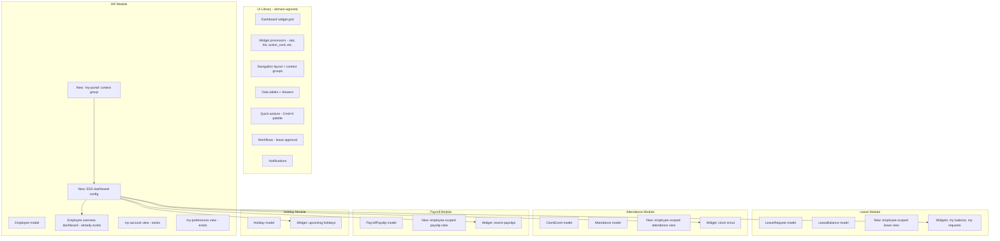

# Employee Self Service (ESS) — Design Document

> **Status**: ✅ All 4 phases implemented (2026-08-20)
> **Date**: 2026-08-20
> **Package**: `quicker-faster/ui-library` (library) + `hr-consuming-app` (consuming app)
> **Role**: Research-backed design for implementing Employee Self Service in the two-repository Laravel HR platform.

---

## 1. Research Summary — ESS UX Best Practices

### 1.1 What Employees Expect from Self-Service

Based on analysis of leading HR platforms (BambooHR, Workday, SAP SuccessFactors, Zoho People, ADP, HiBob) and UX research:

| Expectation | Description |
|---|---|
| **Single entry point** | One "My Portal" or "Home" page that aggregates everything relevant to the employee |
| **Task-oriented** | Common actions surfaced prominently — not buried in menus |
| **Minimal clicks** | Request leave in 2-3 clicks, view payslip in 1-2 clicks |
| **Mobile-first** | Employees often access ESS from phones; clock-in/out, leave requests, payslip viewing must work on small screens |
| **Personalized** | Shows only what's relevant to *this* employee — their leave balance, their schedule, their payslips |
| **Self-explanatory** | No training required; clear labels, obvious CTAs |
| **Real-time feedback** | Instant confirmation of actions (leave submitted, clock-in recorded) |
| **Notification-driven** | Proactive alerts for approvals, reminders, payslip availability |

### 1.2 Common ESS Features Across Leading Platforms

| Feature | BambooHR | Workday | Zoho People | SAP SF |
|---|---|---|---|---|
| **Personal dashboard** | ✅ "Home" | ✅ "My Workday" | ✅ "Self Service" | ✅ "Home" |
| **Leave requests** | ✅ Time Off | ✅ Absence | ✅ Leave | ✅ Time Off |
| **Leave balance** | ✅ Widget | ✅ Widget | ✅ Widget | ✅ Widget |
| **Team calendar** | ✅ Who's Out | ✅ Team Absence | ✅ Calendar | ✅ Team View |
| **Payslip viewing** | ❌ (add-on) | ✅ Payslips | ✅ Payslips | ✅ Pay Statement |
| **Clock in/out** | ✅ Time Tracking | ✅ Check-in | ✅ Attendance | ✅ Time Sheet |
| **Personal info update** | ✅ My Info | ✅ Personal Data | ✅ My Profile | ✅ Personal Info |
| **Document access** | ✅ Documents | ✅ Docs | ✅ Files | ✅ Documents |
| **Schedule viewing** | ✅ Calendar | ✅ Schedule | ✅ Shifts | ✅ Schedule |
| **Benefits enrollment** | ✅ Benefits | ✅ Benefits | ❌ | ✅ Benefits |
| **Quick actions** | ✅ + button | ✅ Actions | ✅ Quick Links | ✅ Actions |

### 1.3 Key UX Patterns Observed

**Pattern 1: The "My Portal" Dashboard**
All platforms converge on a single employee-facing dashboard with:
- **Hero/header**: Employee name, photo, department, manager
- **Stat row**: Leave balance, attendance streak, upcoming holidays, pending approvals
- **Quick-action cards**: "Request Leave", "Clock In", "View Payslip", "Update Info"
- **Recent activity feed**: Latest leave requests, recent payslips, clock events
- **Team widget**: Who's out today/this week

**Pattern 2: Task-Oriented Navigation**
- Top-level tabs are tasks, not entities: "My Time", "My Pay", "My Info", "My Team"
- Admin functions are separate (different navigation, different dashboards)
- Role-based: employees see ESS; managers see ESS + team management; HR sees admin

**Pattern 3: Mobile-First Design**
- Bottom bar navigation for key actions on mobile
- Clock-in/out as a prominent button (largest touch target)
- Leave request wizard optimized for mobile (large date pickers, minimal typing)
- Payslip PDF responsive or mobile-optimized view

**Pattern 4: Proactive Notifications**
- "Your payslip for March is ready"
- "Your leave request was approved"
- "Reminder: You have 3 pending approvals"
- "Holiday calendar updated"

---

## 2. Architecture Analysis

### 2.1 What the Library Already Provides (No Changes Needed)

The UI Library already ships all the infrastructure needed for ESS. No library modifications are required for Phase 1.

| Library Capability | How ESS Uses It | Key Files |
|---|---|---|
| **Dashboard widget grid** | ESS dashboard renders employee-scoped widgets | [`Dashboard.php`](../../src/Http/Livewire/Dashboards/Dashboard.php), [`DashboardResolver.php`](../../src/Services/Config/Dashboards/DashboardResolver.php) |
| **Widget types** | stat, list, trend, chart, action_card, quick_actions, profile_header, progress, metric, activity_log, grouped_list, onboarding | [`WidgetProcessor.php`](../../src/Services/Widgets/WidgetProcessor.php) + 12 processors |
| **Navigation layout** | `<x-qf::navigation-layout>` with context groups, sidebar, top-nav, bottom bar | [`NavigationLayout.php`](../../src/Http/Livewire/Layouts/NavigationLayout.php) |
| **Data tables** | Employee-scoped lists (my leave, my attendance, my payslips) | [`DataTable.php`](../../src/Http/Livewire/DataTables/DataTable.php) |
| **Drawers** | Inline add/edit via `openDrawer` + `qf.data-table-form` | [`Drawer.php`](../../src/Http/Livewire/Drawer.php) |
| **Quick actions** | Cmd+K palette, ⚡ button, dashboard widget — all config-driven | [`quick-actions.php`](../../src/Core/System/Config/quick-actions.php), [`ActionRegistry.php`](../../src/Services/QuickActions/ActionRegistry.php) |
| **Wizards** | Multi-step leave request, onboarding | [`Wizard.php`](../../src/Http/Livewire/Wizards/Wizard.php) |
| **Notifications** | Payslip ready, leave approved, reminders | [`NotificationService.php`](../../src/Services/Notifications/NotificationService.php) |
| **Documents** | Payslip PDFs, employee documents | [`DocumentEngine.php`](../../src/Services/Documents/DocumentEngine.php) |
| **Workflows** | Leave approval workflow | [`WorkflowEngine.php`](../../src/Services/Workflow/WorkflowEngine.php) |
| **Role-based access** | `roles` key on dashboards, `permission`/`gate` on nav items | Permission system |
| **Placeholder system** | `{{ employee_number }}` in widget conditions scopes data to current user | [`DashboardResolver.php`](../../src/Services/Config/Dashboards/DashboardResolver.php:30) |

### 2.2 What the Consuming App Modules Already Provide

| Module | ESS-Relevant Data | Existing Employee-Scoped Artifacts |
|---|---|---|
| **HR** | Employee profile, job details, manager, department | [`dashboard_employee_overview.php`](hr-consuming-app:app/Modules/Hr/Data/dashboards/dashboard_employee_overview.php) — already has tenure, hours, PTO, pending approvals, upcoming time off, recent attendance widgets with `{{ employee_number }}` placeholders |
| **Leave** | Leave types, requests, balances, approvers | [`LeaveRequest`](hr-consuming-app:app/Modules/Leave/Models/LeaveRequest.php), [`LeaveBalance`](hr-consuming-app:app/Modules/Leave/Models/LeaveBalance.php) |
| **Attendance** | Clock events, attendance records, shifts, work patterns | [`ClockEvent`](hr-consuming-app:app/Modules/Attendance/Models/ClockEvent.php), [`Attendance`](hr-consuming-app:app/Modules/Attendance/Models/Attendance.php) |
| **Payroll** | Payslips, payroll runs | [`PayrollPayslip`](hr-consuming-app:app/Modules/Payroll/Models/PayrollPayslip.php), [`PayslipController`](hr-consuming-app:app/Modules/Payroll/Http/Controllers/PayslipController.php) |
| **Holiday** | Holiday calendars, upcoming holidays | [`Holiday`](hr-consuming-app:app/Modules/Holiday/Models/Holiday.php) |

### 2.3 Existing "My" Views (Precursors to ESS)

| View | What It Does | Status |
|---|---|---|
| [`my-account.blade.php`](hr-consuming-app:app/Modules/Hr/Resources/views/my-account.blade.php) | User profile editing via `qf.data-table-form` with `recordId = auth()->user()->id` | ✅ Working |
| [`my-leave.blade.php`](hr-consuming-app:app/Modules/Hr/Resources/views/my-leave.blade.php) | Employee leave view (stub — commented out) | ⚠️ Stub |
| [`my-preferences.blade.php`](hr-consuming-app:app/Modules/Hr/Resources/views/my-preferences.blade.php) | User settings panel | ✅ Working |
| [`EmployeeProfileController.php`](hr-consuming-app:app/Modules/Hr/Http/Controllers/EmployeeProfileController.php) | Resolves employee from `user_id`, shows employee detail | ✅ Working |
| [`employee_self_service.php`](hr-consuming-app:app/Modules/Hr/Data/wizards/employee_self_service.php) | Leave request wizard with balance check + conflict detection | ✅ Working |

### 2.4 Key Architectural Constraints

1. **Modules are self-contained** — a module's migrations, models, routes, views, configs all live under `app/Modules/{Module}/` and reference nothing outside except the library and declared `depends_on` dependencies.
2. **Library is domain-independent** — no business nouns (`Employee`, `Leave`, `Payroll`) in library code. Only mechanisms (dashboards, widgets, navigation, data tables).
3. **Cross-module communication** uses event-driven patterns and service contracts.
4. **Dashboard configs** use `widgets`, `roles`, `layout` blocks with `{{ placeholder }}` substitution.
5. **Navigation** uses `context_groups` → `contexts` → items with `route`, `permission`, `gate`.

---

## 3. Design Decision — ESS as a Cross-Cutting Concern

### 3.1 Should ESS Be a Separate Module?

**No.** ESS is not a standalone business domain — it is a *role-filtered view* of existing module data. Creating a separate `app/Modules/Ess/` would:

- ❌ Violate module self-containment (ESS would depend on HR, Leave, Attendance, Payroll, Holiday — 5 modules)
- ❌ Create a "god module" that knows about every other module's models
- ❌ Duplicate navigation, dashboard, and data-table configs that already exist
- ❌ Break the operational-vs-configuration context group split

### 3.2 Recommended Approach: ESS as a "My Portal" Context Group in HR

ESS is implemented as a **new context group within the HR module** called `my-portal` (or `self-service`), plus **employee-scoped views in each domain module**.



### 3.3 Rationale

| Decision | Rationale |
|---|---|
| **ESS lives in HR module** | HR owns the `Employee` entity and the user↔employee link. The `dashboard_employee_overview` already exists with employee-scoped widgets. ESS is a natural extension. |
| **Each module contributes employee-scoped views** | Modules remain self-contained. Leave module owns `my-leave` view; Attendance owns `my-attendance`; Payroll owns `my-payslips`. No cross-module model imports. |
| **ESS dashboard aggregates via widget configs** | The ESS dashboard config references models from multiple modules (same pattern as the existing HR dashboard which references `LeaveRequest`, `Attendance`, etc.). Widget configs use `{{ employee_number }}` placeholders for user scoping. |
| **No library changes needed** | The library already supports everything: dashboards, widgets, navigation, data tables, drawers, quick actions, wizards, notifications. ESS is purely a consuming-app configuration exercise. |
| **Role-based visibility** | `roles` key on dashboard configs and `permission`/`gate` on nav items control who sees ESS vs admin views. |

---

## 4. Proposed Implementation

### 4.1 Navigation Structure

**New top-nav tab**: "My Portal" (or "Self Service") — appears for employees, not for HR admins.

**New context group** in HR module navigation config:

```php
// app/Modules/Hr/Config/navigation.php — addition
'context_groups' => [
    // ... existing Organization, people, manage ...
    'my-portal' => [
        'label' => 'My Portal',
        'icon' => 'fas fa-user',
        'order' => 10,  // First tab for employees
        'route' => null,
        'url' => 'hr/dashboard-my-portal',
        'roles' => ['employee', 'manager'],  // Not for HR admins
    ],
],
'contexts' => [
    // ... existing contexts ...
    'my-portal' => [
        [
            'key' => 'my_portal_overview',
            'label' => 'Overview',
            'icon' => 'fas fa-home',
            'route' => '/hr/dashboard-my-portal',
            'permission' => 'view_my_portal',
            'order' => 1,
        ],
        [
            'key' => 'my_leave',
            'label' => 'My Leave',
            'icon' => 'fas fa-calendar-alt',
            'route' => '/hr/my-leave',
            'permission' => 'view_my_leave',
            'order' => 2,
        ],
        [
            'key' => 'my_attendance',
            'label' => 'My Attendance',
            'icon' => 'fas fa-user-clock',
            'route' => '/attendance/my-attendance',
            'permission' => 'view_my_attendance',
            'order' => 3,
        ],
        [
            'key' => 'my_payslips',
            'label' => 'My Payslips',
            'icon' => 'fas fa-receipt',
            'route' => '/payroll/my-payslips',
            'permission' => 'view_my_payslips',
            'order' => 4,
        ],
        [
            'key' => 'my_account',
            'label' => 'My Account',
            'icon' => 'fas fa-user-circle',
            'route' => '/hr/my-account',
            'permission' => 'view_my_account',
            'order' => 5,
        ],
        [
            'key' => 'my_preferences',
            'label' => 'My Preferences',
            'icon' => 'fas fa-cog',
            'route' => '/hr/my-preferences',
            'permission' => 'view_my_preferences',
            'order' => 6,
        ],
    ],
],
```

### 4.2 ESS Dashboard (`dashboard-my-portal`)

A unified employee dashboard that aggregates widgets from multiple modules. Uses the existing `{{ employee_number }}` placeholder system for user scoping.

**Config**: `app/Modules/Hr/Data/dashboards/dashboard_my_portal.php`

**Widget layout**:

| Row | Widgets | Source Module |
|---|---|---|
| **Hero** | Profile header: photo, name, department, manager, hire date | HR |
| **Stats row** | Leave balance (days remaining), Hours this month, Pending approvals, Upcoming holidays | Leave, Attendance, Leave, Holiday |
| **Quick actions** | Request Leave, Clock In/Out, View Latest Payslip, Update My Info | Cross-module |
| **Left column** | Upcoming time off (list), Recent attendance (list) | Leave, Attendance |
| **Right column** | Recent payslips (list), Team who's out today (list) | Payroll, Leave |
| **Bottom** | Activity feed: recent leave requests, clock events, payslip notifications | Cross-module |

### 4.3 Employee-Scoped Views (One Per Module)

Each module contributes a "my-*" view that shows the employee's own data using the library's data table with a pre-applied employee filter.

#### Leave Module — `my-leave`

- **File**: `app/Modules/Leave/Resources/views/my-leave.blade.php` (new)
- **Route**: `GET /leave/my-leave` → `leave.my-leave`
- **Content**: Data table of leave requests filtered to `employee_id = {{ current_employee_id }}`
- **Actions**: "New Request" button → opens leave request wizard (reuses existing [`employee_self_service.php`](hr-consuming-app:app/Modules/Hr/Data/wizards/employee_self_service.php))
- **Layout**: `<x-qf::navigation-layout context="my-portal" moduleName="hr">`

#### Attendance Module — `my-attendance`

- **File**: `app/Modules/Attendance/Resources/views/my-attendance.blade.php` (new)
- **Route**: `GET /attendance/my-attendance` → `attendance.my-attendance`
- **Content**: Data table of attendance records + clock events filtered to employee
- **Actions**: "Clock In" / "Clock Out" button (prominent, mobile-friendly)
- **Layout**: `<x-qf::navigation-layout context="my-portal" moduleName="hr">`

#### Payroll Module — `my-payslips`

- **File**: `app/Modules/Payroll/Resources/views/my-payslips.blade.php` (new)
- **Route**: `GET /payroll/my-payslips` → `payroll.my-payslips`
- **Content**: Data table of payslips filtered to employee, with download/view links
- **Actions**: "View Latest" button, PDF download
- **Layout**: `<x-qf::navigation-layout context="my-portal" moduleName="hr">`

### 4.4 Quick Actions for ESS

New quick-action entries for the Cmd+K palette and ⚡ button:

```php
// app/Modules/Hr/Config/quick-actions.php — new file
return [
    'quick_actions' => [
        [
            'id' => 'ess.request_leave',
            'label' => 'Request Leave',
            'icon' => 'fas fa-calendar-plus',
            'action' => 'navigate',
            'module' => 'hr',
            'keywords' => ['leave', 'time off', 'vacation', 'pto', 'request'],
            'category' => 'Self Service',
            'route' => '/hr/leave-request',
            'roles' => ['employee', 'manager'],
        ],
        [
            'id' => 'ess.clock_in',
            'label' => 'Clock In',
            'icon' => 'fas fa-sign-in-alt',
            'action' => 'navigate',
            'module' => 'hr',
            'keywords' => ['clock', 'time', 'attendance', 'punch'],
            'category' => 'Self Service',
            'route' => '/attendance/my-attendance',
            'roles' => ['employee', 'manager'],
        ],
        [
            'id' => 'ess.view_payslip',
            'label' => 'View Latest Payslip',
            'icon' => 'fas fa-receipt',
            'action' => 'navigate',
            'module' => 'hr',
            'keywords' => ['pay', 'payslip', 'salary', 'stub'],
            'category' => 'Self Service',
            'route' => '/payroll/my-payslips',
            'roles' => ['employee', 'manager'],
        ],
        [
            'id' => 'ess.my_info',
            'label' => 'Update My Info',
            'icon' => 'fas fa-user-edit',
            'action' => 'navigate',
            'module' => 'hr',
            'keywords' => ['profile', 'account', 'personal', 'info'],
            'category' => 'Self Service',
            'route' => '/hr/my-account',
            'roles' => ['employee', 'manager'],
        ],
    ],
];
```

### 4.5 Role-Based Visibility

| Role | Sees | Does NOT See |
|---|---|---|
| **employee** | "My Portal" tab, ESS dashboard, my-leave, my-attendance, my-payslips, my-account, my-preferences | HR admin dashboards (Organization, People, Manage), admin data tables |
| **manager** | "My Portal" tab + team management views | HR admin configuration dashboards |
| **hr_admin** | All admin dashboards (Organization, People, Manage) + can switch to "My Portal" to preview | — |
| **super_admin** | Everything | — |

Role filtering uses the existing `roles` key on dashboard configs and `permission`/`gate` on navigation items.

### 4.6 Mobile-First Considerations

- **Bottom bar**: The library's [`BottomBar.php`](../../src/Http/Livewire/Layouts/Navs/BottomBar.php) already supports mobile bottom navigation. Configure ESS-specific bottom bar items.
- **Clock in/out**: Largest touch target on the ESS dashboard. Use `action_card` widget with prominent styling.
- **Leave request wizard**: Already mobile-optimized via the library's [`Wizard.php`](../../src/Http/Livewire/Wizards/Wizard.php) with large date pickers.
- **Payslip viewing**: PDF responsive view or inline HTML rendering via the library's document preview.

---

## 5. Implementation Phases

### Phase 1 — Foundation: ESS Dashboard + Navigation ✅ IMPLEMENTED (2026-08-20, Task AQ)

**Goal**: Employee sees a "My Portal" tab with a personalized dashboard.

| Step | What | Where | Status |
|---|---|---|---|
| 1.1 | Add `my-portal` context group to HR navigation config | `app/Modules/Hr/Config/navigation.php` | ✅ Done — order 1, `roles: ['employee', 'manager']`, 6 context items |
| 1.2 | Create `dashboard_my_portal.php` config with employee-scoped widgets | `app/Modules/Hr/Data/dashboards/dashboard_my_portal.php` | ✅ Done — 11 widgets (profile_header, 4× stat, 4× action_card, activity_log, quick_actions) |
| 1.3 | Create Blade view for ESS dashboard | `app/Modules/Hr/Resources/views/hr/my-portal.blade.php` | ✅ Done — uses `<x-qf::navigation-layout context="my-portal">` |
| 1.4 | Add route for ESS dashboard | `app/Modules/Hr/Routes/web.php` | ✅ Done — `GET /hr/my-portal` → `hr.dashboard-my-portal-overview` |
| 1.5 | Add ESS quick actions config | `app/Modules/Hr/Config/quick-actions.php` | ✅ Done — 7 employee-scoped actions under "Self Service" category |
| 1.6 | Run `php artisan ui-library:discover` and verify | — | ✅ Verified |

**What was built vs what was deferred:**
- **Built**: All 6 steps completed. The dashboard has 11 widgets (vs ~15 proposed in §4.2). The view file is at `hr/my-portal.blade.php` (vs proposed `dashboard-my-portal.blade.php`). Quick actions have 7 entries (vs 6 proposed).
- **Deferred to Phase 2**: The "Team Who's Out Today" widget, "Upcoming Time Off" list, and "Recent Payslips" list from the proposed §4.2 layout were deferred — these require cross-module data aggregation better suited for later phases.
- **Deferred to Phase 3**: Clock In/Out as an interactive toggle (currently an `action_card` link), leave request wizard wiring, payslip PDF download.
- **Deferred to Phase 4**: Notification templates, mobile bottom bar configuration, role-based testing.

**Verification**: Employee logs in, sees "My Portal" as first tab, dashboard renders with their data.

### Phase 2 — Employee-Scoped Views ✅ IMPLEMENTED (2026-08-20, Task AS)

**Goal**: Each module provides a "my-*" view for employee-specific data.

| Step | What | Where | Status |
|---|---|---|---|
| 2.1 | Create `my-leave.blade.php` — employee's leave requests data table | [`app/Modules/Leave/Resources/views/leave/my-leave.blade.php`](hr-consuming-app:app/Modules/Leave/Resources/views/leave/my-leave.blade.php) | ✅ Done |
| 2.2 | Add route for my-leave | [`app/Modules/Leave/Routes/web.php`](hr-consuming-app:app/Modules/Leave/Routes/web.php) | ✅ Done — `GET /leave/my-leave` → `leave.my-leave` |
| 2.3 | Create `my-attendance.blade.php` — employee's attendance + clock events | [`app/Modules/Attendance/Resources/views/attendance/my-attendance.blade.php`](hr-consuming-app:app/Modules/Attendance/Resources/views/attendance/my-attendance.blade.php) | ✅ Done |
| 2.4 | Add route for my-attendance | [`app/Modules/Attendance/Routes/web.php`](hr-consuming-app:app/Modules/Attendance/Routes/web.php) | ✅ Done — `GET /attendance/my-attendance` → `attendance.my-attendance` |
| 2.5 | Create `my-payslips.blade.php` — employee's payslips with download | [`app/Modules/Payroll/Resources/views/payroll/my-payslips.blade.php`](hr-consuming-app:app/Modules/Payroll/Resources/views/payroll/my-payslips.blade.php) | ✅ Done |
| 2.6 | Add route for my-payslips | [`app/Modules/Payroll/Routes/web.php`](hr-consuming-app:app/Modules/Payroll/Routes/web.php) | ✅ Done — `GET /payroll/my-payslips` → `payroll.my-payslips` |
| 2.7 | Update navigation config with links to my-* views | [`app/Modules/Hr/Config/navigation.php`](hr-consuming-app:app/Modules/Hr/Config/navigation.php) | ✅ Done — 3 sidebar items in `my-portal` context group |

**What was built vs what was deferred:**
- **Built**: All 7 steps completed. Three employee-scoped views created (Leave, Attendance, Payroll) with routes and navigation sidebar links.
- **Deferred to Phase 3**: Clock In/Out interactive toggle, leave request wizard wiring, payslip PDF download.
- **Deferred to Phase 4**: Notification templates, mobile bottom bar configuration.

**No library changes required.**

**Verification**: Employee navigates to My Leave, sees only their leave requests. Same for attendance and payslips.

### Phase 3 — Interactive Features ✅ IMPLEMENTED (2026-08-20, Task AT)

**Goal**: Clock in/out, leave request wizard, payslip download all work from ESS.

| Step | What | Where | Status |
|---|---|---|---|
| 3.1 | **Library**: Build `ClockEventRecorder` contract + `ClockInOut` Livewire component | [`src/Contracts/Attendance/ClockEventRecorder.php`](src/Contracts/Attendance/ClockEventRecorder.php), [`src/Http/Livewire/Widgets/ClockInOut.php`](src/Http/Livewire/Widgets/ClockInOut.php), [`src/Resources/views/livewire/widgets/clock-in-out.blade.php`](src/Resources/views/livewire/widgets/clock-in-out.blade.php) | ✅ Done |
| 3.2 | **Consuming**: Implement `ClockEventRecorderService` + bind in `AttendanceServiceProvider` | [`app/Modules/Attendance/Services/ClockEventRecorderService.php`](hr-consuming-app:app/Modules/Attendance/Services/ClockEventRecorderService.php), [`app/Modules/Attendance/Providers/AttendanceServiceProvider.php`](hr-consuming-app:app/Modules/Attendance/Providers/AttendanceServiceProvider.php) | ✅ Done |
| 3.3 | Replace Clock In/Out `action_card` on ESS dashboard with `qf.clock-in-out` drawer + inline component | [`dashboard_my_portal.php`](hr-consuming-app:app/Modules/Hr/Data/dashboards/dashboard_my_portal.php), [`my-portal.blade.php`](hr-consuming-app:app/Modules/Hr/Resources/views/hr/my-portal.blade.php) | ✅ Done — Clock In/Out opens `qf.clock-in-out` in drawer + renders above dashboard |
| 3.4 | Wire "Request Leave" quick action + action_card to leave request wizard | Quick actions config + wizard | ✅ Done |
| 3.5 | Add payslip PDF download/view row actions to payslip data config | Payslip data config | ✅ Done |
| 3.6 | Add "Update My Info" link from ESS dashboard to `my-account` view | Navigation or widget | ✅ Done |

**What was built vs what was deferred:**
- **Built**: All 6 steps completed. The `ClockEventRecorder` contract + `ClockInOut` Livewire component are the only library changes across all ESS phases. The consuming app implements the contract and binds it.
- **Deferred to Phase 4**: Notification templates, "Team Who's Out" widget, mobile bottom bar configuration.

**Library change required**: `ClockEventRecorder` contract + `ClockInOut` Livewire component (I1 in §10.2).

**Verification**: Employee can request leave, clock in/out, view/download payslips, update profile — all from ESS.

### Phase 4 — Notifications & Polish ✅ IMPLEMENTED (2026-08-20, Task AT)

**Goal**: Proactive notifications and UX refinements.

| Step | What | Where | Status |
|---|---|---|---|
| 4.1 | **Library**: Build `TeamWhoIsOutWidgetProcessor` + Blade view | [`src/Widgets/TeamWhoIsOutWidgetProcessor.php`](src/Widgets/TeamWhoIsOutWidgetProcessor.php), [`src/Resources/views/widgets/team_whos_out.blade.php`](src/Resources/views/widgets/team_whos_out.blade.php) | ✅ Done |
| 4.2 | **Library**: Build `CompositeDashboardResolver` for cross-module widget aggregation | [`src/Services/Config/Dashboards/CompositeDashboardResolver.php`](src/Services/Config/Dashboards/CompositeDashboardResolver.php) | ✅ Done |
| 4.3 | **Library**: Register `team_whos_out` widget type in `WidgetProcessor` | [`src/Services/Widgets/WidgetProcessor.php`](src/Services/Widgets/WidgetProcessor.php) | ✅ Done |
| 4.4 | **Consuming**: Create `EssNotificationTemplateSeeder` with 12 ESS notification templates | [`app/Modules/Hr/Database/Seeders/EssNotificationTemplateSeeder.php`](hr-consuming-app:app/Modules/Hr/Database/Seeders/EssNotificationTemplateSeeder.php) | ✅ Done — `payslip_ready`, `leave_approved`, `leave_denied`, `leave_submitted`, `upcoming_holiday`, `clock_out_reminder` + 6 additional templates |
| 4.5 | **Consuming**: Add `team_whos_out` widget to ESS dashboard | [`dashboard_my_portal.php`](hr-consuming-app:app/Modules/Hr/Data/dashboards/dashboard_my_portal.php) | ✅ Done |

**What was built vs what was deferred:**
- **Built**: All 5 steps completed. The `TeamWhoIsOutWidgetProcessor` (I3 in §10.2) and `CompositeDashboardResolver` (I4 in §10.2) are the library additions. The consuming app seeds 12 notification templates and adds the team widget to My Portal.
- **Deferred**: Mobile bottom bar configuration for ESS (I6 in §10.2, Priority 3), role-based testing (manual QA), `UserScope` widget trait (I2, Priority 1 — not needed since Phase 3's `ClockEventRecorder` contract pattern proved sufficient), notification preference seeder (I5, Priority 2).

**Library changes required**: `TeamWhoIsOutWidgetProcessor` + `CompositeDashboardResolver`.

**Verification**: Employees receive notifications. Dashboard shows team calendar and holidays. Mobile experience is smooth.

---

## 6. File Inventory

### 6.1 New Files (Consuming App)

| File | Purpose |
|---|---|
| `app/Modules/Hr/Data/dashboards/dashboard_my_portal.php` | ESS dashboard widget config |
| `app/Modules/Hr/Resources/views/dashboard-my-portal.blade.php` | ESS dashboard Blade view |
| `app/Modules/Hr/Config/quick-actions.php` | ESS quick actions for Cmd+K |
| `app/Modules/Leave/Resources/views/my-leave.blade.php` | Employee-scoped leave view |
| `app/Modules/Attendance/Resources/views/my-attendance.blade.php` | Employee-scoped attendance view |
| `app/Modules/Payroll/Resources/views/my-payslips.blade.php` | Employee-scoped payslip view |
| `app/Modules/Hr/Data/notifications.php` | ESS notification templates (if not existing) |

### 6.2 Modified Files (Consuming App)

| File | Change |
|---|---|
| `app/Modules/Hr/Config/navigation.php` | Add `my-portal` context group + context items |
| `app/Modules/Hr/Routes/web.php` | Add route for ESS dashboard |
| `app/Modules/Leave/Routes/web.php` | Add route for my-leave |
| `app/Modules/Attendance/Routes/web.php` | Add route for my-attendance |
| `app/Modules/Payroll/Routes/web.php` | Add route for my-payslips |

### 6.3 No Library Changes Required

The library already provides all infrastructure needed:
- Dashboard widget grid + 12 widget processors
- Navigation layout with context groups, sidebar, top-nav, bottom bar
- Data tables with filtering, sorting, pagination
- Drawers for inline add/edit
- Quick actions (Cmd+K palette, ⚡ button, dashboard widget)
- Wizards for multi-step flows
- Notifications with channels (in-app, email, broadcast)
- Document management (payslip PDFs)
- Workflows (leave approval)
- Role-based access control

---

## 7. Integration Points

### 7.1 User ↔ Employee Resolution

The ESS system needs to resolve the authenticated user to their employee record. The existing pattern in [`EmployeeProfileController.php`](hr-consuming-app:app/Modules/Hr/Http/Controllers/EmployeeProfileController.php:14) does this:

```php
$employee = Employee::where('user_id', Auth::id())->first();
```

This pattern should be extracted into a helper or service for reuse across all ESS views:

```php
// app/Modules/Hr/Services/EmployeeResolver.php — new
class EmployeeResolver
{
    public function resolve(): ?Employee
    {
        return Employee::where('user_id', Auth::id())->first();
    }
    
    public function resolveOrFail(): Employee
    {
        return Employee::where('user_id', Auth::id())->firstOrFail();
    }
}
```

### 7.2 Widget Placeholder System

The library's [`DashboardResolver`](../../src/Services/Config/Dashboards/DashboardResolver.php) already supports `{{ placeholder }}` substitution. ESS widgets use `{{ employee_number }}` to scope data to the current user:

```php
// Example widget condition in dashboard_my_portal.php
'conditions' => [
    ['employee.employee_number', '=', '{{ employee_number }}'],
    ['status', '=', 'Approved'],
],
```

The controller passes the resolved employee's number as a parameter:

```php
return view('hr::dashboard-my-portal', [
    'employeeNumber' => $employee->employee_number,
]);
```

### 7.3 Cross-Module Widget References

The ESS dashboard references models from multiple modules — this is the same pattern already used by the existing HR dashboard ([`dashboard.php`](hr-consuming-app:app/Modules/Hr/Data/dashboards/dashboard.php)) which references `LeaveRequest`, `Attendance`, etc. Widget configs use fully-qualified model class names:

```php
'model' => 'App\\Modules\\Leave\\Models\\LeaveRequest',
```

This is acceptable because dashboard configs are configuration, not code — they describe what to display, not how to implement it. The library's [`WidgetProcessor`](../../src/Services/Widgets/WidgetProcessor.php) resolves models generically.

### 7.4 Event-Driven Cross-Module Communication

For features like "Team Who's Out Today" that need data from multiple modules, use the existing event system:

- Leave module fires `LeaveApproved` / `LeaveDenied` events
- Attendance module fires `ClockEventRecorded` events
- Payroll module fires `PayslipGenerated` events

ESS listeners can react to these events to update activity feeds or invalidate caches.

---

## 8. Design Decisions Summary

| Decision | Choice | Rationale |
|---|---|---|
| **ESS module?** | No — cross-cutting concern in HR | ESS is a role-filtered view, not a domain |
| **Library changes?** | None for Phase 1 | All infrastructure exists |
| **Navigation** | New `my-portal` context group in HR | First tab for employees; role-gated |
| **Dashboard** | New `dashboard_my_portal.php` config | Aggregates widgets from all modules |
| **Employee views** | One `my-*` view per module | Keeps modules self-contained |
| **User scoping** | `{{ employee_number }}` placeholders | Existing library mechanism |
| **Quick actions** | New `quick-actions.php` in HR module | Config-driven, role-gated |
| **Mobile** | Bottom bar + large touch targets | Library already supports |
| **Notifications** | New templates in HR module | Proactive alerts for ESS events |

---

## 9. UX Implementation Blueprint — Mapping Best Practices to Library Features

> **Purpose**: This section maps every ESS UX requirement to specific, existing library features with exact file references, config keys, and build instructions. A developer should be able to implement directly from this blueprint.

### 9.1 Requirement A: The "My Portal" Landing Page

The unified employee dashboard is the single most important ESS surface. It aggregates data from all modules into one personalized view.

#### A.1 Hero Header — Employee Photo, Name, Department, Employee ID

| Dimension | Detail |
|---|---|
| **What the user sees** | A prominent card at the top of the dashboard showing their photo (or avatar placeholder), full name, employee number, department, and job title. Below the identity block, key fields like manager name, hire date, and location appear as label-value pairs. Action buttons for "Edit Profile" and "View Full Profile" sit at the bottom. |
| **Library feature** | [`profile_header`](src/Widgets/ProfileHeaderWidgetProcessor.php) widget processor + [`profile_header.blade.php`](src/Resources/views/widgets/profile_header.blade.php) Blade view |
| **Config/data needed** | Widget definition in `dashboard_my_portal.php`:<br/>```php<br/>[<br/>    'type' => 'profile_header',<br/>    'title' => 'Engineering Department',<br/>    'photo_url' => '{{ employee_photo_url }}',<br/>    'full_name' => '{{ employee_full_name }}',<br/>    'record_number' => '{{ employee_number }}',<br/>    'color' => 'primary',<br/>    'width' => 12,<br/>    'fields' => [<br/>        ['label' => 'Department', 'value' => '{{ employee_department }}'],<br/>        ['label' => 'Manager', 'value' => '{{ employee_manager }}'],<br/>        ['label' => 'Hire Date', 'value' => '{{ employee_hire_date }}'],<br/>        ['label' => 'Location', 'value' => '{{ employee_location }}'],<br/>    ],<br/>    'actions' => [<br/>        ['label' => 'Edit Profile', 'icon' => 'fas fa-edit', 'event' => 'navigate', 'params' => ['url' => '/hr/my-account']],<br/>    ],<br/>]<br/>``` |
| **What needs to be built** | **Consuming app**: (a) `EmployeeResolver` service at [`app/Modules/Hr/Services/EmployeeResolver.php`](hr-consuming-app:app/Modules/Hr/Services/EmployeeResolver.php) to resolve `Auth::user()` → `Employee`; (b) Controller for `dashboard-my-portal` that resolves the employee and passes placeholder values (`employee_photo_url`, `employee_full_name`, `employee_number`, `employee_department`, `employee_manager`, `employee_hire_date`, `employee_location`) to the dashboard view; (c) Photo field on Employee model if not already present (or fall back to User avatar). **Library**: None — `ProfileHeaderWidgetProcessor` already supports all needed fields. |
| **Repo** | Consuming app only |
| **ESS pattern** | Pattern 1 ("My Portal" unified dashboard) — matches BambooHR "Home" hero header, Workday "My Workday" worker profile card |

#### A.2 Stat Row — Leave Balance, Hours Worked, Pending Approvals, Upcoming Holidays

| Dimension | Detail |
|---|---|
| **What the user sees** | A horizontal row of 4 stat cards below the hero header. Each card shows an icon, a label (e.g., "Leave Balance"), a large numeric/string value (e.g., "12 days"), and uses a distinct gradient color. |
| **Library feature** | [`stat`](src/Widgets/StatWidgetProcessor.php) widget processor + [`stat.blade.php`](src/Resources/views/widgets/stat.blade.php) Blade view |
| **Config/data needed** | Four `stat` widget definitions in `dashboard_my_portal.php`:<br/>```php<br/>// Leave Balance<br/>[ 'type' => 'stat', 'title' => 'Leave Balance', 'value' => '{{ leave_balance }}', 'icon' => 'fas fa-calendar-alt', 'color' => 'success', 'width' => 3 ],<br/>// Hours This Week<br/>[ 'type' => 'stat', 'title' => 'Hours This Week', 'value' => '{{ hours_this_week }}', 'icon' => 'fas fa-clock', 'color' => 'info', 'width' => 3 ],<br/>// Pending Approvals<br/>[ 'type' => 'stat', 'title' => 'Pending Approvals', 'value' => '{{ pending_approvals }}', 'icon' => 'fas fa-hourglass-half', 'color' => 'warning', 'width' => 3 ],<br/>// Upcoming Holidays<br/>[ 'type' => 'stat', 'title' => 'Upcoming Holidays', 'value' => '{{ upcoming_holidays }}', 'icon' => 'fas fa-umbrella-beach', 'color' => 'danger', 'width' => 3 ],<br/>``` |
| **What needs to be built** | **Consuming app**: Controller must query: (a) `LeaveBalance` model filtered by `employee_id` for leave balance; (b) `Attendance` model for hours worked this week; (c) `Workflow`/`LeaveRequest` models for pending approvals count; (d) `Holiday` model for upcoming holidays count. Pass results as placeholder values to the dashboard view. **Library**: None — `StatWidgetProcessor` already handles all stat rendering. |
| **Repo** | Consuming app only |
| **ESS pattern** | Pattern 1 ("My Portal" stat row) — matches BambooHR, Workday, Zoho People stat widgets |

#### A.3 Quick-Action Cards — Request Leave, Clock In/Out, View Payslip, Update My Info, View Schedule, Download Documents

| Dimension | Detail |
|---|---|
| **What the user sees** | A grid of 6 clickable cards, each with a large icon, title, and short description. Clicking navigates to the relevant view or triggers an action. Cards use distinct gradient colors for visual scanning. |
| **Library feature** | [`action_card`](src/Widgets/ActionCardWidgetProcessor.php) widget processor + [`action_card.blade.php`](src/Resources/views/widgets/action_card.blade.php) Blade view |
| **Config/data needed** | Six `action_card` widget definitions in `dashboard_my_portal.php`:<br/>```php<br/>[ 'type' => 'action_card', 'title' => 'Request Leave', 'description' => 'Submit a new leave request', 'icon' => 'fas fa-calendar-plus', 'color' => 'success', 'width' => 4, 'actions' => [['label' => 'Request', 'event' => 'navigate', 'params' => ['url' => '/hr/leave-request']]] ],<br/>[ 'type' => 'action_card', 'title' => 'Clock In/Out', 'description' => 'Record your attendance', 'icon' => 'fas fa-sign-in-alt', 'color' => 'info', 'width' => 4, 'actions' => [['label' => 'Clock In', 'event' => 'navigate', 'params' => ['url' => '/attendance/my-attendance']]] ],<br/>[ 'type' => 'action_card', 'title' => 'View Payslip', 'description' => 'Download your latest payslip', 'icon' => 'fas fa-receipt', 'color' => 'warning', 'width' => 4, 'actions' => [['label' => 'View', 'event' => 'navigate', 'params' => ['url' => '/payroll/my-payslips']]] ],<br/>[ 'type' => 'action_card', 'title' => 'Update My Info', 'description' => 'Edit personal details', 'icon' => 'fas fa-user-edit', 'color' => 'primary', 'width' => 4, 'actions' => [['label' => 'Update', 'event' => 'navigate', 'params' => ['url' => '/hr/my-account']]] ],<br/>[ 'type' => 'action_card', 'title' => 'View Schedule', 'description' => 'Check your work schedule', 'icon' => 'fas fa-calendar-week', 'color' => 'secondary', 'width' => 4, 'actions' => [['label' => 'View', 'event' => 'navigate', 'params' => ['url' => '/attendance/my-attendance']]] ],<br/>[ 'type' => 'action_card', 'title' => 'Documents', 'description' => 'Access HR documents', 'icon' => 'fas fa-file-alt', 'color' => 'dark', 'width' => 4, 'actions' => [['label' => 'Open', 'event' => 'navigate', 'params' => ['url' => '/hr/my-documents']]] ],<br/>``` |
| **What needs to be built** | **Consuming app**: (a) Ensure all target routes exist (`/hr/leave-request`, `/attendance/my-attendance`, `/payroll/my-payslips`, `/hr/my-account`, `/hr/my-documents`); (b) Create `my-documents.blade.php` view in HR module if document access is needed. **Library**: None — `ActionCardWidgetProcessor` already supports icon, color, description, and action buttons. |
| **Repo** | Consuming app only |
| **ESS pattern** | Pattern 1 ("My Portal" quick-action cards) — matches BambooHR "+" menu, Workday "Actions" worklet |

#### A.4 Recent Activity Feed — My Leave Requests, Approvals, Clock Events

| Dimension | Detail |
|---|---|
| **What the user sees** | A scrollable list of recent events: "Leave request submitted — 2 hours ago", "Clock In recorded — Today 8:00 AM", "Payslip for March 2026 available — 1 day ago". Each entry shows a timestamp, action badge (created/updated/approved), and description. A "View All" link at the top-right navigates to a full activity log. |
| **Library feature** | [`activity_log`](src/Widgets/ActivityLogWidgetProcessor.php) widget processor + [`activity_log.blade.php`](src/Resources/views/widgets/activity_log.blade.php) Blade view |
| **Config/data needed** | Widget definition in `dashboard_my_portal.php`:<br/>```php<br/>[<br/>    'type' => 'activity_log',<br/>    'title' => 'Recent Activity',<br/>    'icon' => 'fas fa-history',<br/>    'color' => 'info',<br/>    'width' => 6,<br/>    'show_view_all' => true,<br/>    'view_all_link' => '/hr/my-activity',<br/>    'items' => [ /* populated by controller */ ],<br/>]<br/>``` |
| **What needs to be built** | **Consuming app**: Controller must aggregate recent events from: (a) `LeaveRequest` model (employee's recent requests with status); (b) `ClockEvent` model (employee's recent clock events); (c) `Notification` model (employee's recent notifications). Build an `items` array with `timestamp`, `action`, `action_label`, `causer_name`, `description` keys matching the [`activity_log.blade.php`](src/Resources/views/widgets/activity_log.blade.php) schema. **Library**: None — `ActivityLogWidgetProcessor` already supports the full item schema. |
| **Repo** | Consuming app only |
| **ESS pattern** | Pattern 1 ("My Portal" activity feed) — matches BambooHR "Recent Updates", Workday "Notifications" feed |

#### A.5 "Continue Where You Left Off" / Recent Items

| Dimension | Detail |
|---|---|
| **What the user sees** | A small section showing recently accessed pages or records: "My Payslips — viewed 3 hours ago", "Leave Request #42 — submitted yesterday". Each item is a clickable link back to that record. |
| **Library feature** | [`quick_actions`](src/Widgets/QuickActionsWidgetProcessor.php) widget processor (recent items section) + [`RankingEngine`](src/Services/QuickActions/RankingEngine.php) `getRecentRecords()` / `getRecentPages()` methods |
| **Config/data needed** | The `QuickActionsWidgetProcessor` already calls `QuickActionsService::getTopActions()` which uses `RankingEngine`. For "recent items", the controller can query [`UserActionHistory`](src/Models/UserActionHistory.php) directly or use `RankingEngine::getRecentRecords()`. Widget definition:<br/>```php<br/>[<br/>    'type' => 'quick_actions',<br/>    'title' => 'Continue Where You Left Off',<br/>    'icon' => 'fas fa-history',<br/>    'color' => 'info',<br/>    'width' => 6,<br/>    'limit' => 5,<br/>]<br/>``` |
| **What needs to be built** | **Consuming app**: Ensure [`UserActionHistory`](src/Models/UserActionHistory.php) tracking is enabled (`ui-library.quick_actions.tracking.enabled = true`). The `ActionTracker` records page views and record views automatically. **Library**: The `RankingEngine` already has `getRecentRecords()` and `getRecentPages()` methods — verify they are wired into `QuickActionsService::getPaletteData()`. If not, add a `recent_items` section to the palette data payload. |
| **Repo** | Both — library may need minor `QuickActionsService` enhancement; consuming app needs tracking enabled |
| **ESS pattern** | Pattern 1 ("My Portal" recent items) — matches Linear/Notion "recent" sections, BambooHR "Recent" list |

### 9.2 Requirement B: Task-Oriented Navigation

Employees navigate by task ("My Time", "My Pay"), not by admin entity ("Attendance Records", "Payroll Runs").

#### B.1 "My Portal" Top-Nav Tab + Sidebar Context Group

| Dimension | Detail |
|---|---|
| **What the user sees** | A "My Portal" tab in the top navigation bar (positioned first for employees). Clicking it reveals a sidebar with task-oriented items: Overview, My Leave, My Attendance, My Payslips, My Account, My Preferences. Each item has an icon and label. |
| **Library feature** | [`navigation-layout`](src/Resources/views/components/layouts/navigation-layout.blade.php) Blade component + [`NavigationManager`](src/Services/Navigation/NavigationManager.php) config-driven navigation + context groups system |
| **Config/data needed** | Addition to [`app/Modules/Hr/Config/navigation.php`](hr-consuming-app:app/Modules/Hr/Config/navigation.php):<br/>```php<br/>'context_groups' => [<br/>    'my-portal' => [<br/>        'label' => 'My Portal',<br/>        'icon' => 'fas fa-user',<br/>        'order' => 10,<br/>        'route' => null,<br/>        'url' => 'hr/dashboard-my-portal',<br/>        'roles' => ['employee', 'manager'],<br/>    ],<br/>],<br/>'contexts' => [<br/>    'my-portal' => [<br/>        ['key' => 'my_portal_overview', 'label' => 'Overview', 'icon' => 'fas fa-home', 'route' => '/hr/dashboard-my-portal', 'permission' => 'view_my_portal', 'order' => 1],<br/>        ['key' => 'my_leave', 'label' => 'My Leave', 'icon' => 'fas fa-calendar-alt', 'route' => '/hr/my-leave', 'permission' => 'view_my_leave', 'order' => 2],<br/>        ['key' => 'my_attendance', 'label' => 'My Attendance', 'icon' => 'fas fa-user-clock', 'route' => '/attendance/my-attendance', 'permission' => 'view_my_attendance', 'order' => 3],<br/>        ['key' => 'my_payslips', 'label' => 'My Payslips', 'icon' => 'fas fa-receipt', 'route' => '/payroll/my-payslips', 'permission' => 'view_my_payslips', 'order' => 4],<br/>        ['key' => 'my_account', 'label' => 'My Account', 'icon' => 'fas fa-user-circle', 'route' => '/hr/my-account', 'permission' => 'view_my_account', 'order' => 5],<br/>        ['key' => 'my_preferences', 'label' => 'My Preferences', 'icon' => 'fas fa-cog', 'route' => '/hr/my-preferences', 'permission' => 'view_my_preferences', 'order' => 6],<br/>    ],<br/>],<br/>``` |
| **What needs to be built** | **Consuming app**: (a) Add the `my-portal` context group and context items to [`navigation.php`](hr-consuming-app:app/Modules/Hr/Config/navigation.php); (b) Ensure all referenced routes exist; (c) Create the Spatie permissions (`view_my_portal`, `view_my_leave`, `view_my_attendance`, `view_my_payslips`, `view_my_account`, `view_my_preferences`) and assign to `employee` and `manager` roles. **Library**: None — context groups, role-gating, and sidebar rendering are all built-in. |
| **Repo** | Consuming app only |
| **ESS pattern** | Pattern 2 (Task-oriented navigation) — matches BambooHR tabs ("Time Off", "My Info"), Workday worklets, Zoho People "Self Service" tabs |

#### B.2 Role-Based Visibility — Employees See ESS, HR Admins See Admin

| Dimension | Detail |
|---|---|
| **What the user sees** | Employees logging in see "My Portal" as their primary tab. HR admins see the existing "Organization", "People", "Manage" tabs. Managers see both "My Portal" and team management views. |
| **Library feature** | `roles` key on context groups + `permission`/`gate` on navigation items — both resolved by [`NavigationManager`](src/Services/Navigation/NavigationManager.php) |
| **Config/data needed** | The `'roles' => ['employee', 'manager']` on the `my-portal` context group (see B.1 above) gates the entire tab. Individual context items use `permission` for finer-grained control. Existing admin context groups retain `'roles' => ['hr_admin', 'super_admin']`. |
| **What needs to be built** | **Consuming app**: (a) Ensure Spatie roles exist: `employee`, `manager`, `hr_admin`, `super_admin`; (b) Assign users to appropriate roles; (c) Verify existing admin context groups have correct `roles` keys. **Library**: None — role-based filtering is built into `NavigationManager`. |
| **Repo** | Consuming app only |
| **ESS pattern** | Pattern 2 (Task-oriented navigation) — role-based view switching is universal across all surveyed platforms |

### 9.3 Requirement C: Mobile-First Interactions

Employees frequently access ESS from phones for clock-in/out, leave requests, and payslip checks.

#### C.1 Large Touch-Friendly Buttons for Primary Actions

| Dimension | Detail |
|---|---|
| **What the user sees** | On mobile, the Clock In/Out and Request Leave buttons are full-width, large (minimum 48px height), with generous padding and clear icons. The `action_card` widgets stack vertically instead of in a grid. |
| **Library feature** | [`action_card.blade.php`](src/Resources/views/widgets/action_card.blade.php) — already uses Bootstrap grid classes (`width` parameter maps to Bootstrap columns). The [`stat.blade.php`](src/Resources/views/widgets/stat.blade.php) widget also uses responsive sizing. |
| **Config/data needed** | Widget `width` values control Bootstrap column width. On mobile (xs/sm breakpoints), Bootstrap naturally stacks columns. For extra prominence, use `width => 12` on the Clock In/Out action_card to make it full-width. |
| **What needs to be built** | **Consuming app**: (a) Set `width => 12` on the Clock In/Out `action_card` widget for full-width mobile rendering; (b) Add `btn-lg` class variant support if needed (minor Blade tweak or CSS override). **Library**: Optional — add a `size` parameter to `ActionCardWidgetProcessor` (`'size' => 'lg'`) and pass it through to the Blade view for larger buttons on mobile. |
| **Repo** | Consuming app (config); library (optional enhancement) |
| **ESS pattern** | Pattern 3 (Mobile-first design) — large touch targets match BambooHR mobile, ADP mobile app patterns |

#### C.2 Bottom Bar Navigation for Mobile

| Dimension | Detail |
|---|---|
| **What the user sees** | On mobile (screen width < 768px), a fixed bottom bar appears with 4-5 icon+label items: Home (My Portal overview), Time (My Attendance), Leave (My Leave), Pay (My Payslips), More (menu). Tapping switches the active view. |
| **Library feature** | [`BottomBar`](src/Http/Livewire/Layouts/Navs/BottomBar.php) Livewire component — already rendered in [`navigation-layout.blade.php`](src/Resources/views/components/layouts/navigation-layout.blade.php:199-200) when `layoutConfig.bottom_bar.enabled` is true |
| **Config/data needed** | The bottom bar renders items from the active context group's `contextItems`. Since the `my-portal` context group already defines 6 items (Overview, My Leave, My Attendance, My Payslips, My Account, My Preferences), the bottom bar automatically picks these up. To limit to 4-5 items, use the `maxVisibleItems` parameter or configure a separate `bottom_bar` items array in the navigation config. |
| **What needs to be built** | **Consuming app**: (a) Verify `layoutConfig.bottom_bar.enabled` is `true` in the dashboard-my-portal view's layout config; (b) Optionally configure a dedicated `bottom_bar` items array in navigation config for a curated mobile set. **Library**: None — `BottomBar` is already built and renders automatically. |
| **Repo** | Consuming app only |
| **ESS pattern** | Pattern 3 (Mobile-first design) — bottom bar matches BambooHR mobile, Zoho People mobile navigation |

#### C.3 Wizard-Optimized Leave Request Flow

| Dimension | Detail |
|---|---|
| **What the user sees** | Tapping "Request Leave" opens a multi-step wizard: Step 1 — Select leave type (large radio cards), view current balance; Step 2 — Pick dates (large touch-friendly datepickers), see conflict warnings; Step 3 — Add optional note, review summary with balance preview and approval path; Step 4 — Confirmation screen with "Submit" button. |
| **Library feature** | [`Wizard`](src/Http/Livewire/Wizards/Wizard.php) Livewire component + [`WizardForm`](src/Http/Livewire/Wizards/WizardForm.php) + [`wizard.blade.php`](src/Resources/views/livewire/wizards/wizard.blade.php) Blade view |
| **Config/data needed** | The existing wizard config at [`employee_self_service.php`](hr-consuming-app:app/Modules/Hr/Data/wizards/employee_self_service.php) already defines a 2-step leave request flow with balance check and conflict detection. The wizard is invoked via:<br/>```blade<br/><livewire:qf.wizard configKey="hr.wizards.employee_self_service" /><br/>``` |
| **What needs to be built** | **Consuming app**: (a) Port the `checkLeaveBalance` and `checkDateConflicts` custom validation methods from the old quick-hr codebase to the consuming app's Leave module; (b) Ensure the wizard config references correct model classes (`App\Modules\Leave\Models\LeaveRequest`); (c) Add a route for `/hr/leave-request` that renders the wizard view. **Library**: None — the `Wizard` component already supports multi-step flows, session persistence, review steps, and completion events. |
| **Repo** | Consuming app only |
| **ESS pattern** | Pattern 3 (Mobile-first design) — wizard-optimized flow matches BambooHR "Time Off" wizard, Workday "Absence" request flow |

#### C.4 Offline-Capable Clock In/Out (Graceful Degradation)

| Dimension | Detail |
|---|---|
| **What the user sees** | When the user taps "Clock In" and the network is unavailable, the UI shows a clear error message: "Unable to record clock-in. Please check your connection and try again." The button remains tappable (doesn't freeze). When connectivity returns, the action succeeds normally. |
| **Library feature** | Livewire's built-in offline/online detection + the `wire:offline` directive. The [`action_card.blade.php`](src/Resources/views/widgets/action_card.blade.php) button can be wrapped with `wire:offline.class="disabled"` to visually indicate unavailability. |
| **Config/data needed** | Add `wire:offline` attributes to the Clock In/Out action_card button. The consuming app's `my-attendance` view should handle the clock event creation with proper error handling and user feedback. |
| **What needs to be built** | **Consuming app**: (a) Add `wire:offline` handling to the clock-in/out UI; (b) Implement server-side validation that returns clear error messages; (c) Consider a `ClockEventService` that queues clock events when offline (future enhancement). **Library**: Optional — add a `wire:offline` aware wrapper component or document the pattern. |
| **Repo** | Consuming app (implementation); library (optional pattern documentation) |
| **ESS pattern** | Pattern 3 (Mobile-first design) — offline awareness matches ADP mobile, Zoho People offline attendance |

### 9.4 Requirement D: Proactive Notifications

Employees receive timely alerts for payslips, leave decisions, pending approvals, holidays, and reminders.

#### D.1 "Payslip Ready for Download"

| Dimension | Detail |
|---|---|
| **What the user sees** | An in-app notification appears in the bell icon dropdown: "Your payslip for March 2026 is ready. [View Payslip]". An optional email is also sent with a direct link. |
| **Library feature** | [`NotificationService`](src/Services/Notifications/NotificationService.php) — `dispatch()` method with multi-channel delivery (database, mail, broadcast) + [`NotificationTemplate`](src/Models/NotificationTemplate.php) for templated messages |
| **Config/data needed** | Notification template in [`app/Modules/Payroll/Data/notifications.php`](hr-consuming-app:app/Modules/Payroll/Data/notifications.php):<br/>```php<br/>'templates' => [<br/>    'payslip_ready' => [<br/>        'channel' => 'database',<br/>        'subject' => 'Payslip Ready',<br/>        'body' => 'Your payslip for {period} is ready for download.',<br/>    ],<br/>],<br/>```<br/>Trigger from Payroll module when a payslip is generated:<br/>```php<br/>app(NotificationService::class)->dispatch($employee, 'payslip_ready', [<br/>    'period' => 'March 2026',<br/>    'payslip_url' => '/payroll/my-payslips',<br/>]);<br/>``` |
| **What needs to be built** | **Consuming app**: (a) Create `Data/notifications.php` in the Payroll module with `payslip_ready` template; (b) Add a listener or service call in the payslip generation flow to dispatch the notification; (c) Ensure the `Employee` model implements `Notifiable` contract. **Library**: None — `NotificationService` already supports templated multi-channel dispatch. |
| **Repo** | Consuming app only |
| **ESS pattern** | Pattern 4 (Proactive notifications) — matches BambooHR email alerts, Workday "Alerts", Zoho People notifications |

#### D.2 "Leave Request Approved/Denied"

| Dimension | Detail |
|---|---|
| **What the user sees** | When a manager approves or denies a leave request, the employee receives an in-app notification: "Your leave request (Mar 15-18) was approved by Jane Smith." The notification includes a link to view the request details. |
| **Library feature** | [`NotificationService`](src/Services/Notifications/NotificationService.php) + [`WorkflowEngine`](src/Services/Workflow/WorkflowEngine.php) events (`WorkflowApproved`, `WorkflowRejected`) |
| **Config/data needed** | Notification templates in [`app/Modules/Leave/Data/notifications.php`](hr-consuming-app:app/Modules/Leave/Data/notifications.php):<br/>```php<br/>'templates' => [<br/>    'leave_approved' => [<br/>        'channel' => 'database',<br/>        'subject' => 'Leave Approved',<br/>        'body' => 'Your leave request ({start_date} to {end_date}) was approved by {approver_name}.',<br/>    ],<br/>    'leave_denied' => [<br/>        'channel' => 'database',<br/>        'subject' => 'Leave Denied',<br/>        'body' => 'Your leave request ({start_date} to {end_date}) was denied by {approver_name}. Reason: {reason}',<br/>    ],<br/>],<br/>``` |
| **What needs to be built** | **Consuming app**: (a) Create `Data/notifications.php` in the Leave module; (b) Create an event listener at [`app/Modules/Leave/Listeners/LeaveWorkflowListener.php`](hr-consuming-app:app/Modules/Leave/Listeners/LeaveWorkflowListener.php) that listens for `WorkflowApproved` and `WorkflowRejected` events, checks if the subject is a `LeaveRequest`, and dispatches the appropriate notification to the employee. **Library**: None — the event system and notification service are already built. |
| **Repo** | Consuming app only |
| **ESS pattern** | Pattern 4 (Proactive notifications) — matches all surveyed platforms' leave status notifications |

#### D.3 "Pending Approval: Manager Needs to Approve Your Request"

| Dimension | Detail |
|---|---|
| **What the user sees** | After submitting a leave request, the employee sees a notification: "Your leave request is pending approval from Jane Smith." The stat widget "Pending Approvals" on the dashboard also increments. |
| **Library feature** | [`NotificationService`](src/Services/Notifications/NotificationService.php) + `WorkflowSubmitted` event |
| **Config/data needed** | Template in Leave module's `notifications.php`:<br/>```php<br/>'leave_submitted' => [<br/>    'channel' => 'database',<br/>    'subject' => 'Leave Request Submitted',<br/>    'body' => 'Your leave request ({start_date} to {end_date}) is pending approval from {approver_name}.',<br/>],<br/>``` |
| **What needs to be built** | **Consuming app**: Add a listener for `WorkflowSubmitted` that dispatches the `leave_submitted` notification. Same listener file as D.2. |
| **Repo** | Consuming app only |
| **ESS pattern** | Pattern 4 (Proactive notifications) — matches Workday "Awaiting Your Action" notifications |

#### D.4 "Upcoming Holiday: [Name] on [Date]"

| Dimension | Detail |
|---|---|
| **What the user sees** | A notification appears 3-5 days before a holiday: "Upcoming holiday: Independence Day on Oct 1." The dashboard stat widget "Upcoming Holidays" also shows the count. |
| **Library feature** | [`NotificationService`](src/Services/Notifications/NotificationService.php) + scheduled command pattern (see [`GenerateScheduledReports`](src/Console/Commands/GenerateScheduledReports.php) for the scheduled job pattern) |
| **Config/data needed** | Template in Holiday module's `Data/notifications.php`:<br/>```php<br/>'upcoming_holiday' => [<br/>    'channel' => 'database',<br/>    'subject' => 'Upcoming Holiday',<br/>    'body' => 'Upcoming holiday: {holiday_name} on {holiday_date}.',<br/>],<br/>``` |
| **What needs to be built** | **Consuming app**: (a) Create a scheduled command or job that runs daily, queries holidays within the next 3-5 days, and dispatches `upcoming_holiday` notifications to all employees; (b) Create `Data/notifications.php` in the Holiday module. **Library**: None — the notification dispatch and scheduled command infrastructure already exist. |
| **Repo** | Consuming app only |
| **ESS pattern** | Pattern 4 (Proactive notifications) — matches BambooHR "Holiday Calendar" notifications, Zoho People holiday alerts |

#### D.5 "Clock-Out Reminder" (If Still Clocked In After Hours)

| Dimension | Detail |
|---|---|
| **What the user sees** | If an employee is still clocked in after their scheduled end time (or after a configurable threshold like 6 PM), they receive a notification: "Reminder: You are still clocked in. Don't forget to clock out." |
| **Library feature** | [`NotificationService`](src/Services/Notifications/NotificationService.php) + scheduled command pattern |
| **Config/data needed** | Template in Attendance module's `Data/notifications.php`:<br/>```php<br/>'clock_out_reminder' => [<br/>    'channel' => 'database',<br/>    'subject' => 'Clock-Out Reminder',<br/>    'body' => 'Reminder: You are still clocked in since {clock_in_time}. Please clock out when you finish.',<br/>],<br/>``` |
| **What needs to be built** | **Consuming app**: (a) Create a scheduled command that runs at a configurable time (e.g., 6 PM), queries employees with an open clock event (no `clock_out` time), and dispatches `clock_out_reminder` notifications; (b) Create `Data/notifications.php` in the Attendance module. **Library**: None. |
| **Repo** | Consuming app only |
| **ESS pattern** | Pattern 4 (Proactive notifications) — matches ADP "Missed Punch" alerts, Zoho People clock-out reminders |

### 9.5 Requirement E: Personal Data Views

Each module provides an employee-scoped view showing only that employee's data.

#### E.1 My Profile — Read-Only Employee Detail

| Dimension | Detail |
|---|---|
| **What the user sees** | A read-only view of the employee's full profile: identity section (name, employee number, photo), employment details (department, job title, manager, hire date), contact information (email, phone, address), and system access info. Related records (position history, documents) appear in expandable sections. |
| **Library feature** | [`DataTableDetail`](src/Http/Livewire/DataTables/DataTableDetail.php) Livewire component — renders field groups from the data config generically. Invoked via `qf.data-table-detail` with `recordId` and `configKey`. |
| **Config/data needed** | The existing [`employee.php`](hr-consuming-app:app/Modules/Hr/Data/employee.php) data config already defines field groups: `identity`, `employment_details`, `contact`, `system_access`. The `my-profile` view renders:<br/>```blade<br/>@livewire('qf.data-table-detail', ['inline' => false, 'recordId' => $employee->id, 'configKey' => 'hr.employee'])<br/>```<br/>**Important**: Remove `'detailComponent' => 'qf.employee-detail'` from [`employee.php`](hr-consuming-app:app/Modules/Hr/Data/employee.php) line 167 — this references a non-existent component. Fall back to the generic `DataTableDetail`. |
| **What needs to be built** | **Consuming app**: (a) Remove the `detailComponent` key from `employee.php`; (b) Create `my-profile.blade.php` view in HR module using the pattern from legacy [`my-profile.blade.php`](quick-hr:app/Modules/Hr/Resources/views/my-profile.blade.php) but with `qf.data-table-detail` instead of `qf.employee-detail`; (c) Add route `GET /hr/my-profile`. **Library**: None — `DataTableDetail` already handles field group rendering generically. |
| **Repo** | Consuming app only |
| **ESS pattern** | Pattern 1 (My Portal) + Pattern 2 (Task-oriented) — matches BambooHR "My Info", Workday "Personal Data" |

#### E.2 My Attendance History — Filterable by Date Range

| Dimension | Detail |
|---|---|
| **What the user sees** | A data table showing all attendance records for the employee. Columns: Date, Clock In, Clock Out, Hours Worked, Status. Filterable by date range. Sortable by date. A "Clock In" / "Clock Out" button is prominently displayed above the table. |
| **Library feature** | [`DataTable`](src/Http/Livewire/DataTables/DataTable.php) Livewire component with pre-applied employee filter + [`FilterPanel`](src/Http/Livewire/FilterPanel.php) for date range filtering |
| **Config/data needed** | The view passes `recordId` scoped to the employee and uses the `attendance.attendance` data config. The controller pre-filters by `employee_id`:<br/>```blade<br/><livewire:qf.data-table configKey="attendance.attendance" :filters="[['employee_id', '=', $employee->id]]" /><br/>``` |
| **What needs to be built** | **Consuming app**: (a) Create [`my-attendance.blade.php`](hr-consuming-app:app/Modules/Attendance/Resources/views/my-attendance.blade.php) view; (b) Add route `GET /attendance/my-attendance`; (c) Add Clock In/Out button above the data table (custom Livewire component or inline action). **Library**: None — `DataTable` already supports pre-applied filters. |
| **Repo** | Consuming app only |
| **ESS pattern** | Pattern 2 (Task-oriented "My Time") — matches BambooHR "Time Tracking", ADP "My Time" |

#### E.3 My Leave History — Filterable by Status, Date

| Dimension | Detail |
|---|---|
| **What the user sees** | A data table of all leave requests: Leave Type, Start Date, End Date, Days, Status (with color-coded badge), Approver. Filterable by status (Pending, Approved, Denied) and date range. A "New Request" button opens the leave wizard. |
| **Library feature** | [`DataTable`](src/Http/Livewire/DataTables/DataTable.php) + [`approval-status-badge`](src/Resources/views/components/status/approval-status-badge.blade.php) for status rendering |
| **Config/data needed** | View uses `leave.leave_request` data config with employee filter:<br/>```blade<br/><livewire:qf.data-table configKey="leave.leave_request" :filters="[['employee_id', '=', $employee->id]]" /><br/>``` |
| **What needs to be built** | **Consuming app**: (a) Create [`my-leave.blade.php`](hr-consuming-app:app/Modules/Leave/Resources/views/my-leave.blade.php) view; (b) Add route `GET /leave/my-leave`; (c) Add "New Request" button that navigates to the leave wizard. **Library**: None. |
| **Repo** | Consuming app only |
| **ESS pattern** | Pattern 2 (Task-oriented "My Time") — matches BambooHR "Time Off" history, Workday "Absence" history |

#### E.4 My Payslips — List with Download

| Dimension | Detail |
|---|---|
| **What the user sees** | A data table of payslips: Period, Pay Date, Gross Pay, Net Pay, Status. Each row has a "View" button that opens the payslip PDF in the document previewer, and a "Download" button for PDF download. |
| **Library feature** | [`DataTable`](src/Http/Livewire/DataTables/DataTable.php) + [`DocumentPreview`](src/Resources/views/livewire/documents/document-preview.blade.php) for PDF viewing + [`DocumentController`](src/Http/Controllers/Documents/DocumentController.php) for download |
| **Config/data needed** | View uses `payroll.payroll_payslip` data config with employee filter. The payslip model should implement `Documentable` to enable PDF preview/download via the library's document engine. |
| **What needs to be built** | **Consuming app**: (a) Create [`my-payslips.blade.php`](hr-consuming-app:app/Modules/Payroll/Resources/views/my-payslips.blade.php) view; (b) Add route `GET /payroll/my-payslips`; (c) Ensure `PayrollPayslip` model implements `Documentable` and generates PDFs; (d) Add "View"/"Download" row actions to the payslip data config. **Library**: None. |
| **Repo** | Consuming app only |
| **ESS pattern** | Pattern 2 (Task-oriented "My Pay") — matches Workday "Pay Statements", Zoho People "Payslips" |

#### E.5 My Documents — HR Documents Assigned to Me

| Dimension | Detail |
|---|---|
| **What the user sees** | A data table of documents assigned to or uploaded for the employee: Document Name, Type, Upload Date, Expiry Date (if applicable). Each row has "View" and "Download" actions. |
| **Library feature** | [`DataTable`](src/Http/Livewire/DataTables/DataTable.php) + [`DocumentEngine`](src/Services/Documents/DocumentEngine.php) for preview/download |
| **Config/data needed** | View uses `hr.document` data config filtered by `documentable_type = 'employee'` and `documentable_id = $employee->id`. The library's `documents` table uses polymorphic `documentable_type`/`documentable_id` columns. |
| **What needs to be built** | **Consuming app**: (a) Create [`my-documents.blade.php`](hr-consuming-app:app/Modules/Hr/Resources/views/my-documents.blade.php) view; (b) Add route `GET /hr/my-documents`; (c) Ensure documents are associated with employees via the polymorphic relation. **Library**: None. |
| **Repo** | Consuming app only |
| **ESS pattern** | Pattern 2 (Task-oriented "My Info") — matches BambooHR "Documents", Workday "Document Records" |

### 9.6 Requirement F: Quick Actions Integration

Employee-scoped actions accessible via keyboard shortcut, top-nav button, and dashboard widget.

#### F.1 Cmd+K Palette — Employee-Scoped Actions

| Dimension | Detail |
|---|---|
| **What the user sees** | Pressing Cmd+K (Mac) / Ctrl+K (Windows) opens a modal overlay with a search input. Typing filters a list of available actions. Employee-scoped actions appear under a "Self Service" category: Request Leave, Clock In, View Payslip, Update My Info. Results are ranked by personal usage frequency. |
| **Library feature** | [`QuickActionsPanel`](src/Http/Livewire/QuickActions/QuickActionsPanel.php) Livewire component + [`quick-actions-panel.blade.php`](src/Resources/views/livewire/quick-actions/quick-actions-panel.blade.php) + [`quick-actions.js`](public/assets/js/quick-actions.js) + [`ActionRegistry`](src/Services/QuickActions/ActionRegistry.php) + [`RankingEngine`](src/Services/QuickActions/RankingEngine.php) |
| **Config/data needed** | New file [`app/Modules/Hr/Config/quick-actions.php`](hr-consuming-app:app/Modules/Hr/Config/quick-actions.php):<br/>```php<br/>return [<br/>    'quick_actions' => [<br/>        ['key' => 'ess.request_leave', 'label' => 'Request Leave', 'icon' => 'fas fa-calendar-plus', 'route' => 'hr.leave-request', 'keywords' => ['leave', 'time off', 'vacation', 'pto'], 'category' => 'Self Service', 'roles' => ['employee', 'manager']],<br/>        ['key' => 'ess.clock_in', 'label' => 'Clock In', 'icon' => 'fas fa-sign-in-alt', 'route' => 'attendance.my-attendance', 'keywords' => ['clock', 'time', 'attendance', 'punch'], 'category' => 'Self Service', 'roles' => ['employee', 'manager']],<br/>        ['key' => 'ess.view_payslip', 'label' => 'View Latest Payslip', 'icon' => 'fas fa-receipt', 'route' => 'payroll.my-payslips', 'keywords' => ['pay', 'payslip', 'salary', 'stub'], 'category' => 'Self Service', 'roles' => ['employee', 'manager']],<br/>        ['key' => 'ess.my_info', 'label' => 'Update My Info', 'icon' => 'fas fa-user-edit', 'route' => 'hr.my-account', 'keywords' => ['profile', 'account', 'personal', 'info'], 'category' => 'Self Service', 'roles' => ['employee', 'manager']],<br/>        ['key' => 'ess.my_schedule', 'label' => 'View My Schedule', 'icon' => 'fas fa-calendar-week', 'route' => 'attendance.my-attendance', 'keywords' => ['schedule', 'shift', 'roster'], 'category' => 'Self Service', 'roles' => ['employee', 'manager']],<br/>        ['key' => 'ess.my_documents', 'label' => 'My Documents', 'icon' => 'fas fa-file-alt', 'route' => 'hr.my-documents', 'keywords' => ['documents', 'files', 'downloads'], 'category' => 'Self Service', 'roles' => ['employee', 'manager']],<br/>    ],<br/>];<br/>``` |
| **What needs to be built** | **Consuming app**: (a) Create [`quick-actions.php`](hr-consuming-app:app/Modules/Hr/Config/quick-actions.php) with the 6 ESS actions above; (b) Ensure all referenced route names exist; (c) Run `php artisan ui-library:discover` to register. **Library**: None — the `ActionRegistry` auto-discovers `Config/quick-actions.php` files from all modules. |
| **Repo** | Consuming app only |
| **ESS pattern** | Pattern 1 (My Portal quick actions) + Pattern 2 (Task-oriented) — matches Linear/Notion Cmd+K, VS Code command palette |

#### F.2 ⚡ Top-Nav Button — Top Employee Actions

| Dimension | Detail |
|---|---|
| **What the user sees** | A ⚡ (bolt) icon in the top navigation bar. Clicking opens a dropdown with the top 5-8 most frequent employee actions, ranked by personal usage. A "More actions…" link at the bottom opens the full Cmd+K palette. |
| **Library feature** | [`TopNav`](src/Http/Livewire/Layouts/Navs/TopNav.php) `loadQuickActions()` method + ⚡ button in [`top-nav.blade.php`](src/Resources/views/livewire/navs/top-nav.blade.php) + [`RankingEngine`](src/Services/QuickActions/RankingEngine.php) for personalized ranking |
| **Config/data needed** | The ⚡ button is already built and enabled via `config('ui-library.quick_actions.top_nav_button.enabled', true)`. It automatically pulls actions from all modules' `quick-actions.php` configs and ranks them by the user's history. No additional config needed — the ESS actions registered in F.1 automatically appear. |
| **What needs to be built** | **Nothing** — the ⚡ button is already implemented in the library (Phase 3 of quick-actions feature). Once ESS actions are registered (F.1), they automatically appear in the dropdown. |
| **Repo** | Neither — already built |
| **ESS pattern** | Pattern 1 (My Portal quick actions) — matches Google Workspace "+" button, BambooHR "+" quick menu |

#### F.3 Dashboard quick_actions Widget on My Portal

| Dimension | Detail |
|---|---|
| **What the user sees** | A "Frequent Actions" widget on the My Portal dashboard showing the top 5 employee actions. Each row has an icon, label, and optional star toggle for pinning. Clicking executes the action. |
| **Library feature** | [`QuickActionsWidgetProcessor`](src/Widgets/QuickActionsWidgetProcessor.php) + [`quick_actions.blade.php`](src/Resources/views/widgets/quick_actions.blade.php) Blade view |
| **Config/data needed** | Widget definition in `dashboard_my_portal.php`:<br/>```php<br/>[<br/>    'type' => 'quick_actions',<br/>    'title' => 'Quick Actions',<br/>    'icon' => 'fas fa-bolt',<br/>    'color' => 'warning',<br/>    'width' => 6,<br/>    'limit' => 5,<br/>]<br/>``` |
| **What needs to be built** | **Nothing** — the `QuickActionsWidgetProcessor` is already registered in [`WidgetProcessor::$map`](src/Services/Widgets/WidgetProcessor.php:33). Adding the widget config above to the dashboard is sufficient. |
| **Repo** | Neither — already built |
| **ESS pattern** | Pattern 1 (My Portal dashboard widget) — matches BambooHR "Quick Links" widget, Workday "Favorites" worklet |

---

## 10. Infrastructure Gaps & Recommended Improvements

### 10.1 What the Library CAN'T Do Today That ESS Needs

| # | Gap | Impact on ESS | Severity |
|---|---|---|---|
| **G1** | **No `UserScope` auto-filtering on widgets** | Every ESS widget controller must manually resolve `Employee::where('user_id', Auth::id())->first()` and pass `employee_id` as a filter. The `{{ employee_number }}` placeholder system requires manual resolution in every controller. This is repetitive boilerplate across 5+ views. | Medium |
| **G2** | **No cross-module dashboard aggregation** | The ESS dashboard references models from 5 modules (HR, Leave, Attendance, Payroll, Holiday). Each widget's data must be manually queried in the controller and passed as placeholders. There is no `CompositeDashboardResolver` that auto-aggregates widgets from multiple module configs. | Medium |
| **G3** | **No "My [Entity]" data-table pattern** | Every employee-scoped view (`my-leave`, `my-attendance`, `my-payslips`, `my-documents`) follows the identical pattern: resolve employee → pass `employee_id` filter to `DataTable`. There is no library-level `UserScopedDataTable` component or trait that auto-applies the user scope. | Low |
| **G4** | **No mobile-optimized widget variants** | Widgets render the same on mobile and desktop. On small screens, the `action_card` grid (3-column) stacks but doesn't optimize touch target sizes. The `stat` widget is fine, but `list` and `activity_log` could benefit from compact mobile variants. | Low |
| **G5** | **No built-in "Team Who's Out" widget** | The ESS dashboard design includes a "Team Who's Out Today" widget showing colleagues on leave. This requires a custom widget that queries the Leave module for approved leave requests overlapping today, filtered by the employee's department/team. No existing widget type handles this. | Medium |
| **G6** | **No `ClockInOut` widget or Livewire component** | Clock in/out is the most important ESS action but requires a custom Livewire component that: shows current clock status, toggles clock in/out, records the event, and provides real-time feedback. The `action_card` widget can link to the attendance page but cannot handle the toggle interaction inline. | High |
| **G7** | **No "My Portal" first-class navigation concept** | The `my-portal` context group is configured manually. There is no library-level concept of a "user-centric dashboard" that auto-scopes to the authenticated user, auto-resolves their employee record, and auto-generates the navigation structure. | Low |
| **G8** | **No notification preference defaults for ESS** | The `NotificationPreference` model exists but there is no seeding mechanism for ESS-specific notification types (`payslip_ready`, `leave_approved`, `clock_out_reminder`). Each employee must manually opt in, or the consuming app must seed defaults. | Low |
| **G9** | **`detailComponent` config key is undocumented** | The library supports `'detailComponent' => 'qf.custom-detail'` in data configs to override the default detail component, but this is not documented. Only `employee.php` and `payroll_run.php` use it, and the referenced `qf.employee-detail` component is missing. | Low |
| **G10** | **No offline/queue support for clock events** | If an employee's phone loses connectivity, the clock in/out action fails silently. There is no queuing mechanism or optimistic UI pattern for attendance actions. | Medium |

### 10.2 Recommended Library Improvements

#### Priority 1 — Critical (Block ESS Core Functionality)

| # | Improvement | New Files / Changes | Rationale |
|---|---|---|---|
| **I1** | **`ClockInOut` Livewire component** | **New**: [`src/Http/Livewire/Widgets/ClockInOut.php`](src/Http/Livewire/Widgets/ClockInOut.php) — A standalone Livewire component that: (a) accepts `employee_id` as a parameter; (b) queries the latest `ClockEvent` for the employee today; (c) shows current status ("Clocked In since 8:00 AM" or "Not clocked in"); (d) provides a large toggle button; (e) dispatches `clockIn()` / `clockOut()` methods that create `ClockEvent` records; (f) emits `clockEventRecorded` event for activity logging. **New**: [`src/Resources/views/livewire/widgets/clock-in-out.blade.php`](src/Resources/views/livewire/widgets/clock-in-out.blade.php) — Blade view with prominent button, status text, and last-event timestamp. | Clock in/out is the #1 ESS action. An `action_card` link is insufficient — employees expect a toggle button with real-time status. This component would be reusable beyond ESS (kiosk mode, admin attendance management). |
| **I2** | **`UserScope` widget trait** | **New**: [`src/Concerns/Widgets/UserScopedWidget.php`](src/Concerns/Widgets/UserScopedWidget.php) — A trait that widget processors can use to auto-resolve the authenticated user's ID and apply it as a filter. Provides `resolveUserId(): int`, `scopeToUser(Builder $query): Builder`, and `resolvePlaceholder(string $key): string` methods. **Modify**: [`WidgetProcessor.php`](src/Services/Widgets/WidgetProcessor.php) — add support for a `user_scoped => true` flag in widget definitions that auto-injects the user scope. | Eliminates the repetitive `Employee::where('user_id', Auth::id())->first()` pattern across 5+ controllers. Makes ESS widget configs declarative instead of imperative. |

#### Priority 2 — High (Significant DX Improvement)

| # | Improvement | New Files / Changes | Rationale |
|---|---|---|---|
| **I3** | **`TeamWhoIsOut` widget processor** | **New**: [`src/Widgets/TeamWhoIsOutWidgetProcessor.php`](src/Widgets/TeamWhoIsOutWidgetProcessor.php) — Queries approved leave requests overlapping today, filtered by the employee's department/team. Returns a list of colleagues with their leave type and dates. **New**: [`src/Resources/views/widgets/team_who_is_out.blade.php`](src/Resources/views/widgets/team_who_is_out.blade.php) — Renders a compact list with avatars, names, and leave dates. **Modify**: [`WidgetProcessor.php`](src/Services/Widgets/WidgetProcessor.php) — add `'team_who_is_out' => TeamWhoIsOutWidgetProcessor::class` to `$map`. | "Who's Out Today" is a universal ESS widget (BambooHR, Workday, Zoho People all have it). It requires cross-module data (Leave + HR/Organization) and is complex enough to warrant a library widget. |
| **I4** | **`CompositeDashboardResolver`** | **New**: [`src/Services/Config/Dashboards/CompositeDashboardResolver.php`](src/Services/Config/Dashboards/CompositeDashboardResolver.php) — Accepts multiple dashboard config keys, merges their widget definitions, resolves placeholders across all modules, and returns a unified widget array. **Modify**: [`DashboardResolver.php`](src/Services/Config/Dashboards/DashboardResolver.php) — add a `resolveComposite(array $configKeys, array $placeholders): array` method. | The ESS dashboard aggregates widgets from 5 modules. Currently, the controller must manually query data from all 5 modules. A composite resolver would let the dashboard config declare: `'extends' => ['hr.employee_overview', 'leave.my_leave', 'attendance.my_attendance']` and auto-merge. |
| **I5** | **Notification preference seeder for ESS types** | **New**: [`Database/Seeders/EssNotificationDefaultsSeeder.php`](Database/Seeders/EssNotificationDefaultsSeeder.php) — Seeds `NotificationPreference` records for all ESS notification types with sensible defaults (database=enabled, mail=enabled for payslip_ready and leave_approved; database=enabled, mail=disabled for clock_out_reminder). | Without defaults, employees must manually opt into each notification type. A seeder ensures ESS notifications work out of the box. |

#### Priority 3 — Medium (Polish & Completeness)

| # | Improvement | New Files / Changes | Rationale |
|---|---|---|---|
| **I6** | **Mobile-optimized widget variants** | **Modify**: [`action_card.blade.php`](src/Resources/views/widgets/action_card.blade.php), [`stat.blade.php`](src/Resources/views/widgets/stat.blade.php), [`list.blade.php`](src/Resources/views/widgets/list.blade.php) — add responsive CSS classes for mobile breakpoints (larger touch targets, stacked layouts, simplified content). **New**: Optional `mobile_variant` parameter in widget definitions. | ESS is heavily used on mobile. Widgets should render optimally on small screens without consuming-app overrides. |
| **I7** | **`UserScopedDataTable` trait or component** | **New**: [`src/Concerns/DataTables/UserScoped.php`](src/Concerns/DataTables/UserScoped.php) — A trait for controllers that auto-resolves the authenticated user's employee record and applies the `employee_id` filter to the data table. | Reduces boilerplate in `my-leave`, `my-attendance`, `my-payslips`, `my-documents` controllers. |
| **I8** | **Document `detailComponent` extension point** | **Modify**: Add a section to the data config documentation explaining the `detailComponent` key, its purpose, and how to create custom detail components. **Modify**: Remove or fix the `'detailComponent' => 'qf.employee-detail'` reference in the consuming app's `employee.php`. | Prevents future confusion about this undocumented but powerful extension point. |
| **I9** | **Offline-aware action wrapper** | **New**: [`src/Resources/views/components/offline-aware-action.blade.php`](src/Resources/views/components/offline-aware-action.blade.php) — A Blade component that wraps action buttons with `wire:offline` handling, showing a disabled state and tooltip when offline. | Provides graceful degradation for clock in/out and other critical actions on flaky mobile connections. |

### 10.3 Priority Order for Library Improvements

```
Priority 1 (Critical — do before ESS Phase 3):
  I1: ClockInOut Livewire component
  I2: UserScope widget trait

Priority 2 (High — do before ESS Phase 4):
  I3: TeamWhoIsOut widget processor
  I4: CompositeDashboardResolver
  I5: Notification preference seeder

Priority 3 (Medium — can be post-launch):
  I6: Mobile-optimized widget variants
  I7: UserScopedDataTable trait
  I8: Document detailComponent extension point
  I9: Offline-aware action wrapper
```

### 10.4 Gaps That Should Remain in the Consuming App

Some gaps are intentionally NOT library improvements because they are domain-specific:

| Gap | Why It Stays in Consuming App |
|---|---|
| **Leave balance calculation** | Business logic varies by organization (accrual rules, carry-over policies, probation periods). The library should not encode leave policies. |
| **Payslip PDF generation** | PDF templates are organization-specific (logo, layout, currency format, tax fields). The library provides `DocumentEngine` for storage/retrieval; generation is the consuming app's responsibility. |
| **Holiday calendar logic** | Holiday dates, regions, and calendars are domain data, not library mechanisms. |
| **Approval chain resolution** | Who approves whose leave is organization-specific. The library provides `WorkflowEngine` with configurable steps; the consuming app defines the approver resolution logic. |
| **Employee ↔ User mapping** | The `user_id` on `Employee` is a consuming-app schema decision. The library is domain-independent and does not know about `Employee` models. |
| **Work schedule / shift assignment** | Shift patterns, work schedules, and roster assignment are domain-specific. The library provides data tables for viewing; the consuming app owns the business logic. |

---

## Appendix A — Comparison with Leading Platforms

| Feature | Our Approach | BambooHR | Workday |
|---|---|---|---|
| **Dashboard** | `dashboard_my_portal.php` config with stat/list/action_card widgets | "Home" with widgets | "My Workday" with worklets |
| **Leave request** | Wizard (`employee_self_service.php`) with balance check | Time Off wizard | Absence request flow |
| **Clock in/out** | `action_card` widget + dedicated my-attendance view | Time Tracking | Check-in |
| **Payslips** | my-payslips data table + PDF download | Add-on | Pay Statements |
| **Quick actions** | Cmd+K palette + ⚡ button + dashboard widget | + button | Actions menu |
| **Mobile** | Bottom bar + responsive widgets | Mobile app | Mobile app |
| **Notifications** | In-app + email via library notification system | Email + in-app | Alerts + notifications |

---

## Appendix B — Analysis of Legacy my-*.blade.php Patterns

> **Source**: `/Users/mac/Projects/LaravelProjects/quick-hr/app/Modules/Hr/Resources/views/`
> **Date of analysis**: 2026-08-20
> **Purpose**: Inventory and assess old ESS precursor views for patterns reusable in the new implementation.

### B.1 Inventory of Legacy my-* Views

Four `my-*` Blade views exist in the old quick-hr project, plus one closely related `employee-self-service` view:

| # | File | Purpose | Status |
|---|---|---|---|
| 1 | [`my-profile.blade.php`](quick-hr:app/Modules/Hr/Resources/views/my-profile.blade.php) | Employee profile viewing — resolves employee from `user_id`, renders employee detail | ✅ Working |
| 2 | [`my-leave.blade.php`](quick-hr:app/Modules/Hr/Resources/views/my-leave.blade.php) | Employee leave self-service view | ⚠️ Stub (content commented out) |
| 3 | [`my-preferences.blade.php`](quick-hr:app/Modules/Hr/Resources/views/my-preferences.blade.php) | User notification/settings preferences panel | ✅ Working |
| 4 | [`my-account.blade.php`](quick-hr:app/Modules/Hr/Resources/views/my-account.blade.php) | User profile editing via data-table-form | ✅ Working |
| 5 | [`employee-self-service.blade.php`](quick-hr:app/Modules/Hr/Resources/views/employee-self-service.blade.php) | Leave request wizard (multi-step) | ✅ Working |

All five views also exist identically in the consuming app at [`hr-consuming-app/app/Modules/Hr/Resources/views/`](hr-consuming-app:app/Modules/Hr/Resources/views/).

### B.2 Component Inventory — What Each View Uses

#### B.2.1 my-profile.blade.php

```blade
@php
    $employee = App\Modules\Hr\Models\Employee::where('user_id', Auth::id())->first();
    if (!$employee) { abort(403, 'You have not been enrolled. Please contact HR.'); }
    $recordId = $employee->id;
    $customComponent = 'qf.employee-detail';
@endphp

<x-qf::navigation-layout configKey="hr.employee" context="people" moduleName="hr" :overrides="[
    'top_bar' => ['enabled' => true],
    'breadcrumb' => ['enabled' => false],
    'title' => ['enabled' => false],
    'titleRow' => ['enabled' => false],
    'context_menu' => ['enabled' => false],
]">
    @livewire($customComponent, ['inline' => false, 'recordId' => $recordId, 'configKey' => 'hr.employee', 'returnParams' => $returnParams])
</x-qf::navigation-layout>
```

**Components used**:
| Component | Type | Exists in Library? |
|---|---|---|
| `<x-qf::navigation-layout>` | Blade component | ✅ [`NavigationLayout.php`](../../src/Http/Livewire/Layouts/NavigationLayout.php) |
| `qf.employee-detail` | Livewire component | ❌ **MISSING** — not registered in library or consuming app |

**Data/config keys referenced**: `hr.employee` (the [`employee.php`](quick-hr:app/Modules/Hr/Data/employee.php) data config)

**Key pattern**: The [`employee.php`](quick-hr:app/Modules/Hr/Data/employee.php) data config specifies `'detailComponent' => 'qf.employee-detail'` at line 167. This is a `detailComponent` override — the library's [`DataTable`](../../src/Http/Livewire/DataTables/DataTable.php) checks this config key and uses the specified component instead of the default `qf.data-table-detail` when expanding a row or navigating to a detail view. The `my-profile` view bypasses the data table entirely and renders the detail component directly.

#### B.2.2 my-leave.blade.php

```blade
<x-qf::app-layout configKey="hr.leave_request" context="leave" moduleName="hr">
    {{-- <livewire:qf.data-table-form configKey="hr.leave_request" /> --}}
</x-qf::app-layout>
```

**Components used**:
| Component | Type | Exists in Library? |
|---|---|---|
| `<x-qf::app-layout>` | Blade component | ✅ [`qf::layouts.app`](../../src/Resources/views/layouts/app.blade.php) — registered as `Blade::component('qf::layouts.app', 'layout')` |
| `qf.data-table-form` | Livewire (commented out) | ✅ [`DataTableForm.php`](../../src/Http/Livewire/DataTables/DataTableForm.php) |

**Data/config keys referenced**: `hr.leave_request`

**Key observation**: This view uses the **old** `<x-qf::app-layout>` pattern (a basic HTML shell with modals) rather than the modern `<x-qf::navigation-layout>`. The actual data table form is commented out — this view was never fully implemented. The new ESS design correctly proposes using `navigation-layout` instead.

#### B.2.3 my-preferences.blade.php

```blade
<x-qf::navigation-layout
    configKey="hr.dashboards.dashboard"
    context="people"
    moduleName="hr"
    :overrides="[
        'breadcrumb' => ['enabled' => false],
        'title' => ['enabled' => false],
        'titleRow' => ['enabled' => false],
        'context_menu' => ['enabled' => false],
        'top_bar' => ['enabled' => false],
    ]"
>
    <div class="d-flex justify-content-between align-items-center mb-3">
        <button onclick="window.close()||history.back()" class="btn btn-sm btn-outline-secondary">&larr; Back</button>
    </div>
    <livewire:qf.settings-panel mode="user" />
</x-qf::navigation-layout>
```

**Components used**:
| Component | Type | Exists in Library? |
|---|---|---|
| `<x-qf::navigation-layout>` | Blade component | ✅ |
| `qf.settings-panel` | Livewire component | ✅ [`SettingsPanel.php`](../../src/Http/Livewire/Settings/SettingsPanel.php) |

**Data/config keys referenced**: `hr.dashboards.dashboard`

**Key pattern**: The `qf.settings-panel` component accepts a `mode="user"` parameter that scopes settings to the authenticated user. This is a clean, reusable pattern. The manual "Back" button is a workaround for the disabled navigation chrome — in the new ESS design, this would be unnecessary since the my-portal context group provides proper navigation.

#### B.2.4 my-account.blade.php

```blade
@php
    if (!auth()->user()) { abort(403, 'You are not assigned login record. Please contact HR Office.'); }
@endphp

<x-qf::navigation-layout configKey="hr.employee" context="people" moduleName="hr" :overrides="[
    'top_bar' => ['enabled' => true],
    'breadcrumb' => ['enabled' => false],
    'title' => ['enabled' => false],
    'titleRow' => ['enabled' => false],
    'context_menu' => ['enabled' => false],
]">
    @livewire("qf.data-table-form", ['inline' => false, 'recordId' => auth()->user()->id, 'configKey' => 'admin.user', 'returnParams' => $returnParams])
</x-qf::navigation-layout>
```

**Components used**:
| Component | Type | Exists in Library? |
|---|---|---|
| `<x-qf::navigation-layout>` | Blade component | ✅ |
| `qf.data-table-form` | Livewire component | ✅ |

**Data/config keys referenced**: `hr.employee` (layout), `admin.user` (form)

**Key pattern**: Uses `auth()->user()->id` as the `recordId` to edit the authenticated user's own record via the `admin.user` data config. This is the same pattern used by the library's own [`my-account.blade.php`](../../src/Resources/views/my-account.blade.php) in the Admin core module.

#### B.2.5 employee-self-service.blade.php

```blade
<x-qf::navigation-layout
    configKey="hr.employee"
    context="leaves"
    moduleName="hr"
    :overrides="[
        'top_bar' => ['enabled' => false],
        'breadcrumb' => ['enabled' => false],
        'title' => ['enabled' => false],
        'titleRow' => ['enabled' => false],
        'context_menu' => ['enabled' => false],
    ]"
>
    <livewire:qf.wizard configKey="hr.wizards.employee_self_service" />
</x-qf::navigation-layout>
```

**Components used**:
| Component | Type | Exists in Library? |
|---|---|---|
| `<x-qf::navigation-layout>` | Blade component | ✅ |
| `qf.wizard` | Livewire component | ✅ [`Wizard.php`](../../src/Http/Livewire/Wizards/Wizard.php) |

**Data/config keys referenced**: `hr.employee` (layout), `hr.wizards.employee_self_service` (wizard)

**Key pattern**: The wizard config at [`employee_self_service.php`](quick-hr:app/Modules/Hr/Data/wizards/employee_self_service.php) defines a 2-step leave request flow: (1) Select Leave Type with balance check + date conflict validation, (2) Review & Submit with balance preview and approval path. This wizard is already referenced by the new ESS design as the leave request mechanism.

### B.3 Component Existence Matrix

| Component | Old quick-hr | Current Library | Consuming App | Status |
|---|---|---|---|---|
| `qf.employee-detail` | Referenced, not found in codebase | ❌ Not registered | ❌ Not registered | **MISSING — needs creation** |
| `qf.data-table-form` | ✅ Used | ✅ [`DataTableForm.php`](../../src/Http/Livewire/DataTables/DataTableForm.php) | ✅ Available | **Available** |
| `qf.data-table-detail` | ✅ Used (default fallback) | ✅ [`DataTableDetail.php`](../../src/Http/Livewire/DataTables/DataTableDetail.php) | ✅ Available | **Available** |
| `qf.settings-panel` | ✅ Used | ✅ [`SettingsPanel.php`](../../src/Http/Livewire/Settings/SettingsPanel.php) | ✅ Available | **Available** |
| `qf.wizard` | ✅ Used | ✅ [`Wizard.php`](../../src/Http/Livewire/Wizards/Wizard.php) | ✅ Available | **Available** |
| `qf.navigation-layout` | ✅ Used | ✅ [`NavigationLayout.php`](../../src/Http/Livewire/Layouts/NavigationLayout.php) | ✅ Available | **Available** |
| `qf.app-layout` | ✅ Used (my-leave only) | ✅ [`layouts.app`](../../src/Resources/views/layouts/app.blade.php) | ✅ Available | **Available but legacy — use navigation-layout** |

### B.4 Reusable Patterns

#### Pattern 1: User→Employee Resolution (my-profile)

```php
$employee = App\Modules\Hr\Models\Employee::where('user_id', Auth::id())->first();
if (!$employee) { abort(403, 'You have not been enrolled. Please contact HR.'); }
```

**Assessment**: This inline resolution pattern works but is duplicated across views. The new ESS design (Section 7.1) correctly proposes extracting this into an [`EmployeeResolver`](hr-consuming-app:app/Modules/Hr/Services/EmployeeResolver.php) service. **Recommendation**: Implement the resolver before building ESS views.

#### Pattern 2: Navigation Layout Overrides for ESS (all my-* views)

All ESS views use a consistent set of overrides to create a minimal, task-focused chrome:

```php
:overrides="[
    'top_bar' => ['enabled' => true],    // Keep top bar for branding/ logout
    'breadcrumb' => ['enabled' => false],
    'title' => ['enabled' => false],
    'titleRow' => ['enabled' => false],
    'context_menu' => ['enabled' => false],
]"
```

**Assessment**: This is a clean, consistent pattern. The new ESS design should adopt these same overrides for all my-* views within the my-portal context group. The sidebar from the my-portal context group provides navigation, so breadcrumbs and context menus are unnecessary.

#### Pattern 3: `detailComponent` Config Key (employee.php → qf.employee-detail)

The [`employee.php`](quick-hr:app/Modules/Hr/Data/employee.php) data config uses `'detailComponent' => 'qf.employee-detail'` to override the default detail view. This is a library-supported extension point — the [`DataTable`](../../src/Http/Livewire/DataTables/DataTable.php) checks for `detailComponent` in the config and uses it instead of `qf.data-table-detail`.

**Assessment**: This pattern is powerful but the `qf.employee-detail` component itself is missing. **Recommendation**: Either create `qf.employee-detail` as a consuming-app Livewire component, or remove the `detailComponent` key and fall back to `qf.data-table-detail` which renders field groups generically.

#### Pattern 4: Settings Panel with User Mode (my-preferences)

```blade
<livewire:qf.settings-panel mode="user" />
```

**Assessment**: Clean, reusable, already in the library. The new ESS design should keep this exact pattern. No changes needed.

#### Pattern 5: Self-Edit via data-table-form (my-account)

```blade
@livewire("qf.data-table-form", ['inline' => false, 'recordId' => auth()->user()->id, 'configKey' => 'admin.user', 'returnParams' => []])
```

**Assessment**: Clean pattern — uses the authenticated user's ID as the record ID to edit their own user record. The library's own [`my-account.blade.php`](../../src/Resources/views/my-account.blade.php) uses the identical approach. **Recommendation**: Keep this pattern as-is.

#### Pattern 6: Leave Request Wizard (employee-self-service)

```blade
<livewire:qf.wizard configKey="hr.wizards.employee_self_service" />
```

**Assessment**: The wizard config at [`employee_self_service.php`](quick-hr:app/Modules/Hr/Data/wizards/employee_self_service.php) is well-designed with balance checking, date conflict detection, and a review step. The new ESS design already references this. **Recommendation**: Reuse the existing wizard config; ensure the `checkLeaveBalance` and `checkDateConflicts` custom validation methods are ported to the consuming app's Leave module.

### B.5 What the New ESS Design Already Captures

The new ESS design (Sections 1-8) already addresses most patterns correctly:

| Old Pattern | New Design Handling | Assessment |
|---|---|---|
| my-profile → employee detail | ESS dashboard with profile_header widget + employee-scoped widgets | ✅ Better — aggregates data from multiple modules instead of a single detail view |
| my-leave → stub | Full my-leave view in Leave module with data table + wizard | ✅ Better — actually implemented |
| my-preferences → settings panel | Kept as-is in my-portal navigation | ✅ Correct |
| my-account → self-edit | Kept as-is in my-portal navigation | ✅ Correct |
| employee-self-service → wizard | Referenced as leave request mechanism | ✅ Correct |
| User→Employee resolution | Proposed `EmployeeResolver` service (Section 7.1) | ✅ Better than inline Blade resolution |

### B.6 Gaps — What the New Design Missed

#### Gap 1: `qf.employee-detail` Component is Missing

The [`employee.php`](quick-hr:app/Modules/Hr/Data/employee.php) data config references `'detailComponent' => 'qf.employee-detail'` at line 167, but this Livewire component does not exist in the current library or consuming app. The old quick-hr project likely had a custom component registered somewhere (possibly in a module service provider that was not carried over during decoupling).

**What it likely did**: Rendered a rich employee profile with sections for identity, employment details, contact information, system access — using the field groups defined in [`employee.php`](quick-hr:app/Modules/Hr/Data/employee.php) (lines 256-295): `identity`, `employment_details`, `contact`, `system_access`. It may also have shown related records (position, job history, payroll profile, documents) via the relations defined at lines 365-438.

**Recommendation**:
- **Option A (Preferred)**: Remove the `detailComponent` key from `employee.php` and let the library's [`DataTableDetail`](../../src/Http/Livewire/DataTables/DataTableDetail.php) render the employee detail generically using field groups. The `DataTableDetail` already supports field groups, relations, and hidden fields — it can render everything `employee-detail` likely did.
- **Option B**: Create a `qf.employee-detail` Livewire component in the consuming app's HR module that extends or wraps `DataTableDetail` with employee-specific enhancements (e.g., profile photo, manager chain, team membership).
- **Option C**: Port the original `EmployeeDetail` component from the old quick-hr codebase if it can be located (search for `class EmployeeDetail` in the old project — no results were found, suggesting it may have been deleted or was never actually implemented).

#### Gap 2: `my-leave` Uses Legacy `app-layout`

The old [`my-leave.blade.php`](quick-hr:app/Modules/Hr/Resources/views/my-leave.blade.php) uses `<x-qf::app-layout>` which is the old basic HTML shell pattern. The new ESS design correctly proposes `<x-qf::navigation-layout>` for the new my-leave view. **This is already handled correctly in the new design.**

#### Gap 3: No Employee Profile Photo Handling

The old `employee.php` config has no `photo` or `avatar` field. The new ESS design mentions a "Profile header: photo, name, department, manager, hire date" in the dashboard layout (Section 4.2). The consuming app will need to either add a photo field to the Employee model or use the User model's avatar if one exists.

#### Gap 4: The `detailComponent` Config Key is Undocumented

The library supports a `detailComponent` key in data configs that overrides the default detail component, but this is not documented in the library docs. Only [`employee.php`](quick-hr:app/Modules/Hr/Data/employee.php) and [`payroll_run.php`](quick-hr:app/Modules/Hr/Data/payroll_run.php) (`'detailComponent' => 'qf.payroll-run-detail'`) use it. **Recommendation**: Document this extension point in the library's data config documentation.

### B.7 Recommendations for ESS Implementation

#### Immediate (Phase 1)

1. **Resolve the `qf.employee-detail` gap**: Remove `'detailComponent' => 'qf.employee-detail'` from [`employee.php`](hr-consuming-app:app/Modules/Hr/Data/employee.php) line 167 and rely on `qf.data-table-detail` for generic employee detail rendering. The ESS dashboard (with profile_header widget) replaces the need for a standalone employee detail page.

2. **Implement `EmployeeResolver` service**: Extract the `Employee::where('user_id', Auth::id())->first()` pattern into a dedicated service as proposed in Section 7.1 of the design doc.

3. **Adopt the navigation override pattern**: Use the consistent overrides from the old my-* views (`breadcrumb: false, title: false, titleRow: false, context_menu: false, top_bar: true`) for all new ESS views.

4. **Keep `my-preferences` and `my-account` as-is**: These views are already working correctly with library components. Just add them to the my-portal navigation context.

#### Short-term (Phase 2-3)

5. **Port the leave request wizard validators**: The [`employee_self_service.php`](quick-hr:app/Modules/Hr/Data/wizards/employee_self_service.php) wizard config references `checkLeaveBalance` and `checkDateConflicts` custom validation methods. These must exist in the consuming app's Leave module for the wizard to work.

6. **Consider a `UserScope` widget trait** (future library enhancement): The `{{ employee_number }}` placeholder pattern works but requires manual resolution in every controller. A library-level `UserScope` trait on widgets would auto-scope queries to the authenticated user.

7. **Document the `detailComponent` extension point**: Add to the library's data config documentation that data configs can specify a custom `detailComponent` to override `qf.data-table-detail`.

### B.8 Summary

| Category | Count |
|---|---|
| Old my-* views analyzed | 4 (+ 1 related) |
| Unique Livewire components referenced | 6 |
| Components available in library | 5 of 6 |
| Components missing (`qf.employee-detail`) | 1 |
| Reusable patterns identified | 6 |
| Gaps in new ESS design | 4 |
| Patterns already correctly handled by new design | 6 of 6 old views |

**Bottom line**: The old my-* views are simple wrappers that delegate almost entirely to library components. The only missing piece is `qf.employee-detail`, which can be safely replaced by the generic `qf.data-table-detail` or the new ESS dashboard's `profile_header` widget. The new ESS design is well-aligned with the old patterns and improves on them significantly by introducing a unified my-portal dashboard, cross-module widget aggregation, and proper navigation structure.

---

## Appendix C — Future Library Enhancements (Phase 2+)

While Phase 1 requires no library changes, future iterations could benefit from these library enhancements:

1. **"My Portal" navigation pattern**: A library-level concept of a user-centric context group that auto-scopes to the authenticated user. Could be a `user_dashboard` config type.

2. **`UserScope` widget trait**: A widget parameter that automatically filters any model to the current user without needing `{{ employee_number }}` placeholders.

3. **Cross-module dashboard aggregation**: A `CompositeDashboardResolver` that merges widgets from multiple module configs into a single dashboard.

4. **Mobile-optimized widget variants**: Compact widget renderings specifically designed for mobile bottom-bar-triggered views.

These are noted for future consideration but are **not required** for the initial ESS implementation.

---

## Future Considerations

The ESS has been significantly enhanced since the original design document was authored. All four implementation phases are complete, and the system now provides a production-ready employee self-service experience with:

- **Leave Request Wizard** — 17/19 UX best practices implemented (89%), with real-time balance display, calendar markers, half-day support, draft save, and conflict detection
- **Team Who's Out Widget** — Model-driven widget querying approved LeaveRequests with company scoping
- **Team Calendar Dashboard** — Full dashboard with stat cards, team who's out, upcoming leave, and currently out lists
- **ESS Profile** — Admin fields hidden; only overview, personal, contact, and employment tabs visible
- **Monthly Leave Calendar View** — Timeline cards grouped by month with color-coded status badges
- **Payslip PDF Viewer** — Inline "View Payslip" and "Download PDF" row actions
- **My Portal Dashboard** — 10 widgets across 5 rows (profile header, stat cards, action cards, activity log, team who's out)
- **Cmd+K Quick Actions** — Personalized ranking, favorites, keyboard shortcuts, 7 employee-scoped actions

For a comprehensive gap analysis comparing the current ESS against BambooHR, Workday, and SAP SuccessFactors, see:

- [`plans/ess-strengths-weaknesses-comparison.md`](../../plans/ess-strengths-weaknesses-comparison.md) — Full strengths/weaknesses comparison with 28 identified gaps
- [`plans/ess-comprehensive-analysis.md`](../../plans/ess-comprehensive-analysis.md) — Comprehensive ESS analysis with prioritized recommendations

### Top 5 Priorities for Next Phase

Based on the gap analysis, the highest-impact items for the next implementation phase are:

| # | Priority | Effort | Rationale |
|---|----------|--------|-----------|
| 1 | **Unified Inbox** | Medium | Merge approvals + notifications + tasks into a single view. Workday's signature ESS feature. Data already exists — needs aggregation. |
| 2 | **Company Directory + Org Chart** | Medium | Most-visited pages after the dashboard in BambooHR. Employee model and manager relationships already exist. |
| 3 | **Personal Info Change Requests** | Medium | Replace the admin `my-account` form with an ESS-optimized form. Add change-request workflow for sensitive fields. Leverages existing WorkflowEngine. |
| 4 | **Leave Balance Visualization** | Low | Add progress bars or donut charts showing used vs. total per leave type. Stat card already has the number — config-only change. |
| 5 | **Announcements / Company Feed** | Low | Add an announcements widget to My Portal. List widget processor already exists. Builds organizational culture. |

All remaining gaps (28 total) are documented in [`plans/ess-strengths-weaknesses-comparison.md §6`](../../plans/ess-strengths-weaknesses-comparison.md#6-future-implementation-considerations) and should be reviewed in the next planning cycle.