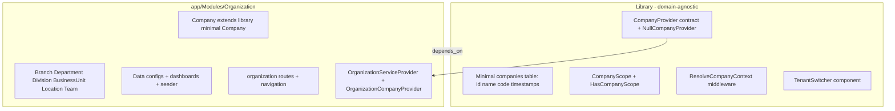

# Implementation Plan — Organization & HR Module Split

> **Status**: ✅ **COMPLETED** — All phases executed successfully
> **Date**: 2026-08-18 (planned) → 2026-08-18 (completed)
> **Package**: `quicker-faster/ui-library` (library) + `quick-hr` (consuming app)
> **Role**: The canonical, phase-by-phase execution plan for splitting the Organization domain out of the library and decomposing the HR monolith into five self-contained modules.

## Final Verification Results

| Check | Result |
|---|---|
| `migrate:fresh --seed` | ✅ 72 migrations, 0 errors |
| `ui-library:discover` | ✅ 5 modules, 3 listeners, 1 workflow, 364 permissions |
| `route:list` | ✅ 158 routes |
| `check-domain-independence.sh` | ✅ PASS |
| `phpunit` | ✅ 69 tests, 181 assertions |

### Completion Commits

| Repository | Commit | Description |
|---|---|---|
| Library | (see git log) | Organization domain extracted; minimal Company model + scoping mechanism retained |
| Consuming app | (see git log) | 6-module structure: Organization, Hr, Attendance, Leave, Payroll, Holiday |

### Actual Module Structure (post-refactor)

```
app/Modules/
├── Organization/    # 7 models — foundational org hierarchy
├── Hr/              # 15 models — core employee/people (slimmed)
├── Attendance/      # 12 models — time tracking, shifts, clock events
├── Leave/           # 5 models — leave types, requests, balances, approvers
├── Payroll/         # 11 models — payroll runs, payslips, policies
└── Holiday/         # 2 models — holiday calendars, holidays
```

Each module is self-contained with its own migrations, routes, views, configs, and service provider. Cross-module communication uses event-driven patterns and service contracts as specified in §3.4 of this plan.

---

## 0. Executive Summary

This plan covers two independent but related refactors:

| Refactor | From | To | Net effect |
|---|---|---|---|
| **Part A — Organization** | `src/Core/Organization/` (library) | `app/Modules/Organization/` (module) | The library keeps only the **scoping anchor** (minimal `companies` table + `CompanyScope` + `CompanyProvider` contract). The rich entity graph (Company, Branch, Department, Division, BusinessUnit, Location, Team) becomes a foundational module. |
| **Part B — HR** | `app/Modules/Hr/` (monolith, 45 models) | `app/Modules/Hr/` + `Payroll/` + `Leave/` + `Attendance/` + `Holiday/` | Five self-contained modules, each with its own models, migrations, data configs, routes, views, service provider, and manifest. |

The non-negotiable invariants that every phase must preserve:

1. **Self-containment** — a module's migrations, models, routes, views, configs, service provider, listeners, and jobs all live under `app/Modules/{Module}/` and reference nothing outside its own directory except the library and its declared `depends_on` dependencies.
2. **Pluggability** — dropping a module into `app/Modules/` and running `php artisan ui-library:discover` is sufficient to register its routes, migrations, configs, and navigation.
3. **Incremental safety** — every phase is independently testable and ends with a git commit checkpoint.

---

## 0.1 Preconditions & Source of Truth

### Repositories

| Repo | Path | Role |
|---|---|---|
| Library | `/Users/mac/Projects/Libraries/ui-library/` | Domain-agnostic infrastructure; the workspace this plan lives in |
| Consuming app | `/Users/mac/Projects/LaravelProjects/quick-hr/` | Hosts `app/Modules/*`; where Parts A (module side) and B execute |

All paths in this document are relative to the consuming app (`quick-hr`) **unless** prefixed with `library:` (relative to `/Users/mac/Projects/Libraries/ui-library/`). Git commits for Part A span **both** repositories; Part B is consumed entirely in `quick-hr`.

### Reference documents

- [`docs/library/27-architecture-boundary.md`](../../docs/library/27-architecture-boundary.md) — canonical boundary: "company the scoping term" stays in library; "Company the org-chart entity" moves to module.
- [`docs/project/library-vs-module-boundary-analysis.md`](../../docs/project/library-vs-module-boundary-analysis.md) — the leaking library files that must be decoupled.
- [`docs/project/multitenancy-foundation-analysis.md`](../../docs/project/multitenancy-foundation-analysis.md) — tenancy mechanism; pluggable provider; `TenantSwitcher`.
- [`docs/consuming-app/module-structure.md`](../../docs/consuming-app/module-structure.md) — module anatomy + auto-discovery conventions.
- [`docs/library/03-module-pattern.md`](../../docs/library/03-module-pattern.md) — `ModuleServiceProvider` registration protocol.

### ⚠️ Missing source document

The task references [`docs/project/hr-module-split-analysis.md`](../../docs/project/hr-module-split-analysis.md). **That file does not exist in the library workspace.** The authoritative HR inventory in this plan was therefore enumerated **directly from the consuming app**:

- `../../LaravelProjects/quick-hr/app/Modules/Hr/Models/` → **45 model files**
- `../../LaravelProjects/quick-hr/app/Modules/Hr/Database/Migrations/` → **44 migration files**

Where the task's stated counts (Hr 14 / Payroll 11 / Leave 4 / Attendance 12 / Holiday 2 = 43) differ from the authoritative inventory (Hr 8 / Payroll 13 / Leave 5 / Attendance 10 / Holiday 2, plus 5 Organization + 2 library-infrastructure models = 45), this plan uses the **authoritative inventory** and records the reconciliation in **Phase B.0**. See [§6.3](#63-reconciliation-notes) for the exact discrepancies and resolution steps.

---

## 1. Part A — Split Organization from the Library

### 1.1 Target State



**Verdict (hybrid c, per the boundary analysis):** the universal part (tenant scope/middleware/contract) stays in the library; the domain part (Company + hierarchy + CRUD UI + seeders) becomes a foundational module.

### 1.2 What the Library Keeps (scoping mechanism)

| Piece | Library file | Action |
|---|---|---|
| Minimal `companies` migration | `library:src/Core/Organization/Database/Migrations/2026_06_11_000003_create_companies_table.php` | **Rewrite** to `id`, `name`, `code`, `timestamps` only |
| Minimal `Company` model | `library:src/Core/Organization/Models/Company.php` | **Rewrite** to minimal (`$table='companies'`, `$fillable=['name','code']`, no domain relations) |
| [`CompanyScope`](library:src/Scopes/CompanyScope.php) | keep | unchanged |
| [`HasCompanyScope`](library:src/Traits/HasCompanyScope.php) | keep | unchanged |
| [`ResolveCompanyContext`](library:src/Http/Middleware/ResolveCompanyContext.php) | keep | unchanged |
| [`CompanyProvider`](library:src/Contracts/Navigation/CompanyProvider.php) | keep | unchanged contract |
| [`NullCompanyProvider`](library:src/Services/Navigation/NullCompanyProvider.php) | keep + **restore as default binding** | see Phase A.1 |
| `TenantSwitcher` (top-nav company switcher) | keep | unchanged |

**Deleted from library** (moved to the module or removed):

| Piece | Library file | Action |
|---|---|---|
| `Department`, `Division`, `BusinessUnit`, `Branch`, `Location`, `Team` models | `library:src/Core/Organization/Models/*.php` | **Move** to module |
| 6 hierarchy migrations | `library:src/Core/Organization/Database/Migrations/2026_06_11_000004…000009` | **Move** to module |
| Organization data configs + dashboards | `library:src/Core/Organization/Data/*` | **Move** to module |
| [`OrganizationSeeder`](library:src/Core/Organization/Database/Seeders/OrganizationSeeder.php) | `library:src/Core/Organization/Database/Seeders/OrganizationSeeder.php` | **Move** to module |
| Organization routes | `library:src/Core/Organization/Routes/web.php` | **Move** to module |
| Organization views | `library:src/Core/Organization/Resources/views/*` | **Move** to module |
| Organization navigation configs | `library:src/Core/Organization/Config/*` | **Move** to module |
| [`DefaultCompanyProvider`](library:src/Services/Navigation/DefaultCompanyProvider.php) | `library:src/Services/Navigation/DefaultCompanyProvider.php` | **Delete** (concrete impl → module's `OrganizationCompanyProvider`) |
| [`CompanyRegistered`](library:src/Events/CompanyRegistered.php) | `library:src/Events/CompanyRegistered.php` | **Delete** (→ module domain event) |
| [`RegistrationController`](library:src/Http/Controllers/RegistrationController.php) | `library:src/Http/Controllers/RegistrationController.php` | **Delete** (→ module provisioning flow) |
| `App\Models\Company` leak in [`home.blade.php`](library:src/Resources/views/home.blade.php) | `library:src/Resources/views/home.blade.php` | **Fix** (resolve via config/contract) |
| Concrete Company FQCN in [`Admin/Data/user.php`](library:src/Core/Admin/Data/user.php) | `library:src/Core/Admin/Data/user.php` | **Fix** (resolve via config) |

### 1.3 Organization Module Structure (target)

```
app/Modules/Organization/
├── module.json                        # NEW — manifest (Part E)
├── Config/
│   ├── navigation.php                 # org context groups
│   ├── settings.php                   # module settings
│   ├── bottom_bar_menu.php            # (moved from library)
│   ├── sidebar_menu.php               # (moved from library)
│   └── top_bar_menu.php               # (moved from library)
├── Data/
│   ├── company.php
│   ├── department.php
│   ├── location.php
│   ├── branch.php
│   ├── team.php
│   ├── business_unit.php
│   ├── division.php
│   ├── dashboard.php
│   └── dashboards/
│       ├── dashboard_companies_overview.php
│       ├── dashboard_locations_overview.php
│       └── dashboard_structure_overview.php
├── Database/
│   ├── Migrations/
│   │   ├── 2026_08_18_000001_alter_companies_add_business_columns.php  # NEW
│   │   ├── 2026_06_11_000004_create_branches_table.php
│   │   ├── 2026_06_11_000005_create_departments_table.php
│   │   ├── 2026_06_11_000006_create_divisions_table.php
│   │   ├── 2026_06_11_000007_create_business_units_table.php
│   │   ├── 2026_06_11_000008_create_locations_table.php
│   │   └── 2026_06_11_000009_create_teams_table.php
│   ├── Seeders/
│   │   └── OrganizationSeeder.php
│   └── Factories/
│       ├── CompanyFactory.php
│       ├── DepartmentFactory.php
│       ├── BranchFactory.php
│       ├── DivisionFactory.php
│       ├── BusinessUnitFactory.php
│       ├── LocationFactory.php
│       └── TeamFactory.php
├── Models/
│   ├── Company.php                    # extends library minimal Company
│   ├── Department.php
│   ├── Location.php
│   ├── Branch.php
│   ├── Team.php
│   ├── BusinessUnit.php
│   └── Division.php
├── Providers/
│   ├── OrganizationServiceProvider.php
│   └── OrganizationCompanyProvider.php  # implements CompanyProvider
├── Routes/
│   └── web.php
└── Resources/views/
    ├── organization/
    │   ├── companies.blade.php
    │   ├── branches.blade.php
    │   ├── departments.blade.php
    │   ├── divisions.blade.php
    │   ├── business-units.blade.php
    │   ├── locations.blade.php
    │   ├── teams.blade.php
    │   ├── dashboard.blade.php
    │   ├── dashboard-companies-overview.blade.php
    │   ├── dashboard-locations-overview.blade.php
    │   └── dashboard-structure-overview.blade.php
```

### 1.4 How the Module Extends the Minimal `companies` Table

The library creates the minimal table:

```php
// library:src/Core/Organization/Database/Migrations/2026_06_11_000003_create_companies_table.php
Schema::create('companies', function (Blueprint $table) {
    $table->id();
    $table->string('name');
    $table->string('code', 50)->nullable()->unique();
    $table->timestamps();
});
```

The module's `Company` model extends the library's minimal model:

```php
// app/Modules/Organization/Models/Company.php
namespace App\Modules\Organization\Models;

use QuickerFaster\UILibrary\Core\Organization\Models\Company as BaseCompany;

class Company extends BaseCompany
{
    protected $fillable = [
        // business columns added by the module migration
        'subdomain','logo','email','phone','website','address','city',
        'state_code','country_code','postal_code','tax_id','registration_number',
        'currency_code','timezone','date_format','is_active','status','metadata',
        'level','parent_company_id',
        'billing_email','billing_address_line_1','billing_address_line_2',
        'billing_city','billing_state_code','billing_postal_code','billing_country_code',
        'database_name','is_placeholder',
    ];
    // + relations to Branch, Department, Division, BusinessUnit, Location, Team
}
```

The module migration `ALTER`s the table:

```php
// app/Modules/Organization/Database/Migrations/2026_08_18_000001_alter_companies_add_business_columns.php
Schema::table('companies', function (Blueprint $table) {
    // add only if not present (idempotent against any legacy rich table)
    $table->after('code', function (Blueprint $t) { /* rich columns */ });
});
```

Each column addition is guarded with `Schema::hasColumn('companies', '<col>')` so the migration is safe even if a legacy rich `companies` table already exists (expand-and-contract, never a forced drop).

### 1.5 Namespace Changes (Part A)

| Old FQCN | New FQCN |
|---|---|
| `QuickerFaster\UILibrary\Core\Organization\Models\Company` | **remains** `QuickerFaster\UILibrary\Core\Organization\Models\Company` (minimal) |
| `QuickerFaster\UILibrary\Core\Organization\Models\Department` | `App\Modules\Organization\Models\Department` |
| `QuickerFaster\UILibrary\Core\Organization\Models\Division` | `App\Modules\Organization\Models\Division` |
| `QuickerFaster\UILibrary\Core\Organization\Models\BusinessUnit` | `App\Modules\Organization\Models\BusinessUnit` |
| `QuickerFaster\UILibrary\Core\Organization\Models\Branch` | `App\Modules\Organization\Models\Branch` |
| `QuickerFaster\UILibrary\Core\Organization\Models\Location` | `App\Modules\Organization\Models\Location` |
| `QuickerFaster\UILibrary\Core\Organization\Models\Team` | `App\Modules\Organization\Models\Team` |
| `App\Modules\Hr\Models\Company` | `App\Modules\Organization\Models\Company` |
| `App\Modules\Hr\Models\Department` | `App\Modules\Organization\Models\Department` |
| `App\Modules\Hr\Models\Location` | `App\Modules\Organization\Models\Location` |
| `App\Modules\Hr\Models\Team` | `App\Modules\Organization\Models\Team` |

> The HR module currently contains duplicate Organization models (`Company`, `Department`, `Location`, `Team`, `CompanyProfileOverview`). These are consolidated into the Organization module during Part A and their HR references updated.

---

## 2. Part A — Phase Breakdown

Each phase ends with **Verification** and **Checkpoint** (git commit) sections. Run library-side commands in the library repo and app-side commands in `quick-hr` (paths under the consuming app).

---

### Phase A.0 — Preflight & Baseline

**Goal:** freeze a known-good state and record the inventory.

**Steps:**

1. In both repos, confirm clean working trees:
   ```bash
   # library repo
   git status --porcelain
   # consuming app
   cd /Users/mac/Projects/LaravelProjects/quick-hr && git status --porcelain
   ```
2. Tag a baseline in the library:
   ```bash
   git tag -a pre-org-split -m "Baseline before Organization extraction"
   ```
3. Record the Organization inventory for the audit trail:
   ```bash
   find library:src/Core/Organization -type f | sort > /tmp/org-before.txt
   ```
4. Grep for every library-side consumer of the Organization namespace (must resolve to zero by Phase A.2):
   ```bash
   grep -rn "Core\\\\Organization\\\\Models" library:src --include='*.php'
   grep -rn "App\\\\Modules\\\\Organization" library:src --include='*.php'
   ```

**Verification:**

- [ ] Both repos clean before any change
- [ ] `/tmp/org-before.txt` exists and is non-empty
- [ ] The two greps above return a complete list (the baseline to eliminate)

**Checkpoint:** commit the baseline tag only (no code change expected).

---

### Phase A.1 — Library: Rewrite Company to Minimal + Restore Null Default

**Goal:** shrink the library `Company` model and `companies` migration to the scoping anchor, and restore the null provider default.

**Steps:**

1. Rewrite `library:src/Core/Organization/Models/Company.php` to minimal:
   - Keep `namespace QuickerFaster\UILibrary\Core\Organization\Models;`
   - `$table = 'companies'`, `$fillable = ['name', 'code']`, `$casts = []`.
   - **Remove** `SoftDeletes`, `HasSettings`, all rich fillables, and all relations (`branches()`, `departments()`, `divisions()`, `businessUnits()`, `locations()`, `teams()`, `parentCompany()`, `children()`).
2. Rewrite `library:src/Core/Organization/Database/Migrations/2026_06_11_000003_create_companies_table.php` to create only `id`, `name`, `code`, `timestamps`.
3. Delete `library:src/Services/Navigation/DefaultCompanyProvider.php` (it imports the concrete rich model).
4. Delete `library:src/Events/CompanyRegistered.php`.
5. Delete `library:src/Http/Controllers/RegistrationController.php`.
6. In `library:src/Config/ui-library.php`, restore the `CompanyProvider` default to `NullCompanyProvider`:
   ```php
   'company_provider' => \QuickerFaster\UILibrary\Services\Navigation\NullCompanyProvider::class,
   ```
   (The search in §0 confirms the current default points at the concrete `DefaultCompanyProvider`.)
7. In `library:src/Providers/UILibraryServiceProvider.php`, remove `'Organization'` from the `bootCoreModules()` loop and remove the `ModuleRegistered('organization', …)` firing (Organization is no longer a Core module).

**Verification:**

- [ ] `grep -rn "DefaultCompanyProvider\|CompanyRegistered\|RegistrationController" library:src` returns zero
- [ ] `library:vendor/bin/phpunit` (library tests) passes — or `php artisan test` if bootstrapped
- [ ] `bash scripts/check-domain-independence.sh` passes (no new domain nouns introduced)
- [ ] `php -r "require 'vendor/autoload.php'; echo (new ReflectionClass('QuickerFaster\\\\UILibrary\\\\Core\\\\Organization\\\\Models\\\\Company'))->getName();"` resolves

**Checkpoint:** `git add -A && git commit -m "feat(org): reduce library Company to minimal scoping anchor"`

---

### Phase A.2 — Library: Decouple Remaining Leaks

**Goal:** eliminate every remaining concrete-Organization import in `library:src/`.

**Steps:**

1. Fix `library:src/Resources/views/home.blade.php` — remove the `class_exists(\App\Models\Company::class)` stat; resolve the "Companies" stat through the `CompanyProvider` contract (or drop the stat).
2. Fix `library:src/Core/Admin/Data/user.php` — replace the hardcoded `'model' => 'App\Modules\Hr\Models\Company'` / `'model' => 'QuickerFaster\UILibrary\Core\Organization\Models\Company'` with a config-resolved value (e.g., `config('ui-library.organization.company_model')`).
3. Re-run the baseline greps from Phase A.0 and confirm zero executable matches remain.

**Verification:**

- [ ] `grep -rn "Core\\\\Organization\\\\Models" library:src --include='*.php'` returns only the minimal `Company` model definition itself (no importers)
- [ ] `grep -rn "App\\\\Modules\\\\Organization\|App\\\\Models\\\\Company" library:src --include='*.php'` returns zero executable matches
- [ ] `bash scripts/check-domain-independence.sh` exits 0

**Checkpoint:** `git commit -am "refactor(org): decouple library from concrete Organization model"`

---

### Phase A.3 — Create Organization Module Skeleton + Manifest

**Goal:** stand up the empty module directory and manifest in the consuming app.

**Steps:**

1. Create the directory tree:
   ```bash
   cd /Users/mac/Projects/LaravelProjects/quick-hr
   mkdir -p app/Modules/Organization/{Config,Data/dashboards,Database/{Migrations,Seeders,Factories},Models,Providers,Routes,Resources/views/organization}
   ```
2. Create `app/Modules/Organization/module.json`:
   ```json
   {
     "name": "Organization",
     "label": "Organization",
     "icon": "fa-building",
     "order": 100,
     "roles": ["*"],
     "user_facing": true,
     "enabled": true,
     "depends_on": [],
     "auto_register_listeners": true,
     "auto_register_reports": true,
     "auto_register_workflows": true,
     "auto_register_permissions": true,
     "auto_register_notifications": true
   }
   ```
3. Verify discovery sees the (still empty) module:
   ```bash
   php artisan ui-library:discover | grep -A2 -i organization
   ```

**Verification:**

- [ ] `php artisan ui-library:discover` lists `organization`

**Checkpoint:** `git commit -am "feat(org): scaffold Organization module directory + manifest"`

---

### Phase A.4 — Move Models + Update Namespaces

**Goal:** relocate the 7 models and fix every namespace reference.

**Steps:**

1. Copy the 6 hierarchy models from the library into the module, rewriting namespaces:
   - `library:src/Core/Organization/Models/Department.php` → `app/Modules/Organization/Models/Department.php` (`namespace App\Modules\Organization\Models;`)
   - same for `Division`, `BusinessUnit`, `Branch`, `Location`, `Team`.
2. Create `app/Modules/Organization/Models/Company.php` extending the library minimal Company (see §1.4), carrying the rich `$fillable`, `$casts`, `$attributes`, and relations that were removed from the library model in Phase A.1.
3. Update every reference in the consuming app from the old library Organization FQCNs to the new module FQCNs (see §1.5 table). A safe find/replace:
   ```bash
   grep -rl "QuickerFaster\\\\UILibrary\\\\Core\\\\Organization\\\\Models\\\\" app/ \
     | xargs sed -i '' 's#QuickerFaster\\\\UILibrary\\\\Core\\\\Organization\\\\Models\\\\Department#App\\\\Modules\\\\Organization\\\\Models\\\\Department#g'
   ```
   Repeat per model, **except** `Company` (which keeps its library base class only when referenced as the *base*; consuming references to the *rich* Company become the module FQCN).
4. Update HR's duplicate org models (`App\Modules\Hr\Models\{Company,Department,Location,Team,CompanyProfileOverview}`) to point at the Organization module equivalents (delete the duplicates after no references remain).

**Verification:**

- [ ] `composer dump-autoload`
- [ ] `grep -rn "Core\\\\Organization\\\\Models\\\\\(Department\|Division\|BusinessUnit\|Branch\|Location\|Team\)" app/` returns zero
- [ ] `php artisan ui-library:discover` still lists organization

**Checkpoint:** `git commit -am "feat(org): move Organization models into module"`

---

### Phase A.5 — Move Migrations, Seeders, Factories

**Goal:** relocate the table definitions and seed data.

**Steps:**

1. Move the 6 hierarchy migrations (`2026_06_11_000004…000009`) from `library:src/Core/Organization/Database/Migrations/` to `app/Modules/Organization/Database/Migrations/` (keep filenames; they are discovered via `loadMigrationsFrom`).
2. Create `app/Modules/Organization/Database/Migrations/2026_08_18_000001_alter_companies_add_business_columns.php` (the `ALTER` from §1.4), with per-column `Schema::hasColumn()` guards.
3. Move `library:src/Core/Organization/Database/Seeders/OrganizationSeeder.php` → `app/Modules/Organization/Database/Seeders/OrganizationSeeder.php` (rewrite namespace to `App\Modules\Organization\Database\Seeders`).
4. Create the 7 factories in `app/Modules/Organization/Database/Factories/` (namespace `App\Modules\Organization\Database\Factories`).
5. Delete the moved library files from `library:src/Core/Organization/`.

**Verification:**

- [ ] `php artisan migrate --pretend` shows the ALTER + 6 CREATE statements (or "nothing to migrate" if already applied)
- [ ] `php artisan migrate:status` lists all 7 Organization migrations as `ran` or `pending` (not `missing`)

**Checkpoint:** `git commit -am "feat(org): move Organization migrations, seeders, factories"`

---

### Phase A.6 — Move Data Configs + Dashboards

**Goal:** relocate the config-driven CRUD definitions.

**Steps:**

1. Move the 8 Data files + 3 dashboards from `library:src/Core/Organization/Data/` → `app/Modules/Organization/Data/`.
2. Rewrite each `'model' =>` key to the new module FQCN (e.g., `App\Modules\Organization\Models\Company::class`).

**Verification:**

- [ ] `php artisan ui-library:discover` lists the Organization dashboards (`organization_dashboard_companies_overview`, etc.)
- [ ] `php artisan tinker --execute="dump(app(\QuickerFaster\UILibrary\Services\Config\ModelConfigRepository::class)->get('organization.company'));"` returns a config array

**Checkpoint:** `git commit -am "feat(org): move Organization data configs + dashboards"`

---

### Phase A.7 — Move Routes, Navigation Config, Views

**Goal:** relocate the UI surface.

**Steps:**

1. Move `library:src/Core/Organization/Routes/web.php` → `app/Modules/Organization/Routes/web.php`. Rewrite `view('qf-core::organization.*')` → `view('organization::organization.*')`.
2. Move `library:src/Core/Organization/Config/{navigation,settings,bottom_bar_menu,sidebar_menu,top_bar_menu}.php` → `app/Modules/Organization/Config/`.
3. Move the 11 views from `library:src/Core/Organization/Resources/views/` → `app/Modules/Organization/Resources/views/organization/`.

**Verification:**

- [ ] `php artisan route:list | grep organization` shows the 8 named routes
- [ ] `php artisan ui-library:discover` lists `organization` with its navigation/config assets
- [ ] Visit `/organization/companies` in a browser (or `curl` under auth) and confirm it renders

**Checkpoint:** `git commit -am "feat(org): move Organization routes, navigation, views"`

---

### Phase A.8 — Create OrganizationServiceProvider + OrganizationCompanyProvider

**Goal:** make the module self-booting and provide the concrete tenant provider.

**Steps:**

1. Create `app/Modules/Organization/Providers/OrganizationServiceProvider.php`:
   ```php
   namespace App\Modules\Organization\Providers;

   use Illuminate\Support\ServiceProvider;
   use QuickerFaster\UILibrary\Contracts\Navigation\CompanyProvider;
   use App\Modules\Organization\Providers\OrganizationCompanyProvider;

   class OrganizationServiceProvider extends ServiceProvider
   {
       public function register(): void
       {
           $this->app->singleton(CompanyProvider::class, OrganizationCompanyProvider::class);
       }

       public function boot(): void
       {
           // The library's ModuleServiceProvider already loads this module's
           // views, routes, migrations, listeners, reports, and workflows by
           // convention. Register only module-specific bindings here.
       }
   }
   ```
2. Create `app/Modules/Organization/Providers/OrganizationCompanyProvider.php` implementing `CompanyProvider` (`getCompanies()`, `getCurrentCompanyId()`) using `App\Modules\Organization\Models\Company`.
3. Ensure the library auto-registers this provider (see §5.2 — `module.json` + per-module ServiceProvider discovery).

**Verification:**

- [ ] `php artisan ui-library:discover` reports the module's service provider is registered
- [ ] `php artisan tinker --execute="dump(get_class(app(\QuickerFaster\UILibrary\Contracts\Navigation\CompanyProvider::class)));"` prints `OrganizationCompanyProvider`
- [ ] The top-nav company switcher renders companies (or hides when only one exists)

**Checkpoint:** `git commit -am "feat(org): add OrganizationServiceProvider + OrganizationCompanyProvider"`

---

### Phase A.9 — Update Consuming-App References (HR → Organization)

**Goal:** re-point every HR-side dependency on Organization.

**Steps:**

1. `grep -rln "App\\\\Modules\\\\Hr\\\\Models\\\\\(Company\|Department\|Location\|Team\|CompanyProfileOverview\)" app/` → update to `App\Modules\Organization\Models\*`.
2. Delete the now-unreferenced duplicate models from `app/Modules/Hr/Models/` (`Company.php`, `Department.php`, `Location.php`, `Team.php`, `CompanyProfileOverview.php`).
3. Update HR migrations that create org tables (`create_companies_table`, `create_departments_table`, `create_locations_table`, `create_teams_table`) — remove them from HR (Organization owns those tables; HR declares `depends_on: ["organization"]`).

**Verification:**

- [ ] `grep -rn "App\\\\Modules\\\\Hr\\\\Models\\\\\(Company\|Department\|Location\|Team\|CompanyProfileOverview\)" app/` returns zero
- [ ] `php artisan ui-library:discover` lists both `organization` and `hr`
- [ ] `php artisan migrate --pretend` shows no duplicate table creation

**Checkpoint:** `git commit -am "refactor(hr): repoint HR to Organization module"`

---

### Phase A.10 — Final Part A Verification

- [ ] `composer dump-autoload`
- [ ] `php artisan ui-library:discover`
- [ ] `php artisan route:list`
- [ ] `php artisan migrate:status`
- [ ] `php artisan migrate --pretend`
- [ ] `bash scripts/check-domain-independence.sh` (library repo)
- [ ] `php artisan test` / `./vendor/bin/phpunit` (both repos)

**Checkpoint:** tag `org-split-complete` in both repos.

---

## 3. Part B — Split HR into 5 Sub-Modules

### 3.1 Module Anatomy (every module)

Each of the five modules must follow the exact anatomy below. Only include directories that apply; the **required minimum** is `module.json`, `Config/navigation.php`, `Data/*`, `Models/*`, `Resources/views/*`, `Routes/web.php`.

```
app/Modules/{Module}/
├── module.json                  # manifest (Part E)
├── Config/
│   ├── navigation.php           # own sidebar context group
│   ├── settings.php             # module-specific settings
│   └── workflows.php            # if any
├── Data/
│   ├── {entity}.php             # one per model
│   ├── dashboards/              # module dashboards
│   ├── reports/                 # if any
│   └── wizards/                 # if any
├── Database/
│   ├── Migrations/              # tables this module owns
│   ├── Seeders/                 # module seeders
│   └── Factories/               # module factories
├── Http/
│   ├── Controllers/
│   └── Livewire/
├── Jobs/                        # if any
├── Listeners/                   # if any
├── Models/                      # one per entity
├── Providers/
│   └── {Module}ServiceProvider.php
├── Routes/
│   ├── web.php
│   └── api.php                  # if any
├── Resources/views/
├── Services/                    # module services
├── Tests/
└── Traits/                      # if any
```

### 3.2 Module Manifest / Pluggability Mechanism

This is grounded in the **existing** library system (verified by reading the code):

1. **Declaration — by convention (directory existence) + optional `module.json`.** The library scans `app/Modules/*` ([`ModuleServiceProvider::discoverBusinessModules()`](library:src/Providers/ModuleServiceProvider.php:28) and [`DiscoveryRegistrar::businessModules()`](library:src/Services/Discovery/DiscoveryRegistrar.php:565)). A directory in `app/Modules/*` **is** a module. The new `module.json` (proposed in §6) supplies metadata that convention cannot infer (label, order, roles, `depends_on`).
2. **Discovery — `DiscoveryRegistrar` scans `app/Modules/*`.** It iterates directories, skipping Core modules (`core === true`), and derives `key` (lowercased dir name) and PSR-4 namespace (`App\Modules\{Dir}`).
3. **Migrations — `loadMigrationsFrom()`.** [`ModuleServiceProvider`](library:src/Providers/ModuleServiceProvider.php:135) calls `$this->loadMigrationsFrom("{$directory}/Database/Migrations")` for each module.
4. **Routes — `Route::group()`.** [`ModuleServiceProvider`](library:src/Providers/ModuleServiceProvider.php:124) groups `Routes/web.php` under `web` middleware and `Routes/api.php` under `api` prefix + `api` middleware.
5. **Navigation — `Config/navigation.php` per module.** The [`NavigationManager`](library:src/Services/Navigation/NavigationManager.php:501) reads each module's `depends_on` and composes context groups/sections from each module's `Config/navigation.php`.
6. **Dependencies — `depends_on` + `ModuleContract::getDependencies()`.** The registry already stores `depends_on` and validates it at boot ([`ModuleServiceProvider`](library:src/Providers/ModuleServiceProvider.php:95)); [`ModuleContract::getDependencies()`](library:src/Contracts/Modules/ModuleContract.php:57) exposes it programmatically. What's **missing** is a per-module self-declaration file — filled by the `module.json` proposal in §6.

### 3.3 Self-Containment Checklist (per module)

- [ ] All models in `app/Modules/{Module}/Models/`
- [ ] All migrations for tables it owns in `app/Modules/{Module}/Database/Migrations/`
- [ ] All routes in `app/Modules/{Module}/Routes/`
- [ ] All views in `app/Modules/{Module}/Resources/views/`
- [ ] All data configs in `app/Modules/{Module}/Data/`
- [ ] All service classes in `app/Modules/{Module}/Services/`
- [ ] Service provider in `app/Modules/{Module}/Providers/`
- [ ] No `use App\Modules\OtherModule\*` except for declared `depends_on` dependencies
- [ ] `Config/navigation.php` defines its own context group
- [ ] `php artisan ui-library:discover` discovers it

### 3.4 Cross-Module Communication Patterns

| Dependency | Direction | Mechanism | Concrete design |
|---|---|---|---|
| **LeaveAttendanceSync** | Leave → Attendance | **Event-driven** | Leave dispatches `LeaveApproved` / `LeaveDenied`; Attendance's listener creates/removes attendance records. No direct import of Attendance services from Leave. |
| **PayrollCalculator reads attendance hours** | Payroll → Attendance | **Service contract** | Define `AttendanceHoursProvider` interface; Attendance implements it and binds it; Payroll resolves it from the container. |
| **EmployeePosition cross-references** | HR → Attendance/Payroll | **Database FK only** | `EmployeePosition` stays in HR; Attendance/Payroll tables reference `employee_position_id` as a read-only FK. No PHP class import. |

#### 3.4.1 Event contract (Leave → Attendance)

Create `app/Modules/Leave/Events/LeaveApproved.php` and `app/Modules/Leave/Events/LeaveDenied.php`. Attendance registers `app/Modules/Attendance/Listeners/SyncLeaveAttendanceListener.php` with `handle(LeaveApproved $e)` / `handle(LeaveDenied $e)`.

#### 3.4.2 Service contract (Payroll → Attendance)

Create `app/Modules/Attendance/Contracts/AttendanceHoursProvider.php`:

```php
namespace App\Modules\Attendance\Contracts;

interface AttendanceHoursProvider
{
    public function hoursForPeriod(int $employeeId, string $start, string $end): float;
}
```

Attendance binds it in `app/Modules/Attendance/Providers/AttendanceServiceProvider.php`:

```php
$this->app->bind(
    \App\Modules\Attendance\Contracts\AttendanceHoursProvider::class,
    \App\Modules\Attendance\Services\AttendanceHoursProvider::class
);
```

Payroll resolves it from the container (never imports the concrete class):

```php
$hours = app(\App\Modules\Attendance\Contracts\AttendanceHoursProvider::class)
    ->hoursForPeriod($employeeId, $start, $end);
```

---

## 4. Part B — Phase Breakdown

Split order: **Attendance → Leave → Payroll → Holiday → HR** (HR is split last because it is the source of shared cross-references; extracting the leaf modules first minimizes the surface of the final HR slim-down).

Each phase repeats the same 11-step template (§4.1). Steps are abbreviated in §4.3–§4.7 but must be executed in full.

### 4.1 The 11-Step Split Template

For each phase `{Module}`:

1. **Create directory structure** — `mkdir -p app/Modules/{Module}/{Config,Data/dashboards,Database/{Migrations,Seeders,Factories},Http/{Controllers,Livewire},Models,Providers,Routes,Resources/views,Services,Tests}`.
2. **Move models to the new namespace** — relocate the model files from `app/Modules/Hr/Models/` to `app/Modules/{Module}/Models/`, rewriting `namespace App\Modules\Hr\Models;` → `namespace App\Modules\{Module}\Models;`.
3. **Update `use App\Modules\Hr\Models\*` → `use App\Modules\{Module}\Models\*`** across the ENTIRE codebase.
4. **Move data configs, dashboards, reports, wizards** — from `app/Modules/Hr/Data/*` to `app/Modules/{Module}/Data/*`, updating `'model'` keys.
5. **Move migrations** — from `app/Modules/Hr/Database/Migrations/` to `app/Modules/{Module}/Database/Migrations/` (only the tables this module owns; see §4.2 ownership map).
6. **Move routes + split navigation config** — move the module's route closure(s) from `app/Modules/Hr/Routes/web.php` into `app/Modules/{Module}/Routes/web.php`; create `Config/navigation.php` with its own context group.
7. **Move services, listeners, jobs, controllers, Livewire, views** — relocate each file to the module and rewrite its namespace.
8. **Create `{Module}ServiceProvider.php`** — register container bindings (e.g., the cross-module contracts from §3.4).
9. **Update the old HR module's service provider/config to remove moved items** — remove moved routes/migrations/nav sections from `app/Modules/Hr/`.
10. **Run verification** — `composer dump-autoload`, `php artisan ui-library:discover`, `php artisan route:list`, `php artisan migrate:status`.
11. **Git commit** — `git commit -am "refactor(hr): extract {Module} module"`.

### 4.2 Table Ownership Map (which migrations move where)

| Module | Migrations (from `app/Modules/Hr/Database/Migrations/`) |
|---|---|
| **Organization** | `create_companies_table`, `create_locations_table`, `create_departments_table`, `create_teams_table` |
| **Attendance** | `create_attendance_policies_table`, `create_shifts_table`, `create_work_patterns_table`, `create_employee_work_patterns_table`, `create_attendances_table`, `create_attendance_adjustments_table`, `create_shift_schedules_table`, `create_clock_events_table`, `create_attendance_sessions_table` |
| **Leave** | `create_leave_types_table`, `create_leave_requests_table`, `create_leave_balances_table`, `create_leave_approvers_table`, `create_leave_approver_leave_type_table` |
| **Holiday** | `create_holiday_calendars_table`, `create_department_holiday_calendar_table`, `create_holiday_calendar_location_table`, `create_holidays_table` |
| **Payroll** | `create_policy_assignments_table`, `create_pay_schedules_table`, `create_employee_payroll_profiles_table`, `create_payroll_runs_table`, `create_payroll_payslips_table`, `create_payroll_policies_table`, `create_payroll_run_adjustments_table`, `create_employee_adjustment_profiles_table`, `create_payslip_items_table`, `create_payroll_policy_assignments_table`, `create_payroll_run_progress` |
| **Hr (core)** | `create_job_titles_table`, `create_employee_groups_table`, `create_tags_table`, `create_employees_table`, `create_taggable_table`, `create_employee_job_histories_table`, `create_employee_profiles_table`, `create_employee_team_table`, `create_employee_positions_table`, `create_documents_table` |

> **One owner per table.** Cross-module tables are FKs only (e.g., Attendance/Payroll reference `employees` and `employee_positions` but never create them). No module creates a table owned by another.

### 4.3 Phase B.0 — Inventory Reconciliation (blocking prerequisite)

Because `hr-module-split-analysis.md` is missing and the actual inventory (45 models) differs from the task's stated counts (43), **freeze the authoritative map before any file move**:

1. Print the authoritative model list and reconcile each against §5 (the namespace map below).
2. Resolve the ambiguous models (see §6.3) by reading their `belongsTo`/`hasMany` relations.
3. Update the namespace map in §5 in-place to reflect any corrections.
4. Commit the finalized map before touching files.

**Verification:**

- [ ] `find app/Modules/Hr/Models -name '*.php' | wc -l` equals `45`
- [ ] `find app/Modules/Hr/Database/Migrations -name '*.php' | wc -l` equals `44`
- [ ] The §5 map is committed and frozen

**Checkpoint:** `git commit -am "docs(hr): freeze HR split inventory + namespace map"`

---

### 4.4 Phase B.1 — Extract Attendance Module

**Steps:** run the 11-step template for `Attendance`.

**Module-specific notes:**

- **Models (10):** `Attendance`, `AttendanceAdjustment`, `AttendanceOverview`, `AttendancePolicy`, `AttendanceSession`, `ClockEvent`, `EmployeeWorkPattern`, `Shift`, `ShiftSchedule`, `WorkPattern`.
- **Services:** `AttendanceAggregator`, `AttendanceCalculator`, `AttendanceService`.
- **Traits:** `HandlesAttendanceRecord`.
- **Controllers:** `ClockEventController`.
- **Listeners:** `AttendanceEventListener`; add `SyncLeaveAttendanceListener` (for Leave events, §3.4.1).
- **Contracts:** `AttendanceHoursProvider` interface + implementation (bind in the provider).
- **depends_on:** `["organization"]` (employees and positions are read-only FKs; `organization` provides `company_id` scoping).

**Verification (phase-specific):**

- [ ] `grep -rn "App\\\\Modules\\\\Hr\\\\Models\\\\\(Attendance\|ClockEvent\|Shift\|WorkPattern\|AttendancePolicy\|AttendanceSession\|AttendanceAdjustment\|AttendanceOverview\|EmployeeWorkPattern\)" app/` returns zero
- [ ] `php artisan route:list | grep -iE "attendance|clock"` shows the moved routes
- [ ] `php artisan migrate:status` shows Attendance migrations under their new path

**Checkpoint:** commit.

---

### 4.5 Phase B.2 — Extract Leave Module

**Steps:** run the 11-step template for `Leave`.

**Module-specific notes:**

- **Models (5):** `LeaveApprover`, `LeaveBalance`, `LeaveOverview`, `LeaveRequest`, `LeaveType`.
- **Services:** `LeaveAccrualService`; `LeaveAttendanceSync` is **replaced** by the event contract (§3.4.1) — delete the old cross-module service.
- **Events:** `LeaveApproved`, `LeaveDenied`.
- **Listeners:** `LeaveRequestEventListener`.
- **depends_on:** `["organization", "attendance"]` (declared for the event relationship; the actual sync lives in Attendance).

**Verification:**

- [ ] `grep -rn "App\\\\Modules\\\\Hr\\\\Models\\\\\(LeaveRequest\|LeaveType\|LeaveBalance\|LeaveApprover\|LeaveOverview\)" app/` returns zero
- [ ] `grep -rn "LeaveAttendanceSync" app/` returns zero (replaced by events)
- [ ] `php artisan ui-library:discover` lists the `LeaveApproved` → `SyncLeaveAttendanceListener` mapping

**Checkpoint:** commit.

---

### 4.6 Phase B.3 — Extract Payroll Module

**Steps:** run the 11-step template for `Payroll`.

**Module-specific notes:**

- **Models (13):** `EmployeeAdjustmentProfile`, `EmployeePayrollProfile`, `PayrollOverview`, `PayrollPayslip`, `PayrollPolicy`, `PayrollPolicyAssignment`, `PayrollRun`, `PayrollRunAdjustment`, `PayrollRunProgress`, `PaySchedule`, `PayslipItem`, `PolicyAssignment`, `PolicyOverview`.
- **Services:** `PayrollCalculatorService`, `PayrollGenerator`, `PayrollReportService`, `PayrollRunProcessor`, `PayslipService`, `Payroll/PayrollCalculator`.
- **Jobs:** `Payrolls/GeneratePayrollRunSummaryPdf`, `Payrolls/ProcessPayrollRun`.
- **Controllers:** `PayrollRunController`, `PayrollReportController`, `PayslipController`, `Payrolls/BankFileController`, `Payrolls/PayrollRunPdfController`.
- **Livewire:** `Payroll/*` (6 components).
- **Listeners:** `PayrollRunEventListener`.
- **Events:** `PayrollRunEvent`.
- **Exports:** `PayrollRunSummaryExport`.
- **Cross-module:** resolve `AttendanceHoursProvider` from the container (§3.4.2) instead of any direct Attendance service import.
- **depends_on:** `["organization", "hr", "attendance"]`.

**Verification:**

- [ ] `grep -rn "App\\\\Modules\\\\Hr\\\\Models\\\\\(Payroll\|Payslip\|PaySchedule\|PolicyAssignment\|PolicyOverview\|PayrollPolicy\|PayrollRun\|PayrollPayslip\|PayslipItem\|EmployeePayrollProfile\|EmployeeAdjustmentProfile\|PayrollRunAdjustment\|PayrollRunProgress\|PayrollOverview\)" app/` returns zero
- [ ] `php artisan route:list | grep -iE "payroll|payslip|bank-file"` shows moved routes
- [ ] PayrollCalculator resolves `AttendanceHoursProvider` from container (tinker check)

**Checkpoint:** commit.

---

### 4.7 Phase B.4 — Extract Holiday Module

**Steps:** run the 11-step template for `Holiday`.

**Module-specific notes:**

- **Models (2):** `Holiday`, `HolidayCalendar`.
- **depends_on:** `["organization"]`.

**Verification:**

- [ ] `grep -rn "App\\\\Modules\\\\Hr\\\\Models\\\\\(Holiday\|HolidayCalendar\)" app/` returns zero
- [ ] `php artisan route:list | grep -i holiday` shows moved routes

**Checkpoint:** commit.

---

### 4.8 Phase B.5 — Slim HR to Core/People

**Steps:** run the 11-step template for `Hr` (the remaining module).

**Module-specific notes:**

- **Models (8):** `Employee`, `EmployeeGroup`, `EmployeeJobHistory`, `EmployeePosition`, `EmployeeProfile`, `JobTitle`, `PeopleOverview`, `Tag`.
- **Controllers:** `EmployeePrintController`, `EmployeeProfileController`, `IdCardController`, `UserSyncController`.
- **Livewire:** keep any non-Payroll Livewire (verify; most custom Livewire moved with Payroll).
- **Rules:** `ValidAttendanceSequence` (verify whether it belongs to Attendance; move if it references attendance tables).
- **depends_on:** `["organization"]`.
- **Document/SavedReport** (if confirmed HR-specific, see §6.3): keep in Hr; otherwise point at the library equivalents.

**Verification (final HR):**

- [ ] `find app/Modules/Hr/Models -name '*.php' | wc -l` equals the reconciled core count (8, or per frozen map)
- [ ] `grep -rn "App\\\\Modules\\\\Payroll\|App\\\\Modules\\\\Leave\|App\\\\Modules\\\\Attendance\|App\\\\Modules\\\\Holiday" app/Modules/Hr/` returns only declared `depends_on`/cross-module contract references (no stale imports)

**Checkpoint:** commit.

---

### 4.9 Phase B.6 — Final Part B Verification

- [ ] `composer dump-autoload`
- [ ] `php artisan ui-library:discover` (lists 6 modules: organization, hr, payroll, leave, attendance, holiday)
- [ ] `php artisan route:list` (no missing/duplicate routes)
- [ ] `php artisan migrate:status` (every migration resolves to a single owning module)
- [ ] `php artisan migrate --pretend` (no duplicate table creation)
- [ ] `php artisan test` / `./vendor/bin/phpunit`
- [ ] Self-containment checklist (§3.3) passes for all 6 modules

**Checkpoint:** tag `hr-split-complete`.

---

## 5. Namespace Migration Map (Complete)

### 5.1 HR → five modules

| # | Current FQCN | New FQCN |
|---|---|---|
| 1 | `App\Modules\Hr\Models\Attendance` | `App\Modules\Attendance\Models\Attendance` |
| 2 | `App\Modules\Hr\Models\AttendanceAdjustment` | `App\Modules\Attendance\Models\AttendanceAdjustment` |
| 3 | `App\Modules\Hr\Models\AttendanceOverview` | `App\Modules\Attendance\Models\AttendanceOverview` |
| 4 | `App\Modules\Hr\Models\AttendancePolicy` | `App\Modules\Attendance\Models\AttendancePolicy` |
| 5 | `App\Modules\Hr\Models\AttendanceSession` | `App\Modules\Attendance\Models\AttendanceSession` |
| 6 | `App\Modules\Hr\Models\ClockEvent` | `App\Modules\Attendance\Models\ClockEvent` |
| 7 | `App\Modules\Hr\Models\EmployeeWorkPattern` | `App\Modules\Attendance\Models\EmployeeWorkPattern` |
| 8 | `App\Modules\Hr\Models\Shift` | `App\Modules\Attendance\Models\Shift` |
| 9 | `App\Modules\Hr\Models\ShiftSchedule` | `App\Modules\Attendance\Models\ShiftSchedule` |
| 10 | `App\Modules\Hr\Models\WorkPattern` | `App\Modules\Attendance\Models\WorkPattern` |
| 11 | `App\Modules\Hr\Models\LeaveApprover` | `App\Modules\Leave\Models\LeaveApprover` |
| 12 | `App\Modules\Hr\Models\LeaveBalance` | `App\Modules\Leave\Models\LeaveBalance` |
| 13 | `App\Modules\Hr\Models\LeaveOverview` | `App\Modules\Leave\Models\LeaveOverview` |
| 14 | `App\Modules\Hr\Models\LeaveRequest` | `App\Modules\Leave\Models\LeaveRequest` |
| 15 | `App\Modules\Hr\Models\LeaveType` | `App\Modules\Leave\Models\LeaveType` |
| 16 | `App\Modules\Hr\Models\EmployeeAdjustmentProfile` | `App\Modules\Payroll\Models\EmployeeAdjustmentProfile` |
| 17 | `App\Modules\Hr\Models\EmployeePayrollProfile` | `App\Modules\Payroll\Models\EmployeePayrollProfile` |
| 18 | `App\Modules\Hr\Models\PayrollOverview` | `App\Modules\Payroll\Models\PayrollOverview` |
| 19 | `App\Modules\Hr\Models\PayrollPayslip` | `App\Modules\Payroll\Models\PayrollPayslip` |
| 20 | `App\Modules\Hr\Models\PayrollPolicy` | `App\Modules\Payroll\Models\PayrollPolicy` |
| 21 | `App\Modules\Hr\Models\PayrollPolicyAssignment` | `App\Modules\Payroll\Models\PayrollPolicyAssignment` |
| 22 | `App\Modules\Hr\Models\PayrollRun` | `App\Modules\Payroll\Models\PayrollRun` |
| 23 | `App\Modules\Hr\Models\PayrollRunAdjustment` | `App\Modules\Payroll\Models\PayrollRunAdjustment` |
| 24 | `App\Modules\Hr\Models\PayrollRunProgress` | `App\Modules\Payroll\Models\PayrollRunProgress` |
| 25 | `App\Modules\Hr\Models\PaySchedule` | `App\Modules\Payroll\Models\PaySchedule` |
| 26 | `App\Modules\Hr\Models\PayslipItem` | `App\Modules\Payroll\Models\PayslipItem` |
| 27 | `App\Modules\Hr\Models\PolicyAssignment` | `App\Modules\Payroll\Models\PolicyAssignment` |
| 28 | `App\Modules\Hr\Models\PolicyOverview` | `App\Modules\Payroll\Models\PolicyOverview` |
| 29 | `App\Modules\Hr\Models\Holiday` | `App\Modules\Holiday\Models\Holiday` |
| 30 | `App\Modules\Hr\Models\HolidayCalendar` | `App\Modules\Holiday\Models\HolidayCalendar` |
| 31 | `App\Modules\Hr\Models\Employee` | `App\Modules\Hr\Models\Employee` (unchanged) |
| 32 | `App\Modules\Hr\Models\EmployeeGroup` | `App\Modules\Hr\Models\EmployeeGroup` |
| 33 | `App\Modules\Hr\Models\EmployeeJobHistory` | `App\Modules\Hr\Models\EmployeeJobHistory` |
| 34 | `App\Modules\Hr\Models\EmployeePosition` | `App\Modules\Hr\Models\EmployeePosition` |
| 35 | `App\Modules\Hr\Models\EmployeeProfile` | `App\Modules\Hr\Models\EmployeeProfile` |
| 36 | `App\Modules\Hr\Models\JobTitle` | `App\Modules\Hr\Models\JobTitle` |
| 37 | `App\Modules\Hr\Models\PeopleOverview` | `App\Modules\Hr\Models\PeopleOverview` |
| 38 | `App\Modules\Hr\Models\Tag` | `App\Modules\Hr\Models\Tag` |

### 5.2 HR → Organization / library

| # | Current FQCN | New FQCN |
|---|---|---|
| 39 | `App\Modules\Hr\Models\Company` | `App\Modules\Organization\Models\Company` |
| 40 | `App\Modules\Hr\Models\CompanyProfileOverview` | `App\Modules\Organization\Models\CompanyProfileOverview` |
| 41 | `App\Modules\Hr\Models\Department` | `App\Modules\Organization\Models\Department` |
| 42 | `App\Modules\Hr\Models\Location` | `App\Modules\Organization\Models\Location` |
| 43 | `App\Modules\Hr\Models\Team` | `App\Modules\Organization\Models\Team` |
| 44 | `App\Modules\Hr\Models\Document` | `QuickerFaster\UILibrary\Models\Document` (verify — see §6.3) |
| 45 | `App\Modules\Hr\Models\SavedReport` | `QuickerFaster\UILibrary\Models\SavedReport` (verify — see §6.3) |

### 5.3 Reconciliation Notes

The task's stated counts (Hr 14 / Payroll 11 / Leave 4 / Attendance 12 / Holiday 2 = 43) do **not** match the authoritative 45-file inventory. The reconciliation (Phase B.0) must confirm the following assignments, which account for the delta:

| Model | This plan assigns to | Why it differs from a naive count |
|---|---|---|
| `EmployeeAdjustmentProfile` | Payroll | sits between payroll migrations in the file list; confirm it references `payroll` not `attendance` |
| `LeaveOverview` | Leave | "overview" aggregate models stay in their own domain |
| `AttendanceOverview`, `PayrollOverview`, `PeopleOverview`, `PolicyOverview` | their respective domain | "overview" aggregate models stay in their own domain |
| `Company`, `Department`, `Location`, `Team`, `CompanyProfileOverview` | Organization | duplicate org entities living inside HR |
| `Document`, `SavedReport` | library (verify) | generic infrastructure per the boundary doc |

The net is: **8 core HR + 13 Payroll + 5 Leave + 10 Attendance + 2 Holiday + 5 Organization + 2 library = 45.** If the operator's intended counts are authoritative instead, adjust the map in §5.1/§5.2 during Phase B.0 and re-tally.

---

## 6. Library Enhancements Required (Part E)

### 6.1 `module.json` Manifest (proposed)

**Current state:** `depends_on` exists as a registry config key, defaulted to `[]` at discovery and validated at boot, but no module can self-declare it. The only way to set it today is the published `config/ui-library.php` static `modules` array.

**Proposal:** add a `module.json` manifest at each module root:

```json
{
  "name": "Attendance",
  "label": "Attendance",
  "icon": "fa-clock",
  "order": 200,
  "roles": ["*"],
  "user_facing": true,
  "enabled": true,
  "depends_on": ["organization"],
  "auto_register_listeners": true,
  "auto_register_reports": true,
  "auto_register_workflows": true,
  "auto_register_permissions": true,
  "auto_register_notifications": true
}
```

**Change 1 — `library:src/Providers/ModuleServiceProvider.php`:** in `discoverBusinessModules()`, before setting the registry defaults, read `{$directory}/module.json` (if present) and merge its keys over the defaults:

```php
$manifest = [];
$manifestPath = "{$directory}/module.json";
if (file_exists($manifestPath)) {
    $manifest = json_decode((string) file_get_contents($manifestPath), true) ?: [];
}
config()->set("ui-library.modules.{$moduleName}", array_replace([
    // ... existing defaults ...
], $manifest));
```

The existing `depends_on` validation loop then runs unchanged.

**Change 2 — per-module ServiceProvider auto-registration.** Add to `discoverBusinessModules()`: if `{$directory}/Providers/{$moduleNamespace}ServiceProvider.php` exists, resolve `App\Modules\{$moduleNamespace}\Providers\{$moduleNamespace}ServiceProvider` and `register()` it via `$this->app->register($fqcn)` (so module-specific container bindings work).

**Change 3 — `library:src/Services/Discovery/DiscoveryRegistrar.php`:** include each module's `module.json` metadata in the `discover()` summary (optional, aids `ui-library:discover` output).

### 6.2 Why `module.json` over alternatives

| Option | Verdict | Rationale |
|---|---|---|
| `module.json` at module root | ✅ **Recommended** | Declarative, framework-agnostic, discovered by `ui-library:discover`, no class instantiation, trivially diffable. |
| Method on service provider | ⚠️ Possible | Requires instantiating the provider during discovery (heavier; providers may assume app is fully booted). |
| Static property on main model | ❌ Rejected | Couples module metadata to a model; wrong responsibility. |
| `ModuleContract::dependsOn()` | ✅ **Already exists** | [`ModuleContract::getDependencies()`](library:src/Contracts/Modules/ModuleContract.php:57) is the programmatic interface. `module.json` is the declarative source that feeds it. |

### 6.3 Ambiguous Models Requiring Operator Confirmation (Phase B.0)

| Model | Question | Default in this plan |
|---|---|---|
| `Document` | HR-specific `employee_documents` metadata vs. library polymorphic `Document`? | Map to library `Document`; if HR-specific, keep in `Hr` |
| `SavedReport` | HR-specific wrapper vs. library `SavedReport`? | Map to library `SavedReport`; if HR-specific, keep in `Hr` |
| `Tag` | generic tagging vs. library? | Keep in `Hr` core (no library `Tag` confirmed) |
| `EmployeeAdjustmentProfile` | Payroll adjustments vs. Attendance adjustments? | Assign to Payroll |
| `ValidAttendanceSequence` (Rule) | Attendance vs. Hr? | Assign to Attendance if it references attendance tables |

---

## 7. Verification Strategy (consolidated command matrix)

| Command | Repo | Purpose | Required after every phase? |
|---|---|---|---|
| `composer dump-autoload` | app | Refresh PSR-4 autoloading after namespace moves | ✅ |
| `php artisan ui-library:discover` | app | Confirm modules + listeners/reports/workflows/configs are discovered | ✅ |
| `php artisan route:list` | app | Confirm routes moved and no conflicts | ✅ |
| `php artisan migrate:status` | app | Confirm every migration resolves to one owning module | ✅ |
| `php artisan migrate --pretend` | app | Confirm no duplicate table creation | ✅ (migration phases) |
| `bash scripts/check-domain-independence.sh` | library | Confirm zero `App\` + zero domain-noun leaks in `src/` | ✅ (Part A phases) |
| `php artisan test` (or `./vendor/bin/phpunit`) | both | Regression | ✅ (phase ends) |

---

## 8. Risk & Rollback (per phase)

### 8.1 Reusable risk matrix

| Risk | Symptom | Mitigation | Rollback |
|---|---|---|---|
| Namespace mismatch breaks autoload | `Class ... not found` | `composer dump-autoload` after every move; grep for stale FQCNs | `git revert <phase-commit>` |
| Migration ownership collision | `Table already exists` / `Base table ... not found` | `migrate --pretend` before `migrate`; one-owner-per-table (§4.2) | `git reset --hard <checkpoint>`; DB unchanged because `--pretend` ran first |
| Duplicate `companies`/`departments`/`locations`/`teams` tables | FKs point at the wrong table | Consolidate org tables in Organization module before HR split (Part A.9) | Restore HR org migrations from git |
| Cross-module import left behind | `use App\Modules\Hr\Models\PayrollRun` in a module | Global grep per phase (§4.4–§4.8 grep commands) | `git revert` |
| Provider default break | Company switcher empty after split | Restore `NullCompanyProvider` default in Phase A.1; bind `OrganizationCompanyProvider` in Phase A.8 | Revert config to `DefaultCompanyProvider` |
| `module.json` not read | `ui-library:discover` missing metadata | Implement §6.1 changes first | N/A (additive) |
| Stale route views | `View [organization::...] not found` | Move views with routes in the same phase (A.7) | `git revert` |

### 8.2 Phase-by-phase rollback

| Phase | Rollback command |
|---|---|
| A.0 | (no code change) |
| A.1–A.2 | `git reset --hard pre-org-split` (library) |
| A.3–A.8 | `git reset --hard` to the prior checkpoint in the consuming app |
| A.9–A.10 | restore the duplicate HR org models from git |
| B.0 | (docs only) `git reset --hard` |
| B.1–B.5 | `git reset --hard` to the prior phase's commit |
| B.6 | `git reset --hard hr-split-complete` |

**Rollback principle:** every phase commits before the next begins, so `git reset --hard <checkpoint>` is always a clean, lossless rollback for code. Database changes are prevented from being destructive by the `--pretend` gate and the `Schema::hasColumn()`/`Schema::hasTable()` guards.

---

## 9. Deliverable Checklist

- [ ] `app/Modules/Organization/` — self-contained, discovered, provider bound
- [ ] `app/Modules/Hr/` — slimmed to core people (8 models)
- [ ] `app/Modules/Payroll/` — 13 models, self-contained, `depends_on: [organization, hr, attendance]`
- [ ] `app/Modules/Leave/` — 5 models, event-driven sync, `depends_on: [organization, attendance]`
- [ ] `app/Modules/Attendance/` — 10 models + `AttendanceHoursProvider` contract, `depends_on: [organization]`
- [ ] `app/Modules/Holiday/` — 2 models, `depends_on: [organization]`
- [ ] `library:src/` — zero concrete Organization imports; `NullCompanyProvider` default restored
- [ ] `module.json` manifests present in all 6 modules
- [ ] `library:ModuleServiceProvider` reads `module.json` + auto-registers per-module service providers
- [ ] All verification commands green at every checkpoint
