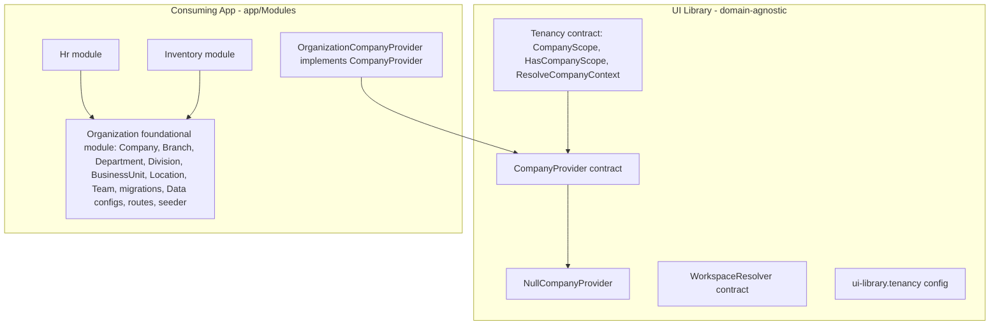

# Library vs. Module Boundary Analysis — Where Does "Organization" Belong?

> **Status**: Recommendation (analysis only — no code changed)
> **Date**: 2026-08-18
> **Package**: `quicker-faster/ui-library`
> **Question**: Is "Organization" a universal library foundation, a copyable business-domain module, or a hybrid?

---

## 1. Verdict (TL;DR)

The user's instinct — **"generic library foundation + copyable self-contained `app/Modules/*`"** — is fundamentally sound and is the correct target architecture. The current refactor mostly aligns with it, **but the Organization domain has been placed on the wrong side of the line.**

Specifically:

1. The library already has a **domain-agnostic tenancy layer** that predates this refactor: [`CompanyScope`](../../src/Scopes/CompanyScope.php), [`HasCompanyScope`](../../src/Traits/HasCompanyScope.php), [`ResolveCompanyContext`](../../src/Http/Middleware/ResolveCompanyContext.php), the [`CompanyProvider`](../../src/Contracts/Navigation/CompanyProvider.php) contract, and the [`ui-library.tenancy`](../../src/Config/ui-library.php:582) config keys. This layer treats "company" purely as a **tenant term** (a `company_id` integer and a `{id, name}` pair). That layer is genuinely universal and should stay in the library.

2. The new concrete [`Core\Organization\Models\Company`](../../src/Core/Organization/Models/Company.php) (plus `Branch`, `Department`, `Division`, `BusinessUnit`, `Location`, `Team`) is a **business-domain entity graph**, not a universal foundation. A single-tenant inventory app does not need `Divisions`; a freelance accounting app needs "Company" (the client/tenant) but not a `Department`→`Team` hierarchy. It belongs on the module side.

3. The refactor has **wired the two concepts together inside the library**, so the library's "domain-agnostic tenancy" is now coupled to a concrete `Organization\Models\Company`. That is a regression against the library's own non-negotiable principle (see [`25-library-independence-safeguards.md`](../../docs/library/25-library-independence-safeguards.md:16)).

**Recommended boundary: hybrid (c)** — the library keeps only the *minimal tenancy contract*, and the full *Organization entity graph* becomes a first-class, versioned **foundational module** that can be copied alongside other modules. Details in §4.

---

## 2. What the Code Actually Shows Today

### 2.1 The pre-existing, domain-agnostic tenancy layer (should stay)

| Piece | What it does | Domain-coupled? |
|-------|--------------|-----------------|
| [`CompanyScope`](../../src/Scopes/CompanyScope.php:21) | Filters any model by a configurable `company_id` column based on a session key. | No — generic global scope |
| [`HasCompanyScope`](../../src/Traits/HasCompanyScope.php:22) | Trait that registers `CompanyScope`. | No |
| [`ResolveCompanyContext`](../../src/Http/Middleware/ResolveCompanyContext.php:15) | Middleware that seeds the session tenant ID via `CompanyProvider`. | No — depends on the contract |
| [`CompanyProvider`](../../src/Contracts/Navigation/CompanyProvider.php:8) | Contract: `getCompanies()` / `getCurrentCompanyId()`. | No — returns `{id, name}` |
| [`WorkspaceResolver`](../../src/Contracts/Navigation/WorkspaceResolver.php:5) | Contract for workspace-context nav filtering. | No |
| [`NullCompanyProvider`](../../src/Services/Navigation/NullCompanyProvider.php:9) | No-op default. | No |
| [`ui-library.tenancy`](../../src/Config/ui-library.php:582) | `column` = `company_id`, `session_key` = `current_company_id`. | No — structural |

This is exactly the "library provides infrastructure, consuming app provides data" contract described in [`multi-tenancy.md`](../../docs/consuming-app/multi-tenancy.md:12).

### 2.2 The new concrete Organization domain (the disputed part)

- 7 models under [`src/Core/Organization/Models/`](../../src/Core/Organization/Models/) with a rich [`Company`](../../src/Core/Organization/Models/Company.php:11) schema (subdomain, billing, tax_id, parent/child hierarchy).
- 7 migrations ([`2026_06_11_000003`](../../src/Core/Organization/Database/Migrations/2026_06_11_000003_create_companies_table.php:7) through `000009`).
- Data configs, 3 dashboards, [`OrganizationSeeder`](../../src/Core/Organization/Database/Seeders/OrganizationSeeder.php:11), and `/organization/*` routes.

These are a **full CRUD domain module**, not a tenancy abstraction.

### 2.3 The bridge that couples them (the problem)

Three library-level files now import the concrete `Core\Organization\Models\Company`:

1. [`DefaultCompanyProvider`](../../src/Services/Navigation/DefaultCompanyProvider.php:6) — imports the concrete model and falls back to `Company::orderBy('name')->get()`.
2. [`CompanyRegistered`](../../src/Events/CompanyRegistered.php:5) — type-hints the concrete model in the event payload.
3. [`RegistrationController`](../../src/Http/Controllers/RegistrationController.php:5) — imports `Company`, `Location`, and `Department` and creates them.

And the shipped config now defaults `CompanyProvider` to the concrete implementation:

- [`src/Config/ui-library.php`](../../src/Config/ui-library.php:319) — `'company_provider' => DefaultCompanyProvider::class` (not `NullCompanyProvider`).
- [`UILibraryServiceProvider::register()`](../../src/Providers/UILibraryServiceProvider.php:117) — binds the contract from that key; the `NullCompanyProvider` fallback only fires if the config file is absent.

This reverses the documented "null default" design (see [`25-library-independence-safeguards.md`](../../docs/library/25-library-independence-safeguards.md:328) and §5.2).

---

## 3. Assessment: Is the Workflow Sound?

**Yes, with three guardrails.** The "generic foundation + copyable self-contained modules" model is a modular-monolith / package-by-feature architecture and is a strong fit for a freelance developer shipping multiple similar-but-different SaaS apps.

### Strengths

- **Fast project bootstrap** — fresh Laravel + `composer require` + drop in `app/Modules/*`.
- **Consistent conventions** — one DataTable/form/nav/report shape reduces cognitive load across projects.
- **Domain isolation** — HR leakage is contained in `app/Modules/Hr`, keeping the library reusable.
- **Natural reuse unit** — the module folder is the right granularity for "copy into the next project."

### Risks (and how to mitigate each)

| Risk | Consequence | Mitigation |
|------|-------------|------------|
| **Cross-module dependencies** | "Self-contained" rarely holds — `Invoicing` depends on `Organization`, `CRM`, etc. | Declare dependencies via the existing `depends_on` module key; keep a thin shared kernel in the library; never hide implicit imports. |
| **Shared-code duplication** | Currency/date/number helpers copied into many modules drift and diverge. | Rule: shared, cross-domain helper → library; module-specific helper → module. |
| **Versioning / fork drift** | A copied `app/Modules/*` folder forks; fixes don't propagate. | Treat foundational modules as **versioned packages** (Composer path/vcs repos), not raw copy-paste, once they are depended upon by more than one project. |
| **Migration conflicts** | Two modules (or the library and a module) both create the same table. | Explicit table ownership: one owner per table; modules only `ALTER` what they extend. |
| **Hidden coupling to library version** | A module written for library `v2` breaks on `v3`. | Pin the library major; document module ↔ library compatibility in the module. |

The core lesson: **"copyable module" is the right unit for business domains, but a "foundational module" (like Organization) that other modules import must be versioned and owned, not silently assumed to exist.**

---

## 4. The Organization Boundary Decision

### 4.1 Weighing the three options

**Option (a) — Organization stays in the library as a universal foundation (current state).**

- ❌ The full hierarchy (Branch/Division/BusinessUnit/Team) is **not universal** — it is an enterprise/HR org-chart concept. Forcing it on every future project violates the library's two-domain test ([`25-library-independence-safeguards.md`](../../docs/library/25-library-independence-safeguards.md:365)).
- ❌ It makes the tenancy infrastructure depend on a concrete `Company` model, breaking the documented "app provides data" contract.
- ❌ A `src/Core` module is **not copyable** — it is fixed inside the library, which defeats the stated "copy `app/Modules/*`" goal for Organization itself.

**Option (b) — Organization becomes a plain business module under `app/Modules/Organization`.**

- ✅ Aligns with the copy-paste workflow.
- ⚠️ But Organization is depended on by *everything* (HR, Admin's user form, future Invoicing). If it is an un-versioned copy-paste folder, every project silently forks the canonical org schema — the highest-risk kind of drift.

**Option (c) — Hybrid: library keeps the minimal tenancy contract; the Organization entity graph becomes a foundational module (recommended).**

- ✅ The universal part (tenant scope/middleware/contract) stays reusable in the library.
- ✅ The domain part (Company + hierarchy + CRUD UI + seeders) becomes a self-contained, copyable unit.
- ✅ Organization is treated as a **first-class foundational module** (versioned, with declared `depends_on`), so other modules can import it without the library owning its schema.

**Verdict: (c) hybrid**, with the explicit rule that Organization is a *foundational* module — same copyable shape as business modules, but versioned and treated as a shared dependency rather than throwaway scaffold.

### 4.2 The exact split line

- **Library keeps** the tenant term ("company" as `company_id` + `{id, name}`), the scope, the middleware, the `CompanyProvider`/`WorkspaceResolver` contracts, and the `NullCompanyProvider` default.
- **Organization module owns** the concrete `Company` model, its hierarchy, migrations, Data configs, dashboards, seeders, routes, the `OrganizationCompanyProvider` (its implementation of `CompanyProvider`), the org-specific registration flow, and its own `CompanyRegistered`-equivalent domain event.

---

## 5. Concrete Conflicts Found (Two Sources of Truth for "Company")

There are now **three** divergent notions of "company," plus a user-membership gap:

### 5.1 Three "Company" classes

| # | Class / concept | Where | Role |
|---|-----------------|-------|------|
| 1 | The generic tenant `company_id` (integer) + `{id, name}` pair | [`CompanyScope`](../../src/Scopes/CompanyScope.php), [`CompanyProvider`](../../src/Contracts/Navigation/CompanyProvider.php) | Tenancy infrastructure (universal) |
| 2 | `QuickerFaster\UILibrary\Core\Organization\Models\Company` | [`src/Core/Organization/Models/Company.php`](../../src/Core/Organization/Models/Company.php:11) | Concrete org-chart entity (domain) |
| 3 | `App\Models\Company` | [`home.blade.php`](../../src/Resources/views/home.blade.php:57) | Hardcoded consuming-app reference — a stray **domain leak** |

`home.blade.php` guards its "Companies" stat with `class_exists(\App\Models\Company::class)`, so in a fresh app the stat is silently `null`/hidden while the library actually ships its *own* `Company`. This is a direct contradiction and a violation of the safeguards gate (no `App\` references in `src/`).

### 5.2 `CompanyProvider` default now couples the library to the concrete model

- Documented intent: "Company resolution | `CompanyProvider` contract + **null default** | Binds tenant provider" ([`25-library-independence-safeguards.md`](../../docs/library/25-library-independence-safeguards.md:328)).
- Actual: `ui-library.navigation.company_provider` defaults to [`DefaultCompanyProvider`](../../src/Config/ui-library.php:319), which imports the concrete [`Company`](../../src/Services/Navigation/DefaultCompanyProvider.php:6).

This means the "domain-agnostic" library now *hard-depends* on `Core\Organization\Models\Company`. It is no longer possible to run the library tenancy layer without the Organization schema present.

### 5.3 `CompanyRegistered` and `RegistrationController` are domain logic in the library core

- [`CompanyRegistered`](../../src/Events/CompanyRegistered.php:16) type-hints `Core\Organization\Models\Company`.
- [`RegistrationController`](../../src/Http/Controllers/RegistrationController.php:5) creates `Company`, `Location`, and `Department` — a SaaS org-provisioning flow, not generic infrastructure.

Both are Organization-domain concerns and should live in the Organization module.

### 5.4 Admin core module is coupled to the concrete Organization model

[`src/Core/Admin/Data/user.php`](../../src/Core/Admin/Data/user.php:53) references `QuickerFaster\UILibrary\Core\Organization\Models\Company` for the `company_id` select. If Organization moves out of `src/Core`, this breaks. It should resolve the company model via config/contract, not a hardcoded FQCN.

### 5.5 User↔Company membership is not modeled consistently

- The scaffolded `users` table has a **singular** `company_id` column ([`dependencies/database/migrations/add_missing_columns_to_users_table.php`](../../dependencies/database/migrations/add_missing_columns_to_users_table.php:32)).
- [`DefaultCompanyProvider`](../../src/Services/Navigation/DefaultCompanyProvider.php:37) and [`OrganizationSwitchController`](../../src/Http/Controllers/OrganizationSwitchController.php:97) assume a **plural** `companies()` relationship.
- There is **no pivot table** (`company_user`), and the shipped [`dependencies/Models/User.php`](../../dependencies/Models/User.php:12) defines **no** `companies()` method.

Net effect today: `getCompanies()` falls through to `Company::orderBy('name')->get()`, returning **all** companies to **every** authenticated user — an authorization gap, not just a naming mismatch.

### 5.6 `companies` table ownership is ambiguous

The migration is guarded by `if (!Schema::hasTable('companies'))` ([`2026_06_11_000003_create_companies_table.php`](../../src/Core/Organization/Database/Migrations/2026_06_11_000003_create_companies_table.php:11)), while the HR app (and any consuming app) may already own a `companies` table + `App\Models\Company`. Two possible schemas can silently diverge.

---

## 6. Recommended Target Architecture

### 6.1 Library keeps (minimal tenancy contract)

Keep and harden these — they are universal and domain-agnostic:

- [`CompanyScope`](../../src/Scopes/CompanyScope.php) + [`HasCompanyScope`](../../src/Traits/HasCompanyScope.php)
- [`ResolveCompanyContext`](../../src/Http/Middleware/ResolveCompanyContext.php)
- [`CompanyProvider`](../../src/Contracts/Navigation/CompanyProvider.php) and [`WorkspaceResolver`](../../src/Contracts/Navigation/WorkspaceResolver.php)
- [`NullCompanyProvider`](../../src/Services/Navigation/NullCompanyProvider.php) as the default binding
- [`ui-library.tenancy`](../../src/Config/ui-library.php:582) config keys

### 6.2 Organization module owns (concrete domain)

Move into `app/Modules/Organization` (or, for stronger versioning, a companion package `quicker-faster/organization`):

- 7 models, 7 migrations, seeders, Data configs, 3 dashboards, `/organization/*` routes.
- A new `OrganizationCompanyProvider` implementing [`CompanyProvider`](../../src/Contracts/Navigation/CompanyProvider.php) — this is the *module's* tenant resolution.
- The registration/provisioning flow (`RegistrationController`) and its domain event.
- The consuming app binds `CompanyProvider → OrganizationCompanyProvider` only when the Organization module is installed.

### 6.3 Decouple the three leaking library files

| File | Change |
|------|--------|
| [`DefaultCompanyProvider`](../../src/Services/Navigation/DefaultCompanyProvider.php) | Remove from library core, or rewrite to be contract-only and **not** import the concrete `Company`. The concrete implementation moves to the Organization module. |
| [`CompanyRegistered`](../../src/Events/CompanyRegistered.php) | Remove the concrete `Company` type hint; either delete it from the library or make the payload neutral (e.g., `company_id` + attributes array). The Organization module fires its own domain event. |
| [`RegistrationController`](../../src/Http/Controllers/RegistrationController.php) | Move to the Organization module. |
| [`home.blade.php`](../../src/Resources/views/home.blade.php:57) | Remove the `App\Models\Company` reference; resolve the "Companies" stat through a config/contract or drop it. |
| [`Admin/Data/user.php`](../../src/Core/Admin/Data/user.php:53) | Resolve the company relationship model via config (e.g., `ui-library.organization.company_model`) instead of a hardcoded FQCN. |

### 6.4 Resolve user↔company membership

Choose one model and own it explicitly:

- **Single-tenant per user** (`users.company_id`): update `DefaultCompanyProvider`/switcher to use the singular `company()` relationship.
- **Many-to-many** (`company_user` pivot): ship the pivot migration and add `companies()` to the User model.

Do not leave the current implicit mismatch where the fallback leaks all companies.

---

## 7. Decision Rule — The Reusable Test

Apply this to **every future feature**. Answer the questions top to bottom; the first "yes" that applies wins.

### The two tests

**T1 — The two-domain test** ([`25-library-independence-safeguards.md`](../../docs/library/25-library-independence-safeguards.md:365)): *"Would this work identically for at least two unrelated domains (e.g., HR and inventory)?"*

**T2 — The capability-vs-noun test**: Is this a *capability/mechanism* (scope, contract, engine, middleware, trait) or a *business noun* (Invoice, Employee, Payroll, Branch, Department)?

### Decision table

| If the feature… | Then it goes… | Because |
|-----------------|---------------|---------|
| Is a **contract, engine, scope, middleware, trait, or config seam** with no business noun in its API | **Library (`src/`)** | It is reusable mechanism, e.g., `CompanyScope`, `Workflowable`, `Documentable`. |
| Passes the **two-domain test** and ships a **null/no-op default** | **Library (`src/`)** | The consuming app swaps in its implementation, e.g., `CompanyProvider` + `NullCompanyProvider`. |
| Names a **business entity** (Invoice, Product, Employee) or owns **domain-specific tables/views/routes** | **Module (`app/Modules/*`)** | It is a domain; only makes sense for one business. |
| Only makes sense for **one domain** | **Module (`app/Modules/*`)** | Keep the library domain-free. |
| Is a **shared structural concept that many modules import** (Organization, Address, Money) | **Foundational module** (same folder shape, but versioned + declared `depends_on`) | It is shared but still domain-flavored — version it rather than freeze it in the library. |
| Is needed by **2+ foundational modules** and has **no domain flavor at all** | **Library (`src/`)** | Promote to library only after it survives the two-domain test across real modules. |

### The "company" specific rule

> "company" the **tenant term** (`company_id`, scope, switcher, `CompanyProvider`) → **library contract**.
> "Company" the **org-chart entity** (branches, departments, teams, billing, subdomain) → **Organization module**.

This single distinction resolves the current ambiguity: keep the *mechanism* in the library, move the *entity* to a module.

---

## 8. Summary Checklist for the Refactor

- [ ] Restore `CompanyProvider` default to `NullCompanyProvider`; move `DefaultCompanyProvider` (concrete) into the Organization module.
- [ ] Move `Organization` entity graph out of `src/Core/Organization` into `app/Modules/Organization` (or a versioned companion package).
- [ ] Remove concrete `Company` type hints from `CompanyRegistered` and `RegistrationController`.
- [ ] Fix the `App\Models\Company` reference in [`home.blade.php`](../../src/Resources/views/home.blade.php:57).
- [ ] Decouple `Admin/Data/user.php` from the concrete Organization `Company` FQCN via config/contract.
- [ ] Resolve user↔company membership (singular `company_id` vs many-to-many pivot).
- [ ] Declare `Organization` as a `depends_on` dependency of modules that import it.
- [ ] Run the domain-independence gate ([`scripts/check-domain-independence.sh`](../../scripts/check-domain-independence.sh)) to confirm zero `App\` and zero concrete-organization imports remain in the generic library layer.

---

## Appendix — Evidence Inventory

| Claim | Evidence |
|-------|----------|
| Tenancy layer is domain-agnostic and predates the refactor | [`CompanyScope`](../../src/Scopes/CompanyScope.php), [`CompanyProvider`](../../src/Contracts/Navigation/CompanyProvider.php), [`ResolveCompanyContext`](../../src/Http/Middleware/ResolveCompanyContext.php), [`multi-tenancy.md`](../../docs/consuming-app/multi-tenancy.md:12) |
| Documented "null default" for CompanyProvider | [`25-library-independence-safeguards.md`](../../docs/library/25-library-independence-safeguards.md:328) §5.2 |
| Shipped default is now the concrete implementation | [`ui-library.php`](../../src/Config/ui-library.php:319) |
| Library files import the concrete `Organization\Models\Company` | [`DefaultCompanyProvider`](../../src/Services/Navigation/DefaultCompanyProvider.php:6), [`CompanyRegistered`](../../src/Events/CompanyRegistered.php:5), [`RegistrationController`](../../src/Http/Controllers/RegistrationController.php:5) |
| Stray `App\Models\Company` leak in a library view | [`home.blade.php`](../../src/Resources/views/home.blade.php:57) |
| Admin core module hardcodes the concrete Company FQCN | [`Admin/Data/user.php`](../../src/Core/Admin/Data/user.php:53) |
| User↔company membership mismatch (singular column vs plural relationship, no pivot) | [`add_missing_columns_to_users_table.php`](../../dependencies/database/migrations/add_missing_columns_to_users_table.php:32), [`DefaultCompanyProvider`](../../src/Services/Navigation/DefaultCompanyProvider.php:37), [`dependencies/Models/User.php`](../../dependencies/Models/User.php:12) |
| Organization model hierarchy is a rich domain, not a minimal tenant | [`Company`](../../src/Core/Organization/Models/Company.php:11) + 6 child models |
