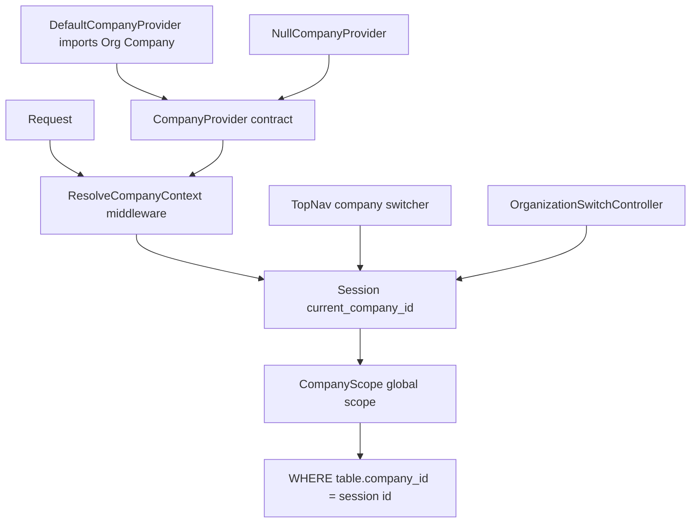

# Multi-Tenancy Foundation Analysis — "Company" vs "Tenant" vs "Workspace"

> **Status**: Analysis & recommendation (no code changed)
> **Date**: 2026-08-18
> **Package**: `quicker-faster/ui-library`
> **Question**: Under the domain-agnostic redesign (library keeps generic infrastructure, business domains become `app/Modules/*`), what happens to (1) the `company_id` tenancy foundation and (2) the company switcher in the top nav?

---

## 0. Verdict (TL;DR)

1. **The tenancy *mechanism* stays in the library, but its vocabulary is wrong.** The library's "company" concept is actually a **tenant** concept: a row-ownership key (`company_id`), a global scope, a middleware, and a `{id, name}` provider contract. "Company" must be renamed to **`tenant`** so it no longer collides with the Organization module's concrete `Company` entity. Do **not** rename it to "workspace" — "workspace" is already a different, orthogonal concept (navigation/feature context), and the word is also used by browser-style `WorkspaceTabs`.

2. **"Company" and "workspace" are NOT the same concept.** They are two distinct mechanisms that currently *overlap* by accident (the workspace context map happens to include `company_id` as one of several keys). See §A2.

3. **The tenant model becomes pluggable.** The library depends only on a `TenantProvider` contract returning `{id, name}` (+ optional metadata). It must ship `NullTenantProvider` as the default and **must not** import the concrete `Core\Organization\Models\Company`. The consuming app (or the Organization foundational module) binds its own provider (Company / Workspace / Account).

4. **The column convention for modules is `tenant_id`, made overridable** (per-model and per-app) so existing `company_id` schemas can migrate without a forced, risky rename.

5. **The switcher becomes a generic `TenantSwitcher`** driven by `TenantProvider`. It hides automatically in single-tenant apps and is configurable ("Switch workspace").

---

## Part A — Multi-Tenancy Foundation

### A1. How the current mechanism works

The current tenancy layer is a **session-driven global Eloquent scope**, wired together like this:



The pieces:

| Piece | File | Role |
|-------|------|------|
| Global scope | [`CompanyScope`](../../src/Scopes/CompanyScope.php:21) | Applies `WHERE {table}.{column} = {session id}`. Column + session key read from `config('ui-library.tenancy.column' / 'session_key')` with `company_id` / `current_company_id` defaults ([`CompanyScope.php:31-32`](../../src/Scopes/CompanyScope.php:31)). Registers a `withoutCompanyScope()` macro ([`:49`](../../src/Scopes/CompanyScope.php:49)). |
| Trait | [`HasCompanyScope`](../../src/Traits/HasCompanyScope.php:22) | `bootHasCompanyScope()` registers the global scope on any model. |
| Middleware | [`ResolveCompanyContext`](../../src/Http/Middleware/ResolveCompanyContext.php:15) | Seeds the session tenant ID via `CompanyProvider::getCurrentCompanyId()` when absent; alias `qf.resolve-company-context` ([`UILibraryServiceProvider.php:158`](../../src/Providers/UILibraryServiceProvider.php:158)). |
| Contract | [`CompanyProvider`](../../src/Contracts/Navigation/CompanyProvider.php:8) | `getCompanies(?User): Collection` (each object has at least `id`, `name`) and `getCurrentCompanyId(?User): ?int`. |
| Concrete default | [`DefaultCompanyProvider`](../../src/Services/Navigation/DefaultCompanyProvider.php:23) | **Imports the concrete `Core\Organization\Models\Company`** ([`:6`](../../src/Services/Navigation/DefaultCompanyProvider.php:6)), falls back to `Company::orderBy('name')->get()` and a synthetic "Default Company". |
| No-op default | [`NullCompanyProvider`](../../src/Services/Navigation/NullCompanyProvider.php:9) | Returns empty / null. |
| Switcher controller | [`OrganizationSwitchController`](../../src/Http/Controllers/OrganizationSwitchController.php:16) | Validates membership, writes `session('current_company_id')` ([`:55`](../../src/Http/Controllers/OrganizationSwitchController.php:55)). |
| Top nav switcher | [`TopNav`](../../src/Http/Livewire/Layouts/Navs/TopNav.php:362) | `loadCompanies()` reads the provider; `switchCompany()` writes the session and dispatches `companySwitched` ([`:410-425`](../../src/Http/Livewire/Layouts/Navs/TopNav.php:410)). |
| Config | [`ui-library.php`](../../src/Config/ui-library.php:582) | `tenancy.column` = `company_id`, `tenancy.session_key` = `current_company_id`; `navigation.company_provider` = `DefaultCompanyProvider` ([`:319`](../../src/Config/ui-library.php:319)); `multitenancy.*` switcher flags ([`:540`](../../src/Config/ui-library.php:540)). |

**Critical latent defect found while reading:** the session key is *configurable* in [`CompanyScope`](../../src/Scopes/CompanyScope.php:31) and [`ResolveCompanyContext`](../../src/Http/Middleware/ResolveCompanyContext.php:24), but is **hardcoded** to `'current_company_id'` in [`DefaultCompanyProvider`](../../src/Services/Navigation/DefaultCompanyProvider.php:92), [`OrganizationSwitchController`](../../src/Http/Controllers/OrganizationSwitchController.php:55), [`TopNav`](../../src/Http/Livewire/Layouts/Navs/TopNav.php:389), [`SidebarComposer`](../../src/Http/ViewComposers/SidebarComposer.php:141), the export/import jobs ([`ExportChunk.php:298`](../../src/Jobs/ExportChunk.php:298), [`ProcessImportChunk.php:323`](../../src/Jobs/ProcessImportChunk.php:323)), and [`ResolvesModels`](../../src/Concerns/ResolvesModels.php:152). So the documented "configurable session key" is not actually honored end-to-end. Any hardening plan must centralize session access (see `TenantContext` in §A4).

### A2. Are "company" and "workspace" the same concept?

**No — they are genuinely different, and one of them is overloaded.**

There are actually **three** things floating around under similar names:

| Term | Meaning | Data isolation? | Evidence |
|------|---------|-----------------|----------|
| **"company" / tenant** | The row-ownership partition key (`company_id`) used by `CompanyScope`, `HasCompanyScope`, `CompanyProvider`, and the switcher. | **Yes** — filters Eloquent rows. | [`CompanyScope`](../../src/Scopes/CompanyScope.php), [`CompanyProvider`](../../src/Contracts/Navigation/CompanyProvider.php) |
| **"workspace" (navigation context)** | A per-request **key/value context map** used only to decide which nav groups/items render (tenant id is *one* optional key among `role`, `department_type`, `features`, `payroll_state`, etc.). | **No** — it is UI/nav filtering, not row scoping. | [`WorkspaceResolver`](../../src/Contracts/Navigation/WorkspaceResolver.php:20), [`WorkspaceFilter`](../../src/Services/Navigation/WorkspaceFilter.php:34) |
| **"workspace tabs"** | Browser-style tab strip (session `workspace_tabs`). | No — unrelated UI state. | [`WorkspaceTabs`](../../src/Http/Livewire/Layouts/Navs/WorkspaceTabs.php:8) |

The overlap is caused by the [`WorkspaceResolver`](../../src/Contracts/Navigation/WorkspaceResolver.php:12) docblock using `'company_id' => 1` as an example context key. That is not the same as tenancy — the resolver could equally return only `['role' => 'finance_admin']` with no tenant at all. Conversely, `CompanyScope` filters database rows and knows nothing about nav groups.

**Implication for naming:** the tenancy concept should be named **`tenant`**, not "company" (collides with the org entity) and not "workspace" (collides with nav context + browser tabs). "Workspace" keeps its meaning as the *navigation context map*, and `WorkspaceTabs` is left alone (out of scope; it is already clearly UI, not domain).

### A3. Domain-agnostic tenancy vocabulary — exact rename map

Rename the tenancy layer from "company" → **"tenant"**. This keeps the *mechanism*, drops the *domain noun*, and reserves "workspace" for nav context.

| Concern | Current | Target |
|---------|---------|--------|
| **Column** (default) | `company_id` | `tenant_id` |
| **Session key** (default) | `current_company_id` | `current_tenant_id` |
| Global scope class | `Scopes\CompanyScope` | `Scopes\TenantScope` |
| Scope bypass macro | `withoutCompanyScope()` | `withoutTenantScope()` |
| Trait | `Traits\HasCompanyScope` | `Traits\HasTenantScope` |
| Trait boot hook | `bootHasCompanyScope()` | `bootHasTenantScope()` |
| Provider contract | `Contracts\Navigation\CompanyProvider` | `Contracts\Tenancy\TenantProvider` |
| Provider methods | `getCompanies()`, `getCurrentCompanyId()` | `getTenants()`, `getCurrentTenantId()` (plus optional `getCurrentTenant()`) |
| Null default | `Services\Navigation\NullCompanyProvider` | `Services\Tenancy\NullTenantProvider` |
| Concrete default | `Services\Navigation\DefaultCompanyProvider` | **Removed from library** → moves to the Organization module as `OrganizationTenantProvider` |
| Middleware | `Http\Middleware\ResolveCompanyContext` | `Http\Middleware\ResolveTenantContext` |
| Middleware alias | `qf.resolve-company-context` | `qf.resolve-tenant-context` |
| Switch controller | `Http\Controllers\OrganizationSwitchController` | `Http\Controllers\TenantSwitchController` (param `$tenantId`) |
| Session context service | *(none — session touched in ~8 files)* | `Services\Tenancy\TenantContext` (single source of truth, see §A4) |
| Registration event | `Events\CompanyRegistered` | **Removed from library** — the Organization module fires its own domain event |
| Registration controller | `Http\Controllers\RegistrationController` | **Moved to the Organization module** |
| TopNav state | `$companies`, `$currentCompanyId`, `$currentCompanyName` | `$tenants`, `$currentTenantId`, `$currentTenantName` |
| TopNav methods/event | `loadCompanies()`, `switchCompany()`, `companySwitched` | `loadTenants()`, `switchTenant()`, `tenantSwitched` |

**Config key rename map** ([`ui-library.php`](../../src/Config/ui-library.php)):

| Current key | Target key | Notes |
|-------------|-----------|-------|
| `tenancy.column = 'company_id'` | `tenancy.column = 'tenant_id'` | keep the same `tenancy.*` namespace |
| `tenancy.session_key = 'current_company_id'` | `tenancy.session_key = 'current_tenant_id'` | |
| `navigation.company_provider` (default `DefaultCompanyProvider`) | `tenancy.provider` (default `NullTenantProvider`) | move out of `navigation.*`, into `tenancy.*` |
| `navigation.show_company_switcher` (duplicated at [`ui-library.php:197`](../../src/Config/ui-library.php:197) and [`ui-library.php:333`](../../src/Config/ui-library.php:333)) | `tenancy.switcher.enabled` | collapse the duplicate keys |
| `multitenancy.switcher_roles` | `tenancy.switcher.roles` | |
| `multitenancy.all_companies_roles` | `tenancy.switcher.all_roles` | |
| `multitenancy.default_mode` | `tenancy.switcher.default_mode` | |
| `settings.resolvers.company = null` | `settings.resolvers.tenant = null` | |

Also fix the two hardcoded leaks outside the tenancy files:

- [`HasUILibraryUser::REQUIRED_FILLABLE = ['status', 'company_id']`](../../src/Traits/HasUILibraryUser.php:42) — the library must **stop requiring** `company_id` on the consuming `User` model. Tenant membership is the app's concern, exposed through `TenantProvider`.
- [`ExportController.php:197`](../../src/Http/Controllers/Exports/ExportController.php:197), [`ImportForm.php:201`](../../src/Http/Livewire/DataTables/ImportForm.php:201), [`ResolvesModels.php:135-165`](../../src/Concerns/ResolvesModels.php:135), and the export/import jobs — all must resolve the column and session key through the central `TenantContext` instead of hardcoding `company_id` / `current_company_id`.

### A4. Making the tenant model pluggable

**Principle:** the library depends on a contract, never a concrete model. The contract returns a **minimal shape** (`id`, `name`, optionally `slug`/`logo`/`code`), not an Eloquent model.

```php
// Contracts/Tenancy/TenantProvider.php
namespace QuickerFaster\UILibrary\Contracts\Tenancy;

use Illuminate\Support\Collection;
use Illuminate\Foundation\Auth\User;

interface TenantProvider
{
    /** @return Collection<int, object{id:int|string, name:string, slug?:string, logo?:string}> */
    public function getTenants(?User $user): Collection;

    public function getCurrentTenantId(?User $user): int|string|null;
}
```

**Default binding = `NullTenantProvider`** (returns empty / null). The consuming app binds its own implementation:

```php
// app/Providers/AppServiceProvider.php
$this->app->singleton(
    \QuickerFaster\UILibrary\Contracts\Tenancy\TenantProvider::class,
    \App\Tenancy\CompanyTenantProvider::class   // Company, Workspace, or Account model
);
```

Example app-side implementation (single source of truth for "which rows does this user own"):

```php
class CompanyTenantProvider implements TenantProvider
{
    public function getTenants(?User $user): Collection
    {
        return $user?->companies()->get()
            ?? Company::orderBy('name')->get();
    }

    public function getCurrentTenantId(?User $user): int|string|null
    {
        return session(config('ui-library.tenancy.session_key', 'current_tenant_id'))
            ?? $user?->default_company_id;
    }
}
```

To fix the scattered-session defect, add a **library-owned `TenantContext`** service that is the *only* place that reads/writes the session key and delegates to the provider:

```php
// Services/Tenancy/TenantContext.php
class TenantContext
{
    public function __construct(protected TenantProvider $provider) {}

    public function column(): string
    {
        return (string) config('ui-library.tenancy.column', 'tenant_id');
    }

    public function sessionKey(): string
    {
        return (string) config('ui-library.tenancy.session_key', 'current_tenant_id');
    }

    public function currentId(?User $user = null): int|string|null;

    public function setCurrent(int|string|null $id): void; // writes the session key

    public function current(?User $user = null): ?object;  // {id, name}

    public function tenants(?User $user = null): Collection;
}
```

`TenantScope`, `ResolveTenantContext`, `TenantSwitchController`, `TopNav`/`TenantSwitcher`, the jobs, and `ResolvesModels` all call `app(TenantContext::class)` instead of touching `Session`/`config` directly. This is the single most important hardening change beyond the rename.

### A5. Column convention for consuming modules

**Canonical rule:**

> New library infrastructure and new consuming-module migrations use **`tenant_id`** by default. The `HasTenantScope` trait supports a **per-model override** (and a per-app global override) so legacy `company_id` schemas do not require a forced rename.

Concretely, `HasTenantScope` resolves the column in this order:

1. Model property `protected string $tenantColumn = 'tenant_id';` (per-model override).
2. Global config `ui-library.tenancy.column` (per-app override, default `tenant_id`).

The scope queries `config('ui-library.tenancy.column', $model->tenantColumn ?? 'tenant_id')`. This keeps one code path, honors a global default, and lets a single legacy model pin `company_id` without touching the rest.

**The rule for modules:**

- **New modules**: always use `tenant_id` in migrations, `$fillable`, Data configs, and factories. Do not invent per-domain columns (`hr_company_id`, etc.).
- **`HasTenantScope`** is the only trait modules should use; it defaults to `tenant_id` and is bypassed with `withoutTenantScope()`.
- **Module models must not** reference a concrete tenant model. They only store the FK and rely on the library's scope; any relationship to `App\Models\Company` is declared inside the app/module, not in the library.

### A6. Migration path (safe, no forced DB rename)

Adopt the canonical `tenant_id` vocabulary while keeping a **configurable-column escape hatch** for existing databases. Recommended sequence:

1. **Introduce in parallel (additive).** Ship `TenantScope`, `HasTenantScope`, `TenantProvider`, `TenantContext`, `NullTenantProvider`, `ResolveTenantContext`, and `TenantSwitchController` alongside the old `Company*` classes. Provide deprecated aliases (`class CompanyScope extends TenantScope {}`, `interface CompanyProvider extends TenantProvider {}`) so existing apps keep working for one release.

2. **Centralize session/column access.** Route every internal consumer (TopNav, jobs, `ResolvesModels`, DataTable/Wizard forms, SidebarComposer) through `TenantContext`. This is a prerequisite for any rename to actually take effect.

3. **Flip the defaults.** Change `ui-library.tenancy.column` to `tenant_id` and `session_key` to `current_tenant_id`, and default the provider to `NullTenantProvider`. Existing apps that are not ready to rename set `ui-library.tenancy.column = 'company_id'` and `session_key = 'current_company_id'` in their published config to defer.

4. **Regenerate the consuming HR module** under `app/Modules/Hr` using `tenant_id` in all new migrations and models. Because the domain modules are being rebuilt as copyable units anyway, the physical rename happens at module-regeneration time, not as an in-place `ALTER`.

5. **For existing HR data (expand-and-contract), if you must preserve rows in place:**
   - `up`: add `tenant_id` (nullable, indexed); backfill `UPDATE ... SET tenant_id = company_id`; then either drop `company_id` now (if no other reader exists) or keep both and dual-write during a transition release.
   - `down`: reverse.
   - This is the standard Laravel expand-and-contract and avoids a single breaking `RENAME COLUMN`.

6. **Remove deprecated aliases** in the next major release and delete `DefaultCompanyProvider`, `CompanyRegistered`, and `RegistrationController` from the library (they move to the Organization module).

**Why configurable column is the safety valve:** it means step 4/5 is a *performance optimization of the vocabulary*, not a hard dependency of the library. A consumer can adopt the new `TenantProvider` contract *today* while still physically storing `company_id`, simply by setting the config column — no data migration required.

---

## Part B — Company Switcher

### B1. What it does today and where it renders

Two switchers exist (a duplication to clean up):

1. **Livewire switcher in [`top-nav.blade.php`](../../src/Resources/views/livewire/navs/top-nav.blade.php:199-244)** — a Bootstrap dropdown with header "Switch Company", an "All Companies" item (`id = 0`), and one item per company from `TopNav::loadCompanies()`. Rendered when `$companies` is non-empty; gated by `navigation.show_company_switcher` and `multitenancy.switcher_roles` ([`TopNav.php:362-405`](../../src/Http/Livewire/Layouts/Navs/TopNav.php:362)). `switchCompany()` writes `current_company_id`, dispatches `companySwitched`, and redirects to `/{module}/dashboard` ([`TopNav.php:410-426`](../../src/Http/Livewire/Layouts/Navs/TopNav.php:410)).

2. **`OrganizationSwitchController`** ([`OrganizationSwitchController.php`](../../src/Http/Controllers/OrganizationSwitchController.php:32)) — a Phase 4.4 HTTP controller that also writes `current_company_id`, with membership validation. It is effectively a second implementation of the same action.

The top nav renders the switcher via [`navigation-layout.blade.php:129`](../../src/Resources/views/components/layouts/navigation-layout.blade.php:129) (`<livewire:qf.top-nav ...>`).

### B2. Recommendation

Replace both with a single **generic `TenantSwitcher`** Livewire component driven entirely by `TenantProvider` + `TenantContext`. It has no knowledge of "Company", "Workspace", or "Account" — it only renders whatever `{id, name}` pairs the provider returns.

### B3. Specification

**Label (configurable):**

```php
'tenancy' => [
    'switcher' => [
        'enabled'       => true,
        'label'         => 'Switch workspace', // i18n-able
        'all_label'     => 'All workspaces',
        'roles'         => '*',                // who can see it
        'all_roles'     => [],                 // who can pick "All" (empty = nobody)
        'show_all'      => false,              // show "All tenants" mode at all
        'default_mode'  => 'first',            // first|all|none
    ],
],
```

**Visibility rule (the important change for single-tenant apps):**

- Render only when `count($tenants) > 1`, **or** when `switcher.enabled = true` **and** `switcher.force_show = true` (for apps that want to show a single "workspace" label for branding).
- Role-gate with `switcher.roles` (`'*'` = everyone).
- Render the "All tenants" item only when `show_all = true` **and** the user has a role in `all_roles`. Default `show_all = false` because "see all rows" is a privileged capability and should be opt-in, not default (`'*'`).

**Component API:**

```blade
<livewire:qf.tenant-switcher :label="$label" :force-show="$forceShow" />
```

```php
class TenantSwitcher extends Component
{
    public Collection $tenants;          // from TenantProvider
    public int|string|null $currentTenantId;
    public ?string $currentTenantName;
    public string $label;
    public bool $showAllOption;

    public function switchTenant(int|string $tenantId): void
    {
        // validate membership via TenantProvider::getTenants()
        app(TenantContext::class)->setCurrent($tenantId);
        $this->dispatch('tenantSwitched', tenantId: $tenantId);
        $this->redirect(/* resolve dashboard */);
    }
}
```

All session writes go through `TenantContext::setCurrent()` — never `Session::put('current_company_id', ...)`.

### B4. Single-tenant vs multi-tenant apps

| Scenario | Binding | Behavior |
|----------|---------|----------|
| **Freelance invoicing (single-tenant)** | Bind a `SingleTenantProvider` that returns exactly one tenant (`id=1`, `name='My Practice'`). Optionally set `tenancy.enabled = false`. | `count($tenants) === 1` → switcher hidden automatically; the scope is either a no-op or filters to the single tenant set once at login. |
| **Multi-tenant SaaS** | Bind `CompanyTenantProvider` / `WorkspaceTenantProvider` returning the user's accessible tenants. | Switcher appears when the user has >1 tenant; "All workspaces" shown only to super-admins with `all_roles`. |
| **Standalone library (no app binding)** | `NullTenantProvider` default. | Switcher hidden; scope applies no filter; zero domain assumptions. |

---

## Part C — Verdict & Decision Rule

### Verdict

Keep the tenancy *mechanism* in the library, rename its vocabulary from "company" to **"tenant"**, make the tenant model **pluggable** behind `TenantProvider` with a `NullTenantProvider` default, and move every concrete Organization artifact (the `Company` entity graph, its migrations, seeders, routes, and the `DefaultCompanyProvider` / registration flow) into the **Organization foundational module**. Generalize the top-nav switcher into a `TenantProvider`-driven **`TenantSwitcher`** that hides itself in single-tenant contexts.

### Reusable decision rule — "tenancy" vs "workspace" vs "organization"

Answer top-to-bottom; the first "yes" wins.

| If the feature… | Then it goes… | Because |
|-----------------|---------------|---------|
| **Partitions rows by who owns them** (a scope, trait, middleware, provider contract, switcher, or FK that filters Eloquent queries) | **Library (`src/`), named "tenant"** | It is a reusable mechanism with no business noun; `TenantScope`, `HasTenantScope`, `TenantProvider`, `TenantContext`. |
| **Returns a per-request context map used to decide which nav items render** (role, department, features, tenant id as one key among many) | **Library contract + app implementation, named "workspace/context"** | It is navigation/feature gating, not row isolation; `WorkspaceResolver` + `WorkspaceFilter`. |
| **Names a business entity** (Company, Department, Team, Branch, Invoice, Employee) or owns domain tables/views/routes | **Module (`app/Modules/*`)** | It is a domain; only makes sense for one business. |
| **Is a shared structural concept many modules import** (Organization entity graph) | **Foundational module**, versioned with declared `depends_on` | Shared but domain-flavored; version it rather than freeze it in the library. |
| **Is needed by 2+ foundational modules and has no domain flavor at all** | **Library (`src/`)** | Promote only after surviving the two-domain test. |

**The three-term rule:**

> - **"tenant"** = the row-ownership key (`tenant_id`, `TenantScope`, `TenantProvider`, tenant switcher) → **library infrastructure**.
> - **"workspace"** = the per-request navigation/feature context map (`WorkspaceResolver`) → **library contract, app implementation**.
> - **"Company"** (and `Department`, `Location`, `Team`, …) = business entities → **Organization module**.

This rule resolves the current ambiguity: the *mechanism* stays in the library under a neutral name, the *navigation context* stays orthogonal, and the *entity* moves to a module.

---

## Implementation Checklist

- [ ] Add `TenantScope` + `HasTenantScope` (default column `tenant_id`, per-model `$tenantColumn` override); alias old `CompanyScope`/`HasCompanyScope` as deprecated.
- [ ] Add `TenantProvider` contract + `NullTenantProvider`; alias old `CompanyProvider`.
- [ ] Add `TenantContext` service as the single reader/writer of the tenant column + session key.
- [ ] Rename `ResolveCompanyContext` → `ResolveTenantContext` and middleware alias `qf.resolve-tenant-context`.
- [ ] Rename `OrganizationSwitchController` → `TenantSwitchController`; route session writes through `TenantContext`.
- [ ] Rewire `TopNav`, export/import jobs, `ResolvesModels`, `DataTableForm`, `WizardForm`, `ImportForm`, and `SidebarComposer` to use `TenantContext`.
- [ ] Remove `company_id` from [`HasUILibraryUser::REQUIRED_FILLABLE`](../../src/Traits/HasUILibraryUser.php:42).
- [ ] Collapse `navigation.show_company_switcher` duplicates and migrate config to `tenancy.*` (see §A3).
- [ ] Default `TenantProvider` binding to `NullTenantProvider`; remove `DefaultCompanyProvider` from the library.
- [ ] Extract a `TenantSwitcher` Livewire component; replace the inline switcher in [`top-nav.blade.php`](../../src/Resources/views/livewire/navs/top-nav.blade.php:199) and retire `OrganizationSwitchController`'s duplicate.
- [ ] Move `Company`, its hierarchy models, migrations, seeders, routes, Data configs, `RegistrationController`, and the `CompanyRegistered` event into the Organization foundational module; bind `OrganizationTenantProvider` there.
- [ ] Regenerate `app/Modules/Hr` with `tenant_id`; document the expand-and-contract migration for existing `company_id` data.

---

## Evidence Inventory

| Claim | Evidence |
|-------|----------|
| Scope filters by configurable column + session key | [`CompanyScope.php:31-39`](../../src/Scopes/CompanyScope.php:31) |
| Trait registers the global scope | [`HasCompanyScope.php:27-30`](../../src/Traits/HasCompanyScope.php:27) |
| Middleware seeds session via provider | [`ResolveCompanyContext.php:21-37`](../../src/Http/Middleware/ResolveCompanyContext.php:21) |
| Provider contract is `{id, name}`-shaped | [`CompanyProvider.php:16-25`](../../src/Contracts/Navigation/CompanyProvider.php:16) |
| Library default imports concrete `Company` | [`DefaultCompanyProvider.php:6,58`](../../src/Services/Navigation/DefaultCompanyProvider.php:6) |
| Config defaults provider to concrete impl | [`ui-library.php:319`](../../src/Config/ui-library.php:319) |
| Session key is hardcoded in many places despite config | [`DefaultCompanyProvider.php:92`](../../src/Services/Navigation/DefaultCompanyProvider.php:92), [`TopNav.php:389`](../../src/Http/Livewire/Layouts/Navs/TopNav.php:389), [`OrganizationSwitchController.php:55`](../../src/Http/Controllers/OrganizationSwitchController.php:55) |
| Workspace = navigation context map, not row scoping | [`WorkspaceResolver.php:20-28`](../../src/Contracts/Navigation/WorkspaceResolver.php:20), [`WorkspaceFilter.php:34-96`](../../src/Services/Navigation/WorkspaceFilter.php:34) |
| "Workspace tabs" is unrelated browser-tab UI | [`WorkspaceTabs.php:8-27`](../../src/Http/Livewire/Layouts/Navs/WorkspaceTabs.php:8) |
| Switcher renders in top nav | [`top-nav.blade.php:199-244`](../../src/Resources/views/livewire/navs/top-nav.blade.php:199) |
| Two switcher implementations exist | [`TopNav.php:410`](../../src/Http/Livewire/Layouts/Navs/TopNav.php:410) and [`OrganizationSwitchController.php:32`](../../src/Http/Controllers/OrganizationSwitchController.php:32) |
| Library assumes `users.company_id` exists | [`HasUILibraryUser.php:42`](../../src/Traits/HasUILibraryUser.php:42), [`add_missing_columns_to_users_table.php:32`](../../dependencies/database/migrations/add_missing_columns_to_users_table.php:32) |
| Concrete `Company` is a rich domain model | [`Company.php:11-103`](../../src/Core/Organization/Models/Company.php:11) |
