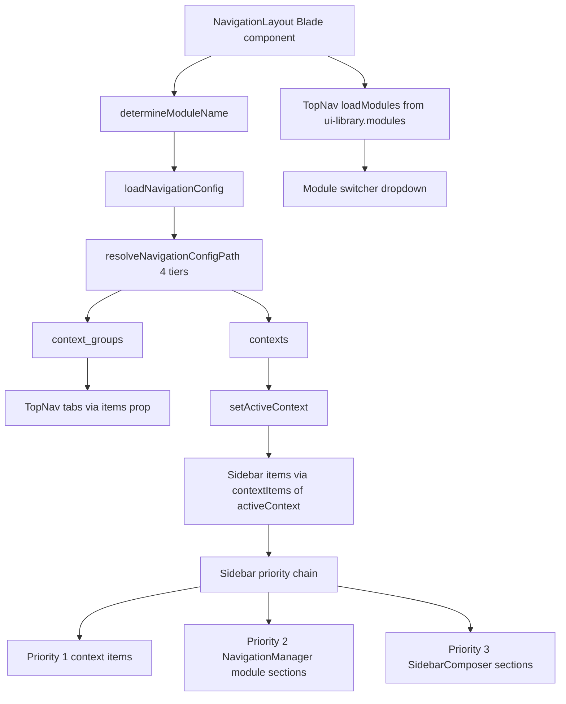

# Navigation UX & Architecture Analysis — QuickerFaster UI Library

> **Scope**: Analysis only. No files were modified.
> **Date**: 2026-08-19
> **Modules analyzed**: Organization, HR, Attendance, Leave, Payroll, Holiday (consuming app) + Admin/System (library reference)

This report documents how the navigation system actually works end-to-end, evaluates it against modern enterprise-SaaS navigation UX patterns, analyzes each module's `navigation.php`, and produces a prioritized set of improvements and a gap report.

---

## 1. Navigation Architecture Explained

### 1.1 The component graph

Navigation is owned by the library. A single [`NavigationLayout`](../../src/Components/NavigationLayout.php) Blade component orchestrates three Livewire sub-components and one optional tab strip:

| Component | Class | Role |
|-----------|-------|------|
| `NavigationLayout` | [`src/Components/NavigationLayout.php`](../../src/Components/NavigationLayout.php) | Orchestrator: loads config, determines active context, feeds sub-components |
| `TopNav` | [`src/Http/Livewire/Layouts/Navs/TopNav.php`](../../src/Http/Livewire/Layouts/Navs/TopNav.php) | Top bar: context-group tabs + module switcher + company switcher + notifications |
| `Sidebar` | [`src/Http/Livewire/Layouts/Navs/Sidebar.php`](../../src/Http/Livewire/Layouts/Navs/Sidebar.php) | Left sidebar: renders the active context group's items |
| `HorizontalContextMenu` | [`src/Http/Livewire/Layouts/Navs/HorizontalContextMenu.php`](../../src/Http/Livewire/Layouts/Navs/HorizontalContextMenu.php) | Alternative horizontal (top) menu layout |
| `MenuRenderer` | [`src/Http/Livewire/Layouts/Navs/MenuRenderer.php`](../../src/Http/Livewire/Layouts/Navs/MenuRenderer.php) | Thin switcher between sidebar and horizontal modes |
| `WorkspaceTabs` | `src/Http/Livewire/Layouts/Navs/WorkspaceTabs.php` | Browser-style tab strip (Phase 5) |

There are two orchestrator layers, which is a source of confusion worth noting up front:

1. [`src/Components/NavigationLayout.php`](../../src/Components/NavigationLayout.php) — the **Blade component** (`<x-qf::navigation-layout>`) that reads the module's `navigation.php`, resolves `context_groups` + `contexts`, and decides the active context. This is the real "glue."
2. [`src/Services/Navigation/NavigationManager.php`](../../src/Services/Navigation/NavigationManager.php) — a **service** used by `Sidebar` and [`SidebarComposer`](../../src/Http/ViewComposers/SidebarComposer.php) as a *fallback* when no active-context items are supplied. It auto-builds one sidebar section per user-facing module.

(The docs reference a `src/Http/Livewire/Layouts/NavigationLayout.php`; that file no longer exists — the Livewire-side layout was collapsed into the Blade component.)

### 1.2 How `context_groups` map to the top nav

`NavigationLayout::loadNavigationConfig()` reads the module's `navigation.php` and sets:

- `$this->contextGroups = $config['context_groups']` — the top-nav tabs.
- `$this->contextItems  = $config['contexts']` — the sidebar item map.

The Blade template [`navigation-layout.blade.php`](../../src/Resources/views/components/layouts/navigation-layout.blade.php:129) then passes `contextGroups` into `TopNav` as `$items`:

```blade
<livewire:qf.top-nav :items="$contextGroups" :activeContext="$activeContext" ... />
```

In [`top-nav.blade.php`](../../src/Resources/views/livewire/navs/top-nav.blade.php:102), `$items` are rendered as the desktop tab strip (`$this->visibleDesktop`) with overflow into a "More" dropdown (`$this->overflowDesktop`). So **each entry in `context_groups` becomes one top-nav tab**, keyed by the array key (e.g. `dashboard`, `companies`, `people`).

Important detail: a **hardcoded "Dashboard" tab** is rendered before the context groups ([`top-nav.blade.php`](../../src/Resources/views/livewire/navs/top-nav.blade.php:78)) and links to `/{module}/dashboard`. This is independent of any `dashboard` context group a module may or may not define. ~~Originally rendered unconditionally,~~ this collided with modules that define their own `dashboard` context group (e.g. Organization), producing a duplicate "Dashboard" tab. **Fixed 2026-08-19** — the hardcoded tab is now guarded with `@if (!isset($this->items['dashboard']))` so it is skipped when the module supplies its own `dashboard` context group. **Normalized 2026-08-20 (Task AC)** — Admin's capital-D `'Dashboard'` context key was normalized to lowercase `'dashboard'` across [`navigation.php`](../../src/Core/Admin/Config/navigation.php) and its Blade views, and the top-nav guard was simplified to the single `!isset($this->items['dashboard'])` check; the case-sensitivity issue is now fully resolved.

### 1.3 How `contexts` map to the sidebar

`contexts` is an associative map of `contextKey => [item, item, ...]`. The sidebar only ever renders **one context group at a time**. In [`navigation-layout.blade.php`](../../src/Resources/views/components/layouts/navigation-layout.blade.php:178):

```blade
<livewire:qf.sidebar :items="$contextItems[$activeContext] ?? []" ... />
```

So selecting a top-nav tab changes `$activeContext`, which changes which subset of `contexts` the sidebar displays. In [`sidebar.blade.php`](../../src/Resources/views/livewire/navs/sidebar.blade.php:66) there is an explicit **5-level priority chain**:

1. **Context-specific items** — when `$activeContext` is set and `$items` is non-empty (the normal case).
2. **Module sections** — [`NavigationManager`](../../src/Services/Navigation/NavigationManager.php) fallback (one collapsible section per module).
3. **Config-driven sections** — injected by [`SidebarComposer`](../../src/Http/ViewComposers/SidebarComposer.php).
4. **Flat `$items`** — backward-compatible fallback.
5. **Debug message** — when everything is empty.

### 1.4 The relationship between `context_groups`, `contexts`, and the item `context` key

This is the most subtle part of the design:

- A `context_group` entry and a `contexts` entry are linked **purely by matching array key** (slug). There is no explicit `context` field pointing one at the other.
- Individual menu items **do not carry a `context` key in their source config**. Their membership is *implicit by nesting*: an item under `contexts['people']` belongs to the `people` context.
- [`NavigationManager::loadModuleNavItems()`](../../src/Services/Navigation/NavigationManager.php:326) makes this implicit membership explicit at load time by tagging each item with `$item['_context'] = $contextKey` and `$item['module'] = $moduleKey`.

Consequence: if a `contexts` key has no matching `context_groups` key (or vice-versa), the linkage silently breaks. Items in an orphaned `contexts` key are only reachable through the `NavigationManager` "flatten everything" fallback, never through the top nav. The Attendance module exhibits exactly this bug (see §3.3).

### 1.5 How the active context is determined

[`NavigationLayout::setActiveContext()`](../../src/Components/NavigationLayout.php:189) resolves the active context in this order:

1. **Explicit `context` prop** — if the Blade call passes `context="Users & Permissions"` and that key exists in `context_groups`, use it.
2. **Route/path matching** — scan every item in every context; the first item whose `route` (named route) or `url` (path, prefix-matched) matches the current request wins.
3. **First group key** — fall back to the first key of `context_groups`.

Note the prefix-match semantics: `str_starts_with($currentPath, $pathToMatch)` means a context is "active" for any nested child page (e.g. `/hr/employees/12/edit` activates the `people` context via the `/hr/employees` item). This is correct for deep pages but means the **first matching item in iteration order wins**, which can be order-dependent if two contexts share a URL prefix.

### 1.6 How permission/role filtering works

Three independent filtering layers apply, and they are not unified:

1. **Visibility rules** — [`NavigationFilter`](../../src/Traits/NavigationFilter.php) `checkVisibility()`, supporting `any`, `auth`, `guest`, `role:X`, `permission:X`. Applied to context groups, items, and shared items in `NavigationLayout`.
2. **Workspace constraints** — [`WorkspaceFilter`](../../src/Services/Navigation/WorkspaceFilter.php):
   - `filterContextGroups()` removes a group if it has a `feature` key not present in the workspace's `features`.
   - `filterContextItems()` removes an item if its `workspace` key-value map does not fully match the resolved workspace context.
3. **Permission / gate / module-role checks** — in [`NavigationManager`](../../src/Services/Navigation/NavigationManager.php:447):
   - `gate` strings: `role:X`, `permission:X`, `can:X`.
   - `permission` field: checked via [`AuthorizationService::canAccessView()`](../../src/Services/AccessControl/AuthorizationService.php).
   - Module-level `roles` array: `checkModuleGate()` / `TopNav::loadModules()`.
   - Module `depends_on`: `areDependenciesSatisfied()`.

The item `permission` field (e.g. `view_employee`) is only enforced by `NavigationManager` in the sidebar fallback path — **not** by `NavigationLayout` when it renders context-specific sidebar items. The module configs rely on Spatie permissions (`view_*`), and a super-admin email bypass is hardcoded in [`TopNav::loadModules()`](../../src/Http/Livewire/Layouts/Navs/TopNav.php:630) (`SUPER_ADMIN_EMAIL`).

### 1.7 Config resolution priority

All three of [`NavigationLayout`](../../src/Components/NavigationLayout.php:424), [`NavigationManager`](../../src/Services/Navigation/NavigationManager.php:558), and [`Sidebar`](../../src/Http/Livewire/Layouts/Navs/Sidebar.php:302) duplicate the same 4-tier resolution for a module's `navigation.php`:

1. Published override — `resources/views/vendor/qf-core/{module}/Config/navigation.php`
2. Business module — `app/Modules/{Module}/Config/navigation.php`
3. Core module path — `config('ui-library.module_paths.core')/{Module}/Config/navigation.php`
4. Vendor fallback — `vendor/quicker-faster/ui-library/src/Core/{Module}/Config/navigation.php`

This duplication is a maintainability smell (three identical implementations).

### 1.8 How modules are switched (cross-module)

The top nav is **module-scoped**. It renders only the *current* module's `context_groups`. Switching modules happens through the **module switcher dropdown** in [`TopNav`](../../src/Http/Livewire/Layouts/Navs/TopNav.php:604) (`loadModules()`), which reads `config('ui-library.modules')`, keeps `enabled && user_facing` modules, applies role filtering, and dispatches a [`NavigationBuilding`](../../src/Events/NavigationBuilding.php) event. [`TopNav::switchModule()`](../../src/Http/Livewire/Layouts/Navs/TopNav.php:589) stores `active_module` in session and redirects to the module's `route`.

The active module is determined in [`NavigationLayout::determineModuleName()`](../../src/Components/NavigationLayout.php:115): explicit `moduleName` prop → `ConfigResolver` from `configKey` → `session('active_module')` → `'admin'`.

### 1.9 Architecture diagram



---

## 2. Modern UX Patterns

### 2.1 Top nav + sidebar (current pattern)

**How it works here**: horizontal top bar with context-group tabs + a vertical collapsible sidebar showing the active group's items.

**Pros**
- Familiar "admin console" mental model (Soft UI / AdminLTE lineage).
- Good for a **moderate** number of top-level areas (5–8 tabs).
- Two axes of navigation: "where am I" (top) and "what's here" (sidebar).

**Cons**
- When top-level groups grow beyond ~7, overflow into a "More" dropdown (already implemented here) becomes necessary and reduces discoverability.
- Sidebar content "swaps" entirely on tab switch — users can lose orientation if groups are not intuitively named.
- Scales poorly for many entities within one group (no secondary grouping inside a context).

**When it works best**: 5–8 top-level domains, 3–10 items per domain. Examples: **Laravel Nova, Backpack, early AdminLTE dashboards, Shopify admin** (left nav + secondary menu).

**Verdict for this library**: the architecture is sound, but the *data* is inconsistent (see §3). The pattern itself is appropriate for a multi-module HR suite; the fix is normalization, not a pattern change.

### 2.2 Collapsible sidebar only (no top tabs)

**How it works**: a single expandable/collapsible section tree; no horizontal top tabs.

**Pros**: scales to many modules/entities; familiar from **Stripe, Linear, GitHub (repo nav), Jira**; good for deep hierarchies.

**Cons**: hidden lower levels; needs strong group labels and a search box.

**When better**: when the app has **many** modules (10+) or deep nesting. For 6 modules it's a viable alternative but not strictly better.

**Verdict**: the library already *supports* this as the fallback path ([`NavigationManager`](../../src/Services/Navigation/NavigationManager.php) section-per-module rendering). It is a reasonable default when a module does not need top tabs.

### 2.3 Mega menus

**How it works**: hovering/focusing a top-level item reveals a large panel with grouped columns of links.

**Pros**: great for a single module with many entities (Payroll has 10+); reduces click depth; surfaces relationships.

**Cons**: complex to build accessibly; poor on touch/mobile.

**Examples**: **AWS Console, Google Admin, Salesforce setup, large e-commerce category nav**.

**Verdict**: a strong candidate for **Payroll** (10 flat items today) and **Organization** (7+ groups). The existing `HorizontalContextMenu` "show all contexts" dropdown (`showAllContexts`) is a primitive step toward this but is flat, not grouped.

### 2.4 Search-first navigation (command palette / global search)

**How it works**: Ctrl/Cmd-K opens a palette; users type to jump to any page/entity.

**Pros**: fastest path for power users; scales to any number of items; great for "find an employee / a policy" use cases.

**Cons**: poor for discoverability of *unfamiliar* features; needs a search index.

**Examples**: **Linear, Notion, GitHub, Raycast, Retool, Vercel**.

**Verdict**: the sidebar already has a **"Search menu..."** filter (Phase 5.3, [`sidebar.blade.php`](../../src/Resources/views/livewire/navs/sidebar.blade.php:26)) but it filters *menu labels only*, not records. A **global command palette** (Cmd+K) has been implemented as Phase 1 MVP (2026-08-19) — see [`QuickActionsPanel`](../../src/Http/Livewire/QuickActions/QuickActionsPanel.php) and [`quick-actions-feature-design.md`](quick-actions-feature-design.md). It currently surfaces registered actions (48 actions across 8 modules); Phases 2–4 will add tracking/ranking, a top-nav ⚡ button, and a dashboard widget. **High priority architectural recommendation — partially addressed by Phase 1 MVP.**

### 2.5 Breadcrumbs

**How it works**: horizontal trail Home → Module → Context → Section → Record.

**Pros**: aids orientation, especially on deep detail/edit pages; enables one-click "up" navigation.

**Examples**: **GitHub, Jira, AWS Console**.

**Verdict**: already implemented in [`NavigationLayout::getBreadcrumbItems()`](../../src/Components/NavigationLayout.php:244) and gated by `layout.breadcrumb.enabled`. It is well-designed (5 levels, uses `page_title` for the leaf). The weakness is that many module items set `page_title => NULL`, so the leaf often falls back to the label.

### 2.6 Tab-based navigation (workspace tabs)

**How it works**: browser-style tabs let users keep multiple records/pages open and switch between them.

**Pros**: power-user multitasking; state preservation; standard in devtools and increasingly in SaaS.

**Examples**: **VS Code, Postman, Grafana, Datadog, Linear**.

**Verdict**: already implemented as `WorkspaceTabs` (Phase 5) and enabled by default in the consuming app (`config('ui-library.layout.workspace_tabs.enabled', true)`). `navigation.open_in_tabs` exists to open sidebar links in tabs (currently `false`). Enabling `open_in_tabs` would make tab navigation actually useful.

### 2.7 Progressive disclosure

**How it works**: hide complexity (advanced settings, rare actions) behind "Show more", collapsible sections, or a settings context.

**Pros**: reduces cognitive load; keeps primary flows clean.

**Examples**: **Stripe** (advanced options collapsed), **GitHub** (repository settings nested).

**Verdict**: partially present — `HorizontalContextMenu` overflow, collapsible sidebar sections, and the "More" top-nav dropdown are all forms of this. Missing: collapsing low-priority entities (e.g. Payroll's "Payslip Items" and "Policy Assignments" which are `order: 999`) behind a secondary disclosure.

### 2.8 Pattern summary

| Pattern | Status in library | Priority to adopt |
|---|---|---|
| Top nav + sidebar | ✅ Implemented | Keep, normalize data |
| Collapsible sidebar only | ✅ Implemented (fallback) | Use as default for 1-group modules |
| Mega menus | ⚠️ Primitive (`showAllContexts`) | **High** for Payroll/Organization |
| Search-first nav | ✅ Phase 1 MVP (Cmd+K palette) | Extend with tracking/ranking (Phases 2–4) |
| Breadcrumbs | ✅ Implemented | Fix `page_title` data |
| Workspace tabs | ✅ Implemented | Enable `open_in_tabs` |
| Progressive disclosure | ⚠️ Partial | Use for `order: 999` items |

---

## 3. Per-Module Analysis

> Module configs live outside this workspace at `app/Modules/{Module}/Config/navigation.php` in the consuming app.

### 3.1 Organization

**Context groups (7)**: `dashboard`, `companies`, `structure`, `teams`, `locations`, `classification`, `reports`.

**Strengths**
- Clean, ascending `order` (10/20/30/...).
- Clear, domain-accurate labels.
- Has the full `sidebar` config block (only module that does).
- `Companies`, `Structure`, `Locations` use dashboard-overview entry pages — a good "hub" pattern.

**Issues**
- **7 top-level tabs** is at the upper edge of the top-nav overflow threshold (`max_desktop` defaults to 5), so 2+ tabs land in "More" on desktop.
- **Many context items point to entities not in the Organization roster** (roster = Company, Branch, Department, Division, BusinessUnit, Location, Team). Missing models/routes: `Legal Entities` (`legal_entities`), `Regions`, `Countries`, `Addresses`, `Tags`, `Categories`, `Labels`, `Custom Fields`.
- **Nested 3-segment routes** (`/organization/dashboard/organization-summary`, `/organization/dashboard/growth`, `/organization/reports/companies`, etc.) will **404** via the catch-all route (see §6.1). ~~The 4 report routes are now fixed (2026-08-19)~~ — explicit routes + views were added for `/organization/reports/{companies,departments,locations,growth}`; the 3 `dashboard/*` paths remain unresolved.
- `teams` context has only one item and no overview — inconsistent with sibling groups that each have an Overview.

**Recommendations**
- Merge `classification` (Tags/Categories/Labels/Custom Fields) into a single "Classification" that only lists entities that actually exist.
- Move `reports` out of the top nav; reports belong under a global Reports surface or the breadcrumb context, not as a peer to `companies`.
- Remove or stub the not-yet-implemented entities until their models/routes exist.

### 3.2 HR

**Context groups (3)**: `Organization` (order 10000), `people` (order 999), `manage` (order 998).

**Strengths**
- Three clear domains: org structure, daily people operations, and administrative management.
- Rich `people` set (6 items): Overview, Employees, Employee Profiles, Positions, Teams, Employee Groups — focused on daily-use entities.
- `manage` group (4 items): Job Titles, Tags, Job History, Documents — occasional/rare administrative tasks separated from daily operations.
- The `people` → `people` + `manage` split follows the operational-vs-administrative pattern established across other modules.

**Issues**
- **Ordering is semantically inverted** — `Organization` (10000) sorts *after* `people` (999) and `manage` (998), yet organization should logically precede people.
- **Duplicate domain with the Organization module**: HR's `Organization` context re-lists Companies, Departments, Locations — all of which also live in the standalone Organization module. This is the biggest cross-module duplication in the suite.
- **Inconsistent permission on `company`**: uses `manage-system` instead of a `view_company`-style permission.
- No `sidebar` config block (minor — defaults apply).

**Recommendations**
- **Delete the `Organization` context group from HR** and rely on the Organization module for companies/departments/locations. Keep HR focused on `people` and `manage`.
- Reorder: `people` first, `manage` second, drop the org group.

### 3.3 Attendance

**Context groups (2 declared)**: `time` (order 999), `policies` (order 10000).

**Issues — this module has the most structural problems.**

1. **Three orphaned contexts with no matching context group**: `attendance_adjustment`, `clock_event`, `attendance_session`. They will never appear in the top nav and are only reachable via the `NavigationManager` flatten fallback. They are effectively dead navigation entries.
2. **URL-prefix mismatch**: the `time` and `policies` items use `/hr/...` URLs (`/hr/attendances`, `/hr/shifts`, `/hr/work-patterns`, `/hr/attendance-policies`) — the **HR** module prefix — not `/attendance/...`. Meanwhile the Attendance module's own [`Routes/web.php`](app/Modules/Attendance/Routes/web.php) defines un-prefixed routes (`attendances`, `work-patterns`, `attendance-policies`).
3. **Orphaned contexts use single-segment, non-catch-all URLs** (`/attendance-adjustments`, `/clock-events`, `/attendance-sessions`) that will 404 (see §6.1).
4. **Duplicate `order` values** (`attendance_policy` and `work_pattern` both `order: 2`).
5. **`Shift Schedules` (`shift_schedule`, order 5) and `Shifts` (`shift`, order 6)** are arguably the same concept as the `Shift` model (roster has Shift, WorkPattern, ClockEvent, AttendancePolicy — no ShiftSchedule model).

**Recommendations**
- Create a `context_groups` entry for clock events / sessions / adjustments, or move them under `time`/`policies`.
- Correct all routes to `/attendance/...` (or the agreed module prefix) and add index routes so navigation does not depend on cross-module catch-all resolution.
- Merge `shift_schedule` into `shift`, or add the missing `ShiftSchedule` model.
- Fix the duplicate `order` values.

### 3.4 Leave

**Context group (1)**: `leave` (order 1000). Five items: Overview, Leave Types, Leave Requests, Leave Balances, Approval Rules.

**Strengths**
- Single clear domain; concise.
- Sensible item set.

**Issues**
- **Label/order mismatch**: `Approval Rules` (key `leave_approver`, order 4) sorts before `Leave Balances` (order 999), yet the source lists balances third. Balances would render last, after approval rules — not the intuitive order.
- **Label inconsistency**: `Approval Rules` vs. the more standard `Approvers`/`Leave Approvers`.
- No `sidebar` config block.
- `/leave/dashboard-leave-overview` uses the `/leave/` prefix while the actual route file defines `dashboard-leave-overview` at the root (`/dashboard-leave-overview`) — inconsistent.

**Recommendations**
- Rename `Approval Rules` → `Approvers` and fix `order` values to be sequential (1,2,3,4,5).
- Reorder to Overview, Requests, Types, Balances, Approvers (frequency-of-use ordering) or keep entity ordering but fix `order`.

### 3.5 Payroll

**Context group (1)**: `payroll` (order 999). Ten items.

**Strengths**
- Complete entity coverage for the Payroll roster (PayrollRun, Payslip, PaySchedule, PayrollPolicy, adjustments, etc.).
- Logical grouping under a single "Payroll" concept.

**Issues**
- **Ten flat items** is too many for one sidebar list — the top candidate for **mega-menu / sub-grouping**.
- **Non-breaking hyphen bug**: `One‑Time Adjustments` uses U+2011 (`‑`) instead of ASCII `-`. This will render inconsistently and may break slug-matching/URLs.
- **Label collision**: `Employee Profiles` here (employee_payroll_profile) vs HR's `Profiles`/`Employee Profiles` — ambiguous.
- **`order` gaps**: `payslip_item` and `payroll_policy_assignment` are `order 999` (dumped to the end) while others are 1–9.
- No `sidebar` config block.

**Recommendations**
- Split into 2–3 context groups: **Processing** (Runs, Payslips, Adjustments) and **Configuration** (Schedules, Policies, Profiles, Items, Assignments), or adopt a grouped mega menu.
- Fix the non-breaking hyphen.
- Rename `Employee Profiles` → `Payroll Profiles`.
- Rationalize `order`.

### 3.6 Holiday

**Context group (1)**: `holidays` (order 10000). Three items: Holiday Calendars, Holidays, Batch Create.

**Strengths**
- **The cleanest module in the suite.** Routes in [`Routes/web.php`](app/Modules/Holiday/Routes/web.php) match the navigation URLs exactly (`/holiday/...`), and all three entries have backing routes.
- Sensible ordering (calendar first, then holidays, then batch create).

**Issues**
- Minor: context group key is plural `holidays` while label is "Holidays" — fine, but the group `url` points directly to `holiday/holiday-calendars` (the first item) rather than a dedicated overview.
- `Batch Create` uses `create_holiday` permission while others use `view_*` — acceptable (it is an action, not a view) but worth noting as a deliberate exception.

**Verdict**: use Holiday as the **reference template** for the other modules.

### 3.7 Label/consistency matrix

| Concept | Organization | HR | Attendance | Leave | Payroll | Holiday |
|---|---|---|---|---|---|---|
| Landing item | `Overview` | `Overview` | `Overview` | `Overview` | `Overview` | *(none)* |
| Employee profiles | — | `Profiles` | — | — | `Employee Profiles` | — |
| Approvers | — | — | — | `Approval Rules` | — | — |
| Company | `All Companies` | `Companies` | — | — | — | — |
| Team | `All Teams` | `Teams` | — | — | — | — |
| Location | `All Locations` | `Locations` | — | — | — | — |

The `All X` vs plain-plural split between Organization and HR is the most visible inconsistency.

---

## 4. Cross-Module Navigation

### 4.1 How it actually works today

The top nav is **module-scoped**, not merged. The current module's `context_groups` render as tabs; switching modules is a separate dropdown driven by `config('ui-library.modules')`.

This answers the key question directly: **the top nav does NOT show all modules' context groups.** The "all context groups merged into one top nav" assumption is false — each module shows its own groups, and cross-module movement happens via the module switcher.

### 4.2 Module registry gaps

The consuming app's [`config/ui-library.php`](../../../../../LaravelProjects/hr-consuming-app/config/ui-library.php) module registry only explicitly defines `admin`, `system`, `organization`, `common`. The five business modules (HR, Attendance, Leave, Payroll, Holiday) are expected to self-register via `module.json` / `ModuleServiceProvider`. If any of those lack a registry entry, they will not appear in the module switcher (and `NavigationLayout::determineModuleName()` will fall back to `admin`).

### 4.3 The duplication problem

Companies, Departments, Locations, and Teams appear in **both** the Organization module and HR's `Organization` context. This creates:

- Two different URLs for the same concept (`/organization/companies` vs `/hr/companies`).
- Two different permission surfaces.
- Cognitive confusion about "which module owns what."

**Recommendation**: establish a clear ownership boundary — Organization owns the structural entities; HR owns people. Remove structural entities from HR's nav. The module switcher should be the only way to reach Organization.

### 4.4 Is the current approach intuitive?

Partially. The module switcher + per-module context tabs is a **standard and sound** two-level pattern (comparable to AWS "services" + "service console"). However it is undermined by:

1. Duplicate domains across modules (org entities in HR).
2. Inconsistent URL prefixes (`/hr/` for attendance data, un-prefixed routes elsewhere).
3. Module registry gaps (business modules not explicitly registered).
4. No visual distinction between "module" and "context" — both are dropdown/tab-like controls in the same bar.

**Recommended target model**: a **primary module switcher (left or app-switcher)** + **per-module context tabs** + **context-aware sidebar**, with a **command palette** as the escape hatch for record-level jumps.

---

## 5. Recommendations (prioritized)

### 5.1 Quick wins (labels, ordering, data hygiene)

1. Fix the **non-breaking hyphen** in Payroll's `One‑Time Adjustments` → `One-Time Adjustments`.
2. Fix **duplicate `order` values** in Attendance (`attendance_policy` and `work_pattern` both order 2).
3. Normalize labels: use noun-plural consistently (`Companies`, `Locations`, `Teams`) or `All X`; pick one convention. Rename Leave `Approval Rules` → `Approvers`. (HR labels `Profiles` → `Employee Profiles` and `Current Jobs` → `Positions` were already normalized.)
4. Reorder HR so `people` and `manage` precede `Organization`; reorder Leave items so Balances comes before Approvers.
5. Add the missing `sidebar` config block to HR, Attendance, Leave, Payroll, Holiday (Organization already has it) for consistency.
6. Rationalize Payroll `order` values (no more `999` dumps mixed with 1–9).
7. Populate `page_title` (currently `NULL` almost everywhere) to improve breadcrumbs and page titles.

### 5.2 Structural improvements (context-group reorganization)

1. **Remove structural entities from HR** (Companies, Departments, Locations) — Organization owns them.
2. **Fix Attendance contexts**: either add context groups for the orphaned `attendance_adjustment`, `clock_event`, `attendance_session`, or fold them into `time`/`policies`. Correct all Attendance routes to `/attendance/...`.
3. **Split Payroll** into 2–3 context groups or a grouped mega menu (Processing vs Configuration).
4. **Trim Organization** from 7 to ~5 groups by merging `classification` and moving `reports` off the top nav.
5. **Merge `shift_schedule` into `shift`** or add the missing model.
6. Adopt Holiday as the **golden reference** and align every other module's `url`/`route` scheme to it.

### 5.3 Architectural improvements (new UX patterns)

1. ~~**Global command palette** (Ctrl/Cmd-K)~~ — **Phase 1 MVP implemented** (2026-08-19). See [`QuickActionsPanel`](../../src/Http/Livewire/QuickActions/QuickActionsPanel.php) and [`quick-actions-feature-design.md`](quick-actions-feature-design.md). Remaining: Phase 2 tracking/ranking, Phase 3 top-nav ⚡ button + dashboard widget, Phase 4 favorites/keyboard shortcuts.
2. **Enable `open_in_tabs`** so sidebar links open in `WorkspaceTabs`, making the already-built tab strip useful.
3. **Promote grouped mega menus** for Payroll and Organization (extend `HorizontalContextMenu::showAllContexts` from flat list to grouped columns).
4. **Unify the three duplicated `resolveNavigationConfigPath()` implementations** into one shared service/helper.
5. **Unify permission filtering** — ensure `NavigationLayout` context-item rendering applies the same `permission`/`gate` checks as `NavigationManager` (currently context items bypass `checkPermission`).
6. **Explicit `context` key on items** — consider making membership explicit in config (rather than implicit nesting) to make orphaned contexts a runtime error rather than a silent disappearance.
7. **Add a module-registry audit** — verify all 6 business modules are actually registered (visible in the switcher); the consuming-app config only lists 4.

---

## 6. Gap Report

### 6.1 Broken links / routes that will 404

The catch-all route ([`src/Core/System/Routes/web.php`](../../src/Core/System/Routes/web.php:18)) is `GET /{module}/{view}/{id?}` with `where('id', '[0-9]+')`. This means **any 3-segment URL with a non-numeric third segment 404s**, and **any 1-segment URL 404s** (no module/view pair).

**Organization module — 3-segment paths (will 404):**
- `/organization/dashboard/organization-summary`
- `/organization/dashboard/growth`
- `/organization/dashboard/recent-changes`
- ~~`/organization/reports/companies`, `/organization/reports/departments`, `/organization/reports/locations`, `/organization/reports/growth`~~ — **fixed 2026-08-19**: explicit routes + views added (now render as minimal placeholder pages)

**Organization module — entities without models/routes (likely 404 via catch-all view miss):**
- `/organization/legal-entities` (no LegalEntity model)
- `/organization/regions`, `/organization/countries`, `/organization/addresses` (no models)
- `/organization/tags`, `/organization/categories`, `/organization/labels`, `/organization/custom-fields` (no models)
- `/organization/organization-chart` (no explicit route)

**Attendance module — single-segment paths (will 404, not catch-all shaped):**
- `/attendance-adjustments` (orphaned context)
- `/clock-events` (orphaned context)
- `/attendance-sessions` (orphaned context)

**Attendance module — cross-module prefix confusion:**
- `/hr/attendances`, `/hr/shifts`, `/hr/work-patterns`, `/hr/attendance-policies` resolve through `hr::` views, but these are Attendance entities whose views live under `attendance::`.

### 6.2 Duplicate route definitions (route-name collision)

- `attendance-policies.create`, `attendance-policies.show`, `attendance-policies.edit` are defined in **both** [`Hr/Routes/web.php`](app/Modules/Hr/Routes/web.php:30) (`hr::attendance-policies` views) and [`Attendance/Routes/web.php`](app/Modules/Attendance/Routes/web.php:22) (`attendance::attendance-policies` views). Laravel registers both; the last-loaded wins for `route()` generation, and one module's views are effectively shadowed.
- Similarly `attendances.*`, `work-patterns.*`, `employees.*`, `locations.*`, `employee-profiles.*`, `employee-positions.*`, `employee-job-histories.*` are defined in HR (un-prefixed) while Attendance/Payroll also reference overlapping concepts.

### 6.3 Missing navigation entries

- **Organization** entities with models but potentially no nav presence as separate entities: the roster lists 7 models, but the nav adds 8 phantom entities (LegalEntity, Region, Country, Address, Tag, Category, Label, CustomField) that have no models.
- **Attendance** `ClockEvent` model exists but its nav entry is orphaned (no context group).
- **Payroll** roster (11 models) vs nav (10 items) — a few models (e.g. PayslipItem is present; verify PayrollRunAdjustment vs EmployeeAdjustmentProfile both present) appear covered, but the 999-order items are effectively hidden.

### 6.4 Inconsistencies summary

| Type | Detail |
|---|---|
| URL prefix | Attendance uses `/hr/`; Leave mixes `/leave/` with root; Payroll mixes `/payroll/` index with un-prefixed CRUD |
| Labels | `All X` vs plain plural; `Profiles` vs `Employee Profiles`; `Approval Rules` vs `Approvers` |
| Ordering | `999`/`10000` sentinel values vs clean 10/20/30; duplicate order values |
| `sidebar` config | Only Organization defines it |
| `page_title` | `NULL` in almost every item |
| Context linkage | Attendance has 3 orphaned contexts; HR has a duplicate `Organization` context |
| Module registry | Only 4 of 6 modules explicitly registered in consuming-app config |

---

## Appendix: Key files

- [`src/Components/NavigationLayout.php`](../../src/Components/NavigationLayout.php) — orchestrator (context_groups → TopNav, contexts → Sidebar)
- [`src/Services/Navigation/NavigationManager.php`](../../src/Services/Navigation/NavigationManager.php) — sidebar fallback + permission/gate filtering
- [`src/Http/Livewire/Layouts/Navs/TopNav.php`](../../src/Http/Livewire/Layouts/Navs/TopNav.php) — top nav + module switcher
- [`src/Http/Livewire/Layouts/Navs/Sidebar.php`](../../src/Http/Livewire/Layouts/Navs/Sidebar.php) — sidebar renderer + section building
- [`src/Http/Livewire/Layouts/Navs/MenuRenderer.php`](../../src/Http/Livewire/Layouts/Navs/MenuRenderer.php) — sidebar/horizontal switch
- [`src/Http/Livewire/Layouts/Navs/HorizontalContextMenu.php`](../../src/Http/Livewire/Layouts/Navs/HorizontalContextMenu.php) — horizontal menu + overflow
- [`src/Traits/NavigationFilter.php`](../../src/Traits/NavigationFilter.php) — visibility filtering
- [`src/Services/Navigation/WorkspaceFilter.php`](../../src/Services/Navigation/WorkspaceFilter.php) — workspace/feature filtering
- [`src/Http/ViewComposers/SidebarComposer.php`](../../src/Http/ViewComposers/SidebarComposer.php) — organization data + sidebar sections
- [`src/Events/NavigationBuilding.php`](../../src/Events/NavigationBuilding.php) — module list event
- [`src/Core/System/Routes/web.php`](../../src/Core/System/Routes/web.php) — catch-all route
- [`docs/library/06-navigation-system.md`](../../docs/library/06-navigation-system.md) — navigation docs
