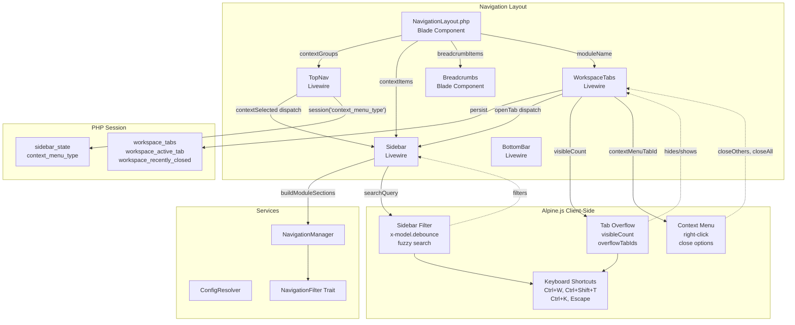
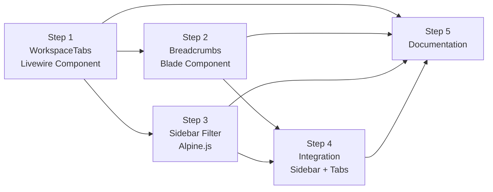

# Phase 5: Navigation & UX Polish — Livewire + Blade + Alpine.js Re-Plan

> **Date**: 2026-08-10  
> **Status**: Planning complete  
> **Replaces**: Original Phase 5 Vue.js assumptions in [`implementation-plan.md`](implementation-plan.md:1219-1347)  
> **Stack**: Laravel Livewire 3 + Blade + Alpine.js (packaged with Livewire 3) + Bootstrap 5  

---

## Table of Contents

1. [Stack Mapping: Vue → Livewire/Blade/Alpine](#1-stack-mapping-vue--livewirebladealpine)
2. [5.1 WorkspaceTabs — Livewire Component](#51-workspacetabs--livewire-component)
3. [5.2 Breadcrumbs — Enhanced Blade Component](#52-breadcrumbs--enhanced-blade-component)
4. [5.3 Sidebar Module Filtering — Alpine.js Enhancement](#53-sidebar-module-filtering--alpinejs-enhancement)
5. [5.4 Documentation](#54-documentation)
6. [Component Architecture Diagram](#6-component-architecture-diagram)
7. [Implementation Sequence](#7-implementation-sequence)

---

## 1. Stack Mapping: Vue → Livewire/Blade/Alpine

| Vue Concept | Livewire/Blade/Alpine Equivalent | Notes |
|---|---|---|
| Vue reactive `data()` | Livewire `public` properties (`$openTabs`, `$activeTabId`) | Auto-synced between server and client; persisted to PHP `session()` |
| Vue `computed` | Livewire computed properties + Alpine `x-data` getters | Livewire for server state; Alpine for pure-UI calculations (visible tab count) |
| Vue `watch` | Livewire `updated*()` hook methods | `updatedActiveTabId()` fires on property change |
| Vue `methods` | Livewire public methods (`closeTab()`, `switchTab()`) | Called via `wire:click` in Blade templates |
| Vue `v-model` | `wire:model` (Livewire) + `x-model` (Alpine) | `wire:model` for server-synced state; `x-model` for ephemeral UI state |
| Vue `v-if`/`v-show` | `@if`/`@else` (Blade) + `x-show`/`x-if` (Alpine) | Blade for server-rendered conditionals; Alpine for client-side toggling |
| Vue `v-for` | `@foreach` (Blade) | Server-rendered loops |
| Vue `@click` | `wire:click` (Livewire method) or `@click` (Alpine expression) | `wire:click` triggers server roundtrip; `@click` for pure client-side |
| Vue `$emit` | `$this->dispatch('eventName', data)` (Livewire) | Cross-component communication via browser events |
| Vue `$route` | Laravel `Route::currentRouteName()` / `request()->path()` | Route matching in PHP; no client-side router needed |
| Vue `nextTick` | `$nextTick` magic in Alpine; Livewire re-render cycle | Alpine for DOM-ready callbacks |
| Vue SPA navigation | Full page loads via `wire:navigate` or standard `<a href>` | Livewire 3's `wire:navigate` for SPA-like transitions |
| Vuex/Pinia store | Livewire properties + PHP session | State lives on server; persistent across pages via `session()` |
| Vue `keep-alive` | `wire:key` + Livewire component persistence | `wire:key` controls component identity across re-renders |

---

## 2. 5.1 WorkspaceTabs — Livewire Component

### 2.1 Overview

A browser-style tab system that lets users keep multiple pages open simultaneously within the application. Users can open a page in a new tab, switch between tabs, close tabs, and reopen recently closed tabs — all backed by PHP session persistence.

### 2.2 File Paths

| Role | Path | Type |
|---|---|---|
| **Component class** | [`src/Http/Livewire/Layouts/Navs/WorkspaceTabs.php`](../src/Http/Livewire/Layouts/Navs/WorkspaceTabs.php) | New Livewire component |
| **Blade view** | [`src/Resources/views/livewire/navs/workspace-tabs.blade.php`](../src/Resources/views/livewire/navs/workspace-tabs.blade.php) | New Blade + Alpine.js view |
| **Integration point** | [`src/Resources/views/components/layouts/navigation-layout.blade.php`](../src/Resources/views/components/layouts/navigation-layout.blade.php:148) | Render between TopNav and main content |
| **Alpine store** | Inline in view (no separate JS file) | Alpine `x-data` on root element |
| **CSS** | [`public/assets/css/quicker-faster.css`](public/assets/css/quicker-faster.css) | Reuse existing; add tab-specific styles |

### 2.3 Livewire Properties

```php
// WorkspaceTabs.php
namespace QuickerFaster\UILibrary\Http\Livewire\Layouts\Navs;

use Livewire\Component;

class WorkspaceTabs extends Component
{
    /** @var array<int, array{id: string, label: string, url: string, icon: string|null, context: string|null}> */
    public array $openTabs = [];

    /** @var string|null Currently focused tab ID */
    public ?string $activeTabId = null;

    /** @var array<int, array{id: string, label: string, url: string}> Closed tabs for Ctrl+Shift+T restore */
    public array $recentlyClosed = [];

    /** @var int Maximum number of tabs allowed simultaneously */
    public int $maxTabs = 15;

    /** @var bool Whether tab overflow chevron dropdown is visible */
    public bool $showOverflow = false;

    public function mount(): void
    {
        // Restore from PHP session (survives page navigations within the module)
        $this->openTabs = session('workspace_tabs', []);
        $this->activeTabId = session('workspace_active_tab', null);
        $this->recentlyClosed = session('workspace_recently_closed', []);
    }
}
```

### 2.4 Livewire Methods

```php
/**
 * Open a new tab (or focus existing if URL matches).
 * Called from sidebar nav clicks via wire:click or dispatched event.
 */
public function openTab(string $label, string $url, ?string $icon = null, ?string $context = null): void
{
    // Deduplicate: if tab with this URL exists, focus it
    foreach ($this->openTabs as $tab) {
        if ($tab['url'] === $url) {
            $this->activeTabId = $tab['id'];
            $this->persist();
            return;
        }
    }

    // Enforce max tabs
    if (count($this->openTabs) >= $this->maxTabs) {
        // Remove the least-recently-used tab (first in array)
        array_shift($this->openTabs);
    }

    $id = uniqid('tab_', true);
    $this->openTabs[] = [
        'id'      => $id,
        'label'   => $label,
        'url'     => $url,
        'icon'    => $icon,
        'context' => $context,
    ];
    $this->activeTabId = $id;
    $this->persist();
}

/**
 * Close a tab by ID.
 */
public function closeTab(string $tabId): void
{
    $tab = collect($this->openTabs)->firstWhere('id', $tabId);
    if ($tab) {
        $this->recentlyClosed[] = $tab;
        // Keep only last 10 in recently-closed
        if (count($this->recentlyClosed) > 10) {
            array_shift($this->recentlyClosed);
        }
    }

    $this->openTabs = array_values(array_filter(
        $this->openTabs,
        fn($t) => $t['id'] !== $tabId
    ));

    // If closed tab was active, activate the adjacent tab
    if ($this->activeTabId === $tabId) {
        $this->activeTabId = !empty($this->openTabs)
            ? $this->openTabs[count($this->openTabs) - 1]['id']
            : null;
    }

    $this->persist();
}

/**
 * Reopen the most recently closed tab (Ctrl+Shift+T).
 */
public function reopenLastClosed(): void
{
    if (empty($this->recentlyClosed)) {
        return;
    }

    $tab = array_pop($this->recentlyClosed);
    $this->openTabs[] = $tab;
    $this->activeTabId = $tab['id'];
    $this->persist();
}

/**
 * Close all tabs except the one with the given ID.
 */
public function closeOthers(string $keepTabId): void
{
    $this->openTabs = array_values(array_filter(
        $this->openTabs,
        fn($t) => $t['id'] === $keepTabId
    ));
    $this->activeTabId = $keepTabId;
    $this->persist();
}

/**
 * Close all tabs to the right of the given ID.
 */
public function closeAllToRight(string $anchorTabId): void
{
    $anchorIndex = null;
    foreach ($this->openTabs as $i => $tab) {
        if ($tab['id'] === $anchorTabId) {
            $anchorIndex = $i;
            break;
        }
    }

    if ($anchorIndex === null) return;

    $this->openTabs = array_slice($this->openTabs, 0, $anchorIndex + 1);

    if ($this->activeTabId && !collect($this->openTabs)->firstWhere('id', $this->activeTabId)) {
        $this->activeTabId = $anchorTabId;
    }

    $this->persist();
}

/**
 * Close all tabs.
 */
public function closeAll(): void
{
    $this->recentlyClosed = array_merge($this->recentlyClosed, $this->openTabs);
    if (count($this->recentlyClosed) > 10) {
        $this->recentlyClosed = array_slice($this->recentlyClosed, -10);
    }
    $this->openTabs = [];
    $this->activeTabId = null;
    $this->persist();
}

/**
 * Switch to a specific tab.
 */
public function switchTab(string $tabId): void
{
    $this->activeTabId = $tabId;
    $this->persist();
}

/**
 * Persist all tab state to PHP session.
 */
protected function persist(): void
{
    session([
        'workspace_tabs'            => $this->openTabs,
        'workspace_active_tab'      => $this->activeTabId,
        'workspace_recently_closed' => $this->recentlyClosed,
    ]);
}

public function render()
{
    return view('qf::livewire.navs.workspace-tabs');
}
```

### 2.5 Alpine.js Interactions (in Blade View)

```blade
{{-- workspace-tabs.blade.php --}}
<div
    x-data="{
        // ---- Overflow Calculation ----
        containerWidth: 0,
        tabWidths: [],
        visibleCount: 0,
        overflowTabIds: [],

        init() {
            this.calculateOverflow();
            window.addEventListener('resize', () => this.calculateOverflow());
            this.$watch('$wire.openTabs', () => { $nextTick(() => this.calculateOverflow()); });
        },

        calculateOverflow() {
            const container = this.$refs.tabStrip;
            if (!container) return;
            this.containerWidth = container.clientWidth - 40; // Reserve space for chevron button
            this.tabWidths = [];
            this.overflowTabIds = [];

            const allTabs = container.querySelectorAll('.workspace-tab');
            const openTabs = this.$wire.openTabs;
            let totalWidth = 0;

            allTabs.forEach((el, i) => {
                const w = el.offsetWidth;
                totalWidth += w;
                if (totalWidth <= this.containerWidth && i < openTabs.length) {
                    this.visibleCount = i + 1;
                }
            });

            if (openTabs.length > this.visibleCount) {
                this.overflowTabIds = openTabs.slice(this.visibleCount).map(t => t.id);
            } else {
                this.overflowTabIds = [];
            }
        },

        // ---- Context Menu ----
        showContextMenu: false,
        contextMenuTabId: null,
        contextMenuX: 0,
        contextMenuY: 0,

        openContextMenu(event, tabId) {
            this.contextMenuTabId = tabId;
            this.contextMenuX = event.clientX;
            this.contextMenuY = event.clientY;
            this.showContextMenu = true;
        },

        closeContextMenu() {
            this.showContextMenu = false;
            this.contextMenuTabId = null;
        },

        closeOthers() {
            if (this.contextMenuTabId) {
                this.$wire.closeOthers(this.contextMenuTabId);
            }
            this.closeContextMenu();
        },

        closeAllToRight() {
            if (this.contextMenuTabId) {
                this.$wire.closeAllToRight(this.contextMenuTabId);
            }
            this.closeContextMenu();
        },

        closeAll() {
            this.$wire.closeAll();
            this.closeContextMenu();
        }
    }"
    x-on:keydown.window="
        if ($event.ctrlKey && $event.key === 'w') {
            $event.preventDefault();
            if ($wire.activeTabId) $wire.closeTab($wire.activeTabId);
        }
        if ($event.ctrlKey && $event.shiftKey && $event.key === 'T') {
            $event.preventDefault();
            $wire.reopenLastClosed();
        }
    "
    class="workspace-tabs-container border-bottom bg-light"
>
    {{-- Tab Strip --}}
    <div x-ref="tabStrip" class="d-flex align-items-center" style="overflow: hidden; height: 36px;">
        @foreach ($openTabs as $index => $tab)
            <div
                class="workspace-tab d-flex align-items-center px-3 py-1 {{ $tab['id'] === $activeTabId ? 'active bg-white border-top border-primary border-2' : 'text-muted' }}"
                style="cursor: pointer; white-space: nowrap; font-size: 0.8rem; max-width: 180px; user-select: none;"
                x-show="{{ $index }} < visibleCount || {{ $index }} === 0"
                x-transition
                wire:key="workspace-tab-{{ $tab['id'] }}"
                wire:click="switchTab('{{ $tab['id'] }}')"
                x-on:click.aux.prevent="closeTab('{{ $tab['id'] }}')"
                x-on:contextmenu.prevent="openContextMenu($event, '{{ $tab['id'] }}')"
                title="{{ $tab['label'] }} — {{ $tab['url'] }}"
            >
                @if ($tab['icon'])
                    <i class="{{ $tab['icon'] }} me-1 opacity-6" style="font-size: 0.7rem;"></i>
                @endif
                <span class="text-truncate">{{ $tab['label'] }}</span>
                <button
                    class="btn-close ms-2"
                    style="font-size: 0.45rem;"
                    wire:click.stop="closeTab('{{ $tab['id'] }}')"
                    aria-label="Close tab"
                ></button>
            </div>
        @endforeach

        {{-- Overflow Chevron --}}
        <div x-show="overflowTabIds.length > 0" class="dropdown" style="flex-shrink: 0;">
            <button
                class="btn btn-sm btn-link text-muted px-2"
                data-bs-toggle="dropdown"
                aria-label="More tabs"
            >
                <i class="fas fa-chevron-down" style="font-size: 0.7rem;"></i>
            </button>
            <ul class="dropdown-menu dropdown-menu-end shadow">
                @foreach ($openTabs as $tab)
                    <li x-show="overflowTabIds.includes('{{ $tab['id'] }}')">
                        <a class="dropdown-item d-flex align-items-center {{ $tab['id'] === $activeTabId ? 'active' : '' }}"
                           href="#" wire:click.prevent="switchTab('{{ $tab['id'] }}')">
                            @if ($tab['icon'])
                                <i class="{{ $tab['icon'] }} me-2 opacity-6"></i>
                            @endif
                            <span class="text-truncate">{{ $tab['label'] }}</span>
                            <button class="btn-close ms-auto" style="font-size: 0.4rem;"
                                    wire:click.stop="closeTab('{{ $tab['id'] }}')"></button>
                        </a>
                    </li>
                @endforeach
            </ul>
        </div>
    </div>

    {{-- Context Menu (right-click on tab) --}}
    <div
        x-show="showContextMenu"
        x-on:click.outside="closeContextMenu()"
        x-on:keydown.escape.window="closeContextMenu()"
        class="position-fixed bg-white border rounded shadow-sm py-1"
        style="z-index: 9999; min-width: 180px;"
        :style="'left: ' + contextMenuX + 'px; top: ' + contextMenuY + 'px;'"
        x-cloak
    >
        <a class="dropdown-item" href="#" x-on:click.prevent="closeOthers()">
            <i class="fas fa-times-circle me-2 opacity-6"></i> Close Others
        </a>
        <a class="dropdown-item" href="#" x-on:click.prevent="closeAllToRight()">
            <i class="fas fa-arrow-right me-2 opacity-6"></i> Close All to Right
        </a>
        <a class="dropdown-item" href="#" x-on:click.prevent="closeAll()">
            <i class="fas fa-trash me-2 opacity-6"></i> Close All
        </a>
        @if (!empty($recentlyClosed))
            <div class="dropdown-divider"></div>
            <a class="dropdown-item" href="#" wire:click.prevent="reopenLastClosed">
                <i class="fas fa-undo me-2 opacity-6"></i> Reopen Closed Tab
            </a>
        @endif
    </div>
</div>
```

### 2.6 Integration with NavigationLayout

In [`navigation-layout.blade.php`](../src/Resources/views/components/layouts/navigation-layout.blade.php:148), render WorkspaceTabs between the top-nav and main content:

```blade
{{-- After the TopNav and before the main content area --}}
@if ($layoutConfig['workspace_tabs']['enabled'] ?? true)
    <livewire:qf.workspace-tabs
        wire:key="workspace-tabs-{{ $moduleName }}"
    />
@endif
```

### 2.7 Opening Tabs from Sidebar

Sidebar nav items open tabs by dispatching a Livewire event instead of navigating directly:

```blade
{{-- In sidebar-item.blade.php, add optional data attribute --}}
<a href="{{ $item['route'] ?? '#' }}"
   class="nav-link ..."
   {{-- Phase 5: open in workspace tab --}}
   @if(config('ui-library.navigation.open_in_tabs', false))
       wire:click.prevent="$dispatch('openWorkspaceTab', {
           label: '{{ $item['label'] }}',
           url: '{{ url($item['route']) }}',
           icon: '{{ $item['icon'] ?? 'fas fa-circle' }}',
           context: '{{ $activeContext ?? '' }}'
       })"
   @endif
>
```

And `WorkspaceTabs` listens:

```php
// In WorkspaceTabs::boot() or via #[On] attribute
#[On('openWorkspaceTab')]
public function handleOpenTabEvent(array $data): void
{
    $this->openTab(
        label: $data['label'],
        url: $data['url'],
        icon: $data['icon'] ?? null,
        context: $data['context'] ?? null,
    );
}
```

### 2.8 Keyboard Shortcuts Summary

| Shortcut | Action | Implementation |
|---|---|---|
| Ctrl+W | Close active tab | Alpine `x-on:keydown.window` in Blade view |
| Ctrl+Shift+T | Reopen last closed tab | Alpine `x-on:keydown.window` in Blade view |
| Middle-click tab | Close tab | Alpine `x-on:click.aux.prevent` on tab element |
| Right-click tab | Open context menu | Alpine `x-on:contextmenu.prevent` on tab element |
| Click tab | Switch to tab | Livewire `wire:click="switchTab($id)"` |

### 2.9 Edge Cases Handled

| Edge Case | Behavior |
|---|---|
| Max tabs exceeded (15) | Remove least-recently-used tab (first in array) |
| All tabs closed | Show empty tab strip; next sidebar click opens new tab |
| Tab URL already open | Focus existing tab instead of duplicating |
| Session timeout | Tabs restored from `session()` on next mount via `mount()` |
| Browser refresh | Tabs survive because state is in PHP session, not just Alpine |
| Very long tab labels | CSS `text-truncate` + `max-width: 180px` |
| Tab overflow (narrow screen) | Alpine-calculated chevron dropdown for overflow tabs |

---

## 3. 5.2 Breadcrumbs — Enhanced Blade Component

### 3.1 Current State vs. Target State

**Current** ([`breadcrumb.blade.php`](../src/Resources/views/components/breadcrumb.blade.php)):
- Simple `@foreach` loop rendering a flat `<ol class="breadcrumb">`
- No truncation for many segments
- No mobile-responsive behavior
- Data comes from [`NavigationLayout::getBreadcrumbItems()`](../src/Components/NavigationLayout.php:213-227) which builds 2-3 level breadcrumbs

**Target**:
- 5-level breadcrumb support: `Application → Workspace → Section → Page → Record`
- Collapse middle segments when > 4 levels with "..." dropdown
- Mobile: show only last 2 segments + "..." back link
- Visual polish: separator icons, active state, hover effects

### 3.2 File Paths

| Role | Path | Type |
|---|---|---|
| **Component class** | [`src/Components/Breadcrumbs.php`](../src/Components/Breadcrumbs.php) | New Blade component class |
| **Blade view** | [`src/Resources/views/components/breadcrumbs.blade.php`](../src/Resources/views/components/breadcrumbs.blade.php) | New view (replaces existing) |
| **Existing view** | [`src/Resources/views/components/breadcrumb.blade.php`](../src/Resources/views/components/breadcrumb.blade.php) | Remove or deprecate |
| **Data source** | [`src/Components/NavigationLayout.php`](../src/Components/NavigationLayout.php:213-227) | Enhanced `getBreadcrumbItems()` |
| **Page header** | [`src/Resources/views/components/layouts/partials/page-header.blade.php`](../src/Resources/views/components/layouts/partials/page-header.blade.php:120-122) | Update `<x-breadcrumb>` to `<x-breadcrumbs>` |

### 3.3 Component Class

```php
// src/Components/Breadcrumbs.php
namespace QuickerFaster\UILibrary\Components;

use Illuminate\View\Component;

class Breadcrumbs extends Component
{
    /**
     * @param  array<int, array{label: string, url: string|null}> $segments
     * @param  int  $maxVisible  Maximum segments before collapsing (default: 4)
     * @param  bool $showHome    Whether to prepend "Home" segment
     */
    public function __construct(
        public array $segments = [],
        public int $maxVisible = 4,
        public bool $showHome = true,
    ) {}

    /**
     * Get segments with "Home" prepended if configured.
     */
    public function allSegments(): array
    {
        $items = $this->segments;

        if ($this->showHome && config('quicker-faster-ui.breadcrumb.show_home', true)) {
            array_unshift($items, [
                'label' => __('Home'),
                'url'   => url('/'),
            ]);
        }

        return $items;
    }

    /**
     * Determine if collapsing is needed.
     */
    public function shouldCollapse(): bool
    {
        return count($this->allSegments()) > $this->maxVisible;
    }

    /**
     * Get visible segments (first + last 2 when collapsed).
     */
    public function visibleSegments(): array
    {
        $all = $this->allSegments();
        if (!$this->shouldCollapse()) {
            return $all;
        }

        // Show: first segment + "..." + last 2 segments
        $first = [reset($all)];
        $lastTwo = array_slice($all, -2);

        return array_merge($first, $lastTwo);
    }

    /**
     * Get hidden middle segments (for the "..." dropdown).
     */
    public function hiddenSegments(): array
    {
        if (!$this->shouldCollapse()) {
            return [];
        }

        $all = $this->allSegments();
        // Exclude first and last 2
        return array_slice($all, 1, -2);
    }

    public function render()
    {
        return view('qf::components.breadcrumbs');
    }
}
```

### 3.4 Blade View Structure

```blade
{{-- breadcrumbs.blade.php --}}
@props(['segments' => [], 'maxVisible' => 4, 'showHome' => true])

@php
    $allSegments = $segments;
    if ($showHome && config('quicker-faster-ui.breadcrumb.show_home', true)) {
        array_unshift($allSegments, ['label' => __('Home'), 'url' => url('/')]);
    }
    $shouldCollapse = count($allSegments) > $maxVisible;
    $visibleSegments = $shouldCollapse
        ? array_merge([reset($allSegments)], array_slice($allSegments, -2))
        : $allSegments;
    $hiddenSegments = $shouldCollapse ? array_slice($allSegments, 1, -2) : [];
@endphp

<nav aria-label="breadcrumb" {{ $attributes->merge(['class' => '']) }}>
    <ol class="breadcrumb mb-0" itemscope itemtype="https://schema.org/BreadcrumbList">
        {{-- Mobile: show only last segment with back arrow --}}
        <li class="breadcrumb-item d-md-none">
            <a href="{{ $visibleSegments[count($visibleSegments) - 2]['url'] ?? '#' }}"
               class="text-decoration-none">
                <i class="fas fa-arrow-left me-1"></i>
                <span>{{ $visibleSegments[count($visibleSegments) - 2]['label'] ?? __('Back') }}</span>
            </a>
        </li>

        {{-- Desktop: full breadcrumb --}}
        @php $position = 1; @endphp
        @foreach ($visibleSegments as $index => $segment)
            <li class="breadcrumb-item d-none d-md-flex align-items-center
                       {{ $loop->last ? 'active fw-semibold' : '' }}"
                @if ($loop->last) aria-current="page" @endif
                itemprop="itemListElement" itemscope itemtype="https://schema.org/ListItem">

                @if ($index === 1 && $shouldCollapse)
                    {{-- "..." dropdown for collapsed middle segments --}}
                    <div class="dropdown" x-data="{ open: false }">
                        <a class="text-muted text-decoration-none dropdown-toggle"
                           href="#" role="button"
                           x-on:click.prevent="open = !open"
                           aria-label="{{ __('Show more breadcrumbs') }}">
                            <i class="fas fa-ellipsis-h"></i>
                        </a>
                        <ul class="dropdown-menu shadow" x-show="open" x-on:click.outside="open = false" x-cloak>
                            @foreach ($hiddenSegments as $hidden)
                                <li>
                                    <a class="dropdown-item" href="{{ $hidden['url'] ?? '#' }}">
                                        {{ $hidden['label'] }}
                                    </a>
                                </li>
                            @endforeach
                        </ul>
                    </div>
                @endif

                @if (!$loop->last)
                    <a href="{{ $segment['url'] ?? '#' }}"
                       class="text-muted text-decoration-none"
                       itemprop="item">
                        <span itemprop="name">{{ $segment['label'] }}</span>
                    </a>
                    <meta itemprop="position" content="{{ $position++ }}">
                @else
                    <span itemprop="name">{{ $segment['label'] }}</span>
                    <meta itemprop="position" content="{{ $position++ }}">
                @endif
            </li>
        @endforeach
    </ol>
</nav>

<style>
    /* Breadcrumb separators */
    .breadcrumb-item + .breadcrumb-item::before {
        content: "/";
        color: #adb5bd;
        padding: 0 0.5rem;
    }

    /* Active segment */
    .breadcrumb-item.active {
        color: #344767;
    }

    /* Hover on links */
    .breadcrumb-item a:hover {
        color: #0d6efd !important;
    }

    /* Mobile: only show last 2 segments with back arrow */
    @media (max-width: 767.98px) {
        .breadcrumb-item.d-md-none {
            display: flex !important;
        }
    }
</style>
```

### 3.5 Data Flow from NavigationLayout

Update [`NavigationLayout::getBreadcrumbItems()`](../src/Components/NavigationLayout.php:213-227) to build up to 5 levels:

```php
public function getBreadcrumbItems(): array
{
    $items = [];

    // Level 1: Home
    if (config('quicker-faster-ui.breadcrumb.show_home', true)) {
        $items[] = ['label' => __('Home'), 'url' => url('/')];
    }

    // Level 2: Application (module name)
    $items[] = [
        'label' => $this->moduleName,
        'url'   => url('/' . strtolower($this->moduleName) . '/dashboard'),
    ];

    // Level 3: Workspace (active context group)
    if ($this->activeContext && isset($this->contextGroups[$this->activeContext])) {
        $group = $this->contextGroups[$this->activeContext];
        $items[] = [
            'label' => $group['label'],
            'url'   => $group['route']
                ? (str_contains($group['route'], '/') ? url($group['route']) : route($group['route']))
                : ($group['url'] ?? null),
        ];
    }

    // Level 4: Section (from NavigationManager sections — when current item has a parent section)
    // Resolved by checking if the current page belongs to a section within the active context
    $section = $this->resolveCurrentSection();
    if ($section) {
        $items[] = ['label' => $section['label'], 'url' => null]; // Sections typically don't have their own URL
    }

    // Level 5: Page/Record (current context item)
    if ($this->currentContextItem) {
        $items[] = [
            'label' => $this->currentContextItem['page_title'] ?? $this->currentContextItem['label'],
            'url'   => null, // Current page — no link
        ];
    }

    return $items;
}

/**
 * Resolve the current section if the active page belongs to one.
 */
protected function resolveCurrentSection(): ?array
{
    if (!$this->activeContext || !$this->currentContextItem) {
        return null;
    }

    // Check if NavigationManager provides sections for the active context
    try {
        $sections = app(NavigationManager::class)->getSections();
    } catch (\Exception $e) {
        return null;
    }

    $currentRoute = $this->currentContextItem['route'] ?? null;
    if (!$currentRoute) return null;

    foreach ($sections as $section) {
        foreach ($section['items'] as $item) {
            if (($item['route'] ?? null) === $currentRoute) {
                return [
                    'label' => $section['label'],
                    'key'   => $section['key'],
                ];
            }
        }
    }

    return null;
}
```

### 3.6 Integration

Update [`page-header.blade.php`](../src/Resources/views/components/layouts/partials/page-header.blade.php:120-122):

```blade
{{-- Before --}}
<x-breadcrumb :items="$breadcrumbItems" />

{{-- After --}}
<x-breadcrumbs :segments="$breadcrumbItems" :maxVisible="4" />
```

---

## 4. 5.3 Sidebar Module Filtering — Alpine.js Enhancement

### 4.1 Overview

Add a real-time search/filter input at the top of the existing sidebar. No new component — this enhances [`sidebar.blade.php`](../src/Resources/views/livewire/navs/sidebar.blade.php) with Alpine.js `x-data` for filtering, keyboard shortcuts, and focus management.

### 4.2 No New Files — Changes to Existing Files

| File | Change |
|---|---|
| [`src/Resources/views/livewire/navs/sidebar.blade.php`](../src/Resources/views/livewire/navs/sidebar.blade.php) | Add search bar at top; wrap item list with Alpine filter logic |
| [`src/Resources/views/livewire/navs/partials/sidebar-section.blade.php`](../src/Resources/views/livewire/navs/partials/sidebar-section.blade.php) | Add `x-show` bound to filter visibility |
| [`src/Resources/views/livewire/navs/partials/sidebar-item.blade.php`](../src/Resources/views/livewire/navs/partials/sidebar-item.blade.php) | Add `x-show` bound to filter match |

### 4.3 Alpine.js Data & Methods

Added to the existing `x-data` in [`sidebar.blade.php`](../src/Resources/views/livewire/navs/sidebar.blade.php:5-17):

```javascript
x-data="{
    // ---- Existing: Section expansion ----
    expandedSections: {{ Js::from($expandedSections) }},
    toggle(key) { /* existing */ },
    isExpanded(key) { /* existing */ },

    // ---- NEW: Search/Filter ----
    searchQuery: '',
    searchFocused: false,
    selectedIndex: -1,       // For keyboard arrow navigation
    visibleItemCount: 0,     // Count of currently visible items
    allFilterableItems: [],  // Populated in init()

    init() {
        // Collect all filterable items on mount
        this.$nextTick(() => {
            this.allFilterableItems = [
                ...this.$el.querySelectorAll('[data-sidebar-filterable]')
            ];
            this.updateVisibleCount();
        });

        // Watch for Livewire re-renders (e.g., context switch)
        this.$watch('$wire.items', () => {
            this.$nextTick(() => {
                this.allFilterableItems = [
                    ...this.$el.querySelectorAll('[data-sidebar-filterable]')
                ];
                this.updateVisibleCount();
            });
        });
    },

    // Fuzzy match: item's data-filter-text contains all words from query
    matchesFilter(item) {
        const query = this.searchQuery.toLowerCase().trim();
        if (!query) return true;
        const text = (item.dataset.filterText || '').toLowerCase();
        const words = query.split(/\s+/);
        return words.every(w => text.includes(w));
    },

    // Apply filter to all items
    applyFilter() {
        this.allFilterableItems.forEach(el => {
            const match = this.matchesFilter(el);
            el.style.display = match ? '' : 'none';

            // If item is in a section, also check if section should stay visible
            const section = el.closest('.sidebar-section-body');
            const sectionHeader = el.closest('li')?.previousElementSibling;
        });
        this.selectedIndex = -1;
        this.updateVisibleCount();
    },

    updateVisibleCount() {
        this.visibleItemCount = this.allFilterableItems.filter(
            el => el.style.display !== 'none'
        ).length;
    },

    // Keyboard handlers
    onSearchKeydown(event) {
        const visibleItems = this.allFilterableItems.filter(
            el => el.style.display !== 'none'
        );

        if (event.key === 'ArrowDown') {
            event.preventDefault();
            this.selectedIndex = Math.min(this.selectedIndex + 1, visibleItems.length - 1);
            visibleItems[this.selectedIndex]?.querySelector('a')?.focus();
        } else if (event.key === 'ArrowUp') {
            event.preventDefault();
            this.selectedIndex = Math.max(this.selectedIndex - 1, 0);
            visibleItems[this.selectedIndex]?.querySelector('a')?.focus();
        } else if (event.key === 'Enter' && this.selectedIndex >= 0) {
            event.preventDefault();
            visibleItems[this.selectedIndex]?.querySelector('a')?.click();
        } else if (event.key === 'Escape') {
            this.searchQuery = '';
            this.applyFilter();
            this.$refs.searchInput.blur();
        }
    },

    // Clear search
    clearSearch() {
        this.searchQuery = '';
        this.applyFilter();
        this.$refs.searchInput.focus();
    }
}"
```

### 4.4 Blade Template Additions

Insert at the top of [`sidebar.blade.php`](../src/Resources/views/livewire/navs/sidebar.blade.php), right after the opening `<div>` and before the `<ul class="nav flex-column mt-3">` (around line 25):

```blade
{{-- Phase 5.3: Search/Filter Bar --}}
<div class="px-3 pt-2 pb-1" x-show="true">
    <div class="input-group input-group-sm" :class="{ 'is-focused': searchFocused }">
        <span class="input-group-text bg-transparent border-end-0" id="sidebar-search-icon">
            <i class="fas fa-search text-muted" style="font-size: 0.75rem;"
               :class="{ 'text-primary': searchFocused }"></i>
        </span>
        <input
            type="text"
            x-ref="searchInput"
            x-model.debounce.150ms="searchQuery"
            x-on:input="applyFilter()"
            x-on:focus="searchFocused = true"
            x-on:blur="searchFocused = false"
            x-on:keydown="onSearchKeydown($event)"
            class="form-control border-start-0 ps-0"
            placeholder="{{ __('qf::nav.filter_modules') }}"
            aria-label="{{ __('Filter navigation') }}"
            aria-describedby="sidebar-search-icon"
            style="font-size: 0.78rem;"
        >
        <button
            x-show="searchQuery.length > 0"
            x-on:click="clearSearch()"
            class="btn btn-sm btn-link text-muted p-0 px-1"
            style="font-size: 0.6rem;"
            type="button"
            aria-label="{{ __('Clear filter') }}"
        >
            <i class="fas fa-times"></i>
        </button>
    </div>
    {{-- No results message --}}
    <div
        x-show="searchQuery.length > 0 && visibleItemCount === 0"
        class="text-muted small text-center py-3"
        x-cloak
    >
        <i class="fas fa-search-minus me-1"></i>
        {{ __('qf::nav.no_results') }}
    </div>
</div>
```

### 4.5 Data Attributes on Sidebar Items

Each sidebar item that should be filterable needs a `data-sidebar-filterable` attribute:

```blade
{{-- In sidebar-item.blade.php, add to the <li> --}}
<li class="nav-item text-nowrap"
    wire:key="sidebar-item-{{ $item['key'] ?? $item['label'] }}"
    data-sidebar-filterable
    data-filter-text="{{ $item['label'] }} {{ $item['key'] ?? '' }} {{ $activeContext ?? '' }}">
```

And section headers (in `sidebar-section.blade.php`) also get a `data-filter-text` for the section label:

```blade
<li class="nav-item mb-1" wire:key="sidebar-section-{{ $sectionKey }}"
    data-sidebar-filterable
    data-filter-text="{{ $sectionLabel }}"
    x-show="searchQuery === '' || matchesFilter($el) || $el.querySelectorAll('[data-sidebar-filterable][style*=\"display: none\"]').length < $el.querySelectorAll('[data-sidebar-filterable]').length">
```

### 4.6 Keyboard Shortcuts

| Shortcut | Action | Implementation |
|---|---|---|
| Ctrl+K / Cmd+K | Focus search input | Global `x-on:keydown.window` listener in sidebar root |
| Escape | Clear search + blur input | `x-on:keydown` handler on input |
| Arrow Down | Move selection highlight down | `x-on:keydown` handler, increments `selectedIndex` |
| Arrow Up | Move selection highlight up | `x-on:keydown` handler, decrements `selectedIndex` |
| Enter | Navigate to selected item | Clicks the `<a>` tag of the selected item |
| Type | Real-time fuzzy filter | `x-model.debounce.150ms` triggers `applyFilter()` |

The Ctrl+K global listener (added to sidebar root `x-data`):

```javascript
// In sidebar root x-data init():
window.addEventListener('keydown', (e) => {
    if ((e.ctrlKey || e.metaKey) && e.key === 'k') {
        e.preventDefault();
        this.$refs.searchInput?.focus();
    }
});
```

### 4.7 Fuzzy Matching Strategy

**Simple word-based match** — sufficient for typical navigation trees (10–50 items per context):

```
Query: "emp loc"
Matches: "Employee Locations" (both words found)
Matches: "Employment Location" (both words found)
No match: "Employees" (only one word)
No match: "Locations" (only one word)
```

Each word in the query must appear somewhere in the item's `data-filter-text` (label + key + context). Case-insensitive. No external library dependency.

---

## 5. 5.4 Documentation

### 5.1 Document: Architecture Blueprint Update

Update [`docs/architecture/00-index.md`](../README.md) or create:

**`docs/architecture/phase-5-navigation-ux.md`** — Navigation & UX Architecture:

1. **Livewire Navigation Component Tree**: Mermaid diagram showing component hierarchy
2. **WorkspaceTabs Pattern**: Livewire state management via `session()`, Alpine.js overflow calculation, keyboard shortcut registration
3. **Breadcrumb Component Pattern**: Data flow from `NavigationLayout` → `Breadcrumbs` Blade component, 5-level segment model
4. **Sidebar Filter Pattern**: Alpine.js `x-data` + `x-model.debounce` + `data-filter-text` attribute convention
5. **Alpine.js in the Library**: Updated policy reflecting that Alpine is intentionally used for client-side UX (filtering, overflow, context menus) while Livewire handles server state

### 5.2 Document: Component READMEs

**`docs/components/workspace-tabs.md`**:
- Purpose, screenshot
- How to enable/disable via `layoutConfig`
- Livewire API reference (properties, methods)
- Alpine.js behavior reference
- Keyboard shortcuts
- Session persistence model

**`docs/components/breadcrumbs.md`**:
- Purpose, screenshot
- Blade component API (`$segments`, `$maxVisible`, `$showHome`)
- Collapse behavior explanation
- Mobile responsive behavior
- Schema.org structured data note

**`docs/components/sidebar-filter.md`**:
- Purpose, screenshot
- Alpine.js data model reference
- Fuzzy matching algorithm explanation
- Keyboard shortcut reference
- How to add `data-sidebar-filterable` to custom navigation items

### 5.3 Document: Updated Implementation Plan

Update [`docs/implementation-plan.md`](docs/implementation-plan.md:1219-1347) — replace the Vue-centric Phase 5 section with a summary referencing this plan.

### 5.4 Language File Updates

Add translation keys to [`public/lang/en/nav.php`](public/lang/en/nav.php):

```php
'filter_modules' => 'Filter modules...',
'no_results' => 'No matching items',
'more_tabs' => 'More tabs',
'close_others' => 'Close Others',
'close_all_to_right' => 'Close All to Right',
'close_all' => 'Close All',
'reopen_closed_tab' => 'Reopen Closed Tab',
```

And [`public/lang/es/nav.php`](public/lang/es/nav.php) with Spanish equivalents.

### 5.5 Existing Plan Updates

Update [`docs/ai-optimized-architecture-blueprint.md`](./ai-optimized-architecture-blueprint.md) to:
- Replace Vue references in navigation section with Livewire/Blade/Alpine patterns
- Add WorkspaceTabs to component inventory
- Update AlpineJS policy (§10) to reflect intentional use for client-side UX

---

## 6. Component Architecture Diagram



---

## 7. Implementation Sequence

The tasks are ordered by dependency. Each step is self-contained and can be verified independently.

### Step 1: Create WorkspaceTabs Livewire Component

**Files to create:**
1. [`src/Http/Livewire/Layouts/Navs/WorkspaceTabs.php`](../src/Http/Livewire/Layouts/Navs/WorkspaceTabs.php) — full component class
2. [`src/Resources/views/livewire/navs/workspace-tabs.blade.php`](../src/Resources/views/livewire/navs/workspace-tabs.blade.php) — Blade + Alpine.js view

**Files to modify:**
3. [`src/Resources/views/components/layouts/navigation-layout.blade.php`](../src/Resources/views/components/layouts/navigation-layout.blade.php:148) — register `<livewire:qf.workspace-tabs>` between TopNav and main content, gated by `layoutConfig`
4. [`src/Config/ui-library.php`](../src/Config/ui-library.php) — add `workspace_tabs.enabled` key (default: `true`)
5. [`public/lang/en/nav.php`](public/lang/en/nav.php) — add tab-related translation keys
6. [`public/lang/es/nav.php`](public/lang/es/nav.php) — add Spanish equivalents

**Depends on:** Nothing (standalone component)

**Verification:**
- `php artisan serve` — tab strip renders below TopNav (empty by default)
- Click a sidebar nav item → tab opens in strip
- Click another sidebar item → second tab opens, active tab indicated
- Close tab with × button → tab removed, adjacent tab becomes active
- Ctrl+W → active tab closes
- Ctrl+Shift+T → last closed tab reopens
- Right-click tab → context menu with Close Others / Close All / Close All to Right
- Narrow browser window → overflow chevron appears for excess tabs
- Refresh browser → tabs restored from session
- Close all tabs → strip is empty, no errors

---

### Step 2: Enhance Breadcrumbs Blade Component

**Files to create:**
1. [`src/Components/Breadcrumbs.php`](../src/Components/Breadcrumbs.php) — Blade component class with collapse logic
2. [`src/Resources/views/components/breadcrumbs.blade.php`](../src/Resources/views/components/breadcrumbs.blade.php) — new view with collapse dropdown + mobile behavior

**Files to modify:**
3. [`src/Components/NavigationLayout.php`](../src/Components/NavigationLayout.php:213-227) — enhance `getBreadcrumbItems()` to build up to 5 levels (Application → Workspace → Section → Page → Record)
4. [`src/Components/NavigationLayout.php`](../src/Components/NavigationLayout.php) — add `resolveCurrentSection()` method
5. [`src/Resources/views/components/layouts/partials/page-header.blade.php`](../src/Resources/views/components/layouts/partials/page-header.blade.php:120-122) — replace `<x-breadcrumb :items="$breadcrumbItems" />` with `<x-breadcrumbs :segments="$breadcrumbItems" :maxVisible="4" />`

**Files to deprecate (keep for backward compat, remove later):**
6. [`src/Resources/views/components/breadcrumb.blade.php`](../src/Resources/views/components/breadcrumb.blade.php) — mark as deprecated, keep for now

**Depends on:** Step 1 (no direct dependency, but breadcrumbs sit above the tab strip in the page header)

**Verification:**
- Navigate to a 2-level page (e.g., HR → Dashboard) → 2 visible segments, no collapse
- Navigate to a 4-level page → 4 visible segments, no collapse
- Navigate to a 5-level page → first segment + "..." dropdown + last 2 segments visible
- Click "..." → dropdown shows hidden middle segments
- Mobile viewport → shows only back arrow + current page label
- Schema.org structured data present in rendered HTML

---

### Step 3: Add Module Filtering to Existing Sidebar

**Files to modify:**
1. [`src/Resources/views/livewire/navs/sidebar.blade.php`](../src/Resources/views/livewire/navs/sidebar.blade.php:5-17) — extend `x-data` with search/filter logic; add search bar HTML before the nav `<ul>`
2. [`src/Resources/views/livewire/navs/partials/sidebar-item.blade.php`](../src/Resources/views/livewire/navs/partials/sidebar-item.blade.php:47) — add `data-sidebar-filterable` and `data-filter-text` attributes to `<li>`
3. [`src/Resources/views/livewire/navs/partials/sidebar-section.blade.php`](../src/Resources/views/livewire/navs/partials/sidebar-section.blade.php:14) — add filter attributes to section header `<li>`
4. [`public/lang/en/nav.php`](public/lang/en/nav.php) — add `filter_modules` and `no_results` keys
5. [`public/lang/es/nav.php`](public/lang/es/nav.php) — add Spanish equivalents

**Depends on:** Step 1 (no direct dependency, but sidebar items will eventually dispatch `openWorkspaceTab` events)

**Verification:**
- Sidebar renders with search bar at top
- Type "emp" → only items containing "emp" visible (e.g., "Employees", "Employment", "Templates")
- Type multiple words "emp loc" → only items containing both words visible
- Press Escape → search cleared, all items visible, input blurred
- Press Arrow Down → first visible item focused
- Press Arrow Up → previous item focused
- Press Enter on focused item → navigates to that item's URL
- Press Ctrl+K → search input focused from anywhere on page
- No results message appears when query matches nothing
- Sections without visible items remain hidden
- Clearing search restores all items

---

### Step 4: Wire WorkspaceTabs to Sidebar (Integration)

**Files to modify:**
1. [`src/Resources/views/livewire/navs/partials/sidebar-item.blade.php`](../src/Resources/views/livewire/navs/partials/sidebar-item.blade.php) — add conditional `wire:click.prevent` that dispatches `openWorkspaceTab` when `config('ui-library.navigation.open_in_tabs')` is true
2. [`src/Http/Livewire/Layouts/Navs/WorkspaceTabs.php`](../src/Http/Livewire/Layouts/Navs/WorkspaceTabs.php) — add `#[On('openWorkspaceTab')]` handler
3. [`src/Config/ui-library.php`](../src/Config/ui-library.php) — add `navigation.open_in_tabs` key (default: `false`, opt-in)

**Depends on:** Steps 1 + 2 + 3

**Verification:**
- Set `open_in_tabs` to `true` in config
- Click sidebar item → opens in workspace tab instead of navigating
- Set `open_in_tabs` to `false` in config
- Click sidebar item → navigates directly (original behavior preserved)

---

### Step 5: Create Documentation

**Files to create:**
1. [`docs/architecture/phase-5-navigation-ux.md`](../library/phase-5-navigation-ux.md) — Architecture doc for Phase 5 components
2. [`docs/components/workspace-tabs.md`](docs/components/workspace-tabs.md) — Component README
3. [`docs/components/breadcrumbs.md`](docs/components/breadcrumbs.md) — Component README
4. [`docs/components/sidebar-filter.md`](docs/components/sidebar-filter.md) — Component README

**Files to update:**
5. [`docs/implementation-plan.md`](docs/implementation-plan.md:1219-1347) — Replace Phase 5 section with Livewire-adapted summary
6. [`docs/ai-optimized-architecture-blueprint.md`](./ai-optimized-architecture-blueprint.md) — Update navigation section, add WorkspaceTabs, update AlpineJS policy

**Depends on:** Steps 1-4 (documents the implemented components)

**Verification:**
- All 4 docs exist and reference correct file paths
- Implementation plan Phase 5 section no longer mentions Vue
- Architecture blueprint AlpineJS policy reflects intentional client-side use

---

### Implementation Sequence Summary



### Summary Table

| Step | Task | New Files | Modified Files | Depends On | Complexity |
|---|---|---|---|---|---|
| 1 | WorkspaceTabs Livewire component | 2 | 4 | None | **Medium** — Most code volume |
| 2 | Breadcrumbs enhancement | 2 | 3 | None | **Small** — Data flow enhancement |
| 3 | Sidebar Alpine.js filtering | 0 | 5 | None | **Small** — Alpine.js additions only |
| 4 | Sidebar → Tabs integration | 0 | 3 | Steps 1 + 2 + 3 | **Tiny** — Event wiring |
| 5 | Documentation | 4 | 2 | Steps 1–4 | **Small** — Writing only |

**Total Complexity: Medium** — Approximately 5 implementation days for a developer familiar with the codebase.

---

## Appendix A: Config Keys Reference

| Config Key | Default | Phase | Description |
|---|---|---|---|
| `ui-library.navigation.open_in_tabs` | `false` | 5.1/5.4 | Whether sidebar clicks open workspace tabs |
| `ui-library.layout.workspace_tabs.enabled` | `true` | 5.1 | Whether tab strip renders |
| `quicker-faster-ui.breadcrumb.show_home` | `true` | 5.2 | Whether breadcrumbs start with "Home" |
| `quicker-faster-ui.breadcrumb.max_visible` | `4` | 5.2 | Max segments before collapsing middle |

## Appendix B: Session Keys Reference

| Session Key | Scope | Phase | Content |
|---|---|---|---|
| `workspace_tabs` | Per-user | 5.1 | Array of open tab objects |
| `workspace_active_tab` | Per-user | 5.1 | Currently active tab ID |
| `workspace_recently_closed` | Per-user | 5.1 | Last 10 closed tabs for restore |
| `sidebar_state` | Per-user | Existing | `full` or `icon` |
| `context_menu_type` | Per-user | Existing | `sidebar` or `horizontal` |

## Appendix C: Translation Keys

| Key | File | English | Spanish |
|---|---|---|---|
| `qf::nav.filter_modules` | nav.php | "Filter modules..." | "Filtrar módulos..." |
| `qf::nav.no_results` | nav.php | "No matching items" | "Sin resultados" |
| `qf::nav.more_tabs` | nav.php | "More tabs" | "Más pestañas" |
| `qf::nav.close_others` | nav.php | "Close Others" | "Cerrar otras" |
| `qf::nav.close_all_to_right` | nav.php | "Close All to Right" | "Cerrar todas a la derecha" |
| `qf::nav.close_all` | nav.php | "Close All" | "Cerrar todas" |
| `qf::nav.reopen_closed_tab` | nav.php | "Reopen Closed Tab" | "Reabrir pestaña cerrada" |