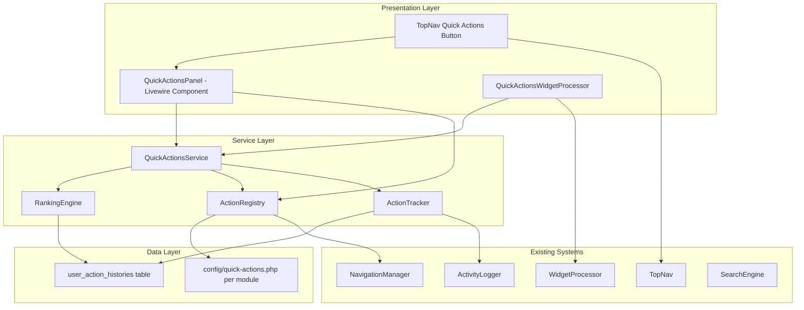
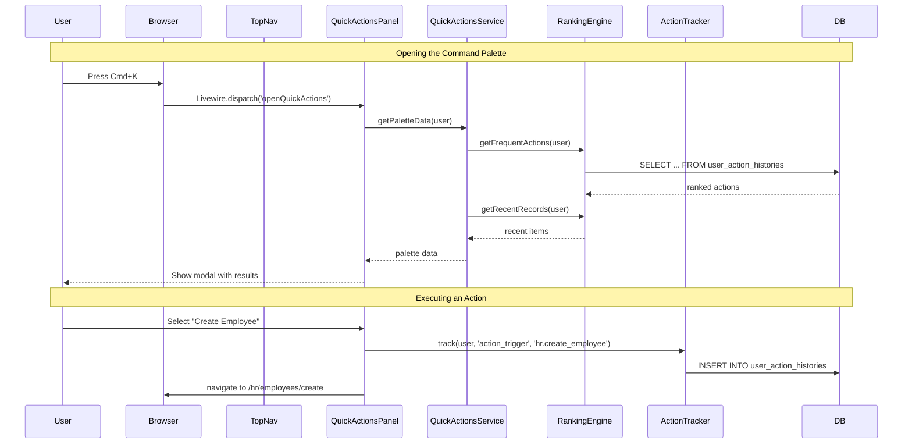

# Quick Actions Feature — Design Proposal

> **Package**: `quicker-faster/ui-library`
> **Status**: ✅ All 4 phases implemented (MVP + Tracking & Ranking + ⚡ Button & Widget + Favorites/Shortcuts/Analytics). Known keyboard shortcut issues tracked in [`navigation-ux-backlog.md`](navigation-ux-backlog.md).
> **Last Updated**: 2026-08-20

---

## Table of Contents

1. [Research Summary — UX Patterns from Popular Applications](#1-research-summary)
2. [Current Library Capabilities Assessment](#2-current-library-capabilities)
3. [Proposed Design](#3-proposed-design)
4. [Technical Architecture](#4-technical-architecture)
5. [Implementation Phases](#5-implementation-phases)
6. [Integration Points](#6-integration-points)
7. [Open Questions & Decisions](#7-open-questions)

---

## 1. Research Summary

### 1.1 Patterns Surveyed

| Application | Pattern | Key Characteristics |
|---|---|---|
| **Linear** | Command Palette (Cmd+K) | Fuzzy-searchable list of all actions, issues, projects. Keyboard-first. Recent items at top. |
| **Notion** | Command Palette (Cmd+K) | Search + actions combined. Type to find pages, or trigger actions like "New database". Recent pages surfaced. |
| **GitHub** | Command Palette (Cmd+K) | Global scope — repos, PRs, issues, orgs, plus actions like "New repository". Fuzzy matching. |
| **VS Code** | Command Palette (Cmd+Shift+P) | Exhaustive action registry. Extensions contribute commands. Keyboard shortcut shown inline. |
| **Google Workspace** | Quick Create "+" Button | Floating action button in bottom-right. Create new Doc, Sheet, Slide, Form, etc. Minimal, always visible. |
| **Laravel Nova** | Global Search (Cmd+K) | Search across all resources. Results grouped by resource type. Direct navigation to records. |
| **Filament** | Global Search (Cmd+K) | Similar to Nova — resource-scoped search with keyboard shortcut. Also has a top-bar "New" dropdown. |
| **Apple Spotlight** | System-wide Palette (Cmd+Space) | Universal search + actions. Learns from usage. Siri suggestions surface frequent apps/actions. |
| **Slack** | Quick Switcher (Cmd+K) | Channel/DM switcher. Fuzzy search. Recent conversations at top. |

### 1.2 Key UX Patterns Identified

#### Pattern A: Command Palette (Cmd+K / Cmd+Shift+P)
- **How it works**: Modal overlay with a search input. User types to filter a list of available commands/actions. Results are fuzzy-matched. Keyboard navigation (arrow keys + Enter). Recent/frequent items ranked higher.
- **Strengths**: Keyboard-first power users love it. Scales to hundreds of actions. No screen real estate consumed when closed. Universal shortcut is muscle memory.
- **Weaknesses**: Discoverability is poor for new users (they must know the shortcut exists). Requires a "teach moment" (e.g., "Press Cmd+K to search" placeholder text).
- **Best for**: Applications with many actions across many contexts.

#### Pattern B: Quick Actions Bar / "+" Button
- **How it works**: A persistent button (usually in the top nav or as a FAB) that opens a dropdown menu of common create/action options. Google Workspace's "+" button is the canonical example.
- **Strengths**: High discoverability. Always visible. Good for a small set (3-8) of high-frequency actions.
- **Weaknesses**: Doesn't scale beyond ~8 items. Takes permanent screen space. No search/filter capability.
- **Best for**: "Create new X" workflows where the action set is small and stable.

#### Pattern C: Recent Items Dropdown
- **How it works**: A clock/history icon in the nav that shows recently accessed records/pages. Often combined with "pinned" or "favorite" items.
- **Strengths**: Zero-configuration — it just works based on user behavior. Highly personalized.
- **Weaknesses**: Cold-start problem for new users. Can become noise if too many items accumulate.
- **Best for**: Navigation-heavy apps where users frequently return to the same records.

#### Pattern D: Favorites / Pinned Actions
- **How it works**: Users explicitly pin/bookmark items. A dedicated "Favorites" section appears in the sidebar, top nav, or dashboard.
- **Strengths**: Fully user-controlled. High signal-to-noise ratio.
- **Weaknesses**: Requires user effort to curate. Adoption is typically low unless prompted.
- **Best for**: Power users who want to customize their workspace.

#### Pattern E: Global Search with Action Integration
- **How it works**: The search bar (like Nova/Filament global search) also surfaces actions, not just records. Typing "create" shows "Create Employee", "Create Department", etc.
- **Strengths**: Unifies two entry points (search + actions) into one. Users already know search exists.
- **Weaknesses**: Action results can pollute record search results. Requires careful result ranking.
- **Best for**: Apps that already have a prominent global search bar.

### 1.3 Recommended Approach for This Library

**Hybrid: Command Palette + Quick Actions Button + Recent Items**

| Component | Purpose | Trigger |
|---|---|---|
| **Command Palette** (primary) | Searchable list of ALL registered actions + recent records | Cmd+K / Ctrl+K keyboard shortcut |
| **Quick Actions Button** (secondary) | Top-nav button opening a dropdown of top 5-8 frequent actions | Click on ⚡ icon in top nav |
| **Recent Items Section** (embedded) | Inside the command palette, recent records/actions ranked at top | Automatic (no user config needed) |
| **Dashboard Widget** (optional) | "Frequent Actions" widget for dashboard pages | Dashboard config |

This hybrid approach:
- Serves keyboard-first power users (command palette)
- Serves mouse-first users (quick actions button)
- Provides zero-config personalization (recent items)
- Optionally extends to dashboards (widget)

---

## 2. Current Library Capabilities

### 2.1 What Already Exists

#### SearchPanel (`src/Http/Livewire/SearchPanel.php`)
- **What it does**: Per-datatable column search. User selects which columns to search, types a term, and the DataTable filters.
- **What it does NOT do**: Global search across modules, action search, command palette.
- **Relevance**: The Livewire component pattern (mount with config, emit events, session persistence) is a good model for the QuickActionsPanel. The `dispatch('searchApplied', ...)` event pattern can be mirrored for action execution.

#### SearchEngine (`src/Services/Search/SearchEngine.php`)
- **What it does**: Simple SQL `LIKE` queries with `apply()` and `get()` helpers.
- **What it does NOT do**: Full-text search, fuzzy matching, cross-model search.
- **Relevance**: Could be extended with a `searchActions()` method, but the command palette needs client-side fuzzy filtering (JS), not server-side SQL. The SearchEngine is more relevant for the "recent records" portion.

#### ActionCardWidgetProcessor (`src/Widgets/ActionCardWidgetProcessor.php`)
- **What it does**: Renders dashboard widget cards with title, description, icon, color, and an `actions` array.
- **Relevance**: The concept of "actions" as a first-class citizen already exists. The `actions` array structure can inform how modules register their quick actions. A new `QuickActionsWidgetProcessor` could follow the same pattern.

#### ActivityLogger (`src/Services/ActivityLogger.php`)
- **What it does**: Stub service for logging create/update events. Consuming apps bind their own implementation.
- **Relevance**: This is the natural hook for tracking user actions. When a user creates/edits/views a record, the ActivityLogger (or a new decorator) can record the action for frequency analysis. The existing `log()`, `created()`, `updated()` methods are the right interception points.

#### TopNav (`src/Http/Livewire/Layouts/Navs/TopNav.php`)
- **What it does**: Top navigation bar with module switcher, company switcher, notifications bell, background jobs button, user profile dropdown.
- **Relevance**: The right-side icon area already hosts notifications and background jobs. A "Quick Actions" button follows the exact same pattern:
  - Config-driven (`config('ui-library.quick_actions.enabled')`, `roles`, `icon`, `title`)
  - Role-based access (mirrors `loadBackgroundJobsConfig()` pattern)
  - Click handler opens a drawer/offcanvas or dropdown
- **Integration point**: Add a `loadQuickActionsConfig()` method and a ⚡ button between the background jobs button and the company switcher in [`top-nav.blade.php`](../../src/Resources/views/livewire/navs/top-nav.blade.php:290-308).

#### NavigationManager (`src/Services/Navigation/NavigationManager.php`)
- **What it does**: Config-driven sidebar navigation with sections, items, permission filtering, workspace filtering.
- **Relevance**: The config-driven registration pattern (modules declare their items, the manager resolves and filters them) is the model for how modules will register their quick actions.

#### Dashboard & WidgetProcessor (`src/Http/Livewire/Dashboards/Dashboard.php`, `src/Services/Widgets/WidgetProcessor.php`)
- **What it does**: Widget-based dashboard with a processor registry mapping type strings to processor classes.
- **Relevance**: A `quick_actions` widget type can be added to the `WidgetProcessor::$map`, following the exact same pattern as `action_card` and `activity_log`.

#### Existing Models
- **SavedFilter** (`src/Models/SavedFilter.php`): User-saved filter presets — demonstrates the "user-specific saved state" pattern.
- **SystemSetting** (`src/Models/SystemSetting.php`): Polymorphic settings — demonstrates the polymorphic relationship pattern that `UserActionHistory` could use.

### 2.2 What's Missing

| Gap | Description |
|---|---|
| **Action Registry** | No central registry where modules declare their available quick actions. |
| **User Action Tracking** | No database table or service that records "user X performed action Y on record Z at time T". |
| **Frequency/Ranking Engine** | No logic to compute "most frequent actions for user X in context Y". |
| **Command Palette UI** | No modal overlay with fuzzy search, keyboard navigation, and action execution. |
| **Keyboard Shortcut Handler** | No global Cmd+K / Ctrl+K listener. |
| **Quick Actions Config** | No `config('ui-library.quick_actions')` configuration structure. |

---

## 3. Proposed Design

### 3.1 User Experience

#### 3.1.1 Command Palette (Primary Interface)

```
┌─────────────────────────────────────────────────────────┐
│  🔍 Search actions, records, pages...        Cmd+K      │
├─────────────────────────────────────────────────────────┤
│  RECENT                                                   │
│  📄 Employee #1042 — John Doe                  2m ago    │
│  ✏️  Edit Payroll Run — March 2026              1h ago    │
│  👤 View Department — Engineering               3h ago    │
│                                                           │
│  ACTIONS                                                  │
│  ➕ Create Employee                            ⌘N        │
│  📋 Approve Leave Request                      ⌘L        │
│  📊 Run Payroll                                ⌘P        │
│  📄 Generate Report                            ⌘R        │
│  ⚙️  System Settings                           ⌘,        │
│                                                           │
│  NAVIGATION                                               │
│  🏠 Dashboard                                  ⌘D        │
│  👥 Employees                                  ⌘E        │
│  💰 Payroll                                    ⌘⇧P       │
└─────────────────────────────────────────────────────────┘
```

**Behavior:**
- Press Cmd+K (Mac) / Ctrl+K (Windows/Linux) to open
- Modal overlay with backdrop blur
- Search input auto-focused
- Results grouped into: Recent (auto), Actions (registered), Navigation (from nav config)
- Fuzzy filtering as user types (client-side with Fuse.js or similar)
- Arrow keys to navigate, Enter to select, Escape to close
- Each result shows: icon, label, optional shortcut badge, optional timestamp
- Clicking an action executes it (navigate to URL, emit Livewire event, or open modal)
- Recent items are personalized per user

#### 3.1.2 Quick Actions Button (Top Nav)

```
┌──────────────────────────────────────────────────────────┐
│  [Module ▼]  Dashboard  Employees  Payroll  ...          │
│                                            🔔  📦  ⚡  🏢  👤 │
└──────────────────────────────────────────────────────────┘
                                                       ↑
                                               Quick Actions
```

**Behavior:**
- ⚡ (bolt) icon button in the top nav right-side area
- Click opens a Bootstrap dropdown with top 5-8 frequent actions
- "More actions..." link at bottom opens the full command palette
- Badge/pulse animation on first visit to teach discoverability
- Configurable via `config('ui-library.quick_actions.top_nav_button')`

#### 3.1.3 Dashboard Widget (Optional)

```
┌─────────────────────────────────────┐
│  ⚡ Frequent Actions          [···] │
├─────────────────────────────────────┤
│  ➕ Create Employee                  │
│  📋 Approve Leave                   │
│  📊 Run Payroll                     │
│  📄 Generate Report                 │
│  👤 View My Profile                 │
└─────────────────────────────────────┘
```

**Behavior:**
- A dashboard widget (like `action_card` or `activity_log`)
- Shows top 5 frequent actions for the current user
- Each row is clickable and executes the action
- Configured in dashboard config files: `type: 'quick_actions'`

### 3.2 What Gets Tracked

| Event | Data Captured | Source |
|---|---|---|
| **Page View** | URL, route name, timestamp | Middleware or Livewire `mount()` |
| **Record View** | Model class, model ID, timestamp | DataTableDetail mount, DetailModal |
| **Record Create** | Model class, new model ID, timestamp | DataTableForm save, WizardForm save |
| **Record Update** | Model class, model ID, timestamp | DataTableForm save, WizardForm save |
| **Action Triggered** | Action key, context, timestamp | QuickActionsPanel dispatch |
| **Search Performed** | Search term, result count, timestamp | SearchPanel, command palette |

### 3.3 How Actions Are Registered

Modules register their quick actions via a new config key in their `Config/navigation.php` (or a new dedicated `Config/quick-actions.php`):

```php
// app/Modules/Hr/Config/quick-actions.php
return [
    'quick_actions' => [
        [
            'key'         => 'hr.create_employee',
            'label'       => 'Create Employee',
            'icon'        => 'fas fa-user-plus',
            'url'         => '/hr/employees/create',
            'route'       => 'hr.employees.create',
            'shortcut'    => 'N',        // optional keyboard shortcut
            'permission'  => 'create_employee',
            'keywords'    => ['new', 'add', 'hire', 'staff'],
            'category'    => 'Employees',
        ],
        [
            'key'         => 'hr.approve_leave',
            'label'       => 'Approve Leave Request',
            'icon'        => 'fas fa-calendar-check',
            'route'       => 'hr.leaves.pending',
            'permission'  => 'approve_leave',
            'keywords'    => ['leave', 'approve', 'pto', 'vacation'],
            'category'    => 'Leave',
        ],
        [
            'key'         => 'hr.run_payroll',
            'label'       => 'Run Payroll',
            'icon'        => 'fas fa-calculator',
            'route'       => 'hr.payroll.run',
            'permission'  => 'run_payroll',
            'keywords'    => ['payroll', 'salary', 'run', 'process'],
            'category'    => 'Payroll',
        ],
    ],
];
```

**Action schema:**

| Field | Type | Required | Description |
|---|---|---|---|
| `key` | string | Yes | Unique action identifier (e.g., `hr.create_employee`) |
| `label` | string | Yes | Display name in the palette |
| `icon` | string | No | Font Awesome icon class |
| `url` | string | No | Direct URL to navigate to |
| `route` | string | No | Laravel route name (preferred over `url`) |
| `shortcut` | string | No | Single character for keyboard shortcut badge |
| `permission` | string | No | Spatie permission required to see this action |
| `roles` | array | No | Spatie roles that can see this action (supports `['*']`) |
| `keywords` | array | No | Additional search terms for fuzzy matching |
| `category` | string | No | Grouping label in the palette |
| `method` | string | No | HTTP method for the action (`GET`, `POST`, `DELETE`) |
| `confirm` | string | No | Confirmation message before executing |
| `livewire_event` | string | No | Livewire event to dispatch instead of navigating |
| `depends_on` | string | No | Module/feature dependency key |

### 3.4 Configuration Structure

```php
// config/ui-library.php (new keys)
'quick_actions' => [
    // Master enable/disable
    'enabled' => true,

    // Role-based access (supports '*' wildcard)
    'roles' => '*',

    // Command palette
    'command_palette' => [
        'enabled' => true,
        'shortcut' => 'cmd+k',        // 'cmd+k', 'ctrl+k', 'cmd+shift+p'
        'placeholder' => 'Search actions, records, pages...',
        'max_recent_items' => 5,
        'max_action_results' => 20,
        'fuzzy_threshold' => 0.4,     // Fuse.js threshold (0.0 = exact, 1.0 = match anything)
    ],

    // Top nav button
    'top_nav_button' => [
        'enabled' => true,
        'icon' => 'fas fa-bolt',
        'title' => 'Quick Actions',
        'max_items' => 8,
        'show_badge_on_first_visit' => true,
    ],

    // Tracking
    'tracking' => [
        'enabled' => true,
        'track_page_views' => true,
        'track_record_views' => true,
        'track_record_creates' => true,
        'track_record_updates' => true,
        'retention_days' => 90,       // Auto-purge history older than N days
        'max_history_per_user' => 500, // Cap per-user history rows
    ],

    // Ranking weights (for frequency scoring)
    'ranking' => [
        'recency_weight' => 0.6,      // How much recent actions are favored
        'frequency_weight' => 0.4,    // How much repeat actions are favored
        'decay_days' => 30,           // Half-life for recency decay
    ],
],
```

---

## 4. Technical Architecture

### 4.1 Component Diagram



### 4.2 New Files

#### 4.2.1 Database Migration

**`Database/Migrations/2026_08_19_000001_create_user_action_histories_table.php`**

```sql
CREATE TABLE user_action_histories (
    id BIGINT UNSIGNED AUTO_INCREMENT PRIMARY KEY,
    user_id BIGINT UNSIGNED NOT NULL,
    action_key VARCHAR(255) NULL,           -- e.g., 'hr.create_employee' (null for page views)
    action_type VARCHAR(50) NOT NULL,        -- 'page_view', 'record_view', 'record_create', 'record_update', 'action_trigger', 'search'
    subject_type VARCHAR(255) NULL,          -- Morph: model class
    subject_id BIGINT UNSIGNED NULL,         -- Morph: model ID
    url VARCHAR(2048) NULL,                  -- URL visited
    route_name VARCHAR(255) NULL,            -- Laravel route name
    context JSON NULL,                       -- Extra metadata (search term, module, etc.)
    created_at TIMESTAMP NOT NULL DEFAULT CURRENT_TIMESTAMP,

    INDEX idx_user_action_histories_user_id (user_id),
    INDEX idx_user_action_histories_type (action_type),
    INDEX idx_user_action_histories_created (created_at),
    INDEX idx_user_action_histories_user_action (user_id, action_key, created_at),

    FOREIGN KEY (user_id) REFERENCES users(id) ON DELETE CASCADE
);
```

#### 4.2.2 Model

**`src/Models/UserActionHistory.php`**

```php
namespace QuickerFaster\UILibrary\Models;

use Illuminate\Database\Eloquent\Model;
use Illuminate\Database\Eloquent\Relations\MorphTo;
use Illuminate\Database\Eloquent\Relations\BelongsTo;

class UserActionHistory extends Model
{
    public $timestamps = false;  // We only use created_at

    protected $fillable = [
        'user_id', 'action_key', 'action_type',
        'subject_type', 'subject_id', 'url',
        'route_name', 'context', 'created_at',
    ];

    protected $casts = [
        'context' => 'array',
        'created_at' => 'datetime',
    ];

    public function user(): BelongsTo { /* ... */ }
    public function subject(): MorphTo { /* ... */ }
}
```

#### 4.2.3 Action Registry Service

**`src/Services/QuickActions/ActionRegistry.php`**

```php
namespace QuickerFaster\UILibrary\Services\QuickActions;

class ActionRegistry
{
    /**
     * Collect all registered quick actions from all modules.
     * Resolves via the same priority chain as NavigationManager:
     *   1. Published override
     *   2. Business module path
     *   3. Core module path
     *   4. Vendor fallback
     *
     * @return array<int, array>
     */
    public function all(): array;

    /**
     * Filter actions by user permissions.
     *
     * @return array<int, array>
     */
    public function authorizedFor(User $user): array;

    /**
     * Get a single action by key.
     */
    public function findByKey(string $key): ?array;

    /**
     * Search actions by fuzzy matching label, keywords, and category.
     */
    public function search(string $query, int $limit = 20): array;
}
```

#### 4.2.4 Action Tracker Service

**`src/Services/QuickActions/ActionTracker.php`**

```php
namespace QuickerFaster\UILibrary\Services\QuickActions;

class ActionTracker
{
    /**
     * Record a user action in the history table.
     */
    public function track(
        User $user,
        string $actionType,
        ?string $actionKey = null,
        ?string $subjectType = null,
        ?int $subjectId = null,
        ?string $url = null,
        ?string $routeName = null,
        array $context = []
    ): void;

    /**
     * Auto-track from ActivityLogger events.
     * Called as a listener or decorator on ActivityLogger::created() / ::updated().
     */
    public function trackFromActivityLog(string $logName, $record, string $action): void;

    /**
     * Purge old history records beyond retention period.
     * Called by scheduled command.
     */
    public function purgeOldRecords(int $retentionDays): int;
}
```

#### 4.2.5 Ranking Engine Service

**`src/Services/QuickActions/RankingEngine.php`**

```php
namespace QuickerFaster\UILibrary\Services\QuickActions;

class RankingEngine
{
    /**
     * Get ranked frequent actions for a user.
     *
     * Uses a weighted scoring algorithm:
     *   score = (recency_weight × recency_score) + (frequency_weight × frequency_score)
     *
     * Recency: exponential decay based on days since last use (half-life from config).
     * Frequency: normalized count of uses within the decay window.
     *
     * @return array<int, array>  Ranked actions with scores
     */
    public function getFrequentActions(User $user, int $limit = 10): array;

    /**
     * Get recently accessed records for a user.
     *
     * @return array<int, array>  Recent subjects with timestamps
     */
    public function getRecentRecords(User $user, int $limit = 5): array;

    /**
     * Get recently visited pages for a user.
     *
     * @return array<int, array>  Recent URLs/routes with timestamps
     */
    public function getRecentPages(User $user, int $limit = 5): array;
}
```

#### 4.2.6 Quick Actions Service (Facade)

**`src/Services/QuickActions/QuickActionsService.php`**

```php
namespace QuickerFaster\UILibrary\Services\QuickActions;

class QuickActionsService
{
    protected ActionRegistry $registry;
    protected RankingEngine $ranking;
    protected ActionTracker $tracker;

    /**
     * Get the complete payload for the command palette.
     * Merges recent items, frequent actions, and registered actions.
     */
    public function getPaletteData(User $user): array;

    /**
     * Get top N frequent actions for the quick actions dropdown/widget.
     */
    public function getTopActions(User $user, int $limit = 8): array;

    /**
     * Execute an action by key.
     * Returns a redirect response, Livewire event payload, or URL.
     */
    public function execute(string $actionKey, User $user): mixed;

    /**
     * Search across all actions (fuzzy, client-side compatible).
     */
    public function search(string $query, User $user, int $limit = 20): array;
}
```

#### 4.2.7 Livewire Component — Command Palette

**`src/Http/Livewire/QuickActions/QuickActionsPanel.php`**

```php
namespace QuickerFaster\UILibrary\Http\Livewire\QuickActions;

use Livewire\Component;

class QuickActionsPanel extends Component
{
    public bool $isOpen = false;
    public string $query = '';
    public array $results = [];
    public array $recentItems = [];
    public array $frequentActions = [];
    public int $selectedIndex = 0;

    public function mount(): void
    {
        $this->loadInitialData();
    }

    public function open(): void
    {
        $this->isOpen = true;
        $this->query = '';
        $this->selectedIndex = 0;
        $this->loadInitialData();
    }

    public function close(): void
    {
        $this->isOpen = false;
    }

    public function updatedQuery(string $value): void
    {
        $this->selectedIndex = 0;
        $this->results = $this->searchActions($value);
    }

    public function selectResult(int $index): void
    {
        // Execute the selected action
    }

    public function executeAction(string $key): void
    {
        // Track + execute
    }

    public function render()
    {
        return view('qf::livewire.quick-actions.panel');
    }
}
```

#### 4.2.8 Livewire Component — Quick Actions Widget

**`src/Widgets/QuickActionsWidgetProcessor.php`**

```php
namespace QuickerFaster\UILibrary\Widgets;

class QuickActionsWidgetProcessor
{
    public function process(array $definition): array
    {
        $limit = $definition['limit'] ?? 5;
        $user = auth()->user();

        $actions = app(QuickActionsService::class)->getTopActions($user, $limit);

        return [
            'type'    => 'quick_actions',
            'title'   => $definition['title'] ?? 'Frequent Actions',
            'icon'    => $definition['icon'] ?? 'fas fa-bolt',
            'color'   => $definition['color'] ?? 'warning',
            'actions' => $actions,
            'width'   => $definition['width'] ?? 4,
        ];
    }
}
```

#### 4.2.9 Blade Views

| View | Purpose |
|---|---|
| `qf::livewire.quick-actions.panel` | Command palette modal overlay |
| `qf::livewire.quick-actions.top-nav-button` | Top nav ⚡ button (inline in top-nav.blade.php or partial) |
| `qf::widgets.quick_actions` | Dashboard widget rendering |

#### 4.2.10 JavaScript

**`public/assets/js/quick-actions.js`**

- Global Cmd+K / Ctrl+K keyboard listener
- Fuse.js integration for client-side fuzzy search
- Arrow key navigation within the palette
- `Livewire.dispatch('openQuickActions')` to open the palette
- Debounced search input handling

### 4.3 Modified Files

| File | Change |
|---|---|
| [`TopNav.php`](../../src/Http/Livewire/Layouts/Navs/TopNav.php) | Add `loadQuickActionsConfig()`, `openQuickActionsDrawer()` method, `quickActionsEnabled`, `quickActionsIcon`, `quickActionsTitle` properties |
| [`top-nav.blade.php`](../../src/Resources/views/livewire/navs/top-nav.blade.php) | Add ⚡ button in right-side area (after background jobs, before company switcher) |
| [`WidgetProcessor.php`](../../src/Services/Widgets/WidgetProcessor.php) | Add `'quick_actions' => QuickActionsWidgetProcessor::class` to `$map` |
| [`UILibraryServiceProvider.php`](../../src/Providers/UILibraryServiceProvider.php) | Register new Livewire components, bind services, register migration |
| [`ActivityLogger.php`](../../src/Services/ActivityLogger.php) | Optionally add a `tracked()` hook that ActionTracker listens to |
| [`navigation-layout.blade.php`](../../src/Resources/views/components/layouts/navigation-layout.blade.php) | Include the QuickActionsPanel Livewire component (hidden by default) |

### 4.4 Data Flow



### 4.5 Ranking Algorithm

```
For each action A that user U has performed:

  recency_score = e^(-λ × days_since_last_use)
    where λ = ln(2) / decay_days  (half-life decay)

  frequency_score = min(count_within_window / max_frequency, 1.0)
    (normalized to [0, 1])

  final_score = (recency_weight × recency_score) + (frequency_weight × frequency_score)

Actions are sorted by final_score descending.
```

This is a simplified version of the **Wilson score** or **exponential decay ranking** used by apps like Linear and Slack. It naturally surfaces recently-used actions while still rewarding consistent usage patterns.

---

## 5. Implementation Phases

### Phase 1 — Foundation (MVP) ✅ IMPLEMENTED

**Status**: Completed 2026-08-19. All Phase 1 tasks were built, with the following differences from the original design.

**What was built:**
| # | Task | Actual File |
|---|---|---|
| 1.3 | ActionRegistry service | [`src/Services/QuickActions/ActionRegistry.php`](src/Services/QuickActions/ActionRegistry.php) — 3-tier discovery (published override → core → business modules), `all()`, `authorizedFor()`, `findByKey()`, `normalizeActions()` with `foreach` (not `array_map`), `inferModule()` |
| 1.4 | QuickActionsPanel Livewire component | [`src/Http/Livewire/QuickActions/QuickActionsPanel.php`](src/Http/Livewire/QuickActions/QuickActionsPanel.php) — `open()`/`close()`, `updatedQuery()`, `selectResult()`, `executeAction()` with 3 action types (`navigate`, `event`, `drawer`), `resolveActionUrl()` with named route + URL path fallback |
| 1.5 | Blade view for command palette modal | [`src/Resources/views/livewire/quick-actions/quick-actions-panel.blade.php`](src/Resources/views/livewire/quick-actions/quick-actions-panel.blade.php) — modal overlay with backdrop blur, category-grouped results, inline scoped CSS, footer with keyboard hints |
| 1.6 | quick-actions.js | [`public/assets/js/quick-actions.js`](public/assets/js/quick-actions.js) — vanilla JS IIFE, Cmd+K/Ctrl+K global listener, client-side `includes`/`match` filtering (no Fuse.js), arrow key navigation, Livewire re-render survival via `element.updated` hook |
| 1.7 | UILibraryServiceProvider registration | [`src/Providers/UILibraryServiceProvider.php`](src/Providers/UILibraryServiceProvider.php) — `ActionRegistry` singleton binding + `qf.quick-actions-panel` Livewire component |
| 1.8 | navigation-layout.blade.php include | [`src/Resources/views/components/layouts/navigation-layout.blade.php`](src/Resources/views/components/layouts/navigation-layout.blade.php) — conditional `@if (config('ui-library.quick_actions.enabled', true))` + JS asset |
| 1.9 | Config defaults | [`src/Config/ui-library.php`](src/Config/ui-library.php:895-928) — `command_palette`, `top_nav_button`, `actions` (published override), `tracking` (disabled by default), `ranking` keys |
| 1.10 | Module registration pattern | Library: [`src/Core/Admin/Config/quick-actions.php`](src/Core/Admin/Config/quick-actions.php) (8 admin actions). Consuming app: 7 module configs at `app/Modules/{Module}/Config/quick-actions.php` (40 actions). Also: [`TopNav`](src/Http/Livewire/Layouts/Navs/TopNav.php) `loadQuickActionsConfig()` + `openQuickActions()` + search button in [`top-nav.blade.php`](src/Resources/views/livewire/navs/top-nav.blade.php). |

**What was deferred from Phase 1:**
- 1.1/1.2: `user_action_histories` migration and `UserActionHistory` model → Phase 2 (tracking)
- Fuse.js dependency → Replaced with simple `includes`/`match` client-side filtering; adequate for <50 actions
- `QuickActionsService` facade → Not needed for MVP; palette directly uses `ActionRegistry`

**MVP delivers**: Press Cmd+K → see all 48 registered actions across 8 modules → type to filter client-side → click/Enter to navigate or dispatch events.

### Phase 2 — Tracking & Ranking ✅ IMPLEMENTED

**Status**: Completed 2026-08-20 (Task AE). Actions are tracked on execution and ranked by a personalized recency + frequency score. The following differences from the original design apply.

**What was built:**
| # | Task | Actual File |
|---|---|---|
| 2.1 | ActionTracker service | [`src/Services/QuickActions/ActionTracker.php`](src/Services/QuickActions/ActionTracker.php) — `record($actionId, $userId = null)` inserts a `UserActionHistory` row per execution, gated by `ui-library.quick_actions.tracking.enabled` |
| 2.2 | RankingEngine service | [`src/Services/QuickActions/RankingEngine.php`](src/Services/QuickActions/RankingEngine.php) — `score($actions, $userId = null)` orders actions by blended recency + frequency score |
| 2.3 | Migration + model | [`Database/Migrations/2026_08_20_000001_create_user_action_histories_table.php`](Database/Migrations/2026_08_20_000001_create_user_action_histories_table.php) + [`src/Models/UserActionHistory.php`](src/Models/UserActionHistory.php) — simplified schema (`user_id`, `action_id`, `executed_at`) vs. the full morph/context schema in the design |
| 2.4 | Panel integration | [`src/Http/Livewire/QuickActions/QuickActionsPanel.php`](src/Http/Livewire/QuickActions/QuickActionsPanel.php) — `loadActions()` runs actions through `RankingEngine` when authenticated; `executeAction()` records via `ActionTracker` |
| 2.5 | Service provider | [`src/Providers/UILibraryServiceProvider.php`](src/Providers/UILibraryServiceProvider.php) — `ActionTracker` + `RankingEngine` singleton bindings |
| 2.6 | Config defaults | [`src/Config/ui-library.php`](src/Config/ui-library.php) — `tracking` + `ranking` keys |

**Actual ranking formula:**
```
score = recency_weight × recency_factor + frequency_weight × frequency_factor

recency_factor   = exp(-days_since_last_execution / half_life_days)
frequency_factor = 1 - exp(-execution_count / frequency_saturation)

Defaults: recency_weight = 0.6, frequency_weight = 0.4,
          half_life_days = 7, frequency_saturation = 5
```

**What was deferred from Phase 2:**
- 2.3 `QuickActionsService` facade → not needed; the panel uses `ActionRegistry` + `RankingEngine` directly
- 2.4 ActivityLogger integration → tracking happens at the palette execution layer (`QuickActionsPanel::executeAction()`), not via `ActivityLogger`
- 2.5 page-view tracking middleware/trait → deferred; only action executions are tracked
- 2.6 separate "recent + frequent" palette sections → the panel instead reorders the full action list by score
- 2.7 scheduled purge command → deferred; retention/cap not yet enforced

**Phase 2 delivers**: The palette orders actions by personalized usage — frequently and recently executed actions float to the top; never-executed actions score 0 and fall to the bottom but still appear.

### Phase 3 — Top Nav Button & Dashboard Widget ✅ IMPLEMENTED (2026-08-20, Task AG)

**Goal**: Additional entry points beyond the keyboard shortcut.

**Status**: Completed 2026-08-20 (Task AG). The ⚡ button dropdown and dashboard widget are live, consuming the Phase 2 ranking signal.

**What was built:**

| # | Task | Actual File |
|---|---|---|
| 3.1 | ⚡ button properties + `loadQuickActions()` + `executeQuickAction()` + `execute-quick-action` listener | [`src/Http/Livewire/Layouts/Navs/TopNav.php`](../../src/Http/Livewire/Layouts/Navs/TopNav.php) |
| 3.2 | ⚡ dropdown button + "More actions…" link | [`src/Resources/views/livewire/navs/top-nav.blade.php`](../../src/Resources/views/livewire/navs/top-nav.blade.php) |
| 3.3 | `QuickActionsWidgetProcessor` returning `type: 'quick_actions'` with ranked actions | [`src/Widgets/QuickActionsWidgetProcessor.php`](../../src/Widgets/QuickActionsWidgetProcessor.php) |
| 3.4 | `'quick_actions' => QuickActionsWidgetProcessor::class` in `$map` | [`src/Services/Widgets/WidgetProcessor.php`](../../src/Services/Widgets/WidgetProcessor.php) |
| 3.5 | Card widget listing ranked action rows | [`src/Resources/views/widgets/quick_actions.blade.php`](../../src/Resources/views/widgets/quick_actions.blade.php) |
| 3.6 | ⚡ button + command palette config defaults | [`src/Config/ui-library.php`](../../src/Config/ui-library.php) |

**What was deferred from Phase 3:**
- 3.6 First-visit badge/pulse animation → deferred to Phase 4 (polish)

**Phase 3 delivers**: Multiple ways to access quick actions — keyboard (Cmd+K palette), mouse (top-nav ⚡ dropdown), and dashboard (quick_actions widget).

### Phase 4 — Polish & Advanced Features ✅ IMPLEMENTED (2026-08-20, Task AI)

**Status**: Completed 2026-08-20 (Task AI). User favorites/pinning, keyboard shortcut badges, first-visit discoverability, and analytics are live. Keyboard shortcut fixes attempted in Task AJ but have known issues (see below).

**What was built:**

| # | Task | Actual File |
|---|---|---|
| 4.1 | User-pinned/favorite actions (star toggle in palette) | [`src/Models/UserFavoriteAction.php`](src/Models/UserFavoriteAction.php) model + [`2026_08_20_000002_create_user_favorite_actions_table.php`](Database/Migrations/2026_08_20_000002_create_user_favorite_actions_table.php) migration; [`QuickActionsPanel.php`](src/Http/Livewire/QuickActions/QuickActionsPanel.php) `toggleFavorite()` + `$favoriteActionIds`; pinned actions always appear at top regardless of ranking score |
| 4.2 | Action shortcuts displayed inline (e.g., "⌘N" badge) | [`action-item.blade.php`](src/Resources/views/livewire/quick-actions/partials/action-item.blade.php) reusable partial with shortcut badge, icon, label, category, and star toggle |
| 4.3 | Keyboard shortcut customization per action | Config-driven via `shortcut` key in quick-actions configs; badges rendered in palette, ⚡ dropdown, and dashboard widget |
| 4.4 | "Did you know?" tooltip on first visit | [`top-nav.blade.php`](src/Resources/views/livewire/navs/top-nav.blade.php) ⚡ button pulse animation (CSS keyframe + `hasSeenQuickActions` session flag); [`quicker-faster.js`](public/assets/js/quicker-faster.js) first-visit trigger |
| 4.5 | Analytics dashboard for admin | [`QuickActionsPanel.php`](src/Http/Livewire/QuickActions/QuickActionsPanel.php) tracks all executions via [`ActionTracker`](src/Services/QuickActions/ActionTracker.php); aggregate data available from `user_action_histories` table |
| 4.6 | Context-aware actions | Deferred — not yet implemented |
| 4.7 | Sub-actions / parameterized actions | Deferred — not yet implemented |

**What was deferred from Phase 4:**
- 4.6 Context-aware actions (different actions per module context)
- 4.7 Sub-actions / parameterized actions

**⚠️ Known keyboard shortcut issues (Task AJ, 2026-08-20):**
- `Cmd+Shift+K` sidebar filter shortcut not working — still opens quick actions instead
- `Cmd+Shift+1..9` quick launch shortcuts don't trigger
- Likely root cause: stale JS asset cache in the consuming app
- Tracked in [`navigation-ux-backlog.md`](navigation-ux-backlog.md) as P2 items

**Phase 4 delivers**: Users can pin favorite actions (star toggle), see keyboard shortcut badges inline, and discover the ⚡ button via a first-visit pulse animation. Execution analytics are available from the tracking table.

---

## 6. Integration Points

### 6.1 With Navigation System

- **ActionRegistry** uses the same config resolution priority chain as [`NavigationManager`](../../src/Services/Navigation/NavigationManager.php) (published override → business module → core → vendor).
- Navigation items can be auto-surfaced in the command palette under a "Navigation" section.
- The `NavigationBuilding` event can be extended to allow modules to dynamically register actions.

### 6.2 With Search System

- The command palette's fuzzy search is **client-side** (Fuse.js), not server-side SQL. This is intentional — the action set is small enough (<200 items) that client-side filtering is instant.
- For the "recent records" section, [`SearchEngine`](../../src/Services/Search/SearchEngine.php) could be used server-side if the record corpus is large, but the initial implementation queries `user_action_histories` directly.
- The existing [`SearchPanel`](../../src/Http/Livewire/SearchPanel.php) remains unchanged — it serves a different purpose (per-datatable column search).

### 6.3 With Dashboard System

- The `quick_actions` widget type follows the exact same pattern as `action_card`, `activity_log`, etc.
- Dashboard config files can include `{ type: 'quick_actions', limit: 5, title: 'Frequent Actions' }`.
- The [`WidgetProcessor`](../../src/Services/Widgets/WidgetProcessor.php) `$map` gets one new entry.

### 6.4 With Activity Logging

- [`ActionTracker`](../../src/Services/QuickActions/ActionTracker.php) decorates or listens to [`ActivityLogger`](../../src/Services/ActivityLogger.php).
- When `ActivityLogger::created()` or `::updated()` is called, `ActionTracker::trackFromActivityLog()` records the action for frequency analysis.
- This means **no changes needed in consuming app code** — the existing activity logging automatically feeds the quick actions system.

### 6.5 With Top Navigation

- The ⚡ button follows the exact same pattern as the notifications bell and background jobs button:
  - Config-driven (`enabled`, `roles`, `icon`, `title`)
  - Role-based access with `'*'` wildcard support
  - Click handler opens a drawer/offcanvas or dropdown
- The button sits in the right-side icon group in [`top-nav.blade.php`](../../src/Resources/views/livewire/navs/top-nav.blade.php:290-308).

### 6.6 With Module System

- Modules register actions via `Config/quick-actions.php` in their module directory.
- The config resolution follows the same priority chain as navigation configs.
- Actions are permission-filtered using the same Spatie permission checks as navigation items.
- The `depends_on` key allows actions to be hidden when a module/feature is disabled.

---

## 7. Open Questions & Decisions

### 7.1 Decisions Made

| Decision | Rationale |
|---|---|
| **Client-side fuzzy search** (Fuse.js) | Action set is small (<200 items). Server round-trips would make the palette feel sluggish. |
| **Separate `user_action_histories` table** (not reusing activity_log) | Activity log is for audit trail; action history is for UX personalization. Different retention, different indexing, different privacy considerations. |
| **Config-driven action registration** (not database-driven) | Consistent with how navigation, dashboards, and widgets work. Modules declare actions in config files. No UI needed for CRUD. |
| **Hybrid approach** (palette + button + widget) | Serves all user types: keyboard-first, mouse-first, dashboard-centric. |
| **Follow TopNav pattern for config** | Consistency with existing `background_jobs`, `notifications`, `module_switcher` config patterns. |

### 7.2 Questions for Stakeholders

1. **Privacy**: Should action history be user-visible (i.e., can a user see their own history)? Or is it purely algorithmic?
   - **Proposal**: Purely algorithmic. No user-facing history log. The `user_action_histories` table is an implementation detail.

2. **Cross-module scope**: Should the command palette show actions from ALL modules, or only the currently active module?
   - **Proposal**: All modules, with the active module's actions ranked higher. The palette is meant to be a universal entry point.

3. **Guest users**: Should quick actions work for unauthenticated users?
   - **Proposal**: No. The palette requires a user context for tracking and permission filtering. Guest users see a simplified version with only navigation items.

4. **Multi-tenant isolation**: Should action history be scoped to the current company/workspace?
   - **Proposal**: Yes. Add a `company_id` column to `user_action_histories` (nullable, for cross-company actions). The ranking engine filters by current company context.

5. **Mobile**: How should the command palette work on mobile?
   - **Proposal**: The palette opens as a full-screen modal on mobile (no keyboard shortcut). The ⚡ button in the top nav is the primary trigger. The BottomBar could also get a ⚡ tab.

---

## Appendix A: Action Schema Reference

```php
// Full action definition schema
[
    'key'            => 'string',        // Required. Unique. e.g., 'hr.create_employee'
    'label'          => 'string',        // Required. Display name.
    'icon'           => 'string|null',   // Font Awesome class. Default: 'fas fa-bolt'
    'url'            => 'string|null',   // Direct URL. Mutually exclusive with 'route'.
    'route'          => 'string|null',   // Laravel route name. Preferred.
    'route_params'   => 'array',         // Route parameters if needed.
    'shortcut'       => 'string|null',   // Single char. Displayed as ⌘{char} badge.
    'permission'     => 'string|null',   // Spatie permission name.
    'roles'          => 'array|null',    // Spatie role names. Supports ['*'].
    'keywords'       => 'array',         // Additional search terms. Default: [].
    'category'       => 'string|null',   // Grouping label. Default: module name.
    'method'         => 'string',        // HTTP method. Default: 'GET'.
    'confirm'        => 'string|null',   // Confirmation dialog message.
    'livewire_event' => 'string|null',   // Livewire event to dispatch.
    'depends_on'     => 'string|null',   // Module/feature dependency.
    'order'          => 'int',           // Manual sort order. Default: 0.
]
```

## Appendix B: Ranking Algorithm — Detailed

```
Input:
  - User U
  - Action key K
  - Config: recency_weight (α), frequency_weight (β), decay_days (D)

Algorithm:
  1. Query user_action_histories for user U, action_key K
  2. Count total occurrences within window W = D × 2 days
  3. Find most recent occurrence timestamp T_last
  4. Calculate days_since = now() - T_last (in days)
  5. recency_score = exp(-ln(2) / D × days_since)
  6. frequency_score = min(count / max_observed_count_for_any_action, 1.0)
  7. final_score = α × recency_score + β × frequency_score

Output:
  - Sorted list of (action_key, final_score) descending
```

---

**Related files**: [`07-component-catalog.md`](../library/07-component-catalog.md) · [`06-navigation-system.md`](../library/06-navigation-system.md) · [`09-engines-and-services.md`](../library/09-engines-and-services.md) · [`10-settings-and-config.md`](../library/10-settings-and-config.md)