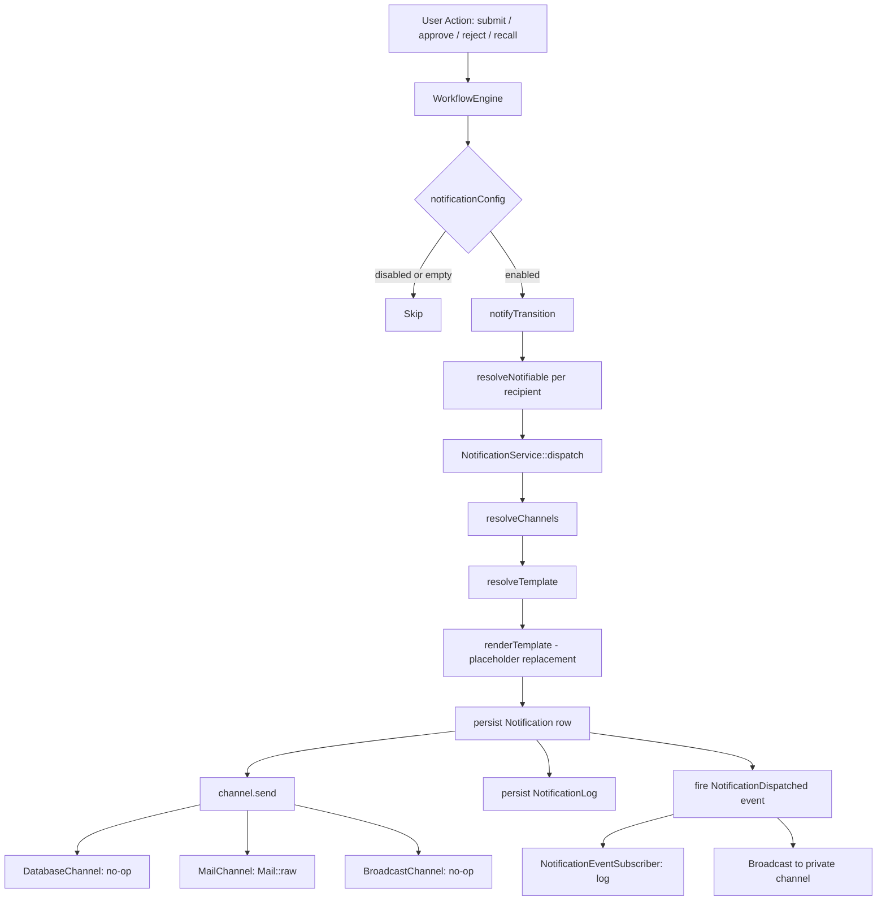

# Approval Workflow Notifications: Analysis & Activation Guide

> **Status:** Planning / Analysis — no code changes are proposed in this document.
> **Audience:** Developers and operators responsible for activating workflow notifications in a consuming application built on the UI Library.

---

## Table of Contents

1. [Current Infrastructure (What's Already Built)](#1-current-infrastructure-whats-already-built)
2. [What's Needed to Activate Notifications](#2-whats-needed-to-activate-notifications)
3. [Verification Checklist](#3-verification-checklist)
4. [Common Pitfalls & Troubleshooting](#4-common-pitfalls--troubleshooting)
5. [Recommended Implementation Order](#5-recommended-implementation-order)
6. [Summary](#6-summary)

---

## 1. Current Infrastructure (What's Already Built)

The UI Library ships a complete, end-to-end notification pipeline. Every piece of code described below already exists and is functional. The consuming app's responsibility is configuration and verification — not implementation.

### 1.1 Architecture Overview



### 1.2 Library Side — Detailed Component Walkthrough

#### 1.2.1 WorkflowEngine::notifyTransition()

**File:** [`src/Services/Workflow/WorkflowEngine.php`](src/Services/Workflow/WorkflowEngine.php:565)

This is the single entry point for all workflow notifications. It is called at four lifecycle events:

| Event | Trigger | Recipients | Line |
|-------|---------|------------|------|
| `submitted` | `WorkflowEngine::start()` | Approvers of the first step | [line 122](src/Services/Workflow/WorkflowEngine.php:122) |
| `approved` | `WorkflowEngine::approve()` | Next step's approvers, or all approvers on completion | [line 194](src/Services/Workflow/WorkflowEngine.php:194) |
| `rejected` | `WorkflowEngine::reject()` | The original submitter (`workflow.submitted_by`) | [line 321](src/Services/Workflow/WorkflowEngine.php:321) |
| `recalled` | `WorkflowEngine::recall()` | Approvers of the current step | [line 353](src/Services/Workflow/WorkflowEngine.php:353) |

**Decision chain inside `notifyTransition()`:**

1. **Read notification config** via [`notificationConfig()`](src/Services/Workflow/WorkflowEngine.php:616) — DB-first (`workflow_definitions.notifications` JSON column), falling back to `config('ui-library.workflows.definitions.{key}.notifications')`.
2. **Check `enabled`** — if the config is empty or `enabled` is falsy, return immediately (line 569).
3. **Resolve the notification type** — looks up the event name in `config.types` (e.g. `types.submitted => 'payroll_run_submitted'`). Falls back to `"workflow_{event}"`. If the resolved type is `null` or empty, that event is toggled off (line 580).
4. **Deduplicate and filter recipient IDs** (line 585).
5. **Check async flag** — reads `config('ui-library.notifications.queue')`. If `true`, calls [`dispatchAsync()`](src/Services/Notifications/NotificationService.php:81) which queues a [`SendNotification`](src/Jobs/SendNotification.php) job. Otherwise calls [`dispatch()`](src/Services/Notifications/NotificationService.php:32) synchronously.
6. **For each recipient**, resolves a [`Notifiable`](src/Contracts/Notifications/Notifiable.php) via [`resolveNotifiable()`](src/Services/Workflow/WorkflowEngine.php:637) — looks up the user by ID using the configured User model and checks `instanceof Notifiable`.

#### 1.2.2 NotificationService::dispatch()

**File:** [`src/Services/Notifications/NotificationService.php`](src/Services/Notifications/NotificationService.php:32)

1. **`resolveChannels()`** (line 102): Reads `config('ui-library.notifications.default_channels')` (default: `['database', 'mail']`). Then queries [`NotificationPreference`](src/Http/Livewire/Notifications/NotificationPreferences.php) rows for the notifiable. If no preference row exists for a channel, the default is **enabled** (`$preferences[$channel] ?? true`).
2. **`resolveTemplate()`** (line 119): Queries `notification_templates` table by `type` + `channel`. Returns `null` if no template exists — the system still dispatches but uses the raw type string as the subject.
3. **`renderTemplate()`** (line 133): Replaces `{placeholder}` patterns using `data_get()` for dot-notation support. Supported placeholders: `{workflow_id}`, `{workflow_key}`, `{workflow_status}`, `{step_name}`, `{comments}`, plus any custom keys passed in the `$data` array.
4. **Persist** a [`Notification`](src/Models/Notification.php) row with status `pending`.
5. **Call `$channel->send()`** — see channel details below.
6. **Update** the Notification status to `sent` or `failed`.
7. **Fire** [`NotificationDispatched`](src/Events/Notifications/NotificationDispatched.php) event (implements `ShouldBroadcast` — broadcasts to private channel `notifiable.{id}`).
8. **Persist** a [`NotificationLog`](src/Models/NotificationLog.php) row.

#### 1.2.3 Notification Channels

| Channel | Class | Behavior |
|---------|-------|----------|
| **Database** | [`DatabaseChannel`](src/Services/Notifications/Channels/DatabaseChannel.php) | No-op — the `Notification` row was already persisted by `dispatch()`. Returns `true`. |
| **Mail** | [`MailChannel`](src/Services/Notifications/Channels/MailChannel.php) | Calls `$notifiable->getNotificationEmail()`. If email is null, returns `false`. Otherwise sends via `Mail::raw()` with the rendered body as plain text. |
| **Broadcast** | [`BroadcastChannel`](src/Services/Notifications/Channels/BroadcastChannel.php) | No-op — real-time delivery is handled by the `NotificationDispatched` event's `ShouldBroadcast` implementation. |

#### 1.2.4 Approver Resolution

The [`ApproverResolver`](src/Contracts/Approvals/ApproverResolver.php) contract defines `resolve(array $roleIds, ?string $workspaceId): int[]`.

Two implementations ship with the library:

- **[`DefaultApproverResolver`](src/Services/Approvals/DefaultApproverResolver.php):** Resolves role names via Spatie's `Role` model. Integer IDs pass through as-is. Ignores `$workspaceId`.
- **[`WorkspaceScopedApproverResolver`](src/Services/Approvals/WorkspaceScopedApproverResolver.php):** Extends the default with workspace scoping. When `$workspaceId` is provided, integer user IDs are verified against the tenancy column (`config('ui-library.tenancy.column')`, default `company_id`), and role resolution is constrained to users within that workspace.

The consuming app binds its preferred implementation in a service provider.

#### 1.2.5 Notification Types

Four standard workflow types are defined:

| Type Constant | Event | Default Recipients |
|---------------|-------|--------------------|
| `workflow_submitted` | Workflow started | Approvers of first step |
| `workflow_approved` | Step approved | Next step's approvers (or all on completion) |
| `workflow_rejected` | Step rejected | Original submitter |
| `workflow_recalled` | Workflow cancelled | Current step's approvers |

These can be overridden per workflow definition via the `notifications.types` map in the workflow config.

#### 1.2.6 UI Components (Already Built)

- **[`NotificationsIndex`](src/Http/Livewire/Notifications/NotificationsIndex.php):** Paginated notification list with type/read filters, mark-as-read, and mark-all-as-read. Supports inline action buttons via [`NotificationActionRegistry`](src/Services/Notifications/NotificationActionRegistry.php).
- **[`NotificationPreferences`](src/Http/Livewire/Notifications/NotificationPreferences.php):** Per-type × per-channel toggle matrix. Default is "all enabled." Only stores explicit opt-outs (disabled rows).
- **Nav Bell:** Configured in [`ui-library.php`](src/Config/ui-library.php:700) under `notifications` — icon, roles, badge (future).

### 1.3 Consuming App Side (Already Created)

The consuming application has already created:

| Artifact | Path (conceptual) | Contents |
|----------|-------------------|----------|
| Payroll workflow config | `app/Modules/Payroll/Config/workflows.php` | `notifications.enabled = true` with type mapping for all 4 events |
| Payroll template seeder | `app/Modules/Payroll/Database/Seeders/WorkflowNotificationTemplateSeeder.php` | 8 templates (4 types × database + mail) |
| Leave workflow config | `app/Modules/Leave/Config/workflows.php` | Similar notification config |
| Leave template seeder | `app/Modules/Leave/Database/Seeders/LeaveWorkflowNotificationTemplateSeeder.php` | 8 templates |

Additionally, the library's own [`NotificationTemplateSeeder`](src/Core/Common/Database/Seeders/NotificationTemplateSeeder.php) seeds 8 built-in workflow templates (4 types × database + mail) plus document and report templates. It also auto-discovers templates from business modules via [`NotificationDiscoveryService`](src/Services/Notifications/NotificationDiscoveryService.php).

---

## 2. What's Needed to Activate Notifications

The library handles everything at the code level. Activation is purely about configuration and data. Below is the checklist.

### Step 1: Run the Notification Template Seeders

```bash
php artisan db:seed --class=WorkflowNotificationTemplateSeeder
php artisan db:seed --class=LeaveWorkflowNotificationTemplateSeeder
```

These create the `notification_templates` rows that [`NotificationService::resolveTemplate()`](src/Services/Notifications/NotificationService.php:119) looks up. Without these rows, `resolveTemplate()` returns `null` and the raw type string is used as the subject — notifications still dispatch but with no meaningful body content.

**What gets created:** 8 rows per module (4 types × 2 channels: database + mail), each with `type`, `channel`, `subject`, `body_template`, and `locale`.

**Also run the library's built-in seeder** if not already run:

```bash
php artisan db:seed --class=NotificationTemplateSeeder
```

This seeds the 8 built-in workflow templates plus document/report templates, and auto-discovers business module templates.

### Step 2: Verify Template Discovery (Discovery-Based Approach)

The [`NotificationDiscoveryService`](src/Services/Notifications/NotificationDiscoveryService.php) scans `app/Modules/{Module}/Data/notifications.php` for template and channel definitions. This is an alternative to DB-seeded templates.

**Checklist:**
- [ ] Do Payroll and Leave modules have `Data/notifications.php` files?
- [ ] If yes, are they opted out via `config('ui-library.modules.{module}.auto_register_notifications')`?
- [ ] If no discovery files exist, the DB-seeded templates are sufficient — the service checks DB first, then discovery.

**Note:** The library's [`NotificationTemplateSeeder`](src/Core/Common/Database/Seeders/NotificationTemplateSeeder.php:38) already calls `NotificationDiscoveryService::discover()` and merges discovered templates, so running it covers both paths.

### Step 3: Ensure Approver Resolver Returns Users

The [`notifyTransition()`](src/Services/Workflow/WorkflowEngine.php:565) method calls the approver resolver to get recipient user IDs. If the resolver returns an empty array, no notifications are dispatched.

**Checklist:**
- [ ] Which `ApproverResolver` implementation is bound? Check the consuming app's `AppServiceProvider`:
  - [`DefaultApproverResolver`](src/Services/Approvals/DefaultApproverResolver.php) — resolves Spatie roles globally
  - [`WorkspaceScopedApproverResolver`](src/Services/Approvals/WorkspaceScopedApproverResolver.php) — scopes to workspace/company
  - Custom implementation (e.g., `HrsApproverResolver`)
- [ ] Do the resolved users exist in the `users` table?
- [ ] Do the resolved users have valid email addresses? [`MailChannel::send()`](src/Services/Notifications/Channels/MailChannel.php:14) calls `$notifiable->getNotificationEmail()` and returns `false` if null.
- [ ] Does the User model implement [`Notifiable`](src/Contracts/Notifications/Notifiable.php)? The [`HasNotifications`](src/Traits/HasNotifications.php) trait (composed into `HasUILibraryUser`) provides default implementations. `getNotificationEmail()` returns `$this->email` by default.

**Debugging tip:** Add temporary logging in `notifyTransition()` to see what `$recipientIds` contains before the dispatch loop.

### Step 4: Set Up User Notification Preferences

[`NotificationService::resolveChannels()`](src/Services/Notifications/NotificationService.php:102) queries `notification_preferences` for each notifiable. The default behavior when **no preference row exists** is **opt-in** (all channels enabled):

```php
return $preferences[$channel] ?? true;  // line 112
```

**Checklist:**
- [ ] Does the `notification_preferences` table exist? (Created by the library's migration)
- [ ] Is the default opt-in behavior acceptable? If users should be opt-out by default, no changes needed — they receive all notifications unless they explicitly disable channels.
- [ ] Is the [`NotificationPreferences`](src/Http/Livewire/Notifications/NotificationPreferences.php) Livewire component accessible to users? It renders a type × channel toggle matrix.
- [ ] If you want users to start with some channels disabled, seed `notification_preferences` rows with `enabled = false`.

### Step 5: Configure Mail Settings

For email notifications to actually reach inboxes:

**Checklist:**
- [ ] `.env` has valid `MAIL_MAILER`, `MAIL_HOST`, `MAIL_PORT`, `MAIL_USERNAME`, `MAIL_PASSWORD`, `MAIL_ENCRYPTION`, `MAIL_FROM_ADDRESS` values.
- [ ] For development: Mailtrap/Mailhog/Mailpit is configured and running.
- [ ] If `config('ui-library.notifications.queue')` is `true` (async dispatch), a queue worker must be running:
  ```bash
  php artisan queue:work
  ```
  The [`SendNotification`](src/Jobs/SendNotification.php) job implements `ShouldQueue` and respects `config('ui-library.notifications.queue_connection')`.
- [ ] If `queue` is `false` (default), mail is sent synchronously during the HTTP request — this works without a queue worker but may slow down the response.

### Step 6: Verify Workflow Config Has Notifications Enabled

[`WorkflowEngine::notificationConfig()`](src/Services/Workflow/WorkflowEngine.php:616) checks two sources:

1. **DB-first:** `workflow_definitions.notifications` JSON column (for wizard-created definitions)
2. **Config fallback:** `config('ui-library.workflows.definitions.{key}.notifications')`

**Checklist:**
- [ ] For config-driven workflows: `config('ui-library.workflows.definitions.payroll_run.notifications.enabled')` returns `true`.
- [ ] For DB-driven workflows: the `notifications` JSON column is populated with `{"enabled": true, "types": {...}}`.
- [ ] The `types` map has entries for all events you want notified. Example:
  ```php
  'notifications' => [
      'enabled' => true,
      'types' => [
          'submitted' => 'payroll_run_submitted',
          'approved'  => 'payroll_run_approved',
          'rejected'  => 'payroll_run_rejected',
          'recalled'  => 'payroll_run_recalled',
      ],
  ],
  ```
- [ ] No type is set to `null` or `''` (which toggles that event off — see [line 580](src/Services/Workflow/WorkflowEngine.php:580)).

---

## 3. Verification Checklist

A step-by-step test plan to confirm end-to-end notification delivery.

### 3.1 Database Notifications

| # | Test | Expected Result | How to Verify |
|---|------|-----------------|---------------|
| 1 | Submit a payroll run for approval | `workflow_submitted` notification row in `notifications` table | `SELECT * FROM notifications WHERE type = 'payroll_run_submitted' ORDER BY created_at DESC LIMIT 1;` |
| 2 | Check delivery status | `notification_logs` row with `status = 'sent'` | `SELECT * FROM notification_logs WHERE type = 'payroll_run_submitted' ORDER BY created_at DESC LIMIT 1;` |
| 3 | Approve step 1 | `workflow_approved` notification to submitter | Check `notifications` for `type = 'payroll_run_approved'` with `notifiable_id = {submitter_user_id}` |
| 4 | Reject a step | `workflow_rejected` notification to submitter | Check `notifications` for `type = 'payroll_run_rejected'` |
| 5 | Recall a workflow | `workflow_recalled` notification to approvers | Check `notifications` for `type = 'payroll_run_recalled'` |

### 3.2 Email Delivery

| # | Test | Expected Result | How to Verify |
|---|------|-----------------|---------------|
| 6 | Submit workflow → check email | Approver receives email | Check Mailtrap/Mailhog/Mailpit inbox for the notification email |
| 7 | Verify email content | Placeholders are replaced | Email body should show actual values, not `{workflow_id}` or `{step_name}` |

### 3.3 UI Verification

| # | Test | Expected Result | How to Verify |
|---|------|-----------------|---------------|
| 8 | Check notification bell | Bell icon visible in top nav | Look for the bell icon per [`ui-library.php` config](src/Config/ui-library.php:700) |
| 9 | Open notifications panel | Lists notifications for current user | [`NotificationsIndex`](src/Http/Livewire/Notifications/NotificationsIndex.php) component renders |
| 10 | Mark as read | Notification marked read, `read_at` populated | Click "Mark as Read" on a notification, verify `read_at` is set in DB |
| 11 | Filter by type | Only matching notifications shown | Use the type dropdown in [`NotificationsIndex`](src/Http/Livewire/Notifications/NotificationsIndex.php:22) |
| 12 | Notification preferences | User can toggle channels per type | Visit the [`NotificationPreferences`](src/Http/Livewire/Notifications/NotificationPreferences.php) component |

### 3.4 Edge Cases

| # | Test | Expected Result |
|---|------|-----------------|
| 13 | Submit with no approvers configured | No notifications dispatched (empty recipient list) |
| 14 | Approver has no email address | Database notification succeeds, mail channel returns `false`, logged in `notification_logs` |
| 15 | Workflow config has `enabled = false` | `notifyTransition()` returns early, no notifications |
| 16 | Specific event type set to `null` | That event is skipped, others still fire |
| 17 | Async queue enabled but worker not running | Notifications stuck in `jobs` table, never delivered |

---

## 4. Common Pitfalls & Troubleshooting

| Symptom | Likely Cause | Fix |
|---------|-------------|-----|
| No notifications at all | Template seeders not run | Run `php artisan db:seed --class=NotificationTemplateSeeder` and module-specific seeders |
| No notifications at all | `notifications.enabled = false` in workflow config | Check `config('ui-library.workflows.definitions.{key}.notifications.enabled')` or the DB `workflow_definitions.notifications` JSON column |
| No notifications at all | Approver resolver returns empty array | Check resolver binding in service provider. Verify roles exist in Spatie `roles` table and users are assigned to those roles |
| No notifications at all | User model doesn't implement `Notifiable` | Ensure `HasUILibraryUser` trait is applied to the User model (includes [`HasNotifications`](src/Traits/HasNotifications.php)) |
| DB notifications exist but no emails | Mail config not set | Check `.env` `MAIL_*` settings. Verify with `php artisan tinker`: `Mail::raw('test', fn($m) => $m->to('test@example.com'));` |
| DB notifications exist but no emails | Queue enabled but worker not running | Run `php artisan queue:work` or set `UI_LIBRARY_NOTIFICATION_ASYNC=false` in `.env` |
| DB notifications exist but no emails | User has no email address | [`MailChannel::send()`](src/Services/Notifications/Channels/MailChannel.php:14) returns `false` when `getNotificationEmail()` is null. Check `users.email` column |
| Notifications for wrong users | Approver resolver logic incorrect | Check the bound `ApproverResolver` implementation. For [`WorkspaceScopedApproverResolver`](src/Services/Approvals/WorkspaceScopedApproverResolver.php), verify `workspace_id` is in the workflow context |
| Template variables not replaced | Wrong placeholder syntax | Use `{field_name}` not `{{ field_name }}`. The [`renderTemplate()`](src/Services/Notifications/NotificationService.php:133) method uses `preg_replace_callback` matching `\{([a-zA-Z_][a-zA-Z0-9_.]*)\}` |
| Template variables not replaced | Key not in data payload | Check what keys are passed in the `$data` array from [`notifyTransition()`](src/Services/Workflow/WorkflowEngine.php:593). Available: `workflow_id`, `workflow_key`, `workflow_status`, `step_name`, `comments` |
| Users not seeing notifications in UI | `NotificationsIndex` not accessible | Check that the route is registered and the user has one of the roles in `config('ui-library.notifications.roles')` |
| Notification bell not showing | `notifications.enabled = false` in ui-library config | Check `config('ui-library.notifications.enabled')` — controls the nav bell visibility |
| Duplicate notifications | Multiple channels both enabled | This is expected — database + mail are both default channels. Each creates its own `Notification` row. Use preferences to disable unwanted channels |
| `NotificationLog` shows `failed` | Channel `send()` returned `false` | For mail: check email validity, mail server connectivity. For database/broadcast: should never fail (they're no-ops) |

---

## 5. Recommended Implementation Order

### Phase 1: Immediate (No Code Changes)

1. **Run the existing template seeders:**
   ```bash
   php artisan db:seed --class=NotificationTemplateSeeder
   php artisan db:seed --class=WorkflowNotificationTemplateSeeder
   php artisan db:seed --class=LeaveWorkflowNotificationTemplateSeeder
   ```
2. **Verify DB rows exist:**
   ```sql
   SELECT type, channel, subject FROM notification_templates
   WHERE type LIKE 'workflow_%' OR type LIKE 'payroll_%' OR type LIKE 'leave_%'
   ORDER BY type, channel;
   ```
3. **Test the flow end-to-end** using the [Verification Checklist](#3-verification-checklist).
4. **Check `notification_logs`** for any failures after each test action.

### Phase 2: Short-Term (Minor Configuration/Content)

5. **Add HTML email templates** — currently [`MailChannel`](src/Services/Notifications/Channels/MailChannel.php:18) uses `Mail::raw()` which sends plain text. To send HTML emails, either:
   - Override `MailChannel` with a custom implementation that uses `Mail::html()` or a Mailable
   - Or publish and customize the mail templates
6. **Add notification preferences UI** to the user settings page if not already accessible. The [`NotificationPreferences`](src/Http/Livewire/Notifications/NotificationPreferences.php) component is built and ready — it just needs a route and menu entry.
7. **Customize template body content** — the seeded templates have generic body text. Update `body_template` values in `notification_templates` to include module-specific language and relevant placeholders.

### Phase 3: Future Enhancements

8. **Add in-app notification actions** — register handlers in [`NotificationActionRegistry`](src/Services/Notifications/NotificationActionRegistry.php) so notifications have clickable "View Payroll Run" / "Approve" buttons.
9. **Enable the notification badge** — set `notifications.badge_enabled = true` in [`ui-library.php`](src/Config/ui-library.php:707) to show unread count on the bell icon.
10. **Add push notification channel** — implement a new channel class (e.g., `PushChannel`) implementing [`NotificationChannel`](src/Contracts/Notifications/NotificationChannel.php) and register it in `config('ui-library.notifications.channels')`.
11. **Add SMS channel** — similar to push, using `$notifiable->getNotificationPhone()` from the [`Notifiable`](src/Contracts/Notifications/Notifiable.php) contract.

---

## 6. Summary

The notification infrastructure for approval workflows is **fully built and wired into the workflow engine**. The library handles:

- **Event detection** — `WorkflowEngine` calls `notifyTransition()` at all four lifecycle points
- **Configuration resolution** — DB-first with config fallback for `enabled` and `types`
- **Recipient resolution** — via the pluggable `ApproverResolver` contract
- **Channel resolution** — config-driven with per-user preference overrides
- **Template resolution** — DB lookup by type + channel
- **Placeholder rendering** — `{key}` syntax with dot-notation support
- **Persistence** — `notifications` and `notification_logs` tables
- **Delivery** — database (persisted), mail (`Mail::raw()`), broadcast (real-time event)
- **UI** — notification index with filters, mark-as-read, preferences toggle matrix, nav bell

The consuming app has already created module-specific template seeders for Payroll and Leave.

**The main task is running the seeders and verifying the configuration chain:**

```
config enabled → approver resolver returns users → templates exist → channels configured → users have preferences
```

Every link in this chain already has code behind it. The work is operational, not developmental.

---

## Appendix: Key File Reference

| File | Purpose |
|------|---------|
| [`src/Services/Workflow/WorkflowEngine.php`](src/Services/Workflow/WorkflowEngine.php) | `notifyTransition()`, `notificationConfig()`, `resolveNotifiable()` |
| [`src/Services/Notifications/NotificationService.php`](src/Services/Notifications/NotificationService.php) | `dispatch()`, `dispatchAsync()`, `resolveChannels()`, `resolveTemplate()`, `renderTemplate()` |
| [`src/Services/Notifications/NotificationDiscoveryService.php`](src/Services/Notifications/NotificationDiscoveryService.php) | Auto-discovers templates from `app/Modules/{Module}/Data/notifications.php` |
| [`src/Services/Notifications/Channels/DatabaseChannel.php`](src/Services/Notifications/Channels/DatabaseChannel.php) | No-op channel (row already persisted) |
| [`src/Services/Notifications/Channels/MailChannel.php`](src/Services/Notifications/Channels/MailChannel.php) | Sends via `Mail::raw()` |
| [`src/Services/Notifications/Channels/BroadcastChannel.php`](src/Services/Notifications/Channels/BroadcastChannel.php) | No-op (real-time via `NotificationDispatched` event) |
| [`src/Jobs/SendNotification.php`](src/Jobs/SendNotification.php) | Queued async dispatch job |
| [`src/Contracts/Approvals/ApproverResolver.php`](src/Contracts/Approvals/ApproverResolver.php) | Contract for resolving role names → user IDs |
| [`src/Services/Approvals/DefaultApproverResolver.php`](src/Services/Approvals/DefaultApproverResolver.php) | Default Spatie-based resolver |
| [`src/Services/Approvals/WorkspaceScopedApproverResolver.php`](src/Services/Approvals/WorkspaceScopedApproverResolver.php) | Workspace-scoped resolver |
| [`src/Contracts/Notifications/Notifiable.php`](src/Contracts/Notifications/Notifiable.php) | Contract User model must implement |
| [`src/Traits/HasNotifications.php`](src/Traits/HasNotifications.php) | Default `Notifiable` implementation (composed into `HasUILibraryUser`) |
| [`src/Config/ui-library.php`](src/Config/ui-library.php:691) | `notifications` config: channels, queue, nav bell |
| [`src/Core/Common/Database/Seeders/NotificationTemplateSeeder.php`](src/Core/Common/Database/Seeders/NotificationTemplateSeeder.php) | Built-in template seeder + discovery merge |
| [`src/Http/Livewire/Notifications/NotificationsIndex.php`](src/Http/Livewire/Notifications/NotificationsIndex.php) | Notification list with filters and mark-as-read |
| [`src/Http/Livewire/Notifications/NotificationPreferences.php`](src/Http/Livewire/Notifications/NotificationPreferences.php) | Per-type × per-channel preference toggle matrix |
| [`src/Events/Notifications/NotificationDispatched.php`](src/Events/Notifications/NotificationDispatched.php) | Broadcast event for real-time delivery |
| [`src/Listeners/NotificationEventSubscriber.php`](src/Listeners/NotificationEventSubscriber.php) | Logs dispatched notifications |