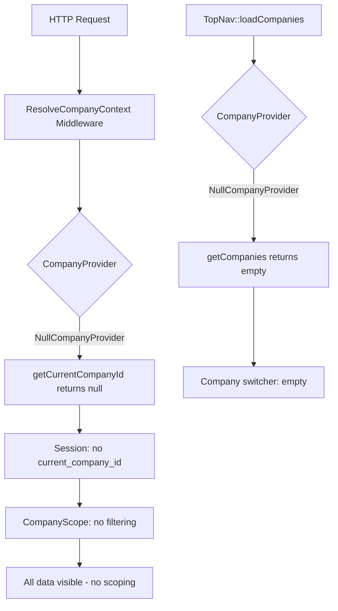

# Company Provider Architecture Recommendation

> **Status**: Design Recommendation  
> **Date**: 2026-08-30  
> **Decision**: Option B — Pure Service Provider Pattern (implement the existing contract)

---

## 1. Executive Summary

The library's `CompanyProvider` contract and session-based `CompanyScope` already form a complete, domain-agnostic multi-tenancy architecture. The only missing piece is that the HR consuming app has not yet implemented a concrete `CompanyProvider`. **Option B (pure service provider pattern)** is the correct choice: the HR app should implement the existing `CompanyProvider` contract to resolve `company_id` through `User → Employee → Company`. No library changes are needed. Adding `company_id` to the library's `users` table (Options A/C) would violate the library's independence safeguards by baking an opinionated multi-tenancy assumption into the foundation that not all consuming apps share.

---

## 2. Current State Analysis

### 2.1 The CompanyProvider Contract

The contract at [`src/Contracts/Navigation/CompanyProvider.php`](src/Contracts/Navigation/CompanyProvider.php:8) defines two methods:

| Method | Signature | Purpose |
|--------|-----------|---------|
| `getCompanies` | `(?User $user): Collection` | Returns all companies available to a user |
| `getCurrentCompanyId` | `(?User $user): ?int` | Returns the current/active company ID for a user |

The default binding is [`NullCompanyProvider`](src/Services/Navigation/NullCompanyProvider.php:9), which returns an empty collection and `null`. This is bound in [`UILibraryServiceProvider`](src/Providers/UILibraryServiceProvider.php:124-127) via the config key `ui-library.navigation.company_provider`, defaulting to `NullCompanyProvider::class` as declared in [`src/Config/ui-library.php`](src/Config/ui-library.php:308).

### 2.2 How CompanyScope Works (Session-Based, NOT User-Column-Based)

This is the most critical architectural finding. [`CompanyScope`](src/Scopes/CompanyScope.php:29-39) does **not** read `$user->company_id`. It reads the current company ID from the **session**:

```php
// CompanyScope::apply() — line 34
$companyId = Session::get($sessionKey);  // default key: 'current_company_id'
```

The scope then applies `WHERE {table}.{column} = $companyId` to all models using the [`HasCompanyScope`](src/Traits/HasCompanyScope.php:22) trait. The column name is configurable via `ui-library.tenancy.column` (default: `'company_id'`).

**Key insight**: The `company_id` column must exist on **scoped models** (e.g., `employees`, `departments`), not on the `users` table. The `User` model does **not** use `HasCompanyScope` and does **not** need a `company_id` column for scoping to work.

### 2.3 The Session Population Chain

The session key `current_company_id` is populated through three pathways:

**Path 1 — Middleware (every request):**
[`ResolveCompanyContext`](src/Http/Middleware/ResolveCompanyContext.php:21-37) runs at the start of every request. It calls `$this->companyProvider->getCurrentCompanyId($user)`. With `NullCompanyProvider`, this returns `null`, so nothing is stored. The middleware only sets the session when no value exists yet (lazy resolution).

**Path 2 — TopNav mount (page load):**
[`TopNav::loadCompanies()`](src/Http/Livewire/Layouts/Navs/TopNav.php:711-754) has a fallback chain:
1. If session has `0` → "All Companies" mode
2. If session has a valid company ID → use it
3. If `CompanyProvider::getCurrentCompanyId()` returns a value → use it and store in session
4. If companies list is non-empty → use the first company and store in session

**Path 3 — Explicit switch (user action):**
[`OrganizationSwitchController`](src/Http/Controllers/OrganizationSwitchController.php:32-69) validates the user belongs to the company via `CompanyProvider::getCompanies()`, then stores `session(['current_company_id' => (int) $companyId])`.

### 2.4 The User Table (No company_id)

The library's user migration at [`dependencies/database/migrations/2014_10_12_000000_create_users_table.php`](dependencies/database/migrations/2014_10_12_000000_create_users_table.php:11-26) creates a `users` table with: `id`, `name`, `email`, `status`, `password`, `email_verified_at`, `rememberToken`, `timestamps`, `softDeletes`. There is **no** `company_id` column.

The library's [`User` model](dependencies/Models/User.php:12) extends `BaseUser` and uses `HasApiTokens`, `GetsOnboarded`, `HasSettings`. There is no `company()` relationship.

### 2.5 The HR Consuming App's Data Model

The HR app's [`Employee` model](https://github.com/your-org/hr-consuming-app/blob/main/app/Modules/Hr/Models/Employee.php:27) has:
- `company_id` in `$fillable` (line 45)
- `company()` → `belongsTo(Company::class)` (line 131-134)
- `user()` → `belongsTo(User::class)` (line 146-149)
- Uses `HasCompanyScope` trait (line 29)

The chain is: **User → Employee → Company** (via `$user->employee->company_id` or equivalent).

### 2.6 The Full Data Flow (Current, Broken State)



### 2.7 The Established Contract Pattern

The library consistently uses this pattern across **all** extension points:

| Contract | Default Implementation | Config Key |
|----------|----------------------|------------|
| `ApproverResolver` | `DefaultApproverResolver` | `ui-library.approvals.approver_resolver` |
| `ApproverLabelResolver` | `DefaultApproverLabelResolver` | `ui-library.approvals.approver_label_resolver` |
| `WorkspaceResolver` | `NullWorkspaceResolver` | `ui-library.navigation.workspace_resolver` |
| `CompanyProvider` | `NullCompanyProvider` | `ui-library.navigation.company_provider` |
| `TemplateVariableRegistry` | `DefaultTemplateVariableRegistry` | `ui-library.notifications.template_variables` |
| `DataTableAuthorizationProvider` | `DefaultAuthorizationProvider` | `ui-library.datatables.authorization_provider` |

**No existing contract has been "bypassed" by adding a column to a library model.** The pattern is uniform: contract → default (null or functional) → config-driven binding → consuming app overrides.

---

## 3. Option-by-Option Evaluation

### 3.1 Option A: Add `company_id` to the Library's `users` Table

**What it entails:**
- Add nullable `$table->foreignId('company_id')->nullable()` to the library's user migration
- Add `company()` relationship to the library's `User` model
- Create a new default `CompanyProvider` that reads `$user->company_id`
- The HR app must sync `user.company_id` with `employee.company_id`

**Analysis against criteria:**

| Criterion | Assessment |
|-----------|------------|
| **CompanyScope compatibility** | ⚠️ Moot — CompanyScope reads from session, not `$user->company_id`. Adding the column doesn't change scoping behavior. A new default CompanyProvider would need to write to session. |
| **Library independence** | ❌ **Violation.** The independence safeguards doc (§3.1) states the library "MUST NOT contain any reference to a specific business domain." Adding `company_id` to `users` assumes every consuming app organizes users by company — an HR/ERP concept. An inventory app may not have companies. A CRM may organize by territory. |
| **Two-domain test** (§6.4) | ❌ **Fails.** "Would this work identically for both an HR app and an inventory app?" No — an inventory app may have no concept of "company" on users. |
| **Migration impact** | ⚠️ Nullable, so existing apps won't break on schema level. But it adds a column that may be meaningless to non-multi-tenant apps. |
| **HR app impact** | ❌ Creates data duplication: `employee.company_id` AND `user.company_id` must be kept in sync. Every employee create/update must also update the user. |
| **Precedent** | ❌ No existing contract was resolved by adding a column to a library model. `ApproverResolver` wasn't solved by adding `approver_id` to users. `WorkspaceResolver` wasn't solved by adding `workspace_id` to users. |
| **Config-driven philosophy** (§3.2) | ❌ Contradicts the config-driven approach. The library would hardcode an assumption instead of exposing an extension point. |

**Verdict: Rejected.** This option violates the library's core architectural principle of domain agnosticism and creates data synchronization problems for the HR app.

### 3.2 Option B: Pure Service Provider Pattern (Implement the Existing Contract)

**What it entails:**
- **Zero library changes.** The contract, null provider, config key, and service provider binding already exist.
- The HR consuming app creates a class (e.g., `App\Services\HrCompanyProvider`) that implements `CompanyProvider`
- `getCompanies()`: queries companies through `User → Employee → Company` (or directly if the user has a `companies()` relationship)
- `getCurrentCompanyId()`: returns the first available company ID, or reads from a user preference
- The HR app binds it in `AppServiceProvider`:
  ```php
  $this->app->bind(CompanyProvider::class, HrCompanyProvider::class);
  ```
  Or publishes `ui-library.php` and sets `navigation.company_provider`.

**Analysis against criteria:**

| Criterion | Assessment |
|-----------|------------|
| **CompanyScope compatibility** | ✅ Perfect fit. The HR CompanyProvider returns a company ID → middleware stores it in session → CompanyScope reads from session → data is scoped. |
| **Library independence** | ✅ **Fully compliant.** The library stays domain-agnostic. The HR-specific logic (`User → Employee → Company`) lives exclusively in the consuming app. |
| **Two-domain test** (§6.4) | ✅ **Passes.** An HR app resolves via `User → Employee → Company`. An inventory app resolves via `User → Warehouse → Organization`. A CRM resolves via `User → Territory → Account`. Each implements the same contract differently. |
| **Migration impact** | ✅ **None.** No library migrations change. No existing apps break. |
| **HR app impact** | ✅ No data duplication. The HR app uses its existing `employee.company_id` as the source of truth. |
| **Precedent** | ✅ **Strong precedent.** This is exactly how `WorkspaceResolver`, `ApproverResolver`, `ApproverLabelResolver`, and `TemplateVariableRegistry` work. The independence safeguards doc (§5.2) explicitly lists "Company resolution | `CompanyProvider` contract + null default | Binds tenant provider" as the intended seam. |
| **Config-driven philosophy** (§3.2) | ✅ Aligns perfectly. The consuming app overrides a config key. The library never branches on domain. |
| **Extension-point recipe** (§6.2) | ✅ Follows the prescribed recipe: capability → contract → default → config binding → document. Steps 1-5 are already done; only step 6 (consuming app implementation) remains. |

**Verdict: Recommended.** This is the intended design. The library already provides the complete infrastructure; the consuming app simply needs to plug into it.

### 3.3 Option C: Hybrid

**What it entails:**
- Add nullable `company_id` to the library's user migration
- Add `company()` relationship to the library's `User` model
- Ship a default `CompanyProvider` that reads `$user->company_id` (if column exists)
- Consuming apps can still override with a custom implementation

**Analysis against criteria:**

| Criterion | Assessment |
|-----------|------------|
| **Library independence** | ⚠️ **Partial violation.** Adding the column still assumes multi-tenancy is a universal concern. The "if column exists" guard is a runtime check that masks a design-time assumption. |
| **Two-domain test** (§6.4) | ⚠️ **Borderline.** The *contract* passes (apps can override), but the *default implementation* assumes `company_id` on users, which not all domains need. |
| **Migration impact** | ⚠️ Same as Option A — adds a column that may be meaningless. Nullable mitigates breakage but doesn't justify the addition. |
| **Complexity** | ❌ Adds complexity without clear benefit. The "if column exists" pattern is fragile (what if the column exists but the app doesn't use it?). |
| **Precedent** | ❌ No existing contract uses a "column-if-exists" hybrid pattern. All other contracts are pure: null default or functional default, never a schema-dependent default. |

**Verdict: Rejected.** This is a half-measure that inherits the downsides of Option A (adds opinionated column) without the full benefits of Option B (clean separation). The "if column exists" pattern introduces runtime ambiguity that the pure contract pattern avoids.

---

## 4. Recommendation: Option B — Pure Service Provider Pattern

### 4.1 Justification

The library's independence safeguards document ([`docs/library/25-library-independence-safeguards.md`](docs/library/25-library-independence-safeguards.md)) establishes a single non-negotiable principle (§1):

> The library MUST NOT contain any reference to a specific business domain, module, model, or namespace that belongs to a consuming application.

Adding `company_id` to the `users` table would embed an assumption that every consuming app organizes users by company. This fails the two-domain test (§6.4): an inventory app may organize by warehouse, a CRM by territory, a single-tenant app may have no organizational hierarchy at all.

The library already provides the complete, correct architecture:

1. **Contract**: [`CompanyProvider`](src/Contracts/Navigation/CompanyProvider.php:8) — two clean methods, domain-agnostic
2. **Default**: [`NullCompanyProvider`](src/Services/Navigation/NullCompanyProvider.php:9) — safe no-op default
3. **Config binding**: [`ui-library.navigation.company_provider`](src/Config/ui-library.php:308) — overridable without touching library code
4. **Session-based scoping**: [`CompanyScope`](src/Scopes/CompanyScope.php:29-39) — reads from session, not user column
5. **Middleware**: [`ResolveCompanyContext`](src/Http/Middleware/ResolveCompanyContext.php:21-37) — lazy resolution at request start
6. **UI integration**: [`TopNav::loadCompanies()`](src/Http/Livewire/Layouts/Navs/TopNav.php:711-754) — full fallback chain
7. **Switch controller**: [`OrganizationSwitchController`](src/Http/Controllers/OrganizationSwitchController.php:32-69) — validation + session persistence

Every other contract in the library follows this exact pattern. There is no reason for `CompanyProvider` to be the exception.

### 4.2 Why the Session-Based Approach Is Correct

A common misconception is that `CompanyScope` needs `$user->company_id` to function. It does not. The scope reads from the **session**, which is populated by the middleware and the TopNav component. This is architecturally superior because:

- **Decouples identity from tenancy**: The user's identity (who they are) is separate from their current tenant context (which company they're viewing). A user can belong to multiple companies and switch between them without changing their user record.
- **Supports "All Companies" mode**: `company_id = 0` in session means "no filtering" — impossible if scoping were tied to a non-nullable user column.
- **Works across auth boundaries**: API tokens, impersonation, and scheduled jobs can all set the session key without mutating the user model.

---

## 5. Implementation Steps

### 5.1 Library Side: No Changes Required

The library already has everything needed. No migrations, no model changes, no contract changes.

**Verification checklist (library side):**
- [x] `CompanyProvider` contract exists and is domain-agnostic
- [x] `NullCompanyProvider` provides safe default
- [x] `UILibraryServiceProvider` binds contract via config key
- [x] `ui-library.php` declares `navigation.company_provider` key
- [x] `CompanyScope` reads from session, not user column
- [x] `ResolveCompanyContext` middleware resolves lazily
- [x] `TopNav::loadCompanies()` has full fallback chain
- [x] `OrganizationSwitchController` validates and persists

### 5.2 HR Consuming App Side: Implementation Steps

**Step 1: Create `HrCompanyProvider`**

Create a class in the HR app (e.g., `app/Services/HrCompanyProvider.php`) that implements `QuickerFaster\UILibrary\Contracts\Navigation\CompanyProvider`:

- `getCompanies(?User $user): Collection` — Resolve companies through the `User → Employee → Company` chain. The `Employee` model already has `user()` and `company()` relationships. Query distinct companies where the user has an employee record.
- `getCurrentCompanyId(?User $user): ?int` — Return the first available company ID (or read from a user preference/setting if one exists). The `TopNav::loadCompanies()` fallback chain will handle storing it in session.

**Step 2: Bind the Implementation**

Either publish the library config and set the key:

```bash
php artisan vendor:publish --tag=ui-library-config
```

Then in `config/ui-library.php`:
- Set `navigation.company_provider` to `App\Services\HrCompanyProvider::class`

Or bind in `AppServiceProvider::register()`:
- `$this->app->bind(CompanyProvider::class, HrCompanyProvider::class);`

**Step 3: Register the Middleware**

Add `qf.resolve-company-context` to the web and api middleware groups in `app/Http/Kernel.php` so the session is populated on every request.

**Step 4: Verify the Data Flow**

1. User logs in → `ResolveCompanyContext` middleware runs → `HrCompanyProvider::getCurrentCompanyId()` returns a company ID → stored in session
2. `CompanyScope` reads session → filters all `HasCompanyScope` models by `company_id`
3. `TopNav::loadCompanies()` → `HrCompanyProvider::getCompanies()` returns the user's companies → company switcher is populated
4. User switches company → `OrganizationSwitchController` validates → updates session → `CompanyScope` filters by new company

### 5.3 Other Consuming Apps

For a different consuming app (e.g., inventory management):
- Implement `CompanyProvider` to resolve through `User → Warehouse → Organization`
- Bind it the same way
- The library requires zero changes

For a single-tenant app:
- Leave `NullCompanyProvider` as the binding
- `CompanyScope` applies no filtering (session has no `current_company_id`)
- Company switcher is hidden (no companies returned)

---

## 6. Summary Comparison

| Dimension | Option A (Column) | Option B (Contract) | Option C (Hybrid) |
|-----------|:---:|:---:|:---:|
| Library independence | ❌ Violates | ✅ Compliant | ⚠️ Partial |
| Two-domain test | ❌ Fails | ✅ Passes | ⚠️ Borderline |
| Follows existing pattern | ❌ No precedent | ✅ Strong precedent | ❌ No precedent |
| HR app data duplication | ❌ Yes | ✅ No | ❌ Yes |
| Migration risk | ⚠️ Nullable but opinionated | ✅ None | ⚠️ Same as A |
| Supports "All Companies" | ❌ Requires special value | ✅ Via session `0` | ❌ Requires special value |
| Multi-app flexibility | ❌ One assumption for all | ✅ Each app decides | ⚠️ Default may not fit |
| Implementation effort | Medium (library + HR) | Low (HR only) | Medium-High (both) |

**Final recommendation: Option B — implement the existing `CompanyProvider` contract in the HR consuming app. No library changes are needed.**