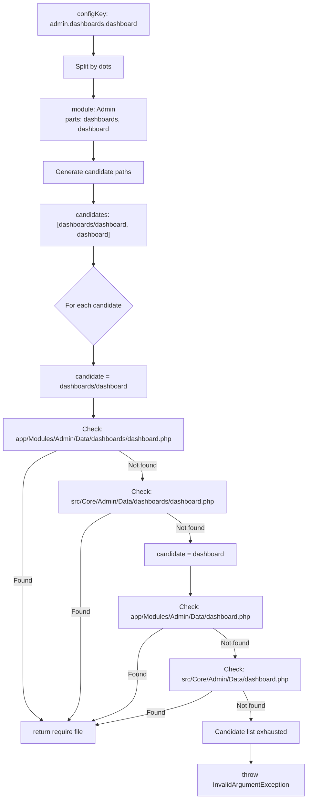

# Dual-Location Config Resolution Strategy

> **Status**: Design Phase  
> **Date**: 2026-08-12  
> **Target**: QuickerFaster UI Library — [`ModelConfigRepository`](src/Services/Config/ModelConfigRepository.php)

---

## 1. Problem Statement

Before the library refactoring, config keys like `admin.dashboards.dashboard` mapped directly to Data files within the consuming app:

```
app/Modules/Admin/Data/dashboards/dashboard.php
```

After the refactoring, core module Data files moved to the library, but with a **flatter directory structure** — the intermediate `dashboards/` subdirectory was dropped:

```
src/Core/Admin/Data/dashboard.php        ← library: no "dashboards/" subdirectory
src/Core/Organization/Data/dashboard.php
src/Core/System/Data/dashboard.php
```

The consuming app still uses config keys with the `dashboards.` segment (e.g., `admin.dashboards.dashboard`, `hr.dashboards.dashboard_payroll_overview`). When the consuming app provides its own `Data/dashboards/dashboard.php`, it is found first and works correctly. But if a consuming app removes its override, the library fallback at `src/Core/Admin/Data/dashboards/dashboard.php` does **not exist** because the library stores the file at `Data/dashboard.php`.

### 1.1 Scope of the Mismatch

| Config Key | Consuming App Path | Library Path (exists?) |
|---|---|---|
| `admin.dashboards.dashboard` | `app/Modules/Admin/Data/dashboards/dashboard.php` | `src/Core/Admin/Data/dashboard.php` ✓ |
| `system.dashboards.dashboard` | — | `src/Core/System/Data/dashboard.php` ✓ |
| `organization.dashboards.dashboard` | — | `src/Core/Organization/Data/dashboard.php` ✓ |
| `hr.dashboards.dashboard` | `app/Modules/Hr/Data/dashboards/dashboard.php` | — ✗ (HR is business module) |
| `hr.dashboards.dashboard_payroll_overview` | `app/Modules/Hr/Data/dashboards/dashboard_payroll_overview.php` | — ✗ (HR is business module) |
| `admin.user` | `app/Modules/Admin/Data/user.php` | `src/Core/Admin/Data/user.php` ✓ |
| `admin.role` | `app/Modules/Admin/Data/role.php` | `src/Core/Admin/Data/role.php` ✓ |

**Pattern**: The mismatch only affects dashboard Data files where the config key uses the `dashboards.` intermediate segment but the library stores the file directly under `Data/`.

---

## 2. Current Resolution Flow

### 2.1 Entry Points

All config key resolution flows through a single class:

```
ConfigResolver(configKey) ─┐
DashboardResolver(configKey) ─┤
WizardConfigResolver(configKey) ─┤
ApprovalConfigResolver(configKey) ─┘
                                   │
                                   ▼
                        ModelConfigRepository::get(configKey)
                                   │
                                   ▼
                        ModelConfigRepository::loadFromFile(configKey)
```

[`ConfigResolver`](src/Services/Config/ConfigResolver.php:14-18), [`DashboardResolver`](src/Services/Config/Dashboards/DashboardResolver.php:17-21), and other resolver classes all delegate to [`ModelConfigRepository::get()`](src/Services/Config/ModelConfigRepository.php:38).

### 2.2 ModelConfigRepository::loadFromFile — Current Algorithm

```php
// Simplified from ModelConfigRepository.php:103-128
protected function loadFromFile(string $configKey): array
{
    $parts = explode('.', $configKey);
    $module = ucfirst(array_shift($parts));          // 'admin'
    $relativePath = implode('/', $parts);             // 'dashboards/dashboard'

    foreach ($this->basePaths as $basePath) {
        $filePath = $basePath . '/' . $module . '/Data/' . $relativePath . '.php';
        if (File::exists($filePath)) {
            return require $filePath;
        }
    }

    throw new InvalidArgumentException(...);
}
```

### 2.3 Current Base Paths (Hardcoded)

```php
// ModelConfigRepository.php:25-28
$this->basePaths = $basePaths ?? [
    app_path('Modules'),                                          // Business modules (higher priority)
    base_path('vendor/quicker-faster/ui-library/src/Core'),       // Core modules (fallback)
];
```

### 2.4 Step-by-Step Trace: `admin.dashboards.dashboard`

```
$parts       = ['admin', 'dashboards', 'dashboard']
$module      = 'Admin'
$relativePath = 'dashboards/dashboard'

Search order:
  1. app/Modules/Admin/Data/dashboards/dashboard.php  ← FOUND (consuming app override)
  2. vendor/.../src/Core/Admin/Data/dashboards/dashboard.php  ← NOT CHECKED (already found)

Result: Consuming app's file is loaded — overrides library default.
```

### 2.5 Step-by-Step Trace: `system.dashboards.dashboard` (no consuming app override)

```
$parts       = ['system', 'dashboards', 'dashboard']
$module      = 'System'
$relativePath = 'dashboards/dashboard'

Search order:
  1. app/Modules/System/Data/dashboards/dashboard.php  ← NOT FOUND
  2. vendor/.../src/Core/System/Data/dashboards/dashboard.php  ← NOT FOUND (library has Data/dashboard.php, not Data/dashboards/dashboard.php)

Result: ❌ Throws InvalidArgumentException — neither location has the file at the expected path.
```

This is the bug: `system.dashboards.dashboard` fails to resolve because the library has `Data/dashboard.php` (flat) but the key resolves to `Data/dashboards/dashboard.php` (nested).

### 2.6 Confirmed: Config Key Convention

Config keys follow `{module}.{path...}` format:
- **First segment**: module name, case-insensitive (e.g., `admin`, `hr`, `system`, `organization`)
- **Remaining segments**: directory path within the `Data/` directory, dots replaced with `/`
- Examples:
  - `hr.employee` → `Hr/Data/employee.php`
  - `admin.dashboards.dashboard` → `Admin/Data/dashboards/dashboard.php`
  - `hr.reports.absence_leave` → `Hr/Data/reports/absence_leave.php`
  - `hr.dashboards.dashboard_payroll_overview` → `Hr/Data/dashboards/dashboard_payroll_overview.php`

### 2.7 All File Resolution Points

| Resolver | Config Key Source | Data File Path |
|---|---|---|
| `ConfigResolver` | Blade views, Livewire components | `{basePath}/{Module}/Data/{segments}.php` |
| `DashboardResolver` | `config-key=""` attribute on `<livewire:qf.dashboard>` | Same |
| `WizardConfigResolver` | Livewire wizard components | Same |
| `ApprovalConfigResolver` | Approval Livewire components | Same |
| `NavigationLayout::resolveNavigationConfigPath()` | Module name (separate, for navigation.php only) | 4-tier priority (published → business → core → vendor) |

**Key insight**: All Data file resolution goes through `ModelConfigRepository::loadFromFile()`. Navigation config resolution (`resolveNavigationConfigPath`) uses a separate 4-tier mechanism and is NOT affected by this design change.

---

## 3. Proposed Strategy: Dual-Location with Progressive Fallback

### 3.1 Design Principles

1. **Consuming app always wins** — if a file exists in `app/Modules/{Module}/Data/`, use it.
2. **Library is the fallback** — if not found in the app, check `src/Core/{Module}/Data/`.
3. **Progressive path fallback** — when the exact path doesn't match in the library, progressively strip intermediate path segments to find the closest matching file.
4. **Configurable base paths** — use `config('ui-library.module_paths')` instead of hardcoded strings.
5. **Backward compatibility** — existing consuming apps with their own Data files continue working without changes.

### 3.2 Resolution Priority (Updated)

```
Priority order for each relative path attempt:
  1. app/Modules/{Module}/Data/{exactPath}.php          ← App override (highest)
  2. src/Core/{Module}/Data/{exactPath}.php              ← Library exact match
  3. app/Modules/{Module}/Data/{strippedPath}.php         ← App override (stripped)
  4. src/Core/{Module}/Data/{strippedPath}.php            ← Library stripped match (lowest)
```

Where `strippedPath` is `exactPath` with the first segment removed (e.g., `dashboards/dashboard` → `dashboard`).

### 3.3 Why "Progressive Stripping" and Not "Aliases"?

Alternative approaches considered:

| Approach | Why Rejected |
|---|---|
| **Config key aliases/rewriting** (e.g., map `admin.dashboards.dashboard` → `admin.dashboard`) | Requires maintaining a mapping table; fragile across modules |
| **Symlinks** (create `Data/dashboards/dashboard.php` → `../dashboard.php`) | Filesystem-dependent; breaks on some deployment environments |
| **Move library files to `Data/dashboards/`** | Would make the library structure match consuming apps, but adds unnecessary nesting for simple modules |
| **Require consuming apps to change their config keys** | Breaking change; violates backward compatibility |

**Progressive path stripping** is the right choice because:
- It requires changes to only **one file**: `ModelConfigRepository`
- No configuration changes needed
- No file moves needed in either the library or consuming app
- Fully backward compatible
- Handles edge cases naturally (see §6)

### 3.4 Override Strategy: Replace (Not Merge)

When both the consuming app and library provide a file for the same config key, the consuming app's file **completely replaces** the library's file. There is **no merging** of array values. This is consistent with the existing `require $filePath` behavior — each file returns a complete PHP array.

---

## 4. Resolution Algorithm

### 4.1 Pseudocode

```
function loadFromFile(configKey):
    parts = configKey.split('.')
    module = ucfirst(parts.shift())
    relativePath = parts.join('/')

    // Generate candidate paths by progressively stripping segments
    candidates = [relativePath]
    segments = parts.copy()
    while segments.length > 1:
        segments.shift()          // Remove first remaining segment
        candidates.push(segments.join('/'))

    // For each candidate path (exact → progressively shorter)
    for candidate in candidates:
        // For each base path (app first, library second)
        for basePath in basePaths:
            filePath = basePath + '/' + module + '/Data/' + candidate + '.php'
            if fileExists(filePath):
                return require(filePath)

    throw InvalidArgumentException
```

### 4.2 Trace: `admin.dashboards.dashboard` (with progressive fallback)

```
candidates = ['dashboards/dashboard', 'dashboard']

Search order:
  Pass 1: candidate = 'dashboards/dashboard'
    1. app/Modules/Admin/Data/dashboards/dashboard.php     ← FOUND → return ✓

  (Pass 2 'dashboard' never reached because Pass 1 already matched)
```

### 4.3 Trace: `system.dashboards.dashboard` (no consuming app override)

```
candidates = ['dashboards/dashboard', 'dashboard']

Search order:
  Pass 1: candidate = 'dashboards/dashboard'
    1. app/Modules/System/Data/dashboards/dashboard.php    ← NOT FOUND
    2. src/Core/System/Data/dashboards/dashboard.php        ← NOT FOUND

  Pass 2: candidate = 'dashboard'
    3. app/Modules/System/Data/dashboard.php                ← NOT FOUND
    4. src/Core/System/Data/dashboard.php                   ← FOUND → return ✓
```

### 4.4 Trace: `hr.dashboards.dashboard_payroll_overview` (business module, no library fallback)

```
candidates = ['dashboards/dashboard_payroll_overview', 'dashboard_payroll_overview']

Search order:
  Pass 1: candidate = 'dashboards/dashboard_payroll_overview'
    1. app/Modules/Hr/Data/dashboards/dashboard_payroll_overview.php   ← FOUND → return ✓
```

### 4.5 Trace: `hr.employee` (standard flat key, no intermediate segments)

```
candidates = ['employee']

Search order:
  Pass 1: candidate = 'employee'
    1. app/Modules/Hr/Data/employee.php    ← FOUND → return ✓
```

**No stripping needed** — works identically to current behavior for flat keys.

### 4.6 Trace: `hr.dashboards.dashboard` (business module, consuming app has it, library doesn't)

```
candidates = ['dashboards/dashboard', 'dashboard']

Search order:
  Pass 1: candidate = 'dashboards/dashboard'
    1. app/Modules/Hr/Data/dashboards/dashboard.php                     ← FOUND → return ✓
  
  (Library is never checked because app provided the file)
```

### 4.7 Flow Diagram



---

## 5. File Path Mapping Reference

### 5.1 Configurable Base Paths

Instead of hardcoded paths, `ModelConfigRepository` should read from `config('ui-library.module_paths')`:

```php
// Current (hardcoded):
$this->basePaths = $basePaths ?? [
    app_path('Modules'),
    base_path('vendor/quicker-faster/ui-library/src/Core'),
];

// Proposed (config-driven):
$this->basePaths = $basePaths ?? [
    config('ui-library.module_paths.business', app_path('Modules')),
    config('ui-library.module_paths.core') ?: base_path('vendor/quicker-faster/ui-library/src/Core'),
];
```

The config values are already set:
- `module_paths.core` → set by [`UILibraryServiceProvider::boot()`](src/Providers/UILibraryServiceProvider.php:102) to `{package}/src/Core`
- `module_paths.business` → defined in [`ui-library.php`](src/Config/ui-library.php:65) as `base_path('app/Modules')`

### 5.2 Full Mapping Table

| Config Key | Module | Candidate 1 (exact) | Candidate 2 (stripped) | App Path | Lib Path |
|---|---|---|---|---|---|
| `admin.user` | Admin | `user` | — | `app/Modules/Admin/Data/user.php` | `src/Core/Admin/Data/user.php` |
| `admin.role` | Admin | `role` | — | `app/Modules/Admin/Data/role.php` | `src/Core/Admin/Data/role.php` |
| `admin.dashboards.dashboard` | Admin | `dashboards/dashboard` | `dashboard` | `…/Data/dashboards/dashboard.php` | `…/Data/dashboard.php` |
| `system.dashboards.dashboard` | System | `dashboards/dashboard` | `dashboard` | — | `src/Core/System/Data/dashboard.php` |
| `organization.dashboards.dashboard` | Organization | `dashboards/dashboard` | `dashboard` | — | `src/Core/Organization/Data/dashboard.php` |
| `hr.employee` | Hr | `employee` | — | `app/Modules/Hr/Data/employee.php` | — |
| `hr.reports.absence_leave` | Hr | `reports/absence_leave` | `absence_leave` | `…/Data/reports/absence_leave.php` | — |
| `hr.dashboards.dashboard_payroll_overview` | Hr | `dashboards/dashboard_payroll_overview` | `dashboard_payroll_overview` | `…/Data/dashboards/dashboard_payroll_overview.php` | — |

---

## 6. Edge Cases

### 6.1 Missing Files in Both Locations

**Scenario**: Config key `admin.nonexistent.thing` — no Data file exists in either location for any candidate path.

**Behavior**: Throw `InvalidArgumentException` with a message listing all searched paths. This is identical to current behavior.

### 6.2 Config Key With Only One Segment

**Scenario**: `configKey = 'dashboard'` — no module segment.

**Behavior**: Already handled: `count($parts) < 2` throws `InvalidArgumentException` ("Invalid config key format").

### 6.3 Config Key With Many Segments

**Scenario**: `hr.a.b.c.d.e` — deeply nested path.

**Candidate generation**: 
```
[a/b/c/d/e, b/c/d/e, c/d/e, d/e, e]
```

**Behavior**: Searches progressively until a match is found. If a consuming app has `Data/a/b/c/d/e.php`, it matches on the first candidate. If only `Data/e.php` exists in the library, it matches on the last candidate. This is correct — we prefer the most specific match.

### 6.4 Ambiguous Matches

**Scenario**: Library has both `Data/dashboards/dashboard.php` AND `Data/dashboard.php`.

**Behavior**: The more specific path (`Data/dashboards/dashboard.php`) matches first during the exact-path pass. The stripped-path pass is never reached. This is correct — exact matches should beat stripped matches.

### 6.5 Strip Candidate Matches Business But Not Exact

**Scenario**: Config key `hr.dashboards.dashboard`. Consumer has `Data/dashboard.php` (flat) but NOT `Data/dashboards/dashboard.php` (nested).

**Behavior**: 
- Pass 1 (`dashboards/dashboard`): neither location has it
- Pass 2 (`dashboard`): `app/Modules/Hr/Data/dashboard.php` found

This is correct behavior — the consumer's flat file takes priority, which is what they intended.

### 6.6 Config Key Format Variations

**Scenario**: Mixed casing like `Admin.Dashboards.Dashboard`.

**Behavior**: `ucfirst(array_shift($parts))` normalizes to `Admin`. Remaining segments use `implode('/', $parts)` which preserves the original case. This is unchanged from current behavior. If consuming apps use inconsistent casing in file names, they should normalize.

### 6.7 Caching Considerations

The `ModelConfigRepository` caches results with `Cache::rememberForever()`. The cache key is `model_config_{configKey}` (dots replaced with underscores). Since the cache key is based on the config key (unchanged), existing cache entries remain valid. However, if a consumer adds a new override file, they must call `Cache::forget('model_config_admin_dashboards_dashboard')` or `ModelConfigRepository::forget('admin.dashboards.dashboard')` to invalidate.

**Recommendation**: The `InstallCommand` or deployment process should call `$repository->flush()` after installing/updating the library.

### 6.8 Navigation Config vs. Data Config

`NavigationLayout::resolveNavigationConfigPath()` uses a completely separate 4-tier resolution for navigation configs (published → business → core → vendor). This method already handles both locations correctly and does NOT need modification. The design in this document only applies to Data file resolution through `ModelConfigRepository`.

---

## 7. Implementation Plan

### 7.1 Files to Modify

| File | Change | Impact |
|---|---|---|
| [`src/Services/Config/ModelConfigRepository.php`](src/Services/Config/ModelConfigRepository.php) | Update `$basePaths` to use config; add `generateCandidatePaths()`; update `loadFromFile()` with progressive fallback | **The only file that needs changes** |

### 7.2 Detailed Changes to ModelConfigRepository

#### 7.2.1 Constructor — Config-Driven Base Paths

Replace hardcoded paths with config values:

```php
public function __construct(?array $basePaths = null)
{
    $this->basePaths = $basePaths ?? [
        config('ui-library.module_paths.business', app_path('Modules')),
        config('ui-library.module_paths.core') ?: base_path('vendor/quicker-faster/ui-library/src/Core'),
    ];
}
```

#### 7.2.2 New Method — generateCandidatePaths

```php
/**
 * Generate progressively shorter candidate paths from config key segments.
 *
 * For config key 'admin.dashboards.dashboard', segments are ['dashboards', 'dashboard'].
 * Candidates: ['dashboards/dashboard', 'dashboard']
 *
 * For config key 'hr.employee', segments are ['employee'].
 * Candidates: ['employee']  (no stripping needed)
 *
 * @param array<int, string> $segments  The path segments after removing the module prefix
 * @return array<int, string>           Candidate relative paths, most specific first
 */
protected function generateCandidatePaths(array $segments): array
{
    $candidates = [];

    while (!empty($segments)) {
        $candidates[] = implode(DIRECTORY_SEPARATOR, $segments);
        array_shift($segments);  // Remove first segment for next iteration
    }

    return $candidates;
}
```

#### 7.2.3 Updated Method — loadFromFile

```php
protected function loadFromFile(string $configKey): array
{
    $parts = explode('.', $configKey);
    if (count($parts) < 2) {
        throw new \InvalidArgumentException(
            "Invalid config key format: {$configKey}. Expected 'module.path...'"
        );
    }

    $module = ucfirst(array_shift($parts));
    $candidates = $this->generateCandidatePaths($parts);

    $searchedPaths = [];
    foreach ($candidates as $relativePath) {
        foreach ($this->basePaths as $basePath) {
            $filePath = $basePath . '/' . $module . '/Data/' . $relativePath . '.php';
            $searchedPaths[] = $filePath;

            if (File::exists($filePath)) {
                return require $filePath;
            }
        }
    }

    throw new \InvalidArgumentException(
        "Configuration not found for key: {$configKey}. " .
        "Searched paths:\n  - " . implode("\n  - ", $searchedPaths)
    );
}
```

### 7.3 Files NOT Modified

These files use `ModelConfigRepository` but require **zero changes** because they consume it through its public `get()` API, which is unchanged:

| File | Usage |
|---|---|
| [`src/Services/Config/ConfigResolver.php`](src/Services/Config/ConfigResolver.php:18) | `$repository->get($configKey)` |
| [`src/Services/Config/Dashboards/DashboardResolver.php`](src/Services/Config/Dashboards/DashboardResolver.php:20) | `$repository->get($configKey)` |
| [`src/Services/Config/Wizards/WizardConfigResolver.php`](src/Services/Config/Wizards/WizardConfigResolver.php) | Internal resolution |
| [`src/Services/Config/Approvals/ApprovalConfigResolver.php`](src/Services/Config/Approvals/ApprovalConfigResolver.php) | Internal resolution |
| [`src/Components/NavigationLayout.php`](src/Components/NavigationLayout.php:359) | Only uses `resolveNavigationConfigPath()` for `navigation.php`, not Data files |

### 7.4 Test Plan

#### Unit Tests

1. **Exact match in business path**: `admin.user` resolves from `app/Modules/Admin/Data/user.php` when it exists
2. **Exact match in core path**: `admin.user` resolves from `src/Core/Admin/Data/user.php` when business path doesn't have it
3. **Progressive fallback to library**: `system.dashboards.dashboard` resolves from `src/Core/System/Data/dashboard.php` (stripped `dashboards/`)
4. **Business override still wins**: `admin.dashboards.dashboard` with `app/Modules/Admin/Data/dashboards/dashboard.php` existing — resolves from business path (not library)
5. **Business flat override**: `admin.dashboards.dashboard` with only `app/Modules/Admin/Data/dashboard.php` — resolves from stripped business path
6. **Missing in both**: `admin.nonexistent.thing` throws `InvalidArgumentException`
7. **Invalid key format**: `dashboard` (one segment) throws `InvalidArgumentException`
8. **Deeply nested path with stripping**: `module.a.b.c.d` with only `Data/d.php` in library resolves correctly

#### Integration Tests

9. **Dashboard Livewire component**: `<livewire:qf.dashboard config-key="system.dashboards.dashboard" />` renders without error
10. **DataTable with config key**: `<livewire:qf.data-table config-key="admin.user" />` works unchanged
11. **Export with config key**: Export job using `admin.dashboards.dashboard` resolves correctly

---

## 8. Backward Compatibility

### 8.1 Guarantees

| Aspect | Status | Details |
|---|---|---|
| **Existing consuming app Data files** | ✅ Unaffected | Business path is checked first in every candidate pass |
| **Config key format** | ✅ Unchanged | Same `module.segments` format |
| **Cache keys** | ✅ Unchanged | `model_config_{key}` format unchanged |
| **Public API** | ✅ Unchanged | `ModelConfigRepository::get()`, `ConfigResolver`, `DashboardResolver` signatures unchanged |
| **Error messages** | ✅ Enhanced | Now lists all searched paths across all candidates |
| **Navigation config** | ✅ Unaffected | `resolveNavigationConfigPath()` is separate from Data resolution |

### 8.2 Migration Path

1. **No action required** for consuming apps that already provide their own Data files.
2. For consuming apps that want to **remove their overrides** and use library defaults:
   - Delete the Data file from `app/Modules/{Module}/Data/dashboards/dashboard.php`
   - The library's flat `Data/dashboard.php` will be found via progressive fallback
   - Call `php artisan cache:clear` or `ModelConfigRepository::flush()` to clear cached configs
3. For consuming apps that **add new Data files**:
   - Place them in `app/Modules/{Module}/Data/{path}.php` using either flat or nested structure
   - They will take priority over library files regardless of structure

### 8.3 Risk Assessment

| Risk | Likelihood | Impact | Mitigation |
|---|---|---|---|
| Ambiguous resolution (two files match different candidates) | Low | Medium | More specific (longer path) always wins; documented in §6.4 |
| Performance impact from additional file checks | Low | Low | File existence checks are fast; results are cached forever |
| Cache staleness after library update | Medium | Low | Document `$repository->flush()` call in deployment |
| Config `module_paths.core` not set | Low | High | Fallback to hardcoded `vendor/...` path in constructor |

---

## 9. Summary

### What Changes

- **One file**: [`ModelConfigRepository`](src/Services/Config/ModelConfigRepository.php)
- **Three changes**: Config-driven base paths + `generateCandidatePaths()` + updated `loadFromFile()`
- **~30 lines** of code added/modified

### What Stays the Same

- All resolver classes (`ConfigResolver`, `DashboardResolver`, etc.)
- All consuming app Data files
- All library Data files
- All config key formats
- All navigation config resolution
- Cache mechanism and keys

### Resolution Flow (Final)

```
Config Key: "admin.dashboards.dashboard"

  1. app/Modules/Admin/Data/dashboards/dashboard.php   ← App exact override
  2. src/Core/Admin/Data/dashboards/dashboard.php       ← Lib exact match
  3. app/Modules/Admin/Data/dashboard.php               ← App stripped override
  4. src/Core/Admin/Data/dashboard.php                  ← Lib stripped match ✓
```

Consuming apps override by placing files in `app/Modules/{Module}/Data/` using either the full nested path (exact match) or the flattened path (stripped fallback). The library provides defaults via the flattened `src/Core/{Module}/Data/{file}.php` structure.
