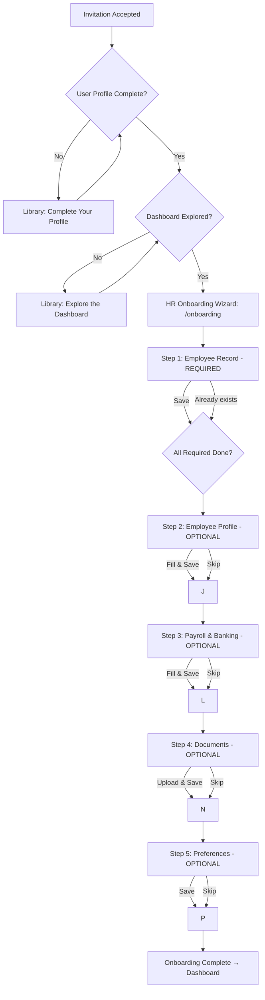

# Employee Onboarding Redesign Plan

## 1. Current State

### 1.1 Architecture Overview

The current post-acceptance onboarding flow uses **6 separate pages**, each with its own:

| # | Step Key | Livewire Component | Blade View | Condition Class | Route |
|---|----------|-------------------|------------|-----------------|-------|
| 1 | `employee_profile` | [`EmployeeProfileForm`](app/Modules/Hr/Http/Livewire/Onboarding/EmployeeProfileForm.php) | [`employee-profile.blade.php`](app/Modules/Hr/Resources/views/onboarding/employee-profile.blade.php) | [`EmployeeProfileCreated`](app/Modules/Hr/Conditions/EmployeeProfileCreated.php) | `/onboarding/employee-profile` |
| 2 | `personal_details` | [`PersonalDetailsForm`](app/Modules/Hr/Http/Livewire/Onboarding/PersonalDetailsForm.php) | [`personal-details.blade.php`](app/Modules/Hr/Resources/views/onboarding/personal-details.blade.php) | [`PersonalDetailsComplete`](app/Modules/Hr/Conditions/PersonalDetailsComplete.php) | `/onboarding/personal-details` |
| 3 | `emergency_contact` | [`EmergencyContactForm`](app/Modules/Hr/Http/Livewire/Onboarding/EmergencyContactForm.php) | [`emergency-contact.blade.php`](app/Modules/Hr/Resources/views/onboarding/emergency-contact.blade.php) | [`EmergencyContactAdded`](app/Modules/Hr/Conditions/EmergencyContactAdded.php) | `/onboarding/emergency-contact` |
| 4 | `bank_details` | [`BankDetailsForm`](app/Modules/Hr/Http/Livewire/Onboarding/BankDetailsForm.php) | [`bank-details.blade.php`](app/Modules/Hr/Resources/views/onboarding/bank-details.blade.php) | [`BankDetailsAdded`](app/Modules/Hr/Conditions/BankDetailsAdded.php) | `/onboarding/bank-details` |
| 5 | `documents` | [`DocumentsForm`](app/Modules/Hr/Http/Livewire/Onboarding/DocumentsForm.php) | [`documents.blade.php`](app/Modules/Hr/Resources/views/onboarding/documents.blade.php) | [`DocumentsUploaded`](app/Modules/Hr/Conditions/DocumentsUploaded.php) | `/onboarding/documents` |
| 6 | `notification_preferences` | [`NotificationPreferencesForm`](app/Modules/Hr/Http/Livewire/Onboarding/NotificationPreferencesForm.php) | [`notification-preferences.blade.php`](app/Modules/Hr/Resources/views/onboarding/notification-preferences.blade.php) | [`NotificationPreferencesSet`](app/Modules/Hr/Conditions/NotificationPreferencesSet.php) | `/onboarding/notification-preferences` |

### 1.2 How It Works

1. **Registration**: [`HrsServiceProvider::registerOnboardingSteps()`](app/Modules/Hr/Providers/HrsServiceProvider.php:110) reads [`onboarding.php`](app/Modules/Hr/Config/onboarding.php) config and registers each step via Spatie Onboard's `Onboard::addStep()`.

2. **Redirect**: After invitation acceptance, [`AcceptInvitation`](src/Http/Livewire/Invitations/AcceptInvitation.php:108-126) calls `$user->onboarding()->nextUnfinishedStep()` and redirects to the first incomplete step's link.

3. **Navigation**: Each Livewire component has a `redirectToNextStep()` method that hardcodes the next step's route (e.g., `route('hr.onboarding.personal-details')`). There is no centralized routing logic.

4. **Library Defaults**: The library provides 2 default steps in [`app_onboarding.php`](src/Core/Common/Config/app_onboarding.php):
   - "Complete Your Profile" → `/my-profile` (User model)
   - "Explore the Dashboard" → `/home` (DashboardExplored condition)

### 1.3 Problems Identified

| Problem | Detail |
|---------|--------|
| **Fragmented flow** | 6 separate pages with 6 separate HTTP redirects. User loses context between steps. |
| **Wrong model granularity** | Steps 1 (Employee Profile) and 2 (Personal Details) both write to the `Employee` model. Steps 2 and 3 both write to `EmployeeProfile`. The split is arbitrary. |
| **No required/optional distinction** | All 6 steps are treated as equally required. The `Employee` model is the only truly required record; everything else is optional. |
| **No skip tracking** | Each component has a `skip()` method, but skipping is not tracked—the condition still reports "incomplete" and the step reappears. |
| **Duplicated boilerplate** | All 6 Blade views share identical structure (progress bar, card, icon, title, description) with only the step number and content differing. |
| **Hardcoded navigation** | Each component hardcodes the next route. Adding/removing/reordering steps requires editing every component. |
| **No unified progress** | Each page shows its own static progress bar (e.g., "Step 2 of 6 — 33.3%"). There is no real-time completion tracking across steps. |

### 1.4 Model Relationships (Current)

```
User (library)
  └── Employee (hr module)
        ├── EmployeeProfile (hr module) — address, emergency contacts, personal info
        ├── EmployeePayrollProfile (payroll module) — bank details
        └── Document (hr module) — uploaded files
```

---

## 2. Target State

### 2.1 Design Principles

1. **Single-page wizard** — One URL (`/onboarding`), one Livewire component, all steps in one place.
2. **Required vs Optional** — Only the Employee record is required. All other steps are explicitly skippable.
3. **Model-aligned steps** — Each step maps to exactly one primary model (or logical group).
4. **Real-time progress** — A step indicator shows completion status of all steps at once.
5. **Skip persistence** — When a user skips an optional step, it is marked as "skipped" and does not reappear.
6. **Reuse library wizard patterns** — Leverage the existing wizard UI patterns from [`wizard.blade.php`](src/Resources/views/livewire/wizards/wizard.blade.php) where appropriate.

### 2.2 Consolidated Step Structure

| # | Step | Model | Required | Condition |
|---|------|-------|----------|-----------|
| 1 | **Employee Record** | `Employee` | ✅ Yes | `Employee` exists with `user_id` |
| 2 | **Employee Profile** | `EmployeeProfile` | ❌ No (skippable) | `EmployeeProfile` exists with address + emergency contact |
| 3 | **Payroll & Banking** | `EmployeePayrollProfile` | ❌ No (skippable) | `EmployeePayrollProfile` exists with bank details |
| 4 | **Documents** | `Document` | ❌ No (skippable) | At least 1 document uploaded |
| 5 | **Preferences** | User settings | ❌ No (skippable) | Notification preferences explicitly set |

### 2.3 Library Default Steps (Unchanged)

The library's `app_onboarding.php` steps remain as-is:

| # | Step | Link | Condition |
|---|------|------|-----------|
| 1 | Complete Your Profile | `/my-profile` | `UserProfileComplete` |
| 2 | Explore the Dashboard | `/home` | `DashboardExplored` |

These run **before** the HR onboarding steps. The user completes "Complete Your Profile" (setting name/password on the User model), then "Explore the Dashboard", then enters the consolidated HR onboarding wizard.

### 2.4 Flow Diagram



---

## 3. Step Design

### 3.1 Step 1: Employee Record (REQUIRED)

**Model**: [`Employee`](app/Modules/Hr/Models/Employee.php)
**Condition**: `Employee::where('user_id', $user->id)->exists()`
**Cannot be skipped**

**Fields**:
- `first_name` (required)
- `last_name` (required)
- `email` (required, pre-filled from User)
- `phone` (optional)
- `company_id` (auto-set from invitation context)
- `employee_group_id` (auto-set from invitation context)
- `hire_date` (auto-set to today if not pre-filled)

**Auto-creation logic**:
- If the invitation has an `invitable` (pre-linked Employee), pre-fill and confirm.
- If an Employee with matching email exists but isn't linked, link it via `user_id`.
- If no Employee exists, create one.

**Behavior**:
- If Employee already exists → step is pre-filled, user clicks "Confirm & Continue"
- If Employee does not exist → user fills form, clicks "Save & Continue"
- The "Next" button is disabled until the form is valid

### 3.2 Step 2: Employee Profile (OPTIONAL)

**Model**: [`EmployeeProfile`](app/Modules/Hr/Models/EmployeeProfile.php)
**Condition**: `EmployeeProfile` exists AND has `address_street`, `address_city`, `address_country`, `emergency_contact_name`, `emergency_contact_phone`, `emergency_contact_relationship` filled
**Skippable**: Yes

**Merges former steps 2 (Personal Details) and 3 (Emergency Contact)** into one form with two sections:

**Section A — Personal Information**:
- `date_of_birth`
- `gender`
- `nationality`
- `marital_status`
- `personal_email`
- `personal_phone`
- `address_street`
- `address_city`
- `address_state`
- `address_postal_code`
- `address_country`

**Section B — Emergency Contact**:
- `emergency_contact_name`
- `emergency_contact_phone`
- `emergency_contact_relationship`

**Behavior**:
- "Skip for Now" button prominently displayed
- "Save & Continue" saves whatever is filled (partial saves allowed)
- Skipping sets a `skipped` flag so the condition reports `true`

### 3.3 Step 3: Payroll & Banking (OPTIONAL)

**Model**: `EmployeePayrollProfile` (Payroll module)
**Condition**: `EmployeePayrollProfile` exists with `bank_name` and `account_number`
**Skippable**: Yes

**Fields**:
- `bank_name` (required if filling)
- `account_number` (required if filling)
- `account_name` (required if filling)
- `bank_code` (optional)

**Module detection**:
- If `EmployeePayrollProfile` class does not exist → step auto-skips with message "Payroll module not installed"

**Behavior**:
- "Skip for Now" button
- "Save & Continue" validates only if any field is filled

### 3.4 Step 4: Documents (OPTIONAL)

**Model**: `Document` (HR module)
**Condition**: `Employee::documents()->count() > 0`
**Skippable**: Yes

**Features**:
- File upload with Livewire `WithFileUploads`
- Document title and type fields
- List of already-uploaded documents with delete option
- Upload progress indicator

**Behavior**:
- "Skip for Now" button
- "Continue" button (no save needed—uploads are immediate)
- Multiple documents can be uploaded before continuing

### 3.5 Step 5: Preferences (OPTIONAL)

**Model**: User settings (via `HasSettings` trait)
**Condition**: `notifications.email` or `notifications.push` explicitly set
**Skippable**: Yes

**Fields**:
- Email notifications (toggle, default: on)
- Push notifications (toggle, default: on)
- SMS notifications (toggle, default: off)
- Digest frequency (select: instant/daily/weekly, default: daily)

**Behavior**:
- "Skip for Now" button
- "Save & Finish" saves preferences and marks onboarding complete

---

## 4. UI Approach

### 4.1 Recommendation: Single-Page Wizard with Vertical Step Indicator

A single Livewire component (`EmployeeOnboarding`) renders all steps within one page at `/onboarding`. The UI has two panels:

```
┌──────────────────────────────────────────────────────────┐
│  Employee Onboarding                           [Cancel]  │
├──────────────┬───────────────────────────────────────────┤
│              │                                           │
│  ● Step 1    │  ┌───────────────────────────────────┐   │
│  Employee    │  │                                   │   │
│  Record      │  │  Step Content Area                │   │
│  ✓ Complete  │  │                                   │   │
│              │  │  (Current step's form)            │   │
│  ○ Step 2    │  │                                   │   │
│  Profile     │  │                                   │   │
│  (Optional)  │  └───────────────────────────────────┘   │
│              │                                           │
│  ○ Step 3    │  [← Back]    [Skip for Now]  [Continue]  │
│  Banking     │                                           │
│  (Optional)  │                                           │
│              │                                           │
│  ○ Step 4    │                                           │
│  Documents   │                                           │
│  (Optional)  │                                           │
│              │                                           │
│  ○ Step 5    │                                           │
│  Preferences │                                           │
│  (Optional)  │                                           │
│              │                                           │
├──────────────┴───────────────────────────────────────────┤
│  Progress: ████████░░░░░░░░░░░░ 40% (2 of 5 complete)    │
└──────────────────────────────────────────────────────────┘
```

### 4.2 Step Indicator States

Each step in the sidebar shows one of four states:

| State | Icon | Meaning |
|-------|------|---------|
| **Complete** | ✓ (green check) | Step condition is satisfied |
| **Current** | ● (blue filled circle) | User is viewing this step |
| **Skipped** | ↷ (gray skip icon) | User explicitly skipped this optional step |
| **Pending** | ○ (gray empty circle) | Not yet visited |

### 4.3 Why a Wizard (Not Tabs)

| Factor | Wizard | Tabs |
|--------|--------|------|
| **Guided flow** | ✅ Linear progression, can't jump ahead | ❌ Random access breaks the onboarding narrative |
| **Required-first enforcement** | ✅ Step 1 must be completed before optional steps unlock | ❌ User could fill optional steps before required ones |
| **Completion tracking** | ✅ Natural "step X of Y" mental model | ⚠️ Tabs imply equal weight |
| **Mobile-friendly** | ✅ Vertical step list collapses well | ⚠️ Horizontal tabs overflow on small screens |
| **Library precedent** | ✅ Library already has [`wizard.blade.php`](src/Resources/views/livewire/wizards/wizard.blade.php) | ❌ No existing tab component for this use case |

### 4.4 Responsive Behavior

- **Desktop (≥768px)**: Side-by-side layout — step indicator on left (250px), content on right
- **Mobile (<768px)**: Stacked layout — horizontal step dots at top, content below, step title as header

---

## 5. Implementation Plan

### 5.1 Files to Create

| # | File | Purpose |
|---|------|---------|
| 1 | `app/Modules/Hr/Http/Livewire/Onboarding/EmployeeOnboarding.php` | **Single master Livewire component** managing all 5 steps, navigation, skip tracking, and completion state |
| 2 | `app/Modules/Hr/Resources/views/onboarding/wizard.blade.php` | **Single Blade view** with step indicator sidebar + content area |
| 3 | `app/Modules/Hr/Resources/views/onboarding/partials/_step-employee.blade.php` | Step 1 form partial (Employee Record) |
| 4 | `app/Modules/Hr/Resources/views/onboarding/partials/_step-profile.blade.php` | Step 2 form partial (Employee Profile) |
| 5 | `app/Modules/Hr/Resources/views/onboarding/partials/_step-banking.blade.php` | Step 3 form partial (Payroll & Banking) |
| 6 | `app/Modules/Hr/Resources/views/onboarding/partials/_step-documents.blade.php` | Step 4 form partial (Documents) |
| 7 | `app/Modules/Hr/Resources/views/onboarding/partials/_step-preferences.blade.php` | Step 5 form partial (Preferences) |
| 8 | `app/Modules/Hr/Resources/views/onboarding/partials/_step-indicator.blade.php` | Reusable step indicator sidebar |
| 9 | `app/Modules/Hr/Resources/views/onboarding/partials/_completion.blade.php` | Completion/celebration screen shown after all steps done |

### 5.2 Files to Modify

| # | File | Change |
|---|------|--------|
| 1 | [`onboarding.php`](app/Modules/Hr/Config/onboarding.php) | Rewrite config to define 5 consolidated steps with `required` flag, `model` reference, and `condition` class |
| 2 | [`HrsServiceProvider.php`](app/Modules/Hr/Providers/HrsServiceProvider.php:110-145) | Update `registerOnboardingSteps()` to register only 1 HR step (the wizard entry point) instead of 6, or register all 5 with the new structure |
| 3 | Routes file (HR module) | Replace 6 individual onboarding routes with 1 route: `/onboarding` → `EmployeeOnboarding` |
| 4 | [`AcceptInvitation.php`](src/Http/Livewire/Invitations/AcceptInvitation.php) | No changes needed — it already redirects to the first incomplete Spatie Onboard step. The new single-step registration will point to `/onboarding`. |

### 5.3 Files to Delete

| # | File | Reason |
|---|------|--------|
| 1 | `EmployeeProfileForm.php` | Replaced by `EmployeeOnboarding.php` |
| 2 | `PersonalDetailsForm.php` | Merged into Step 2 of wizard |
| 3 | `EmergencyContactForm.php` | Merged into Step 2 of wizard |
| 4 | `BankDetailsForm.php` | Replaced by Step 3 of wizard |
| 5 | `DocumentsForm.php` | Replaced by Step 4 of wizard |
| 6 | `NotificationPreferencesForm.php` | Replaced by Step 5 of wizard |
| 7 | `employee-profile.blade.php` | Replaced by `wizard.blade.php` + partials |
| 8 | `personal-details.blade.php` | Replaced by `wizard.blade.php` + partials |
| 9 | `emergency-contact.blade.php` | Replaced by `wizard.blade.php` + partials |
| 10 | `bank-details.blade.php` | Replaced by `wizard.blade.php` + partials |
| 11 | `documents.blade.php` | Replaced by `wizard.blade.php` + partials |
| 12 | `notification-preferences.blade.php` | Replaced by `wizard.blade.php` + partials |

### 5.4 Condition Classes — Keep, Merge, or Delete

| Current Condition | Action | New Condition |
|-------------------|--------|---------------|
| `EmployeeProfileCreated` | **Rename** to `EmployeeRecordCreated` | Same logic, clearer name |
| `PersonalDetailsComplete` | **Merge** into `EmployeeProfileComplete` | Checks EmployeeProfile exists with address fields |
| `EmergencyContactAdded` | **Merge** into `EmployeeProfileComplete` | Same condition checks emergency contact fields too |
| `BankDetailsAdded` | **Keep, rename** to `PayrollProfileComplete` | Same logic |
| `DocumentsUploaded` | **Keep** | Same logic |
| `NotificationPreferencesSet` | **Keep** | Same logic |

**Result**: 5 condition classes (down from 6), with `PersonalDetailsComplete` and `EmergencyContactAdded` merged into one `EmployeeProfileComplete`.

### 5.5 New Config Structure

```php
// onboarding.php (new structure)
'employee_onboarding' => [
    'wizard_route' => '/onboarding',
    'steps' => [
        [
            'key' => 'employee_record',
            'label' => 'Employee Record',
            'description' => 'Set up your employee record',
            'model' => \App\Modules\Hr\Models\Employee::class,
            'condition' => \App\Modules\Hr\Conditions\EmployeeRecordCreated::class,
            'required' => true,
            'order' => 1,
        ],
        [
            'key' => 'employee_profile',
            'label' => 'Employee Profile',
            'description' => 'Add personal details and emergency contacts',
            'model' => \App\Modules\Hr\Models\EmployeeProfile::class,
            'condition' => \App\Modules\Hr\Conditions\EmployeeProfileComplete::class,
            'required' => false,
            'order' => 2,
        ],
        [
            'key' => 'payroll_banking',
            'label' => 'Payroll & Banking',
            'description' => 'Set up bank details for salary payments',
            'model' => \App\Modules\Payroll\Models\EmployeePayrollProfile::class,
            'condition' => \App\Modules\Hr\Conditions\PayrollProfileComplete::class,
            'required' => false,
            'order' => 3,
        ],
        [
            'key' => 'documents',
            'label' => 'Documents',
            'description' => 'Upload ID, certificates, and other documents',
            'model' => \App\Modules\Hr\Models\Document::class,
            'condition' => \App\Modules\Hr\Conditions\DocumentsUploaded::class,
            'required' => false,
            'order' => 4,
        ],
        [
            'key' => 'preferences',
            'label' => 'Notification Preferences',
            'description' => 'Choose how you want to be notified',
            'model' => null,  // User settings, not a model
            'condition' => \App\Modules\Hr\Conditions\NotificationPreferencesSet::class,
            'required' => false,
            'order' => 5,
        ],
    ],
],
```

### 5.6 Spatie Onboard Registration Strategy

**Option A (Recommended): Register one HR step**

Register a single Spatie Onboard step for the entire HR wizard:

```php
Onboard::addStep('Employee Onboarding')
    ->link('/onboarding')
    ->cta('Complete Setup')
    ->completeIf(function ($model) {
        // All required steps must be complete
        return (new EmployeeRecordCreated)($model);
    });
```

The wizard itself manages sub-step tracking internally via its own state. This keeps the Spatie Onboard integration simple—the library only sees "HR Onboarding" as one step.

**Option B: Register all 5 steps individually**

Register each consolidated step with Spatie Onboard, but point them all to `/onboarding` with a query parameter (`?step=1`, `?step=2`, etc.). The wizard reads the query parameter to show the correct step.

**Recommendation**: Option A is simpler and avoids URL complexity. The wizard handles its own internal step state. Spatie Onboard only tracks whether the HR onboarding as a whole is complete (all required steps done).

---

## 6. Migration from Current

### 6.1 Migration Strategy: Parallel Run with Feature Flag

To avoid breaking the onboarding flow for users currently mid-onboarding:

1. **Add a config flag** in `onboarding.php`:
   ```php
   'use_consolidated_wizard' => env('HR_ONBOARDING_WIZARD', false),
   ```

2. **Keep old files** during development. The `HrsServiceProvider` checks the flag:
   ```php
   if (config('hr_onboarding.employee_onboarding.use_consolidated_wizard')) {
       $this->registerConsolidatedOnboardingStep();
   } else {
       $this->registerLegacyOnboardingSteps();
   }
   ```

3. **Test the wizard** in staging with `HR_ONBOARDING_WIZARD=true`.

4. **Once validated**, remove the flag, delete old files, and make the wizard the only path.

### 6.2 Data Migration

No database migration is needed. The underlying models (`Employee`, `EmployeeProfile`, `EmployeePayrollProfile`, `Document`) remain unchanged. The wizard reads and writes to the same tables.

### 6.3 User Experience During Migration

- **New users** (post-deploy): See the consolidated wizard immediately.
- **Users mid-onboarding** (on old flow): Complete their current step on the old page, then the next redirect takes them to the wizard (since the old routes are removed and `/onboarding` is the only HR step registered).
- **Users who completed onboarding**: No impact. Their data is already in the database.

### 6.4 Rollback Plan

If issues arise:
1. Set `HR_ONBOARDING_WIZARD=false` to restore old behavior.
2. Old files remain in place until explicitly deleted in the cleanup phase.

---

## 7. Key Design Decisions Summary

| Decision | Rationale |
|----------|-----------|
| Single page vs multi-page | Single page eliminates 6 HTTP redirects, provides unified progress tracking, and keeps user context |
| Wizard vs Tabs | Wizard enforces required-first ordering; tabs imply random access which breaks onboarding narrative |
| One Spatie Onboard step vs five | Simpler integration; the wizard manages its own sub-step state internally |
| Merge Personal Details + Emergency Contact | Both write to `EmployeeProfile`; splitting them was an artificial boundary |
| Skip persistence via component state | The wizard tracks `skippedSteps` in its Livewire state; no database column needed |
| Feature flag for migration | Allows safe deployment with instant rollback capability |
| Partial saves on optional steps | Users can fill what they want and skip the rest; no all-or-nothing validation on optional steps |

---

## 8. Open Questions

1. **Should the wizard auto-advance after saving a step?** Or should the user click "Continue" explicitly? Recommendation: auto-advance after save on required steps, explicit "Continue" on optional steps (so they can choose to skip).

2. **Should skipped steps be revisit-able?** Recommendation: Yes—the step indicator should allow clicking back to any skipped step to fill it in later, even after reaching the completion screen.

3. **Should the Employee Record step pre-fill from the invitation's invitable?** The current `EmployeeProfileForm` does not do this. The wizard should check `$invitation->invitable` and pre-fill if it's an Employee instance.

4. **What happens if the Payroll module is not installed?** The current `BankDetailsAdded` condition returns `true` (step auto-completes). The wizard should hide Step 3 entirely if the module is absent, rather than showing a skippable step.