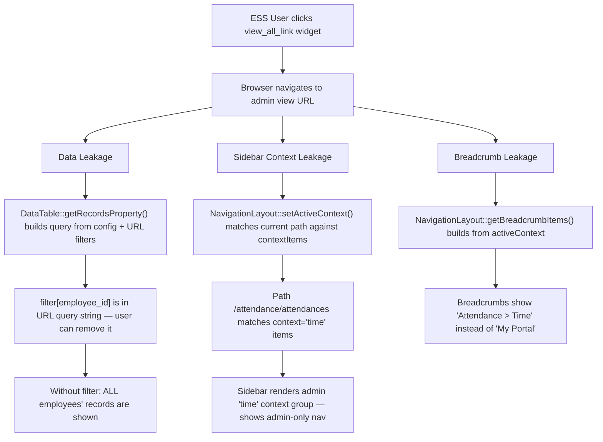
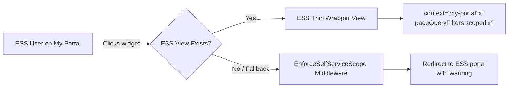

# ESS Admin View Leakage — Comprehensive Analysis & Recommendation

> **Status**: ✅ IMPLEMENTED
> **Analysis Date**: 2026-09-03
> **Implementation Date**: 2026-09-03
> **Context**: [`dashboard_employee_overview.php`](../../../../LaravelProjects/hr-consuming-app/app/Modules/Hr/Data/dashboards/dashboard_employee_overview.php) → `view_all_link` widgets

---

## 1. Leakage Vectors Identified

### 1.1 Dashboard Widgets with `view_all_link` (Leakage Sources)

The [`dashboard_employee_overview.php`](../../../../LaravelProjects/hr-consuming-app/app/Modules/Hr/Data/dashboards/dashboard_employee_overview.php) config defines 4 `list` widgets and 1 `activity_log` widget with `show_view_all: true`:

| # | Widget | `view_all_link` | Target View | Target `context` | Data Scoped? |
|---|--------|-----------------|-------------|-------------------|-------------|
| 4 | **Upcoming Time Off** | `/leave/leave-requests?filter[employee_id]={{ employee_id }}&...` | [`leave::leave-requests.blade.php`](../../../../LaravelProjects/hr-consuming-app/app/Modules/Leave/Resources/views/leave-requests.blade.php) | `"leave"` (admin) | ✅ Via URL filter (removable) |
| 5 | **Recent Attendance** | `/attendance/attendances?filter[employee_id]={{ employee_id }}&...` | [`attendance::attendances.blade.php`](../../../../LaravelProjects/hr-consuming-app/app/Modules/Attendance/Resources/views/attendances.blade.php) | `"time"` (admin) | ✅ Via URL filter (removable) |
| 7 | **Recent Clock Events** | `/attendance/clock-events?filter[employee_id]={{ employee_id }}&...` | [`attendance::clock-events.blade.php`](../../../../LaravelProjects/hr-consuming-app/app/Modules/Attendance/Resources/views/clock-events.blade.php) | `"time"` (admin) | ✅ Via URL filter (removable) |
| 9 | **Expiring Documents** | `/hr/documents?filter[employee_id]={{ employee_id }}&...` | [`hr::documents.blade.php`](../../../../LaravelProjects/hr-consuming-app/app/Modules/Hr/Resources/views/documents.blade.php) | `"manage"` (admin) | ✅ Via URL filter (removable) |
| 10 | **Recent Location Activity** | `/admin/activity-logs?filters[log_name]=hr.location` | Admin activity logs | Admin context | ❌ No scoping at all |

### 1.2 Three Distinct Leakage Dimensions



### 1.3 Root Cause: `NavigationLayout::setActiveContext()` Resolution

The critical method is [`NavigationLayout::setActiveContext()`](../../src/Components/NavigationLayout.php:189):

```php
protected function setActiveContext(): void
{
    // Priority 1: context prop matches a context_groups key
    if ($this->context && isset($this->contextGroups[$this->context])) {
        $this->activeContext = $this->context;
        return;
    }

    // Priority 2: Match current URL path against contextItems
    $currentPath = request()->path();
    foreach ($this->contextItems as $ctx => $items) {
        foreach ($items as $item) {
            $pathToMatch = ltrim($route, '/');
            if ($pathToMatch === $currentPath || str_starts_with($currentPath, $pathToMatch)) {
                $this->activeContext = $ctx;
                return;
            }
        }
    }

    // Priority 3: Fallback to first context group
    $keys = array_keys($this->contextGroups);
    $this->activeContext = $this->context ?? ($keys[0] ?? null);
}
```

**The problem**: Priority 1 only works when the CURRENT page's blade has `context="my-portal"`. When the user navigates to `/attendance/attendances`, the Attendance blade has `context="time"`, so the sidebar switches to the admin context group. The `context` prop is **per-page**, not **per-session**.

---

## 2. DataTable Self-Service Awareness

The [`DataTable`](../../src/Http/Livewire/DataTables/DataTable.php) component has **no concept of self-service mode**. Key findings:

| Aspect | Status | Location |
|--------|--------|----------|
| `isSelfServiceMode` property | ❌ Does not exist | — |
| `enforceFilters` property | ✅ Exists but unused for ESS | [`DataTable.php:67`](../../src/Http/Livewire/DataTables/DataTable.php:67) |
| `queryFilters` / `pageQueryFilters` | ✅ Accepts filter arrays | [`DataTable.php:43-44`](../../src/Http/Livewire/DataTables/DataTable.php:43-44) |
| `getRecordsProperty()` query building | No `employee_id` scoping | [`DataTable.php:1492`](../../src/Http/Livewire/DataTables/DataTable.php:1492) |
| `canAccessView()` permission check | Generic permission only | [`DataTable.php:158`](../../src/Http/Livewire/DataTables/DataTable.php:158) |
| Employee-scoped access control | ❌ Does not exist | — |

**Key insight**: The `enforceFilters` property (line 67) already exists! When `true`, it returns zero results if no filters are applied. This is a partial guard but doesn't enforce employee scoping — it only prevents unfiltered queries.

The `queryFilters` and `pageQueryFilters` are passed from the blade view. `queryFilters` come from the URL query string (user-modifiable), while `pageQueryFilters` are hardcoded in the blade (user cannot modify).

---

## 3. Existing `isSelfServiceMode` Pattern in `EmployeeDetail`

The [`EmployeeDetail`](../../../../LaravelProjects/hr-consuming-app/app/Modules/Hr/Http/Livewire/EmployeeDetail.php) component already has a partial self-service pattern:

```php
// EmployeeDetail.php:43-108
public $isSelfServiceMode = false;

protected function loadSelfServiceConfig(): void
{
    // Reads hr.employee_ess config for allowed tabs, hide edit buttons, etc.
    $isConfigEnabled = $this->selfServiceConfig['enabled'] ?? false;
    $isProfilePage = request()->is('hr/my-profile');
    $this->isSelfServiceMode = $isConfigEnabled && $isProfilePage;
}

// EmployeeDetail.php:163-168
protected function loadData(): void
{
    if ($this->isSelfServiceMode) {
        $userEmployeeId = Employee::where('user_id', auth()->id())->value('id');
        if ($this->recordId != $userEmployeeId) {
            abort(403, 'You can only view your own profile.');
        }
    }
}
```

**Limitation**: This only protects the EmployeeDetail component (profile page). It does NOT protect:
- DataTable views (attendance, leave, clock events, documents)
- Sidebar context switching
- Any other component

---

## 4. Approach Comparison

### Approach A: ESS-Dedicated Views/Components

**Strategy**: Create separate thin-wrapper blade views for each leaked resource, using `context="my-portal"` and hardcoded `pageQueryFilters` with employee scoping.

| Criterion | Assessment |
|-----------|-----------|
| **Completeness** | ⭐⭐⭐⭐⭐ Covers all leakage paths if executed thoroughly |
| **Implementation effort** | ⭐⭐ Medium. ~5 new blade files, dashboard link updates |
| **Maintainability** | ⭐⭐⭐ Good. Thin wrappers are trivial. New features need awareness |
| **Library vs App** | 100% consuming app changes |
| **Performance** | ⭐⭐⭐⭐⭐ Zero overhead |

**Changes needed**:
1. Create `attendance/Resources/views/ess-attendances.blade.php` — context=`"my-portal"`, scoped DataTable
2. Create `attendance/Resources/views/ess-clock-events.blade.php` — context=`"my-portal"`, scoped DataTable
3. Create `leave/Resources/views/ess-leave-requests.blade.php` — context=`"my-portal"`, scoped DataTable
4. Create `hr/Resources/views/ess-documents.blade.php` — context=`"my-portal"`, scoped DataTable
5. Update `dashboard_employee_overview.php` `view_all_link` URLs to point to ESS views
6. Add explicit routes or use catch-all for these views

**Example ESS view**:
```blade
{{-- attendance/Resources/views/ess-attendances.blade.php --}}
@php
    $employee = \App\Modules\Hr\Models\Employee::where('user_id', Auth::id())->first();
    if (!$employee) { abort(403); }
@endphp
<x-qf::navigation-layout configKey="attendance.attendance" context="my-portal" moduleName="attendance" :overrides="[]">
    <livewire:qf.data-table 
        configKey="attendance.attendance" 
        :page-query-filters="[['employee_id', '=', $employee->id]]"
        :hidden-fields="['onTable' => ['employee_id']]"
    />
</x-qf::navigation-layout>
```

**Pro**: Clean isolation, fits existing patterns (pre-coding checklist §A).  
**Con**: Requires new views for each leaked resource; new dashboard widgets could reintroduce the problem.

---

### Approach B: Context-Aware Guards in Existing Components

**Strategy**: Add `isSelfServiceMode` checks to `DataTable`, `DataTableForm`, `DataTableDetail`, `Sidebar`, and `NavigationLayout`.

| Criterion | Assessment |
|-----------|-----------|
| **Completeness** | ⭐⭐⭐ Covers current paths but fragile for future ones |
| **Implementation effort** | ⭐⭐⭐⭐ High. Many files, deep library changes |
| **Maintainability** | ⭐⭐ Poor. Scattered guards, easy to miss new components |
| **Library vs App** | Mixed — library changes risky |
| **Performance** | ⭐⭐⭐⭐ Low overhead |

**Changes needed**:
1. `DataTable.php`: Add `isSelfServiceMode` detection + forced employee_id filter
2. `DataTableDetail.php`: Same
3. `DataTableForm.php`: Same
4. `NavigationLayout.php`: Add `selfServiceContext` detection to force sidebar context
5. `Sidebar.php`: Honor forced context even when URL path doesn't match
6. Config key for "self-service user role" detection

**Critical flaw**: The library cannot reference `App\Modules\Hr\Models\Employee`. It would need a contract (`SelfServiceEmployeeResolver`) which consuming apps bind. This adds significant complexity.

---

### Approach C: Request Gateway / Middleware

**Strategy**: A middleware that intercepts requests, detects ESS-originating context, and applies scoping + sidebar forcing.

| Criterion | Assessment |
|-----------|-----------|
| **Completeness** | ⭐⭐⭐⭐ Good. Centralized, but may miss some edge cases |
| **Implementation effort** | ⭐⭐⭐ Medium. Middleware + session-based context tracking |
| **Maintainability** | ⭐⭐⭐⭐ Good. Centralized, new views automatically protected |
| **Library vs App** | Mostly consuming app |
| **Performance** | ⭐⭐⭐⭐ Minimal overhead per request |

**Changes needed**:
1. Create `EnforceSelfServiceScope` middleware
2. Track "ESS session origin" in session when user is on ESS pages
3. Middleware detects: if ESS session origin + admin view → force employee scoping + redirect or force context
4. Register middleware in kernel

**Critical flaw**: The middleware can force a redirect back to ESS, but it can't change the `context` prop of a blade view. The sidebar is determined by the blade's `context` prop, not by middleware. The middleware could redirect `/attendance/attendances` → `/attendance/ess-attendances`, but that's essentially Approach A with a redirect layer.

---

## 5. Recommendation: Hybrid Approach (A + C-light)

### Primary Mechanism: ESS-Specific Thin Wrapper Views (Approach A)

Create thin-wrapper blade views for all leaked resources. This is the **simplest, most robust, and most maintainable** approach because:

1. It follows the existing pattern documented in the [Pre-Coding Checklist](../../docs/consuming-app/pre-coding-checklist.md) §A
2. Each ESS view is a thin wrapper — 15-20 lines of blade code
3. The `pageQueryFilters` are hardcoded in the blade, making them **unremovable by the user**
4. The `context="my-portal"` on the blade ensures the sidebar stays in ESS mode
5. Zero library changes needed

### Secondary Mechanism: ESS Origin Guard Middleware (Approach C-light)

Add a lightweight middleware as a **safety net** for any views not yet given ESS wrappers:

1. Track `ess_origin` in session when user visits a `my-portal` context page
2. When a non-ESS user (role `employee` only) visits an admin-context view, check if they came from ESS
3. If so, redirect them back to their portal with a flash message, OR enforce the `my-portal` context

This middleware is a **defense-in-depth** measure, not the primary protection.



---

## 6. Implementation Plan

### Phase 1: ESS Thin-Wrapper Views (Primary Fix)

#### Step 1.1: Create ESS Attendance View

**File**: [`app/Modules/Attendance/Resources/views/ess-attendances.blade.php`](../../../../LaravelProjects/hr-consuming-app/app/Modules/Attendance/Resources/views/ess-attendances.blade.php)

```blade
@php
    $employee = \App\Modules\Hr\Models\Employee::where('user_id', Auth::id())->first();
    if (!$employee) { abort(403, 'No employee record found.'); }
@endphp
<x-qf::navigation-layout configKey="attendance.attendance" context="my-portal" moduleName="attendance" :overrides="[]">
    <livewire:qf.data-table 
        configKey="attendance.attendance" 
        :page-query-filters="[['employee_id', '=', $employee->id]]"
        :hidden-fields="['onTable' => ['employee_id']]"
    />
</x-qf::navigation-layout>
```

#### Step 1.2: Create ESS Clock Events View

**File**: [`app/Modules/Attendance/Resources/views/ess-clock-events.blade.php`](../../../../LaravelProjects/hr-consuming-app/app/Modules/Attendance/Resources/views/ess-clock-events.blade.php)

```blade
@php
    $employee = \App\Modules\Hr\Models\Employee::where('user_id', Auth::id())->first();
    if (!$employee) { abort(403, 'No employee record found.'); }
@endphp
<x-qf::navigation-layout configKey="attendance.clock_event" context="my-portal" moduleName="attendance" :overrides="[]">
    <livewire:qf.data-table 
        configKey="attendance.clock_event" 
        :page-query-filters="[['employee_id', '=', $employee->id]]"
        :hidden-fields="['onTable' => ['employee_id']]"
    />
</x-qf::navigation-layout>
```

#### Step 1.3: Create ESS Leave Requests View

**File**: [`app/Modules/Leave/Resources/views/ess-leave-requests.blade.php`](../../../../LaravelProjects/hr-consuming-app/app/Modules/Leave/Resources/views/ess-leave-requests.blade.php)

```blade
@php
    $employee = \App\Modules\Hr\Models\Employee::where('user_id', Auth::id())->first();
    if (!$employee) { abort(403, 'No employee record found.'); }
@endphp
<x-qf::navigation-layout configKey="leave.leave_request" context="my-portal" moduleName="leave" :overrides="[]">
    <livewire:qf.data-table 
        configKey="leave.leave_request" 
        :page-query-filters="[['employee_id', '=', $employee->id]]"
        :hidden-fields="['onTable' => ['employee_id']]"
    />
</x-qf::navigation-layout>
```

#### Step 1.4: Create ESS Documents View

**File**: [`app/Modules/Hr/Resources/views/ess-documents.blade.php`](../../../../LaravelProjects/hr-consuming-app/app/Modules/Hr/Resources/views/ess-documents.blade.php)

```blade
@php
    $employee = \App\Modules\Hr\Models\Employee::where('user_id', Auth::id())->first();
    if (!$employee) { abort(403, 'No employee record found.'); }
@endphp
<x-qf::navigation-layout configKey="hr.document" context="my-portal" moduleName="hr" :overrides="[]">
    <livewire:qf.data-table 
        configKey="hr.document" 
        :page-query-filters="[['employee_id', '=', $employee->id], ['expiry_date', '>=', now()->format('Y-m-d')], ['expiry_date', '<=', now()->addDays(30)->format('Y-m-d')]]"
        :hidden-fields="['onTable' => ['employee_id']]"
    />
</x-qf::navigation-layout>
```

#### Step 1.5: Handle Activity Log Widget (Remove `view_all_link`)

The "Recent Location Activity" widget links to `/admin/activity-logs` — a pure admin page with no employee scoping. For ESS, this `view_all_link` should be **removed** or set to `show_view_all: false` in the config. Alternatively, create an ESS-scoped activity log view that filters by the employee's own activities.

**Recommended**: Set `show_view_all: false` for this widget in the ESS context. The widget already shows the last 5 items scoped to the employee's location.

#### Step 1.6: Register ESS Routes

**File**: [`app/Modules/Hr/Routes/web.php`](../../../../LaravelProjects/hr-consuming-app/app/Modules/Hr/Routes/web.php)

Add explicit routes for ESS views (or rely on the catch-all if the module is in the allow-list):

```php
// ESS-scoped resource views
Route::get('/attendance/ess-attendances', function () {
    return view('attendance::ess-attendances');
})->name('attendance.ess-attendances');

Route::get('/attendance/ess-clock-events', function () {
    return view('attendance::ess-clock-events');
})->name('attendance.ess-clock-events');

Route::get('/leave/ess-leave-requests', function () {
    return view('leave::ess-leave-requests');
})->name('leave.ess-leave-requests');

Route::get('/hr/ess-documents', function () {
    return view('hr::ess-documents');
})->name('hr.ess-documents');
```

Alternatively, add these to the catch-all allow-list and rely on the `/{module}/{view}` pattern.

#### Step 1.7: Update Dashboard Widget Links

**File**: [`dashboard_employee_overview.php`](../../../../LaravelProjects/hr-consuming-app/app/Modules/Hr/Data/dashboards/dashboard_employee_overview.php)

Update `view_all_link` values:

| Widget | Old Link | New Link |
|--------|----------|----------|
| Upcoming Time Off | `/leave/leave-requests?filter[...]` | `/leave/ess-leave-requests` |
| Recent Attendance | `/attendance/attendances?filter[...]` | `/attendance/ess-attendances` |
| Recent Clock Events | `/attendance/clock-events?filter[...]` | `/attendance/ess-clock-events` |
| Expiring Documents | `/hr/documents?filter[...]` | `/hr/ess-documents` |
| Recent Location Activity | `/admin/activity-logs?filters[...]` | Remove `show_view_all` or set to `false` |

### Phase 2: ESS Origin Guard Middleware (Safety Net)

#### Step 2.1: Create Middleware

**File**: [`app/Http/Middleware/EnforceSelfServiceScope.php`](../../../../LaravelProjects/hr-consuming-app/app/Http/Middleware/EnforceSelfServiceScope.php)

```php
<?php

namespace App\Http\Middleware;

use Closure;
use Illuminate\Http\Request;
use Illuminate\Support\Facades\Auth;

class EnforceSelfServiceScope
{
    /**
     * Admin context group keys that ESS users should not access directly.
     */
    protected array $adminContexts = [
        'Organization', 'people', 'manage', 'time', 'leave', 
        'scheduling', 'policies', 'requests', 'configuration', 'balances',
    ];

    public function handle(Request $request, Closure $next)
    {
        $user = Auth::user();

        if (!$user) {
            return $next($request);
        }

        // Only apply to employee-role users (not admins/managers with elevated access)
        if (!$user->hasRole('employee') || $user->hasRole('admin') || $user->hasRole('super_admin')) {
            return $next($request);
        }

        $path = $request->path();

        // Check if the current path matches known admin patterns
        // This is a heuristic — the ESS thin-wrapper views are the primary guard
        $adminPatterns = [
            'attendance/attendances',
            'attendance/clock-events',
            'leave/leave-requests',
            'hr/documents',
            'admin/activity-logs',
        ];

        foreach ($adminPatterns as $pattern) {
            if (str_starts_with($path, $pattern)) {
                // Check if there's an ESS alternative
                $essRedirect = $this->getEssRedirect($path);
                if ($essRedirect) {
                    return redirect($essRedirect)
                        ->with('warning', 'You are viewing your own records only.');
                }
                break;
            }
        }

        return $next($request);
    }

    protected function getEssRedirect(string $path): ?string
    {
        $map = [
            'attendance/attendances' => '/attendance/ess-attendances',
            'attendance/clock-events' => '/attendance/ess-clock-events',
            'leave/leave-requests' => '/leave/ess-leave-requests',
            'hr/documents' => '/hr/ess-documents',
        ];

        foreach ($map as $adminPath => $essPath) {
            if (str_starts_with($path, $adminPath)) {
                return $essPath;
            }
        }

        return null;
    }
}
```

#### Step 2.2: Register Middleware

**File**: [`app/Http/Kernel.php`](../../../../LaravelProjects/hr-consuming-app/app/Http/Kernel.php)

Add to `web` middleware group:

```php
protected $middlewareGroups = [
    'web' => [
        // ... existing middleware
        \App\Http\Middleware\EnforceSelfServiceScope::class,
    ],
];
```

### Phase 3: Navigation Config Enhancement

#### Step 3.1: Add ESS Routes to `my-portal` Context

**File**: [`app/Modules/Hr/Config/navigation.php`](../../../../LaravelProjects/hr-consuming-app/app/Modules/Hr/Config/navigation.php)

Add the ESS views to the `my-portal` context items so they appear in the sidebar when the user is on those pages:

```php
'my-portal' => [
    // ... existing items
    [
        'key' => 'ess_attendance',
        'label' => 'My Attendance',
        'icon' => 'fas fa-clock',
        'route' => '/attendance/ess-attendances',
        'permission' => 'view_my_portal',
        'order' => 5,
    ],
    [
        'key' => 'ess_leave',
        'label' => 'My Leave',
        'icon' => 'fas fa-calendar-alt',
        'route' => '/leave/ess-leave-requests',
        'permission' => 'view_my_portal',
        'order' => 6,
    ],
],
```

---

## 7. Risk Mitigation

| Risk | Mitigation |
|------|-----------|
| Future dashboard widgets reintroduce leakage | Code review checklist: any widget with `view_all_link` must link to ESS view if in ESS context |
| ESS views not created for all admin resources | Middleware Phase 2 catches unhandled paths and redirects |
| `pageQueryFilters` bypass in DataTable | `pageQueryFilters` are server-side in the blade — user cannot modify them (unlike `queryFilters` from URL) |
| Employee can guess admin URLs directly | Middleware redirects them back to ESS equivalent |
| New modules added without ESS awareness | Middleware pattern covers new modules automatically if they follow naming conventions |

---

## 8. Summary

| Dimension | Assessment |
|-----------|-----------|
| **Primary fix** | 5 ESS thin-wrapper blade views + dashboard link updates |
| **Safety net** | 1 middleware class (~60 lines) |
| **Library changes** | None — all changes in consuming app |
| **Navigation config** | 2 new items in `my-portal` context |
| **Files to create** | 5 blade views + 1 middleware |
| **Files to modify** | 1 dashboard config + 1 kernel + 1 nav config |
| **Total estimated scope** | ~8 files, ~200 lines of code |

The hybrid approach is the safest, most maintainable, and least invasive. It follows existing patterns in the codebase, requires zero library changes, and provides defense-in-depth through the middleware safety net.

---

## 9. Implementation Record

> **Status**: ✅ COMPLETED
> **Date**: 2026-09-03

### Files Created

| # | File | Purpose |
|---|------|---------|
| 1 | [`app/Modules/Hr/Resources/views/ess/attendance.blade.php`](../../../../LaravelProjects/hr-consuming-app/app/Modules/Hr/Resources/views/ess/attendance.blade.php) | ESS-scoped attendance view (`context="my-portal"`, `page-query-filters` with `employee_id`) |
| 2 | [`app/Modules/Hr/Resources/views/ess/leave-requests.blade.php`](../../../../LaravelProjects/hr-consuming-app/app/Modules/Hr/Resources/views/ess/leave-requests.blade.php) | ESS-scoped leave requests view |
| 3 | [`app/Modules/Hr/Resources/views/ess/clock-events.blade.php`](../../../../LaravelProjects/hr-consuming-app/app/Modules/Hr/Resources/views/ess/clock-events.blade.php) | ESS-scoped clock events view |
| 4 | [`app/Modules/Hr/Resources/views/ess/payslips.blade.php`](../../../../LaravelProjects/hr-consuming-app/app/Modules/Hr/Resources/views/ess/payslips.blade.php) | ESS-scoped payslips view |
| 5 | [`app/Modules/Hr/Resources/views/ess/documents.blade.php`](../../../../LaravelProjects/hr-consuming-app/app/Modules/Hr/Resources/views/ess/documents.blade.php) | ESS-scoped documents view |
| 6 | [`app/Modules/Hr/Http/Middleware/RedirectEssUsersFromAdminViews.php`](../../../../LaravelProjects/hr-consuming-app/app/Modules/Hr/Http/Middleware/RedirectEssUsersFromAdminViews.php) | Safety net middleware — redirects ESS-only users from admin URLs to ESS equivalents |

### Files Modified

| # | File | Change |
|---|------|--------|
| 1 | [`app/Modules/Hr/Routes/web.php`](../../../../LaravelProjects/hr-consuming-app/app/Modules/Hr/Routes/web.php) | Added 5 ESS routes (`/hr/my-attendance`, `/hr/my-leave-requests`, `/hr/my-clock-events`, `/hr/my-payslips-view`, `/hr/my-documents-view`) |
| 2 | [`app/Modules/Hr/Data/dashboards/dashboard_employee_overview.php`](../../../../LaravelProjects/hr-consuming-app/app/Modules/Hr/Data/dashboards/dashboard_employee_overview.php) | Updated 5 widget `view_all_link` URLs to ESS routes; disabled `show_view_all` for activity log widget |
| 3 | [`bootstrap/app.php`](../../../../LaravelProjects/hr-consuming-app/bootstrap/app.php) | Registered `RedirectEssUsersFromAdminViews` middleware in web group |
| 4 | [`plans/ess-comprehensive-analysis.md`](plans/ess-comprehensive-analysis.md) | Added ESS Admin View Leakage Fix section |
| 5 | [`plans/ess-admin-view-leakage-analysis.md`](plans/ess-admin-view-leakage-analysis.md) | Marked as IMPLEMENTED, added implementation record |

### Design Decisions

- **`page-query-filters` over `query-filters`**: `pageQueryFilters` are hardcoded in the blade and cannot be modified by the user via URL manipulation. `queryFilters` come from the URL query string and are user-modifiable.
- **`context="my-portal"`**: Forces the sidebar to stay in the "My Portal" context group, preventing sidebar leakage to admin context groups.
- **`moduleName="hr"`**: All ESS views use the HR module namespace for consistent navigation, even when the underlying config key belongs to another module (e.g., `attendance.attendance`).
- **No `disableFilterRemoval`**: This parameter does not exist on the DataTable component. The `pageQueryFilters` approach achieves the same goal — filters are baked into the blade and cannot be removed by the user.
- **Activity log widget**: Set `show_view_all: false` since there is no ESS-equivalent for the admin activity log viewer. The widget still shows the last 5 location activities scoped to the employee.

### Related: Role-Based Post-Login Redirect ✅ (2026-09-03)

**Separate from the view leakage fix**, a role-based post-login redirect was implemented to ensure ESS users land on their My Portal dashboard instead of the generic `/home` page. This is a complementary improvement that addresses the **login flow**, not the view leakage problem.

**Implementation:** The consuming app's [`FortifyServiceProvider`](../../../../LaravelProjects/hr-consuming-app/app/Providers/FortifyServiceProvider.php:56) binds a singleton for `Laravel\Fortify\Contracts\LoginResponse` that redirects users based on their Spatie role:

- **ESS employees** (`employee` role, no admin roles) → `/hr/my-portal`
- **Payroll officers** → `/payroll/dashboard-processing-overview`
- **HR managers** → `/hr/dashboard-people-overview`
- **Admins / others** → `/home` (default)

**Key point:** `/home` is no longer the landing page for ESS users. They go directly to their My Portal dashboard after login, eliminating an unnecessary navigation step. This is documented in detail in [`ess-comprehensive-analysis.md § Role-Based Post-Login Redirect`](plans/ess-comprehensive-analysis.md).

### Related: Module Dashboard Security Fix ✅ (2026-09-03)

A complementary security fix was implemented to address two additional vulnerabilities discovered during the ESS analysis:

1. 🔴 **Critical**: 18 HR CRUD routes had no middleware — accessible to unauthenticated users
2. 🟠 **High**: 26 module dashboards accessible to any authenticated user regardless of role

The fix introduces a new [`EnsureModuleDashboardAccess`](../../LaravelProjects/hr-consuming-app/app/Http/Middleware/EnsureModuleDashboardAccess.php) middleware that enforces role-based access per URL prefix, wraps the unprotected CRUD routes in `auth` middleware, and adds `auth` middleware to the library's `/home` route.

**Full details:** [`module-dashboard-security-analysis.md`](plans/module-dashboard-security-analysis.md)

While the ESS admin view leakage fix (this document) addresses **sidebar context leakage and data scoping** when ESS users click "View All" links from their dashboard widgets, the module dashboard security fix addresses **direct URL access** to admin dashboards and unprotected CRUD routes. Together they provide defense-in-depth for the ESS security boundary.