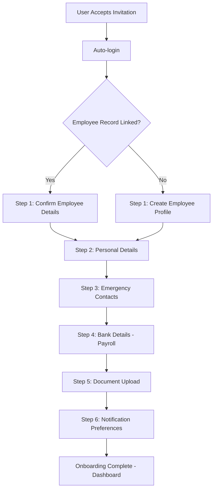
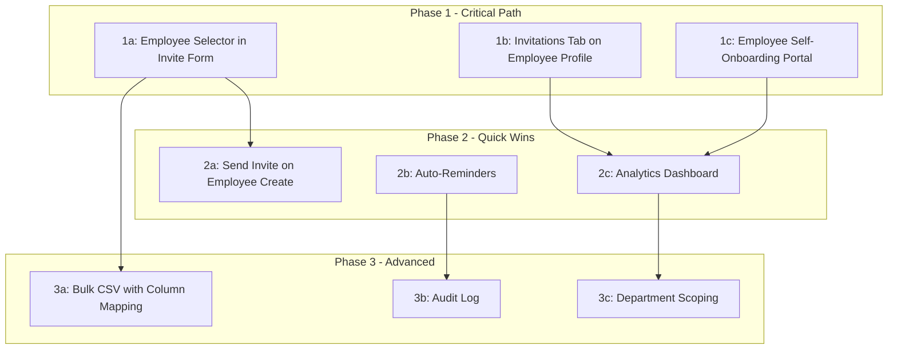

# HR Invitation Integration — Strategic Recommendations

> **Date**: 2026-09-09
> **Status**: Strategic Analysis & Recommendations
> **References**: [`invitation-employee-registration-analysis.md`](invitation-employee-registration-analysis.md) (Phases 1–4 implementation report)
> **No code implementation** — this is a planning document

---

## Table of Contents

1. [Current State Assessment](#1-current-state-assessment)
2. [Q1: HR Interface Integration Points](#2-q1-hr-interface-integration-points)
3. [Q2: Post-Acceptance Employee Onboarding](#3-q2-post-acceptance-employee-onboarding)
4. [Q3: Competitive Feature Roadmap](#4-q3-competitive-feature-roadmap)
5. [Implementation Roadmap](#5-implementation-roadmap)

---

## 1. Current State Assessment

### 1.1 What Works (Library Infrastructure — Phases 1–4 Complete)

The library provides a fully functional, domain-agnostic invitation engine:

| Capability | Implementation | Location |
|---|---|---|
| Invitation model + polymorphic `invitable` | `Invitation` with status lifecycle (pending/accepted/expired/revoked) | [`src/Models/Invitation.php`](src/Models/Invitation.php) |
| Token generation + signed URLs | `InvitationService::create()` generates 64-char random token | [`src/Services/Invitations/InvitationService.php:23`](src/Services/Invitations/InvitationService.php:23) |
| Email dispatch | `InvitationMail` mailable, queued, branded HTML | [`src/Mail/InvitationMail.php`](src/Mail/InvitationMail.php) |
| Accept flow | `AcceptInvitation` Livewire component, public route, auto-login | [`src/Http/Livewire/Invitations/AcceptInvitation.php`](src/Http/Livewire/Invitations/AcceptInvitation.php) |
| Role assignment at accept | Resolves numeric role ID → name, calls `assignRole()` | [`src/Services/Invitations/InvitationService.php:70-81`](src/Services/Invitations/InvitationService.php:70) |
| Bulk invite (paste-emails) | `BulkInvite` component, one-email-per-line | [`src/Http/Livewire/Invitations/BulkInvite.php`](src/Http/Livewire/Invitations/BulkInvite.php) |
| Expiration | `ExpireInvitations` scheduled command, 7-day default | [`src/Console/Commands/ExpireInvitations.php`](src/Console/Commands/ExpireInvitations.php) |
| Events | `InvitationSent`, `InvitationAccepted`, `InvitationExpired`, `InvitationRevoked` | [`src/Events/Invitations/`](src/Events/Invitations/) |
| DataTable UI | `InvitationDataTable` with row actions (resend, revoke, copy link) | [`src/Http/Livewire/DataTables/InvitationDataTable.php`](src/Http/Livewire/DataTables/InvitationDataTable.php) |
| Config | `ui-library.invitations.expiration_days` = 7 | [`src/Config/ui-library.php:926-930`](src/Config/ui-library.php:926) |
| `Invitable` contract | Polymorphic linking interface | [`src/Contracts/Invitations/Invitable.php`](src/Contracts/Invitations/Invitable.php) |

### 1.2 What Works (Consuming App — HR Side)

| Capability | Implementation |
|---|---|
| Employee implements `Invitable` | `getInvitableType()` returns `'employee'` |
| `HrInvitationService` | Wraps library service, adds `createWithEmployeeLink()`, `linkOnAccept()`, `matchByEmail()` |
| `LinkInvitationToEmployee` listener | Listens for `DataTableRecordSaved` on `Invitation` model with `accepted` status; performs pre-link → email match → manual flag logic |

### 1.3 The Current Gap

The user accepted an invitation, account was created, but the employee record is **not linked**. Root cause: the invitation was created **without pre-linking to an employee** (no employee was selected during invitation creation), and the email-match fallback in `HrInvitationService::linkOnAccept()` did not find a matching employee record.

**This gap exists because there is no HR-specific UI integration point that allows an admin to select an employee when creating an invitation.** The library's generic invitation form (`DataTableForm` with `admin.invitation` config) has email, role, and message fields — but no employee selector. The HR module needs to extend this form with employee-specific fields.

### 1.4 What's Missing on the HR Side

| Gap | Impact |
|---|---|
| No employee selector in invitation form | Invitations can't be pre-linked; linking relies solely on email matching |
| No "Send Invitation" from employee context | HR must navigate away from employee to send an invitation |
| No invitation status visible on employee profile | HR can't see if an employee has been invited, accepted, or needs follow-up |
| No post-acceptance employee onboarding | Accepted users go to dashboard with no guided employee profile completion |
| No invitation reminders | Pending invitations sit until they expire with no nudges |
| No invitation analytics | No visibility into acceptance rates, time-to-accept, or bottlenecks |
| No CSV bulk invite with employee mapping | Bulk invite can't pre-link employees from CSV data |

### 1.5 Existing Spatie Onboard Infrastructure

The library already integrates with Spatie Onboard:

- [`OnboardingCondition`](src/Contracts/OnboardingCondition.php) contract — `__invoke($user): bool`
- [`ProfileComplete`](src/Conditions/Onboarding/ProfileComplete.php) — example condition checking `phone` + `address`
- [`app_onboarding.php`](src/Core/Common/Config/app_onboarding.php) — step definitions with `title`, `link`, `cta`, `model`, `condition`
- [`ModuleServiceProvider::registerOnboardingConfig()`](src/Providers/ModuleServiceProvider.php:217) — registers steps from config into Spatie Onboard
- [`app-onboarding-tasks.blade.php`](src/Resources/views/components/onboarding/app-onboarding-tasks.blade.php) — renders progress bar + step list
- [`OnboardingWidgetProcessor`](src/Widgets/OnboardingWidgetProcessor.php) — dashboard widget processor

Currently configured with 2 basic steps: "Complete Your Profile" and "Explore the Dashboard". This infrastructure is ready to be extended with HR-specific onboarding steps.

---

## 2. Q1: HR Interface Integration Points

### 2.1 Option Evaluation Matrix

| Criterion | Option A: Employee Selector in Invite Form | Option B: Send Invite from Employee Create | Option C: Invite Step in Onboarding Wizard | Option D: Invitations Tab on Employee Profile |
|---|---|---|---|---|
| **Pre-hire scenario** (employee exists, no user) | ✅ Direct — select existing employee | ✅ Natural — create employee, then invite | ✅ Integrated into guided flow | ✅ Contextual — view employee, send invite |
| **Self-registration** (no employee yet) | ⚠️ No employee to select; falls back to email match | ❌ Only works when creating employee first | ❌ Only works when using wizard | ❌ No employee to navigate to |
| **Deterministic linking** | ✅ Pre-links via `invitable` | ✅ Pre-links via `invitable` | ✅ Pre-links via `invitable` | ✅ Pre-links via `invitable` |
| **Discovery** | ⚠️ Admin must know to use the employee selector | ✅ Natural workflow step | ✅ Guided — can't miss it | ✅ Visible when viewing employee |
| **Implementation effort** | Medium — extend DataTableForm config | Low — checkbox + auto-fill | Medium — wizard step integration | Medium — new tab + Livewire component |
| **Covers existing employees** | ✅ | ❌ (only new) | ❌ (only wizard) | ✅ |
| **Covers bulk invite** | ❌ (single invite only) | ❌ | ❌ | ❌ |

### 2.2 Recommended Combination: A + D (Primary), B (Secondary)

#### Primary: Options A + D — Employee Selector + Employee Profile Tab

These two options together cover the complete HR workflow:

**Option A — Employee Selector in Invitation Form** solves the immediate gap. When an HR manager creates an invitation (from the admin invitations page or dashboard quick action), they can search for and select an existing employee. This pre-links the invitation via the `invitable` polymorphic relation, ensuring deterministic linking on acceptance.

**Option D — Invitations Tab on Employee Profile** provides the reverse direction. When viewing an employee record, HR can see:
- Current invitation status (none / pending / accepted / expired)
- "Send Invitation" button if no user is linked
- "Resend Invitation" if a pending invitation exists
- Invitation history (sent dates, status changes)

This is the Gusto pattern: navigate to the employee, see their onboarding status, take action from there.

#### Secondary: Option B — "Send Invitation" on Employee Creation

This is a natural add-on to Option A. When creating a new employee record, a checkbox "Send invitation after creating employee" auto-fills the invitation email from the employee's email and pre-links the invitation. This eliminates the need to navigate to the invitations page after creating an employee.

#### Not Recommended as Primary: Option C — Wizard Step

The onboarding wizard is a guided flow, but it's only one of several paths to creating an employee. Investing in wizard integration before the more universal Options A and D would serve a subset of users.

### 2.3 Prioritized Implementation Order

```
1. Option A — Employee Selector in Invitation Form     [Phase 1 — Highest Impact]
2. Option D — Invitations Tab on Employee Profile      [Phase 1 — Completes the Loop]
3. Option B — Send Invite on Employee Creation         [Phase 2 — Quick Win]
4. Option C — Invite Step in Onboarding Wizard         [Phase 3 — Polish]
```

### 2.4 Technical Approach for Option A

The library's `DataTableForm` is config-driven. The consuming app's [`invitation.php`](src/Core/Admin/Data/invitation.php) data config defines form fields. To add an employee selector:

1. **Add a `searchable_select` field** to the invitation form config in the consuming app's `Data/invitation.php`:
   - Field key: `invitable_id`
   - Label: "Link to Employee (optional)"
   - Source: Employee model search (name + position)
   - Sets `invitable_type` = `'employee'` and `invitable_id` = selected employee ID

2. **The library's `InvitationService::create()`** already accepts an `$invitable` parameter and sets `invitable_type`/`invitable_id` on the invitation record. No library changes needed.

3. **The `LinkInvitationToEmployee` listener** already checks for pre-linked `invitable` before falling back to email matching. No listener changes needed.

### 2.5 Technical Approach for Option D

Add an "Invitations" tab to the employee detail page:

1. **Create `EmployeeInvitationPanel` Livewire component** in `app/Modules/Hr/Http/Livewire/`:
   - Queries invitations where `invitable_type = 'employee'` AND `invitable_id = $employeeId`
   - Shows status badge, sent date, expiration
   - "Send Invitation" button if no user linked
   - "Resend" button if pending invitation exists

2. **Add tab to employee detail config** in `app/Modules/Hr/Data/employee.php`:
   - New tab definition pointing to the Livewire component

3. **The component uses the library's `InvitationService`** for resend/revoke actions — no library changes needed.

### 2.6 Scenario Coverage After Implementation

| Scenario | Before | After Options A+B+D |
|---|---|---|
| Pre-hire: Create employee → invite them | ❌ No pre-link; relies on email match | ✅ Employee selector in invite form OR send from employee profile OR checkbox on create |
| Existing employee, no user account | ❌ Must navigate to invitations page, no employee context | ✅ "Send Invitation" button on employee profile tab |
| Self-registration: No employee exists | ⚠️ Email match fallback only | ⚠️ Still email match only (by design — no employee to link) |
| Bulk invite with employee mapping | ❌ Not possible | ⚠️ Still deferred (CSV upload with column mapping is Phase 3) |

---

## 3. Q2: Post-Acceptance Employee Onboarding

### 3.1 Current Post-Acceptance Flow

After a user accepts an invitation via [`AcceptInvitation`](src/Http/Livewire/Invitations/AcceptInvitation.php):

1. User account is created/activated
2. Spatie role is assigned
3. `InvitationAccepted` event is dispatched
4. `LinkInvitationToEmployee` listener attempts auto-link
5. User is auto-logged in via `Auth::login($user)`
6. User is redirected to `config('ui-library.home_route')` — typically the dashboard or my-portal

**The gap**: There is no guided employee profile completion after acceptance. The user lands on a dashboard with no context about what to do next. If the employee record wasn't pre-linked and email matching failed, the user has an account but no employee profile.

### 3.2 Recommended Strategy: Spatie Onboard with HR-Specific Steps

The library's existing Spatie Onboard infrastructure should be extended with HR-specific onboarding steps. This follows the **Gusto employee self-onboarding** pattern: after accepting an invitation, the employee is guided through completing their own profile, personal details, and compliance documents.

### 3.3 Proposed Onboarding Steps



### 3.4 Step Design

#### Step 1a: Create Employee Profile (if no linked record)

| Attribute | Value |
|---|---|
| **Title** | "Complete Your Employee Profile" |
| **Link** | `/my-portal/profile/create` |
| **CTA** | "Fill Profile" |
| **Condition** | `Employee::where('user_id', $user->id)->doesntExist()` |
| **Fields** | Job title, department, manager, start date, employment type |
| **Auto-fill** | Email from user account, name from user account |

#### Step 1b: Confirm Employee Details (if pre-linked)

| Attribute | Value |
|---|---|
| **Title** | "Confirm Your Information" |
| **Link** | `/my-portal/profile/confirm` |
| **CTA** | "Review Details" |
| **Condition** | `Employee::where('user_id', $user->id)->exists()` AND `employee.profile_confirmed = false` |
| **Fields** | Read-only display of employee record; "Is this correct?" confirmation |

#### Step 2: Personal Details

| Attribute | Value |
|---|---|
| **Title** | "Add Your Personal Details" |
| **Link** | `/my-portal/personal-details` |
| **CTA** | "Add Details" |
| **Condition** | `OnboardingCondition` checking `user.phone` and `user.address` are filled |
| **Fields** | Phone number, home address, date of birth, gender (optional) |

#### Step 3: Emergency Contacts

| Attribute | Value |
|---|---|
| **Title** | "Add Emergency Contacts" |
| **Link** | `/my-portal/emergency-contacts` |
| **CTA** | "Add Contacts" |
| **Condition** | `EmergencyContact::where('employee_id', $employeeId)->exists()` |
| **Fields** | Name, relationship, phone, email (at least one required) |

#### Step 4: Bank Details (Payroll)

| Attribute | Value |
|---|---|
| **Title** | "Set Up Payment Details" |
| **Link** | `/my-portal/bank-details` |
| **CTA** | "Add Bank Account" |
| **Condition** | `BankDetail::where('employee_id', $employeeId)->exists()` |
| **Fields** | Bank name, account number, sort code/routing number, account type |
| **Note** | This is the Gusto-style self-onboarding — employee enters their own payroll details instead of HR doing it |

#### Step 5: Document Upload

| Attribute | Value |
|---|---|
| **Title** | "Upload Required Documents" |
| **Link** | `/my-portal/documents` |
| **CTA** | "Upload Documents" |
| **Condition** | `Document::where('documentable_type', 'employee')->where('documentable_id', $employeeId)->exists()` |
| **Fields** | ID document, certificates, visa/work permit (configurable per company policy) |

#### Step 6: Notification Preferences

| Attribute | Value |
|---|---|
| **Title** | "Set Your Notification Preferences" |
| **Link** | `/my-portal/notifications` |
| **CTA** | "Configure" |
| **Condition** | `NotificationPreference::where('user_id', $user->id)->exists()` |
| **Fields** | Email, push, in-app toggles per notification type |

### 3.5 Configuration Structure

The HR module would publish its own onboarding steps by merging into `app_onboarding.steps`:

```php
// Conceptual — app/Modules/Hr/Config/onboarding.php
return [
    'steps' => [
        [
            'title' => 'Complete Your Employee Profile',
            'link' => '/my-portal/profile',
            'cta' => 'Fill Profile',
            'condition' => \App\Modules\Hr\Conditions\Onboarding\HasEmployeeRecord::class,
        ],
        [
            'title' => 'Add Personal Details',
            'link' => '/my-portal/personal-details',
            'cta' => 'Add Details',
            'condition' => \App\Modules\Hr\Conditions\Onboarding\PersonalDetailsComplete::class,
        ],
        // ... additional steps
    ],
];
```

Each condition class implements the library's [`OnboardingCondition`](src/Contracts/OnboardingCondition.php) contract — a single `__invoke($user): bool` method.

### 3.6 Comparison to Gusto's Employee Self-Onboarding

| Aspect | Gusto | This Proposal |
|---|---|---|
| **Trigger** | Employee receives email invite | Employee receives email invite (identical) |
| **Account creation** | Employee sets password via invite link | Employee sets password via [`AcceptInvitation`](src/Http/Livewire/Invitations/AcceptInvitation.php) |
| **Profile completion** | Multi-step wizard: personal info, tax forms (W-4/I-9), bank details | Multi-step Spatie Onboard: profile, personal details, emergency contacts, bank details, documents |
| **Tax/compliance** | W-4 withholding, I-9 employment eligibility | Document upload step (configurable per country) |
| **Bank details** | Direct deposit setup | Bank details step |
| **Admin review** | Admin approves completed profile | Optional — can be added via workflow/approval system |
| **Progress visibility** | Employee sees progress bar; admin sees completion status | Spatie Onboard progress bar + admin dashboard widget |

**Key difference**: Gusto is US-centric (W-4, I-9). This proposal is internationalized — document upload is configurable per country/company policy rather than hardcoded to US tax forms.

### 3.7 Redirect Logic After Acceptance

The [`AcceptInvitation`](src/Http/Livewire/Invitations/AcceptInvitation.php:84-90) component currently logs the user in and renders a success view. The redirect should be modified to:

```
if (onboarding is in progress) → redirect to first incomplete onboarding step
else → redirect to config('ui-library.home_route')
```

This ensures that newly accepted users are immediately guided into the onboarding flow rather than dropped on a dashboard with no context.

---

## 4. Q3: Competitive Feature Roadmap

### 4.1 Feature Evaluation Matrix

Each feature is evaluated on **Impact** (value to HR teams), **Effort** (implementation complexity), and **Differentiation** (how it compares to Gusto/Rippling).

| # | Feature | Impact | Effort | Differentiation | Priority |
|---|---|---|---|---|---|
| 1 | Employee selector in invitation form (Option A) | 🔴 Critical | 🟢 Low | 🟡 Parity | **P0** |
| 2 | Invitations tab on employee profile (Option D) | 🔴 Critical | 🟢 Low | 🟡 Parity | **P0** |
| 3 | Employee self-onboarding portal (Q2) | 🔴 Critical | 🟡 Medium | 🟢 Strong | **P0** |
| 4 | Send invite on employee creation (Option B) | 🟡 High | 🟢 Low | 🟡 Parity | **P1** |
| 5 | Invitation auto-reminders | 🟡 High | 🟢 Low | 🟢 Strong | **P1** |
| 6 | Invitation analytics dashboard | 🟡 High | 🟡 Medium | 🟢 Strong | **P1** |
| 7 | Bulk CSV invite with column mapping | 🟡 High | 🟡 Medium | 🟡 Parity | **P2** |
| 8 | Invitation audit log | 🟢 Medium | 🟢 Low | 🟡 Parity | **P2** |
| 9 | Department/team-scoped invitation management | 🟢 Medium | 🟡 Medium | 🟢 Strong | **P2** |
| 10 | Custom email templates per department/role | 🟢 Medium | 🟡 Medium | 🟡 Parity | **P3** |

### 4.2 Feature Details

#### P0 — Critical Path (Must Have for HR Launch)

**1. Employee Selector in Invitation Form** (see §2.4)
- Extends the invitation `DataTableForm` with a searchable employee dropdown
- Pre-links invitation via `invitable` polymorphic relation
- Zero library changes — purely consuming-app config + Livewire component

**2. Invitations Tab on Employee Profile** (see §2.5)
- New tab on employee detail page showing invitation status
- "Send Invitation" / "Resend Invitation" contextual actions
- Completes the HR → invitation → employee feedback loop

**3. Employee Self-Onboarding Portal** (see §3)
- Spatie Onboard steps for profile, personal details, emergency contacts, bank details, documents
- Gusto-style: employee fills own details after accepting invitation
- Reduces HR data entry burden; improves data accuracy (employee enters own info)

#### P1 — High Priority (Next Release)

**4. Send Invite on Employee Creation** (see §2.2)
- Checkbox on employee create form: "Send invitation after creating employee"
- Auto-fills email from employee record, pre-links invitation
- Implementation: extend employee form config + listener on `DataTableRecordSaved`

**5. Invitation Auto-Reminders**
- Scheduled command sends reminder emails for pending invitations
- Configurable: remind after N days, max reminders, reminder interval
- Reduces "invitation limbo" — invitations that sit pending until they expire
- Implementation approach:
  ```
  New config: ui-library.invitations.reminders
    - enabled: true/false
    - first_reminder_days: 3  (send reminder 3 days after invite)
    - second_reminder_days: 6 (send second reminder 6 days after invite)
    - max_reminders: 2
  
  New scheduled command: invitations:send-reminders
    - Queries pending invitations where days_since_created matches reminder schedule
    - Sends reminder email (lighter version of InvitationMail)
    - Logs reminder in invitation metadata
  ```

**6. Invitation Analytics Dashboard**
- New dashboard with metrics:
  - **Funnel**: Sent → Opened (if tracking pixel) → Accepted → Linked
  - **Time-to-accept**: Average/median hours from send to accept
  - **Pending aging**: Invitations approaching expiration
  - **Acceptance rate**: % accepted vs expired (30-day rolling)
  - **By department/role**: Breakdown of invitation metrics by department
- Implementation: new `InvitationAnalytics` Livewire component + dashboard config
- This is a differentiator — Gusto and Rippling don't expose invitation analytics prominently

#### P2 — Medium Priority (Roadmap)

**7. Bulk CSV Invite with Column Mapping**
- Extends the existing [`BulkInvite`](src/Http/Livewire/Invitations/BulkInvite.php) component
- CSV upload with automatic column detection (email, role, employee_id, message)
- Preview table before sending with validation errors highlighted
- Rippling-style: column mapping UI for non-standard CSV headers
- This was deferred from Phase 2 (see [§8.4](invitation-employee-registration-analysis.md#84-deferred-items))

**8. Invitation Audit Log**
- Tracks every state change: created, sent, accepted, expired, revoked, resent
- Records: who performed the action, timestamp, IP address (for accept)
- Accessible from invitation detail view and as a global audit report
- Implementation: leverage the library's existing [`ActivityLogger`](src/Services/ActivityLogger.php)

**9. Department/Team-Scoped Invitation Management**
- HR managers can only view/invite employees within their department
- Department filter on invitation DataTable
- Role-based scoping: "HR Manager — Engineering" sees only engineering invitations
- Implementation: extend `InvitationDataTable` with department scope + policy

#### P3 — Lower Priority (Backlog)

**10. Custom Email Templates per Department/Role**
- Different email branding/messaging for different departments
- Example: Engineering invite emphasizes tech stack; Sales invite emphasizes commission structure
- Implementation: extend `InvitationMail` to resolve template by role/department

### 4.3 Competitive Positioning

```
                    Gusto    Rippling   This System (After Roadmap)
                    ─────    ────────   ───────────────────────────
Invite flow         ✅       ✅         ✅ (Options A+B+D)
Bulk CSV            ✅       ✅         ✅ (P2)
Self-onboarding     ✅       ✅         ✅ (Q2 — Spatie Onboard)
Role at invite      ✅       ✅         ✅ (Already implemented)
Auto-reminders      ❌       ❌         ✅ (P1 — Differentiator)
Analytics           ❌       ❌         ✅ (P1 — Differentiator)
Audit log           ❌       ✅         ✅ (P2)
Dept. scoping       ❌       ✅         ✅ (P2)
Custom templates    ❌       ❌         ✅ (P3)
```

**Key differentiators**: Auto-reminders and invitation analytics are features that Gusto and Rippling do not prominently offer. These provide HR teams with visibility into onboarding bottlenecks and reduce the "invitation limbo" problem.

---

## 5. Implementation Roadmap

### 5.1 Phased Approach

```
Phase 1: HR Integration Points + Self-Onboarding  [P0 — Critical Path]
    │
    ├── 1a: Employee Selector in Invitation Form (Option A)
    ├── 1b: Invitations Tab on Employee Profile (Option D)
    └── 1c: Employee Self-Onboarding Portal (Q2)
    
    │
    ▼
Phase 2: Quick Wins + Engagement                    [P1 — High Priority]
    │
    ├── 2a: Send Invite on Employee Creation (Option B)
    ├── 2b: Invitation Auto-Reminders
    └── 2c: Invitation Analytics Dashboard
    
    │
    ▼
Phase 3: Advanced Features                          [P2 — Medium Priority]
    │
    ├── 3a: Bulk CSV Invite with Column Mapping
    ├── 3b: Invitation Audit Log
    └── 3c: Department/Team-Scoped Management
    
    │
    ▼
Phase 4: Polish                                     [P3 — Backlog]
    │
    └── 4a: Custom Email Templates per Department/Role
```

### 5.2 Phase 1 Detail: HR Integration Points + Self-Onboarding

| # | Task | Location | Library or Consuming App? |
|---|---|---|---|
| 1.1 | Add `searchable_select` field for employee to invitation form config | `app/Modules/Admin/Data/invitation.php` | Consuming App |
| 1.2 | Create `EmployeeSearchableSelect` Livewire component (or use existing searchable select infrastructure) | `app/Modules/Hr/Http/Livewire/` | Consuming App |
| 1.3 | Create `EmployeeInvitationPanel` Livewire component | `app/Modules/Hr/Http/Livewire/` | Consuming App |
| 1.4 | Add "Invitations" tab to employee detail config | `app/Modules/Hr/Data/employee.php` | Consuming App |
| 1.5 | Create HR onboarding condition classes | `app/Modules/Hr/Conditions/Onboarding/` | Consuming App |
| 1.6 | Publish HR onboarding steps config | `app/Modules/Hr/Config/onboarding.php` | Consuming App |
| 1.7 | Create employee self-onboarding Livewire forms | `app/Modules/Hr/Http/Livewire/Onboarding/` | Consuming App |
| 1.8 | Create employee self-onboarding Blade views | `app/Modules/Hr/Resources/views/onboarding/` | Consuming App |
| 1.9 | Modify post-acceptance redirect to check onboarding status | `src/Http/Livewire/Invitations/AcceptInvitation.php` | Library |
| 1.10 | Register HR onboarding steps in service provider | `app/Modules/Hr/Providers/HrServiceProvider.php` | Consuming App |

### 5.3 Phase 2 Detail: Quick Wins + Engagement

| # | Task | Location | Library or Consuming App? |
|---|---|---|---|
| 2.1 | Add "Send Invitation" checkbox to employee create form | `app/Modules/Hr/Data/employee.php` | Consuming App |
| 2.2 | Create listener for employee creation → auto-send invitation | `app/Modules/Hr/Listeners/` | Consuming App |
| 2.3 | Add reminder config to `ui-library.invitations` | `src/Config/ui-library.php` | Library |
| 2.4 | Create `SendInvitationReminders` scheduled command | `src/Console/Commands/` | Library |
| 2.5 | Create reminder email template | `src/Resources/views/mail/` | Library |
| 2.6 | Create `InvitationAnalytics` Livewire component | `app/Modules/Admin/Http/Livewire/` | Consuming App |
| 2.7 | Create analytics dashboard config | `app/Modules/Admin/Data/dashboards/` | Consuming App |
| 2.8 | Add analytics route + navigation item | `app/Modules/Admin/Routes/web.php`, `Config/navigation.php` | Consuming App |

### 5.4 Phase 3 Detail: Advanced Features

| # | Task | Location | Library or Consuming App? |
|---|---|---|---|
| 3.1 | Extend `BulkInvite` with CSV upload + column mapping UI | `src/Http/Livewire/Invitations/BulkInvite.php` | Library |
| 3.2 | Add CSV parsing + preview logic | `src/Services/Invitations/` | Library |
| 3.3 | Register invitation events with `ActivityLogger` | `src/Services/Invitations/InvitationService.php` | Library |
| 3.4 | Create invitation audit log view | `app/Modules/Admin/Http/Livewire/` | Consuming App |
| 3.5 | Add department scope to `InvitationDataTable` | `app/Modules/Admin/Http/Livewire/` | Consuming App |
| 3.6 | Create department-scoped invitation policy | `app/Modules/Hr/Policies/` | Consuming App |

### 5.5 Library vs Consuming-App Boundary

```
┌─────────────────────────────────────────────────────────┐
│                    LIBRARY (src/)                        │
│                                                          │
│  NEW in Phase 1:                                         │
│  ✅ Post-acceptance redirect checks onboarding status    │
│                                                          │
│  NEW in Phase 2:                                         │
│  ✅ Reminder config (ui-library.invitations.reminders)   │
│  ✅ SendInvitationReminders scheduled command            │
│  ✅ Reminder email template                              │
│                                                          │
│  NEW in Phase 3:                                         │
│  ✅ BulkInvite CSV upload + column mapping               │
│  ✅ ActivityLogger integration for invitation events     │
│                                                          │
│  ❌ Employee selector (consuming-app domain)             │
│  ❌ Employee profile tab (consuming-app domain)          │
│  ❌ HR onboarding steps (consuming-app domain)           │
│  ❌ Analytics dashboard (consuming-app domain)           │
│  ❌ Department scoping (consuming-app domain)            │
│                                                          │
├─────────────────────────────────────────────────────────┤
│                 CONSUMING APP (app/Modules/)              │
│                                                          │
│  NEW in Phase 1:                                         │
│  ✅ Employee searchable select in invitation form        │
│  ✅ EmployeeInvitationPanel component                    │
│  ✅ Invitations tab on employee detail                   │
│  ✅ HR onboarding condition classes                      │
│  ✅ Employee self-onboarding forms + views               │
│                                                          │
│  NEW in Phase 2:                                         │
│  ✅ Send-invite checkbox on employee create              │
│  ✅ Auto-send listener for employee creation             │
│  ✅ InvitationAnalytics component + dashboard            │
│                                                          │
│  NEW in Phase 3:                                         │
│  ✅ Invitation audit log view                            │
│  ✅ Department-scoped invitation policy                  │
└─────────────────────────────────────────────────────────┘
```

### 5.6 Dependency Graph



- **1a → 2a**: Employee selector pattern informs the auto-send-on-create feature
- **1a → 3a**: Employee selector pattern informs CSV column mapping for employee_id
- **1b → 2c**: Employee profile invitation data feeds analytics
- **1c → 2c**: Onboarding completion data feeds analytics
- **2b → 3b**: Reminder events feed audit log
- **2c → 3c**: Analytics by department requires department scoping

---

## Appendix A: Key Files Referenced

| File | Description |
|---|---|
| [`src/Models/Invitation.php`](src/Models/Invitation.php) | Invitation model with polymorphic `invitable`, status constants |
| [`src/Services/Invitations/InvitationService.php`](src/Services/Invitations/InvitationService.php) | Core invitation service: create, accept, resend, revoke, expire |
| [`src/Mail/InvitationMail.php`](src/Mail/InvitationMail.php) | Branded HTML invitation email |
| [`src/Http/Livewire/Invitations/AcceptInvitation.php`](src/Http/Livewire/Invitations/AcceptInvitation.php) | Public accept flow, auto-login |
| [`src/Http/Livewire/Invitations/BulkInvite.php`](src/Http/Livewire/Invitations/BulkInvite.php) | Paste-emails bulk invite |
| [`src/Contracts/Invitations/Invitable.php`](src/Contracts/Invitations/Invitable.php) | Polymorphic linking contract |
| [`src/Contracts/OnboardingCondition.php`](src/Contracts/OnboardingCondition.php) | Spatie Onboard condition contract |
| [`src/Conditions/Onboarding/ProfileComplete.php`](src/Conditions/Onboarding/ProfileComplete.php) | Example onboarding condition |
| [`src/Core/Common/Config/app_onboarding.php`](src/Core/Common/Config/app_onboarding.php) | Onboarding step definitions |
| [`src/Providers/ModuleServiceProvider.php`](src/Providers/ModuleServiceProvider.php) | Registers onboarding steps from config |
| [`src/Config/ui-library.php`](src/Config/ui-library.php) | Library config including `invitations.expiration_days` |
| [`src/Events/Invitations/InvitationAccepted.php`](src/Events/Invitations/InvitationAccepted.php) | Event dispatched on acceptance |
| [`src/Console/Commands/ExpireInvitations.php`](src/Console/Commands/ExpireInvitations.php) | Scheduled expiration command |
| [`plans/invitation-employee-registration-analysis.md`](plans/invitation-employee-registration-analysis.md) | Original Phases 1–4 analysis + implementation report |

## Appendix B: Design Decisions Summary

| Decision | Choice | Rationale |
|---|---|---|
| **Primary integration points** | Options A + D (employee selector + profile tab) | Covers both directions: invite→employee and employee→invite; deterministic linking |
| **Secondary integration** | Option B (send on employee create) | Natural workflow add-on; low effort |
| **Wizard integration** | Deferred to Phase 3 | Serves subset of users; lower ROI than A+D+B |
| **Post-acceptance onboarding** | Spatie Onboard with 6 HR-specific steps | Leverages existing library infrastructure; follows Gusto self-onboarding pattern |
| **Onboarding redirect** | Check onboarding status after accept; redirect to first incomplete step | Prevents "dashboard limbo"; guides user immediately |
| **Auto-reminders** | Library feature with configurable schedule | Differentiator vs Gusto/Rippling; reduces expired invitations |
| **Analytics** | Consuming-app dashboard component | Differentiator; HR teams need visibility into onboarding bottlenecks |
| **CSV bulk invite** | Extend existing `BulkInvite` component | Builds on existing infrastructure; deferred from Phase 2 |
| **Audit log** | Leverage existing `ActivityLogger` | Reuses library infrastructure; low effort |