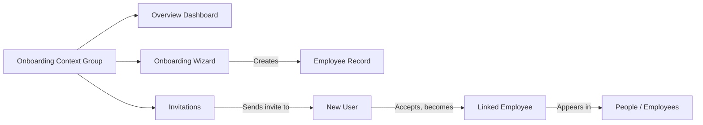

# HR Onboarding Context Group — Analysis & Recommendation

> **Date**: 2026-09-09
> **Status**: Analysis & Recommendation
> **References**: [`admin-navigation-context-group-split.md`](../../docs/project/admin-navigation-context-group-split.md), [`hr-invitation-integration-strategy.md`](../hr-invitation-integration-strategy.md)
> **No code implementation** — this is a planning document

---

## Table of Contents

1. [Current State](#1-current-state)
2. [The Onboarding Context Group Proposal](#2-the-onboarding-context-group-proposal)
3. [Alternative: Keep Everything in People](#3-alternative-keep-everything-in-people)
4. [Pros/Cons Analysis](#4-proscons-analysis)
5. [Recommendation](#5-recommendation)
6. [Implementation Plan](#6-implementation-plan)
7. [Impact on addButton](#7-impact-on-addbutton)

---

## 1. Current State

### 1.1 HR Top-Nav Context Groups

The HR module currently defines **5 context groups** in [`navigation.php`](../../../LaravelProjects/hr-consuming-app/app/Modules/Hr/Config/navigation.php):

| # | Context Group | Order | Sidebar Items | URL (Overview) |
|---|---|---|---|---|
| 1 | Dashboard | 0 | 0 (top-level only) | `hr/dashboard` |
| 2 | My Portal | 1 | 4 items | `hr/my-portal` |
| 3 | Organization | 10000 | 4 items | `hr/dashboard-organization-overview` |
| 4 | **People** | 999 | **6 items** | `hr/dashboard-people-overview` |
| 5 | Manage | 1000 | 5 items | `hr/dashboard-manage-overview` |

### 1.2 People Context Group — Current Sidebar Items

When a user clicks the "People" top-nav tab, the sidebar renders these 6 items:

| # | Key | Label | Route | Permission |
|---|---|---|---|---|
| 1 | `people_overview` | Overview | `/hr/dashboard-people-overview` | `view_people_overview` |
| 2 | `employee` | Employees | `/hr/employees` | `view_employee` |
| 3 | `employee_profile` | Profiles | `/hr/employee-profiles` | `view_employee_profile` |
| 4 | `employee_position` | Current Jobs | `/hr/employee-positions` | `view_employee_position` |
| 5 | `team` | Teams | `/hr/teams` | `view_team` |
| 6 | `employee_group` | Employee Groups | `/hr/employee-groups` | `view_employee_group` |

**Assessment**: 6 items is at the upper bound of the "sweet spot" (3–6 items per group per the [admin navigation split analysis](../../docs/project/admin-navigation-context-group-split.md#21-the-operational-vs-configuration-split)). Adding even one more item pushes this to 7, approaching the "8+ signals a split" threshold.

### 1.3 Where the Onboarding Wizard Lives Now

The employee onboarding wizard is **not** a sidebar navigation item. It is buried in the employee data table's `addButton` dropdown at [`employee.php:209-222`](../../../LaravelProjects/hr-consuming-app/app/Modules/Hr/Data/employee.php):

```php
'addButton' => [
    '0' => [
        'label' => 'Add Employee',
        'type' => 'quick_add',
        'icon' => 'fas fa-plus',
        'primary' => true,
    ],
    '1' => [
        'label' => 'Onboard New Hire (Guided)',
        'type' => 'wizard',
        'url' => '/hr/employee-onboarding',
        'wizard' => 'employee_onboarding',
        'icon' => 'fas fa-user-plus',
    ],
],
```

The wizard is only discoverable if the user:
1. Navigates to People → Employees
2. Clicks the "Add" dropdown button
3. Selects "Onboard New Hire (Guided)" from the dropdown

### 1.4 What the Onboarding Wizard Does

Defined in [`Data/wizards/employee_onboarding.php`](../../../LaravelProjects/hr-consuming-app/app/Modules/Hr/Data/wizards/employee_onboarding.php):

| Step | Title | Model | Field Groups |
|---|---|---|---|
| 1 | Personal & Employment | `Employee` | `identity` (employee_number, first_name, last_name), `employment_details` (hire_date, company_id, employee_group_id) |
| 2 | Job Setup | `EmployeePosition` | `job_information` (job_title_id, department_id, manager_id), `employment_details` (employment_status), `compensation` (pay_type, hourly_rate, base_salary) |
| 3 | Review & Confirm | — | Summary of all entered data before finalizing |

**Key observations**:
- The wizard creates **two records**: an `Employee` and an `EmployeePosition`
- It does **not** create a user account or send an invitation — it's purely for HR to create the employee record
- The blade view at [`employee-onboarding.blade.php`](../../../LaravelProjects/hr-consuming-app/app/Modules/Hr/Resources/views/employee-onboarding.blade.php) renders with `context="people"`, disables the top bar, breadcrumb, title, and context menu — it's a full-screen immersive experience
- The wizard has no explicit route in [`web.php`](../../../LaravelProjects/hr-consuming-app/app/Modules/Hr/Routes/web.php) — it's handled by the library's wizard system

### 1.5 Where Invitations Fit

The invitation system is complete at the library level but has **no HR-side UI entry point**. The [HR invitation integration strategy](../hr-invitation-integration-strategy.md) recommends:

- **P0**: Employee selector in invitation form + Invitations tab on employee profile
- **P1**: Send invite on employee creation
- **P2**: Invite step in onboarding wizard

Currently, there is no HR blade view, no HR route, and no HR navigation item for invitations. An HR admin would need to go to the Admin module to manage invitations — a disconnected experience.

---

## 2. The Onboarding Context Group Proposal

### 2.1 Proposed Items

| # | Key | Label | Route | Rationale |
|---|---|---|---|---|
| 1 | `onboarding_overview` | Overview | `/hr/dashboard-onboarding-overview` | Dedicated dashboard: pending invitations, recent hires, onboarding completion rate, unlinked employees |
| 2 | `employee_onboarding` | Onboarding Wizard | `/hr/employee-onboarding` | Elevate the existing wizard from a buried dropdown to a first-class navigation item |
| 3 | `invitation` | Invitations | `/hr/invitations` | HR-side invitation management — send, resend, revoke, view status, bulk invite |

**Total**: 3 items. This is on the lower end but acceptable — the Admin module's proposed "Access" group in the [split analysis](../../docs/project/admin-navigation-context-group-split.md#group-b-access-configuration-order-3) also has only 3 items.

### 2.2 Item Rationale

#### Overview Dashboard

An onboarding-specific overview would show metrics relevant to the hire→invite→onboard pipeline:

- **Pending invitations** count with aging (approaching expiration)
- **Recent hires** (employees created in last 30 days)
- **Onboarding completion rate** — employees with linked user accounts vs. without
- **Unlinked employees** — employees with no user account (actionable: "Send Invitation")
- **Invitation funnel** — sent → accepted → linked conversion rates

This dashboard provides HR with a single view of onboarding health that currently requires checking multiple places (employee list, admin invitations, manual cross-referencing).

#### Onboarding Wizard

The wizard is currently only accessible from the Employees page's addButton dropdown. Moving it to the sidebar:

- Makes it **discoverable** without needing to navigate to the employee list first
- Positions it as a **first-class workflow**, not a secondary option
- Follows the pattern of other sidebar items that link to dedicated pages (not modals or dropdowns)
- The wizard's blade view already uses `context="people"` — this would change to `context="onboarding"` so the sidebar highlights correctly

#### Invitations

This is the **primary gap** identified in the [invitation integration strategy](../hr-invitation-integration-strategy.md). HR needs a dedicated place to:

- View all invitations (filtered by status: pending, accepted, expired, revoked)
- Send new invitations (with employee pre-linking)
- Resend or revoke pending invitations
- Bulk invite (paste emails or CSV upload)
- See invitation history per employee

Without this, HR must use the Admin module's invitation page — a disconnected experience that doesn't support employee pre-linking.

### 2.3 Resulting Top-Nav Structure

After adding the Onboarding group, the HR top nav would have **6 context groups** (up from 5):

| # | Context Group | Order | Items | Change |
|---|---|---|---|---|
| 1 | Dashboard | 0 | 0 | Unchanged |
| 2 | My Portal | 1 | 4 | Unchanged |
| 3 | **Onboarding** | **500** | **3** | **New** |
| 4 | People | 999 | 6 | Unchanged |
| 5 | Organization | 10000 | 4 | Unchanged |
| 6 | Manage | 1000 | 5 | Unchanged |

**Order rationale**: Onboarding at 500 places it between My Portal (employee self-service) and People (employee management). This reflects the natural workflow: an employee is onboarded (Onboarding) before they appear in the employee list (People).

### 2.4 Conceptual Model



The Onboarding group covers the **pre-employment and transition** phase. Once an employee is fully onboarded (record created + user linked), they graduate to the People group. This creates a clean separation of concerns:

- **Onboarding** = employees in flight (being created, being invited, pending acceptance)
- **People** = established employees (active records with or without user accounts)

---

## 3. Alternative: Keep Everything in People

### 3.1 What It Would Look Like

Instead of a new context group, add the wizard and invitations to the existing People group:

| # | Key | Label | Route |
|---|---|---|---|
| 1 | `people_overview` | Overview | `/hr/dashboard-people-overview` |
| 2 | `employee` | Employees | `/hr/employees` |
| 3 | `employee_onboarding` | Onboard New Hire | `/hr/employee-onboarding` |
| 4 | `invitation` | Invitations | `/hr/invitations` |
| 5 | `employee_profile` | Profiles | `/hr/employee-profiles` |
| 6 | `employee_position` | Current Jobs | `/hr/employee-positions` |
| 7 | `team` | Teams | `/hr/teams` |
| 8 | `employee_group` | Employee Groups | `/hr/employee-groups` |

**Result**: 8 items in the People sidebar.

### 3.2 Why This Is Problematic

Per the [admin navigation split analysis](../../docs/project/admin-navigation-context-group-split.md#21-the-operational-vs-configuration-split):

> **3–6 items per group is the sweet spot; 8+ items signals a split is warranted.**

8 items is exactly at the split threshold. The Admin module's "Users & Permissions" group was flagged for splitting at 8 items. Adding the wizard and invitations to People would create the same problem the Admin module is trying to solve.

Additionally, there's a conceptual mismatch:

- **People** is about **existing employees** — their profiles, positions, teams, and groups
- **Invitations** are about **people who are not yet employees** (or employees without user accounts)
- **Onboarding Wizard** is about **creating new employees** — a transitional workflow, not an entity

Mixing pre-hire/transitional workflows with established employee management creates the same "compound concern" problem that the Admin module's "Users **&** Permissions" label signaled.

---

## 4. Pros/Cons Analysis

### 4.1 Creating an Onboarding Context Group

| Pros | Cons |
|---|---|
| **Single unified place** for the entire hire→invite→onboard pipeline | Adds a 6th top-nav group (from 5) |
| **Elevates the wizard** from a buried dropdown to a first-class navigation item | "Onboarding" is a **process**, not an entity — different from other context groups (Organization, People, Manage) which are entity-based |
| **Prevents People group bloat** — keeps People at 6 items instead of 8 | Only **3 items** — on the lower end for a context group |
| **Follows the operational-vs-configuration split pattern** from the admin navigation analysis | The wizard is already accessible from the employee list — removing it from the addButton dropdown could break muscle memory |
| **Dedicated overview dashboard** provides onboarding-specific metrics that the People overview can't | Requires a new overview dashboard, new route, new blade view |
| **Natural workflow ordering**: Onboarding (500) → People (999) → Manage (1000) | Invitations could alternatively live under Admin, not HR |
| **Mirrors the Admin split pattern**: just as "Users" was split from "Access", "Onboarding" splits transitional workflows from established employee management | |

### 4.2 Keeping Everything in People

| Pros | Cons |
|---|---|
| **No new top-nav group** — simpler navigation surface | **8 items** in People sidebar — at the split threshold |
| **Less implementation effort** — just add 2 config entries | **Conceptual muddiness** — pre-hire workflows mixed with established employee management |
| **Wizard stays in addButton** — no muscle memory disruption | **No dedicated onboarding overview** — the People overview would need to cover 8 concerns, becoming shallow |
| **Invitations are "people-related"** — defensible placement | **Invitations are about non-employees** — conceptually odd under "People" |
| | **Misses the opportunity** to create a focused onboarding workflow that HR teams can navigate independently |

---

## 5. Recommendation

### 5.1 Verdict: **YES — Create the Onboarding Context Group**

The strongest arguments are:

1. **Prevents People group bloat**: Adding the wizard and invitations to People pushes it to 8 items — exactly the threshold where the admin navigation split analysis says a split is warranted. Creating Onboarding now avoids having to split People later.

2. **Conceptual clarity**: Onboarding is a transitional workflow (hire→invite→onboard), not an entity. Giving it its own group acknowledges this distinction and creates a clean mental model: Onboarding = employees in flight, People = established employees.

3. **Follows established patterns**: The Admin module's split of "Users & Permissions" into "Users" and "Access" established that splitting by operational domain is valid. The Organization module's split into Companies, Structure, Teams, and Locations established that thin groups (2–4 items) are acceptable when the domain is distinct.

4. **The invitation system needs a home**: Invitations are currently homeless in the HR navigation. They don't fit naturally under People (non-employees), Organization (not structural), or Manage (not configuration). Onboarding is the only logical home.

5. **The wizard deserves elevation**: A guided onboarding wizard buried in a dropdown is a UX anti-pattern. It should be a first-class navigation item that HR can access directly.

### 5.2 Recommended Item List and Order

| # | Key | Label | Icon | Route | Permission |
|---|---|---|---|---|---|
| 1 | `onboarding_overview` | Overview | `fas fa-chart-bar` | `/hr/dashboard-onboarding-overview` | `view_onboarding_overview` |
| 2 | `employee_onboarding` | Onboarding Wizard | `fas fa-user-plus` | `/hr/employee-onboarding` | `view_employee` (reuse) |
| 3 | `invitation` | Invitations | `fas fa-envelope` | `/hr/invitations` | `view_invitation` |

### 5.3 Context Group Configuration

```php
'onboarding' => [
    'label' => 'Onboarding',
    'icon' => 'fas fa-user-check',
    'order' => 500,
    'route' => NULL,
    'url' => 'hr/dashboard-onboarding-overview',
    'permission' => 'view_onboarding_overview',
    'roles' => ['*'],
],
```

**Order 500** places it between My Portal (1) and People (999), reflecting the natural workflow: onboard → manage.

**Icon `fa-user-check`** conveys "person being confirmed/checked" — appropriate for the onboarding/verification theme.

---

## 6. Implementation Plan

### 6.1 Files to Create

| File | Purpose |
|---|---|
| `app/Modules/Hr/Resources/views/dashboard-onboarding-overview.blade.php` | Onboarding overview dashboard — widget-based page showing invitation stats, recent hires, onboarding completion |
| `app/Modules/Hr/Resources/views/invitations.blade.php` | HR invitation management page — wraps the library's `InvitationDataTable` with HR-specific context (employee pre-linking) |
| `app/Modules/Hr/Http/Livewire/OnboardingOverview.php` | (Optional) Livewire component for the overview dashboard if widgets alone aren't sufficient |

### 6.2 Files to Modify

| File | Change |
|---|---|
| [`app/Modules/Hr/Config/navigation.php`](../../../LaravelProjects/hr-consuming-app/app/Modules/Hr/Config/navigation.php) | Add `onboarding` context group + `onboarding` contexts array with 3 items |
| [`app/Modules/Hr/Routes/web.php`](../../../LaravelProjects/hr-consuming-app/app/Modules/Hr/Routes/web.php) | Add routes: `/hr/dashboard-onboarding-overview`, `/hr/invitations` |
| [`app/Modules/Hr/Resources/views/employee-onboarding.blade.php`](../../../LaravelProjects/hr-consuming-app/app/Modules/Hr/Resources/views/employee-onboarding.blade.php) | Change `context="people"` to `context="onboarding"` so the sidebar highlights correctly |
| [`app/Modules/Hr/Data/employee.php`](../../../LaravelProjects/hr-consuming-app/app/Modules/Hr/Data/employee.php) | **Keep** the wizard in `addButton` (see §7) |

### 6.3 New Permissions

| Permission | Purpose |
|---|---|
| `view_onboarding_overview` | Gate for the Onboarding overview dashboard |

The wizard reuses `view_employee` (already exists). Invitations reuse `view_invitation` (already exists from the library).

### 6.4 What Stays vs. Moves

| Item | Current Location | New Location | Notes |
|---|---|---|---|
| Onboarding Wizard | `addButton` dropdown on Employees page | Onboarding sidebar **+** `addButton` dropdown | Dual entry points (see §7) |
| Invitations | Admin module only (no HR entry point) | Onboarding sidebar | New HR-specific invitation management page |
| Onboarding Overview | Does not exist | Onboarding sidebar | New dashboard |
| People group items | People sidebar | **Unchanged** | No items removed from People |

### 6.5 Wizard Blade View Update

The wizard's blade view at [`employee-onboarding.blade.php`](../../../LaravelProjects/hr-consuming-app/app/Modules/Hr/Resources/views/employee-onboarding.blade.php) currently sets `context="people"`. This must change to `context="onboarding"` so that when the wizard is accessed from the Onboarding sidebar, the correct context group is highlighted. When accessed from the addButton dropdown on the Employees page, the context would still be "onboarding" — this is acceptable because the wizard is a full-screen immersive experience that disables the context menu anyway.

---

## 7. Impact on addButton

### 7.1 Recommendation: **Keep the Wizard in the addButton Dropdown**

The wizard should remain in the employee data table's `addButton` dropdown **in addition to** appearing in the Onboarding sidebar. This provides **dual entry points**:

| Entry Point | Use Case |
|---|---|
| **Onboarding sidebar → Onboarding Wizard** | HR manager starting their day from the Onboarding overview; wants to onboard a new hire |
| **People → Employees → addButton → Onboard New Hire (Guided)** | HR manager browsing the employee list, realizes they need to add someone; contextual shortcut |

### 7.2 Rationale for Dual Entry Points

1. **Muscle memory**: HR staff who are accustomed to accessing the wizard from the employee list should not have their workflow disrupted
2. **Contextual convenience**: When viewing the employee list, having the wizard in the addButton dropdown is a natural "I need to add someone" action
3. **No downside**: The addButton dropdown already has 2 items — keeping the wizard there doesn't cause bloat
4. **Precedent**: The library's navigation system supports multiple paths to the same destination — this is not an anti-pattern

### 7.3 What Changes in addButton

**No changes needed.** The existing `addButton` configuration in [`employee.php:209-222`](../../../LaravelProjects/hr-consuming-app/app/Modules/Hr/Data/employee.php) remains as-is:

```php
'addButton' => [
    '0' => [
        'label' => 'Add Employee',
        'type' => 'quick_add',
        'icon' => 'fas fa-plus',
        'primary' => true,
    ],
    '1' => [
        'label' => 'Onboard New Hire (Guided)',
        'type' => 'wizard',
        'url' => '/hr/employee-onboarding',
        'wizard' => 'employee_onboarding',
        'icon' => 'fas fa-user-plus',
    ],
],
```

The only consideration is that the wizard's blade view context changes from `people` to `onboarding`, but since the wizard disables the context menu (`'context_menu' => ['enabled' => false]`), this has no visible effect on the user experience when accessed from the addButton dropdown.

---

## 8. Summary

The HR module currently has no unified place for onboarding activities. The employee onboarding wizard is buried in a dropdown, and the invitation system has no HR-side entry point. Adding both to the People context group would push it to 8 items — the threshold where the admin navigation split analysis says a split is warranted.

**Recommendation**: Create an **Onboarding** context group with 3 items:

1. **Overview** — dashboard showing pending invitations, recent hires, onboarding completion rate
2. **Onboarding Wizard** — elevated from the addButton dropdown to a first-class navigation item
3. **Invitations** — HR-side invitation management (the primary gap identified in the invitation integration strategy)

The wizard remains in the addButton dropdown as a secondary entry point. The People group stays at 6 items, unchanged. The result is 6 context groups total (up from 5), with a clean separation: Onboarding for employees in flight, People for established employees.

This follows the established patterns from both the Admin module's "Users & Permissions" split and the Organization module's entity-type grouping, while providing a natural home for the invitation system that currently has no HR navigation entry point.