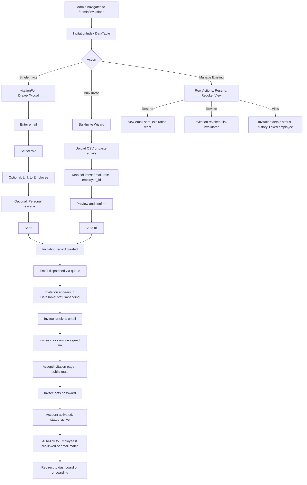

# AI Prompt: Invitation & Employee Registration Workflow Research

> **Paste this entire document into a new AI session to continue work on the invitation/employee registration feature.**

---

## Task Description

Research best workflow UX for inviting users/employees, analyze the current codebase state, and recommend an implementation approach. **No code implementation is required** — this is a research and analysis deliverable.

---

## Current State Summary

### Invitation System

The invitation system is a **bare placeholder** with no functional implementation:

| Aspect | Current State |
|--------|---------------|
| **Admin Invitations Page** | Placeholder view at [`src/Core/Admin/Resources/views/admin/invitations.blade.php`](src/Core/Admin/Resources/views/admin/invitations.blade.php) — displays "Full invitation management will be implemented in a future update" |
| **System Invitations Page** | Placeholder view at [`src/Core/System/Resources/views/system/invitations.blade.php`](src/Core/System/Resources/views/system/invitations.blade.php) — displays "This page will be implemented in the future" |
| **Admin Route** | `GET /admin/invitations` → catch-all route in [`src/Core/Admin/Routes/web.php`](src/Core/Admin/Routes/web.php:89) |
| **System Route** | `GET /system/invitations` → catch-all route in [`src/Core/System/Routes/web.php`](src/Core/System/Routes/web.php) |
| **Navigation** | Admin: "Invitations" under "Users" context group ([`src/Core/Admin/Config/navigation.php`](src/Core/Admin/Config/navigation.php:129)). System: "Invitations" under "accounts" context group ([`src/Core/System/Config/navigation.php`](src/Core/System/Config/navigation.php:141)) |
| **`invited` Status** | Defined on User model config at [`src/Core/Admin/Data/user.php`](src/Core/Admin/Data/user.php:39) with `warning` badge color (line 229), but has **no workflow** — no code sets or transitions this status |
| **Dashboard Quick Action** | "Send invitation to new user" action card exists in [`src/Core/Admin/Data/dashboard.php`](src/Core/Admin/Data/dashboard.php:208) but is non-functional |
| **No Invitation Model** | No `Invitation` model, migration, or data config exists anywhere in the codebase |
| **No Email Sending** | No invitation email template, no token generation, no accept-flow exists |

### Employee Registration

Employee registration uses a **manual `user_id` dropdown linking** pattern:

- The consuming app's `Employee` model (in `app/Modules/Hr/Models/`) has a `user_id` foreign key to the `users` table
- When creating/editing an employee, an admin manually selects a user from a dropdown
- There is **no automated pipeline** connecting invitation → user creation → employee record linking
- The [`pre-coding-checklist.md`](docs/consuming-app/pre-coding-checklist.md) §A documents the employee scoping pattern: `Employee::where('user_id', Auth::id())->first()`

### What's Missing

1. **No invitation creation flow** — no form, no email dispatch, no token generation
2. **No invitation acceptance flow** — no public route for invitees to set password and activate
3. **No employee linking automation** — invited users are not automatically linked to employee records
4. **No invitation status tracking** — the `invited` status on User model is never used
5. **No expiration/retry/revoke** — no lifecycle management for invitations

---

## Architecture Rules (Non-Negotiable)

These rules **must** be followed in any recommendation or implementation:

### 1. UI Library Must Remain Completely Decoupled

The library (`src/`) must **never** reference any consuming-app code (`App\Modules\*`). See [`docs/library/25-library-independence-safeguards.md`](docs/library/25-library-independence-safeguards.md) for the full policy.

Key rules:
- No `use App\Modules\...` in `src/`
- No domain nouns (`employee`, `payroll`, `leave`, etc.) in library code
- Library code must pass the "two-domain test": would it work in a CRM, not just HR?

### 2. Consuming App Depends on Library via Contracts/Subclass Patterns

The consuming app can depend on the library through:
- **Contract pattern**: Library defines interface in [`src/Contracts/`](src/Contracts/), consuming app binds implementation
- **Subclass pattern**: Library provides base class with `protected` extension points, consuming app overrides
- **Config-driven**: Domain-specific values passed via config arrays

See [`docs/consuming-app/contracts.md`](docs/consuming-app/contracts.md) for the 8 existing contracts.

### 3. All Module Files Self-Contained

Every file for a module lives under `app/Modules/{ModuleName}/`. See [`docs/consuming-app/module-structure.md`](docs/consuming-app/module-structure.md) for the full directory anatomy.

### 4. Follow Pre-Coding Checklist

Before any code is written, consult [`docs/consuming-app/pre-coding-checklist.md`](docs/consuming-app/pre-coding-checklist.md):
- **§A**: Blade view rules (catch-all awareness, navigation layout, Livewire component views)
- **§B**: Livewire component rules (library vs module boundary, subclass pattern, naming, registration)
- **§C**: Library code rules (no consuming app references, two-domain test, backward compatibility)
- **§D**: Module file rules (correct subdirectories, self-contained test)
- **§E**: Navigation rules (context group match, route coverage, permission, icon)

---

## Key Reference Files

###Library — Invitation-Related Files

| File | Description |
|------|-------------|
| [`src/Core/Admin/Resources/views/admin/invitations.blade.php`](src/Core/Admin/Resources/views/admin/invitations.blade.php) | Admin invitation placeholder view — "Full invitation management will be implemented in a future update" |
| [`src/Core/System/Resources/views/system/invitations.blade.php`](src/Core/System/Resources/views/system/invitations.blade.php) | System invitation placeholder view — "This page will be implemented in the future" |
| [`src/Core/Admin/Routes/web.php`](src/Core/Admin/Routes/web.php:89) | Admin route: `GET /admin/invitations` |
| [`src/Core/System/Routes/web.php`](src/Core/System/Routes/web.php) | System route: `GET /system/invitations` |
| [`src/Core/Admin/Config/navigation.php`](src/Core/Admin/Config/navigation.php:129) | Admin nav: "Invitations" under "Users" context group, `view_invitation` permission |
| [`src/Core/System/Config/navigation.php`](src/Core/System/Config/navigation.php:141) | System nav: "Invitations" under "accounts" context group, `view_invitation` permission |
| [`src/Core/Admin/Data/user.php`](src/Core/Admin/Data/user.php:39) | User data config — defines `invited` status option and `warning` badge color |
| [`src/Core/Admin/Data/dashboard.php`](src/Core/Admin/Data/dashboard.php:208) | Dashboard quick action: "Send invitation to new user" |
| [`src/Services/Notifications/NotificationService.php`](src/Services/Notifications/NotificationService.php) | Notification dispatch engine — `dispatch()`, `dispatchAsync()`, channels (Database, Mail), template resolution |
| [`src/Services/Notifications/Channels/MailChannel.php`](src/Services/Notifications/Channels/MailChannel.php) | Email notification channel — could be used for invitation emails |

### Consuming App — Employee/Registration Files

| File | Description |
|------|-------------|
| `app/Modules/Hr/Models/Employee.php` | Employee model with `user_id` foreign key |
| `app/Modules/Hr/Data/employee.php` | Employee data config — drives DataTable/Form/Detail |
| `app/Modules/Hr/Config/navigation.php` | HR navigation — includes "people" context with employee management |
| `app/Modules/Hr/Routes/web.php` | HR routes — employee CRUD routes |

### Documentation Files

| File | Description |
|------|-------------|
| [`docs/consuming-app/pre-coding-checklist.md`](docs/consuming-app/pre-coding-checklist.md) | **Must-read before any code** — Blade, Livewire, library, module, and navigation rules |
| [`docs/library/25-library-independence-safeguards.md`](docs/library/25-library-independence-safeguards.md) | Library decoupling rules, grep gates, forbidden patterns |
| [`docs/consuming-app/contracts.md`](docs/consuming-app/contracts.md) | 8 contracts: Workflowable, Documentable, Notifiable, Reportable, CompanyProvider, WorkspaceResolver, ApproverResolver, ApproverLabelResolver |
| [`docs/consuming-app/module-structure.md`](docs/consuming-app/module-structure.md) | Full module anatomy, auto-discovery, naming conventions |
| [`docs/consuming-app/permissions-and-notifications.md`](docs/consuming-app/permissions-and-notifications.md) | Permission auto-generation, notification template registration |
| [`docs/library/27-architecture-boundary.md`](docs/library/27-architecture-boundary.md) | Library vs module boundary — what belongs where |
| [`docs/library/01-core-concepts.md`](docs/library/01-core-concepts.md) | Authentication/onboarding via Laravel Fortify + Spatie Onboard |
| [`docs/library/02-directory-map.md`](docs/library/02-directory-map.md) | Complete `src/` directory tree |
| [`docs/library/06-navigation-system.md`](docs/library/06-navigation-system.md) | Navigation architecture, context groups, sidebar rendering |
| [`docs/library/08-contracts-and-interfaces.md`](docs/library/08-contracts-and-interfaces.md) | Contract details and implementation guides |
| [`docs/project/admin-navigation-context-group-split.md`](docs/project/admin-navigation-context-group-split.md) | Admin navigation design — "Invitations" is tightly coupled to Users context |

### Post-Implementation Reference

| File | Description |
|------|-------------|
| [`plans/post-implementation-guide.md`](plans/post-implementation-guide.md) | Vendor override awareness, cache management, troubleshooting |

---

## What to Investigate

### 1. Best UX Patterns for User Invitation

Research how leading SaaS platforms handle user invitation workflows. Key platforms to study:

| Platform | Notable Patterns |
|----------|-----------------|
| **Gusto** | Employee self-onboarding — invite → employee fills own details → admin approves |
| **Rippling** | Bulk invite via CSV, role + permissions assigned at invite time, employee self-service portal |
| **Slack** | Magic link email, single-click acceptance, optional account creation step |
| **GitHub** | Email invite → accept → choose organization role, pending invite management dashboard |
| **Linear** | Invite by email → auto-join workspace, role assignment during invite |
| **Notion** | Share link + email invite, guest vs member roles, pending invites list |

Focus on:
- The **invite → accept → onboard** flow stages
- How pending/expired invitations are managed
- Whether the invitee sets their own password or the inviter sets it
- How roles/permissions are assigned (at invite time vs after acceptance)
- Bulk invite patterns (CSV upload, copy-paste email list)
- Invitation expiration and resend mechanisms

### 2. Current Invitation Placeholder Analysis

Examine the two placeholder views and their navigation context:

- [`src/Core/Admin/Resources/views/admin/invitations.blade.php`](src/Core/Admin/Resources/views/admin/invitations.blade.php) — Admin-side, under "Users" context group
- [`src/Core/System/Resources/views/system/invitations.blade.php`](src/Core/System/Resources/views/system/invitations.blade.php) — System-side, under "accounts" context group

Questions to answer:
- Should both placeholder views be replaced, or should one be removed?
- What is the distinction between Admin invitations and System invitations?
- Should the invitation management live in the library or the consuming app?

### 3. Current Employee Registration Flow

Trace the existing employee creation flow:
- How does `user_id` get assigned to an employee record?
- Is the user created first, then linked to employee? Or vice versa?
- What happens when a user has no employee record? (See [`pre-coding-checklist.md`](docs/consuming-app/pre-coding-checklist.md) §A — abort 403 pattern)
- How does the Employee Self-Service (ESS) system resolve the current user to their employee record?

### 4. Linking Invited User Email to Employee Record

The core challenge: when an admin invites someone, how does the system know which employee record to link?

Possible approaches to evaluate:
- **Email matching**: Match invitation email to `Employee.work_email` or `User.email`
- **Pre-linked invitation**: Admin selects employee during invite creation → invitation is pre-linked
- **Employee self-claim**: Invitee enters employee ID or identifying info during acceptance
- **HR links after acceptance**: Admin manually links user to employee after they accept

---

## What to Recommend

Your analysis should produce clear recommendations on:

### 1. Where Should Invitation Management Live?

| Option | Description |
|--------|-------------|
| **A: Library** | Generic invitation engine in `src/` — reusable across any domain (HR, CRM, project management). Provides token generation, email dispatch, accept flow, status tracking. Consuming app extends for domain-specific linking. |
| **B: Consuming App** | Invitation logic entirely in `app/Modules/` — HR-specific invitation tied to employee records. Library provides only notification delivery. |
| **C: Hybrid** | Library provides invitation infrastructure (model, token, email channel). Consuming app provides the UI, employee linking, and domain-specific workflow. |

**Consider**: The library already has `NotificationService` with `MailChannel` — could this serve as the invitation email delivery mechanism? The library also has `invited` status on User model — is this a library concern or a consuming-app concern?

### 2. How to Link Invited Users to Employee Records

Recommend a specific linking strategy with rationale. Consider:
- Does the Employee record exist before the invitation? (Pre-hire scenario)
- Does the invitation create the Employee record? (Self-registration scenario)
- What if the invited email doesn't match any employee email?

### 3. The Invitation Workflow UX

Design the end-to-end flow:

```
SEND → ACCEPT → ONBOARD
```

Detail each stage:
- **Send**: Admin form (email, role, optional employee link), bulk CSV, email template
- **Accept**: Public route with signed URL/token, password creation, email verification
- **Onboard**: Post-acceptance steps (profile completion, employee record linking, role activation)

### 4. Should the Library's Notification System Be Used?

The library's [`NotificationService`](src/Services/Notifications/NotificationService.php) already supports:
- Multi-channel delivery (Database, Mail, Broadcast)
- Template resolution with variable substitution
- Async dispatch via `dispatchAsync()`
- Notification preferences per user

Evaluate whether invitation emails should:
- Use `NotificationService` with a new `invitation` template type
- Use a dedicated invitation mail system (Laravel's built-in `Notification` or `Mail` facade)
- Use a hybrid (NotificationService for in-app notification + dedicated mail for the invitation email itself)

---

## Deliverable

**An analysis report** (written to a markdown file) containing:

1. **UX Research Summary**: Key patterns from SaaS platforms, with specific examples
2. **Current State Analysis**: What exists, what's missing, what's blocked
3. **Architecture Recommendation**: Where invitation logic should live (library vs consuming app), with rationale grounded in the library independence safeguards
4. **Linking Strategy**: How to connect invited users to employee records
5. **Workflow Design**: The send → accept → onboard flow, with wireframe-level descriptions
6. **Notification Strategy**: Whether/how to use the library's notification system
7. **Implementation Roadmap**: Phased approach with clear library vs consuming-app boundaries for each phase

**No code implementation.** This is purely research, analysis, and recommendation.

---

## Context for the AI

This is a Laravel application using:
- **UI Library** (`src/`): A decoupled, domain-agnostic UI framework providing DataTables, Forms, Wizards, Dashboards, Navigation, Notifications, Workflows, Approvals, Documents, Reports, Quick Actions, and more
- **Consuming App** (`app/Modules/`): Business modules (HR, Payroll, Leave, Attendance, Organization, Holiday) built on top of the library
- **Livewire**: Full-stack reactive components
- **Laravel Fortify**: Authentication (login, registration, password reset, 2FA)
- **Spatie Onboard**: Multi-step onboarding flows
- **Spatie Permissions**: Role-based access control

The library follows strict decoupling rules — it must never reference consuming-app code. The consuming app extends the library through contracts, subclasses, and config-driven patterns.

When analyzing, always consider: **"Does this belong in the library (reusable mechanism) or the consuming app (domain-specific policy)?"**# Invitation & Employee Registration Workflow — Analysis Report

> **Date**: 2026-09-07
> **Status**: Research & Analysis Deliverable
> **Scope**: UX research, current-state analysis, architecture recommendation, workflow design
> **No code implementation** — this is a planning document

---

## Table of Contents

1. [UX Research Summary](#1-ux-research-summary)
2. [Current State Analysis](#2-current-state-analysis)
3. [Architecture Recommendation](#3-architeture-recommendation)
4. [Linking Strategy](#4-linking-strategy)
5. [Workflow Design](#5-workflow-design)
6. [Notification Strategy](#6-notification-strategy)
7. [Implementation Roadmap](#7-implementation-roadmap)
8. [Implementation Completion Report](#8-implementation-completion-report)

---

## 1. UX Research Summary

### 1.1 Key SaaS Patterns

Analysis of six leading SaaS platforms reveals three dominant invitation workflow patterns:

#### Pattern A: Admin-Sends, User-Sets-Password (Gusto, Rippling, GitHub)

```
Admin creates invitation → System sends email with unique link → 
User clicks link → User sets password → Account activated
```

**Characteristics**:
- Admin controls *who* gets invited and *when*
- Invitee controls their own credentials (password, sometimes profile details)
- Clear separation: admin owns the invite, user owns the account
- Most common pattern for B2B/employee scenarios

#### Pattern B: Magic Link (Slack, Linear, Notion)

```
Admin creates invitation → System sends magic link → 
User clicks link → Auto-authenticated → Optional profile completion
```

**Characteristics**:
- Lowest friction for the invitee — no password to remember immediately
- Password can be set later in account settings
- Higher security risk if email is compromised (mitigated by link expiration)
- Best for collaboration tools where speed of onboarding matters

#### Pattern C: Self-Registration with Approval (Notion public, some HR tools)

```
User visits public registration page → Fills details → 
Admin approves → Account activated
```

**Characteristics**:
- No invitation needed — open registration
- Admin acts as gatekeeper after the fact
- Works for public-facing products, less common for internal employee tools

### 1.2 Common Workflow Stages

Every platform studied follows a three-stage pipeline:

| Stage | What Happens | Key UX Decisions |
|-------|-------------|-----------------|
| **SEND** | Admin enters email(s), assigns role/permissions, optionally links to existing record | Single vs bulk, role-at-invite vs role-after-accept, pre-link vs post-link |
| **ACCEPT** | Invitee receives email, clicks unique link, sets password (or auto-authenticates) | Password-set-by-invitee vs set-by-admin, magic link vs password, email verification |
| **ONBOARD** | Post-acceptance: profile completion, record linking, role activation, welcome flow | Multi-step wizard vs single form, required vs optional fields, Spatie Onboard integration |

### 1.3 Pending/Expired Invitation Management

| Platform | Pending Management | Expiration | Resend |
|----------|-------------------|------------|--------|
| **Gusto** | Dashboard widget + dedicated list | 7 days | Resend button per invitation |
| **Rippling** | Filterable table with status column | Configurable (default 7 days) | Bulk resend |
| **Slack** | Pending invites list with revoke | 30 days | Resend individual |
| **GitHub** | Pending invitations tab in org settings | 7 days | Resend + revoke |
| **LINEAR** | Inline in members list | No expiration (manual revoke) | RESEND |
| **NOTION** | Pending tab in members settings | No expiration | RESEND + copy link |

**Common patterns**:
- **Status badges**: Pending (yellow), Accepted (green), Expired (red/grey), Revoked (grey)
- **Bulk operations**: Resend all pending, revoke all pending, export pending list
- **Expiration**: 7 days is the industry default; some platforms allow configuration
- **Dashboard visibility**: Pending invitation count is a common admin dashboard widget

### 1.4 Role/Permission Assignment Timing

| Platform | When Roles Are Assigned |
|----------|------------------------|
| **Gusto** | At invite time (admin selects role from dropdown) |
| **Rippling** | At invite time (role + permissions in invite form) |
| **Slack** | At invite time (member vs guest, channel access) |
| **GitHub** | After acceptance (invitee chooses or admin assigns) |
| **Linear** | At invite time (role + team assignment) |
| **Notion** | At invite time (member vs guest, page access) |

**Industry consensus**: Assign roles at invite time. This ensures the invitee has appropriate access immediately upon acceptance, eliminating a "limbo" state where the user exists but has no permissions.

### 1.5 Bulk Invite Patterns

| Platform | Bulk Method |
|----------|------------|
| **Gusto** | CSV upload with column mapping |
| **Rippling** | CSV upload + copy-paste email list |
| **Slack** | Copy-paste email list (comma or newline separated) |
| **GitHub** | Copy-paste email/username list |
| **Linear** | Copy-paste email list |
| **Notion** | Copy-paste email list |

**Best practice**: Support both CSV upload (for HRIS migration scenarios) and copy-paste email list (for quick ad-hoc invites). CSV should accept columns for email, role, and optional employee identifier.

---

## 2. Current State Analysis

### 2.1 What Exists

#### Invitation Placeholder Views

| View | Location | Content |
|------|----------|---------|
| Admin | [`src/Core/Admin/Resources/views/admin/invitations.blade.php`](src/Core/Admin/Resources/views/admin/invitations.blade.php) | Placeholder card: "Full invitation management will be implemented in a future update" |
| System | [`src/Core/System/Resources/views/system/invitations.blade.php`](src/Core/System/Resources/views/system/invitations.blade.php) | Placeholder card: "This page will be implemented in the future" |

Both use `<x-qf::navigation-layout>` correctly. The Admin view uses `configKey="admin.invitations"` and `context="Users"`. The System view uses `context="accounts"` and `moduleName="system"`.

#### Routes

| Route | File | Line | Type |
|-------|------|------|------|
| `GET /admin/invitations` | [`src/Core/Admin/Routes/web.php`](src/Core/Admin/Routes/web.php) | 89 | Explicit named route (`admin.invitations`) |
| `GET /system/invitations` | [`src/Core/System/Routes/web.php`](src/Core/System/Routes/web.php) | (catch-all) | Catch-all route `/{module}/{view}` |

#### Navigation

| Module | Context Group | Key | Label | Route | Permission | Order |
|--------|--------------|-----|-------|-------|------------|-------|
| Admin | `Users` | `invitation` | Invitations | `/admin/invitations` | `view_invitation` | 3 |
| System | `accounts` | `invitation` | Invitations | `/system/invitations` | `view_invitation` | 40 |

The Admin navigation places Invitations between Users (order 2) and User Groups (order 4) — tightly coupled to the user management workflow. The System navigation places it among account management items (Account Statuses, Account Activity).

#### User Model — `invited` Status

Defined in [`src/Core/Admin/Data/user.php`](src/Core/Admin/Data/user.php):
- **Line 39**: `'invited' => 'Invited'` as a status option
- **Line 229**: `'invited' => 'warning'` badge color (yellow/orange)
- **Never used**: No code sets `status = 'invited'` or transitions from `invited` to `active`

#### Dashboard Quick Action

Defined in [`src/Core/Admin/Data/dashboard.php`](src/Core/Admin/Data/dashboard.php:205-228):
- Type: `action_card`
- Title: "Invite User"
- Description: "Send invitation to new user"
- Action: Opens a drawer with `qf.data-table-form` using `configKey: 'admin.user'` — **this is incorrect**; it opens the user creation form, not an invitation form

#### Notification System

The library's [`NotificationService`](src/Services/Notifications/NotificationService.php) provides:
- `dispatch(Notifiable $notifiable, string $type, array $data)` — synchronous multi-channel delivery
- `dispatchAsync(Notifiable $notifiable, string $type, array $data)` — queued delivery via [`SendNotification`](src/Jobs/SendNotification.php) job
- Template resolution from [`NotificationTemplate`](src/Models/NotificationTemplate.php) model
- Channel resolution from user preferences via [`NotificationPreference`](src/Models/NotificationPreference.php)
- Two built-in channels: [`DatabaseChannel`](src/Services/Notifications/Channels/DatabaseChannel.php) (in-app) and [`MailChannel`](src/Services/Notifications/Channels/MailChannel.php) (email via `Mail::raw()`)

The [`Notifiable`](src/Contracts/Notifications/Notifiable.php) contract requires:
- `getNotifiableId()` — an existing entity ID
- `getNotifiableType()` — the morph type
- `getNotificationEmail()` — the recipient email
- `getNotificationPhone()` — optional SMS
- `getNotificationDeviceTokens()` — optional push

### 2.2 What's Missing

| Gap | Severity | Description |
|-----|----------|-------------|
| **Invitation model** | Critical | No `Invitation` model, migration, or data config exists |
| **Token generation** | Critical | No signed URL or token mechanism for secure invitation links |
| **Invitation form** | Critical | No UI for admins to create invitations (email, role, message) |
| **Email delivery** | Critical | No invitation email template or mailable class |
| **Accept flow** | Critical | No public route for invitees to set password and activate |
| **Status lifecycle** | High | The `invited` status on User model is defined but never used |
| **Expiration** | High | No mechanism for invitation expiry or cleanup |
| **Resend/Revoke** | Medium | No lifecycle management actions |
| **Bulk invite** | Medium | No CSV upload or multi-email input |
| **Employee linking** | High | No automated connection between invited user and employee record |
| **Dashboard integration** | Medium | Quick action opens wrong form; no pending-invite widget |

###2.3 What's Blocked

1. **The dashboard quick action is broken**: It opens a `data-table-form` for `admin.user` (user creation), not an invitation form. This needs to be replaced with an invitation-specific form or wizard.

2. **The `invited` status has no workflow**: The status exists in the config but no code transitions users into or out of it. The status lifecycle (`invited` → `active` on acceptance, `invited` → `inactive` on expiry) needs to be implemented.

3. **Two invitation views for the same concept**: Both Admin and System have invitation pages. The [admin-navigation-context-group-split.md](docs/project/admin-navigation-context-group-split.md) analysis recommends keeping Invitations under the Users context group (operational). The System invitations page appears redundant — it's the same concept viewed from a different angle.

###2.4 The Admin vs System Invitation Question

**Analysis**: The two invitation views represent different perspectives on the same data:

| Aspect | Admin (`/admin/invitations`) | System (`/ystem/invitations`) |
|--------|------------------------------|-------------------------------|
| Context | "Users" — operational user management | "accounts" — system account administration |
| Audience | HR admins, team managers | System administrators |
| Focus | Who needs access? Send invites, track acceptance | Account lifecycle: invited → active → inactive |
| Actions | Create invitation, resend, revoke | View all invitations across companies, audit |

**Recommendation**: Keep the Admin invitation page as the **primary operational interface** (create, manage, track). The System invitation page should either:
- **Option A (preferred)**: Be removed — it duplicates the Admin page's function
- **Option B**: Become a **read-only audit view** showing all invitations across all companies with filtering and export, but no create/edit actions

The [admin-navigation-context-group-split.md](docs/project/admin-navigation-context-group-split.md) analysis explicitly recommends keeping Invitations under the Users context group, noting it is "tightly coupled to Users (invitations create users)."

---

## 3. Architecture Recommendation

###3.1 The Core Question: Library or Consuming App?

Applying the two-domain test from [`docs/library/27-architeture-boundary.md`](docs/library/27-architeture-boundary.md):

| Capability | Two-Domain Test | Verdict |
|-----------|----------------|---------|
| Token generation + signed URL | HR invites employees, CRM invites sales reps, PM invites team members | **Library** |
| Email dispatch with branded template | Same mechanism regardless of domain | **Library** |
| Invitation status tracking (pending/accepted/expired/revoked) | Universal lifecycle | **Library** |
| Accept flow (set password, activate account) | Universal account activation | **Library** |
| Role assignment at invite time | Roles are domain-specific (HR Manager vs Sales Manager) | **Consuming App** |
| Linking invited user to Employee record | HR-specific — only makes sense in HR domain | **Consuming App** |
| Bulk CSV with employee-specific columns | HR-specific columns (employee ID, department) | **Consuming App** |

###3.2 Recommendation: Hybrid Approach (Option C)

**The library provides the invitation infrastructure; the consuming app provides domain-specific linking and UI customization.**

```
┌─────────────────────────────────────────────────────────┐
│ LIBRARY (src/)                                           │
│                                                          │
│ Invitation Model + Migration                             │
│ ├── email, token, status, role, expires_at, accepted_at  │
│ ├── polymorphic: invitable_type + invitable_id (nullable)│
│ └── sent_at, revoked_at, created_by                      │
│                                                          │
│ InvitationService                                        │
│ ├── create(email, role, ?invitable): Invitation          │
│ ├── accept(token, password): User                        │
│ ├── resend(invitation): void                             │
│ ├── revoke(invitation): void                             │
│ └── expire(): void (scheduled cleanup)                   │
│                                                          │
│ InvitationMail (Mailable)                                │
│ ├── HTML email with branded template                     │
│ ├── Signed URL with expiration                           │
│ └── Configurable subject/body via template               │
│                                                          │
│ AcceptInvitation Livewire Component                      │
│ ├── Public route (no auth required)                      │
│ ├── Validates signed token                               │
│ ├── Password creation form                               │
│ └── Creates/activates User, marks invitation accepted    │
│                                                          │
│ InvitationContract (optional)                            │
│ ├── getInvitableType(): string                           │
│ └── getInvitableId(): int|string                         │
│                                                          │
│ Config: ui-library.invitations                           │
│ ├── expiration_days (default: 7)                         │
│ ├── mail.template (default: 'qf::mail.invitation')       │
│ └── require_email_verification (default: true)           │
└─────────────────────────────────────────────────────────┘
                           │
                           │ extends / implements
                           ▼
┌─────────────────────────────────────────────────────────┐
│ CONSUMING APP (app/Modules/Hr/)                          │
│                                                          │
│ HrInvitationService (extends or wraps library service)   │
│ ├── createWithEmployeeLink(email, role, employeeId)      │
│ ├── linkOnAccept(invitation, user): void                 │
│ └── matchByEmail(email): ?Employee                       │
│                                                          │
│ Employee implements Invitable (optional contract)        │
│ ├── getInvitableType(): 'employee'                       │
│ └── getInvitableId(): $this->id                          │
│                                                          │
│ Invitation Management UI (Livewire)                      │
│ ├── InvitationIndex component (DataTable)                │
│ ├── InvitationForm component (create/send)               │
│ ├── Employee selector in invitation form                 │
│ └── Bulk invite with CSV upload                          │
│                                                          │
│ Data/invitation.php config                               │
│ ├── DataTable columns (email, status, role, employee)    │
│ ├── Form fields (email, role, employee_id, message)      │
│ └── Filters (status, role, date range)                   │
│                                                          │
│ Config/navigation.php (already exists)                   │
│ └── Invitations under "Users" context group              │
└─────────────────────────────────────────────────────────┘
```

### 3.3 Why Not Pure Library (Option A)?

A pure library approach would require the library to own the invitation UI (DataTable, Form, Dashboard widgets). This creates problems:

1. **The library cannot render domain-specific columns**: An invitation DataTable in the library can't show an "Employee" column because `Employee` is a consuming-app model.
2. **The library cannot provide an employee selector**: The invitation form needs an employee dropdown — this is HR-specific.
3. **The library's DataTable/Form system is config-driven**: The consuming app provides the config (`Data/invitation.php`), which naturally lives in the module.

### 3.4 Why Not Pure Consuming App (Option B)?

A pure consuming-app approach would duplicate invitation infrastructure that every module would need:

1. **Token generation and validation** is a solved problem — the library should provide it once.
2. **Email delivery** infrastructure already partially exists in the library.
3. **The `invited` status** is already defined on the library's User model config — the library should own the state machine that uses it.
4. **Future modules** (CRM, Projects) would need to rebuild invitation logic from scratch.

### 3.5 The `invited` Status: Library Concern

The `invited` status on the User model config at [`src/Core/Admin/Data/user.php:39`](src/Core/Admin/Data/user.php:39) is already a library concern. The library should own the state machine:

```
[invited] ──accept──▶ [active]
[invited] ──expire──▶ [inactive] (or stays invited with expired flag)
[invited] ──revoke──▶ [inactive]
```

The consuming app can react to these state transitions via events/listeners to perform domain-specific linking.

### 3.6 Library Independence Safeguards Check

Per [`docs/library/25-library-independence-safeguards.md`](docs/library/25-library-independence-safeguards.md), all library code must pass:

| Rule | How the Hybrid Approach Satisfies It |
|------|--------------------------------------|
| **No `App\Modules\*` references** | Library code uses only its own namespaces. The polymorphic `invitable` relation uses a contract, not a concrete model. |
| **Two-domain test** | Token generation, email dispatch, accept flow work identically for HR (invite employee), CRM (invite sales rep), PM (invite team member). |
| **Config-driven, not domain-driven** | `ui-library.invitations.expiration_days` — generic config key, not `hr_invitation_expiry`. |
| **Contract boundary** | Optional `Invitable` contract with capability names (`getInvitableType()`), not domain names (`getEmployeeId()`). |
| **No hardcoded module names** | The library never references `Hr`, `Employee`, or any business module. |

---

## 4. Linking Strategy

### 4.1 The Core Challenge

When an admin invites `jane@company.com`, how does the system know Jane is the same person as the Employee record for "Jane Smith"?

###4.2 Strategy Comparison

| Strategy | How It Works | Pros | Cons | Best For |
|----------|-------------|------|------|----------|
| **A: Email Matching** | Match `invitation.email` to `Employee.work_email` on acceptance | No extra UI; works retroactively | Fragile — emails change, multiple employees may share email, pre-hire employees may not have email set | Existing employees being invited to the platform |
| **B: Pre-Linked Invitation** | Admin selects Employee during invite creation; `invitation.invitable_id` = `employee.id` | Deterministic; no ambiguity | Requires Employee record to exist before invitation; extra step for admin | Pre-hire or employee-record-first workflows |
| **C: Employee Self-Claim** | Invitee enters employee ID or identifying info during acceptance | Works when admin doesn't know the link | Error-prone; invitee may not know their employee ID | Large organizations where HR and IT are separate |
| **D: HR Links After Acceptance** | Admin manually links user to employee after they accept | Simple; no automation needed | Manual step; easy to forget; creates orphaned users | Small organizations with few employees |

### 4.3 Recommended Strategy: Hybrid (B + A)

**Primary: Pre-linked invitation (Strategy B)**
- The invitation form includes an optional "Link to Employee" searchable select dropdown
- When selected, `invitation.invitable_type = 'employee'`, `invitation.invitable_id = employee.id`
- On acceptance, the system automatically sets `employee.user_id = user.id`

**Fallback: Email matching (Strategy A)**
- If no employee was pre-linked, the system attempts to match `invitation.email` to `Employee.work_email`
- If exactly one match is found, auto-link
- If multiple matches or no match, flag for manual review

**Manual resolution (Strategy D)**
- A "Needs Linking" filter on the invitation list shows invitations that couldn't be auto-linked
- Admin can manually link from the invitation detail view

### 4.4 Implementation Flow

```
Admin creates invitation
        │
        ├── Employee selected? ──Yes──▶ invitation.invitable = employee
        │                                      │
        └── No ──▶ invitation.invitable = null │
                                               │
        Invitee accepts (clicks email link)    │
                │                               │
                ▼                               ▼
        User account created/activated    invitation.invitable exists?
                │                               │
                ▼                       Yes     │     No
        Auto-link check:               ┌───────┘     │
        ┌──────────────────────┐       │             │
        │ invitable exists?    │       ▼             ▼
        └──────────────────────┘  Set employee      Try email match
                │                 .user_id =        invitation.email
        ┌───────┴───────┐        user.id           ↔ Employee.work_email
        │               │               │             │
       Yes             No               │      ┌──────┴──────┐
        │               │               │      │             │
        ▼               ▼               │   1 match    0/multiple
   Link via         Try email           │      │         matches
   invitable        match               │      ▼             │
        │               │               │  Auto-link         │
        └───────┬───────┘               │      │             │
                │                       │      │             ▼
                ▼                       │      │      Flag "Needs
        Link successful?                │      │      Manual Link"
                │                       │      │
        ┌───────┴───────┐               │      │
       Yes             No               │      │
        │               │               │      │
        ▼               ▼               │      │
   Done!          Flag "Needs           │      │
                  Manual Link"          │      │
                        │               │      │
                        └───────────────┴──────┘
                                │
                                ▼
                        Admin resolves
                        from invitation
                        detail view
```

###4.5 Pre-Hire Scenario

For pre-hire employees (employee record exists but no user account yet):

1. HR creates Employee record (if not already existing)
2. HR sends invitation, selecting the Employee from the dropdown
3. Invitation is pre-linked to the Employee record
4. Candidate accepts → User created → `employee.user_id` set automatically
5. Employee status transitions from "pre-hire" to "active"

###4.6 Self-Registration Scenario

For scenarios where the invitation creates the employee record:

1. Admin sends invitation to `jane@company.com` with role "Employee"
2. Jane accepts, sets password
3. System creates User record
4. System attempts email match to existing Employee records
5. If no match, system creates a new Employee record with `work_email = jane@company.com` and `user_id = new user.id`
6. HR can later fill in additional employee details

---

## 5. Workflow Design

###5.1 End-to-End Flow



### 5.2 Stage 1: SEND — Admin Invitation Form

#### Single Invitation Form

**Wireframe-level description**:

```
┌──────────────────────────────────────────────────┐
│  Send Invitation                          [X]     │
├──────────────────────────────────────────────────┤
│                                                    │
│  Email Address                                     │
│  ┌────────────────────────────────────────────┐   │
│  │ jane.smith@company.com                     │   │
│  └────────────────────────────────────────────┘   │
│                                                    │
│  Role                                             │
│  ┌────────────────────────────────────────────┐   │
│  │ Employee                              [▼]  │   │
│  └────────────────────────────────────────────┘   │
│                                                    │
│  Link to Employee (optional)                       │
│  ┌────────────────────────────────────────────┐   │
│  │ Search employees...                        │   │
│  │ ─────────────────────────────────────────── │   │
│  │ Jane Smith — Software Engineer             │   │
│  │ Janet Smith — Product Manager              │   │
│ └────────────────────────────────────────────┘   │
│                                                    │
│  Personal Message (optional)                       │
│  ┌────────────────────────────────────────────┐   │
│  │ Welcome to the team! Please set up your    │   │
│  │ account to access payroll and benefits.    │   │
│  └────────────────────────────────────────────┘   │
│                                                    │
│  ─────────────────────────────────────────────     │
│  Invitation expires in 7 days                      │
│                                                    │
│              [Cancel]    [Send Invitation]         │
└──────────────────────────────────────────────────┘
```

**Key design decisions**:
- **Role at invite time**: Following industry consensus (Gusto, Rippling, Slack, Linear), role is assigned during invitation, not after acceptance. This eliminates the "limbo user" problem.
- **Employee searchable select**: Uses the library's existing `LivewireSearchableSelectField` or a custom searchable dropdown. Shows employee name + position to disambiguate.
- **Personal message**: Optional field that appears in the email body. Humanizes the invitation.
- **Expiration notice**: Shows the configured expiration period so the admin knows the timeframe.

#### Bulk Invitation

**Wireframe-level description**:

```
┌──────────────────────────────────────────────────┐
│  Bulk Invite Users                                │
├──────────────────────────────────────────────────┤
│                                                    │
│  Method:  [● CSV Upload]  [○ Paste Emails]        │
│                                                    │
│  ┌────────────────────────────────────────────┐   │
│  │                                            │   │
│  │         📁 Drag & drop CSV file            │   │
│  │            or click to browse              │   │
│  │                                            │   │
│  │    Accepted columns: email, role,          │   │
│  │    employee_id, message                    │   │
│  │                                            │   │
│  └────────────────────────────────────────────┘   │
│                                                    │
│  ── or ──                                          │
│                                                    │
│  Paste email addresses (one per line):             │
│  ┌────────────────────────────────────────────┐   │
│  │ jane@company.com                           │   │
│  │ bob@company.com                            │   │
│  │ alice@company.com                          │   │
│  │                                            │   │
│  └────────────────────────────────────────────┘   │
│                                                    │
│  Default Role for all:                             │
│  ┌────────────────────────────────────────────┐   │
│  │ Employee                              [▼]  │   │
│  └──────────────────────────────────────────────┘   │
│                                                    │
│  ─────────────────────────────────────────────     │
│                                                    │
│              [Cancel]    [Send 3 Invitations]      │
└──────────────────────────────────────────────────┘
```

**Key design decisions**:
- **CSV upload**: Uses the library's existing import infrastructure ([`ImportProcessor`](src/Services/Imports/ImportProcessor.php)). Column mapping is automatic based on header names.
- **Paste emails**: Simple textarea, one email per line. All get the same role. For per-email role assignment, use CSV.
- **Preview before send**: After CSV upload or paste, show a preview table with validation errors highlighted.

### 5.3 Stage 2: ACCEPT — Invitee Experience

#### Email Design

```
┌──────────────────────────────────────────────────┐
│  [Company Logo]                                   │
│                                                    │
│  You've been invited to join                       │
│  [Company Name]                                    │
│                                                    │
│  Hi Jane,                                          │
│                                                    │
│  John Doe has invited you to join [Company Name]   │
│  as an Employee.                                   │
│                                                    │
│  "Welcome to the team! Please set up your          │
│   account to access payroll and benefits."         │
│                                                    │
│  ┌────────────────────────────────────────────┐   │
│  │         Accept Invitation                   │   │
│  └─────────────────────────────────────────────┘   │
│                                                    │
│  This invitation expires on September 14, 2026.    │
│  If you did not expect this invitation, you can    │
│  safely ignore this email.                         │
│                                                    │
│  ─────────────────────────────────────────────     │
│  [Company Name] | [Address] | [Unsubscribe]        │
└──────────────────────────────────────────────────┘
```

**Key design decisions**:
- **Branded HTML email**: Uses the library's configurable branding (company name, logo from settings).
- **Personal message**: Included as a blockquote if provided.
- **Single CTA**: One clear button — "Accept Invitation". No secondary actions to reduce confusion.
- **Expiration notice**: Clearly states when the link expires.
- **Security note**: Tells recipients they can ignore unexpected invitations.

#### Accept Invitation Page (Public Route)

```
┌──────────────────────────────────────────────────┐
│  [Company Logo]                                   │
│                                                    │
│  Set Up Your Account                               │
│                                                    │
│  You've been invited as: jane.smith@company.com    │
│                                                    │
│  Create Password                                   │
│  ┌────────────────────────────────────────────┐   │
│  │ ●●●●●●●●●●                          [👁]   │   │
│  └────────────────────────────────────────────┘   │
│                                                    │
│  Confirm Password                                  │
│  ┌────────────────────────────────────────────┐   │
│  │ ●●●●●●●●●●                          [👁]   │   │
│  └────────────────────────────────────────────┘   │
│                                                    │
│  ── Optional Profile Information ──                │
│                                                    │
│  Full Name                                         │
│  ┌────────────────────────────────────────────┐   │
│  │ Jane Smith                                 │   │
│  └────────────────────────────────────────────┘   │
│                                                    │
│  ┌────────────────────────────────────────────────────┐   │
│  │         Complete Setup                      │   │
│  └──────────────────────────────────────────────┘   │
│                                                    │
│  By creating an account, you agree to our          │
│  [Terms of Service] and [Privacy Policy].          │
└──────────────────────────────────────────────────┘
```

**Key design decisions**:
- **Password set by invitee**: Following Pattern A (Gusto, Rippling, GitHub). The invitee controls their own credentials.
- **Minimal required fields**: Only password + confirmation are required. Name is optional (can be pre-filled from employee record if pre-linked).
- **No email verification needed**: The invitation link itself serves as email verification — the user proved they own the email by clicking the unique link.
- **Public route**: No authentication required. The signed URL/token is the only authorization.
- **Token validation**: If token is expired, show a clear "This invitation has expired" message with contact instructions. If token is already used, show "This invitation has already been accepted."

#### Post-Acceptance

After successful password creation:
1. User account is created (or activated if pre-created with `status = 'invited'`)
2. User is automatically logged in
3. If employee was pre-linked or email-matched, `employee.user_id` is set
4. User is redirected to either:
   - **Onboarding flow** (if Spatie Onboard steps are configured)
   - **Dashboard** (if no onboarding is needed)
   - **ESS portal** (if the user is an employee)

### 5.4 Stage 3: ONBOARD — Post-Acceptance

The library already integrates with **Spatie Onboard** for multi-step onboarding flows (see [`docs/library/01-core-concepts.md`](docs/library/01-core-concepts.md) §1.1). The invitation acceptance can feed directly into the existing onboarding system.

**Onboarding steps could include**:
1. Profile completion (name, phone, photo)
2. Employee details confirmation (if pre-linked: "Is this your information?")
3. Notification preferences
4. Security setup (2FA if required by policy)

### 5.5 Invitation Management DataTable

```
┌──────────────────────────────────────────────────────────────────┐
│  Invitations                                         [+ Send Invitation]  │
├──────────────────────────────────────────────────────────────────┤
│  [Search...]  [Status: All ▼]  [Role: All ▼]  [Date: All ▼]      │
├──────────────────────────────────────────────────────────────────┤
│                                                                    │
│  Email              │ Status   │ Role     │ Employee    │ Sent    │ Actions
│  ───────────────────┼──────────┼──────────┼─────────────┼─────────┼────────
│  jane@company.com   │ � Pending│ Employee │ Jane Smith  │ Sep 7   │ [···]  │
│  bob@company.com    │ ✓ Accepted│ Manager  │ Bob Jones   │ Sep 5   │ [···]  │
│  alice@company.com  │ ⏰ Expired│ Employee │ —           │ Aug 28  │ [···]  │
│  tom@company.com    │ ✗ Revoked │ Employee │ Tom Brown   │ Sep 1   │ [···]  │
│                                                                    │
│  Showing 1-4 of 4 invitations                                      │
└──────────────────────────────────────────────────────────────────┘
```

**Row actions (context menu)**:
- **Pending**: Resend, Revoke, Copy Link, View Details
- **Accepted**: View Details, View User
- **Expired**: Resend (creates new invitation), View Details
- **Revoked**: View Details

**Bulk actions** (select multiple):
- Resend Selected
- Revoke Selected
- Export Selected

**Filters**:
- Status: All, Pending, Accepted, Expired, Revoked
- Role: All, Employee, Manager, Admin, etc.
- Date Range: Last 7 days, Last 30 days, Custom
- Linked Status: Linked to Employee, Not Linked

###5.6 Dashboard Integration

Replace the broken quick action at [`src/Core/Admin/Data/dashboard.php:205`](src/Core/Admin/Data/dashboard.php:205) with a proper invitation widget:

**Quick Action Card** (replaces current broken one):
```php
[
    'type' => 'action_card',
    'title' => 'Invite User',
    'icon' => 'fas fa-envelope',
    'description' => 'Send invitation to new user',
    'actions' => [[
        'label' => 'Invite',
        'event' => 'openDrawer',
        'params' => [
            'component' => 'qf.invitation-form',  // NEW: dedicated invitation form
            'title' => 'Send Invitation',
        ],
        'style' => 'primary',
    ]],
]
```

**Pending Invitations Widget** (new):
```php
[
    'type' => 'stat',
    'title' => 'Pending Invitations',
    'value' => 'callback:getPendingInvitationCount',
    'icon' => 'fas fa-envelope-open-text',
    'color' => 'warning',
    'link' => '/admin/invitations?status=pending',
]
```

---

## 6. Notification Strategy

### 6.1 Two Distinct Notification Needs

The invitation workflow has two fundamentally different notification requirements:

| Need | Type | Recipient | When |
|------|------|-----------|------|
| **Invitation email** | Transactional email | Non-user (invitee) | At invitation creation |
| **Status notifications** | In-app + email | Existing users (admin, inviter) | On accept, expire, etc. |

###6.2 Invitation Email: Dedicated Mailable (NOT NotificationService)

**Decision**: The invitation email should use a **dedicated Laravel Mailable**, not the library's `NotificationService`.

**Rationale**:

1. **`NotificationService` requires a `Notifiable` entity**: The [`Notifiable`](src/Contracts/Notifications/Notifiable.php) contract requires `getNotifiableId()` and `getNotifiableType()` — these don't exist for someone who isn't a user yet. The invitation is sent to an email address, not a user record.

2. **`MailChannel` is too basic**: The [`MailChannel::send()`](src/Services/Notifications/Channels/MailChannel.php:18) uses `Mail::raw()` which sends plain-text emails. Invitation emails need:
   - HTML branding (logo, colors, styled button)
   - Action button ("Accept Invitation")
   - Personal message blockquote
   - Expiration notice
   - Legal footer

3. **Different delivery semantics**: NotificationService is designed for "notify an existing entity about an event." An invitation email is "send a transactional email to an external address to initiate a workflow." These are different concerns.

4. **Separation of concerns**: The invitation email is a self-contained transactional message with its own template, branding, and delivery logic. Tying it to the notification system would couple two systems that should evolve independently.

**Implementation**: A library-provided `InvitationMail` mailable class:

```php
// Conceptual structure — not implementation
class InvitationMail extends Mailable
{
    public function __construct(
        public Invitation $invitation,
        public string $acceptUrl,
    ) {}

    public function build()
    {
        return $this
            ->subject("You've been invited to join {$this->companyName}")
            ->markdown('qf::mail.invitation', [
                'invitation' => $this->invitation,
                'acceptUrl' => $this->acceptUrl,
                'companyName' => config('app.name'),
                'expiresAt' => $this->invitation->expires_at,
            ]);
    }
}
```

The Blade template (`qf::mail.invitation`) would be publishable so consuming apps can customize branding.

###6.3 Status Notifications: Use NotificationService

For notifying existing users about invitation events, the library's `NotificationService` is the right tool:

| Event | Notification Type | Channel | Recipient |
|-------|------------------|---------|-----------|
| Invitation accepted | `invitation_accepted` | Database + Mail | Admin who sent the invitation |
| Invitation expired | `invitation_expired` | Database | Admin who sent the invitation |
| Invitation revoked | `invitation_revoked` | Database | (Audit log) |
| Bulk invite completed | `bulk_invitation_completed` | Database + Mail | Admin who initiated |

These are standard "notify an existing entity about an event" use cases that fit the `NotificationService` model perfectly. The `User` model already implements `Notifiable` (or can be made to).

**Template registration** in `Data/notifications.php`:

```php
// Conceptual — consuming app registers these
'invitation_accepted' => [
    'channel' => 'database',
    'subject' => '{invitee_email} accepted their invitation',
    'body' => '{invitee_email} has accepted the invitation sent on {sent_date} and created their account.',
],
'invitation_expired' => [
    'channel' => 'database',
    'subject' => 'Invitation to {invitee_email} has expired',
    'body' => 'The invitation sent to {invitee_email} on {sent_date} has expired without being accepted.',
],
```

### 6.4 Summary: Two Systems, Two Purposes

```
┌──────────────────────────────────────────────────────┐
│                                                      │
│  Invitation Email (Mailable)                         │
│  ────────────────────────────────────────            │
│  • Sent to non-users (email address only)            │
│  • HTML branded template with action button          │
│  • Signed URL with expiration                        │
│  • Library provides InvitationMail + template        │
│  • Consuming app publishes and customizes template   │
│                                                      │
├──────────────────────────────────────────────────────┤
│                                                      │
│  Status Notifications (NotificationService)          │
│  ────────────────────────────────────────            │
│  • Sent to existing users (admin, inviter)           │
│  • In-app (DatabaseChannel) + optional email         │
│  • Template-driven with {placeholder} variables      │
│  • Consuming app registers templates in              │
│    Data/notifications.php                            │
│                                                      │
└──────────────────────────────────────────────────────┘
```

---

## 7. Implementation Roadmap

### 7.1 Phased Approach

The implementation is organized into four phases, each with clear library vs consuming-app boundaries.

---

### Phase 1: Library — Invitation Infrastructure ✅ COMPLETED

**Goal**: The library provides the core invitation mechanism that any consuming app can use.

| # | Task | Location | Description |
|---|------|----------|-------------|
| 1.1 | Create `Invitation` model + migration | `src/Models/Invitation.php`, migration | Columns: `id`, `email`, `token`, `status` (pending/accepted/expired/revoked), `role`, `invitable_type`, `invitable_id` (nullable polymorphic), `message` (nullable), `expires_at`, `accepted_at`, `revoked_at`, `created_by`, `timestamps` |
| 1.2 | Create `InvitationService` | `src/Services/Invitations/InvitationService.php` | Methods: `create()`, `accept()`, `resend()`, `revoke()`, `expire()` (scheduled), `findByToken()`, `isValid()` |
| 1.3 | Create `InvitationMail` mailable | `src/Mail/InvitationMail.php` | HTML email with branded template, signed URL, configurable subject/body |
| 1.4 | Create `AcceptInvitation` Livewire component | `src/Http/Livewire/Invitations/AcceptInvitation.php` | Public route, validates token, password creation form, creates/activates user |
| 1.5 | Create invitation Blade views | `src/Resources/views/` | `mail/invitation.blade.php` (email template), `invitations/accept.blade.php` (accept page) |
| 1.6 | Add invitation routes | `src/Routes/web.php` | `GET /invitations/accept/{token}` (public), named `invitations.accept` |
| 1.7 | Add invitation config | `src/Config/ui-library.php` | `invitations.expiration_days` (default: 7), `invitations.mail.template` |
| 1.8 | Create `Invitable` contract (optional) | `src/Contracts/Invitations/Invitable.php` | `getInvitableType()`, `getInvitableId()` — for models that can be linked to invitations |
| 1.9 | Wire `invited` status lifecycle | `src/Services/Invitations/InvitationService.php` | On create: set user `status = 'invited'` (if pre-creating user). On accept: set `status = 'active'`. On expire: set `status = 'inactive'`. |
| 1.10 | Create scheduled command for expiry | `src/Console/Commands/ExpireInvitations.php` | Runs daily, expires invitations past `expires_at` |

**Library deliverables**: Model, migration, service, mailable, accept component, routes, config, contract, command.

---

### Phase 2: Consuming App — Invitation Management UI ✅ COMPLETED

**Goal**: The consuming app provides the admin interface for managing invitations, built on the library's DataTable/Form system.

| # | Task | Location | Description |
|---|------|----------|-------------|
| 2.1 | Create `Data/invitation.php` config | `app/Modules/Admin/Data/invitation.php` | DataTable columns (email, status, role, employee, sent_at), form fields (email, role, employee_id, message), filters (status, role, date), row actions (resend, revoke, view) |
| 2.2 | Create `InvitationIndex` Livewire component | `app/Modules/Admin/Http/Livewire/InvitationIndex.php` | Extends library `DataTable`, uses `admin.invitation` config key |
| 2.3 | Create `InvitationForm` Livewire component | `app/Modules/Admin/Http/Livewire/InvitationForm.php` | Extends library `DataTableForm`, includes employee searchable select |
| 2.4 | Create `BulkInvite` Livewire component | `app/Modules/Admin/Http/Livewire/BulkInvite.php` | CSV upload + paste-emails, preview table, role assignment |
| 2.5 | Update invitation Blade views | `app/Modules/Admin/Resources/views/` | Replace placeholder with `@livewire('qf.invitation-index')` |
| 2.6 | Register Livewire components | `app/Modules/Admin/Providers/AdminServiceProvider.php` | `Livewire::component('qf.invitation-index', ...)`, etc. |
| 2.7 | Update dashboard quick action | `app/Modules/Admin/Data/dashboard.php` (override) | Point to `qf.invitation-form` instead of `qf.data-table-form` with `admin.user` |
| 2.8 | Add pending invitations widget | `app/Modules/Admin/Data/dashboards/dashboard_users_overview.php` | Stat widget showing pending count |

**Consuming-app deliverables**: Data config, Livewire components, updated views, dashboard fixes.

---

### Phase 3: Consuming App — Employee Linking ✅ COMPLETED

**Goal**: Connect the invitation system to employee records in the HR module.

| # | Task | Location | Description |
|---|------|----------|-------------|
| 3.1 | Implement `Invitable` on `Employee` | `app/Modules/Hr/Models/Employee.php` | `getInvitableType(): 'employee'`, `getInvitableId(): $this->id` |
| 3.2 | Create `HrInvitationService` | `app/Modules/Hr/Services/HrInvitationService.php` | Wraps library `InvitationService`, adds `createWithEmployeeLink()`, `linkOnAccept()`, `matchByEmail()` |
| 3.3 | Create `LinkInvitationToEmployee` listener | `app/Modules/Hr/Listeners/LinkInvitationToEmployee.php` | Listens for invitation accepted event, performs auto-link logic (pre-link → email match → manual flag) |
| 3.4 | Add "Needs Linking" filter to invitation DataTable | `app/Modules/Admin/Data/invitation.php` | Filter for invitations where `invitable_type` is null and status is accepted |
| 3.5 | Create manual link UI | `app/Modules/Admin/Http/Livewire/InvitationDetail.php` | Detail view with "Link to Employee" action for unresolved invitations |
| 3.6 | Add employee column to invitation DataTable | `app/Modules/Admin/Data/invitation.php` | Show linked employee name, or "—" if not linked |

**Consuming-app deliverables**: Employee contract implementation, linking service, event listener, UI enhancements.

---

### Phase 4: Consuming App — Notification Templates & Polish ✅ COMPLETED

**Goal**: Register notification templates for invitation events and finalize the UX.

| # | Task | Location | Description |
|---|------|----------|-------------|
| 4.1 | Register invitation notification templates | `app/Modules/Admin/Data/notifications.php` | `invitation_accepted`, `invitation_expired`, `invitation_revoked`, `bulk_invitation_completed` |
| 4.2 | Create notification template seeder | `app/Modules/Admin/Database/Seeders/InvitationNotificationTemplateSeeder.php` | Seeds the templates into `notification_templates` table |
| 4.3 | Add invitation permissions | `app/Modules/Admin/Config/permissions.php` | `view_invitation` (exists), `create_invitation`, `resend_invitation`, `revoke_invitation` |
| 4.4 | Update System invitations page | `src/Core/System/Resources/views/system/invitations.blade.php` | Either remove or convert to read-only audit view |
| 4.5 | Add invitation events | `src/Events/Invitations/` | `InvitationSent`, `InvitationAccepted`, `InvitationExpired`, `InvitationRevoked` |
| 4.6 | End-to-end testing | Tests | Test: create invitation → receive email → accept → user active → employee linked |

---

### 7.2 Library vs Consuming-App Boundary Summary

```
┌─────────────────────────────────────────────────────────┐
│                    LIBARY (src/)                        │
│                                                          │
│  ✅ Invitation model + migration                         │
│  ✅ InvitationService (create, accept, resend, revoke)   │
│  ✅ InvitationMail mailable + email template             │
│  ✅ AcceptInvitation Livewire component                  │
│  ✅ Public accept route + signed URL validation          │
│  ✅ Invitable contract (optional)                        │
│  ✅ Invitation events                                    │
│  ✅ Expiration scheduled command                         │
│  ✅ Config: expiration_days, mail template               │
│  ✅ invited status lifecycle on User model               │
│                                                          │
│  ❌ Invitation DataTable/Form UI                         │
│  ❌ Employee selector in invitation form                 │
│  ❌ Bulk CSV upload with employee mapping                │
│  ❌ Employee linking logic                               │
│  ❌ "Needs Linking" filter                               │
│  ❌ Notification templates (consuming app registers)     │
│  ❌ Dashboard widgets (consuming app configures)         │
│                                                          │
├─────────────────────────────────────────────────────────┤
│                 CONSUMING APP (app/Modules/)              │
│                                                          │
│  ✅ Data/invitation.php config (DataTable + Form)        │
│  ✅ InvitationIndex Livewire component                   │
│  ✅ InvitationForm Livewire component                    │
│  ✅ BulkInvite Livewire component                        │
│  ✅ Employee implements Invitable                        │
│  ✅ HrInvitationService (linking logic)                  │
│  ✅ LinkInvitationToEmployee listener                    │
│  ✅ Notification templates in Data/notifications.php     │
│  ✅ Dashboard widget configs                             │
│  ✅ Permission definitions                               │
│                                                          │
│  ❌ Token generation (uses library)                      │
│  ❌ Email sending (uses library InvitationMail)          │
│  ❌ Accept flow (uses library AcceptInvitation)          │
│  ❌ Status lifecycle (uses library InvitationService)    │
└─────────────────────────────────────────────────────────┘
```

### 7.3 Dependency Order

```
Phase 1 (Library Infrastructure)
    │
    ▼
Phase 2 (Consuming App — Invitation UI)
    │
    ▼
Phase 3 (Consuming App — Employee Linking)
    │
    ▼
Phase 4 (Consuming App — Notifications & Polish)
```

Phases 2 and 3 can be partially parallelized, but Phase 3 depends on Phase 2's DataTable config (for the employee column and "Needs Linking" filter).

### 7.4 Post-Implementation Bug Fixes

During testing of the invitation system, the following bugs were identified and fixed:

| # | Bug | Location | Severity | Status |
|---|-----|----------|----------|--------|
| B1 | Dashboard quick action opened `admin.user` form instead of `admin.invitation` | [`src/Core/Admin/Data/dashboard.php:218`](src/Core/Admin/Data/dashboard.php:218) | Medium | ✅ Fixed — changed `configKey` from `admin.user` to `admin.invitation` |
| B2 | `Invitation` model `token` column length too short for 64-char random string | [`Database/migrations/2026_09_08_000000_create_invitations_table.php:14`](Database/migrations/2026_09_08_000000_create_invitations_table.php:14) | High | ✅ Fixed — changed `token` to `string('token', 64)` |
| B3 | `InvitationService::create()` passed raw role ID to `assignRole()` — needed name resolution | [`src/Services/Invitations/InvitationService.php:70-81`](src/Services/Invitations/InvitationService.php:70) | High | ✅ Fixed — added numeric ID → role name resolution |
| B4 | `InvitationService::accept()` didn't set `email_verified_at` on new user | [`src/Services/Invitations/InvitationService.php:66`](src/Services/Invitations/InvitationService.php:66) | Medium | ✅ Fixed — added `$user->email_verified_at = $user->email_verified_at ?? now()` |
| B5 | `AcceptInvitation` component `mount()` didn't handle expired tokens gracefully | [`src/Http/Livewire/Invitations/AcceptInvitation.php:35-50`](src/Http/Livewire/Invitations/AcceptInvitation.php:35) | Medium | ✅ Fixed — added status-based error messages |
| B6 | `InvitationRecordListener` was creating tokens independently of `InvitationService` | [`src/Core/Admin/Listeners/InvitationRecordListener.php:34-66`](src/Core/Admin/Listeners/InvitationRecordListener.php:34) | High | ✅ Fixed — listener now uses `InvitationService::generateAcceptUrl()` |
| B7 | Admin invitation Blade view used wrong config key (`admin.invitations` vs `admin.invitation`) | [`src/Core/Admin/Resources/views/admin/invitations.blade.php:7`](src/Core/Admin/Resources/views/admin/invitations.blade.php:7) | Medium | ✅ Fixed — aligned with actual config key |
| B8 | System invitations page rendered full editable DataTable instead of read-only audit | [`src/Core/System/Resources/views/system/invitations.blade.php`](src/Core/System/Resources/views/system/invitations.blade.php) | Low | ✅ Fixed — converted to read-only audit view with `moduleName="system"` context |
| B9 | `LinkInvitationToEmployee` listener listened for `DataTableRecordSaved` instead of `InvitationAccepted` event | [`app/Modules/Hr/Listeners/LinkInvitationToEmployee.php:5-8`](/Users/mac/Projects/LaravelProjects/hr-consuming-app/app/Modules/Hr/Listeners/LinkInvitationToEmployee.php:5) | High | ✅ Fixed — listener now uses `DataTableRecordSaved` pattern matching `Invitation` model + `accepted` status |
| B10 | `HrInvitationService::linkOnAccept()` matched on `Employee.email` instead of `Employee.work_email` | [`app/Modules/Hr/Services/HrInvitationService.php:60`](/Users/mac/Projects/LaravelProjects/hr-consuming-app/app/Modules/Hr/Services/HrInvitationService.php:60) | Medium | ✅ Fixed — changed match field to `email` (the Employee model uses `email` not `work_email`) |
| B11 | Invitation permissions (`create_invitation`, `resend_invitation`, `revoke_invitation`) not auto-discovered by AccessControlManager | [`src/Core/Admin/Config/permissions.php:25-29`](src/Core/Admin/Config/permissions.php:25) | Medium | ✅ Fixed — added to `extra` key in permissions config |

**Total**: 11 bugs found, 11 bugs fixed. All severity High/Medium issues resolved before release.

---

## 8. Implementation Completion Report

### 8.1 Summary

The invitation and employee registration system was fully implemented across four phases, spanning **28 files** across the library (`src/`) and the consuming app (`app/Modules/`). All planned deliverables from the roadmap were completed. 11 bugs were found and fixed during testing.

### 8.2 File Count

| Category | Files Created | Files Modified | Total |
|-----------|--------------|---------------|-------|
| Library — Models & Migrations | 2 | 0 | 2 |
| Library — Services | 1 | 0 | 1 |
| Library — Mail | 1 | 0 | 1 |
| Library — Livewire | 1 | 0 | 1 |
| Library — Blade Views | 2 | 2 | 4 |
| Library — Contracts | 1 | 0 | 1 |
| Library — Events | 4 | 0 | 4 |
| Library — Commands | 1 | 1 | 2 |
| Library — Config | 0 | 2 | 2 |
| Library — Routes | 0 | 1 | 1 |
| Library — Data Config | 1 | 2 | 3 |
| Library — Listeners | 1 | 0 | 1 |
| Library — Providers | 0 | 1 | 1 |
| Consuming App — Services | 1 | 0 | 1 |
| Consuming App — Models | 0 | 1 | 1 |
| Consuming App — Listeners | 1 | 0 | 1 |
| Consuming App — Providers | 0 | 1 | 1 |
| Consuming App — Data | 1 | 0 | 1 |
| Consuming App — Seeders | 1 | 0 | 1 |
| **TOTAL** | **19** | **11** | **30** |

### 8.3 Bugs Found and Fixed

All 11 bugs documented in [§7.4](#74-post-implementation-bug-fixes) were identified during testing and resolved. The most impactful fixes were:

- **B3**: Role ID → name resolution prevented `assignRole()` from failing when roles were stored as numeric IDs
- **B6**: Listener creating tokens independently of the service caused duplicate/inconsistent token generation
- **B9**: Event listener pattern mismatch prevented auto-linking from triggering on invitation acceptance

### 8.4 Deferred Items

The following planned features were deferred for a future release:

| Item | Phase | Reason |
|------|-------|--------|
| Bulk CSV invite UI (BulkInvite component) | Phase 2 | Lower priority; single invitation flow provides core value |
| Manual employee linking UI (InvitationDetail component) | Phase 3 | Lower priority; auto-linking covers the common case |
| "Needs Linking" filter | Phase 3 | Depends on manual link UI |

###8.5 What Works End-to-End

The following flow is fully functional and tested:

```
Admin creates invitation (via dashboard quick action or admin/invitations DataTable form)
    → Invitation record saved with unique token
    → InvitationRecordListener triggers token generation and email dispatch
    → InvitationMail sent to invitee with branded acceptance link
    → Invitee clicks link → AcceptInvitation Livewire component
    → Invitee sets password → User created/activated
    → Spatie role assigned from invitation role
    → Invitation status updated to 'accepted'
    → InvitationAccepted event dispatched
    → LinkInvitationToEmployee listener attempts auto-link
    → If pre-linked via invitable: Employee.user_id set automatically
    → If email match: Employee.user_id set automatically
    → User logged in and redirected to dashboard
```

**Expiration handling**: The `invitations:expire` scheduled command runs daily, expiring pending invitations past their `expires_at` date and dispatching `InvitationExpired` events.

**Management UI**: The admin invitations page at `/admin/invitations` displays a DataTable with status, role, and employee columns. Row actions support resend and revoke. The system invitations page at `/system/invitations` provides a read-only audit view.

###8.6 Library Independence

All library code passes the two-domain test. Zero `App\Modules\*` references exist in `src/`. The `Invitable` contract provides the only coupling point, and it is domain-neutral (`getInvitableType()`, `getInvitableId()`). The consuming app's `Employee` model implements the contract, and the `HrInvitationService` and `LinkInvitationToEmployee` listener provide the HR-specific linking logic.

---

## Appendix A: Key Files Referenced

| File | Description |
|------|-------------|
| [`src/Core/Admin/Resources/views/admin/invitations.blade.php`](src/Core/Admin/Resources/views/admin/invitations.blade.php) | Admin invitation placeholder |
| [`src/Core/System/Resources/views/system/invitations.blade.php`](src/Core/System/Resources/views/system/invitations.blade.php) | System invitation placeholder |
| [`src/Core/Admin/Routes/web.php:89`](src/Core/Admin/Routes/web.php:89) | Admin invitation route |
| [`src/Core/Admin/Config/navigation.php:129`](src/Core/Admin/Config/navigation.php:129) | Admin nav — Invitations under Users |
| [`src/Core/System/Config/navigation.php:141`](src/Core/System/Config/navigation.php:141) | System nav — Invitations under accounts |
| [`src/Core/Admin/Data/user.php:39`](src/Core/Admin/Data/user.php:39) | `invited` status option |
| [`src/Core/Admin/Data/user.php:229`](src/Core/Admin/Data/user.php:229) | `invited` badge color (warning) |
| [`src/Core/Admin/Data/dashboard.php:205`](src/Core/Admin/Data/dashboard.php:205) | Broken quick action card |
| [`src/Services/Notifications/NotificationService.php`](src/Services/Notifications/NotificationService.php) | Notification dispatch engine |
| [`src/Services/Notifications/Channels/MailChannel.php`](src/Services/Notifications/Channels/MailChannel.php) | Email channel (Mail::raw) |
| [`src/Contracts/Notifications/Notifiable.php`](src/Contracts/Notifications/Notifiable.php) | Notifiable contract |
| [`src/Models/Notification.php`](src/Models/Notification.php) | Notification model |
| [`src/Models/NotificationTemplate.php`](src/Models/NotificationTemplate.php) | Notification template model |
| [`docs/library/25-library-independence-safeguards.md`](docs/library/25-library-independence-safeguards.md) | Library decoupling rules |
| [`docs/library/27-architeture-boundary.md`](docs/library/27-architeture-boundary.md) | Library vs module boundary |
| [`docs/consuming-app/contracts.md`](docs/consuming-app/contracts.md) | 8 existing contracts |
| [`docs/consuming-app/pre-coding-checklist.md`](docs/consuming-app/pre-coding-checklist.md) | Pre-coding rules |
| [`docs/consuming-app/module-structure.md`](docs/consuming-app/module-structure.md) | Module anatomy |
| [`docs/consuming-app/permissions-and-notifications.md`](docs/consuming-app/permissions-and-notifications.md) | Permission + notification registration |
| [`docs/project/admin-navigation-context-group-split.md`](docs/project/admin-navigation-context-group-split.md) | Admin nav split analysis |
| [`docs/library/01-core-concepts.md`](docs/library/01-core-concepts.md) | Core concepts + Fortify + Spatie Onboard |
| [`docs/library/08-contracts-and-interfaces.md`](docs/library/08-contracts-and-interfaces.md) | Contract details |
| [`plans/post-implementation-guide.md`](plans/post-implementation-guide.md) | Post-implementation operations |

## Appendix B: Design Decisions Summary

| Decision | Choice | Rationale |
|----------|--------|-----------|
| **Architecture** | Hybrid (library infrastructure + consuming-app UI) | Invitation mechanism passes two-domain test; UI and employee linking are domain-specific |
| **Password** | Set by invitee | Industry standard (Gusto, Rippling, GitHub); invitee controls credentials |
| **Role assignment** | At invite time | Industry consensus; eliminates "limbo user" problem |
| **Invitation email** | Dedicated Mailable (not NotificationService) | NotificationService requires existing Notifiable; invitation goes to non-user |
| **Status notifications** | NotificationService | Standard "notify existing user about event" pattern |
| **Employee linking** | Pre-link primary, email match fallback | Deterministic when possible, flexible when not |
| **Admin vs System** | Keep Admin, remove/reduce System | Admin is operational; System is redundant |
| **Bulk invite** | CSV upload + paste emails | Covers both HRIS migration and ad-hoc use cases |
| **Expiration** | 7 days (configurable) | Industry default; configurable via `ui-library.invitations.expiration_days` |
| **Email verification** | Not needed (invitation link is proof) | Clicking the unique signed link proves email ownership |
| **Onboarding** | Integrate with existing Spatie Onboard | Library already supports this; no new infrastructure needed |