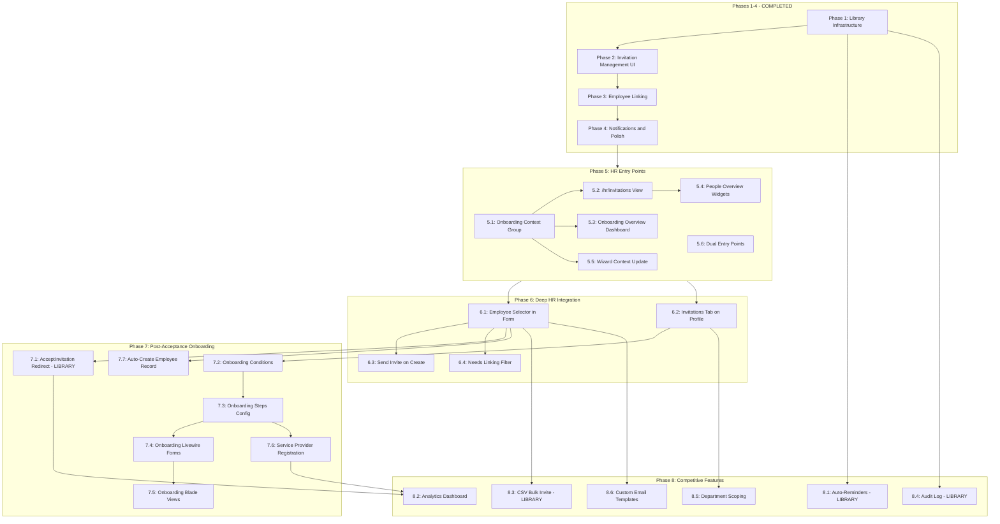

# Invitation & Onboarding — Consolidated Implementation Roadmap

> **Date**: 2026-09-09
> **Status**: Consolidated Planning Document
> **Sources Synthesized**:
> - [`invitation-employee-registration-analysis.md`](invitation-employee-registration-analysis.md) — Original 4-phase library implementation (COMPLETE) + bug fixes + deferred items
> - [`hr-invitation-integration-strategy.md`](hr-invitation-integration-strategy.md) — HR-side integration: employee selector, profile tab, self-onboarding, competitive features
> - [`hr-invitation-entry-points-analysis.md`](hr-invitation-entry-points-analysis.md) — Sidebar link + dashboard action card
> - [`hr-onboarding-context-group-analysis.md`](hr-onboarding-context-group-analysis.md) — Onboarding context group with 3 items

---

## Table of Contents

1. [§1 — What's Already Done (Library Infrastructure)](#1--whats-already-done-library-infrastructure)
2. [§2 — What's Already Done (Consuming App)](#2--whats-already-done-consuming-app)
3. [§3 — Consolidated Implementation Phases](#3--consolidated-implementation-phases)
   - [Phase 5: HR Entry Points](#phase-5-hr-entry-points)
   - [Phase 6: Deep HR Integration](#phase-6-deep-hr-integration)
   - [Phase 7: Post-Acceptance Onboarding](#phase-7-post-acceptance-onboarding)
   - [Phase 8: Competitive Features](#phase-8-competitive-features)
4. [§4 — Dependency Graph](#4--dependency-graph)
5. [§5 — Library vs Consuming-App Boundary Summary](#5--library-vs-consuming-app-boundary-summary)
6. [§6 — Immediate Next Action](#6--immediate-next-action)

---

## §1 — What's Already Done (Library Infrastructure)

All work from the original 4-phase plan ([`invitation-employee-registration-analysis.md`](invitation-employee-registration-analysis.md) §7-8) is complete. The library provides a fully functional, domain-agnostic invitation engine.

| # | Capability | Implementation | Location |
|---|---|---|---|
| 1 | Invitation model + migration | `Invitation` with polymorphic `invitable`, status lifecycle (pending/accepted/expired/revoked) | [`src/Models/Invitation.php`](src/Models/Invitation.php), [`Database/Migrations/2026_09_08_000000_create_invitations_table.php`](Database/Migrations/2026_09_08_000000_create_invitations_table.php) |
| 2 | Token generation + signed URLs | `InvitationService::create()` generates 64-char random token | [`src/Services/Invitations/InvitationService.php:23`](src/Services/Invitations/InvitationService.php:23) |
| 3 | Email dispatch | `InvitationMail` mailable, queued, branded HTML | [`src/Mail/InvitationMail.php`](src/Mail/InvitationMail.php) |
| 4 | Accept flow | `AcceptInvitation` Livewire component, public route, auto-login | [`src/Http/Livewire/Invitations/AcceptInvitation.php`](src/Http/Livewire/Invitations/AcceptInvitation.php) |
| 5 | Role assignment at accept | Resolves numeric role ID → name, calls `assignRole()` | [`src/Services/Invitations/InvitationService.php:70-81`](src/Services/Invitations/InvitationService.php:70) |
| 6 | Bulk invite (paste-emails) | `BulkInvite` component, one-email-per-line | [`src/Http/Livewire/Invitations/BulkInvite.php`](src/Http/Livewire/Invitations/BulkInvite.php) |
| 7 | Expiration | `ExpireInvitations` scheduled command, 7-day default | [`src/Console/Commands/ExpireInvitations.php`](src/Console/Commands/ExpireInvitations.php) |
| 8 | Events | `InvitationSent`, `InvitationAccepted`, `InvitationExpired`, `InvitationRevoked` | [`src/Events/Invitations/`](src/Events/Invitations/) |
| 9 | DataTable UI | `InvitationDataTable` with row actions (resend, revoke, copy link) | [`src/Http/Livewire/DataTables/InvitationDataTable.php`](src/Http/Livewire/DataTables/InvitationDataTable.php) |
| 10 | Config | `ui-library.invitations.expiration_days` = 7 | [`src/Config/ui-library.php:926-930`](src/Config/ui-library.php:926) |
| 11 | `Invitable` contract | Polymorphic linking interface | [`src/Contracts/Invitations/Invitable.php`](src/Contracts/Invitations/Invitable.php) |
| 12 | `invited` status lifecycle | User model status transitions: invited → active (accept), invited → inactive (expire/revoke) | [`src/Core/Admin/Data/user.php:39`](src/Core/Admin/Data/user.php:39) |
| 13 | Admin invitation view | Functional DataTable replacing placeholder | [`src/Core/Admin/Resources/views/admin/invitations.blade.php`](src/Core/Admin/Resources/views/admin/invitations.blade.php) |
| 14 | System invitation view | Read-only audit view | [`src/Core/System/Resources/views/system/invitations.blade.php`](src/Core/System/Resources/views/system/invitations.blade.php) |
| 15 | Dashboard quick action | Fixed: now opens `admin.invitation` form instead of `admin.user` | [`src/Core/Admin/Data/dashboard.php:218`](src/Core/Admin/Data/dashboard.php:218) |
| 16 | Pending invitations stat | Stat widget on Users Overview dashboard | [`src/Core/Admin/Data/dashboards/dashboard_users_overview.php:60`](src/Core/Admin/Data/dashboards/dashboard_users_overview.php:60) |

**Bug fixes applied** (11 total): Token column length, role ID→name resolution, `email_verified_at` on new users, expired token handling, listener token generation, config key alignment, system view read-only mode, event listener pattern, email match field, permission auto-discovery. See [`invitation-employee-registration-analysis.md` §7.4](invitation-employee-registration-analysis.md#74-post-implementation-bug-fixes) for full details.

**Deferred from original plan**:
- Bulk CSV upload with column mapping (paste-emails mode is implemented; CSV file import deferred to Phase 8)
- Manual employee linking UI (auto-linking covers common case; deferred to Phase 6)
- "Needs Linking" filter (deferred to Phase 6)

---

## §2 — What's Already Done (Consuming App)

The consuming app (HR module) has the foundational integration layer in place.

| # | Capability | Implementation | Location |
|---|---|---|---|
| 1 | Employee implements `Invitable` | `getInvitableType()` returns `'employee'` | `app/Modules/Hr/Models/Employee.php` |
| 2 | `HrInvitationService` | Wraps library service; adds `createWithEmployeeLink()`, `linkOnAccept()`, `matchByEmail()` | `app/Modules/Hr/Services/HrInvitationService.php` |
| 3 | `LinkInvitationToEmployee` listener | Listens for `DataTableRecordSaved` on `Invitation` model with `accepted` status; performs pre-link → email match → manual flag logic | `app/Modules/Hr/Listeners/LinkInvitationToEmployee.php` |
| 4 | Notification templates | `invitation_accepted`, `invitation_expired`, `invitation_revoked`, `bulk_invitation_completed` registered | `app/Modules/Admin/Data/notifications.php` |
| 5 | Notification template seeder | Seeds invitation notification templates | `app/Modules/Admin/Database/Seeders/InvitationNotificationTemplateSeeder.php` |
| 6 | Invitation permissions | `view_invitation`, `create_invitation`, `resend_invitation`, `revoke_invitation` | `app/Modules/Admin/Config/permissions.php` |
| 7 | Invitation DataTable config | Columns, form fields, filters, row actions | `app/Modules/Admin/Data/invitation.php` |

**Current gap**: The HR module has the backend integration but **no HR-side UI entry points**. HR admins must navigate to the Admin module (`/admin/invitations`) to manage invitations — a disconnected experience. There is no employee selector in the invitation form, no invitations tab on employee profiles, and no post-acceptance onboarding flow.

---

## §3 — Consolidated Implementation Phases

### Phase 5: HR Entry Points

**Goal**: Give HR admins contextual access to invitations and onboarding from within the HR module. Create the "Onboarding" context group as a dedicated home for pre-employment workflows.

**Scope**: Consuming app only. No library changes required.

**Dependencies**: None (builds on completed Phases 1–4).

#### Task 5.1 — Create "Onboarding" Context Group in HR Navigation

| # | Task | File | Description |
|---|---|---|---|
| 5.1a | Add `onboarding` context group definition | `app/Modules/Hr/Config/navigation.php` | New group at order 500 (between My Portal at 1 and People at 999). Label: "Onboarding", icon: `fa-user-check`, landing URL: `hr/dashboard-onboarding-overview`, permission: `view_onboarding_overview`, roles: `['*']` |
| 5.1b | Add 3 sidebar items to `onboarding` contexts array | `app/Modules/Hr/Config/navigation.php` | (1) Overview → `/hr/dashboard-onboarding-overview` (order 1), (2) Onboarding Wizard → `/hr/employee-onboarding` (order 2), (3) Invitations → `/hr/invitations` (order 3) |
| 5.1c | Add `view_onboarding_overview` permission | `app/Modules/Hr/Config/permissions.php` | New permission for the onboarding overview dashboard gate |

**Result**: HR top-nav gains a 6th context group. The Onboarding group sits between My Portal (employee self-service) and People (employee management), reflecting the natural workflow: onboard → manage.

#### Task 5.2 — Create `/hr/invitations` View

| # | Task | File | Description |
|---|---|---|---|
| 5.2a | Add `GET /hr/invitations` route | `app/Modules/Hr/Routes/web.php` | Named route pointing to the HR invitation blade view |
| 5.2b | Create HR invitation blade view | `app/Modules/Hr/Resources/views/invitations/index.blade.php` | Thin wrapper: `<x-qf::navigation-layout configKey="admin.invitation" context="onboarding" moduleName="hr">` containing `<livewire:qf.invitation-data-table configKey="admin.invitation" />` and `<livewire:qf.bulk-invite />`. Reuses the library's `InvitationDataTable` and `BulkInvite` components directly — no new Livewire components needed. |

**Result**: HR admins can manage invitations from `/hr/invitations` within the HR layout, reusing all existing library DataTable functionality (filters, row actions, bulk invite).

#### Task 5.3 — Create `/hr/onboarding-overview` Dashboard

| # | Task | File | Description |
|---|---|---|---|
| 5.3a | Add `GET /hr/dashboard-onboarding-overview` route | `app/Modules/Hr/Routes/web.php` | Named route for the onboarding overview dashboard |
| 5.3b | Create onboarding overview dashboard config | `app/Modules/Hr/Data/dashboards/onboarding_overview.php` | Widget-based dashboard with: pending invitations stat, recent hires list, onboarding completion rate metric, unlinked employees count, invitation funnel chart |
| 5.3c | Create onboarding overview blade view | `app/Modules/Hr/Resources/views/dashboard-onboarding-overview.blade.php` | Renders the widget-based dashboard using the library's dashboard system |

**Result**: HR has a single-pane-of-glass view of the entire hire→invite→onboard pipeline.

#### Task 5.4 — Add Dashboard Widgets to People Overview

| # | Task | File | Description |
|---|---|---|---|
| 5.4a | Add "Pending Invitations" stat widget | `app/Modules/Hr/Data/dashboards/people_overview.php` | `stat` widget: model = `QuickerFaster\UILibrary\Models\Invitation`, aggregate = `count`, conditions = `[['status', '=', 'pending']]`, width = 3, link = `/hr/invitations?status=pending` |
| 5.4b | Add "Send Invitation" action card | `app/Modules/Hr/Data/dashboards/people_overview.php` | `action_card` widget: title = "Send Invitation", description = "Invite a new user to the platform", opens drawer with `qf.data-table-form` using `configKey: 'admin.invitation'`, width = 3 |

**Result**: HR admins landing on the People Overview dashboard see pending invitation count (with click-through to filtered list) and a one-click "Send Invitation" action. This mirrors the admin dashboard pattern.

#### Task 5.5 — Update Wizard Blade View Context

| # | Task | File | Description |
|---|---|---|---|
| 5.5a | Change wizard context from `people` to `onboarding` | `app/Modules/Hr/Resources/views/employee-onboarding.blade.php` | Update `context="people"` to `context="onboarding"` so the sidebar highlights the Onboarding group when the wizard is accessed from the sidebar. The wizard disables the context menu anyway, so this has no visible effect when accessed from the addButton dropdown. |

#### Task 5.6 — Keep Wizard in addButton Dropdown (Dual Entry)

| # | Task | File | Description |
|---|---|---|---|
| 5.6a | Verify addButton config is unchanged | `app/Modules/Hr/Data/employee.php` | The existing `addButton` dropdown with "Add Employee" (quick_add) and "Onboard New Hire (Guided)" (wizard) remains as-is. No changes needed — this provides dual entry points: sidebar for planned onboarding sessions, addButton for contextual "I need to add someone" moments. |

**Phase 5 Deliverables**: 1 new context group, 2 new routes, 2 new blade views, 1 new dashboard config, 2 dashboard widget additions, 1 blade view context change, 1 new permission. **Zero library changes.**

---

### Phase 6: Deep HR Integration

**Goal**: Connect the invitation system deeply into HR workflows — employee selector in invitation form, invitations tab on employee profiles, send-invite on employee creation, and "Needs Linking" filter.

**Scope**: Consuming app only. No library changes required (the library's `InvitationService::create()` already accepts an `$invitable` parameter).

**Dependencies**: Phase 5 (HR entry points should be in place so the deep integration has a navigation home).

#### Task 6.1 — Employee Searchable Selector in Invitation Form

| # | Task | File | Description |
|---|---|---|---|
| 6.1a | Add `searchable_select` field for employee to invitation form config | `app/Modules/Admin/Data/invitation.php` | Field key: `invitable_id`, label: "Link to Employee (optional)", source: Employee model search (name + position). Sets `invitable_type = 'employee'` and `invitable_id` = selected employee ID. |
| 6.1b | Create `EmployeeSearchableSelect` Livewire component (if needed) | `app/Modules/Hr/Http/Livewire/EmployeeSearchableSelect.php` | Reusable searchable dropdown for Employee model. May leverage existing library searchable select infrastructure. |

**Result**: When creating an invitation, HR can search for and select an existing employee. This pre-links the invitation via the `invitable` polymorphic relation, ensuring deterministic linking on acceptance. The library's `InvitationService::create()` already handles the `$invitable` parameter — no library changes needed.

#### Task 6.2 — Invitations Tab on Employee Profile/Detail Page

| # | Task | File | Description |
|---|---|---|---|
| 6.2a | Create `EmployeeInvitationPanel` Livewire component | `app/Modules/Hr/Http/Livewire/EmployeeInvitationPanel.php` | Queries invitations where `invitable_type = 'employee'` AND `invitable_id = $employeeId`. Shows status badge, sent date, expiration. "Send Invitation" button if no user linked. "Resend" button if pending invitation exists. Uses library's `InvitationService` for resend/revoke actions. |
| 6.2b | Add "Invitations" tab to employee detail config | `app/Modules/Hr/Data/employee.php` | New tab definition pointing to `EmployeeInvitationPanel` Livewire component |

**Result**: When viewing an employee record, HR can see invitation status and take action (send, resend) directly from the employee context. This is the Gusto pattern: navigate to employee → see onboarding status → act.

#### Task 6.3 — "Send Invitation" Checkbox on Employee Creation Form

| # | Task | File | Description |
|---|---|---|---|
| 6.3a | Add "Send invitation after creating employee" checkbox to employee form config | `app/Modules/Hr/Data/employee.php` | New form field: `send_invitation` (boolean, default: false). When checked, auto-fills invitation email from employee's email and pre-links the invitation. |
| 6.3b | Create listener for employee creation → auto-send invitation | `app/Modules/Hr/Listeners/AutoSendInvitationOnEmployeeCreate.php` | Listens for `DataTableRecordSaved` on `Employee` model. If `send_invitation` was checked, calls `HrInvitationService::createWithEmployeeLink()`. |

**Result**: HR can create an employee and send their invitation in one step, eliminating the need to navigate to the invitations page after creating an employee.

#### Task 6.4 — "Needs Linking" Filter on Invitation DataTable

| # | Task | File | Description |
|---|---|---|---|
| 6.4a | Add "Needs Linking" filter to invitation DataTable config | `app/Modules/Admin/Data/invitation.php` | Filter for invitations where `invitable_type` is null and status is `accepted` — these are users who accepted but couldn't be auto-linked. |
| 6.4b | Create manual link resolution UI | `app/Modules/Admin/Http/Livewire/InvitationDetail.php` | Detail view with "Link to Employee" searchable select for unresolved invitations. Allows HR to manually link an accepted invitation to an employee record. |

**Result**: HR can quickly find and resolve invitations that couldn't be auto-linked, preventing orphaned user accounts.

**Phase 6 Deliverables**: 1 form config extension, 2–3 new Livewire components, 1 employee detail tab, 1 form checkbox, 1 event listener, 1 DataTable filter. **Zero library changes.**

---

### Phase 7: Post-Acceptance Onboarding

**Goal**: Guide newly accepted users through a structured employee onboarding flow using Spatie Onboard. This is the Gusto-style employee self-onboarding pattern: after accepting an invitation, the employee completes their own profile, personal details, emergency contacts, bank details, and documents.

**Scope**: Library (1 change to `AcceptInvitation` redirect) + Consuming App (onboarding steps, conditions, forms, views).

**Dependencies**: Phase 6 (employee selector + profile tab should be in place so the onboarding flow has employee records to work with).

#### Task 7.1 — Update AcceptInvitation Redirect Logic (Library)

| # | Task | File | Description |
|---|---|---|---|
| 7.1a | Modify post-acceptance redirect to check onboarding status | [`src/Http/Livewire/Invitations/AcceptInvitation.php`](src/Http/Livewire/Invitations/AcceptInvitation.php:84-90) | After successful acceptance and login, check if the user has incomplete Spatie Onboard steps. If yes, redirect to the first incomplete step. If no, redirect to `config('ui-library.home_route')`. |

**Result**: Newly accepted users are immediately guided into the onboarding flow rather than dropped on a dashboard with no context.

#### Task 7.2 — Create HR Onboarding Condition Classes

| # | Task | File | Description |
|---|---|---|---|
| 7.2a | `HasEmployeeRecord` condition | `app/Modules/Hr/Conditions/Onboarding/HasEmployeeRecord.php` | Implements `OnboardingCondition`. `__invoke($user)`: returns `true` if `Employee::where('user_id', $user->id)->exists()`. |
| 7.2b | `PersonalDetailsComplete` condition | `app/Modules/Hr/Conditions/Onboarding/PersonalDetailsComplete.php` | Implements `OnboardingCondition`. `__invoke($user)`: returns `true` if `$user->phone` and `$user->address` are filled. |
| 7.2c | `EmergencyContactsComplete` condition | `app/Modules/Hr/Conditions/Onboarding/EmergencyContactsComplete.php` | Implements `OnboardingCondition`. `__invoke($user)`: returns `true` if the employee has at least one emergency contact. |
| 7.2d | `BankDetailsComplete` condition | `app/Modules/Hr/Conditions/Onboarding/BankDetailsComplete.php` | Implements `OnboardingCondition`. `__invoke($user)`: returns `true` if the employee has bank details. |
| 7.2e | `DocumentsUploaded` condition | `app/Modules/Hr/Conditions/Onboarding/DocumentsUploaded.php` | Implements `OnboardingCondition`. `__invoke($user)`: returns `true` if the employee has uploaded required documents. |
| 7.2f | `NotificationPreferencesSet` condition | `app/Modules/Hr/Conditions/Onboarding/NotificationPreferencesSet.php` | Implements `OnboardingCondition`. `__invoke($user)`: returns `true` if the user has notification preferences configured. |

#### Task 7.3 — Publish HR Onboarding Steps Config

| # | Task | File | Description |
|---|---|---|---|
| 7.3a | Create HR onboarding steps config | `app/Modules/Hr/Config/onboarding.php` | Returns `['steps' => [...]]` array with 6 steps (see step design below). Each step has `title`, `link`, `cta`, `condition` (FQCN of condition class). |

**Step Design**:

| Step | Title | Link | CTA | Condition | Key Fields |
|---|---|---|---|---|---|
| 1a | "Complete Your Employee Profile" | `/my-portal/profile/create` | "Fill Profile" | `HasEmployeeRecord` (inverted) | Job title, department, manager, start date, employment type. Auto-fill email/name from user account. |
| 1b | "Confirm Your Information" | `/my-portal/profile/confirm` | "Review Details" | `HasEmployeeRecord` + `profile_confirmed = false` | Read-only display of pre-linked employee record; "Is this correct?" confirmation. |
| 2 | "Add Your Personal Details" | `/my-portal/personal-details` | "Add Details" | `PersonalDetailsComplete` | Phone, home address, date of birth, gender (optional). |
| 3 | "Add Emergency Contacts" | `/my-portal/emergency-contacts` | "Add Contacts" | `EmergencyContactsComplete` | Name, relationship, phone, email (at least one required). |
| 4 | "Set Up Payment Details" | `/my-portal/bank-details` | "Add Bank Account" | `BankDetailsComplete` | Bank name, account number, sort code/routing number, account type. |
| 5 | "Upload Required Documents" | `/my-portal/documents` | "Upload Documents" | `DocumentsUploaded` | ID document, certificates, visa/work permit (configurable per company). |
| 6 | "Set Your Notification Preferences" | `/my-portal/notifications` | "Configure" | `NotificationPreferencesSet` | Email, push, in-app toggles per notification type. |

**Note**: Step 1a and 1b are mutually exclusive — 1a shows if no employee record exists (self-registration scenario), 1b shows if a pre-linked employee record exists (pre-hire scenario).

#### Task 7.4 — Create Employee Self-Onboarding Livewire Forms

| # | Task | File | Description |
|---|---|---|---|
| 7.4a | `CreateEmployeeProfile` form | `app/Modules/Hr/Http/Livewire/Onboarding/CreateEmployeeProfile.php` | Form for Step 1a: creates Employee record linked to the authenticated user. Auto-fills email and name from user account. |
| 7.4b | `ConfirmEmployeeDetails` form | `app/Modules/Hr/Http/Livewire/Onboarding/ConfirmEmployeeDetails.php` | Form for Step 1b: displays pre-linked employee data, confirmation checkbox. |
| 7.4c | `PersonalDetailsForm` | `app/Modules/Hr/Http/Livewire/Onboarding/PersonalDetailsForm.php` | Form for Step 2: updates user phone, address, date of birth. |
| 7.4d | `EmergencyContactsForm` | `app/Modules/Hr/Http/Livewire/Onboarding/EmergencyContactsForm.php` | Form for Step 3: CRUD for emergency contacts. |
| 7.4e | `BankDetailsForm` | `app/Modules/Hr/Http/Livewire/Onboarding/BankDetailsForm.php` | Form for Step 4: bank account details entry. |
| 7.4f | `DocumentUploadForm` | `app/Modules/Hr/Http/Livewire/Onboarding/DocumentUploadForm.php` | Form for Step 5: document upload with required document types. |
| 7.4g | `NotificationPreferencesForm` | `app/Modules/Hr/Http/Livewire/Onboarding/NotificationPreferencesForm.php` | Form for Step 6: notification channel toggles. |

#### Task 7.5 — Create Employee Self-Onboarding Blade Views

| # | Task | File | Description |
|---|---|---|---|
| 7.5a | Create onboarding view directory | `app/Modules/Hr/Resources/views/onboarding/` | Directory for onboarding step blade views |
| 7.5b | Create blade view per step | `app/Modules/Hr/Resources/views/onboarding/*.blade.php` | One view per onboarding step, each rendering its corresponding Livewire form within the my-portal layout |

#### Task 7.6 — Register HR Onboarding Steps in Service Provider

| # | Task | File | Description |
|---|---|---|---|
| 7.6a | Merge HR onboarding steps into library's `app_onboarding.steps` | `app/Modules/Hr/Providers/HrServiceProvider.php` | In `boot()`: merge `config('app_onboarding.steps')` with HR module's `onboarding.php` steps config. The library's `ModuleServiceProvider::registerOnboardingConfig()` already reads from this config. |

#### Task 7.7 — Employee Record Auto-Creation During Onboarding

| # | Task | File | Description |
|---|---|---|---|
| 7.7a | Auto-create employee record if not pre-linked | `app/Modules/Hr/Services/HrInvitationService.php` | Extend `linkOnAccept()`: if no employee record exists after pre-link and email-match attempts, create a new Employee record with `work_email = invitation.email` and `user_id = user.id`. This handles the self-registration scenario where the invitation creates the employee record. |

**Phase 7 Deliverables**: 1 library change (redirect logic), 6 condition classes, 1 onboarding config, 7 Livewire forms, 7+ blade views, 1 service provider update, 1 service method extension.

---

### Phase 8: Competitive Features

**Goal**: Add features that differentiate the platform from Gusto and Rippling — auto-reminders, analytics, CSV bulk invite, audit log, department scoping, and custom email templates.

**Scope**: Library (auto-reminders, CSV bulk invite, audit log) + Consuming App (analytics dashboard, department scoping, custom templates).

**Dependencies**: Phase 7 (onboarding should be in place before analytics can track full funnel). Individual Phase 8 features can be parallelized.

#### Task 8.1 — Auto-Reminders for Pending Invitations (Library)

| # | Task | File | Description |
|---|---|---|---|
| 8.1a | Add reminder config | [`src/Config/ui-library.php`](src/Config/ui-library.php) | `invitations.reminders.enabled` (default: true), `invitations.reminders.first_reminder_days` (default: 3), `invitations.reminders.second_reminder_days` (default: 6), `invitations.reminders.max_reminders` (default: 2) |
| 8.1b | Create `SendInvitationReminders` scheduled command | `src/Console/Commands/SendInvitationReminders.php` | Queries pending invitations where `days_since_created` matches reminder schedule and `reminder_count < max_reminders`. Sends reminder email (lighter version of `InvitationMail`). Increments `reminder_count` in invitation metadata. |
| 8.1c | Create reminder email template | `src/Resources/views/mail/invitation-reminder.blade.php` | Lighter version of invitation email: "Reminder: You've been invited to join [Company]" with accept button and expiration notice. |
| 8.1d | Register command in kernel | [`src/Console/Kernel.php`](src/Console/Kernel.php) | Schedule `invitations:send-reminders` to run daily |

**Result**: Pending invitations get automatic follow-up emails, reducing the "invitation limbo" problem. This is a differentiator — Gusto and Rippling don't offer auto-reminders.

#### Task 8.2 — Invitation Analytics Dashboard (Consuming App)

| # | Task | File | Description |
|---|---|---|---|
| 8.2a | Create `InvitationAnalytics` Livewire component | `app/Modules/Admin/Http/Livewire/InvitationAnalytics.php` | Metrics: sent→accepted→linked funnel, average/median time-to-accept, pending aging (approaching expiration), acceptance rate (30-day rolling), breakdown by department/role |
| 8.2b | Create analytics dashboard config | `app/Modules/Admin/Data/dashboards/invitation_analytics.php` | Widget-based dashboard using chart widgets (funnel, trend) and stat widgets (rates, averages) |
| 8.2c | Add analytics route + navigation item | `app/Modules/Admin/Routes/web.php`, `app/Modules/Admin/Config/navigation.php` | Route: `GET /admin/invitations/analytics`. Navigation: "Analytics" item under Users context group or as a sub-item of Invitations. |

**Result**: HR and admins gain visibility into onboarding bottlenecks. This is a differentiator — neither Gusto nor Rippling expose invitation analytics prominently.

#### Task 8.3 — CSV Bulk Invite with Column Mapping (Library)

| # | Task | File | Description |
|---|---|---|---|
| 8.3a | Extend `BulkInvite` with CSV upload mode | [`src/Http/Livewire/Invitations/BulkInvite.php`](src/Http/Livewire/Invitations/BulkInvite.php) | Add CSV file upload tab alongside existing paste-emails tab. Parse CSV, auto-detect columns (email, role, employee_id, message). |
| 8.3b | Add CSV parsing + preview logic | `src/Services/Invitations/CsvInvitationParser.php` | Parse CSV file, validate rows, return preview data with validation errors highlighted. |
| 8.3c | Add column mapping UI | [`src/Http/Livewire/Invitations/BulkInvite.php`](src/Http/Livewire/Invitations/BulkInvite.php) | Rippling-style: if CSV headers don't match expected columns, show dropdown mapping UI for non-standard headers. |
| 8.3d | Add preview table before send | [`src/Http/Livewire/Invitations/BulkInvite.php`](src/Http/Livewire/Invitations/BulkInvite.php) | After CSV upload, show preview table with validation status per row. Allow deselecting invalid rows before sending. |

**Result**: HR can bulk-invite employees from CSV files (HRIS migration, new hire batches) with per-row role and employee assignment.

#### Task 8.4 — Invitation Audit Log (Library)

| # | Task | File | Description |
|---|---|---|---|
| 8.4a | Register invitation events with `ActivityLogger` | [`src/Services/Invitations/InvitationService.php`](src/Services/Invitations/InvitationService.php) | Log every state change: created, sent, accepted, expired, revoked, resent. Record: actor, timestamp, IP address (for accept). |
| 8.4b | Create invitation audit log view (consuming app) | `app/Modules/Admin/Http/Livewire/InvitationAuditLog.php` | Read-only DataTable showing all invitation state changes with filters (by invitation, by actor, by action, by date range). Accessible from invitation detail view and as a global audit report. |

**Result**: Complete audit trail for compliance and troubleshooting. Leverages the library's existing [`ActivityLogger`](src/Services/ActivityLogger.php).

#### Task 8.5 — Department/Team-Scoped Invitation Management (Consuming App)

| # | Task | File | Description |
|---|---|---|---|
| 8.5a | Add department scope to `InvitationDataTable` | `app/Modules/Admin/Http/Livewire/InvitationDataTable.php` (override) | Extend the library's DataTable to filter invitations by the current user's department scope. HR Manager — Engineering sees only engineering invitations. |
| 8.5b | Create department-scoped invitation policy | `app/Modules/Hr/Policies/InvitationPolicy.php` | Policy gates: `viewAny` (scoped to department), `create` (within department), `resend`, `revoke`. |
| 8.5c | Add department filter to invitation DataTable config | `app/Modules/Admin/Data/invitation.php` | Optional department filter dropdown (visible only to users with multi-department scope). |

**Result**: HR managers can only view and manage invitations within their department, enabling distributed HR operations in large organizations.

#### Task 8.6 — Custom Email Templates per Department/Role (Consuming App)

| # | Task | File | Description |
|---|---|---|---|
| 8.6a | Extend `InvitationMail` to resolve template by role/department | `app/Modules/Admin/Mail/DepartmentInvitationMail.php` (extends library `InvitationMail`) | Override template resolution: check for department-specific or role-specific template first, fall back to default. |
| 8.6b | Create template management UI | `app/Modules/Admin/Http/Livewire/InvitationTemplateManager.php` | Admin interface to create/edit invitation email templates per department or role. |
| 8.6c | Add template config | `app/Modules/Admin/Data/invitation_templates.php` | Config mapping departments/roles to custom email template blades. |

**Result**: Engineering invites can emphasize tech stack and tools; Sales invites can emphasize commission structure and CRM access. Different messaging for different audiences.

**Phase 8 Deliverables**: 3 library changes (reminders, CSV bulk, audit log), 6+ consuming-app components (analytics, audit view, dept scoping, templates).

---

## §4 — Dependency Graph



### Parallelization Opportunities

| Can Be Parallelized | Rationale |
|---|---|
| **Phase 5 tasks 5.2, 5.3, 5.4** | After 5.1 (context group) is done, the view, dashboard, and widgets can be built independently |
| **Phase 6 tasks 6.1 and 6.2** | Employee selector and profile tab touch different files and have no mutual dependency |
| **Phase 7 tasks 7.2–7.5** | After 7.1 (library redirect) and 7.3 (config), conditions, forms, and views can be built in parallel |
| **Phase 8 tasks 8.1, 8.3, 8.4** | All three library tasks are independent of each other |
| **Phase 8 tasks 8.2, 8.5, 8.6** | All three consuming-app tasks are independent of each other (after Phase 7 is done) |

### Critical Path

```
Phase 5 → Phase 6 (Task 6.1) → Phase 7 (Task 7.1) → Phase 8 (Task 8.2)
```

The employee selector (6.1) is the key dependency — it unlocks the onboarding redirect logic (7.1), which unlocks analytics (8.2).

---

## §5 — Library vs Consuming-App Boundary Summary

| Phase | Library (`src/`) | Consuming App (`app/Modules/`) |
|---|---|---|
| **Phase 5: HR Entry Points** | *(none)* | Onboarding context group + 3 sidebar items, `/hr/invitations` route + blade view, `/hr/dashboard-onboarding-overview` route + dashboard config + blade view, "Pending Invitations" stat + "Send Invitation" action card on People Overview, wizard context update, `view_onboarding_overview` permission |
| **Phase 6: Deep HR Integration** | *(none)* | `searchable_select` field in invitation form config, `EmployeeSearchableSelect` component, `EmployeeInvitationPanel` component, "Invitations" tab on employee detail, "Send Invitation" checkbox on employee create form, `AutoSendInvitationOnEmployeeCreate` listener, "Needs Linking" filter, `InvitationDetail` manual link UI |
| **Phase 7: Post-Acceptance Onboarding** | `AcceptInvitation` redirect logic — check Spatie Onboard status, redirect to first incomplete step if any | 6 `OnboardingCondition` classes, `onboarding.php` steps config, 7 Livewire onboarding form components, 7+ onboarding blade views, `HrServiceProvider` registration, `HrInvitationService::linkOnAccept()` auto-create extension |
| **Phase 8: Competitive Features** | Reminder config + `SendInvitationReminders` command + reminder email template, `BulkInvite` CSV upload + column mapping + `CsvInvitationParser`, `ActivityLogger` integration for invitation events | `InvitationAnalytics` component + dashboard config + route + nav item, `InvitationAuditLog` view, department-scoped `InvitationDataTable` override + `InvitationPolicy`, `DepartmentInvitationMail` + `InvitationTemplateManager` + template config |

### Boundary Principles (Reaffirmed)

1. **Library owns mechanisms**: Token generation, email delivery, status lifecycle, expiration, reminders, CSV parsing, audit logging — anything that passes the two-domain test.
2. **Consuming app owns domain**: Employee selection, employee profile tabs, HR onboarding steps, department scoping, role-specific templates — anything that references HR domain concepts.
3. **Config is the bridge**: The library provides config keys (`ui-library.invitations.*`); the consuming app sets values. The library provides contracts (`Invitable`, `OnboardingCondition`); the consuming app implements them.
4. **No library references to `App\Modules\*`**: All library code must pass the grep gate: zero references to consuming-app namespaces.

---

## §6 — Immediate Next Action

**Implement Phase 5, Task 5.1: Create the "Onboarding" Context Group in HR Navigation.**

This is the foundational task that unlocks all subsequent HR entry point work. It requires:

1. **Add `onboarding` context group definition** to [`app/Modules/Hr/Config/navigation.php`](/Users/mac/Projects/LaravelProjects/hr-consuming-app/app/Modules/Hr/Config/navigation.php):
   ```php
   'onboarding' => [
       'label' => 'Onboarding',
       'icon' => 'fas fa-user-check',
       'order' => 500,
       'route' => NULL,
       'url' => 'hr/dashboard-onboarding-overview',
       'permission' => 'view_onboarding_overview',
       'roles' => ['*'],
   ],
   ```

2. **Add `onboarding` contexts array** with 3 items (Overview, Onboarding Wizard, Invitations) — see [`hr-onboarding-context-group-analysis.md` §5.2](hr-onboarding-context-group-analysis.md#52-recommended-item-list-and-order) for exact config.

3. **Add `view_onboarding_overview` permission** to `app/Modules/Hr/Config/permissions.php`.

**Files to modify**: 2 (`navigation.php`, `permissions.php`).
**Files to create**: 0 (subsequent tasks 5.2–5.6 create routes, views, and dashboard configs).
**Library changes**: 0.
**Estimated impact**: Unlocks the entire HR-side invitation and onboarding experience.

---

## Appendix: Competitive Positioning (Post-Roadmap)

```
                    Gusto    Rippling   This System (After Phase 8)
                    ─────    ────────   ───────────────────────────
Invite flow         ✅       ✅         ✅ (Phases 1-4 + Phase 6)
Bulk CSV            ✅       ✅         ✅ (Phase 8.3)
Self-onboarding     ✅       ✅         ✅ (Phase 7 — Spatie Onboard)
Role at invite      ✅       ✅         ✅ (Phase 1 — Already implemented)
Auto-reminders      ❌       ❌         ✅ (Phase 8.1 — Differentiator)
Analytics           ❌       ❌         ✅ (Phase 8.2 — Differentiator)
Audit log           ❌       ✅         ✅ (Phase 8.4)
Dept. scoping       ❌       ✅         ✅ (Phase 8.5)
Custom templates    ❌       ❌         ✅ (Phase 8.6)
HR contextual UI    ❌       ✅         ✅ (Phase 5 — Onboarding context group)
```

**Key differentiators**: Auto-reminders and invitation analytics are features that Gusto and Rippling do not prominently offer. The Onboarding context group provides a unified HR experience that neither competitor matches with a dedicated navigation group.