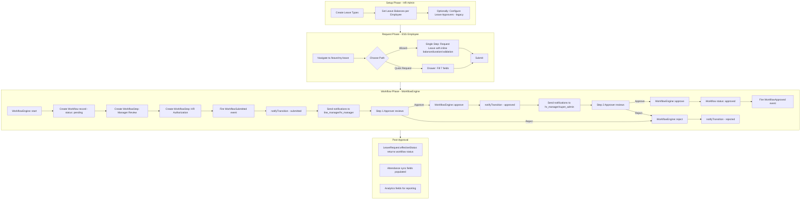

# Leave Module Workflow Analysis

## Overview

The Leave module orchestrates leave requests through four config-driven data tables and a WorkflowEngine-based approval pipeline. This document traces the complete lifecycle from setup through request, approval, and post-approval.

---

## 1. The Four Config Files

### 1.1 [`leave_type.php`](hr-consuming-app:app/Modules/Leave/Data/leave_type.php) — Leave Types

**Model**: `App\Modules\Leave\Models\LeaveType`

Defines the types of leave available (Annual Leave, Sick Leave, Maternity, etc.) with key behavioral flags:

| Field | Purpose |
|-------|---------|
| `name` / `code` | Display name and short code (e.g., "Annual Leave" / "AL") |
| `deducts_from_balance` | Whether this leave type consumes the employee's balance |
| `requires_approval` | Whether requests of this type go through the workflow approval pipeline |
| `max_days_per_request` | Hard cap on days per single request |
| `is_active` | Soft enable/disable |

**CRUD**: Drawers (`crudType: 'drawers'`), 3 field groups (Company, Basic Information, Leave Rules).

**Key relationship**: `hasMany leaveBalances` — each leave type has per-employee balances.

### 1.2 [`leave_balance.php`](hr-consuming-app:app/Modules/Leave/Data/leave_balance.php) — Leave Balances

**Model**: `App\Modules\Leave\Models\LeaveBalance`

Tracks per-employee, per-leave-type, per-year entitlement:

| Field | Purpose |
|-------|---------|
| `employee_id` | Which employee |
| `leave_type_id` | Which leave type |
| `balance` | Current remaining days (decimal) |
| `accrual_rate` | Days accrued per period |
| `accrual_frequency` | Monthly / Bi-weekly / Weekly / Daily / None |
| `year` | Calendar year this balance applies to |

**CRUD**: Modals (`crudType: 'modals'`), 3 field groups (Company, Balance Information, Accrual Settings).

**Badge colors** on balance: `0 → danger`, `1-5 → warning`, `5-10 → info`, `10+ → success`.

### 1.3 [`leave_approver.php`](hr-consuming-app:app/Modules/Leave/Data/leave_approver.php) — Leave Approvers (Legacy)

**Model**: `App\Modules\Leave\Models\LeaveApprover`

A **legacy approval system** that maps specific employees to specific approvers, independent of the WorkflowEngine:

| Field | Purpose |
|-------|---------|
| `employee_id` | The subordinate |
| `approver_id` | The manager who approves |
| `approval_level` | 1-3 (multi-level approval chain) |
| `can_approve_all_types` | Boolean — if false, restricted to `leave_type_ids` |
| `leave_type_ids` | Array of allowed leave type IDs |
| `max_approval_days` | Cap on days this approver can authorize |
| `is_active` | Soft enable/disable |

**CRUD**: Drawers, 3 field groups (Company, Approval Relationship, Approval Rules).

> **⚠️ Architectural Note**: This is a **parallel approval system** to the WorkflowEngine. The LeaveRequest model uses `HasWorkflow` (WorkflowEngine-based), NOT `LeaveApprover`. The `LeaveApprover` model appears to be a legacy/alternative system that may be unused or intended for non-workflow scenarios.

### 1.4 [`leave_request.php`](hr-consuming-app:app/Modules/Leave/Data/leave_request.php) — Leave Requests

**Model**: `App\Modules\Leave\Models\LeaveRequest`

The core entity. 22 field definitions across 5 field groups:

| Group | Fields | Visible to ESS |
|-------|--------|---------------|
| **Company** | `company_id` | Hidden (auto-set) |
| **Request Details** | `employee_id`, `leave_type_id`, `start_date`, `end_date`, `is_half_day`, `half_day_period`, `reason`, `attachments` | ✅ All 8 |
| **Approval Information** | `status`, `approved_by`, `approved_at`, `denial_reason` | ❌ Hidden on new form |
| **System Sync Status** | `attendance_synced`, `attendance_records_count`, `last_sync_at` | ❌ Hidden |
| **Absence Analytics** | `is_retroactive`, `reported_after_absence`, `workdays_count`, `overlap_with_holiday` | ❌ Hidden |

**Two add buttons** (line 275-290):
```php
'addButton' => [
    ['label' => 'Request Leave', 'type' => 'wizard', 'wizard' => 'employee_self_service', 'primary' => true],
    ['label' => 'Quick Request', 'type' => 'quick_add'],
],
```

**Wizard field annotations**: Eight fields are tagged with `'wizard' => ['employee_self_service' => true]`:
- `employee_id` (line 49-51)
- `leave_type_id` (line 74-76)
- `start_date` (line 85-87)
- `end_date` (line 96-98)
- `is_half_day` (line 100-112)
- `half_day_period` (line 113-125)
- `reason` (line 126-128)
- `attachments` (line 145-155) — file upload field (pdf/jpg/png, 5MB max)

These annotations tell the wizard which fields to render in the single-step form.

---

## 2. The LeaveRequest Model

[`LeaveRequest.php`](hr-consuming-app:app/Modules/Leave/Models/LeaveRequest.php) implements `Workflowable` and `Documentable`:

```php
class LeaveRequest extends Model implements Workflowable, Documentable
{
    use HasCompanyScope, HasFactory, HasWorkflow, SoftDeletes;
    
    public function getWorkflowDefinitionKey(): string
    {
        return 'leave_request';
    }
    
    public function getWorkflowContext(): array
    {
        return [
            'workspace_id'   => $this->company_id,
            'employee_id'    => $this->employee_id,
            'leave_type_id'  => $this->leave_type_id,
            'start_date'     => $this->start_date?->toDateString(),
            'end_date'       => $this->end_date?->toDateString(),
        ];
    }
    
    public function effectiveStatus(): string
    {
        if ($this->activeWorkflow) {
            return $this->activeWorkflow->status;
        }
        return $this->status;
    }
}
```

Key points:
- **`effectiveStatus()`** checks the active workflow first — if a workflow exists, its status (pending/approved/rejected) overrides the model's `status` field
- **`getWorkflowContext()`** passes `workspace_id` (company_id), employee, leave type, and date range to the workflow engine for routing decisions
- **`Documentable` interface**: Implements `getDocumentableId()`, `getDocumentType()` (`'leave_request'`), `getDocumentStoragePath()`, `getDocumentTemplateData()`. Has `documents()` morphMany relationship to `QuickerFaster\UILibrary\Models\Document`
- **`attachments` field**: File upload stored via `handleFileUploads()` in DataTableForm/WizardForm. On create, `LeaveRequestEventListener::handleCreated()` auto-creates a `Document` record linking the uploaded file
- **Default status**: `'Pending'`
- **Relations**: `employee()`, `leaveType()`, `approver()`, `attendanceRecords()`, `company()`, `documents()` (morphMany)

---

## 3. The Workflow Definition

[`Config/workflows.php`](hr-consuming-app:app/Modules/Leave/Config/workflows.php) defines a 2-step approval:

```php
'leave_request' => [
    'label'       => 'Leave Request Approval',
    'entity_type' => 'LeaveRequest',
    'initiators'  => ['employee', 'hr_manager', 'super_admin'],
    'steps' => [
        ['name' => 'Manager Review',     'step_type' => 'approval', 'approval_mode' => 'any',
         'roles' => ['line_manager', 'hr_manager']],
        ['name' => 'HR Authorization',   'step_type' => 'approval', 'approval_mode' => 'any',
         'roles' => ['hr_manager', 'super_admin']],
    ],
    'notifications' => [
        'enabled' => true,
        'types' => [
            'submitted' => 'workflow_submitted',
            'approved'  => 'workflow_approved',
            'rejected'  => 'workflow_rejected',
            'recalled'  => 'workflow_recalled',
        ],
    ],
],
```

**Step flow**: Employee submits → Manager Review (any of line_manager/hr_manager) → HR Authorization (any of hr_manager/super_admin) → Approved.

**Initiators**: Employees, HR managers, and super admins can all submit leave requests.

---

## 4. The ESS Wizard

[`employee_self_service.php`](hr-consuming-app:app/Modules/Leave/Data/wizards/employee_self_service.php) defines a **single-step wizard** (merged from 2 steps as of 2026-09-02):

### Step 0 — "Request Leave" (Single Step)
- **Model**: `App\Modules\Leave\Models\LeaveRequest`
- **Field group**: `request_details` (employee_id, leave_type_id, start_date, end_date, is_half_day, half_day_period, reason, attachments)
- **Custom validation**: `checkLeaveBalance`, `checkDateConflicts`
- **Dynamic fields**:
  - `leave_type_id` → loads options from `getAvailableLeaveTypes` (shows balance per type: "Annual Leave (12 days)")
  - `start_date` → min date = today
  - `end_date` → min date = `field:start_date`
- **`isLinkSource: true`** — this step's data is the primary record
- **Attachments**: File upload field accepts pdf, jpg, jpeg, png up to 5MB. Stored via `handleFileUploads()` to `uploads/leave_request/`. On create, `LeaveRequestEventListener::handleCreated()` auto-creates a `Document` record via the polymorphic `documents()` relationship

### Inline UX Features (in wizard-form.blade.php)
- **Balance display**: Leave type dropdown shows "Annual Leave (12 days)" per option
- **Working days**: Real-time duration shown below end_date (supports half-day: 0.5 days)
- **Leave type info badges**: Requires Approval, Deducts from Balance, Max N days per request
- **Character count**: "N/1000" shown below reason textarea
- **Half-day support**: `is_half_day` boolradio + `half_day_period` select (AM/PM), shown conditionally
- **Real-time conflict detection**: When `start_date` or `end_date` changes, [`updatedFields()`](src/Http/Livewire/Wizards/WizardForm.php:588) triggers [`detectDateConflicts()`](src/Http/Livewire/Wizards/WizardForm.php:600) which queries for overlapping approved leave requests and displays a warning alert below the end_date field. The server-side [`checkDateConflicts()`](src/Http/Livewire/Wizards/WizardForm.php:552) still runs on submit as defense in depth.
- **Calendar-based date picker**: Flatpickr v4.6.6 with enhanced calendar overlay. Weekends are greyed out (`disableWeekends`), company holidays are marked with a red dot and tooltip (`highlightHolidays`), and team absences show with an amber dot and count tooltip (`showTeamAbsences`). Config-driven via [`DatepickerField.php:48-175`](src/Components/FieldTypes/DatepickerField.php:48) — `buildCalendarConfig()` resolves holidays from the [`Holiday`](hr-consuming-app:app/Modules/Holiday/Models/Holiday.php) model and team absences from approved [`LeaveRequest`](hr-consuming-app:app/Modules/Leave/Models/LeaveRequest.php) records. JS init in [`quicker-faster.js`](public/assets/js/quicker-faster.js) `initFlatpickr()`, styles in [`quicker-faster.css`](public/assets/css/quicker-faster.css).

### Draft Support (Added 2026-09-02)
- **Save Draft button**: Appears next to "Save & Continue" in the wizard. Saves the record with `status = 'Draft'` without triggering workflow.
- **Draft validation**: Relaxed — only non-required validation rules are checked; required fields are made nullable for partial saves.
- **Resume action**: Draft records show a "Resume" action in the My Leave data table's more actions dropdown. Clicking it opens the wizard with the draft record pre-filled.
- **Submit from draft**: When a resumed draft is submitted, `status` transitions from `'Draft'` to `'Pending'` and the workflow is auto-started.
- **Workflow skip**: Both [`WizardForm.php`](src/Http/Livewire/Wizards/WizardForm.php) and [`DataTableForm.php`](src/Http/Livewire/DataTables/DataTableForm.php) check for `status === 'Draft'` before auto-starting workflow.
- **Badge color**: Draft status shows as `info` (blue) badge in data tables and card views.

### Completion
- Title: "Leave Request Submitted!"
- Message: "Your leave request has been submitted for approval. You'll be notified when it's reviewed."
- Actions: View My Requests (`/hr/my-leaves`), Request Another (`/hr/leave-request`), Team Calendar (`/hr/team-calendar`)

### Link Fields
```php
'linkFields' => [
    'userField'     => 'employee_number',
    'databaseField' => 'employee_id',
],
```
This auto-links the authenticated user (by `employee_number`) to the `employee_id` field on the LeaveRequest.

### Models Reference
```php
'models' => [
    'primary' => 'App\\Modules\\Leave\\Models\\LeaveRequest',  // ✅ Fixed
],
```

---

## 5. Complete Lifecycle



---

## 6. Two Approval Systems Coexist

| Aspect | WorkflowEngine (New) | LeaveApprover (Legacy) |
|--------|---------------------|----------------------|
| **Config** | `Config/workflows.php` | `leave_approver` DB table |
| **Model** | `Workflow` + `WorkflowStep` | `LeaveApprover` |
| **Resolution** | Role-based (line_manager, hr_manager) | Employee-to-approver mapping |
| **Steps** | Configurable multi-step | Fixed 1-3 levels |
| **Scope** | Per workflow definition | Per employee + leave type |
| **Used by** | LeaveRequest (via `HasWorkflow`) | Unknown — may be unused |

The `LeaveApprover` model has no visible integration with the `LeaveRequest` model or the `WorkflowEngine`. It appears to be a legacy system that predates the WorkflowEngine. The `LeaveRequest` model exclusively uses `HasWorkflow`.

---

## 7. Identified Issues

| # | Severity | Location | Issue |
|---|----------|----------|-------|
| 1 | ✅ Fixed | [`employee_self_service.php:13`](hr-consuming-app:app/Modules/Hr/Data/wizards/employee_self_service.php:13) | Step 0 model was `App\Modules\Hr\Models\LeaveRequest` → fixed to `App\Modules\Leave\Models\LeaveRequest` |
| 2 | 🔴 Open | [`employee_self_service.php:84`](hr-consuming-app:app/Modules/Hr/Data/wizards/employee_self_service.php:84) | `models.primary` still references `App\Modules\Hr\Models\LeaveRequest` — should be `App\Modules\Leave\Models\LeaveRequest` |
| 3 | 🟡 Open | Wizard custom validation | `checkLeaveBalance` and `checkDateConflicts` are referenced but their implementations need to exist in the WizardForm component or a trait |
| 4 | 🟡 Open | `getAvailableLeaveTypes` | Dynamic field loader referenced in wizard — implementation location unknown |
| 5 | 🔵 Observation | Dual approval systems | `LeaveApprover` model exists but has no visible integration with `LeaveRequest` or `WorkflowEngine` |

---

## 8. Key Architectural Observations

1. **The Leave module is config-driven**: All CRUD operations, field visibility, validation, and workflows are defined in PHP config files — no custom controllers needed.

2. **ESS vs Admin separation**: The `my-leave` view filters by `employee_id` from `Auth::id()`, while `leave-requests` shows all. The `onNewForm` hidden fields hide admin-only fields (status, approval, sync, analytics) from ESS users.

3. **The wizard is the primary UX for ESS**: "Request Leave" (wizard) is marked `primary: true`, while "Quick Request" (drawer) is secondary. This is the correct prioritization — guided flow for the primary use case, fast path for power users.

4. **Attendance integration**: The `attendance_synced`, `attendance_records_count`, and `last_sync_at` fields suggest a post-approval sync to the Attendance module that creates attendance records for the leave days.

5. **Analytics-ready**: Fields like `is_retroactive`, `reported_after_absence`, `workdays_count`, and `overlap_with_holiday` enable absence pattern analysis without querying external systems.

6. **The wizard lives in the wrong module**: `employee_self_service.php` is in `app/Modules/Hr/Data/wizards/` but references `App\Modules\Leave\Models\LeaveRequest`. It should be moved to `app/Modules/Leave/Data/wizards/` for architectural consistency.

---

## 9. Implementation Status

### Overall Status: ✅ Production Complete (as of 2026-09-02)

The ESS leave request UX has been fully implemented and is production-ready. All P0, P1, and P2 items from the [ESS Leave Request UX Gap Analysis](plans/ess-leave-request-ux-gap-analysis.md) have been completed. Two P3 items (leave type cards, team calendar sidebar) are deferred as nice-to-have enhancements. Additionally, **14 architecture violations** were discovered and fixed — the library is now fully decoupled with zero `App\Modules` references.

### What Was Built

| Category | Items | Status |
|----------|-------|--------|
| **Validation** | `checkLeaveBalance`, `checkDateConflicts`, `max_days_per_request` enforcement | ✅ |
| **Real-time UX** | Balance in dropdown, working days duration, character count, team conflict detection | ✅ |
| **Leave type awareness** | Description, requires_approval, deducts_from_balance, max_days_per_request badges | ✅ |
| **Half-day support** | `is_half_day` + `half_day_period` fields, 0.5 day calculation | ✅ |
| **Calendar date picker** | Flatpickr with weekend disabling, holiday markers (red dot), team absence indicators (amber dot) | ✅ |
| **Attachments** | File upload (pdf/jpg/png, 5MB), Documentable interface, auto-created Document records | ✅ |
| **Draft support** | Save Draft button, Resume action, relaxed validation, workflow skip for drafts | ✅ |
| **Single-page wizard** | Merged 2-step wizard into single step with inline balance/approval info | ✅ |
| **Workflow auto-start** | DataTableForm auto-starts workflow for Workflowable models (Quick Request drawer fix) | ✅ |
| **Architecture compliance** | Library fully decoupled (zero `App\Modules` refs), module self-contained with `Http/Livewire/` and `Services/` | ✅ |
| **Cleanup** | Namespace fix, wizard relocated to Leave module, legacy LeaveApprover removed | ✅ |

### Key Files Changed

**UI Library** (11 files):
- [`WizardForm.php`](src/Http/Livewire/Wizards/WizardForm.php) — generic wizard infrastructure (domain methods extracted to subclass)
- [`Wizard.php`](src/Http/Livewire/Wizards/Wizard.php) — draft resume
- [`DataTableForm.php`](src/Http/Livewire/DataTables/DataTableForm.php) — workflow auto-start
- [`DataTable.php`](src/Http/Livewire/DataTables/DataTable.php) — Resume action
- [`DatepickerField.php`](src/Components/FieldTypes/DatepickerField.php) — calendar config via `CalendarEnhancementProvider` contract
- [`CalendarEnhancementProvider.php`](src/Contracts/FieldTypes/CalendarEnhancementProvider.php) — **new** contract for domain-specific calendar data
- [`wizard-form.blade.php`](src/Resources/views/livewire/wizards/wizard-form.blade.php) — configurable inline UX
- [`wizard.blade.php`](src/Resources/views/livewire/wizards/wizard.blade.php) — Save Draft button, configurable completion
- [`datepicker.blade.php`](src/Resources/views/components/fields/datepicker.blade.php) — Flatpickr
- [`quicker-faster.js`](public/assets/js/quicker-faster.js) — calendar init
- [`quicker-faster.css`](public/assets/css/quicker-faster.css) — calendar styles

**Consuming App** (8 files + 2 migrations):
- [`leave_request.php`](hr-consuming-app:app/Modules/Leave/Data/leave_request.php) — field config
- [`employee_self_service.php`](hr-consuming-app:app/Modules/Leave/Data/wizards/employee_self_service.php) — wizard config
- [`LeaveRequest.php`](hr-consuming-app:app/Modules/Leave/Models/LeaveRequest.php) — model
- [`LeaveRequestEventListener.php`](hr-consuming-app:app/Modules/Leave/Listeners/LeaveRequestEventListener.php) — auto-create Document
- [`workflows.php`](hr-consuming-app:app/Modules/Leave/Config/workflows.php) — notifications
- [`LeaveWizardForm.php`](hr-consuming-app:app/Modules/Leave/Http/Livewire/LeaveWizardForm.php) — **new** domain-specific wizard subclass
- [`LeaveCalendarEnhancementProvider.php`](hr-consuming-app:app/Modules/Leave/Services/LeaveCalendarEnhancementProvider.php) — **new** implements `CalendarEnhancementProvider` contract
- [`LeaveBalanceResolver.php`](hr-consuming-app:app/Modules/Leave/Services/LeaveBalanceResolver.php) — **new** balance calculation service
- Migrations: half-day fields, attachments

### Deferred (P3)
- Leave type cards/tiles (visual selection) — nice-to-have, standard dropdown is functional
- Team calendar sidebar in request flow — team absence data already available via calendar markers

### Identified Issues Resolution

| # | Issue | Resolution |
|---|-------|------------|
| 1 | Step 0 model namespace | ✅ Fixed — `App\Modules\Hr\Models` → `App\Modules\Leave\Models` |
| 2 | `models.primary` namespace | ✅ Fixed |
| 3 | `checkLeaveBalance` / `checkDateConflicts` | ✅ Implemented in [`LeaveWizardForm`](hr-consuming-app:app/Modules/Leave/Http/Livewire/LeaveWizardForm.php) subclass |
| 4 | `getAvailableLeaveTypes` | ✅ Implemented in [`LeaveWizardForm`](hr-consuming-app:app/Modules/Leave/Http/Livewire/LeaveWizardForm.php) subclass |
| 5 | Dual approval systems | ✅ Resolved — legacy `LeaveApprover` removed |
| 6 | Library domain leakage (14 violations) | ✅ Fixed — all domain methods extracted to subclass; `CalendarEnhancementProvider` contract introduced |