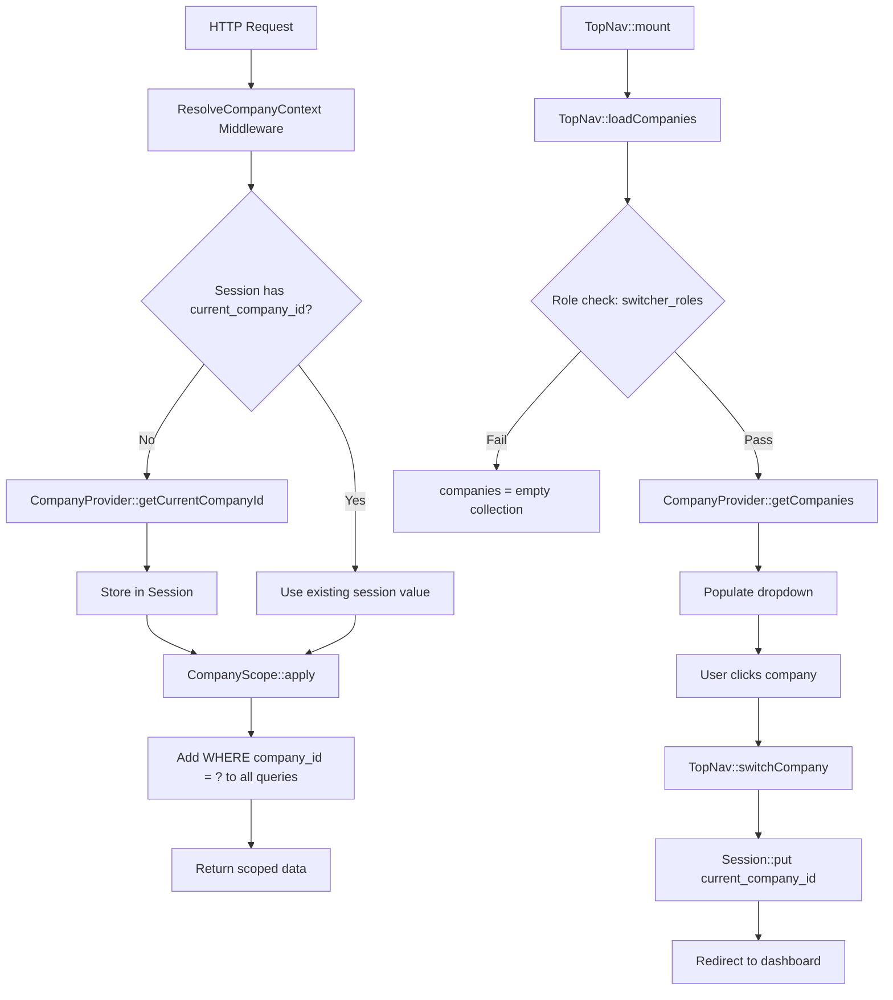

# Multi-Company User Assignment — Synthesis & Recommendation Report

> **Status**: Library Changes Implemented / Consuming App Guide Available  
> **Date**: 2026-09-07  
> **Scope**: User-company assignment UX, default company seeding, company switcher behavior  
> **Architecture Rule**: Library (`src/`) must remain fully decoupled from consuming app (`app/Modules/`)

---

## 1. Executive Summary

The UI Library now supports a **multi-company-per-user** model. The following library changes have been **implemented**:

- [`HasUILibraryUser::companies()`](src/Traits/HasUILibraryUser.php:83) — A `BelongsToMany` relationship on the User model trait, pointing to a `company_user` pivot table. This co-exists with the existing `company()` BelongsTo for backward compatibility.
- [`TopNav::loadCompanies()`](src/Http/Livewire/Layouts/Navs/TopNav.php:767) — The company switcher dropdown is hidden when a user has ≤1 company (no dropdown needed for single-company users).
- [`ui-library.php`](src/Config/ui-library.php:556) — The `switcher_roles` default is now `['*']` (all authenticated users), removing the role-gating bottleneck.
- [`InstallCommand`](src/Console/Commands/InstallCommand.php:498) — The non-existent `OrganizationSeeder` reference has been removed from the seeder list.

The company scoping and switching infrastructure — [`CompanyScope`](src/Scopes/CompanyScope.php:21), [`ResolveCompanyContext`](src/Http/Middleware/ResolveCompanyContext.php:15), [`TopNav`](src/Http/Livewire/Layouts/Navs/TopNav.php:741), and the [`CompanyProvider`](src/Contracts/Navigation/CompanyProvider.php:8) contract — is already well-architected and domain-agnostic. The existing [`OrganizationSwitchController`](src/Http/Controllers/OrganizationSwitchController.php:16) already anticipates multi-company users — the [`userBelongsToCompany()`](src/Http/Controllers/OrganizationSwitchController.php:81) fallback checks for `$user->companies()` (a `BelongsToMany`), confirming this was an intended evolution path.

The library's [`DataTableForm::syncRelationships()`](src/Http/Livewire/DataTables/DataTableForm.php:1345) has two critical bugs documented in [`plans/library-relationship-bugs.md`](plans/library-relationship-bugs.md) that make it unsuitable for user-company assignment: (1) `hasMany` incorrectly calls `sync()` — a `BelongsToMany`-only method — which would throw a `BadMethodCallException`, and (2) `sync($ids)` passes only IDs with no pivot extra data support.

**Primary recommendation**: Build a **custom Livewire component** in the consuming app (`app/Modules/Organization/Http/Livewire/UserCompanyAssignment.php`) for the user-company assignment UI. The full consuming-app implementation guide is documented in [`plans/consuming-app-multi-company-implementation.md`](plans/consuming-app-multi-company-implementation.md). This avoids coupling the library to a specific domain concern, sidesteps the bugs in `syncRelationships()`, and provides full control over pivot data.

---

## 2. How the Library Renders Relationships

### 2.1 DataTableForm Relationship Handling

The [`DataTableForm`](src/Http/Livewire/DataTables/DataTableForm.php) component supports relationships through a per-field `relationship` configuration key within the Data config file (e.g., `app/Modules/{Module}/Data/{Entity}.php`).

**Supported relationship schema** (per-field `relationship` key):

| Key | Type | Purpose |
|-----|------|---------|
| `type` | `string` | Relationship type: `belongsTo`, `belongsToMany`, `hasMany`, `morphMany`, `morphToMany` |
| `model` | `string` | FQCN of the related model |
| `display_field` | `string` | Field used for option labels (default: `name`) |
| `foreign_key` | `string` | FK column for `belongsTo` |
| `dynamic_property` | `string` | Method name on the model (default: field name) |
| `searchable_fields` | `array` | Fields searched by `livewire-searchable-select` |
| `hint_field` | `string` | Extra field shown in parentheses after the label |
| `inlineAdd` | `bool` | Enable [`createAndSelectOption()`](src/Http/Livewire/DataTables/DataTableForm.php:511) for on-the-fly creation |

**Field type mapping** (auto-resolved from relationship type):

| Relationship Type | Field Type | Multi-Select |
|-------------------|-----------|:---:|
| `belongsTo` | `livewire-searchable-select` or `select` | No |
| `belongsToMany` | `livewire-searchable-select` or `checkbox` | Yes |
| `hasMany` | `livewire-searchable-select` or `checkbox` | Yes |
| `morphMany` | `livewire-searchable-select` or `checkbox` | Yes |
| `morphToMany` | `livewire-searchable-select` or `checkbox` | Yes |

### 2.2 The `syncRelationships()` Method

After saving a record, [`syncRelationships()`](src/Http/Livewire/DataTables/DataTableForm.php:1345) iterates over field definitions and syncs many-to-many relationships:

```php
// DataTableForm.php:1345-1366
protected function syncRelationships($record): void
{
    foreach ($this->fieldDefinitions as $field => $def) {
        if (!isset($def['relationship'])) continue;
        $rel = $def['relationship'];
        $type = $rel['type'] ?? 'belongsTo';
        $dynamicProp = $rel['dynamic_property'] ?? $field;

        if (in_array($type, ['belongsToMany', 'hasMany', 'morphMany', 'morphToMany'])) {
            $ids = $this->fields[$field] ?? [];
            if (!empty($ids)) {
                $record->$dynamicProp()->sync($ids);
            } else {
                $record->$dynamicProp()->sync([]);
            }
        }
    }
}
```

### 2.3 Critical Gaps

| Gap | Severity | Detail |
|-----|:--------:|--------|
| **`hasMany` uses `sync()`** | 🔴 Critical | `sync()` is a `BelongsToMany`-only method. Calling it on a `HasMany` relationship throws `BadMethodCallException`. |
| **No pivot extra data** | 🔴 Critical | `sync($ids)` passes only IDs. Pivot columns (e.g., `is_default`, `assigned_at`, `role`) cannot be set. |
| **Undocumented `relationship` key** | 🟡 Medium | Neither [`docs/consuming-app/`](docs/consuming-app/) nor [`docs/library/`](docs/library/) documents the per-field `relationship` schema. |
| **`inlineAdd` creates bare records** | 🟡 Medium | [`createAndSelectOption()`](src/Http/Livewire/DataTables/DataTableForm.php:511) creates records with only `name`/`slug`/`color`/`is_active` — no company-scoping or validation. |

### 2.4 What Already Works Well

- `belongsToMany` with `livewire-searchable-select` (searchable dropdown) works correctly for simple ID syncing
- `inlineAdd` provides a usable on-the-fly creation pattern
- The `relationship` config schema is flexible and covers all standard Eloquent relationship types
- `DataTableDetail` renders relationship data in detail views

---

## 3. How Company Scoping & Switching Works End-to-End

### 3.1 Data Flow Diagram



### 3.2 Component Responsibilities

| Component | File | Role |
|-----------|------|------|
| [`CompanyScope`](src/Scopes/CompanyScope.php:21) | `src/Scopes/CompanyScope.php` | Global Eloquent scope — adds `WHERE company_id = ?` to all queries when session has a value. `0` bypasses (falsy check). |
| [`ResolveCompanyContext`](src/Http/Middleware/ResolveCompanyContext.php:15) | `src/Http/Middleware/ResolveCompanyContext.php` | Opt-in middleware (`qf.resolve-company-context`) — lazily resolves and persists `current_company_id` on first request. |
| [`CompanyProvider`](src/Contracts/Navigation/CompanyProvider.php:8) | `src/Contracts/Navigation/CompanyProvider.php` | Contract with two methods: `getCompanies($user): Collection` and `getCurrentCompanyId($user): ?int`. |
| [`NullCompanyProvider`](src/Services/Navigation/NullCompanyProvider.php:9) | `src/Services/Navigation/NullCompanyProvider.php` | Default library implementation — returns empty collection and `null`. |
| [`TopNav::loadCompanies()`](src/Http/Livewire/Layouts/Navs/TopNav.php:741) | `src/Http/Livewire/Layouts/Navs/TopNav.php` | Populates company switcher dropdown. Role-gated via `ui-library.multitenancy.switcher_roles` (default: `['*']`). |
| [`TopNav::switchCompany()`](src/Http/Livewire/Layouts/Navs/TopNav.php:789) | `src/Http/Livewire/Layouts/Navs/TopNav.php` | Persists selection to session, dispatches `companySwitched` event, redirects to dashboard. |
| [`OrganizationSwitchController`](src/Http/Controllers/OrganizationSwitchController.php:16) | `src/Http/Controllers/OrganizationSwitchController.php` | Server-side switch endpoint. Validates via `CompanyProvider`, falls back to `$user->companies()` (BelongsToMany). |
| [`top-nav.blade.php`](src/Resources/views/livewire/navs/top-nav.blade.php:284) | `src/Resources/views/livewire/navs/top-nav.blade.php` | Blade template — renders dropdown with "All Companies" option and per-company items. |

### 3.3 Key Design Decisions Already Made

1. **"All Companies" mode** (`company_id = 0`): The [`CompanyScope`](src/Scopes/CompanyScope.php:36) uses a truthy check (`if ($companyId)`), so `0` bypasses scoping entirely. The [`TopNav`](src/Http/Livewire/Layouts/Navs/TopNav.php:771) explicitly handles `0` as "All Companies".

2. **BelongsToMany anticipation**: [`OrganizationSwitchController::userBelongsToCompany()`](src/Http/Controllers/OrganizationSwitchController.php:98) already checks for `method_exists($user, 'companies')` as a fallback — the library was designed to support multi-company users.

3. **Role-gated switcher**: The company switcher is now available to all authenticated users by default (`switcher_roles = ['*']`), configurable via `ui-library.multitenancy.switcher_roles`.

4. **No `OrganizationSeeder` exists**: The [`InstallCommand`](src/Console/Commands/InstallCommand.php:498) `OrganizationSeeder` reference has been removed. The `companies` table migration exists and creates `id`, `name`, `code`, `timestamps`.

---

## 4. Recommended Approach: User-Company Assignment

### 4.1 Option Evaluation

#### Option A: DataTableForm `belongsToMany` + Pivot Model

Use the library's existing per-field `relationship` config with `type: 'belongsToMany'` on the User DataTableForm, backed by a `company_user` pivot table.

| Criterion | Assessment |
|-----------|------------|
| **SaaS Best Practices** | ⚠️ Partial — `sync()` works for simple many-to-many but cannot set `is_default` or `assigned_at` on the pivot |
| **Library Independence** | ✅ No `App\Modules` references needed — purely config-driven |
| **Reuse of Library Infrastructure** | ✅ Reuses DataTableForm, DataTableDetail, searchable select |
| **Maintenance Burden** | 🔴 High — requires fixing `syncRelationships()` bugs (hasMany + sync, no pivot data) in the library |
| **UX Consistency** | ✅ Same UX as all other DataTable forms |

**Verdict**: Rejected. The `syncRelationships()` bugs are blocking. Fixing them requires library changes that would need to be generic (pivot data support for *any* belongsToMany), which is a significant scope increase. Additionally, user-company assignment is an auth/tenancy concern, not a typical CRUD relationship — it warrants dedicated UX.

#### Option B: Custom Livewire Component (Recommended)

Build a dedicated [`UserCompanyAssignment`](app/Modules/Organization/Http/Livewire/UserCompanyAssignment.php) Livewire component in the consuming app, embedded in the user edit form or as a standalone page.

| Criterion | Assessment |
|-----------|------------|
| **SaaS Best Practices** | ✅ Full control — can set `is_default`, `assigned_at`, validate at least one company, show company details |
| **Library Independence** | ✅ All code in `app/Modules/` — zero library changes needed beyond what's already implemented |
| **Reuse of Library Infrastructure** | ✅ Can use library Blade components and the `CompanyProvider` contract |
| **Maintenance Burden** | 🟡 Moderate — new component to maintain, but self-contained and follows established patterns |
| **UX Consistency** | ✅ Can match the platform's design system using library Blade components |

**Verdict**: **Recommended**. This is the approach used by SaaS platforms like Gusto, Rippling, and Deel, where user-company assignment is a dedicated administrative interface with search, role-on-pivot, and default-company selection. It follows the established subclass/contract patterns documented in [`pre-coding-checklist.md`](docs/consuming-app/pre-coding-checklist.md) and [`25-library-independence-safeguards.md`](docs/library/25-library-independence-safeguards.md).

#### Option C: Extend HrsCompanyProvider Only

Only modify the consuming app's `HrsCompanyProvider` to return multiple companies per user, without building any assignment UI.

| Criterion | Assessment |
|-----------|------------|
| **SaaS Best Practices** | 🔴 Fails — no way to *assign* users to companies; only changes read path |
| **Library Independence** | ✅ No library changes |
| **Reuse of Library Infrastructure** | ✅ Uses existing contract |
| **Maintenance Burden** | ✅ Minimal |
| **UX Consistency** | 🔴 No assignment UI at all |

**Verdict**: Rejected. This doesn't solve the assignment problem — it only changes how companies are *read* for the switcher. An assignment UI is still needed.

### 4.2 Recommended Approach Detail

**Hybrid: Custom Livewire Component + Extended CompanyProvider**

1. **Backend**: Update the consuming app's `CompanyProvider` implementation to return all companies a user belongs to (via a `company_user` pivot), and set the default company as `getCurrentCompanyId()`.

2. **Database**: Create a `company_user` pivot table with columns: `user_id`, `company_id`, `timestamps`, and a composite unique index on `[user_id, company_id]`.

3. **UI**: Build [`UserCompanyAssignment`](app/Modules/Organization/Http/Livewire/UserCompanyAssignment.php) as a Livewire component that:
   - Uses a searchable user selector dropdown
   - Shows currently assigned companies as removable chips
   - Provides a searchable company multi-select list
   - Saves via `$user->companies()->sync($companyIds)`

4. **User Model**: The `companies(): BelongsToMany` relationship is already provided by the [`HasUILibraryUser`](src/Traits/HasUILibraryUser.php:83) trait — no manual model changes needed.

---

## 5. Recommended Approach: Default Company

### 5.1 Option Evaluation

#### Option A: DefaultCompanySeeder (Recommended)

Create a dedicated seeder in the consuming app that creates a default company and assigns all existing users to it.

| Criterion | Assessment |
|-----------|------------|
| **Idempotency** | ✅ `Company::count() === 0` check ensures safe re-runs |
| **Library Independence** | ✅ Seeder lives in `app/Modules/Organization/Database/Seeders/` |
| **Existing Pattern** | ✅ Follows `SuperAdminSeeder` and `UserSeeder` patterns |
| **Flexibility** | ✅ Consuming app controls company name, code, and assignment logic |

#### Option B: Auto-Create in InstallCommand

Modify the library's [`InstallCommand`](src/Console/Commands/InstallCommand.php) to create a default company during installation.

| Criterion | Assessment |
|-----------|------------|
| **Idempotency** | ✅ Can use `firstOrCreate` |
| **Library Independence** | 🔴 Violates library independence — company seeding is domain-specific |
| **Existing Pattern** | ⚠️ `OrganizationSeeder` was referenced but didn't exist — adding it now would embed domain logic in the library |

#### Option C: Enforce During Onboarding

Force the first super admin to create a company during the setup wizard.

| Criterion | Assessment |
|-----------|------------|
| **UX** | ✅ Clean onboarding flow |
| **Library Independence** | ✅ Onboarding steps are config-driven |
| **Completeness** | 🔴 Doesn't handle programmatic installs, CI/CD, or existing deployments |

### 5.2 Recommendation: Option A — DefaultCompanySeeder

Create [`app/Modules/Organization/Database/Seeders/DefaultCompanySeeder.php`](app/Modules/Organization/Database/Seeders/DefaultCompanySeeder.php) in the consuming app. This seeder:

1. Creates a default company via `Company::create(['name' => 'Default Company', 'code' => 'DEFAULT'])` if `Company::count() === 0`
2. Assigns all existing users to it via `$user->companies()->syncWithoutDetaching([$company->id])`
3. Is called from the consuming app's `DatabaseSeeder`

The library's [`InstallCommand`](src/Console/Commands/InstallCommand.php:498) `OrganizationSeeder` reference has been **removed** (the file never existed). The consuming app should register its own `DefaultCompanySeeder` in its `DatabaseSeeder`.

---

## 6. Company Switcher UX

### 6.1 Current State

The [`top-nav.blade.php`](src/Resources/views/livewire/navs/top-nav.blade.php:280) template already has a well-designed company switcher:

- Shown only when `$companies` is non-empty
- "All Companies" option at the top (company ID `0`)
- Per-company items with active-state highlighting
- Checkmark icon on the currently selected company
- Scrollable dropdown (max-height: 300px)
- Role-gated via `ui-library.multitenancy.switcher_roles`

### 6.2 Implemented Changes

#### Single-Company Hide Behavior

The [`TopNav::loadCompanies()`](src/Http/Livewire/Layouts/Navs/TopNav.php:767) method now hides the switcher when a user has ≤1 companies:

```php
// Hide switcher when user has 0 or 1 companies (no need to switch)
if ($this->companies->count() <= 1) {
    $this->companies = collect();
    return;
}
```

This is a domain-agnostic UX improvement — the dropdown is only rendered when the user has something to switch between. The [`top-nav.blade.php`](src/Resources/views/livewire/navs/top-nav.blade.php:280) `@if ($companies && $companies->isNotEmpty())` guard naturally hides the dropdown when companies is an empty collection.

#### Role-Gating

The library default is now `switcher_roles = ['*']` (all authenticated users). Consuming apps can override in their published `config/ui-library.php`:

```php
'multitenancy' => [
    'switcher_roles' => ['super_admin', 'company_admin'],
],
```

### 6.3 UX Mockup (Textual)

```
┌─────────────────────────────────────────────────────────┐
│  [Module Switcher]  [Context Tabs...]    [🔔] [⚡] [🏢 Default Company ▼] [👤] │
└─────────────────────────────────────────────────────────┘

Dropdown (multiple companies):
┌──────────────────────────────┐
│  Switch Company              │
│  ─────────────────────────── │
│  🌐  All Companies        ✓  │
│  ─────────────────────────── │
│  🏢  Acme Corp            ✓  │
│  🏢  Globex Inc.             │
│  🏢  Initech                 │
│  ─────────────────────────── │
│  + Add Company               │
└──────────────────────────────┘

Single company (no dropdown):
[🏢 Acme Corp]  (static badge, not clickable)
```

---

## 7. Specific Implementation Steps

### 7.1 Library Changes — Already Implemented

The following library-side changes have been completed. No further library modifications are required for multi-company user assignment.

| # | File | Change | Status |
|---|------|--------|:------:|
| L1 | [`src/Console/Commands/InstallCommand.php`](src/Console/Commands/InstallCommand.php:498) | Removed non-existent `OrganizationSeeder` reference from the `$seeders` array. The seeder file never existed at `src/Core/Organization/Database/Seeders/`. | ✅ Done |
| L2 | [`src/Traits/HasUILibraryUser.php`](src/Traits/HasUILibraryUser.php:83) | Added `companies(): BelongsToMany` relationship pointing to `company_user` pivot table. This is inherited by all consuming app User models that use the trait. | ✅ Done |
| L3 | [`src/Config/ui-library.php`](src/Config/ui-library.php:556) | Changed `switcher_roles` default from `['super_admin']` to `['*']` — all authenticated users can now see the company switcher by default. Consuming apps can override for tighter control. | ✅ Done |
| L4 | [`src/Http/Livewire/Layouts/Navs/TopNav.php`](src/Http/Livewire/Layouts/Navs/TopNav.php:767) | Added `if ($this->companies->count() <= 1)` check in `loadCompanies()` — hides the switcher dropdown when user has 0 or 1 companies. The dropdown is only rendered when the user has something to switch between. | ✅ Done |

### 7.2 Consuming App Changes — Implementation Guide

Full implementation details with code examples are documented in [`plans/consuming-app-multi-company-implementation.md`](plans/consuming-app-multi-company-implementation.md). Below is a summary of the five phases:

#### Phase 1: Database & Models

| # | File | Change |
|---|------|--------|
| C1 | `app/Modules/Organization/Database/Migrations/` | Create `create_company_user_table.php` with `user_id`, `company_id`, `timestamps`, and a composite unique index on `[user_id, company_id]`. |
| C2 | `app/Models/User.php` | The `companies()` BelongsToMany is already inherited from [`HasUILibraryUser`](src/Traits/HasUILibraryUser.php:83). No manual addition needed. |

#### Phase 2: CompanyProvider Rewrite

| # | File | Change |
|---|------|--------|
| C3 | `app/Modules/Hr/Providers/HrsCompanyProvider.php` | Rewrite: `getCompanies()` returns all companies for admins, `$user->companies` for others, with legacy employee fallback. `getCurrentCompanyId()` returns `0` for admins, first pivot company for others. |
| C4 | `app/Providers/AppServiceProvider.php` | Bind `CompanyProvider::class` to `HrsCompanyProvider::class` |

#### Phase 3: Assignment UI

| # | File | Change |
|---|------|--------|
| C5 | `app/Modules/Organization/Http/Livewire/UserCompanyAssignment.php` | Livewire component with user search, company multi-select, and `sync()` save. |
| C6 | `app/Modules/Organization/Resources/views/livewire/user-company-assignment.blade.php` | Blade view with searchable user selector, assigned company chips, and available company checkboxes. |

#### Phase 4: Default Company Seeder

| # | File | Change |
|---|------|--------|
| C7 | `app/Modules/Organization/Database/Seeders/DefaultCompanySeeder.php` | Idempotent seeder: creates default company if `Company::count() === 0`, assigns all users via `syncWithoutDetaching()`. |
| C8 | `database/seeders/DatabaseSeeder.php` | Register `DefaultCompanySeeder` |

#### Phase 5: Config

| # | File | Change |
|---|------|--------|
| C9 | `config/ui-library.php` | Verify `multitenancy.switcher_roles` is `['*']` (library default), register `organization` module if needed. |

---

## 8. Risk Assessment

| Risk | Likelihood | Impact | Mitigation |
|------|:----------:|:------:|------------|
| **Data migration: existing `company_id` on users** | High | Medium | Keep the `company_id` column during transition. Run a migration that copies `company_id` values into `company_user`. Remove `company_id` in a later release after validation. |
| **`CompanyScope` with multi-company users** | Medium | High | The scope uses `session('current_company_id')` — a single value. Multi-company users must switch context. The existing "All Companies" mode (`0`) already handles the "see everything" case. Ensure `ResolveCompanyContext` middleware is applied to all relevant routes. |
| **`syncRelationships()` bug blocks future `hasMany` usage** | Medium | Medium | See [`plans/library-relationship-bugs.md`](plans/library-relationship-bugs.md) for full details. `hasMany`/`morphMany` must be removed from the `sync()` block. These relationship types need a different sync strategy (e.g., `saveMany()` with foreign key updates). |
| **Performance: loading all companies for super admin** | Low | Low | The [`TopNav`](src/Http/Livewire/Layouts/Navs/TopNav.php:765) already loads all companies. For large deployments, add pagination or a search-as-you-type pattern in the dropdown. |
| **Race condition: default company unset** | Low | High | Ensure at least one company is always assigned. The `UserCompanyAssignment` component should enforce this with validation. |
| **Library coupling creep** | Low | High | All new code lives in `app/Modules/`. The library changes (L1–L4) are domain-agnostic and already implemented. Follow the [`pre-coding-checklist.md`](docs/consuming-app/pre-coding-checklist.md) for every file. |

### 8.1 Hide Switcher for Single-Company Users

| Risk | Detail |
|------|--------|
| **Description** | A user who belongs to exactly one company cannot see which company they are scoped to, because the company switcher dropdown is hidden when `companies->count() <= 1`. |
| **Likelihood** | High — this affects all non-admin users assigned to a single company. |
| **Impact** | Low — the user's company scope is still applied correctly via [`CompanyScope`](src/Scopes/CompanyScope.php:21). The dropdown is only hidden when there is nothing to switch between. |
| **Mitigation** | The current company name is displayed in the TopNav breadcrumb area as `$currentCompanyName` (set in [`updateCurrentCompanyName()`](src/Http/Livewire/Layouts/Navs/TopNav.php:814)). The [`top-nav.blade.php`](src/Resources/views/livewire/navs/top-nav.blade.php:280) template only renders the dropdown when `$companies->isNotEmpty()` — the check at [`loadCompanies()`](src/Http/Livewire/Layouts/Navs/TopNav.php:768) sets `$this->companies` to an empty collection when count ≤ 1, so the `@if` guard naturally hides the dropdown. The company name is still available via the `$currentCompanyName` property for display elsewhere in the UI. |

---

## 9. Library Relationship Bugs

Two critical bugs exist in [`DataTableForm::syncRelationships()`](src/Http/Livewire/DataTables/DataTableForm.php:1345) that affect any consuming app using the per-field `relationship` config for many-to-many or has-many relationships. These are documented in full detail in [`plans/library-relationship-bugs.md`](plans/library-relationship-bugs.md).

### Bug 1: `hasMany` incorrectly calls `sync()` — Critical

| Detail | |
|--------|---|
| **Location** | [`DataTableForm.php:1356`](src/Http/Livewire/DataTables/DataTableForm.php:1356) |
| **Root Cause** | The `in_array()` check includes `hasMany` alongside `belongsToMany`, `morphMany`, and `morphToMany`. `sync()` is a `BelongsToMany`-only method — calling it on a `HasMany` throws `BadMethodCallException`. |
| **Impact** | Any DataTable form with a `hasMany` relationship field will crash on save. |
| **Fix** | Remove `hasMany` from the `in_array()` check (line 1356). |

### Bug 2: No pivot extra data support — High

| Detail | |
|--------|---|
| **Location** | [`DataTableForm.php:1359`](src/Http/Livewire/DataTables/DataTableForm.php:1359) |
| **Root Cause** | `sync($ids)` passes only an array of IDs. Pivot extra columns (e.g., `is_default`, `role`, `assigned_at`) cannot be populated. |
| **Impact** | Silent data loss — pivot records are created but extra columns are left at defaults. |
| **Fix** | Extend the `relationship` config schema with `pivot_fields` and pass pivot data arrays to `sync()`. |

Both bugs are in the same method and should be addressed together to avoid merge conflicts. These bugs are the primary reason the custom Livewire component approach (Option B) was recommended over the DataTableForm `belongsToMany` approach (Option A) for user-company assignment.

---

## 10. Changes Made

The following library files were modified to support multi-company user assignment:

| File | Change | Lines |
|------|--------|-------|
| [`src/Console/Commands/InstallCommand.php`](src/Console/Commands/InstallCommand.php:498) | Removed non-existent `OrganizationSeeder` from the `$seeders` array. The seeder class `QuickerFaster\UILibrary\Core\Organization\Database\Seeders\OrganizationSeeder` never existed, and the install command would fail silently when attempting to run it. | 498–505 |
| [`src/Traits/HasUILibraryUser.php`](src/Traits/HasUILibraryUser.php:83) | Added `companies(): BelongsToMany` relationship method. Returns `$this->belongsToMany(Company::class, 'company_user')->withTimestamps()`. This is automatically inherited by all consuming app User models that use the `HasUILibraryUser` trait. The existing `company(): BelongsTo` (single-company) relationship is preserved for backward compatibility. | 79–87 |
| [`src/Config/ui-library.php`](src/Config/ui-library.php:556) | Changed `switcher_roles` default from `['super_admin']` to `['*']`. This allows all authenticated users to see the company switcher by default. Consuming apps can override with a tighter role list (e.g., `['super_admin', 'company_admin']`) in their published config. | 556 |
| [`src/Http/Livewire/Layouts/Navs/TopNav.php`](src/Http/Livewire/Layouts/Navs/TopNav.php:767) | Added `if ($this->companies->count() <= 1)` check in `loadCompanies()`. When a user has 0 or 1 companies, the switcher dropdown is hidden (companies set to empty collection). The `currentCompanyId` and `currentCompanyName` are still resolved for scoping and breadcrumb display. The [`top-nav.blade.php`](src/Resources/views/livewire/navs/top-nav.blade.php:280) `@if ($companies && $companies->isNotEmpty())` guard naturally hides the dropdown. | 767–771 |

**No consuming app files were created in this workspace** — all consuming app code is documented in [`plans/consuming-app-multi-company-implementation.md`](plans/consuming-app-multi-company-implementation.md) for reference by the consuming app team.

---

## Appendix A: Key Files Referenced

| File | Purpose |
|------|---------|
| [`src/Contracts/Navigation/CompanyProvider.php`](src/Contracts/Navigation/CompanyProvider.php) | Contract for company resolution |
| [`src/Services/Navigation/NullCompanyProvider.php`](src/Services/Navigation/NullCompanyProvider.php) | Default no-op implementation |
| [`src/Scopes/CompanyScope.php`](src/Scopes/CompanyScope.php) | Global Eloquent scope for tenant filtering |
| [`src/Http/Middleware/ResolveCompanyContext.php`](src/Http/Middleware/ResolveCompanyContext.php) | Middleware that sets session company ID |
| [`src/Http/Controllers/OrganizationSwitchController.php`](src/Http/Controllers/OrganizationSwitchController.php) | Server-side company switch endpoint |
| [`src/Http/Livewire/Layouts/Navs/TopNav.php`](src/Http/Livewire/Layouts/Navs/TopNav.php) | TopNav with company switcher |
| [`src/Resources/views/livewire/navs/top-nav.blade.php`](src/Resources/views/livewire/navs/top-nav.blade.php) | Company switcher Blade template |
| [`src/Traits/HasUILibraryUser.php`](src/Traits/HasUILibraryUser.php) | User trait with `company(): BelongsTo` and `companies(): BelongsToMany` |
| [`src/Core/Organization/Models/Company.php`](src/Core/Organization/Models/Company.php) | Base Company model |
| [`src/Http/Livewire/DataTables/DataTableForm.php`](src/Http/Livewire/DataTables/DataTableForm.php) | DataTable form with relationship handling |
| [`src/Console/Commands/InstallCommand.php`](src/Console/Commands/InstallCommand.php) | Library install command |
| [`src/Config/ui-library.php`](src/Config/ui-library.php) | Library configuration |
| [`dependencies/Models/User.php`](dependencies/Models/User.php) | Reference User model (uses `HasSettings`, not `HasUILibraryUser`) |
| [`docs/consuming-app/pre-coding-checklist.md`](docs/consuming-app/pre-coding-checklist.md) | Pre-coding architecture rules |
| [`docs/library/25-library-independence-safeguards.md`](docs/library/25-library-independence-safeguards.md) | Library independence rules |
| [`docs/consuming-app/contracts.md`](docs/consuming-app/contracts.md) | Contract implementation guide |
| [`docs/consuming-app/module-structure.md`](docs/consuming-app/module-structure.md) | Module structure conventions |
| [`plans/consuming-app-multi-company-implementation.md`](plans/consuming-app-multi-company-implementation.md) | Consuming app implementation guide |
| [`plans/library-relationship-bugs.md`](plans/library-relationship-bugs.md) | Detailed bug report for `syncRelationships()` |

## Appendix B: Mermaid Architecture Diagram

```mermaid
flowchart TB
    subgraph Library["UI Library - src/"]
        CP[CompanyProvider Contract]
        CS[CompanyScope]
        RC[ResolveCompanyContext]
        TN[TopNav + Company Switcher]
        OSC[OrganizationSwitchController]
        CM[Company Model - base]
        HULU[HasUILibraryUser - company BelongsTo + companies BelongsToMany]
        DTF[DataTableForm - syncRelationships]
    end

    subgraph ConsumingApp["Consuming App - app/"]
        UCA[UserCompanyAssignment Livewire]
        HCP[HrsCompanyProvider - implements CompanyProvider]
        UM[User Model - companies BelongsToMany]
        DCS[DefaultCompanySeeder]
        CUP[company_user Pivot Table]
    end

    CP -->|implemented by| HCP
    TN -->|calls| CP
    RC -->|calls| CP
    OSC -->|calls| CP
    CS -->|reads session| RC
    TN -->|renders| UCA
    UM -->|pivot| CUP
    DCS -->|seeds| CM
    DCS -->|assigns| UM
    HCP -->|queries| UM