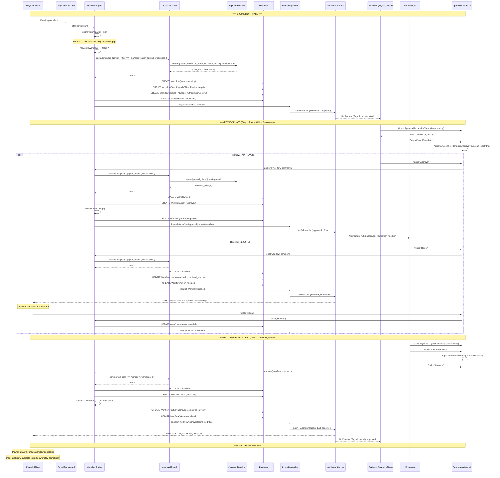

# Payroll Approval Implementation — Design Recommendation

> **Status**: Design Document (2026-08-30) — **Implementation complete** for priorities 1–4
> **Scope**: Consuming-app implementation plan for payroll approval workflows using the QuickerFaster UI Library
> **Audience**: Consuming-app developers integrating workflow/approval into the Payroll module

---

## Table of Contents

1. [What the Library Provides](#1-what-the-library-provides)
2. [What's Already in Place](#2-whats-already-in-place)
3. [What Needs to Be Done](#3-what-needs-to-be-done)
   - [3a. ApproverResolver Binding](#3a-approverresolver-binding)
   - [3b. ApproverLabelResolver Binding](#3b-approverlabelresolver-binding)
   - [3c. Workflow Definition Creation](#3c-workflow-definition-creation)
   - [3d. Notification Templates](#3d-notification-templates)
   - [3e. UI Integration](#3e-ui-integration)
   - [3f. Approval Request List](#3f-approval-request-list)
4. [Workflow Flow Diagram](#4-workflow-flow-diagram)
5. [Module Self-Containment](#5-module-self-containment)
6. [Testing Checklist](#6-testing-checklist)
7. [Priority Order](#7-priority-order)

---

## 1. What the Library Provides

The QuickerFaster UI Library ships a complete, domain-agnostic workflow/approval infrastructure. Every piece described below is already built, tested at the unit level, and ready for consuming-app integration.

### 1.1 Contracts

| Contract | Path | Purpose |
|----------|------|---------|
| [`Workflowable`](src/Contracts/Workflow/Workflowable.php:5) | `src/Contracts/Workflow/Workflowable.php` | Models implement this to become workflow-enabled. Requires `getWorkflowableId()`, `getWorkflowDefinitionKey()`, and `getWorkflowContext()`. |
| [`ApproverResolver`](src/Contracts/Approvals/ApproverResolver.php:5) | `src/Contracts/Approvals/ApproverResolver.php` | Resolves a mixed list of user IDs (int) and role names (string) into a flat `int[]` of user IDs. Accepts an optional `$workspaceId` for multi-tenant scoping. |
| [`ApproverLabelResolver`](src/Contracts/Approvals/ApproverLabelResolver.php) | `src/Contracts/Approvals/ApproverLabelResolver.php` | Resolves display labels, avatars, and profile routes for approver user IDs. Used by UI components. |

### 1.2 Trait

| Trait | Path | Purpose |
|-------|------|---------|
| [`HasWorkflow`](src/Traits/Workflows/HasWorkflow.php:27) | `src/Traits/Workflows/HasWorkflow.php` | Provides `workflow()` morphOne, `workflows()` morphMany, `activeWorkflow()`, `isUnderApproval()`, and a default `getWorkflowableId()`. |

### 1.3 Engine

| Service | Path | Key Methods |
|---------|------|-------------|
| [`WorkflowEngine`](src/Services/Workflow/WorkflowEngine.php:23) | `src/Services/Workflow/WorkflowEngine.php` | `start()` — begins a workflow; validates initiator authorization, prevents duplicates, auto-approves zero-step definitions. `approve()` — approves current step; supports `any` and `all` resolution modes. `reject()` — rejects and terminates the workflow. `recall()` — cancels a pending workflow (submitter-only). `getDefinition()` — DB-first resolution with config fallback. `hasActiveWorkflow()` — duplicate-prevention check. |

### 1.4 Guard

| Service | Path | Key Methods |
|---------|------|-------------|
| [`ApprovalGuard`](src/Services/Approvals/ApprovalGuard.php:8) | `src/Services/Approvals/ApprovalGuard.php` | `canApprove()` — checks if a user can approve a step's roles. `canSubmit()` — checks if a user can submit as an initiator. Both delegate to the bound `ApproverResolver`. Supports `super_admin` bypass via config `ui-library.approvals.bypass_roles`. |

### 1.5 Default Resolvers

| Service | Path | Behavior |
|---------|------|----------|
| [`DefaultApproverResolver`](src/Services/Approvals/DefaultApproverResolver.php:18) | `src/Services/Approvals/DefaultApproverResolver.php` | Resolves role names globally via Spatie's `permission.models.role`. Accepts `$workspaceId` for API compatibility but **ignores it** — no workspace scoping. |
| [`DefaultApproverLabelResolver`](src/Services/Approvals/DefaultApproverLabelResolver.php) | `src/Services/Approvals/DefaultApproverLabelResolver.php` | Probes `name` → `full_name` → `email` for labels; `avatar_url` → `avatar` → `profile_photo_url` → `photo` for avatars; returns `null` for profile routes. |

### 1.6 UI Components

| Component | Tag | Path | Purpose |
|-----------|-----|------|---------|
| [`ApprovalActions`](src/Http/Livewire/Approvals/ApprovalActions.php:22) | `qf.approval-actions` | `src/Http/Livewire/Approvals/ApprovalActions.php` | Renders approve/reject/recall buttons. Delegates to `WorkflowEngine`. Uses `ApprovalGuard` for permission checks and `ApproverLabelResolver` for display. |
| `ApprovalHistoryTimeline` | `qf.approval-history-timeline` | `src/Http/Livewire/Approvals/ApprovalHistoryTimeline.php` | Renders step-by-step progress with approver labels/avatars. |
| `ApprovalRequestListView` | `qf.approval-request-list` | `src/Http/Livewire/Approvals/ApprovalRequestListView.php` | Renders pending/submitted workflow queues. Supports filters: `view` (pending/submitted), `definitionKey`, `workflowableType`. |
| `WorkflowDefinitionWizard` | `qf.workflow-definition-wizard` | `src/Http/Livewire/Workflows/WorkflowDefinitionWizard.php` | 5-step wizard for creating/editing workflow definitions in the DB. |

### 1.7 Events

| Event | Path | Dispatched When |
|-------|------|-----------------|
| [`WorkflowSubmitted`](src/Events/Workflows/WorkflowSubmitted.php) | `src/Events/Workflows/WorkflowSubmitted.php` | `WorkflowEngine::start()` succeeds |
| [`WorkflowApproved`](src/Events/Workflows/WorkflowApproved.php) | `src/Events/Workflows/WorkflowApproved.php` | A step is approved (includes `$completed` flag for final step) |
| [`WorkflowRejected`](src/Events/Workflows/WorkflowRejected.php) | `src/Events/Workflows/WorkflowRejected.php` | `WorkflowEngine::reject()` succeeds |
| [`WorkflowRecalled`](src/Events/Workflows/WorkflowRecalled.php) | `src/Events/Workflows/WorkflowRecalled.php` | `WorkflowEngine::recall()` succeeds |

### 1.8 Models

| Model | Table | Purpose |
|-------|-------|---------|
| `Workflow` | `workflows` | Runtime workflow instance (morphs to workflowable entity) |
| `WorkflowStep` | `workflow_steps` | Runtime approval step within a workflow |
| `WorkflowAction` | `workflow_actions` | Audit log of every action (submit/approve/reject/recall/complete) |
| `WorkflowDefinition` | `workflow_definitions` | Persisted workflow definition (DB-first resolution) |
| `WorkflowDefinitionStep` | `workflow_definition_steps` | Steps within a persisted definition |

### 1.9 Resolution Strategy

[`WorkflowEngine::getDefinition()`](src/Services/Workflow/WorkflowEngine.php:371) resolves definitions **DB-first with config fallback**:

1. Query `workflow_definitions` by key where `is_active = true`
2. If found → hydrate from model via [`hydrateFromModel()`](src/Services/Workflow/WorkflowEngine.php:392)
3. If not found → fall back to `config('ui-library.workflows.definitions.{key}')`
4. If neither exists → throw `InvalidArgumentException`

This means a config-only definition (like the current `payroll_run` in `Config/workflows.php`) works immediately without a DB row. A DB definition takes priority once created.

---

## 2. What's Already in Place

### 2.1 PayrollRun Model

**File**: `app/Modules/Payroll/Models/PayrollRun.php`

The model already implements the full `Workflowable` contract:

```php
class PayrollRun extends Model implements Workflowable
{
    use HasCompanyScope;
    use HasFactory;
    use HasWorkflow;

    public function getWorkflowDefinitionKey(): string
    {
        return 'payroll_run';
    }

    public function getWorkflowContext(): array
    {
        return [
            'workspace_id' => $this->company_id,    // ← Critical for workspace scoping
            'pay_schedule_id' => $this->pay_schedule_id,
            'period_start' => $this->period_start?->toDateString(),
            'period_end' => $this->period_end?->toDateString(),
        ];
    }
}
```

Key observations:
- `workspace_id` is mapped to `company_id` — this is the value that flows through `WorkflowEngine::resolveWorkspaceId()` → `ApprovalGuard` → `ApproverResolver::resolve($roleIds, $workspaceId)`
- The `HasWorkflow` trait provides `workflow()`, `activeWorkflow()`, `isUnderApproval()` automatically
- `getWorkflowableId()` is inherited from the trait (returns `$this->getKey()`)

### 2.2 LeaveRequest Model (Precedent)

**File**: `app/Modules/Leave/Models/LeaveRequest.php`

Also implements `Workflowable` + uses `HasWorkflow`. This establishes the pattern: both HR-domain models (Leave and Payroll) are workflow-enabled.

### 2.3 Payroll Workflow Config

**File**: `app/Modules/Payroll/Config/workflows.php`

```php
return [
    'payroll_run' => [
        'label' => 'Payroll Run Approval',
        'name' => 'Payroll Run Approval',
        'entity_type' => 'PayrollRun',
        'initiators' => ['payroll_officer', 'hr_manager', 'super_admin'],
        'steps' => [
            [
                'name' => 'Payroll Officer Review',
                'step_type' => 'approval',
                'approval_mode' => 'any',
                'roles' => ['payroll_officer'],
            ],
            [
                'name' => 'HR Manager Authorization',
                'step_type' => 'approval',
                'approval_mode' => 'any',
                'roles' => ['hr_manager'],
            ],
        ],
        'notifications' => [
            'enabled' => true,
            'types' => [
                'submitted' => 'workflow_submitted',
                'approved' => 'workflow_approved',
                'rejected' => 'workflow_rejected',
                'recalled' => 'workflow_recalled',
            ],
        ],
    ],
];
```

This config is **already valid** and will be picked up by `WorkflowEngine::getDefinition()` as a config fallback. The workflow has:
- **3 initiator roles**: `payroll_officer`, `hr_manager`, `super_admin` — any user holding one of these roles can submit
- **2 approval steps**: Payroll Officer Review (any mode) → HR Manager Authorization (any mode)
- **Notifications enabled** for all four transition types

### 2.4 HrsServiceProvider TODO

**File**: `app/Modules/Hr/Providers/HrsServiceProvider.php`

Contains a TODO block listing Phase 2 items:
- Bind `ApproverResolver` + `ApproverLabelResolver`
- Merge ui-library workflow definitions
- Register HR notification templates/channels
- Add Spatie permission seeder for HR permissions
- Bind `WorkspaceResolver` for multi-tenant scoping

### 2.5 PayrollServiceProvider

**File**: `app/Modules/Payroll/Providers/PayrollServiceProvider.php`

Currently handles only config merging, migration loading, view loading, route loading, and Livewire component registration. Has **no workflow-related bindings**.

### 2.6 Legacy Approval Pattern in PayrollRunDetail

**File**: `app/Modules/Payroll/Http/Livewire/Payroll/PayrollRunDetail.php`

The detail component has its own `approve()`, `cancel()`, `markPaid()` methods that directly manipulate `$this->run->status`. This is a **pre-existing legacy approval pattern** that predates the library's workflow infrastructure. These methods will need to be reconciled with (or replaced by) the `WorkflowEngine`-driven approach.

---

## 3. What Needs to Be Done

### 3a. ApproverResolver Binding

**Status**: ✅ DONE — Library now ships [`WorkspaceScopedApproverResolver`](src/Services/Approvals/WorkspaceScopedApproverResolver.php) as the default

**Criticality**: 🔴 **CRITICAL** — This is a security boundary. Without a workspace-scoped resolver, a `payroll_officer` in Company A can approve payroll runs belonging to Company B.

#### What Was Implemented

The library now provides [`WorkspaceScopedApproverResolver`](src/Services/Approvals/WorkspaceScopedApproverResolver.php) as the default `ApproverResolver` binding (config key `ui-library.approvals.approver_resolver`). It:

1. Splits `$roleIds` into integers (pass-through user IDs) and strings (role names to resolve)
2. Queries Spatie roles by name
3. For each role's users, checks workspace membership via `belongsToWorkspace()` — by default compares `$user->company_id` against `$workspaceId`
4. Falls back to session/authenticated-user workspace when `$workspaceId` is null
5. Returns empty (not global) when no workspace-scoped approvers exist — safe default

**Most consuming apps do not need a custom resolver.** The default works when the User model has a `company_id` column.

#### Consuming App Override

The consuming app's HR module has [`HrsApproverResolver`](app/Modules/Hr/Providers/HrsApproverResolver.php) — a custom override for cases where the User model does not have a direct `company_id` column (user→workspace goes through an intermediary model). Bound in `HrsServiceProvider::register()`.

#### Deviation from Plan

The plan recommended a shared `app/Approvals/WorkspaceScopedApproverResolver.php`. Instead:
- The library itself now ships the resolver as default — no consuming-app copy needed for the standard case.
- The HR module has its own `HrsApproverResolver` for the non-standard case, bound in `HrsServiceProvider`.

---

### 3b. ApproverLabelResolver Binding

**Status**: ✅ NOT NEEDED — Library's [`DefaultApproverLabelResolver`](src/Services/Approvals/DefaultApproverLabelResolver.php) is sufficient

**Criticality**: 🟡 **LOW** — The default works correctly for the consuming app's User model (has `name` attribute).

No custom binding was needed. The default resolver probes `name` → `full_name` → `email` for labels and `avatar_url` → `avatar` → `profile_photo_url` → `photo` for avatars.

---

### 3c. Workflow Definition Creation

**Status**: ✅ DONE (config-only) — Config fallback in `app/Modules/Payroll/Config/workflows.php` is sufficient

**Criticality**: 🟡 **MEDIUM** — The config fallback works. DB definitions enable the wizard but are not required for initial functionality.

The `payroll_run` workflow definition in `Config/workflows.php` is picked up by [`WorkflowEngine::getDefinition()`](src/Services/Workflow/WorkflowEngine.php) via config fallback. No DB row was created — the config-only approach was chosen per the plan's Option A recommendation. A DB definition can be created later via the wizard for UI-driven management.

---

### 3d. Notification Templates

**Status**: ✅ DONE — `WorkflowNotificationTemplateSeeder` created

**Criticality**: 🟡 **MEDIUM** — Notifications won't fire without templates, but the workflow itself functions without them.

A `WorkflowNotificationTemplateSeeder` was created that seeds the four `workflow_*` templates (`workflow_submitted`, `workflow_approved`, `workflow_rejected`, `workflow_recalled`) for `database` and `mail` channels. The templates are registered with appropriate variable placeholders matching what [`WorkflowEngine::notifyTransition()`](src/Services/Workflow/WorkflowEngine.php) passes.

---

### 3e. UI Integration

**Status**: ✅ DONE — [`ApprovalActions`](src/Http/Livewire/Approvals/ApprovalActions.php) and [`ApprovalHistoryTimeline`](src/Http/Livewire/Approvals/ApprovalHistoryTimeline.php) embedded on PayrollRun detail page

**Criticality**: 🔴 **CRITICAL** — Without UI, approvers have no way to approve or reject.

#### What Was Implemented

- **`ApprovalActions` embedded** on the PayrollRun detail Blade view — renders approve/reject/recall buttons when a workflow is pending.
- **`ApprovalHistoryTimeline` embedded** below the actions — shows step-by-step progress with approver labels.
- **Legacy methods reconciled**: The existing `approve()`/`cancel()` methods in `PayrollRunDetail` were refactored to delegate to `WorkflowEngine`. `markPaid()` is gated on workflow completion.
- **Workflow start trigger**: Added a "Submit for Approval" button on the detail page, visible when `status === 'draft'` and no active workflow exists.

#### Deviation from Plan

The plan suggested starting the workflow in the PayrollRunWizard. Instead, a "Submit for Approval" button was added to the detail page — this gives the payroll officer a chance to review the run before submitting it into the approval pipeline.

---

### 3f. Approval Request List

**Status**: ✅ DONE — Dedicated Payroll approvals page created with navigation item

**Criticality**: 🟡 **MEDIUM** — Approvers need a way to discover pending requests.

#### What Was Implemented

- **`approvals.blade.php`** created in the Payroll module — a dedicated page embedding [`ApprovalRequestListView`](src/Http/Livewire/Approvals/ApprovalRequestListView.php) filtered to `definition-key="payroll_run"`.
- **Navigation config updated** — added a "Payroll Approvals" sidebar item in the Payroll module's Processing context group.
- **Both views supported**: `view="pending"` (approvals awaiting the current user) and `view="submitted"` (workflows the current user submitted).

This follows the plan's Option 2 (dedicated nav item). A dashboard card (Option 1) can be added later as an enhancement.

---

## 4. Workflow Flow Diagram



### Key Flow Rules

1. **Initiator authorization**: Only users holding `payroll_officer`, `hr_manager`, or `super_admin` roles **within the payroll run's workspace** can submit.
2. **Duplicate prevention**: `hasActiveWorkflow()` blocks a second submission while a workflow is pending.
3. **Step sequencing**: Steps execute in definition order. Step 2 only becomes active after Step 1 is approved.
4. **Rejection terminates**: A rejection at any step ends the entire workflow. The submitter can recall and resubmit.
5. **Workspace scoping**: Every guard check passes `workspace_id` from the workflow context. The custom `ApproverResolver` filters users by workspace membership.
6. **`super_admin` bypass**: Users with the `super_admin` role bypass all guard checks (configurable via `ui-library.approvals.bypass_roles`).

---

## 5. Module Self-Containment

### 5.1 The Question

Should the `ApproverResolver` binding live in `PayrollServiceProvider` (Payroll module), `HrsServiceProvider` (HR module), or a shared location?

### 5.2 Analysis

The `ApproverResolver` contract is **not module-specific**. It is a cross-cutting concern used by:

- **Payroll module**: `PayrollRun` workflows
- **Leave module**: `LeaveRequest` workflows
- **Future modules**: Any model implementing `Workflowable`

The resolver's only dependency is the consuming app's workspace/membership model — it needs to answer "does user X belong to workspace Y?" This is an application-level concern, not a module-level concern.

### 5.3 Precedent: `CompanyProvider`

The consuming app already established a pattern with `CompanyProvider`:

- The contract [`CompanyProvider`](src/Contracts/Navigation/CompanyProvider.php) is defined in the library
- The implementation `HrsCompanyProvider` lives in `app/Modules/Hr/Providers/HrsCompanyProvider.php`
- The binding happens in [`HrsServiceProvider::register()`](app/Modules/Hr/Providers/HrsServiceProvider.php:15)

This works because `CompanyProvider` is HR-specific (companies are an HR concept). But `ApproverResolver` is **not** HR-specific — it's workflow-specific and applies to any workflowable entity regardless of module.

### 5.4 Recommendation

**Place the resolver class at `app/Approvals/WorkspaceScopedApproverResolver.php`** — a shared application-level location, not inside any module.

**Bind it in a dedicated `ApproverResolutionServiceProvider`** registered in `config/app.php` after `UILibraryServiceProvider`. This:

- ✅ Keeps the binding in one place for all modules
- ✅ Avoids binding-order conflicts between Payroll and Leave modules
- ✅ Follows the library's own pattern (contracts in `src/Contracts/`, implementations in `src/Services/`)
- ✅ Makes the workspace-scoping concern explicit and discoverable

**Alternative**: Use the config override approach — publish `config/ui-library.php` and set `approvals.approver_resolver` to the FQCN. This requires no service provider at all and is the simplest option.

### 5.5 What Stays in the Payroll Module

The Payroll module remains self-contained for everything that is **Payroll-specific**:

| Concern | Location | Reason |
|---------|----------|--------|
| `Config/workflows.php` | `app/Modules/Payroll/Config/` | Payroll-specific workflow definition |
| `PayrollRun` model | `app/Modules/Payroll/Models/` | Payroll-specific entity |
| `PayrollRunDetail` UI | `app/Modules/Payroll/Http/Livewire/` | Payroll-specific detail page |
| `PayrollRunWizard` | `app/Modules/Payroll/Http/Livewire/` | Payroll-specific creation flow |
| Notification templates | Shared seeder or Payroll seeder | Templates are reusable but can be seeded from Payroll |

---

## 6. Testing Checklist

Adapted from [`docs/consuming-app/18-workflow-approval-testing-checklist.md`](docs/consuming-app/18-workflow-approval-testing-checklist.md), scoped to the Payroll module.

### 6.1 ApproverResolver — Unit Tests

Place at `tests/Unit/Approvals/WorkspaceScopedApproverResolverTest.php`.

- [ ] **Resolves only approvers in the given workspace**: Create a `payroll_officer` in Company 1 and a `payroll_officer` in Company 2. Call `resolve(['payroll_officer'], '1')`. Assert Company 1 user is included, Company 2 user is excluded.
- [ ] **Passes integer user IDs through unchanged**: `resolve([42, 'payroll_officer'], '1')` → result contains `42`.
- [ ] **Deduplicates**: `resolve([42, '42'], null)` → `[42]`.
- [ ] **Returns empty for unknown role**: `resolve(['nonexistent_role'], '1')` → `[]`.
- [ ] **Falls back to active workspace when workspaceId is null**: Set `session(['active_workspace_id' => 7])`, call `resolve(['reviewer'])` → only users in workspace 7.
- [ ] **Safe default: empty when no scoped approvers exist**: `resolve(['authorizer'], '999')` → `[]`, never a global leak.

### 6.2 WorkflowEngine — Integration Tests

- [ ] **Start workflow**: `WorkflowEngine::start($payrollRun)` creates `Workflow` + 2 `WorkflowStep` rows.
- [ ] **Initiator authorization**: A user without `payroll_officer`/`hr_manager`/`super_admin` role gets `AuthorizationException` on `start()`.
- [ ] **Duplicate prevention**: Calling `start()` twice throws `RuntimeException`.
- [ ] **DB-first definition**: If a `WorkflowDefinition` row exists for `payroll_run`, it's used instead of config.
- [ ] **Config fallback**: Without a DB row, `Config/workflows.php` definition is used.
- [ ] **Auto-approve edge case**: A definition with zero steps auto-approves on submission.

### 6.3 Approval Flow — Integration Tests

- [ ] **Approve Step 1 (any mode)**: As a `payroll_officer` in the correct workspace, approve. Step 1 marked approved, workflow advances to Step 2.
- [ ] **Reject Step 1**: As a `payroll_officer`, reject. Step 1 marked rejected, workflow status = rejected.
- [ ] **Approve Step 2 (any mode)**: As an `hr_manager` in the correct workspace, approve. Step 2 marked approved, workflow status = approved, `completed_at` set.
- [ ] **Unauthorized approver**: A user without the step's role gets `AuthorizationException`.
- [ ] **Cross-workspace rejection**: A `payroll_officer` in Company 2 cannot approve a Company 1 payroll run.
- [ ] **Recall**: The submitter can recall a pending workflow → status = cancelled.
- [ ] **Non-submitter cannot recall**: Another user gets an error on `recall()`.

### 6.4 Events & Notifications

- [ ] **`WorkflowSubmitted` dispatched** on `start()`.
- [ ] **`WorkflowApproved` dispatched** on each approval (check `$completed` flag: `false` for Step 1, `true` for Step 2).
- [ ] **`WorkflowRejected` dispatched** on `reject()`.
- [ ] **`WorkflowRecalled` dispatched** on `recall()`.
- [ ] **Notification records** appear in `notification_logs` when templates are seeded and notifications are enabled in config.

### 6.5 UI Components

- [ ] **`ApprovalActions` renders** on the PayrollRun detail page when a workflow is pending.
- [ ] **Approve button works** — calls `WorkflowEngine::approve()`, dispatches refresh events.
- [ ] **Reject button works** — calls `WorkflowEngine::reject()`, dispatches refresh events.
- [ ] **Recall button visible** only for the submitter.
- [ ] **Buttons hidden** when no pending workflow exists.
- [ ] **`ApprovalHistoryTimeline` renders** step progress with approver labels.
- [ ] **`ApprovalRequestListView` shows pending** payroll runs for the current approver.
- [ ] **`ApprovalRequestListView` shows submitted** payroll runs for the current user.

### 6.6 Legacy Reconciliation

- [ ] **`PayrollRunDetail::approve()` is removed or refactored** to delegate to `WorkflowEngine`.
- [ ] **`PayrollRunDetail::cancel()` is removed or refactored** to delegate to `WorkflowEngine::recall()`.
- [ ] **`markPaid()` is gated** on workflow completion (`!$run->isUnderApproval()`).
- [ ] **Status badge** reflects workflow status (pending/approved/rejected) rather than legacy status.

---

## 7. Priority Order

The implementation should proceed in this order, with each step building on the previous:

### Priority 1: ApproverResolver Binding 🔴 — ✅ DONE

**Why first**: This is a security boundary. Without it, cross-company approval leakage exists. Every subsequent step depends on correct authorization.

**What happened**: The library now ships [`WorkspaceScopedApproverResolver`](src/Services/Approvals/WorkspaceScopedApproverResolver.php) as the default. No consuming-app copy was needed for the standard case. The HR module has [`HrsApproverResolver`](app/Modules/Hr/Providers/HrsApproverResolver.php) for the non-standard case where the User model doesn't have a direct `company_id` column.

### Priority 2: UI Integration 🔴 — ✅ DONE

**Why second**: Without UI, approvers cannot act. The workflow engine is functional but unreachable.

**What happened**: [`ApprovalActions`](src/Http/Livewire/Approvals/ApprovalActions.php) and [`ApprovalHistoryTimeline`](src/Http/Livewire/Approvals/ApprovalHistoryTimeline.php) embedded on the PayrollRun detail page. Legacy `approve()`/`cancel()` methods refactored to delegate to `WorkflowEngine`. "Submit for Approval" button added to detail page (deviation from wizard-trigger plan).

### Priority 3: Notification Templates 🟡 — ✅ DONE

**Why third**: Notifications are important for user experience but don't block the core approval flow. The workflow functions without them.

**What happened**: `WorkflowNotificationTemplateSeeder` created, seeding the four `workflow_*` templates for `database` and `mail` channels.

### Priority 4: Approval Request List 🟡 — ✅ DONE

**Why fourth**: Approvers need a discovery mechanism, but they can also reach the detail page through existing navigation.

**What happened**: Dedicated `approvals.blade.php` page created in the Payroll module with [`ApprovalRequestListView`](src/Http/Livewire/Approvals/ApprovalRequestListView.php) filtered to `definition-key="payroll_run"`. Navigation config updated with "Payroll Approvals" sidebar item.

### Priority 5: Workflow Definition in DB 🟡 — ⏳ DEFERRED

**Why fifth**: The config fallback works. DB definitions enable the wizard but are not required for initial functionality.

**Status**: Config-only approach chosen (Option A). The `payroll_run` definition in `Config/workflows.php` is picked up via config fallback. A DB definition can be created later via the wizard.

### Priority 6: ApproverLabelResolver (if needed) 🟢 — ✅ NOT NEEDED

**Why last**: The default resolver is likely sufficient. Only implement a custom one if the User model doesn't have `name` or custom formatting is required.

**Status**: The library's [`DefaultApproverLabelResolver`](src/Services/Approvals/DefaultApproverLabelResolver.php) works correctly for the consuming app's User model.

---

## Appendix A: Key File Reference

### Library Files

| File | Path |
|------|------|
| Workflowable contract | [`src/Contracts/Workflow/Workflowable.php`](src/Contracts/Workflow/Workflowable.php) |
| HasWorkflow trait | [`src/Traits/Workflows/HasWorkflow.php`](src/Traits/Workflows/HasWorkflow.php) |
| WorkflowEngine | [`src/Services/Workflow/WorkflowEngine.php`](src/Services/Workflow/WorkflowEngine.php) |
| ApprovalGuard | [`src/Services/Approvals/ApprovalGuard.php`](src/Services/Approvals/ApprovalGuard.php) |
| ApproverResolver contract | [`src/Contracts/Approvals/ApproverResolver.php`](src/Contracts/Approvals/ApproverResolver.php) |
| ApproverLabelResolver contract | [`src/Contracts/Approvals/ApproverLabelResolver.php`](src/Contracts/Approvals/ApproverLabelResolver.php) |
| DefaultApproverResolver | [`src/Services/Approvals/DefaultApproverResolver.php`](src/Services/Approvals/DefaultApproverResolver.php) |
| DefaultApproverLabelResolver | [`src/Services/Approvals/DefaultApproverLabelResolver.php`](src/Services/Approvals/DefaultApproverLabelResolver.php) |
| ApprovalActions component | [`src/Http/Livewire/Approvals/ApprovalActions.php`](src/Http/Livewire/Approvals/ApprovalActions.php) |
| ApprovalHistoryTimeline | [`src/Http/Livewire/Approvals/ApprovalHistoryTimeline.php`](src/Http/Livewire/Approvals/ApprovalHistoryTimeline.php) |
| ApprovalRequestListView | [`src/Http/Livewire/Approvals/ApprovalRequestListView.php`](src/Http/Livewire/Approvals/ApprovalRequestListView.php) |
| WorkflowDefinitionWizard | [`src/Http/Livewire/Workflows/WorkflowDefinitionWizard.php`](src/Http/Livewire/Workflows/WorkflowDefinitionWizard.php) |
| UILibraryServiceProvider | [`src/Providers/UILibraryServiceProvider.php`](src/Providers/UILibraryServiceProvider.php) |

### Consuming App Files

| File | Path |
|------|------|
| PayrollRun model | `app/Modules/Payroll/Models/PayrollRun.php` |
| Payroll workflow config | `app/Modules/Payroll/Config/workflows.php` |
| PayrollServiceProvider | `app/Modules/Payroll/Providers/PayrollServiceProvider.php` |
| HrsServiceProvider | `app/Modules/Hr/Providers/HrsServiceProvider.php` |
| PayrollRunDetail component | `app/Modules/Payroll/Http/Livewire/Payroll/PayrollRunDetail.php` |
| PayrollRunDetail Blade view | `app/Modules/Payroll/Resources/views/livewire/payroll/payroll-run-detail.blade.php` |
| LeaveRequest model | `app/Modules/Leave/Models/LeaveRequest.php` |

### Reference Docs

| Document | Path |
|----------|------|
| Workspace-scoped resolver reference | [`docs/consuming-app/20-reference-workspace-scoped-approver-resolver.md`](docs/consuming-app/20-reference-workspace-scoped-approver-resolver.md) |
| Testing checklist | [`docs/consuming-app/18-workflow-approval-testing-checklist.md`](docs/consuming-app/18-workflow-approval-testing-checklist.md) |
| Implementation history | [`docs/project/23-workflow-approval-implementation-plan.md`](docs/project/23-workflow-approval-implementation-plan.md) |
| Contracts cookbook | [`docs/consuming-app/contracts.md`](docs/consuming-app/contracts.md) |

---

## Appendix B: Quick-Start Summary

For a developer who wants the shortest path to a working payroll approval workflow:

1. **No resolver copy needed** — the library now ships [`WorkspaceScopedApproverResolver`](src/Services/Approvals/WorkspaceScopedApproverResolver.php) as default. Only override if your User model lacks `company_id`.
2. **Add** `<livewire:qf.approval-actions :workflow-id="$run->activeWorkflow->id" />` to the detail Blade view
3. **Add** `<livewire:qf.approval-history-timeline :workflow-id="$run->activeWorkflow->id" />` below it
4. **Call** `app(WorkflowEngine::class)->start($payrollRun)` when the payroll run is finalized
5. **Seed** the four `workflow_*` notification templates via `WorkflowNotificationTemplateSeeder`
6. **Test** with two users in different companies to verify workspace scoping