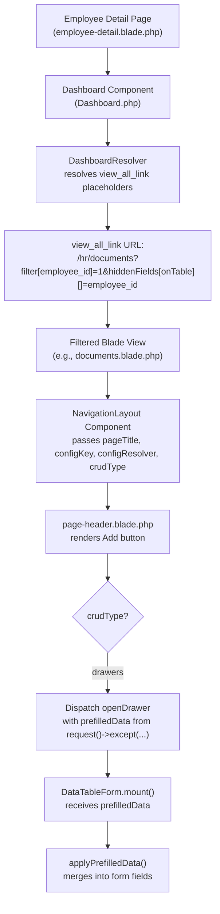
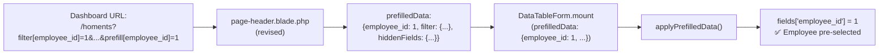

# Analysis: UX of the "Add" Button on Filtered Data-Table Pages

**Date:** 2026-08-27
**Problem:** When a user clicks "View all" on an employee overview dashboard card, they reach a filtered data-table page where the Add button form doesn't prefill the employee field even though the page is clearly scoped to one employee.

---

## 1. Current State — How It All Works

### The Flow



### How `view_all_link` URLs are built

In [`dashboard_employee_overview.php`](app/Modules/Hr/Data/dashboards/dashboard_employee_overview.php:339-341):

```php
'view_all_link' => '/hr/documents?filter[employee_id]={{ employee_id }}&filter[expiry_date][>=]=today&filter[expiry_date][<=]=+30 days&hiddenFields[onTable][]=employee_id',
```

The `{{ employee_id }}` placeholder is resolved by [`DashboardResolver::replacePlaceholders()`](src/Services/Config/Dashboards/DashboardResolver.php:30-38) using the `parameters` passed from the employee detail page:

```php
// employee-detail.blade.php (line 84-95)
@livewire('qf.dashboard', [
    'configKey' => 'hr.dashboards.dashboard_employee_overview',
    'parameters' => [
        'employee_id' => $employee->id,
        ...
    ],
])
```

### How the Add Button Passes prefilledData

In [`page-header.blade.php`](src/Resources/views/components/layouts/partials/page-header.blade.php:76-89):

```php
// Line 83 — the critical line
prefilledData: {{ json_encode(request()->except(['page', 'perPage', 'search', 'sort', 'activeFilters'])) }}
```

This sends **all remaining query parameters** as prefilledData. For a filtered URL like:
```
/hr/documents?filter[employee_id]=1&hiddenFields[onTable][]=employee_id
```

The `request()->except(...)` produces:
```json
{
    "filter": {"employee_id": "1"},
    "hiddenFields": {"onTable": ["employee_id"]}
}
```

### How DataTableForm Consumes prefilledData

In [`DataTableForm::applyPrefilledData()`](src/Http/Livewire/DataTables/DataTableForm.php:321-356):

```php
protected function applyPrefilledData(): void
{
    if (empty($this->prefilledData)) { return; }

    foreach ($this->prefilledData as $field => $value) {
        if (!array_key_exists($field, $this->fieldDefinitions)) {
            continue;  // <-- SKIPS 'filter' and 'hiddenFields' — they're NOT field names
        }
        $this->fields[$field] = $value;
    }
}
```

**Key finding:** The `prefilledData` from the page-header contains nested keys like `filter` and `hiddenFields`, which are **not** field definitions. So `applyPrefilledData()` silently skips them. **Nothing gets prefilled.**

### What the Filtered View Blades Look Like

All four filtered-view blades follow the same pattern ([`documents.blade.php`](app/Modules/Hr/Resources/views/documents.blade.php)):

```php
@php
    $employeeId = request()->query('filter')['employee_id'] ?? null;
    $employee = $employeeId ? \App\Modules\Hr\Models\Employee::find($employeeId) : null;
    $pageTitle = $employee ? 'Documents — ' . trim($employee->first_name . ' ' . $employee->last_name) : null;
@endphp

<x-qf::navigation-layout configKey="hr.document" context="manage" moduleName="hr" :overrides=[]>
    <livewire:qf.data-table configKey="hr.document" :page-title="$pageTitle" />
</x-qf::navigation-layout>
```

No `prefilledData` is currently passed — neither via the blade nor via the `navigation-layout` component.

---

## 2. Evaluation of Three Approaches

### Approach A: Prefill the Employee Field

**Description:** Add a `?prefill[]` query-string convention so the dashboard's `view_all_link` URLs explicitly declare which fields should be pre-filled in the Add form.

**Mechanism:**
1. Dashboard URLs change to include `&prefill[employee_id]={{ employee_id }}`
2. [`page-header.blade.php`](src/Resources/views/components/layouts/partials/page-header.blade.php:83) extracts `request()->input('prefill', [])` and merges it into the prefilledData passed to `DataTableForm`
3. `DataTableForm` already handles flat field-name → value mapping correctly (no changes needed)

**Effort:** Low
- Library: ~3 lines changed in `page-header.blade.php`
- Consuming app: 4 `view_all_link` entries updated in `dashboard_employee_overview.php`

**UX Quality:** High
- The employee field is pre-selected. The user sees "Documents — John Doe", clicks Add, and employee is already John Doe
- Explicit and intentional — dashboard authors opt in

**Consistency:** Excellent
- Mirrors existing `?filter[]` and `?hiddenFields[]` conventions
- `prefill` is semantically distinct — it's about the form, not the table query

**Library or App:** Primarily library-level (the `prefill[]` → `prefilledData` bridge). Dashboard URL updates are consuming-app level.

---

### Approach B: Hide the Add Button

**Description:** Suppress the Add button on filtered pages so the user isn't confronted with a form that doesn't know the context.

**Mechanism:**
1. Add a query param like `?hideAdd=1` to dashboard `view_all_link` URLs
2. In [`page-header.blade.php`](src/Resources/views/components/layouts/partials/page-header.blade.php:68), wrap the button in `@if (!request()->has('hideAdd'))` ... `@endif`

**Effort:** Low
- Library: ~1 line in `page-header.blade.php`
- App: 4 `view_all_link` entries

**UX Quality:** Poor
- Removes useful functionality. The user should be able to add a document for THIS employee directly from this view
- If the user needs to add, they'd have to navigate back to the unfiltered list and manually select the employee

**Consistency:** Poor
- Introduces a negative control (`hideAdd`) rather than a positive one (`prefill`)
- Doesn't align with the existing `filter`/`hiddenFields` pattern (which enhance the view, not restrict it)

---

### Approach C: Leave As-Is

**Description:** No changes. The user clicks Add and must manually select the employee.

**Effort:** None

**UX Quality:** Poor
- The page title shows "Documents — John Doe" but the Add form treats the employee as unknown
- Wasted user effort: the system already knows which employee is in context
- Inconsistent: the filter + hiddenFields already scope the table to one employee, but the form doesn't inherit that context

**Consistency:** N/A — nothing changes

---

## 3. Recommendation: Approach A — Explicit `prefill[]` Query Parameter

### Rationale

1. **The infrastructure is already 80% there.** `DataTableForm::mount()` accepts `prefilledData`. `applyPrefilledData()` correctly maps field names to values. The page-header already captures request parameters. The only gap is that the captured parameters use nested keys (`filter[employee_id]`) instead of flat field names.

2. **Minimal, surgical change.** Only the page-header needs modification to recognize `prefill[]` and flatten its contents. DataTableForm needs zero changes.

3. **Consistent with existing patterns.** The library already uses `?filter[]` for query scoping and `?hiddenFields[]` for column visibility. Adding `?prefill[]` for form defaults is a natural extension.

4. **Explicit and intentional.** Unlike automatically deriving prefilledData from `filter[]` parameters (which could be ambiguous — what if a filter has `>=`, `<=`, or `!=`?), the `prefill[]` convention lets dashboard authors explicitly declare what should be pre-filled.

5. **Broadly useful.** This isn't just for employee-filtered pages. Any dashboard widget with a filtered `view_all_link` can prefill form fields. For example, a "Pending Approvals" widget could prefill `status=Pending`.

### Exact Implementation Steps

#### Library-Level Change (1 file)

**[`src/Resources/views/components/layouts/partials/page-header.blade.php`](src/Resources/views/components/layouts/partials/page-header.blade.php)**

**Change the `prefilledData` construction on line 83 from:**

```php
prefilledData: {{ json_encode(request()->except(['page', 'perPage', 'search', 'sort', 'activeFilters'])) }}
```

**To:**

```php
prefilledData: {{ json_encode(
    array_merge(
        request()->input('prefill', []),
        request()->except(['page', 'perPage', 'search', 'sort', 'activeFilters', 'prefill'])
    )
) }}
```

**What this does:**
- Extracts `prefill[employee_id]` (value `1`) → `["employee_id" => "1"]` at the top level
- Merges it with the remaining query params (so existing behavior for other params is preserved)
- Excludes `prefill` from the `except` list so it doesn't appear as a nested key
- For URLs without `prefill[]`, behavior is identical to current (empty array merged)

#### Consuming-App Change (1 file)

**[`app/Modules/Hr/Data/dashboards/dashboard_employee_overview.php`](app/Modules/Hr/Data/dashboards/dashboard_employee_overview.php)**

Add `&prefill[employee_id]={{ employee_id }}` to four `view_all_link` entries:

| Widget | Line | New URL fragment |
|--------|------|-----------------|
| Upcoming Time Off | 163 | `...&prefill[employee_id]={{ employee_id }}` |
| Recent Attendance | 210 | `...&prefill[employee_id]={{ employee_id }}` |
| Recent Clock Events | 269 | `...&prefill[employee_id]={{ employee_id }}` |
| Expiring Documents | 340 | `...&prefill[employee_id]={{ employee_id }}` |

---

## 4. How It Works End-to-End (After Changes)



1. User clicks "View all" on "Expiring Documents" card
2. URL: `/hr/documents?filter[employee_id]=1&filter[expiry_date][>=]=today&filter[expiry_date][<=]=+30 days&hiddenFields[onTable][]=employee_id&prefill[employee_id]=1`
3. DataTable reads `filter[]` → scopes query to employee 1
4. DataTable reads `hiddenFields[]` → hides employee_id column
5. Page header reads `prefill[]` → passes `{employee_id: 1}` to the Add form
6. User clicks "New Document" → Drawer opens with employee pre-selected
7. `applyPrefilledData()` looks up `employee_id` in field definitions → matches → sets value → also calls `getInitialOptions()` to populate the searchable-select label

### Edge Cases

- **URL without `prefill[]`:** `array_merge([], ...)` → prefilledData unchanged → no behavioral change
- **`prefill` with unknown field:** `applyPrefilledData()` checks `array_key_exists` → skips silently
- **Multi-select field:** `applyPrefilledData()` already handles `multiSelect` → converts comma-separated string to array
- **`livewire-searchable-select`:** Already handled → `getInitialOptions()` populates `selectedLabels`
- **Edit mode:** `applyPrefilledData()` only runs for new records (`else` branch in mount) → no conflict