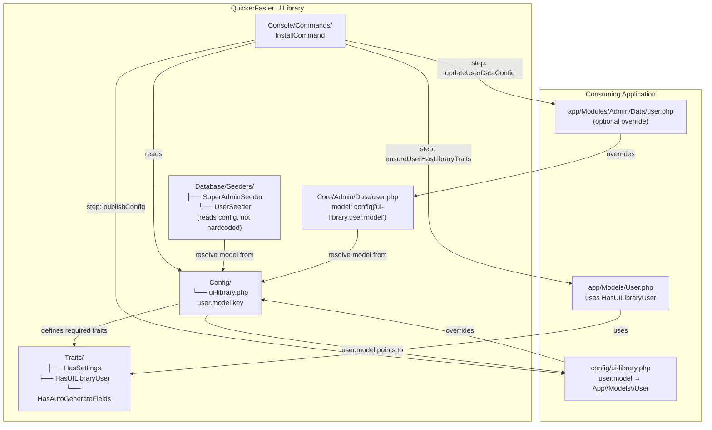

# User Model Unification Strategy & Install Command Design

**Status:** Draft — Review Required  
**Date:** 2026-08-12  
**Affected Areas:** `vendor/quicker-faster/ui-library/src/Core/Admin/`, seeders, config, install command

---

## 1. Current State Analysis

### 1.1 Model Hierarchy (post-patch)

```
Illuminate\Foundation\Auth\User (Authenticatable)
  └── App\Modules\Admin\Models\User          [HR app base]
      ├── traits: HasFactory, HasRoles, Notifiable, SoftDeletes
      ├── relations: company(), employee()
      ├── custom: validate() / save() override
      └── App\Models\User                     [consuming app]
          ├── traits: HasApiTokens, GetsOnboarded, HasSettings
          ├── implements: MustVerifyEmail, Onboardable
          └── fillable: name, email, status, password, company_id,
                        email_verified_at, has_seen_tour
```

**Critical finding:** The library directory `vendor/quicker-faster/ui-library/src/Core/Admin/Models/` is empty. There is no library-owned User model. The library's only User model concept is the data config at [`src/Core/Admin/Data/user.php`](vendor/quicker-faster/ui-library/src/Core/Admin/Data/user.php:4) which hardcodes `'model' => 'App\Models\User'`.

### 1.2 Hardcoded User Model References in the Library

| File | Reference | Severity |
|------|-----------|----------|
| [`user.php:4`](vendor/quicker-faster/ui-library/src/Core/Admin/Data/user.php:4) | `'model' => 'App\Models\User'` | **Critical** — the admin user data config ties itself to the consuming app's model class |
| [`SuperAdminSeeder.php:6`](vendor/quicker-faster/ui-library/src/Core/Admin/Database/Seeders/SuperAdminSeeder.php:6) | `use App\Models\User;` | **Critical** — seeder fails if consuming app uses a different namespace |
| [`UserSeeder.php:6`](vendor/quicker-faster/ui-library/src/Core/Admin/Database/Seeders/UserSeeder.php:6) | `use App\Models\User;` | **Critical** — same as above |
| [`RoleAssignmentManager.php:6`](vendor/quicker-faster/ui-library/src/Http/Livewire/AccessControls/RoleAssignmentManager.php:6) | `use App\Models\User;` | **High** — Livewire component hardcoded |
| Multiple dashboard widget configs | `'model' => 'App\\Modules\\Admin\\Models\\User'` | **Medium** — widgets reference HR-specific namespace; only work in HR-flavored installs |

### 1.3 Methods the Library Expects on the User Model

| Method / Attribute | Provided By | Currently Available? | Risk |
|---|---|---|---|
| `getSetting()`, `setSetting()`, `forgetSetting()` | `HasSettings` trait | ✅ Yes — `App\Models\User` uses `HasSettings` | None |
| `settings()` (morphMany) | `HasSettings` trait | ✅ Yes | None |
| `hasRole()`, `hasAnyRole()`, `assignRole()` | Spatie `HasRoles` | ✅ Yes — injected by `InstallCommand::ensureUserHasRolesTrait()` | None |
| `withoutCompanyScope()` | Multitenancy | ⚠️ Guarded — `ResolvesModels` uses `method_exists()` guard | Low |
| `has_seen_tour` | Column on users table | ✅ Yes — in `App\Models\User` fillable | None |
| `avatar_url` | Accessor or attribute | ⚠️ Guarded — blade uses `??` fallback | Low |
| `company_id` | Column on users table | ✅ Yes | None |
| `onboarding()` | Spatie Onboard | ✅ Yes — `App\Models\User` implements `Onboardable` | None |
| `can()` | Built-in `Authorizable` | ✅ Yes | None |

### 1.4 Tactical Patches Already Applied

These `method_exists()` guards have been placed as temporary mitigations:

- [`ResolvesModels.php:65-67`](vendor/quicker-faster/ui-library/src/Concerns/ResolvesModels.php:65) — guards `withoutCompanyScope()`
- [`SettingsPanel.php:134-169`](vendor/quicker-faster/ui-library/src/Http/Livewire/Settings/SettingsPanel.php:134) — `safeGetSetting()`, `safeSetSetting()`, `safeForgetSetting()` wrappers
- [`user.php`](vendor/quicker-faster/ui-library/src/Core/Admin/Data/user.php:246) — `profile` relation removed (was HR-specific)

**Assessment:** The tactical patches work. They prevent crashes for apps that don't use certain traits. But they add runtime overhead (a `method_exists` call on every model resolution) and don't solve the source problem: the library still hardcodes `App\Models\User`.

### 1.5 Existing Install Command

The command at [`InstallCommand.php`](vendor/quicker-faster/ui-library/src/Console/Commands/InstallCommand.php) already exists and handles:

1. Publish configs, views, migrations, assets
2. Deduplicate migrations
3. Run migrations with `--force`
4. `ensureUserHasRolesTrait()` — inject `HasRoles` into `app/Models/User.php`
5. Run seeders (RoleSeeder, SuperAdminSeeder, UserSeeder, SystemSettingsSeeder, OrganizationSeeder, NotificationTemplateSeeder)
6. Scaffold auth (Breeze)
7. Create storage link
8. Generate app key
9. Clear caches
10. Verify installation

**Gaps in the existing command:**
- Does NOT configure the `admin.user` data config model reference
- Does NOT add `HasSettings` trait or any other required traits
- Does NOT ask the user anything — fully automated, assumes `App\Models\User`
- Does NOT provide a migration path for existing apps

---

## 2. Strategy Recommendation

### 2.1 Comparison of Approaches

| Approach | Pros | Cons | Recommended? |
|---|---|---|---|
| **A: Trait-Based** | Non-invasive, composable, consumers keep their model, library provides reusable traits | Requires consumers to manually add traits; no enforcement | ⭐ Best for greenfield |
| **B: Override Model** | Simple — one-class solution, guaranteed all methods present | Destructive on existing apps; consumers lose their customizations; tight coupling | ❌ Too invasive |
| **C: Interface-Based** | Clean contracts, type-safe, self-documenting | Requires consumers to implement all methods; doesn't provide the implementation; more work for consumers | ❌ Too much work for consumers |
| **D: Hybrid** | Traits + config-driven model resolution + optional interface contracts; best of all worlds | Slightly more complex to set up initially | ⭐⭐ **RECOMMENDED** |

### 2.2 Recommendation: Hybrid Approach (Trait-Based + Config-Driven)

The recommended strategy combines:

1. **Traits for behavior** — The library provides composable traits that the consuming app's `User` model can use. The library does NOT own a User model; it only provides traits and defines what a well-equipped User model looks like.

2. **Config-driven model resolution** — All model references in library code use `config('ui-library.user.model')`, which defaults to `config('auth.providers.users.model')` (the standard Laravel way). The `admin.user` data config uses a dynamic `'model'` key that resolves at runtime instead of being hardcoded.

3. **Install command** — Automates adding required traits to any User model, regardless of namespace.

#### Why not keep the current patches?

The `method_exists()` guards work but:
- They add runtime overhead on every model resolution (`method_exists` is called in tight loops)
- They're defensive — they silently do nothing instead of telling the developer they're missing something
- They don't solve the root cause: hardcoded model references
- New library features will keep needing new guards

The hybrid approach eliminates the need for these guards entirely by ensuring the User model always has the required capabilities.

---

## 3. Required Traits

The library already provides one critical trait. The install command needs to ensure consuming apps use it.

### 3.1 Existing Trait: `HasSettings`

**File:** [`vendor/quicker-faster/ui-library/src/Traits/HasSettings.php`](vendor/quicker-faster/ui-library/src/Traits/HasSettings.php)

```php
namespace QuickerFaster\UILibrary\Traits;

trait HasSettings
{
    public function settings()
    {
        return $this->morphMany(
            \QuickerFaster\UILibrary\Models\SystemSetting::class,
            'settingable'
        );
    }

    public function getSetting(string $key, $default = null) { /* ... */ }
    public function setSetting(string $key, $value, ?string $group = null): void { /* ... */ }
    public function forgetSetting(string $key): void { /* ... */ }
    protected function getSettingCacheKey(string $key): string { /* ... */ }
}
```

**Status:** Already applied to `App\Models\User` in the quick-hr app. ✅

### 3.2 Existing Trait: `HasAutoGenerateFields`

**File:** [`vendor/quicker-faster/ui-library/src/Traits/HasAutoGenerateFields.php`](vendor/quicker-faster/ui-library/src/Traits/HasAutoGenerateFields.php)

Used by DataTable form components. Only needed if using auto-generated fields. Not required for basic User model operation.

### 3.3 Recommended New Trait: `HasUILibraryUser`

A single "meta-trait" that bundles the required library behaviors. This simplifies the install command — one `use` statement instead of many.

```php
// vendor/quicker-faster/ui-library/src/Traits/HasUILibraryUser.php
namespace QuickerFaster\UILibrary\Traits;

trait HasUILibraryUser
{
    use HasSettings;
    // Future: use HasNotifications, HasDashboardPreferences, etc.
}
```

**Design principle:** The `HasUILibraryUser` trait should be the single trait consumers add. It internally composes other library traits. New trait requirements are added here, and existing apps get them automatically on `composer update` (assuming they re-run the install command).

### 3.4 The Post-Install User Model (Target State)

```php
// app/Models/User.php — after running ui-library:install
namespace App\Models;

use Laravel\Sanctum\HasApiTokens;
use Illuminate\Contracts\Auth\MustVerifyEmail;
use Spatie\Onboard\Concerns\GetsOnboarded;
use Spatie\Onboard\Concerns\Onboardable;
use Spatie\Permission\Traits\HasRoles;
use QuickerFaster\UILibrary\Traits\HasUILibraryUser;

class User extends Authenticatable implements MustVerifyEmail, Onboardable
{
    use HasApiTokens, GetsOnboarded;
    use HasRoles;                  // ← Added by ensureUserHasRolesTrait()
    use HasUILibraryUser;          // ← Added by new ensureUserHasLibraryTraits()

    // ... rest of model unchanged
}
```

The consuming app can optionally extend a custom base model (like `App\Modules\Admin\Models\User` in quick-hr) — that's fine. The library only cares that the resolved User model has these traits.

---

## 4. Config Updates

### 4.1 Add `user.model` to `ui-library.php`

Add a new section to the published config:

```php
// config/ui-library.php (new section)
'user' => [
    /*
    |------------------------------------------------------------------
    | User Model Resolution
    |------------------------------------------------------------------
    | The fully-qualified class name of the User model. Defaults to
    | Laravel's auth provider configuration so it always matches your
    | application's actual User model, regardless of namespace.
    |
    | Override this if your application uses a non-standard User model
    | that differs from auth.providers.users.model.
    */
    'model' => env('UI_LIBRARY_USER_MODEL', config('auth.providers.users.model')),

    /*
    |------------------------------------------------------------------
    | Required Traits
    |------------------------------------------------------------------
    | Traits that the install command will attempt to add to the User
    | model. Consuming apps can add or remove entries to customise
    | which traits are auto-injected.
    */
    'required_traits' => [
        \QuickerFaster\UILibrary\Traits\HasUILibraryUser::class,
        \Spatie\Permission\Traits\HasRoles::class,
    ],
],
```

### 4.2 Update `admin.user` Data Config

The `user.php` data config should use a dynamic model reference instead of hardcoding `App\Models\User`:

**Change from:**
```php
// vendor/quicker-faster/ui-library/src/Core/Admin/Data/user.php
return [
    'model' => 'App\Models\User',
    // ...
];
```

**Change to:**
```php
// vendor/quicker-faster/ui-library/src/Core/Admin/Data/user.php
return [
    'model' => config('ui-library.user.model', config('auth.providers.users.model')),
    // ...
];
```

**Important consideration:** PHP config files loaded via `require` in [`ModelConfigRepository`](vendor/quicker-faster/ui-library/src/Services/Config/ModelConfigRepository.php:135) are evaluated at require-time. The `config()` helper is available at that point because Laravel's config is loaded before service providers register. However, if the config hasn't been published yet, `config('ui-library.user.model')` will be `null`. The fallback to `config('auth.providers.users.model')` handles this gracefully.

### 4.3 Update Seeders to Use Config-Driven Model Resolution

**SuperAdminSeeder.php** and **UserSeeder.php** should resolve the User model dynamically:

```php
use Illuminate\Database\Seeder;

class SuperAdminSeeder extends Seeder
{
    public function run(): void
    {
        $userModel = config('ui-library.user.model')
            ?? config('auth.providers.users.model')
            ?? 'App\\Models\\User';

        $email = env('SUPER_ADMIN_EMAIL', 'admin@example.com');
        $password = env('SUPER_ADMIN_PASSWORD', 'password');

        $user = $userModel::firstOrCreate(
            ['email' => $email],
            [
                'name' => 'Super Admin',
                'password' => bcrypt($password),
                'email_verified_at' => now(),
            ]
        );

        if (!$user->hasRole('super_admin')) {
            $user->assignRole('super_admin');
        }
    }
}
```

### 4.4 Update `RoleAssignmentManager` Livewire Component

Replace `use App\Models\User;` with dynamic resolution:

```php
class RoleAssignmentManager extends Component
{
    protected function getManageableUsers(): Collection
    {
        $userModel = config('ui-library.user.model')
            ?? config('auth.providers.users.model');

        $currentUser = auth()->user();
        $allUsers = $userModel::with('roles')->orderBy('name')->get();
        // ...
    }
}
```

### 4.5 Update Dashboard Widget Configs

The dashboard widget configs currently hardcode `App\Modules\Admin\Models\User`. These should be updated to use `config('ui-library.user.model')` or — since these are library-provided defaults — they could simply use the same dynamic resolution. However, these reference a *different* model (`App\Modules\Admin\Models\User`) than the data config (`App\Models\User`). This inconsistency needs to be fixed so ALL user-related configs point to the same model: `config('ui-library.user.model')`.

---

## 5. Install Command Design

### 5.1 Command Signature

```bash
php artisan ui-library:install
    {--no-auth : Skip auth scaffolding}
    {--no-seed : Skip database seeding}
    {--force : Force overwrite existing files}
    {--user-model= : FQCN of User model (default: auto-detect from auth config)}
```

### 5.2 Updated Step-by-Step Flow

The current InstallCommand has 12 steps. The new version keeps all of them and adds/modifies several:

```
1.  publishConfig()           — [MODIFIED] Publishes ui-library.php with new 'user.model' key
2.  publishViews()            — [unchanged]
3.  publishMigrations()       — [unchanged]
4.  publishAssets()           — [unchanged]
5.  publishVendorProviders()  — [unchanged]
6.  deduplicateMigrations()   — [unchanged]
7.  runMigrations()           — [unchanged]
8.  ★ configureUserModel()    — [NEW] Resolves User model, writes to config
9.  ★ ensureUserHasLibraryTraits() — [REPLACES ensureUserHasRolesTrait()] Adds HasUILibraryUser + HasRoles
10. ★ updateUserDataConfig()  — [NEW] Updates admin.user config model reference
11. runSeeders()              — [unchanged — seeders now use dynamic resolution]
12. scaffoldAuth()            — [unchanged]
13. createStorageLink()       — [unchanged]
14. generateAppKey()          — [unchanged]
15. clearCaches()             — [unchanged]
16. verifyInstallation()      — [MODIFIED] Checks user model config is valid
```

### 5.3 New Step: `configureUserModel()`

```php
protected function configureUserModel(): void
{
    $this->info('🔧 Configuring User model...');

    // 1. Determine target model
    $userModel = $this->option('user-model')
        ?? config('auth.providers.users.model')
        ?? 'App\\Models\\User';

    // 2. Verify the model class exists
    if (!class_exists($userModel)) {
        $this->error("   ❌ User model '{$userModel}' not found.");
        $this->warn("   Please create it first or specify with --user-model=");
        $this->hasErrors = true;
        return;
    }

    // 3. Write to ui-library config
    $configPath = config_path('ui-library.php');
    if (File::exists($configPath)) {
        $config = File::get($configPath);
        // Replace the user.model entry
        $config = preg_replace(
            "/'model'\s*=>\s*.*?(?=,)/",
            "'model' => '{$userModel}'",
            $config
        );
        File::put($configPath, $config);
        $this->info("   ✅ User model set to: {$userModel}");
    }

    // 4. Also set in runtime config
    config()->set('ui-library.user.model', $userModel);
}
```

### 5.4 New Step: `ensureUserHasLibraryTraits()`

Replaces the current `ensureUserHasRolesTrait()`. Detects the User model path from config, then injects both `HasRoles` and `HasUILibraryUser` traits (if missing).

```php
protected function ensureUserHasLibraryTraits(): void
{
    $this->info('🔍 Ensuring User model has required library traits...');

    $userModel = config('ui-library.user.model')
        ?? config('auth.providers.users.model');

    if (!class_exists($userModel)) {
        $this->warn('   ⚠️  Cannot locate User model to inject traits.');
        return;
    }

    $reflection = new \ReflectionClass($userModel);
    $filePath = $reflection->getFileName();

    // Check if file is in vendor/ (package-provided) — skip injection
    if (str_contains($filePath, base_path('vendor'))) {
        $this->info('   ⚠️  User model is vendor-provided. Skipping trait injection.');
        return;
    }

    $contents = File::get($filePath);
    $requiredTraits = config('ui-library.user.required_traits', [
        \QuickerFaster\UILibrary\Traits\HasUILibraryUser::class,
        \Spatie\Permission\Traits\HasRoles::class,
    ]);

    $modified = false;

    foreach ($requiredTraits as $trait) {
        $shortName = class_basename($trait);

        // Check if already used
        if (preg_match("/^\s*use\s+[^;]*\b{$shortName}\b[^;]*;/m", $contents)) {
            continue;
        }

        // Add import
        $importPattern = "/^(use\s+\S[^;]*;)\s*\n(?!\s*use)/m";
        if (preg_match($importPattern, $contents, $matches, PREG_OFFSET_CAPTURE)) {
            $pos = $matches[0][1] + strlen($matches[0][0]);
            $import = "\nuse {$trait};\n";
            $contents = substr_replace($contents, $import, $pos, 0);
            $modified = true;
        }

        // Add use statement inside class
        if (preg_match('/class\s+\w+\s+extends\s+\S+\s*\{/', $contents, $matches, PREG_OFFSET_CAPTURE)) {
            $pos = $matches[0][1] + strlen($matches[0][0]);
            $contents = substr_replace($contents, "\n    use {$shortName};", $pos, 0);
            $modified = true;
        }
    }

    if ($modified) {
        File::put($filePath, $contents);
        $this->info('   ✅ Library traits injected into User model.');
    } else {
        $this->info('   ✅ All required traits already present.');
    }
}
```

### 5.5 New Step: `updateUserDataConfig()`

Updates the `admin.user` data config to use dynamic model resolution. Since this config lives inside the vendor directory, we create an override in the consuming app:

```php
protected function updateUserDataConfig(): void
{
    $this->info('🔧 Updating admin.user data config...');

    $targetDir = app_path('Modules/Admin/Data');
    $targetFile = $targetDir . '/user.php';

    // Don't overwrite if consuming app has already published/customised it
    if (File::exists($targetFile)) {
        $this->info('   ✅ App-level admin.user config already exists. Skipping.');
        return;
    }

    // Create app-level override that changes only the 'model' key
    File::ensureDirectoryExists($targetDir, 0755, true);

    $userModel = config('ui-library.user.model')
        ?? config('auth.providers.users.model');

    $content = "<?php\n\n";
    $content .= "// App-level override for admin.user data config.\n";
    $content .= "// The library core config is merged with this override.\n";
    $content .= "// Only override keys that differ from the library default.\n\n";
    $content .= "return [\n";
    $content .= "    'model' => '{$userModel}',\n";
    $content .= "];\n";

    File::put($targetFile, $content);
    $this->info("   ✅ Created app-level override: {$targetFile}");
}
```

**Note:** This approach requires `ModelConfigRepository` to support merging app-level overrides with library defaults. Currently it does first-match-wins (app/Modules before vendor). The app-level config needs to be a **full** config, not a partial merge. So the install command should copy the full library config and only change the model reference.

**Alternative (simpler):** Modify the `InstallCommand::publishConfig()` step to also handle publishing the admin.user data config to `app/Modules/Admin/Data/user.php` with the corrected model reference. This way the [`ModelConfigRepository`](vendor/quicker-faster/ui-library/src/Services/Config/ModelConfigRepository.php:25-28) resolution works naturally — the app-level version wins.

### 5.6 Updated Step: `verifyInstallation()`

Add new checks to the verification step:

```php
// Check user model configuration
$userModel = config('ui-library.user.model');
if ($userModel && class_exists($userModel)) {
    $this->info("   ✅ User model configured: {$userModel}");

    // Check HasUILibraryUser trait
    if (has_trait($userModel, \QuickerFaster\UILibrary\Traits\HasUILibraryUser::class)) {
        $this->info('   ✅ HasUILibraryUser trait present on User model.');
    } else {
        $this->warn('   ⚠️  HasUILibraryUser trait missing from User model.');
    }

    // Check HasRoles trait
    if (has_trait($userModel, \Spatie\Permission\Traits\HasRoles::class)) {
        $this->info('   ✅ HasRoles trait present on User model.');
    } else {
        $this->warn('   ⚠️  HasRoles trait missing from User model.');
    }
} else {
    $this->warn('   ⚠️  User model not configured or class not found.');
}
```

---

## 6. Migration Path for Existing quick-hr App

### 6.1 Prerequisites

The quick-hr app currently works because of the tactical `method_exists()` patches. The migration path ensures existing functionality continues while adopting the strategic solution.

### 6.2 Migration Steps

1. **Update the library package** (`composer update quicker-faster/ui-library`) — brings in new traits, updated seeders, updated install command.

2. **Re-run install command** (non-destructive):
   ```bash
   php artisan ui-library:install --no-auth --no-seed
   ```
   The `--no-auth` and `--no-seed` flags prevent re-scaffolding auth and re-seeding. The command still:
   - Publishes updated configs (with new `user.model` key)
   - Injects `HasUILibraryUser` trait into `App\Models\User`
   - Creates app-level `admin.user` data config override

3. **Update `App\Models\User`** — After the install command runs, verify the model looks like:
   ```php
   class User extends BaseUser implements MustVerifyEmail, Onboardable
   {
       use HasApiTokens, GetsOnboarded, HasSettings; // HasSettings is now included via HasUILibraryUser
       // Or, ideally:
       use HasApiTokens, GetsOnboarded, HasUILibraryUser;
   }
   ```

   Since `HasUILibraryUser` already includes `HasSettings`, you can replace `HasSettings` with `HasUILibraryUser`. This is a safe, non-breaking change.

4. **Clean up tactical patches** (optional, can be done later):
   - The `method_exists()` guards in `ResolvesModels.php` and `SettingsPanel.php` can remain — they're harmless and act as defense-in-depth.
   - If the User model is guaranteed to have `HasUILibraryUser`, the guards are redundant but not harmful.

5. **Verify**:
   ```bash
   php artisan ui-library:install --no-auth --no-seed
   # Should report all checks passed
   ```

### 6.3 Rollback Plan

If something breaks:
1. Revert `App\Models\User` to use `HasSettings` instead of `HasUILibraryUser`
2. Remove `app/Modules/Admin/Data/user.php` (the override)
3. The library falls back to its default `user.php` which currently has `'model' => 'App\Models\User'` — which matches quick-hr anyway

---

## 7. Component Interaction Diagram



---

## 8. Summary of Changes

### Library Changes (vendor/quicker-faster/ui-library)

| # | File | Change |
|---|------|--------|
| 1 | `src/Traits/HasUILibraryUser.php` | **New** — meta-trait composing `HasSettings` |
| 2 | `src/Config/ui-library.php` | **Add** `user.model` and `user.required_traits` keys |
| 3 | `src/Core/Admin/Data/user.php` | **Modify** `'model'` to use `config('ui-library.user.model', ...)` |
| 4 | `src/Core/Admin/Database/Seeders/SuperAdminSeeder.php` | **Modify** to resolve User model from config |
| 5 | `src/Core/Admin/Database/Seeders/UserSeeder.php` | **Modify** to resolve User model from config |
| 6 | `src/Http/Livewire/AccessControls/RoleAssignmentManager.php` | **Modify** to resolve User model from config |
| 7 | `src/Console/Commands/InstallCommand.php` | **Add** `configureUserModel()`, `ensureUserHasLibraryTraits()`, `updateUserDataConfig()`; **modify** `verifyInstallation()` |
| 8 | Dashboard widget configs (multiple) | **Modify** to use `config('ui-library.user.model')` instead of `App\Modules\Admin\Models\User` |

### Consuming App Changes (post-install)

| # | File | Change |
|---|------|--------|
| 1 | `config/ui-library.php` | **Auto-generated** with `user.model` key |
| 2 | `app/Modules/Admin/Data/user.php` | **New** — override with correct model reference |
| 3 | `app/Models/User.php` | **Modified** — `HasSettings` → `HasUILibraryUser` (install command injects) |

### No Changes Needed

- `ResolvesModels.php` — `method_exists` guard is fine as defense-in-depth, no change needed
- `SettingsPanel.php` — `safe*` wrappers are fine as defense-in-depth, no change needed
- Any other library code — no changes needed; `config('ui-library.user.model')` is the single source of truth

---

## 9. Open Questions

1. **Should `ModelConfigRepository` support partial merging?** Currently it does first-match-wins. For the app-level `user.php` override to work without copying the entire library config, we'd need merging. Alternatively, the install command copies the full config.

2. **Should we add an `interface` contract?** For example, `Contracts\UserModel` with methods like `getSetting()`, `hasRole()`. Not strictly necessary now but provides type safety for future library code. Recommended as a follow-up.

3. **Should the install command be interactive or automated?** The current command is fully automated. Adding a `--user-model=` option gives flexibility without forcing interaction. The default auto-detection (`config('auth.providers.users.model')`) is correct for 95% of Laravel apps.