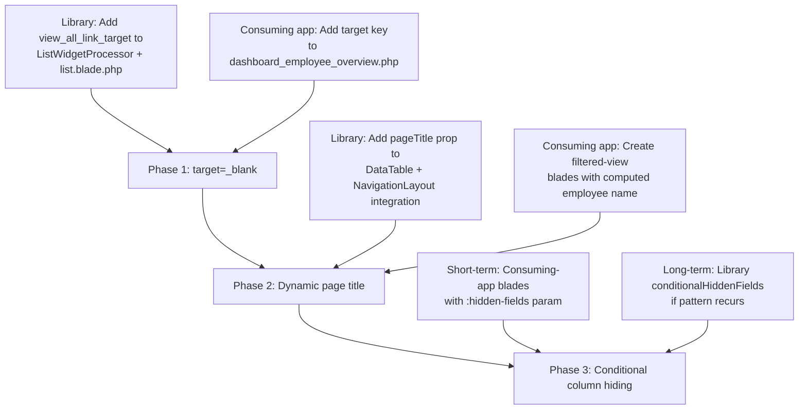

# Trade-Off Analysis: Dashboard "View All" Link UX Enhancements

> **Date**: 2026-08-27
> **Scope**: Employee-detail Overview dashboard → filtered data-table list pages
> **Principle**: Prefer generic library capabilities over consuming-app hacks

---

## Context Summary

The HR consuming app's employee-detail "Overview" dashboard has list widgets with "View all" links that open data-table pages filtered by `?filter[employee_id]=...`. Three UX enhancements are under consideration:

| # | Enhancement | Affected URLs |
|---|-------------|---------------|
| 1 | Hide redundant `employee_id`/`employee_number` columns | `/leave/leave-requests?filter[employee_id]=1`, `/attendance/attendances?filter[employee_id]=1`, `/attendance/clock-events?filter[employee_id]=1` |
| 2 | Customize table title (e.g. "Leave Requests — John Doe") | Same pages |
| 3 | Open links in new browser tab (`target="_blank"`) | Dashboard widget "View all" links |

---

## A. Column Visibility — Hide `employee_id` on Filtered Views

### Current Architecture

**Config-level hiding** ([`hiddenFields.onTable`](docs/consuming-app/data-configs.md:150)):
- Static array in the data config — hides columns from ALL table views using that config.
- All three configs (`leave_request.php`, `attendance.php`, `clock_event.php`) have `showHideColumns: true` and `tableDefaultFields` defined.
- `employee_id` is **NOT** in `hiddenFields.onTable` for any of them — it is visible on the standalone list page (where it's useful for filtering/searching).

**User-level column manager** ([`ColumnManager.php`](src/Http/Livewire/ColumnManager.php:8)):
- Livewire component that lets users toggle columns on/off per config key.
- Persists preferences in session (`visible_columns_{configKey}`).
- Default visible set comes from `tableDefaultFields` config or falls back to first 6 columns.

**Runtime `hiddenFields` parameter** ([`DataTable.php`](src/Http/Livewire/DataTables/DataTable.php:108-116)):
- `mount()` accepts `array $hiddenFields = []`.
- `initializeFromConfig()` merges runtime `$this->hiddenFields` with config-level `hiddenFields` ([line 977-984](src/Http/Livewire/DataTables/DataTable.php:977)).
- This means a blade template can pass `:hidden-fields="['onTable' => ['employee_id']]"` to hide `employee_id` at runtime.

### The Core Problem

The **same config** (`leave.leave_request`, `attendance.attendance`, `attendance.clock_event`) is shared between:
1. **Standalone list page** — where `employee_id` is a useful filterable/searchable column
2. **Filtered view from dashboard** — where `employee_id` is redundant (all rows are for the same employee)

Adding `employee_id` to `hiddenFields.onTable` would hide it **globally**, breaking the standalone page.

### Options

| Option | Mechanism | Scope | Pros | Cons |
|--------|-----------|-------|------|------|
| **A1. Config `hiddenFields.onTable`** | Add `employee_id` to the static array | Global | Simplest | Breaks standalone list page — unacceptable |
| **A2. Runtime `hiddenFields` param** | Pass `:hidden-fields` to `<livewire:qf.data-table>` in a dedicated blade | Per-invocation | Already supported; no library changes | Requires separate blade template per filtered view; consuming-app only |
| **A3. New library capability: conditional column visibility** | Add a `hiddenFieldsWhenFiltered` or URL-param-driven mechanism to the DataTable | Library-wide | Generic, reusable across all consuming apps | Medium implementation effort; adds config surface area |
| **A4. `tableDefaultFields` adjustment** | Exclude `employee_id` from `tableDefaultFields` so it's hidden by default but users can re-enable | Global | Low effort | Users on standalone page lose the column by default; they can re-enable but it's a regression |

### Trade-Off Assessment

| Dimension | Rating | Rationale |
|-----------|--------|-----------|
| **Effort** | Low (A2) / Medium (A3) | A2 is a one-line blade change per filtered view. A3 requires library changes to DataTable + ColumnManager + config schema. |
| **UX Value** | Medium | Removing a redundant column reduces visual noise, but `employee_id` is rendered as the employee's number/name (via relationship display), so it's not a raw ID — it's somewhat informative. |
| **Risk** | Low (A2) / Medium (A3) | A2 is isolated to new blade files. A3 touches core DataTable initialization and needs careful regression testing. |

### Recommendation: **Defer — Medium priority**

**Short-term (A2)**: Create dedicated blade templates for the filtered views (e.g., `leave-requests-by-employee.blade.php`) that pass `:hidden-fields="['onTable' => ['employee_id']]"`. This is a consuming-app-only change, zero library risk, and can be done now.

**Long-term (A3)**: Consider a library-level `conditionalHiddenFields` feature if the pattern recurs across multiple consuming apps. This would allow configs like:
```php
'conditionalHiddenFields' => [
    'onTable' => [
        'whenFiltered' => ['employee_id'],  // hide when ?filter[employee_id]=... is present
    ],
],
```

---

## B. Table Title Customization — "Leave Requests — John Doe"

### Current Architecture

**Page title derivation** ([`NavigationLayout.php`](src/Components/NavigationLayout.php:359-371)):
```php
public function getPageTitle(): string
{
    $parts = [];
    if ($this->activeContext && isset($this->contextGroups[$this->activeContext])) {
        $parts[] = $this->contextGroups[$this->activeContext]['label'];
    }
    if ($this->currentContextItem) {
        $titlePart = $this->currentContextItem['page_title'] ?? $this->currentContextItem['label'];
        $parts[] = $titlePart;
    }
    return implode(' - ', $parts);
}
```
- The title comes from **navigation config** (`contextGroups` + `contextItems`), NOT from the data config.
- The data config schema documents a top-level `'title'` key ([data-configs.md:31](docs/consuming-app/data-configs.md:31)), but **none of the three configs use it** — and the DataTable component doesn't read it for page title purposes.
- The `pageTitle` config key is only used by Export/Print controllers, not by the DataTable or NavigationLayout.

**Existing filtered-view pattern** ([`my-leave.blade.php`](https://example.com)):
- The `my-leave.blade.php` and `my-attendance.blade.php` views **disable the title entirely** via `'title' => ['enabled' => false]` in the navigation layout overrides.
- They use `:query-filters` to filter by employee but don't customize the title.

**Where the employee name comes from**:
- The `employee_id` is available from `request()->query('filter')['employee_id']`.
- The DataTable already resolves `employee_id` → `employee.employee_number` via the `belongsTo` relationship for display in filter badges.
- To get the full name: `Employee::find($employeeId)->full_name` or `first_name . ' ' . last_name`.

### Options

| Option | Mechanism | Scope | Pros | Cons |
|--------|-----------|-------|------|------|
| **B1. Consuming-app blade override** | Create a dedicated blade that passes a custom title to NavigationLayout | Per-view | No library changes; immediate | Requires separate blade per filtered view; doesn't scale |
| **B2. New `pageTitle` param on DataTable** | Add a `$pageTitle` property to DataTable that overrides the navigation-derived title | Library | Generic; any DataTable invocation can customize its title | Touches NavigationLayout + DataTable; needs careful integration with existing title pipeline |
| **B3. Data config `title` key with placeholder support** | Make the config `'title'` key support `{employee_name}` placeholders resolved at runtime | Library | Declarative; lives in config; reusable | Complex: requires a placeholder resolution engine; the employee name isn't trivially available from the config alone |
| **B4. Navigation layout `overrides` with dynamic title** | Pass a computed title via the existing `overrides` mechanism | Consuming-app | Uses existing infrastructure | The `overrides` are static at render time in the blade; would need the blade to compute the title |

### Trade-Off Assessment

| Dimension | Rating | Rationale |
|-----------|--------|-----------|
| **Effort** | Medium-High | No existing mechanism supports dynamic, data-driven page titles. Any solution requires new library infrastructure (B2/B3) or per-view blade logic (B1/B4). |
| **UX Value** | High | Contextual titles ("Leave Requests — John Doe") significantly improve orientation, especially when multiple tabs are open. This is the highest-value enhancement of the three. |
| **Risk** | Medium | Touching the title pipeline affects every page. The NavigationLayout's `getPageTitle()` is called in the constructor — dynamic titles need to work within that lifecycle. |

### Recommendation: **Do it — High priority, but via library infrastructure (B2)**

The cleanest approach is **Option B2**: Add an optional `$pageTitle` public property to the `DataTable` component. When set, it propagates to the `NavigationLayout` to override the derived title.

**Proposed implementation sketch**:
1. Add `public ?string $pageTitle = null;` to [`DataTable.php`](src/Http/Livewire/DataTables/DataTable.php:22).
2. In `NavigationLayout`, check for a `pageTitle` override from the child component or session.
3. The consuming app's filtered blade passes: `<livewire:qf.data-table ... :page-title="'Leave Requests — ' . $employeeName" />`.

This is a **library-level capability** that benefits all consuming apps. The employee name lookup happens in the consuming app's blade (where the `Employee` model is available), keeping the library generic.

---

## C. `target="_blank"` on "View All" Links

### Current Architecture

**Widget blade** ([`list.blade.php`](src/Resources/views/widgets/list.blade.php:37)):
```blade
<a href="{{ $data['viewAllLink'] }}" class="btn btn-sm btn-link">View All</a>
```
- No `target` attribute. No `rel` attribute.
- The `viewAllLink` comes from the dashboard config's `view_all_link` key.

**Dashboard config examples**:
- `'/leave/leave-requests?filter[employee_id]={{ employee_id }}'` (employee overview)
- `'/leave/leave-requests'` (HR dashboard)
- `'/attendance/attendances?filter[employee_id]={{ employee_id }}'`

### Options

| Option | Mechanism | Scope | Pros | Cons |
|--------|-----------|-------|------|------|
| **C1. Library blade change (global)** | Add `target="_blank" rel="noopener noreferrer"` to the anchor in `list.blade.php` | All list widgets, all apps | Simplest; one-line change | Forces ALL "View all" links to open in new tabs — may not be desired for all dashboards |
| **C2. Config-driven per widget** | Add `view_all_link_target` config key to dashboard widget schema | Per-widget | Flexible; opt-in | Adds config surface area; each widget author must decide |
| **C3. Consuming-app blade publish** | Publish the `list.blade.php` and modify locally | Per-app | No library risk | Not reusable; maintenance burden |

### Security Note
`target="_blank"` without `rel="noopener noreferrer"` is a **security vulnerability** — the opened page can access `window.opener` and potentially redirect the parent page (tabnabbing). Any implementation MUST include `rel="noopener noreferrer"`.

### Trade-Off Assessment

| Dimension | Rating | Rationale |
|-----------|--------|-----------|
| **Effort** | Low | One-line change in `list.blade.php` (C1) or a config key + blade conditional (C2). |
| **UX Value** | Medium | Opening in a new tab preserves the dashboard context — users don't lose their place. However, excessive new tabs can be annoying. Best as an opt-in per widget. |
| **Risk** | Low (C2) / Medium (C1) | C1 is a breaking behavioral change for all consuming apps. C2 is opt-in and safe. |

### Recommendation: **Do it now — Low effort, via config-driven approach (C2)**

**Option C2** is the right approach:
1. Add an optional `view_all_link_target` key to the dashboard widget schema (default: `_self`).
2. In [`list.blade.php`](src/Resources/views/widgets/list.blade.php:37), conditionally add `target` and `rel`:
```blade
<a href="{{ $data['viewAllLink'] }}"
   class="btn btn-sm btn-link"
   @if(($data['viewAllLinkTarget'] ?? '_self') === '_blank')
       target="_blank" rel="noopener noreferrer"
   @endif
>View All</a>
```
3. In [`ListWidgetProcessor.php`](src/Widgets/ListWidgetProcessor.php:62-73), pass through the new key.
4. The consuming app's dashboard config adds `'view_all_link_target' => '_blank'` to the relevant widgets.

This is a **library-level capability** — generic, opt-in, secure by default.

---

## D. Overall Recommendation & Prioritized Sequence

### Priority Matrix

| Enhancement | Effort | UX Value | Risk | Priority | Where |
|-------------|--------|----------|------|----------|-------|
| **C. `target="_blank"`** | Low | Medium | Low | **1st — Quick Win** | Library |
| **B. Dynamic title** | Medium-High | High | Medium | **2nd — High Value** | Library |
| **A. Hide columns** | Low-Medium | Medium | Low | **3rd — Deferrable** | Consuming app (short-term), Library (long-term) |

### Recommended Sequence



### Detailed Sequence

#### Phase 1: `target="_blank"` (Quick Win — do immediately)

**Library changes** (3 files):
1. [`ListWidgetProcessor.php`](src/Widgets/ListWidgetProcessor.php:62-73) — pass through `viewAllLinkTarget` from config.
2. [`list.blade.php`](src/Resources/views/widgets/list.blade.php:37) — conditional `target` + `rel`.
3. [`data-configs.md`](docs/consuming-app/data-configs.md) — document the new key.

**Consuming app changes** (1 file):
- [`dashboard_employee_overview.php`](https://example.com) — add `'view_all_link_target' => '_blank'` to the three list widgets (leave requests, attendance, clock events).

**Rationale**: Lowest effort, immediate UX improvement, zero regression risk (opt-in), library-generic.

#### Phase 2: Dynamic Page Title (High Value — do next)

**Library changes** (2-3 files):
1. [`DataTable.php`](src/Http/Livewire/DataTables/DataTable.php:22) — add `public ?string $pageTitle = null;` property, accept in `mount()`.
2. [`NavigationLayout.php`](src/Components/NavigationLayout.php:359) — check for a DataTable-provided `pageTitle` override (via session or Livewire event).
3. Possibly a new `PageTitleOverride` concern/trait if the mechanism needs to be reusable beyond DataTable.

**Consuming app changes** (3 new blade files):
- `leave-requests-by-employee.blade.php`
- `attendances-by-employee.blade.php`
- `clock-events-by-employee.blade.php`

Each blade resolves the employee name from the `employee_id` query parameter and passes it as `:page-title`.

**Rationale**: Highest UX value. The library infrastructure is a one-time investment that benefits all consuming apps. The consuming-app blades are thin wrappers.

#### Phase 3: Conditional Column Hiding (Deferrable)

**Short-term** (consuming app only):
- Reuse the Phase 2 blade files to also pass `:hidden-fields="['onTable' => ['employee_id']]"`.

**Long-term** (library, if pattern recurs):
- Add `conditionalHiddenFields` to the data config schema.
- Implement in `DataTable::initializeFromConfig()` to check URL parameters against the conditions.

**Rationale**: The short-term fix is trivial once the Phase 2 blades exist. The long-term library feature is only warranted if multiple consuming apps need this pattern.

---

## Summary

| Enhancement | Verdict | Implementation Locus |
|-------------|---------|---------------------|
| `target="_blank"` | **Do now** — config-driven, library-level | Library (`ListWidgetProcessor` + `list.blade.php`) |
| Dynamic title | **Do next** — `pageTitle` prop on DataTable | Library (`DataTable` + `NavigationLayout`) |
| Hide `employee_id` column | **Defer** — short-term via `:hidden-fields`, long-term library if needed | Consuming app blades (short-term) |

All three enhancements should be implemented as **generic library capabilities** rather than consuming-app hacks, consistent with the library's "root infrastructure" philosophy. The consuming app then consumes these capabilities through configuration and thin blade wrappers.