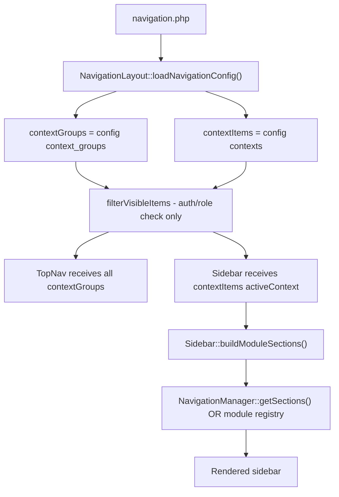
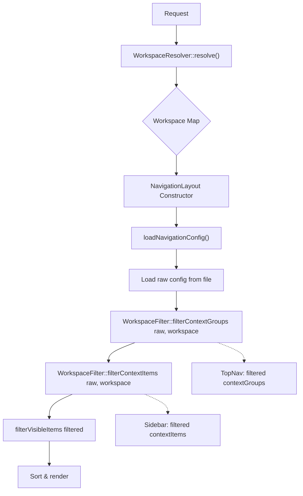

# Workspace Parameter: Navigation Config Analysis

> **Date**: 2026-08-10  
> **Context**: Multi-tenant HR system needs workspace-aware sidebar navigation  
> **Source Config**: [`app/Modules/Hr/Config/navigation.php`](../../LaravelProjects/quick-hr/app/Modules/Hr/Config/navigation.php) (514 lines)

---

## 1. Current Architecture Recap

The current navigation pipeline works as follows:



**Key observation**: At no point in this pipeline does anything reference a "workspace". The config is loaded as a static array, filtered only by auth visibility (`any`/`auth`/`guest`/`role:`/`permission:`), and rendered. There is no mechanism to say:

- "For company B, don't show Departments"
- "For payroll managers only, show Payroll Runs"
- "For engineering department, show engineering-specific reports"

---

## 2. Scenario Analysis

### Scenario 1: Multi-Company / Multi-Tenant

**The concrete problem**: A user belongs to Company A and Company B. Company A has Departments enabled (uses `view_department`). Company B does not use Departments at all (Departments module disabled or feature flag off).

**Without workspace awareness**: Clicking the "Organization" top nav tab shows the same sidebar for both companies:

```
[Overview] [Locations] [Companies] [Departments]
```

When Company B is active and the user clicks "Departments", they navigate to `/hr/departments` which either:
- Shows an empty table (no departments for Company B)
- Shows a 403/404 error page (permission denied)
- Shows departments scoped to null/wrong company

The item exists in the sidebar but leads to a dead end.

**Affected HR config items**:

| Config Section | Items Affected |
|---|---|
| `contexts['Organization']` | `company_profile_overview`, `location`, `company`, `department` |
| `contexts['people']` | All items — `employee_group`, `tag`, `team` may vary by company |
| `contexts['policies']` | `work_pattern`, `employee_work_pattern` — some companies don't use work patterns |
| `contexts['payroll']` | `payroll_policy`, `payroll_policy_assignment` — policy model varies by company |
| `contexts['time']` | `shift_schedule`, `shift` — not all companies use shift-based attendance |
| `context_groups['time']` | Entire group may need to be hidden if Time & Attendance not purchased |

**How workspace-aware resolution would fix it**:

A `workspace` parameter containing `company_id` (e.g., `['company_id' => 5]`) enables the config resolver to filter items based on the active tenant. For Company B (which has no departments module):

```php
// Config: items tagged with feature gates
'contexts' => [
    'Organization' => [
        ['key' => 'company_profile_overview', /* ... */, 'feature' => 'organization_overview'],
        ['key' => 'location',   /* ... */, 'feature' => 'locations'],
        ['key' => 'company',    /* ... */, 'feature' => 'companies'],
        ['key' => 'department', /* ... */, 'feature' => 'departments'],  // ← feature gate
    ],
],
```

The workspace resolver checks Company B's enabled features: `['organization_overview', 'locations', 'companies']` (no `departments`). The `department` item is stripped before rendering.

**Result**:
- Company A active → Sidebar: [Overview, Locations, Companies, Departments]
- Company B active → Sidebar: [Overview, Locations, Companies]

---

### Scenario 2: Role-Based Sidebar Items

**The concrete problem**: A Payroll Manager should see "Payroll Runs", "Payslips", "Pay Schedules", "Payroll Policies", and adjustment tools. A regular Employee should only see "Payslips" (to view their own payslips) and maybe "Employee Profiles" (their own payroll profile).

**Without workspace awareness**: The sidebar currently relies on Spatie `permission` strings on each item (e.g., `view_payroll_run`, `view_payroll_payslip`). These are checked at render time via [`NavigationFilter::checkVisibility()`](../../src/Traits/NavigationFilter.php:28-54). For a regular employee, all payroll items render in the DOM initially, but those without the permission are filtered out.

The problem is subtle but real:
1. **All items are loaded into config** — they exist in `$contextItems` before filtering
2. **Permission filtering happens post-load** — it's a runtime gate, not a structural change
3. **Items the user can NEVER see** still participate in ordering, counts, and wire:key generation
4. **No differentiation by context** — a user with `view_payroll_payslip` sees `payslips` in every company, even if payslips are not generated in Company B

**Affected HR config items**:

| Config Section | Items Affected |
|---|---|
| `contexts['payroll']` | All 10 items: `payroll_overview`, `pay_schedule`, `employee_payroll_profile`, `payroll_run`, `payroll_payslip`, `payroll_policy`, `payroll_run_adjustment`, `employee_adjustment_profile`, `payslip_item`, `payroll_policy_assignment` |

**How workspace-aware resolution would fix it**:

The `workspace` parameter includes `role` context. The config uses `role:` visibility rules on items (already partially supported by `NavigationFilter`):

```php
'contexts' => [
    'payroll' => [
        // Admin/Manager items
        ['key' => 'payroll_overview',     'visibility' => 'role:payroll_admin|role:payroll_manager'],
        ['key' => 'pay_schedule',         'visibility' => 'role:payroll_admin|role:payroll_manager'],
        ['key' => 'payroll_run',          'visibility' => 'role:payroll_admin|role:payroll_manager'],
        ['key' => 'payroll_policy',       'visibility' => 'role:payroll_admin'],
        ['key' => 'payroll_run_adjustment','visibility' => 'role:payroll_admin|role:payroll_manager'],
        ['key' => 'employee_adjustment_profile', 'visibility' => 'role:payroll_admin|role:payroll_manager'],
        ['key' => 'payslip_item',         'visibility' => 'role:payroll_admin'],
        ['key' => 'payroll_policy_assignment', 'visibility' => 'role:payroll_admin'],
        // Everyone items
        ['key' => 'payroll_payslip',      'visibility' => 'any'],
        ['key' => 'employee_payroll_profile', 'visibility' => 'any'],
    ],
],
```

The resolver reads the user's role from the workspace context and applies structural filtering — items without matching `visibility` are removed from the array entirely, not just hidden from rendering.

**Result**:
- Payroll Manager active → Sidebar: All 10 items
- Regular Employee active → Sidebar: [Payslips, Employee Profiles] (2 items)

---

### Scenario 3: Department-Level Variations

**The concrete problem**: HR managers for different departments need different report shortcuts. Engineering HR manager needs Engineering-specific attendance/leave reports. Sales HR manager needs Sales-specific headcount and commission reports.

**Without workspace awareness**: `contexts['reports']` contains only one generic item:

```php
'contexts' => [
    'reports' => [
        ['key' => 'saved_report', 'label' => 'Saved Reports', 'route' => '/saved-reports', ...],
    ],
],
```

All reports for all departments are in the same list. Users navigate through a long, undifferentiated list. There's no "Engineering Attendance Report" vs "Sales Pipeline Report" distinction in the sidebar.

**Affected HR config items**:

| Config Section | Items Affected |
|---|---|
| `contexts['reports']` | Currently only `saved_report` (1 item), but this is the primary extension point |
| `contexts['time']` | `saved_report` within the Time context (line 394) — another reports entry point |
| `context_groups['reports']` | The group label itself may need contextual naming |

**How workspace-aware resolution would fix it**:

The workspace parameter includes `department_id` and `department_type`. The config provides department-scoped report items:

```php
'contexts' => [
    'reports' => [
        // Base items (shown to all)
        ['key' => 'saved_report', 'label' => 'Saved Reports', 'route' => '/saved-reports', ...],
        ['key' => 'report_builder', 'label' => 'Report Builder', 'route' => '/reports/builder', ...],

        // Department-scoped shortcuts
        ['key' => 'eng_attendance_report', 'label' => 'Engineering Attendance',
         'route' => '/reports/attendance?department=engineering',
         'workspace' => ['department_type' => 'engineering']],

        ['key' => 'sales_headcount_report', 'label' => 'Sales Headcount',
         'route' => '/reports/headcount?department=sales',
         'workspace' => ['department_type' => 'sales']],

        ['key' => 'sales_commission_report', 'label' => 'Commission Report',
         'route' => '/reports/commissions?department=sales',
         'workspace' => ['department_type' => 'sales']],
    ],
],
```

The workspace resolver reads `['department_type' => 'engineering']` and includes only matching items plus items with no `workspace` constraint.

**Result**:
- Engineering HR Manager → Sidebar: [Saved Reports, Report Builder, Engineering Attendance]
- Sales HR Manager → Sidebar: [Saved Reports, Report Builder, Sales Headcount, Commission Report]
- Finance HR Manager → Sidebar: [Saved Reports, Report Builder] (department-specific reports omitted)

---

### Scenario 4: Feature-Flagged Modules

**The concrete problem**: Company A has purchased the "Time & Attendance" module. Company B has not. The `time` context group and all its items should be hidden entirely for Company B's users.

**Without workspace awareness**: The `context_groups['time']` entry appears in the top nav regardless of which company is active. Company B's users see the "Time" tab, click it, and either:

- Get an empty sidebar (items filtered by permission: no one has `view_attendance` in Company B)
- Get permission-denied pages
- See data from the wrong or null company

The entire module's items are still loaded into config, sorted, ordered, and checked against permissions — purely wasted computation.

**Affected HR config items**:

| Config Section | Items Affected |
|---|---|
| `context_groups['time']` | Entire group — should be hidden when Time module not licensed |
| `contexts['time']` | All 7 items: `attendance_overview`, `saved_report`, `attendance`, `shift_schedule`, `holiday_calendar`, `holiday`, `shift` |
| `contexts['attendance_adjustment']` | 1 item (orphan context — not linked to any context_group) |
| `contexts['clock_event']` | 1 item (orphan context) |
| `contexts['attendance_session']` | 1 item (orphan context) |

**How workspace-aware resolution would fix it**:

The workspace parameter includes `features` — the set of purchased/enabled feature flags for the active company. Config groups are tagged with a `feature` gate:

```php
'context_groups' => [
    'people' => [
        'label' => 'People',
        'feature' => 'core_hr',        // ← always-on base module
        // ...
    ],
    'payroll' => [
        'label' => 'Payroll',
        'feature' => 'payroll',
        // ...
    ],
    'time' => [
        'label' => 'Time',
        'feature' => 'time_attendance', // ← feature flag
        // ...
    ],
    'leave' => [
        'label' => 'Leave',
        'feature' => 'leave_management',
        // ...
    ],
],
```

The resolver checks `workspace['features']` (e.g., `['core_hr', 'payroll', 'leave_management']` — no `time_attendance`). The entire `time` group is excluded from `$contextGroups` before the top nav even renders.

**Result**:
- Company A (full license) → Top Nav: [People, Payroll, Leave, Time, Organization, Policies, Reports]
- Company B (base license) → Top Nav: [People, Payroll, Leave, Organization, Policies, Reports] — no Time tab

---

### Scenario 5: Payroll Period / Temporal Context

**The concrete problem**: During active payroll processing (e.g., pay period April 1-15, processing window open), the sidebar should show "Current Payroll Run" as a prominent, highlighted item. During off-cycle periods, it should be hidden or greyed out.

**Without workspace awareness**: "Payroll Runs" is always in the sidebar under Payroll. There's no way to:
- Promote/highlight it during active processing
- Add a temporary "Verify & Submit Payroll" action item
- Add a "Pending Approvals" badge count

The sidebar is completely static per user/permission, with no awareness of temporal state.

**Affected HR config items**:

| Config Section | Items Affected |
|---|---|
| `contexts['payroll']` | `payroll_run` — needs dynamic visibility and possibly extra sibling items |
| Shared items | Could benefit from temporary `shared_items` injected during payroll processing |

**How workspace-aware resolution would fix it**:

The workspace parameter includes `payroll_state` (e.g., `'active'`, `'idle'`, `'closing'`). The config provides state-scoped items:

```php
'contexts' => [
    'payroll' => [
        // Always visible
        ['key' => 'payroll_overview', ...],

        // State-dependent items
        [
            'key' => 'current_payroll_run',
            'label' => '⚠ Current Payroll Run',
            'icon' => 'fas fa-exclamation-triangle',
            'route' => '/hr/payroll-runs/current',
            'order' => 1,  // promoted to top when active
            'workspace' => ['payroll_state' => 'active'],
        ],
        [
            'key' => 'verify_submit',
            'label' => 'Verify & Submit',
            'icon' => 'fas fa-check-double',
            'route' => '/hr/payroll-runs/current/verify',
            'order' => 2,
            'workspace' => ['payroll_state' => 'active'],
        ],
        [
            'key' => 'pending_approvals',
            'label' => 'Pending Approvals (3)',
            'icon' => 'fas fa-clock',
            'route' => '/hr/payroll-runs/current/approvals',
            'order' => 3,
            'badge' => 3,  // dynamic — could be resolved at runtime
            'workspace' => ['payroll_state' => 'active'],
        ],

        // Default items (shown when idle)
        ['key' => 'payroll_run', 'label' => 'Payroll Runs', 'order' => 999, ...],
    ],
],
```

**Result**:
- During active payroll → Sidebar order: [⚠ Current Payroll Run, Verify & Submit, Pending Approvals (3), Overview, Pay Schedules, Employee Profiles, ...]
- During idle period → Sidebar order: [Overview, Pay Schedules, Employee Profiles, Payroll Runs, ...] — "Current Payroll Run" and action items hidden

---

## 3. Config Extension Options Comparison

### What Is a "Workspace"?

A workspace is a **resolved key-value map** produced once per request by a `WorkspaceResolver` contract:

```php
interface WorkspaceResolver
{
    /**
     * Resolve the active workspace context for the current request.
     *
     * Returns a map of workspace dimensions and their current values.
     * Example:
     * [
     *     'company_id'       => 5,
     *     'company_feature_set' => ['core_hr', 'payroll', 'leave_management'],
     *     'role'             => 'hr_manager',
     *     'department_id'    => 12,
     *     'department_type'  => 'engineering',
     *     'payroll_state'    => 'active',
     * ]
     */
    public function resolve(): array;
}
```

The consuming application provides the implementation. The library provides the contract and the filtering engine.

---

### Option A: Top-Level Workspace Key

```php
return [
    // Base config (default — no workspace)
    'context_groups' => [ /* ... */ ],
    'contexts' => [ /* ... */ ],

    // Workspace-specific overrides as complete replacement trees
    'workspace' => [
        'company_a' => [
            'context_groups' => [
                'Organization' => [ /* complete override */ ],
                'time' => [ /* complete override */ ],
            ],
            'contexts' => [
                'Organization' => [ /* complete override */ ],
                'time' => [ /* complete override */ ],
            ],
        ],
        'company_b' => [
            'context_groups' => [
                // Organization group: remove time group
            ],
            'contexts' => [
                'Organization' => [
                    // Same as base but without departments
                    ['key' => 'company_profile_overview', ...],
                    ['key' => 'location', ...],
                    ['key' => 'company', ...],
                    // department omitted
                ],
            ],
        ],
    ],
];
```

**Pros**:
- Clean separation: each workspace has its own complete config
- Easy to reason about: "what does Company B see?" → find `company_b` key
- No merge logic complexity

**Cons**:
- **Config duplication**: Company B's config re-declares all shared items (Overview, Locations, Companies), duplicating 80% of the base config
- **Config drift**: Adding a new item to the base means adding it to every workspace override
- **Explodes with dimensions**: Combining company × role × department × payroll_state creates a Cartesian product of workspace keys
- **File size**: For 50 companies × 5 roles × 10 departments, the config file becomes unmanageable
- **Not composable**: Can't say "Company B + Payroll Manager" — each combination needs its own key

**Verdict**: ❌ Only viable for 2-3 static workspaces. Fails for real multi-tenant systems.

---

### Option B: Per-Item Workspace Scoping

```php
'contexts' => [
    'Organization' => [
        ['key' => 'company_profile_overview', ...],  // no workspace = all
        ['key' => 'location',   'workspace' => ['company_a', 'company_b']],
        ['key' => 'company',    'workspace' => ['company_a', 'company_b']],
        ['key' => 'department', 'workspace' => ['company_a']],  // only Company A
    ],
    'people' => [
        ['key' => 'employee',   'workspace' => ['role:hr_manager', 'role:admin']],
        ['key' => 'employee_profile', 'workspace' => ['any']],
    ],
],
'context_groups' => [
    'time' => [
        'label' => 'Time',
        'workspace' => ['feature:time_attendance'],
        // ...
    ],
],
```

**Pros**:
- **Fine-grained**: Each item individually scoped
- **No duplication**: Base items declared once, workspace constraints additively applied
- **Incremental**: Easy to add workspace scoping to existing configs
- **Natural fit**: Aligns with how developers think about items — "this item belongs to these workspaces"

**Cons**:
- **Verbose for large configs**: The `'workspace' => ['company_a', 'company_b', 'company_c']` pattern repeated across dozens of items
- **Inclusion-only**: Can only say "show in these workspaces", can't easily say "show everywhere except..."
- **Workspace list maintenance**: Adding Company C means touching every item that should include it
- **Cross-cutting concerns**: If a feature flag disables an entire group, must annotate every item in that group (or annotate the group too)

**Verdict**: ✅ Good for fine-grained item control. Needs an exclusion syntax and group-level scoping as complements.

---

### Option C: Workspace as context_group Modifier

```php
'context_groups' => [
    'Organization' => [
        'label' => 'Organization',
        'icon' => 'fas fa-building',
        'order' => 10000,
        // No workspace constraint = always shown

        'workspace_overrides' => [
            'company_b' => [
                // Exclude these contexts items for Company B
                'contexts_exclude' => ['department'],
            ],
            'company_c_small' => [
                // For small companies, show only 2 items
                'contexts_include' => ['company_profile_overview', 'location'],
            ],
        ],
    ],
    'time' => [
        'label' => 'Time',
        'icon' => 'fas fa-user-clock',
        'workspace_overrides' => [
            'feature:time_attendance' => [
                'enabled' => true,
            ],
            // Default: not enabled (group hidden unless feature flag present)
        ],
    ],
],
```

**Pros**:
- **Group-level thinking**: Focuses on the context_group as the unit of modification
- **Explicit overrides**: Clear what changes per workspace — includes and excludes
- **Minimal config changes**: Base config stays clean; overrides are additive
- **Include/exclude model**: Supports both "show only these" and "hide these" semantics

**Cons**:
- **Doesn't handle item-level additions well**: Can't easily say "for Company A, add a custom report item to the Reports group"
- **Workspace key naming**: `company_b` must be a recognized workspace key — tight coupling to resolver output
- **Incomplete for role scoping**: Role is per-user, not per-tenant — mixing role keys with tenant keys in overrides is confusing
- **Overrides can conflict**: If `company_b` includes `department` but `role:employee` excludes it, resolution order matters

**Verdict**: ✅ Good for group-level toggling and exclusion. Insufficient alone for item-level additions or role-based scoping.

---

### Option D (Recommended): Hybrid — Workspace as a Two-Tier Filter

This combines the strengths of Options B and C while avoiding their weaknesses. The workspace parameter works at **two levels**:

1. **Context group level** — `feature` gate and `condition` closure for entire group visibility
2. **Context item level** — `workspace` constraint map for per-item scoping

```php
return [
    // -----------------------------------------------------------
    // 1. Context Groups — Top Nav Tabs
    // -----------------------------------------------------------
    'context_groups' => [
        'people' => [
            'label' => 'People',
            'icon' => 'fas fa-user-tie',
            'order' => 999,
            'route' => null,
            'url' => 'hr/dashboard-people-overview',
            // No workspace constraint → always visible
        ],
        'payroll' => [
            'label' => 'Payroll',
            'icon' => 'fas fa-file-invoice-dollar',
            'order' => 999,
            'route' => null,
            'url' => 'hr/dashboard-payroll-overview',
            'feature' => 'payroll',  // ← feature gate (Scenario 4)
        ],
        'leave' => [
            'label' => 'Leave',
            'icon' => 'fas fa-user-check',
            'order' => 1000,
            'route' => null,
            'url' => 'hr/dashboard-leave-overview',
            'feature' => 'leave_management',
        ],
        'time' => [
            'label' => 'Time',
            'icon' => 'fas fa-user-clock',
            'order' => 999,
            'route' => null,
            'url' => 'hr/dashboard-time-overview',
            'feature' => 'time_attendance',  // ← only shown if in workspace.feature_set
        ],
        'Organization' => [
            'label' => 'Organization',
            'icon' => 'fas fa-building',
            'order' => 10000,
            'route' => null,
            'url' => 'hr/dashboard-organization-overview',
        ],
        'policies' => [
            'label' => 'Policies',
            'icon' => 'fas fa-gavel',
            'order' => 10000,
            'route' => null,
            'url' => 'hr/dashboard-policies-overview',
        ],
        'reports' => [
            'label' => 'Reports',
            'icon' => 'fas fa-file-alt',
            'order' => 10000,
            'route' => null,
            'url' => 'reports',
        ],
    ],

    // -----------------------------------------------------------
    // 2. Contexts — Sidebar Items per Group
    // -----------------------------------------------------------
    'contexts' => [
        'Organization' => [
            [
                'key' => 'company_profile_overview',
                'label' => 'Overview',
                'icon' => 'fas fa-chart-bar',
                'route' => '/hr/dashboard-organization-overview',
                'permission' => 'view_company_profile_overview',
                'order' => 1,
            ],
            [
                'key' => 'location',
                'label' => 'Locations',
                'icon' => 'fas fa-map-marker-alt',
                'route' => '/hr/locations',
                'permission' => 'view_location',
                'order' => 2,
            ],
            [
                'key' => 'company',
                'label' => 'Companies',
                'icon' => 'fas fa-building',
                'route' => '/hr/companies',
                'permission' => 'manage-system',
                'order' => 3,
            ],
            [
                'key' => 'department',
                'label' => 'Departments',
                'icon' => 'fas fa-sitemap',
                'route' => '/hr/departments',
                'permission' => 'view_department',
                'order' => 4,
                // Scenario 1: Only show if departments feature is enabled for this tenant
                'workspace' => ['feature' => 'departments'],
            ],
        ],

        'payroll' => [
            [
                'key' => 'payroll_overview',
                'label' => 'Overview',
                'icon' => 'fas fa-chart-bar',
                'route' => '/hr/dashboard-payroll-overview',
                'permission' => 'view_payroll_overview',
                'order' => 1,
            ],
            [
                'key' => 'pay_schedule',
                'label' => 'Pay Schedules',
                'icon' => 'fas fa-calendar-alt',
                'route' => '/hr/pay-schedules',
                'permission' => 'view_pay_schedule',
                'order' => 2,
                // Scenario 2: Only payroll admins and managers
                'workspace' => ['role' => ['payroll_admin', 'payroll_manager']],
            ],
            [
                'key' => 'employee_payroll_profile',
                'label' => 'Employee Profiles',
                'icon' => 'fas fa-user-tie',
                'route' => '/hr/employee-payroll-profiles',
                'permission' => 'view_employee_payroll_profile',
                'order' => 3,
                'workspace' => ['role' => ['payroll_admin', 'payroll_manager']],
            ],
            [
                'key' => 'current_payroll_run',
                'label' => '⚠ Current Payroll Run',
                'icon' => 'fas fa-exclamation-triangle',
                'route' => '/hr/payroll-runs/current',
                'permission' => 'view_payroll_run',
                'order' => 0,  // Promoted when active
                // Scenario 5: Only during active payroll processing
                'workspace' => ['payroll_state' => 'active'],
            ],
            [
                'key' => 'payroll_run',
                'label' => 'Payroll Runs',
                'icon' => 'fas fa-file-invoice-dollar',
                'route' => '/hr/payroll-runs',
                'permission' => 'view_payroll_run',
                'order' => 4,
                // Shown to payroll staff; hidden from regular employees
                'workspace' => ['role' => ['payroll_admin', 'payroll_manager', 'finance']],
            ],
            [
                'key' => 'payroll_payslip',
                'label' => 'Payslips',
                'icon' => 'fas fa-receipt',
                'route' => '/hr/payroll-payslips',
                'permission' => 'view_payroll_payslip',
                'order' => 5,
                // Everyone can see their own payslips (no workspace constraint)
            ],
            // ... remaining payroll items with appropriate role constraints
        ],

        'reports' => [
            [
                'key' => 'saved_report',
                'label' => 'Saved Reports',
                'icon' => 'fas fa-user',
                'route' => '/saved-reports',
                'permission' => 'view_saved_report',
                'order' => 999,
            ],
            // Scenario 3: Department-scoped report shortcuts
            [
                'key' => 'eng_attendance_report',
                'label' => 'Attendance Report',
                'icon' => 'fas fa-calendar-check',
                'route' => '/reports/attendance?dept=engineering',
                'permission' => 'view_attendance_report',
                'order' => 100,
                'workspace' => ['department_type' => 'engineering'],
            ],
            [
                'key' => 'sales_headcount_report',
                'label' => 'Headcount Report',
                'icon' => 'fas fa-users',
                'route' => '/reports/headcount?dept=sales',
                'permission' => 'view_headcount_report',
                'order' => 101,
                'workspace' => ['department_type' => 'sales'],
            ],
            [
                'key' => 'sales_commission_report',
                'label' => 'Commission Report',
                'icon' => 'fas fa-dollar-sign',
                'route' => '/reports/commissions?dept=sales',
                'permission' => 'view_commission_report',
                'order' => 102,
                'workspace' => ['department_type' => 'sales'],
            ],
        ],
    ],

    // -----------------------------------------------------------
    // 3. Shared items (same workspace filtering applies)
    // -----------------------------------------------------------
    'shared_items' => [
        'header' => [
            // Example: App switcher prompt during payroll period
            [
                'key' => 'payroll_period_banner',
                'label' => '📋 Payroll processing is active',
                'workspace' => ['payroll_state' => 'active'],
            ],
        ],
        'footer' => [],
    ],

    // Layout unchanged
    'layout' => [
        'top_bar' => ['enabled' => true],
        'context_menu' => [
            'type' => 'sidebar',
            'position' => 'left',
            'allow_switch' => true,
            'default_type' => 'sidebar',
        ],
        'sidebar' => ['initial_state' => 'full'],
        'bottom_bar' => ['enabled' => true],
        'breadcrumb' => ['enabled' => true],
        'title' => ['enabled' => true],
    ],
    'shared_top_items' => [
        'left' => [],
        'right' => [],
    ],
];
```

**Workspace constraint syntax**:

```php
'workspace' => [
    // Key must exist in workspace map and match the given value(s)
    'feature'        => 'departments',              // workspace['feature'] === 'departments'
    'role'           => ['payroll_admin', 'manager'], // workspace['role'] in [...]
    'payroll_state'  => 'active',                    // workspace['payroll_state'] === 'active'
    'department_type' => 'engineering',              // workspace['department_type'] === 'engineering'

    // Logical operators (optional future extension)
    // 'OR' => [
    //     ['role' => 'payroll_admin'],
    //     ['role' => 'payroll_manager'],
    // ],
    // 'AND' => [
    //     ['feature' => 'payroll'],
    //     ['role' => ['payroll_admin', 'payroll_manager']],
    // ],
]
```

**Resolution rule**: An item matches if ALL keys in its `workspace` constraint match the resolved workspace. If `workspace` is absent or empty, the item is always included. The `AND` logic across keys is implicit. Multiple values for a single key act as `OR` (match any).

---

## 4. Implementation Approach

### 4.1 Overview



### 4.2 New Components

| Component | Location | Purpose |
|---|---|---|
| `WorkspaceResolver` (contract) | `src/Contracts/Navigation/WorkspaceResolver.php` | Interface for resolving active workspace |
| `WorkspaceFilter` | `src/Services/Navigation/WorkspaceFilter.php` | Filters config arrays against workspace map |
| `WorkspaceProvider` (default) | `src/Providers/WorkspaceServiceProvider.php` | Binds default resolver (passthrough — no filtering) |

### 4.3 WorkspaceResolver Contract

```php
namespace QuickerFaster\UILibrary\Contracts\Navigation;

interface WorkspaceResolver
{
    /**
     * Resolve the active workspace context.
     *
     * Called once per request in NavigationLayout constructor.
     * The result is cached for the lifetime of the request.
     *
     * @return array<string, mixed>
     */
    public function resolve(): array;
}
```

**Default implementation** (in the library — no workspace = everything visible):

```php
namespace QuickerFaster\UILibrary\Services\Navigation;

use QuickerFaster\UILibrary\Contracts\Navigation\WorkspaceResolver;

class NullWorkspaceResolver implements WorkspaceResolver
{
    public function resolve(): array
    {
        return [];  // Empty map → all items pass filter
    }
}
```

**Quick-HR implementation** (in the consuming app):

```php
namespace App\Services\Navigation;

use QuickerFaster\UILibrary\Contracts\Navigation\WorkspaceResolver;

class HrWorkspaceResolver implements WorkspaceResolver
{
    public function resolve(): array
    {
        return [
            'company_id'      => session('active_company_id'),
            'feature_set'     => $this->getCompanyFeatures(),
            'role'            => auth()->user()?->getActiveRole(),
            'department_id'   => session('active_department_id'),
            'department_type' => $this->getDepartmentType(),
            'payroll_state'   => $this->getPayrollState(),
        ];
    }

    protected function getCompanyFeatures(): array
    {
        $companyId = session('active_company_id');
        return Company::find($companyId)?->enabledFeatures()->pluck('slug')->toArray() ?? [];
    }

    protected function getDepartmentType(): ?string
    {
        $deptId = session('active_department_id');
        return Department::find($deptId)?->type;
    }

    protected function getPayrollState(): string
    {
        return PayrollPeriod::isActive() ? 'active' : 'idle';
    }
}
```

### 4.4 WorkspaceFilter Service

```php
namespace QuickerFaster\UILibrary\Services\Navigation;

class WorkspaceFilter
{
    /**
     * Filter context groups against the workspace map.
     *
     * A group is included if:
     * 1. It has no 'feature' gate, OR
     * 2. Its 'feature' value is in workspace['feature_set']
     *
     * @param array $groups   Raw context_groups from config
     * @param array $workspace Resolved workspace map
     * @return array Filtered groups
     */
    public function filterContextGroups(array $groups, array $workspace): array
    {
        return array_filter($groups, function ($group) use ($workspace) {
            $feature = $group['feature'] ?? null;

            if ($feature === null) {
                return true;  // No gate → always visible
            }

            $features = $workspace['feature_set'] ?? [];
            return in_array($feature, $features, true);
        });
    }

    /**
     * Filter context items against the workspace map.
     *
     * An item is included if ALL workspace constraints match.
     * Constraints are AND'd across keys. Multiple values per key act as OR.
     *
     * @param array $items     Raw context items
     * @param array $workspace Resolved workspace map
     * @return array Filtered items
     */
    public function filterContextItems(array $items, array $workspace): array
    {
        return array_filter($items, function ($item) use ($workspace) {
            $constraints = $item['workspace'] ?? null;

            if ($constraints === null || empty($constraints)) {
                return true;  // No constraint → always visible
            }

            foreach ($constraints as $key => $expected) {
                $actual = $workspace[$key] ?? null;

                if ($actual === null) {
                    return false;  // Key not in workspace → constraint fails
                }

                if (is_array($expected)) {
                    // Multiple acceptable values (OR logic)
                    if (!in_array($actual, $expected, true)) {
                        return false;
                    }
                } else {
                    // Single expected value
                    if ($actual !== $expected) {
                        return false;
                    }
                }
            }

            return true;  // All constraints passed
        });
    }

    /**
     * Filter shared items (header/footer) against workspace map.
     * Same logic as filterContextItems.
     */
    public function filterSharedItems(array $items, array $workspace): array
    {
        return $this->filterContextItems($items, $workspace);
    }
}
```

### 4.5 Changes to NavigationLayout

**File**: [`src/Components/NavigationLayout.php`](../../src/Components/NavigationLayout.php)

Modify `loadNavigationConfig()` to apply workspace filtering between raw config loading and visibility filtering:

```php
protected function loadNavigationConfig(): void
{
    $configPath = $this->resolveNavigationConfigPath($this->moduleName);

    if (!$configPath || !file_exists($configPath)) {
        $this->layoutConfig = [ /* defaults */ ];
        return;
    }

    $config = require $configPath;

    // === PHASE 1: Workspace filtering (structural — before visibility) ===
    $workspace = $this->resolveWorkspace();

    $workspaceFilter = app(WorkspaceFilter::class);

    $rawContextGroups = $config['context_groups'] ?? [];
    $rawContextItems  = $config['contexts'] ?? [];

    // Filter context groups: remove groups gated by missing features
    $this->contextGroups = $workspaceFilter->filterContextGroups($rawContextGroups, $workspace);

    // Filter context items: remove items whose workspace constraints don't match
    $this->contextItems = [];
    foreach ($rawContextItems as $groupKey => $items) {
        $filtered = $workspaceFilter->filterContextItems($items, $workspace);
        if (!empty($filtered)) {
            $this->contextItems[$groupKey] = $filtered;
        }
    }

    // Shared items
    $this->sharedHeaderItems = $workspaceFilter->filterSharedItems(
        $config['shared_items']['header'] ?? [], $workspace
    );
    $this->sharedFooterItems = $workspaceFilter->filterSharedItems(
        $config['shared_items']['footer'] ?? [], $workspace
    );
    $this->sharedTopLeft = $workspaceFilter->filterSharedItems(
        $config['shared_top_items']['left'] ?? [], $workspace
    );
    $this->sharedTopRight = $workspaceFilter->filterSharedItems(
        $config['shared_top_items']['right'] ?? [], $workspace
    );

    $this->layoutConfig = $config['layout'] ?? [];

    // Apply blade-level overrides
    foreach ($this->overrides as $key => $value) {
        if (isset($this->layoutConfig[$key]) && is_array($this->layoutConfig[$key])) {
            $this->layoutConfig[$key] = array_merge($this->layoutConfig[$key], $value);
        } else {
            $this->layoutConfig[$key] = $value;
        }
    }

    // === PHASE 2: Visibility filtering (auth/role/permission — existing) ===
    $this->contextGroups = $this->filterVisibleItems($this->contextGroups);
    foreach ($this->contextItems as $group => &$items) {
        $items = $this->filterVisibleItems($items);
    }
    $this->sharedHeaderItems = $this->filterVisibleItems($this->sharedHeaderItems);
    $this->sharedFooterItems = $this->filterVisibleItems($this->sharedFooterItems);
    $this->sharedTopLeft = $this->filterVisibleItems($this->sharedTopLeft);
    $this->sharedTopRight = $this->filterVisibleItems($this->sharedTopRight);

    // Sorting
    uasort($this->contextGroups, fn($a, $b) => ($a['order'] ?? 999) <=> ($b['order'] ?? 999));
    foreach ($this->contextItems as $groupKey => &$items) {
        usort($items, fn($a, $b) => ($a['order'] ?? 999) <=> ($b['order'] ?? 999));
    }
}

/**
 * Resolve the workspace once per request.
 * Resolution is cached within the NavigationLayout instance.
 */
protected function resolveWorkspace(): array
{
    try {
        $resolver = app(WorkspaceResolver::class);
        return $resolver->resolve();
    } catch (\Exception $e) {
        return [];  // No resolver → no workspace filtering
    }
}
```

### 4.6 Changes to NavigationManager

**File**: [`src/Services/Navigation/NavigationManager.php`](../../src/Services/Navigation/NavigationManager.php)

The [`loadModuleNavItems()`](../../src/Services/Navigation/NavigationManager.php:313-365) method also loads config files and should apply workspace filtering:

```php
protected function loadModuleNavItems(string $moduleKey): array
{
    $configPath = $this->resolveNavigationConfigPath($moduleKey);

    if (!$configPath || !file_exists($configPath)) {
        return [];
    }

    $config = require $configPath;
    $contextItems = $config['contexts'] ?? [];

    // Resolve workspace once
    $workspace = $this->resolveWorkspace();
    $workspaceFilter = app(WorkspaceFilter::class);

    $allItems = [];
    foreach ($contextItems as $contextKey => $items) {
        // Apply workspace filtering
        $items = $workspaceFilter->filterContextItems($items, $workspace);

        foreach ($items as $item) {
            $item['_context'] = $contextKey;
            // ... normalization as before
            $allItems[] = $item;
        }
    }

    return $allItems;
}
```

### 4.7 Livewire Integration — Workspace Change Events

When the active company changes (e.g., user switches from Company A to Company B via the organization switcher), the sidebar must re-render with the new workspace's config.

**Currently**: [`Sidebar`](../../src/Http/Livewire/Layouts/Navs/Sidebar.php) already has `$currentOrganization` and `$userOrganizations` (Phase 4.4). The `OrganizationSwitchController` handles switching.

**Addition**: When a workspace change is detected, dispatch a Livewire event that causes the navigation to re-resolve:

```php
// In OrganizationSwitchController or equivalent
public function switch(string $companyId): RedirectResponse
{
    session(['active_company_id' => $companyId]);

    // The NavigationLayout re-resolves workspace on next page load.
    // For SPA-like behavior: dispatch event
    $this->dispatch('workspace-changed', [
        'company_id' => $companyId,
    ]);

    return redirect()->back();
}
```

In [`navigation-layout.blade.php`](../../src/Resources/views/components/layouts/navigation-layout.blade.php), listen for workspace changes:

```blade
@script
<script>
    Livewire.on('workspace-changed', () => {
        // Full page reload is the simplest approach.
        // Future: SPA-style re-render of TopNav + Sidebar via Livewire events.
        window.location.reload();
    });
</script>
@endscript
```

**Why a full reload?** The NavigationLayout is a Blade component (not Livewire), so it can't re-render reactively. The simplest correct approach is a page reload. A future enhancement could convert NavigationLayout to a Livewire full-page component with reactive workspace resolution.

### 4.8 Performance Considerations

| Concern | Mitigation |
|---|---|
| **Config file loaded per request** | Laravel caches `require`'d files via opcache. Config is a static PHP array — sub-millisecond to load |
| **Workspace resolved per request** | `WorkspaceResolver::resolve()` called once. Result memoized in `NavigationLayout` property. Query optimization is the consuming app's responsibility |
| **Filtering overhead** | `WorkspaceFilter` uses native `array_filter` with simple comparisons. O(n) where n = number of items (typically < 100). Negligible overhead |
| **NavigationManager loads config per request** | Already the case today. Cached via opcache. No additional overhead |
| **No per-item database queries** | All filtering is in-memory on a static config array |
| **Session lookups** | `company_id`, `department_id` from session — already loaded by Laravel's session middleware |

### 4.9 Files to Create / Modify

| File | Action | Purpose |
|---|---|---|
| [`src/Contracts/Navigation/WorkspaceResolver.php`](../../src/Contracts/Navigation/WorkspaceResolver.php) | **Create** | Contract for workspace resolution |
| [`src/Services/Navigation/NullWorkspaceResolver.php`](../../src/Services/Navigation/NullWorkspaceResolver.php) | **Create** | Default passthrough (no filtering) |
| [`src/Services/Navigation/WorkspaceFilter.php`](../../src/Services/Navigation/WorkspaceFilter.php) | **Create** | Filters config arrays against workspace |
| [`src/Providers/WorkspaceServiceProvider.php`](../../src/Providers/WorkspaceServiceProvider.php) | **Create** | Binds default resolver |
| [`src/Components/NavigationLayout.php`](../../src/Components/NavigationLayout.php) | **Modify** | Apply workspace filtering in `loadNavigationConfig()` |
| [`src/Services/Navigation/NavigationManager.php`](../../src/Services/Navigation/NavigationManager.php) | **Modify** | Apply workspace filtering in `loadModuleNavItems()` |
| [`src/Providers/UILibraryServiceProvider.php`](../../src/Providers/UILibraryServiceProvider.php) | **Modify** | Register `WorkspaceServiceProvider` (or merge) |
| HR `navigation.php` | **Modify** | Add `feature` gates and `workspace` constraints |

### 4.10 Compatibility

- **Backward compatible**: Without a `WorkspaceResolver` binding, the `NullWorkspaceResolver` returns an empty map → all items pass. Existing behavior is preserved.
- **Incremental adoption**: Items without `workspace` constraints are unaffected. Consuming apps can add constraints gradually.
- **Existing configs**: No breaking changes to the config schema. `feature` and `workspace` are new optional keys.
- **Permission filtering**: Still applies AFTER workspace filtering. Workspace filtering is structural (remove items), permission filtering is runtime (hide items from unauthorized users).

---

## 5. Summary

| Scenario | Problem | Solution via Workspace | Config Mechanism |
|---|---|---|---|
| Multi-Company / Tenant | Sidebar items shown for disabled features | Filter items by `feature_set` in workspace | `feature` on context_groups + `workspace.feature` on items |
| Role-Based Items | All items loaded, permission-filtered post-hoc | Structural removal by role before rendering | `workspace.role` on items |
| Department Variations | Generic report list | Department-scoped shortcuts | `workspace.department_type` on items |
| Feature-Flagged Modules | Entire groups visible without license | Group hidden when feature not in feature_set | `feature` on context_groups |
| Temporal / Payroll State | Static sidebar | State-dependent items shown/hidden | `workspace.payroll_state` on items |

**Recommended approach**: **Option D (Hybrid)** — `feature` gate at the context group level + `workspace` constraint map at the item level. This provides the right granularity for all five scenarios without config duplication or explosion.

The implementation is lightweight: a contract, a filter service, a default resolver, and modifications to two existing classes. It adds no database queries, respects all existing filtering, and is fully backward compatible.